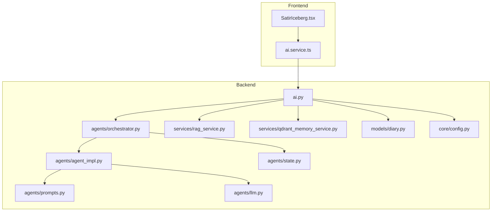
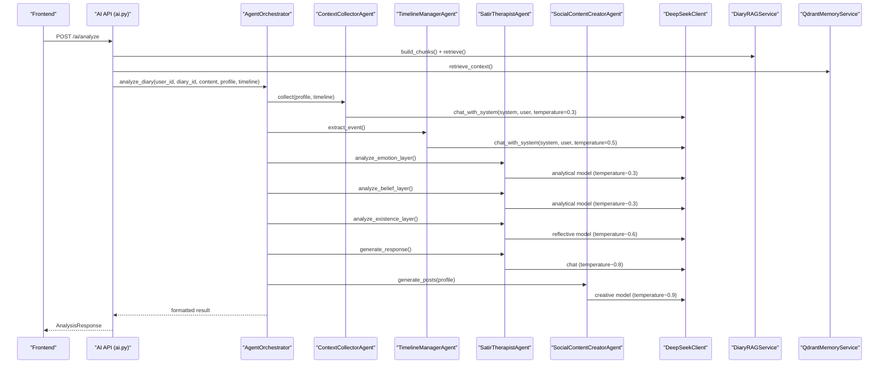
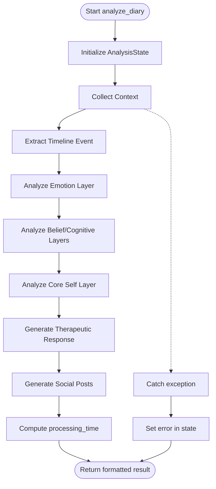
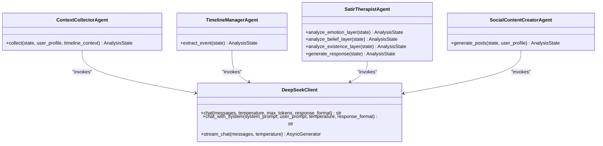
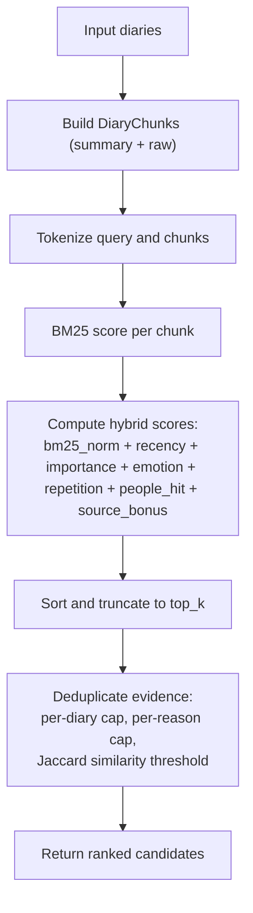
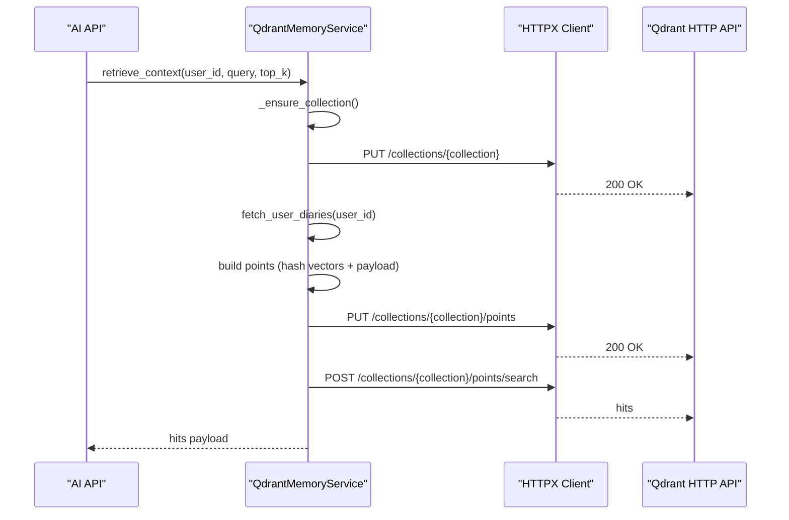
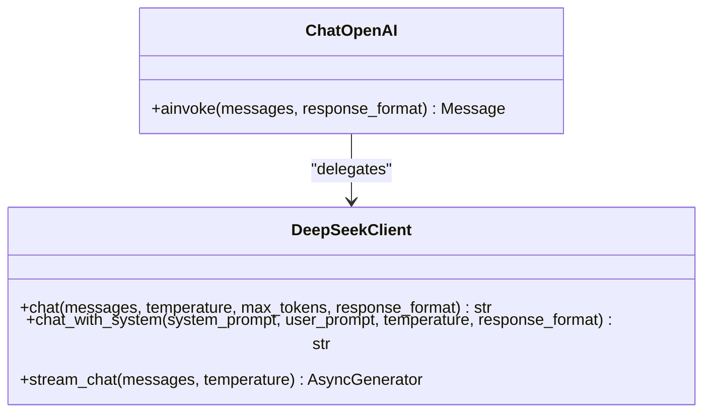
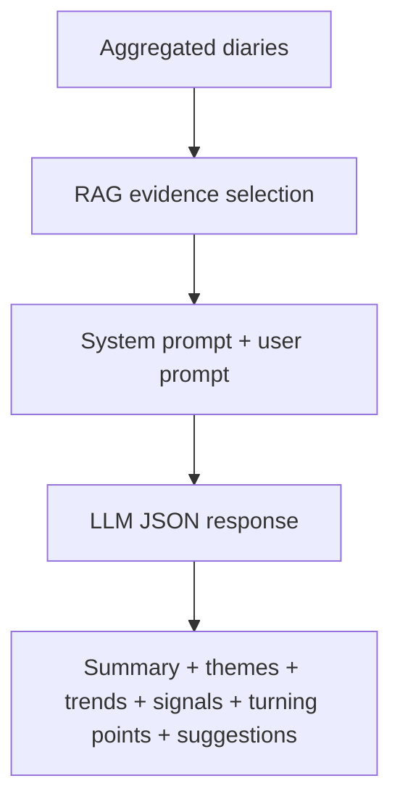
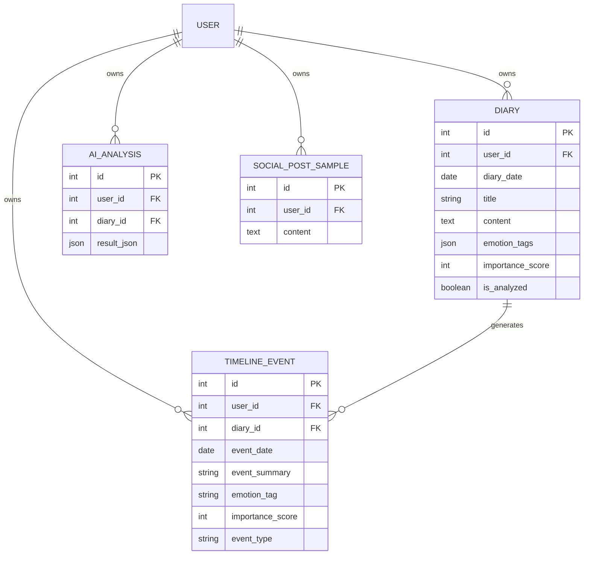
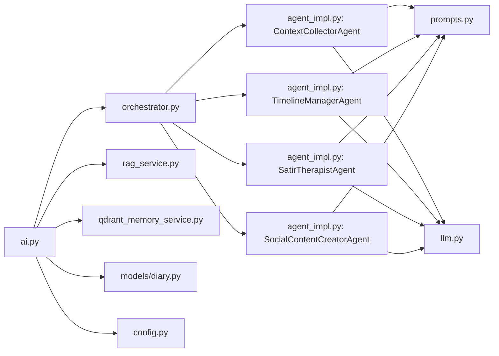

# AI and Machine Learning

<cite>
**Referenced Files in This Document**
- [orchestrator.py](file://backend/app/agents/orchestrator.py)
- [agent_impl.py](file://backend/app/agents/agent_impl.py)
- [prompts.py](file://backend/app/agents/prompts.py)
- [state.py](file://backend/app/agents/state.py)
- [llm.py](file://backend/app/agents/llm.py)
- [rag_service.py](file://backend/app/services/rag_service.py)
- [qdrant_memory_service.py](file://backend/app/services/qdrant_memory_service.py)
- [ai.py](file://backend/app/api/v1/ai.py)
- [config.py](file://backend/app/core/config.py)
- [diary.py](file://backend/app/models/diary.py)
- [ai.service.ts](file://frontend/src/services/ai.service.ts)
- [SatirIceberg.tsx](file://frontend/src/pages/analysis/SatirIceberg.tsx)
</cite>

## Table of Contents
1. [Introduction](#introduction)
2. [Project Structure](#project-structure)
3. [Core Components](#core-components)
4. [Architecture Overview](#architecture-overview)
5. [Detailed Component Analysis](#detailed-component-analysis)
6. [Dependency Analysis](#dependency-analysis)
7. [Performance Considerations](#performance-considerations)
8. [Troubleshooting Guide](#troubleshooting-guide)
9. [Conclusion](#conclusion)
10. [Appendices](#appendices)

## Introduction
This document explains the AI and machine learning subsystems of the YINJI application. It covers the multi-agent orchestration pipeline, psychological analysis models (based on the Satir Iceberg framework), the custom Retrieval-Augmented Generation (RAG) implementation using BM25, diary chunking, evidence deduplication, and hybrid scoring. It also documents vector database integration with Qdrant for semantic memory retrieval, DeepSeek LLM integration with streaming support and temperature control, prompt engineering, context management, and model configuration. Finally, it provides guidance on performance optimization, cost management, and evaluation metrics.

## Project Structure
The AI/ML system spans backend Python services and frontend TypeScript integration:
- Backend agents orchestrate multi-step psychological analysis and content generation.
- Services implement RAG and memory retrieval.
- API endpoints expose analysis workflows and results.
- Frontend integrates with AI endpoints for user-facing features.

**Diagram sources**
- [ai.service.ts:1-112](file://frontend/src/services/ai.service.ts#L1-L112)
- [SatirIceberg.tsx:1-216](file://frontend/src/pages/analysis/SatirIceberg.tsx#L1-L216)
- [ai.py:1-902](file://backend/app/api/v1/ai.py#L1-L902)
- [orchestrator.py:1-176](file://backend/app/agents/orchestrator.py#L1-L176)
- [agent_impl.py:1-484](file://backend/app/agents/agent_impl.py#L1-L484)
- [prompts.py:1-244](file://backend/app/agents/prompts.py#L1-L244)
- [state.py:1-45](file://backend/app/agents/state.py#L1-L45)
- [llm.py:1-220](file://backend/app/agents/llm.py#L1-L220)
- [rag_service.py:1-360](file://backend/app/services/rag_service.py#L1-L360)
- [qdrant_memory_service.py:1-190](file://backend/app/services/qdrant_memory_service.py#L1-L190)
- [diary.py:1-186](file://backend/app/models/diary.py#L1-L186)
- [config.py:1-105](file://backend/app/core/config.py#L1-L105)

**Section sources**
- [ai.py:1-902](file://backend/app/api/v1/ai.py#L1-L902)
- [config.py:1-105](file://backend/app/core/config.py#L1-L105)

## Core Components
- Multi-Agent Orchestration: Coordinates four specialized agents for context collection, timeline extraction, Satir analysis, and social content creation.
- Psychological Analysis: Implements the Satir Iceberg model with five layers (behavior, emotion, cognition, beliefs, core self) and generates a therapeutic response.
- Custom RAG: Uses BM25 lexical matching, recency decay, importance weighting, emotion intensity, repetition penalty, entity hit bonus, and source type bonus; includes deduplication.
- Vector Memory: Integrates with Qdrant for semantic search and memory synchronization.
- DeepSeek LLM Integration: Provides synchronous and streaming chat APIs, temperature control, and JSON response formatting.
- Prompt Engineering: Structured templates for each agent and system-level guidance.
- Context Management: Aggregates user profile, timeline context, and related memories.
- Model Configuration: Centralized settings for API keys, endpoints, and vector dimensions.

**Section sources**
- [orchestrator.py:18-176](file://backend/app/agents/orchestrator.py#L18-L176)
- [agent_impl.py:92-484](file://backend/app/agents/agent_impl.py#L92-L484)
- [prompts.py:7-244](file://backend/app/agents/prompts.py#L7-L244)
- [rag_service.py:147-360](file://backend/app/services/rag_service.py#L147-L360)
- [qdrant_memory_service.py:45-190](file://backend/app/services/qdrant_memory_service.py#L45-L190)
- [llm.py:13-220](file://backend/app/agents/llm.py#L13-L220)
- [ai.py:267-404](file://backend/app/api/v1/ai.py#L267-L404)
- [config.py:62-89](file://backend/app/core/config.py#L62-L89)

## Architecture Overview
The system follows a modular pipeline:
- API layer receives requests and orchestrates workflows.
- Orchestration layer sequences agents and manages shared state.
- Agents consume structured prompts and invoke the LLM client.
- Retrieval services augment context via BM25 and Qdrant.
- Results are persisted and returned to the frontend.

**Diagram sources**
- [ai.py:406-639](file://backend/app/api/v1/ai.py#L406-L639)
- [orchestrator.py:27-131](file://backend/app/agents/orchestrator.py#L27-L131)
- [agent_impl.py:92-484](file://backend/app/agents/agent_impl.py#L92-L484)
- [llm.py:13-220](file://backend/app/agents/llm.py#L13-L220)
- [rag_service.py:147-360](file://backend/app/services/rag_service.py#L147-L360)
- [qdrant_memory_service.py:175-186](file://backend/app/services/qdrant_memory_service.py#L175-L186)

## Detailed Component Analysis

### Multi-Agent Orchestration
- Responsibilities:
  - Initialize and coordinate four agents.
  - Manage shared AnalysisState across steps.
  - Aggregate results and compute processing time.
- Control flow:
  - Context collection → Timeline extraction → Satir analysis (emotion → belief/cognition → existence) → Therapeutic response → Social posts generation.
- Error handling:
  - Catches exceptions, records error in state, and returns partial results.

**Diagram sources**
- [orchestrator.py:27-131](file://backend/app/agents/orchestrator.py#L27-L131)

**Section sources**
- [orchestrator.py:18-176](file://backend/app/agents/orchestrator.py#L18-L176)
- [state.py:10-45](file://backend/app/agents/state.py#L10-L45)

### Specialized Agents and Prompt Engineering
- ContextCollectorAgent:
  - Purpose: Consolidate user profile and timeline context.
  - Temperature: 0.3 for deterministic JSON output.
  - Prompt: CONTEXT_COLLECTOR_PROMPT.
- TimelineManagerAgent:
  - Purpose: Extract structured timeline events from diary content.
  - Temperature: 0.5 for balanced creativity.
  - Prompt: TIMELINE_EXTRACTOR_PROMPT.
- SatirTherapistAgent:
  - Emotion layer: 0.3 analytical model.
  - Belief/cognitive layers: 0.3 analytical model.
  - Existence layer: 0.6 reflective model.
  - Response: 0.8 for empathetic synthesis.
  - Prompts: SATIR_EMOTION_PROMPT, SATIR_BELIEF_PROMPT, SATIR_EXISTENCE_PROMPT, SATIR_RESPONDER_PROMPT.
- SocialContentCreatorAgent:
  - Purpose: Generate multiple social media post variants.
  - Temperature: 0.9 creative.
  - Prompt: SOCIAL_POST_CREATOR_PROMPT.

**Diagram sources**
- [agent_impl.py:92-484](file://backend/app/agents/agent_impl.py#L92-L484)
- [prompts.py:7-244](file://backend/app/agents/prompts.py#L7-L244)
- [llm.py:13-220](file://backend/app/agents/llm.py#L13-L220)

**Section sources**
- [agent_impl.py:92-484](file://backend/app/agents/agent_impl.py#L92-L484)
- [prompts.py:7-244](file://backend/app/agents/prompts.py#L7-L244)
- [llm.py:13-220](file://backend/app/agents/llm.py#L13-L220)

### Custom RAG Implementation (BM25 + Hybrid Scoring)
- DiaryChunk model captures:
  - Diary ID/date, title, snippet text, source type (summary/raw), importance, emotion tags/intensity, people, theme key, token frequency, length.
- Chunking:
  - Splits content into overlapping segments respecting sentence boundaries.
  - Builds a summary chunk per diary with metadata.
- BM25 scoring:
  - Computes IDF and TF with k1/b smoothing.
  - Normalizes by average document length.
- Hybrid ranking factors:
  - Recency decay (days ago), importance (0–1), emotion intensity (0–1), repetition penalty per theme, people hit bonus, source bonus (summary).
- Deduplication:
  - Limits per diary and per reason category.
  - Uses Jaccard similarity on token sets to suppress near-duplicates.

**Diagram sources**
- [rag_service.py:147-360](file://backend/app/services/rag_service.py#L147-L360)

**Section sources**
- [rag_service.py:15-360](file://backend/app/services/rag_service.py#L15-L360)

### Vector Database Integration with Qdrant
- QdrantDiaryMemoryService:
  - Ensures collection exists with cosine distance.
  - Hashes tokens to produce sparse vectors (dimension configurable).
  - Upserts diary vectors with payload (user_id, diary_id, date, title, snippet, emotion_tags, importance).
  - Searches with user filter and returns structured hits.
  - retrieve_context() synchronizes user diaries then searches.
- Configuration:
  - Host, API key, collection name, vector dimension.

**Diagram sources**
- [qdrant_memory_service.py:45-186](file://backend/app/services/qdrant_memory_service.py#L45-L186)
- [config.py:72-89](file://backend/app/core/config.py#L72-L89)

**Section sources**
- [qdrant_memory_service.py:45-190](file://backend/app/services/qdrant_memory_service.py#L45-L190)
- [config.py:72-89](file://backend/app/core/config.py#L72-L89)

### DeepSeek LLM Integration, Streaming, and Configuration
- DeepSeekClient:
  - chat(): synchronous completion with optional JSON response format.
  - chat_with_system(): convenience wrapper.
  - stream_chat(): streaming generator yielding token deltas.
- ChatOpenAI compatibility:
  - Adapter to LangChain-like interface for agent invocations.
- Model configuration:
  - Base URL and API key from settings.
  - Model name configured in client.

**Diagram sources**
- [llm.py:13-220](file://backend/app/agents/llm.py#L13-L220)
- [config.py:62-71](file://backend/app/core/config.py#L62-L71)

**Section sources**
- [llm.py:13-220](file://backend/app/agents/llm.py#L13-L220)
- [config.py:62-71](file://backend/app/core/config.py#L62-L71)

### Psychological Analysis: Satir Iceberg Framework
- Five-layer model:
  - Behavior: Observable actions/events.
  - Emotion: Surface vs underlying emotions.
  - Cognition: Irrational beliefs and automatic thoughts.
  - Belief: Core beliefs and life rules.
  - Core Self: Yearnings, life energy, deepest desire.
- Multi-day analysis:
  - API endpoint aggregates multiple diaries and performs comprehensive thematic analysis using RAG evidence.
  - Outputs structured insights and suggestions.

**Diagram sources**
- [ai.py:267-404](file://backend/app/api/v1/ai.py#L267-L404)

**Section sources**
- [agent_impl.py:205-394](file://backend/app/agents/agent_impl.py#L205-L394)
- [prompts.py:60-164](file://backend/app/agents/prompts.py#L60-L164)
- [ai.py:267-404](file://backend/app/api/v1/ai.py#L267-L404)

### Context Management and Data Models
- AnalysisState defines the shared state across agents.
- Diary, TimelineEvent, AIAnalysis, SocialPostSample models persist results and context.
- API endpoints construct user profiles, timeline contexts, and integrate with persistence.

**Diagram sources**
- [diary.py:29-154](file://backend/app/models/diary.py#L29-L154)

**Section sources**
- [state.py:10-45](file://backend/app/agents/state.py#L10-L45)
- [diary.py:29-154](file://backend/app/models/diary.py#L29-L154)
- [ai.py:520-632](file://backend/app/api/v1/ai.py#L520-L632)

### Frontend Integration
- ai.service.ts exposes typed endpoints for analysis, social posts, comprehensive analysis, daily guidance, and result retrieval.
- SatirIceberg.tsx renders the five-layer Satir analysis visually.

**Section sources**
- [ai.service.ts:1-112](file://frontend/src/services/ai.service.ts#L1-L112)
- [SatirIceberg.tsx:1-216](file://frontend/src/pages/analysis/SatirIceberg.tsx#L1-L216)

## Dependency Analysis
- Internal dependencies:
  - Orchestrator depends on agents and state.
  - Agents depend on prompts and LLM client.
  - API depends on orchestrator, RAG, Qdrant, and models.
- External dependencies:
  - httpx for asynchronous HTTP calls.
  - SQLAlchemy for ORM and database operations.
  - Pydantic settings for configuration.

**Diagram sources**
- [ai.py:1-902](file://backend/app/api/v1/ai.py#L1-L902)
- [orchestrator.py:1-176](file://backend/app/agents/orchestrator.py#L1-L176)
- [agent_impl.py:1-484](file://backend/app/agents/agent_impl.py#L1-L484)
- [prompts.py:1-244](file://backend/app/agents/prompts.py#L1-L244)
- [llm.py:1-220](file://backend/app/agents/llm.py#L1-L220)
- [rag_service.py:1-360](file://backend/app/services/rag_service.py#L1-L360)
- [qdrant_memory_service.py:1-190](file://backend/app/services/qdrant_memory_service.py#L1-L190)
- [diary.py:1-186](file://backend/app/models/diary.py#L1-L186)
- [config.py:1-105](file://backend/app/core/config.py#L1-L105)

**Section sources**
- [ai.py:1-902](file://backend/app/api/v1/ai.py#L1-L902)
- [orchestrator.py:1-176](file://backend/app/agents/orchestrator.py#L1-L176)
- [agent_impl.py:1-484](file://backend/app/agents/agent_impl.py#L1-L484)

## Performance Considerations
- Tokenization and BM25:
  - Use efficient tokenization and precompute token frequencies to reduce repeated work.
  - Tune k1 and b parameters for domain characteristics.
- Hybrid scoring weights:
  - Adjust factor weights to emphasize recency/importance/emotion/repetition according to user goals.
- Deduplication thresholds:
  - Increase similarity threshold to reduce noise; tighten per-diary/per-reason caps to control cardinality.
- Qdrant:
  - Keep collection synchronized before search to avoid stale results.
  - Limit top_k to reduce latency while preserving recall.
- LLM calls:
  - Prefer JSON response_format for agents requiring structured outputs.
  - Use lower temperatures for deterministic JSON parsing.
  - Stream responses for long-form content to improve perceived latency.
- Cost management:
  - Monitor token usage per request; cache frequent queries where safe.
  - Cap max_tokens and window_days to control costs.
- Evaluation metrics:
  - Human evaluation: coherence, helpfulness, alignment with Satir framework.
  - Automated: BLEU/ROUGE for social posts; precision/recall on timeline event extraction; clustering coherence for multi-day themes.

[No sources needed since this section provides general guidance]

## Troubleshooting Guide
- LLM response parsing failures:
  - Agents include robust JSON extraction helpers; fallbacks populate default structures when parsing fails.
- Missing or empty results:
  - Verify API keys and base URLs in configuration.
  - Ensure Qdrant collection exists and vectors are up-to-date.
- Empty or degraded RAG results:
  - Confirm chunk building and retrieval parameters (top_k, source_types).
  - Review deduplication thresholds and candidate counts.
- Persistence errors:
  - API persists timeline events and analysis results; rollback warnings are included in metadata when persistence fails.

**Section sources**
- [agent_impl.py:25-68](file://backend/app/agents/agent_impl.py#L25-L68)
- [agent_impl.py:136-141](file://backend/app/agents/agent_impl.py#L136-L141)
- [qdrant_memory_service.py:175-186](file://backend/app/services/qdrant_memory_service.py#L175-L186)
- [rag_service.py:319-357](file://backend/app/services/rag_service.py#L319-L357)
- [ai.py:587-631](file://backend/app/api/v1/ai.py#L587-L631)

## Conclusion
The YINJI AI/ML system combines a modular multi-agent pipeline with psychological modeling, a custom BM25-based RAG, and vector memory retrieval. It integrates DeepSeek for flexible, controllable reasoning and content generation, while maintaining strong context management and persistence. The architecture supports both single-diary Satir analysis and multi-day comprehensive insights, enabling personalized growth guidance and social content generation.

[No sources needed since this section summarizes without analyzing specific files]

## Appendices

### Prompt Templates Reference
- Context Collector: [CONTEXT_COLLECTOR_PROMPT:9-28](file://backend/app/agents/prompts.py#L9-L28)
- Timeline Extractor: [TIMELINE_EXTRACTOR_PROMPT:33-57](file://backend/app/agents/prompts.py#L33-L57)
- Satir Emotion: [SATIR_EMOTION_PROMPT:62-83](file://backend/app/agents/prompts.py#L62-L83)
- Satir Belief: [SATIR_BELIEF_PROMPT:86-112](file://backend/app/agents/prompts.py#L86-L112)
- Satir Existence: [SATIR_EXISTENCE_PROMPT:115-136](file://backend/app/agents/prompts.py#L115-L136)
- Satir Responder: [SATIR_RESPONDER_PROMPT:139-163](file://backend/app/agents/prompts.py#L139-L163)
- Social Creator: [SOCIAL_POST_CREATOR_PROMPT:168-208](file://backend/app/agents/prompts.py#L168-L208)
- System Analyst: [SYSTEM_PROMPT_ANALYST:213-227](file://backend/app/agents/prompts.py#L213-L227)
- System Social: [SYSTEM_PROMPT_SOCIAL:229-243](file://backend/app/agents/prompts.py#L229-L243)

### Configuration Keys
- DeepSeek: [deepseek_api_key:63-70](file://backend/app/core/config.py#L63-L70)
- Qdrant: [qdrant_url, qdrant_api_key, qdrant_collection, qdrant_vector_dim:72-89](file://backend/app/core/config.py#L72-L89)