# Large Language Model Integration

<cite>
**Referenced Files in This Document**
- [llm.py](file://backend/app/agents/llm.py)
- [prompts.py](file://backend/app/agents/prompts.py)
- [state.py](file://backend/app/agents/state.py)
- [agent_impl.py](file://backend/app/agents/agent_impl.py)
- [orchestrator.py](file://backend/app/agents/orchestrator.py)
- [config.py](file://backend/app/core/config.py)
- [ai.py](file://backend/app/api/v1/ai.py)
- [ai.service.ts](file://frontend/src/services/ai.service.ts)
- [api.ts](file://frontend/src/services/api.ts)
- [main.py](file://backend/main.py)
- [requirements.txt](file://backend/requirements.txt)
- [rag_service.py](file://backend/app/services/rag_service.py)
- [diary.py](file://backend/app/models/diary.py)
</cite>

## Table of Contents
1. [Introduction](#introduction)
2. [Project Structure](#project-structure)
3. [Core Components](#core-components)
4. [Architecture Overview](#architecture-overview)
5. [Detailed Component Analysis](#detailed-component-analysis)
6. [Dependency Analysis](#dependency-analysis)
7. [Performance Considerations](#performance-considerations)
8. [Troubleshooting Guide](#troubleshooting-guide)
9. [Conclusion](#conclusion)
10. [Appendices](#appendices)

## Introduction
This document explains the DeepSeek LLM integration and API client implementation powering the AI analysis features. It covers streaming response handling, temperature control, error handling, prompt engineering (context injection, role-playing templates, instruction formatting), message history management, conversation state preservation, context window optimization, client configuration, rate limiting, retry mechanisms, examples of prompt templates, model parameter tuning, response parsing, cost optimization via token management and caching, and troubleshooting/performance guidance.

## Project Structure
The AI analysis pipeline spans backend agents and prompts, an orchestration layer, FastAPI endpoints, and frontend services. The LLM client integrates directly with DeepSeek’s chat completions endpoint and supports both regular and streaming responses.

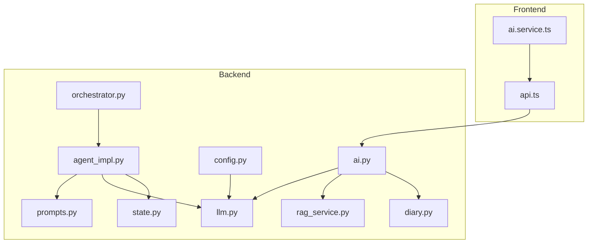

**Diagram sources**
- [ai.service.ts:1-112](file://frontend/src/services/ai.service.ts#L1-L112)
- [api.ts:1-43](file://frontend/src/services/api.ts#L1-L43)
- [ai.py:1-902](file://backend/app/api/v1/ai.py#L1-L902)
- [config.py:1-105](file://backend/app/core/config.py#L1-L105)
- [llm.py:1-220](file://backend/app/agents/llm.py#L1-L220)
- [prompts.py:1-244](file://backend/app/agents/prompts.py#L1-L244)
- [state.py:1-45](file://backend/app/agents/state.py#L1-L45)
- [agent_impl.py:1-484](file://backend/app/agents/agent_impl.py#L1-L484)
- [orchestrator.py:1-176](file://backend/app/agents/orchestrator.py#L1-L176)
- [rag_service.py:1-360](file://backend/app/services/rag_service.py#L1-L360)
- [diary.py:1-186](file://backend/app/models/diary.py#L1-L186)

**Section sources**
- [main.py:1-119](file://backend/main.py#L1-L119)
- [requirements.txt:1-26](file://backend/requirements.txt#L1-L26)

## Core Components
- DeepSeek API client with synchronous-like async interface, supporting non-streaming and streaming chat completions.
- Prompt templates for context collection, timeline extraction, Satir iceberg analysis (five layers), and social content creation.
- Agent orchestration coordinating multiple specialized agents with typed state management.
- FastAPI endpoints integrating RAG and LLM calls, with JSON-safe parsing and robust error handling.
- Frontend service wrappers around API endpoints.

Key capabilities:
- Streaming response handling via server-sent events-like lines for incremental token yields.
- Temperature control per agent and per-request to balance creativity vs determinism.
- JSON response formatting enforcement for structured outputs.
- Conversation state preservation across steps and retries with fallbacks.
- Context window optimization via RAG chunking and weighted retrieval.

**Section sources**
- [llm.py:13-220](file://backend/app/agents/llm.py#L13-L220)
- [prompts.py:1-244](file://backend/app/agents/prompts.py#L1-L244)
- [agent_impl.py:1-484](file://backend/app/agents/agent_impl.py#L1-L484)
- [orchestrator.py:18-176](file://backend/app/agents/orchestrator.py#L18-L176)
- [ai.py:1-902](file://backend/app/api/v1/ai.py#L1-L902)

## Architecture Overview
The system composes a multi-agent workflow orchestrated by a central orchestrator. Agents consume prompts and call the DeepSeek client, which interacts with the DeepSeek API. For user-integrated analysis, RAG retrieves relevant diary chunks and builds a context window before invoking the LLM.

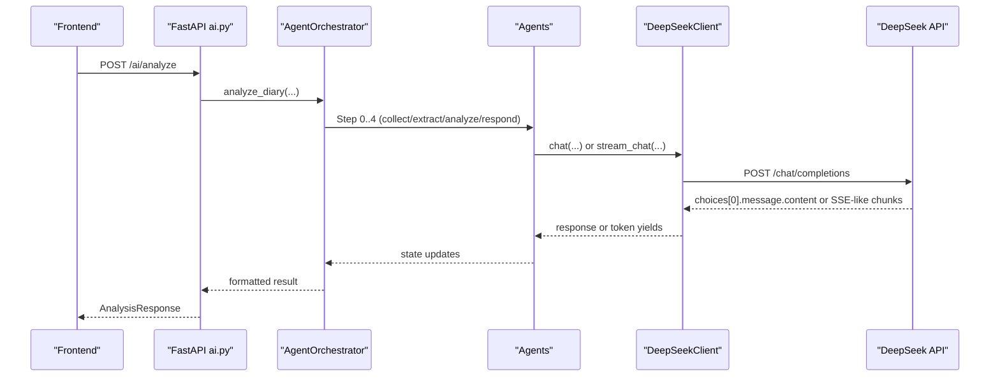

**Diagram sources**
- [ai.py:406-638](file://backend/app/api/v1/ai.py#L406-L638)
- [orchestrator.py:27-131](file://backend/app/agents/orchestrator.py#L27-L131)
- [agent_impl.py:92-484](file://backend/app/agents/agent_impl.py#L92-L484)
- [llm.py:21-146](file://backend/app/agents/llm.py#L21-L146)

## Detailed Component Analysis

### DeepSeek API Client
- Non-streaming chat: constructs payload with model, messages, temperature, max_tokens, and optional JSON response format; raises on HTTP errors and returns the assistant’s content.
- Streaming chat: enables stream mode, iterates response lines, filters data lines, parses JSON chunks, and yields delta content increments.
- Compatibility shim: ChatOpenAI wrapper adapts langchain-like messages to system/user roles and delegates to the DeepSeek client.

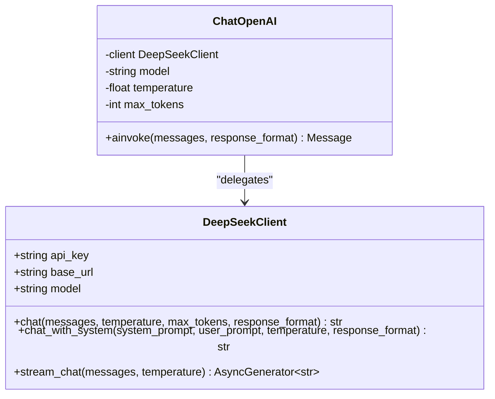

**Diagram sources**
- [llm.py:13-220](file://backend/app/agents/llm.py#L13-L220)

**Section sources**
- [llm.py:21-146](file://backend/app/agents/llm.py#L21-L146)

### Prompt Engineering and Templates
- Context Collector: injects user profile, timeline context, and current diary content; requests JSON output.
- Timeline Extractor: extracts concise event summaries, emotion tags, importance scores, and entities; requests JSON output.
- Satir Emotion/Belief/Existence: layered psychological analysis prompts with explicit JSON schemas and guidance.
- Satir Responder: generates warm, structured therapeutic replies using the full five-layer analysis.
- Social Post Creator: generates multiple variants of social media posts aligned with user style and emotion tags.

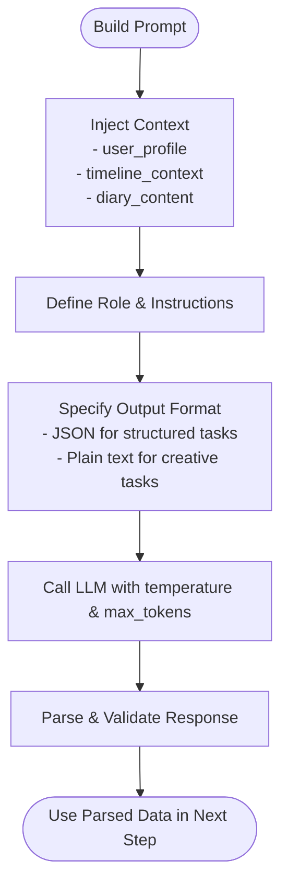

**Diagram sources**
- [prompts.py:1-244](file://backend/app/agents/prompts.py#L1-L244)
- [agent_impl.py:25-68](file://backend/app/agents/agent_impl.py#L25-L68)

**Section sources**
- [prompts.py:7-244](file://backend/app/agents/prompts.py#L7-L244)
- [agent_impl.py:25-68](file://backend/app/agents/agent_impl.py#L25-L68)

### Agent Orchestration and State Management
- Orchestrator coordinates four major steps: context collection, timeline extraction, Satir analysis (emotion/belief/existence), and therapeutic response generation, followed by social content creation.
- Typed state carries inputs, intermediate artifacts, and metadata; agents update state and record run metrics and errors.
- Fallbacks ensure resilience: degraded outputs when LLM fails, default events, and simplified responses.

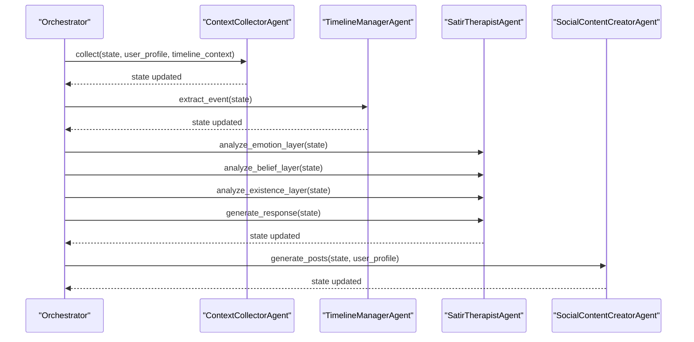

**Diagram sources**
- [orchestrator.py:27-131](file://backend/app/agents/orchestrator.py#L27-L131)
- [agent_impl.py:92-484](file://backend/app/agents/agent_impl.py#L92-L484)
- [state.py:10-45](file://backend/app/agents/state.py#L10-L45)

**Section sources**
- [orchestrator.py:18-176](file://backend/app/agents/orchestrator.py#L18-L176)
- [agent_impl.py:92-484](file://backend/app/agents/agent_impl.py#L92-L484)
- [state.py:10-45](file://backend/app/agents/state.py#L10-L45)

### Streaming Response Handling
- The client sets stream=True and reads response lines incrementally.
- Skips non-data lines, stops on [DONE], parses JSON chunks, and yields delta content.
- The frontend consumes these incremental tokens to render live responses.

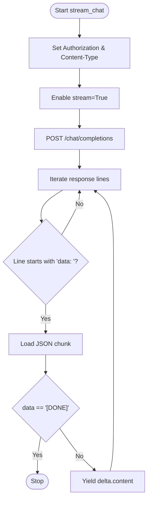

**Diagram sources**
- [llm.py:94-146](file://backend/app/agents/llm.py#L94-L146)

**Section sources**
- [llm.py:94-146](file://backend/app/agents/llm.py#L94-L146)
- [ai.service.ts:14-112](file://frontend/src/services/ai.service.ts#L14-L112)

### Temperature Control Mechanisms
- Global presets: analytical_llm (low temperature), creative_llm (high temperature), default (balanced).
- Per-task overrides: endpoints specify temperatures for guidance questions and comprehensive analysis.
- Agent-specific defaults: context collector low, timeline manager moderate, Satir therapists tuned per layer.

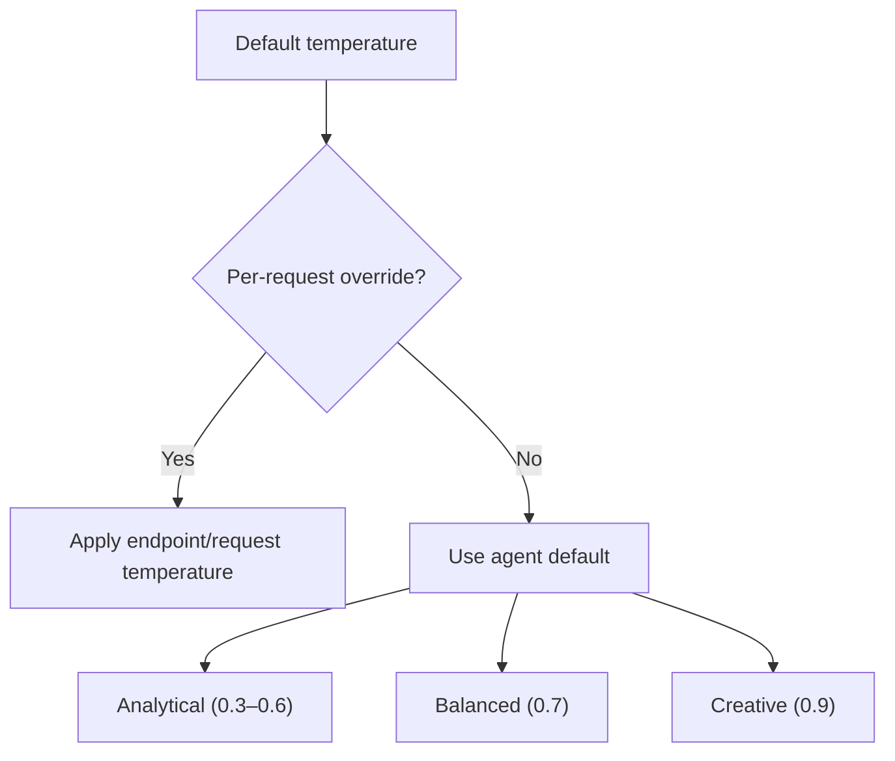

**Diagram sources**
- [llm.py:202-220](file://backend/app/agents/llm.py#L202-L220)
- [agent_impl.py:96,148,209-212,400](file://backend/app/agents/agent_impl.py#L96,L148,L209-L212,L400)
- [ai.py:108-125,180-206,373-403](file://backend/app/api/v1/ai.py#L108-L125,L180-L206,L373-L403)

**Section sources**
- [llm.py:202-220](file://backend/app/agents/llm.py#L202-L220)
- [agent_impl.py:96,148,209-212,400](file://backend/app/agents/agent_impl.py#L96,L148,L209-L212,L400)
- [ai.py:108-125,180-206,373-403](file://backend/app/api/v1/ai.py#L108-L125,L180-L206,L373-L403)

### Error Handling Strategies
- LLM client: raises on HTTP errors; streaming ignores malformed lines and continues.
- Agent parsing: robust JSON extraction supporting raw JSON, fenced code blocks, and incremental decode.
- Endpoint handlers: safe JSON parsing with fallbacks; graceful degradation with default answers; persistent warnings in metadata.
- Frontend: centralized axios interceptor handles 401 globally.

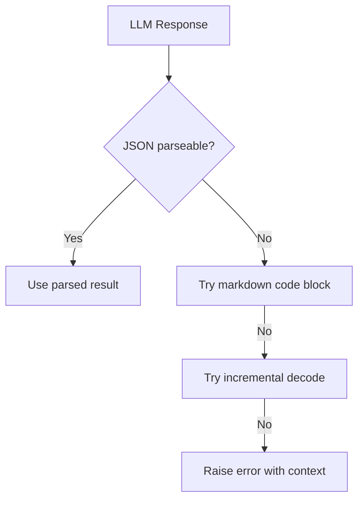

**Diagram sources**
- [agent_impl.py:25-68](file://backend/app/agents/agent_impl.py#L25-L68)
- [ai.py:34-65](file://backend/app/api/v1/ai.py#L34-L65)

**Section sources**
- [llm.py:121-146](file://backend/app/agents/llm.py#L121-L146)
- [agent_impl.py:25-68](file://backend/app/agents/agent_impl.py#L25-L68)
- [ai.py:34-65,121-125,200-206,380-384](file://backend/app/api/v1/ai.py#L34-L65,L121-L125,L200-L206,L380-L384)
- [api.ts:28-40](file://frontend/src/services/api.ts#L28-L40)

### Message History Management and Conversation State Preservation
- LangGraph-style MessagesState defines typed keys for user_id, diary_id, content, context, analysis layers, and metadata.
- Orchestrator initializes state and advances current_step; agents append agent_runs with timing and outcomes.
- Results are persisted to AIAnalysis and TimelineEvent tables for later retrieval and reuse.

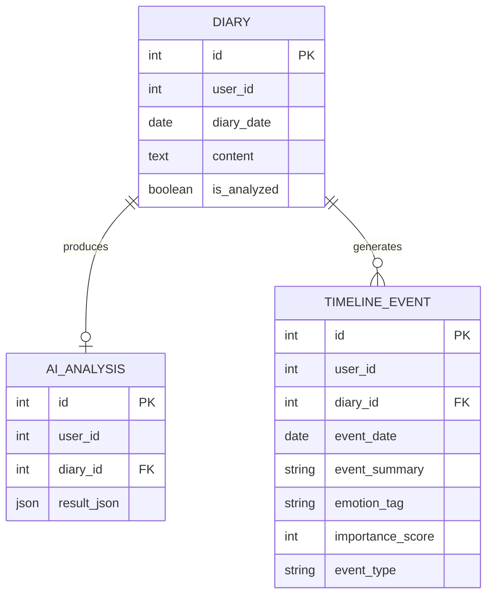

**Diagram sources**
- [diary.py:29-132](file://backend/app/models/diary.py#L29-L132)
- [state.py:10-45](file://backend/app/agents/state.py#L10-L45)

**Section sources**
- [state.py:10-45](file://backend/app/agents/state.py#L10-L45)
- [diary.py:29-132](file://backend/app/models/diary.py#L29-L132)
- [ai.py:542-631](file://backend/app/api/v1/ai.py#L542-L631)

### Context Window Optimization
- RAG service splits diary content into overlapping chunks, computes BM25-like scores, and applies recency, importance, emotion intensity, repetition, and people hit bonuses.
- Deduplication reduces redundancy while respecting per-reason and per-diary limits.
- Endpoints cap content lengths and combine multiple diaries into a single integrated context window.

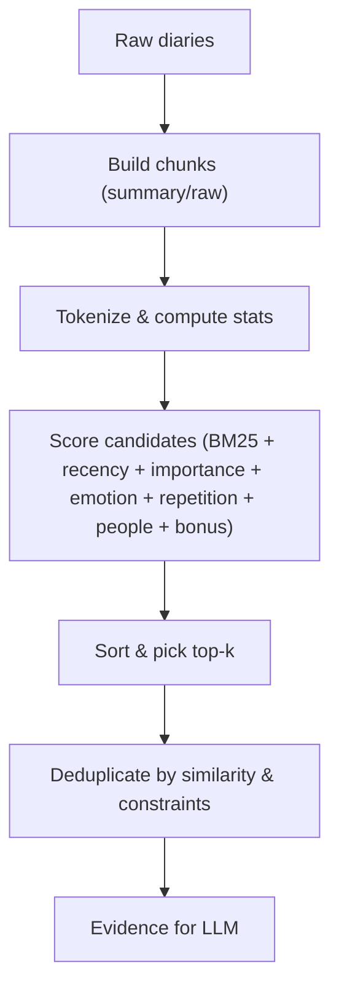

**Diagram sources**
- [rag_service.py:147-357](file://backend/app/services/rag_service.py#L147-L357)
- [ai.py:267-403](file://backend/app/api/v1/ai.py#L267-L403)

**Section sources**
- [rag_service.py:147-357](file://backend/app/services/rag_service.py#L147-L357)
- [ai.py:267-403](file://backend/app/api/v1/ai.py#L267-L403)

### API Client Configuration, Rate Limiting, and Retry Mechanisms
- Configuration: API key and base URL loaded from environment via pydantic settings.
- HTTP client: httpx.AsyncClient with timeouts; streaming uses client.stream with per-line iteration.
- Rate limiting and retries: not implemented in the client; production deployments should add circuit breakers, exponential backoff, and quotas at the gateway or proxy layer.

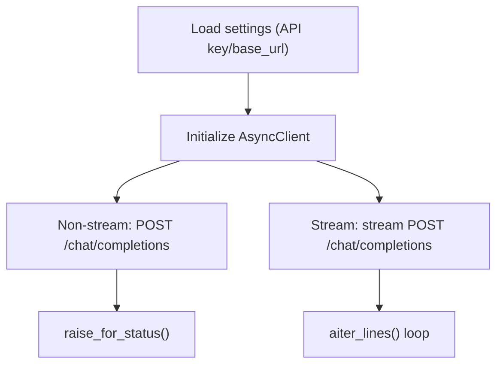

**Diagram sources**
- [config.py:62-71](file://backend/app/core/config.py#L62-L71)
- [llm.py:57-66,121-142](file://backend/app/agents/llm.py#L57-L66,L121-L142)

**Section sources**
- [config.py:62-71](file://backend/app/core/config.py#L62-L71)
- [llm.py:57-66,121-142](file://backend/app/agents/llm.py#L57-L66,L121-L142)

### Examples of Prompt Templates and Model Parameter Tuning
- Title suggestion: concise, non-verbose Chinese title generation with strict formatting.
- Daily guidance: personalized writing prompt with JSON output and fallbacks.
- Comprehensive analysis: RAG-driven synthesis with multiple themes and suggestions.
- Satir analysis: five-layer psychological breakdown with structured JSON outputs.
- Social posts: multiple variants tailored to user style and emotion tags.

Parameter tuning examples:
- Guidance questions: temperature 0.75 for balanced creativity.
- Comprehensive analysis: temperature 0.4 for focused synthesis.
- Context collection: temperature 0.3 for factual JSON.
- Social content: temperature 0.9 for creative variants.

**Section sources**
- [ai.py:83-125,128-206,267-403](file://backend/app/api/v1/ai.py#L83-L125,L128-L206,L267-L403)
- [prompts.py:7-244](file://backend/app/agents/prompts.py#L7-L244)
- [agent_impl.py:96,148,209-212,400](file://backend/app/agents/agent_impl.py#L96,L148,L209-L212,L400)

### Response Parsing and Structured Outputs
- Strict JSON parsing helpers handle raw JSON, fenced code blocks, and incremental decode.
- Endpoints enforce JSON output for structured tasks and normalize results.

**Section sources**
- [agent_impl.py:25-68](file://backend/app/agents/agent_impl.py#L25-L68)
- [ai.py:34-65,180-185,373-378](file://backend/app/api/v1/ai.py#L34-L65,L180-L185,L373-L378)

### Cost Optimization Through Token Management, Caching, and Batch Processing
- Token management: cap content lengths, summarize long diaries, and use max_tokens to bound generation.
- Caching: cache repeated analyses keyed by user_id and diary_id; serve saved results via GET endpoints.
- Batch processing: group multiple diaries into integrated windows; avoid redundant LLM calls by reusing cached results.

**Section sources**
- [ai.py:466-475,542-631](file://backend/app/api/v1/ai.py#L466-L475,L542-L631)
- [diary.py:102-132](file://backend/app/models/diary.py#L102-L132)

## Dependency Analysis
- Backend depends on FastAPI, SQLAlchemy, httpx, pydantic-settings, and pytz.
- LLM client depends on configuration settings and httpx.
- Agents depend on prompts and the LLM client.
- API endpoints depend on agents, RAG service, and persistence models.

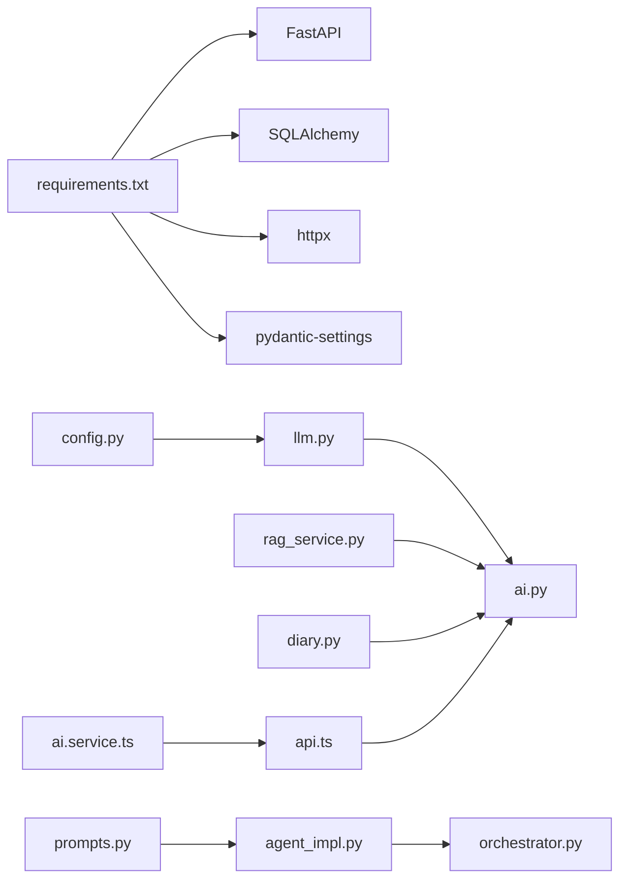

**Diagram sources**
- [requirements.txt:1-26](file://backend/requirements.txt#L1-L26)
- [config.py:1-105](file://backend/app/core/config.py#L1-L105)
- [llm.py:1-220](file://backend/app/agents/llm.py#L1-L220)
- [prompts.py:1-244](file://backend/app/agents/prompts.py#L1-L244)
- [agent_impl.py:1-484](file://backend/app/agents/agent_impl.py#L1-L484)
- [orchestrator.py:1-176](file://backend/app/agents/orchestrator.py#L1-L176)
- [rag_service.py:1-360](file://backend/app/services/rag_service.py#L1-L360)
- [diary.py:1-186](file://backend/app/models/diary.py#L1-L186)
- [ai.py:1-902](file://backend/app/api/v1/ai.py#L1-L902)
- [ai.service.ts:1-112](file://frontend/src/services/ai.service.ts#L1-L112)
- [api.ts:1-43](file://frontend/src/services/api.ts#L1-L43)

**Section sources**
- [requirements.txt:1-26](file://backend/requirements.txt#L1-L26)
- [main.py:60-87](file://backend/main.py#L60-L87)

## Performance Considerations
- Prefer streaming for long generations to improve perceived latency.
- Tune temperature per task: lower for structured outputs, higher for creative tasks.
- Cap max_tokens and input length to control costs and latency.
- Cache repeated analyses and reuse saved results.
- Use RAG to reduce context size and improve relevance.

[No sources needed since this section provides general guidance]

## Troubleshooting Guide
Common issues and remedies:
- Empty or malformed LLM responses: enable JSON response_format and use robust parsing helpers.
- Streaming interruptions: ensure client handles malformed lines and [DONE] termination.
- Endpoint failures: wrap calls with try/catch and return fallbacks; surface metadata warnings.
- Authentication errors: frontend interceptor handles 401 globally; ensure token presence.

**Section sources**
- [llm.py:121-146](file://backend/app/agents/llm.py#L121-L146)
- [agent_impl.py:25-68](file://backend/app/agents/agent_impl.py#L25-L68)
- [ai.py:121-125,200-206,380-384](file://backend/app/api/v1/ai.py#L121-L125,L200-L206,L380-L384)
- [api.ts:28-40](file://frontend/src/services/api.ts#L28-L40)

## Conclusion
The DeepSeek integration provides a flexible, resilient, and scalable foundation for multi-agent psychological analysis and social content generation. By combining structured prompts, typed state management, RAG-enhanced context windows, and careful temperature and token controls, the system balances quality, cost-efficiency, and user experience. Extending with rate limiting, retries, and caching will further harden production readiness.

[No sources needed since this section summarizes without analyzing specific files]

## Appendices

### API Endpoints Overview
- POST /ai/generate-title: concise title generation.
- GET /ai/daily-guidance: personalized writing prompt with JSON output.
- POST /ai/comprehensive-analysis: user-level RAG-driven synthesis.
- POST /ai/analyze: integrated diary analysis with five-layer Satir analysis and social posts.
- GET /ai/analyses and GET /ai/result/{diary_id}: historical analysis retrieval.

**Section sources**
- [ai.py:83-125,128-206,267-403,641-710](file://backend/app/api/v1/ai.py#L83-L125,L128-L206,L267-L403,L641-L710)