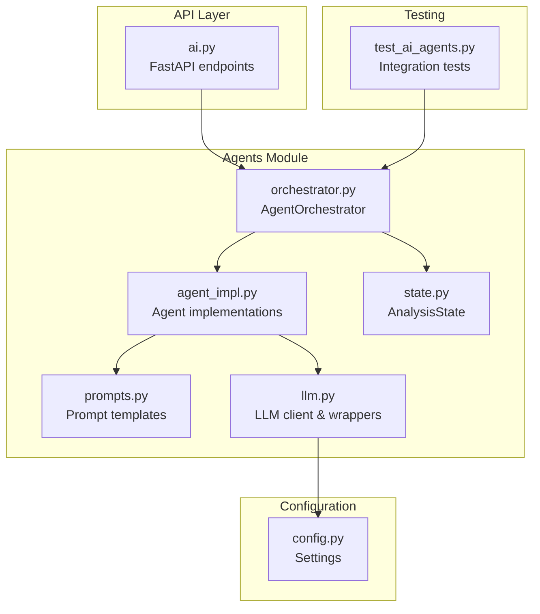
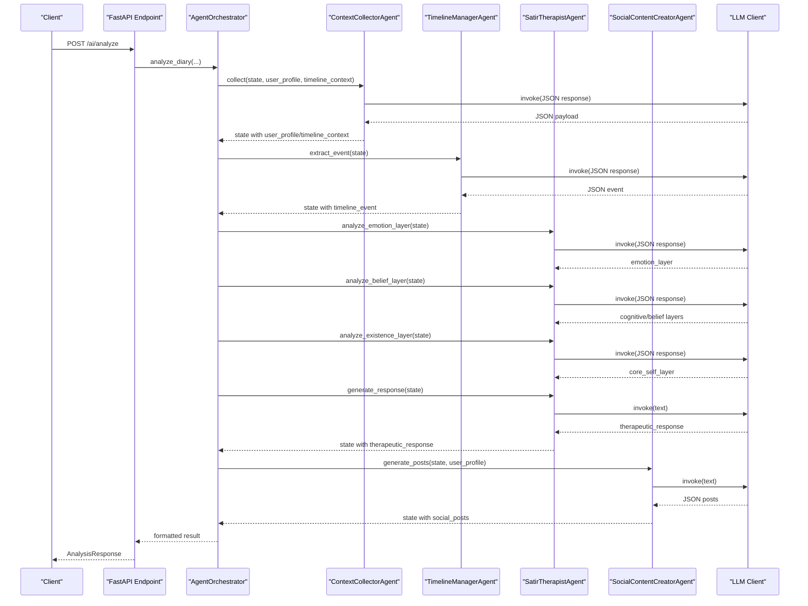
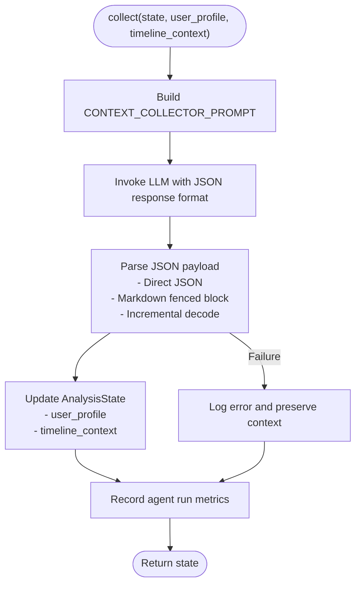
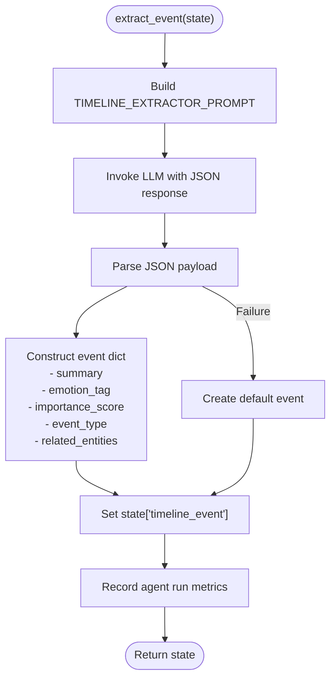
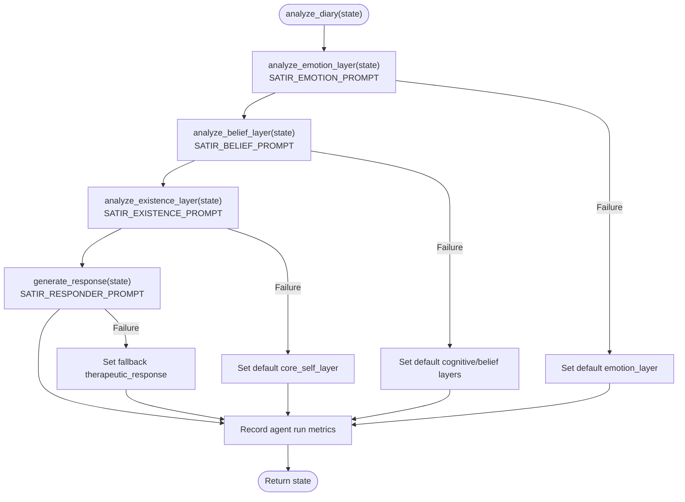
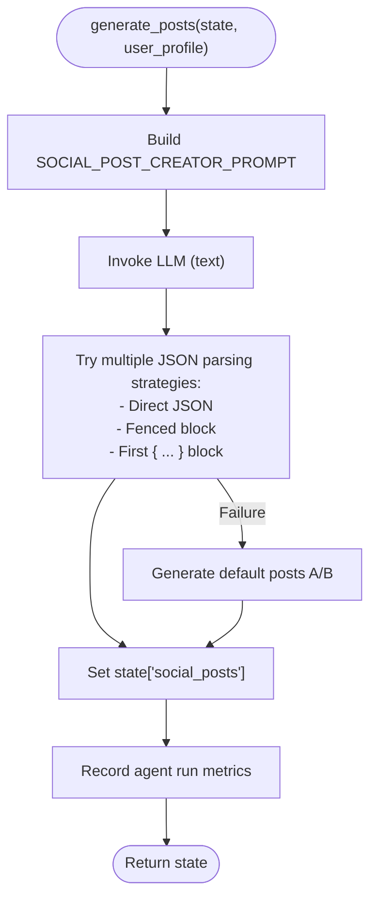
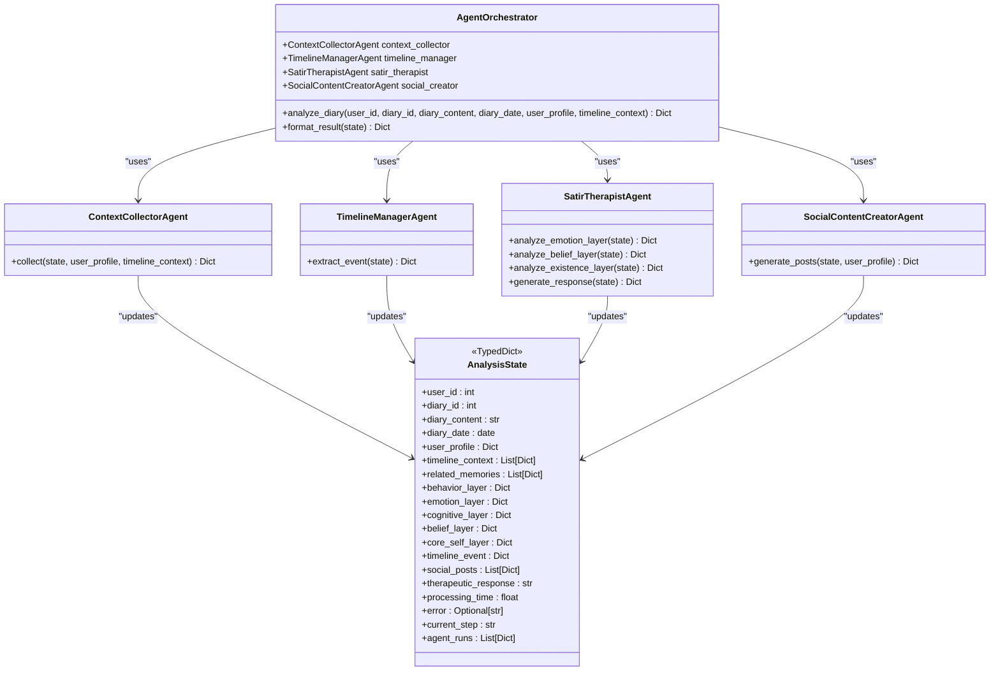
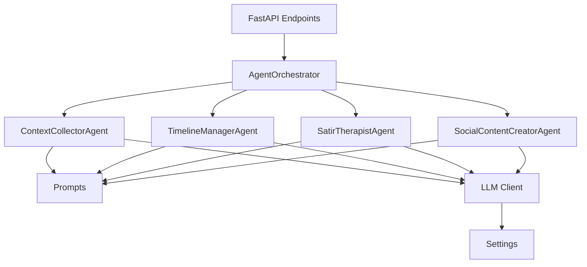

# Agent Implementations

<cite>
**Referenced Files in This Document**
- [agent_impl.py](file://backend/app/agents/agent_impl.py)
- [orchestrator.py](file://backend/app/agents/orchestrator.py)
- [state.py](file://backend/app/agents/state.py)
- [prompts.py](file://backend/app/agents/prompts.py)
- [llm.py](file://backend/app/agents/llm.py)
- [ai.py](file://backend/app/api/v1/ai.py)
- [test_ai_agents.py](file://backend/test_ai_agents.py)
- [config.py](file://backend/app/core/config.py)
- [ai.py](file://backend/app/schemas/ai.py)
</cite>

## Table of Contents
1. [Introduction](#introduction)
2. [Project Structure](#project-structure)
3. [Core Components](#core-components)
4. [Architecture Overview](#architecture-overview)
5. [Detailed Component Analysis](#detailed-component-analysis)
6. [Dependency Analysis](#dependency-analysis)
7. [Performance Considerations](#performance-considerations)
8. [Troubleshooting Guide](#troubleshooting-guide)
9. [Conclusion](#conclusion)

## Introduction
This document provides comprehensive technical documentation for the four specialized AI agent implementations that power the analysis pipeline in the application. The agents collaborate to transform user diary entries into structured insights, emotional analysis, therapeutic guidance, and social media content suggestions. The agents are:
- ContextCollectorAgent: Aggregates user profile and timeline context for holistic analysis
- TimelineManagerAgent: Extracts and structures significant events from diary content
- SatirTherapistAgent: Performs five-layer analysis using the Satir Iceberg Model (behavior, emotion, cognition, beliefs, core self)
- SocialContentCreatorAgent: Generates multiple versions of social media posts tailored to user profiles

These agents are orchestrated by a central AgentOrchestrator that coordinates their execution, manages shared state, and formats the final analysis results.

## Project Structure
The agent system resides under backend/app/agents and integrates with FastAPI endpoints under backend/app/api/v1. The orchestration and state management are implemented in Python modules, while prompts and LLM integration are encapsulated for clean separation of concerns.

**Diagram sources**
- [agent_impl.py:1-484](file://backend/app/agents/agent_impl.py#L1-L484)
- [orchestrator.py:1-176](file://backend/app/agents/orchestrator.py#L1-L176)
- [state.py:1-45](file://backend/app/agents/state.py#L1-L45)
- [prompts.py:1-244](file://backend/app/agents/prompts.py#L1-L244)
- [llm.py:1-220](file://backend/app/agents/llm.py#L1-L220)
- [ai.py:406-639](file://backend/app/api/v1/ai.py#L406-L639)
- [test_ai_agents.py:16-161](file://backend/test_ai_agents.py#L16-L161)
- [config.py:10-105](file://backend/app/core/config.py#L10-L105)

**Section sources**
- [agent_impl.py:1-484](file://backend/app/agents/agent_impl.py#L1-L484)
- [orchestrator.py:1-176](file://backend/app/agents/orchestrator.py#L1-L176)
- [state.py:1-45](file://backend/app/agents/state.py#L1-L45)
- [prompts.py:1-244](file://backend/app/agents/prompts.py#L1-L244)
- [llm.py:1-220](file://backend/app/agents/llm.py#L1-L220)
- [ai.py:406-639](file://backend/app/api/v1/ai.py#L406-L639)
- [test_ai_agents.py:16-161](file://backend/test_ai_agents.py#L16-L161)
- [config.py:10-105](file://backend/app/core/config.py#L10-L105)

## Core Components
This section outlines the responsibilities, input/output formats, and internal processing logic for each agent, along with shared interfaces and unique methods.

- ContextCollectorAgent
  - Responsibilities: Collects and consolidates user profile and timeline context into a unified state for downstream analysis.
  - Inputs: AnalysisState, user_profile dictionary, timeline_context list
  - Outputs: Updated AnalysisState with user_profile and timeline_context populated
  - Internal processing: Builds a JSON-formatted prompt using CONTEXT_COLLECTOR_PROMPT, invokes LLM with JSON response format, parses JSON payload, and updates state with collected context.
  - Unique methods: collect(state, user_profile, timeline_context)

- TimelineManagerAgent
  - Responsibilities: Extracts a structured timeline event from diary content, including summary, emotion tag, importance score, type, and related entities.
  - Inputs: AnalysisState
  - Outputs: Updated AnalysisState with timeline_event dictionary
  - Internal processing: Uses TIMELINE_EXTRACTOR_PROMPT to produce a JSON event structure, constructs an event dictionary, and sets it into state. Includes robust error handling with a default event on failure.
  - Unique methods: extract_event(state)

- SatirTherapistAgent
  - Responsibilities: Executes a five-layer analysis using the Satir Iceberg Model and generates a therapeutic response.
  - Inputs: AnalysisState
  - Outputs: Updated AnalysisState with emotion_layer, cognitive_layer, belief_layer, core_self_layer, and therapeutic_response
  - Internal processing:
    - analyze_emotion_layer: Uses SATIR_EMOTION_PROMPT to derive surface and underlying emotions and intensity.
    - analyze_belief_layer: Uses SATIR_BELIEF_PROMPT to extract irrational beliefs, automatic thoughts, core beliefs, and life rules.
    - analyze_existence_layer: Uses SATIR_EXISTENCE_PROMPT to uncover yearnings, life energy, deepest desire, and existence insight.
    - generate_response: Uses SATIR_RESPONDER_PROMPT to craft a warm, therapeutic reply based on the full five-layer analysis.
  - Unique methods: analyze_emotion_layer(state), analyze_belief_layer(state), analyze_existence_layer(state), generate_response(state)

- SocialContentCreatorAgent
  - Responsibilities: Generates multiple versions of social media posts based on diary content and user profile.
  - Inputs: AnalysisState, user_profile dictionary
  - Outputs: Updated AnalysisState with social_posts list
  - Internal processing: Uses SOCIAL_POST_CREATOR_PROMPT to produce a JSON object containing multiple post variants. Implements multiple parsing strategies for robustness and falls back to simple defaults on failure.
  - Unique methods: generate_posts(state, user_profile)

- Shared Interfaces and Utilities
  - AnalysisState: TypedDict defining the shared state schema across agents and orchestrator.
  - Prompt templates: Centralized prompt definitions for each agent’s tasks.
  - LLM integration: Unified LLM client and wrapper compatible with LangChain’s interface, configured via settings.

**Section sources**
- [agent_impl.py:92-142](file://backend/app/agents/agent_impl.py#L92-L142)
- [agent_impl.py:144-203](file://backend/app/agents/agent_impl.py#L144-L203)
- [agent_impl.py:205-394](file://backend/app/agents/agent_impl.py#L205-L394)
- [agent_impl.py:396-484](file://backend/app/agents/agent_impl.py#L396-L484)
- [state.py:10-45](file://backend/app/agents/state.py#L10-L45)
- [prompts.py:7-28](file://backend/app/agents/prompts.py#L7-L28)
- [prompts.py:31-57](file://backend/app/agents/prompts.py#L31-L57)
- [prompts.py:60-163](file://backend/app/agents/prompts.py#L60-L163)
- [prompts.py:166-208](file://backend/app/agents/prompts.py#L166-L208)

## Architecture Overview
The agents operate within a coordinated workflow managed by AgentOrchestrator. The orchestrator initializes AnalysisState, executes agents sequentially, and formats the final result. The LLM client abstracts external API calls and provides compatibility with LangChain’s interface.

**Diagram sources**
- [orchestrator.py:27-131](file://backend/app/agents/orchestrator.py#L27-L131)
- [agent_impl.py:100-142](file://backend/app/agents/agent_impl.py#L100-L142)
- [agent_impl.py:152-203](file://backend/app/agents/agent_impl.py#L152-L203)
- [agent_impl.py:214-394](file://backend/app/agents/agent_impl.py#L214-L394)
- [agent_impl.py:404-484](file://backend/app/agents/agent_impl.py#L404-L484)
- [ai.py:520-639](file://backend/app/api/v1/ai.py#L520-L639)

**Section sources**
- [orchestrator.py:18-176](file://backend/app/agents/orchestrator.py#L18-L176)
- [ai.py:406-639](file://backend/app/api/v1/ai.py#L406-L639)

## Detailed Component Analysis

### ContextCollectorAgent
- Purpose: Aggregate user profile and timeline context into a unified AnalysisState for downstream agents.
- Input format:
  - state: AnalysisState with user_id, diary_id, diary_content, diary_date, and empty context fields
  - user_profile: Dictionary containing user identity, personality, social style, and other attributes
  - timeline_context: List of dictionaries representing recent timeline events with date, summary, and emotion
- Output format:
  - Updated AnalysisState with user_profile and timeline_context fields populated
- Internal processing logic:
  - Constructs a JSON-formatted prompt using CONTEXT_COLLECTOR_PROMPT
  - Invokes LLM with JSON response format
  - Parses JSON payload robustly (direct JSON, fenced code blocks, incremental decoding)
  - Updates AnalysisState with collected context
  - Records agent run metrics and handles exceptions gracefully
- Error handling:
  - On failure, logs error, marks run as failed, and preserves original context

**Diagram sources**
- [agent_impl.py:92-142](file://backend/app/agents/agent_impl.py#L92-L142)
- [prompts.py:7-28](file://backend/app/agents/prompts.py#L7-L28)

**Section sources**
- [agent_impl.py:92-142](file://backend/app/agents/agent_impl.py#L92-L142)
- [prompts.py:7-28](file://backend/app/agents/prompts.py#L7-L28)

### TimelineManagerAgent
- Purpose: Extract a structured timeline event from diary content for behavioral anchoring.
- Input format:
  - state: AnalysisState with diary_content and other fields
- Output format:
  - Updated AnalysisState with timeline_event dictionary containing:
    - event_summary: String summary
    - emotion_tag: String emotion label
    - importance_score: Integer 1-10
    - event_type: String among predefined categories
    - related_entities: Dictionary with persons and locations
- Internal processing logic:
  - Constructs TIMELINE_EXTRACTOR_PROMPT
  - Invokes LLM with JSON response format
  - Parses JSON and builds event dictionary
  - Sets state[timeline_event] and records run metrics
- Error handling:
  - On failure, creates a default event with safe fallback values

**Diagram sources**
- [agent_impl.py:144-203](file://backend/app/agents/agent_impl.py#L144-L203)
- [prompts.py:31-57](file://backend/app/agents/prompts.py#L31-L57)

**Section sources**
- [agent_impl.py:144-203](file://backend/app/agents/agent_impl.py#L144-L203)
- [prompts.py:31-57](file://backend/app/agents/prompts.py#L31-L57)

### SatirTherapistAgent
- Purpose: Perform five-layer analysis using the Satir Iceberg Model and generate a therapeutic response.
- Input format:
  - state: AnalysisState with diary_content and previously populated layers
- Output format:
  - Updated AnalysisState with:
    - emotion_layer: surface_emotion, underlying_emotion, emotion_intensity, emotion_analysis
    - cognitive_layer: irrational_beliefs, automatic_thoughts
    - belief_layer: core_beliefs, life_rules, belief_analysis
    - core_self_layer: yearnings, life_energy, deepest_desire, existence_insight
    - therapeutic_response: String response
- Internal processing logic:
  - analyze_emotion_layer: Uses SATIR_EMOTION_PROMPT to derive surface and underlying emotions
  - analyze_belief_layer: Uses SATIR_BELIEF_PROMPT to extract cognitive and belief layers
  - analyze_existence_layer: Uses SATIR_EXISTENCE_PROMPT to uncover core self insights
  - generate_response: Uses SATIR_RESPONDER_PROMPT to create a therapeutic reply
- Error handling:
  - On failure, populates default structures and sets a fallback response

**Diagram sources**
- [agent_impl.py:205-394](file://backend/app/agents/agent_impl.py#L205-L394)
- [prompts.py:60-163](file://backend/app/agents/prompts.py#L60-L163)

**Section sources**
- [agent_impl.py:205-394](file://backend/app/agents/agent_impl.py#L205-L394)
- [prompts.py:60-163](file://backend/app/agents/prompts.py#L60-L163)

### SocialContentCreatorAgent
- Purpose: Generate multiple versions of social media posts based on diary content and user profile.
- Input format:
  - state: AnalysisState with diary_content and timeline_event
  - user_profile: Dictionary with username, social_style, catchphrases
- Output format:
  - Updated AnalysisState with social_posts: List of dictionaries, each containing:
    - version: String identifier (A/B/C)
    - style: String description (e.g., "简洁版", "情感版", "幽默版")
    - content: String post content
- Internal processing logic:
  - Constructs SOCIAL_POST_CREATOR_PROMPT with user profile and emotion tags
  - Invokes LLM to produce a text response
  - Attempts multiple JSON parsing strategies (direct, fenced block, first brace block)
  - Sets state[social_posts] and records run metrics
- Error handling:
  - On failure, generates two simple default posts

**Diagram sources**
- [agent_impl.py:396-484](file://backend/app/agents/agent_impl.py#L396-L484)
- [prompts.py:166-208](file://backend/app/agents/prompts.py#L166-L208)

**Section sources**
- [agent_impl.py:396-484](file://backend/app/agents/agent_impl.py#L396-L484)
- [prompts.py:166-208](file://backend/app/agents/prompts.py#L166-L208)

### Agent Class Hierarchies and Shared Interfaces
- AgentOrchestrator composes and coordinates the four agents.
- AnalysisState defines the shared state schema used across all agents.
- LLM integration is abstracted via a wrapper compatible with LangChain’s ChatOpenAI interface, backed by a custom HTTP client for DeepSeek.

**Diagram sources**
- [orchestrator.py:18-26](file://backend/app/agents/orchestrator.py#L18-L26)
- [agent_impl.py:92-484](file://backend/app/agents/agent_impl.py#L92-L484)
- [state.py:10-45](file://backend/app/agents/state.py#L10-L45)

**Section sources**
- [orchestrator.py:18-26](file://backend/app/agents/orchestrator.py#L18-L26)
- [agent_impl.py:92-484](file://backend/app/agents/agent_impl.py#L92-L484)
- [state.py:10-45](file://backend/app/agents/state.py#L10-L45)

## Dependency Analysis
The agent system exhibits clear separation of concerns:
- Orchestration depends on agent implementations and state management
- Agents depend on prompts and LLM integration
- API endpoints depend on orchestrator and persist results
- LLM integration depends on configuration settings

**Diagram sources**
- [orchestrator.py:9-14](file://backend/app/agents/orchestrator.py#L9-L14)
- [agent_impl.py:12-22](file://backend/app/agents/agent_impl.py#L12-L22)
- [ai.py:22-29](file://backend/app/api/v1/ai.py#L22-L29)
- [llm.py:10-11](file://backend/app/agents/llm.py#L10-L11)
- [config.py:10-105](file://backend/app/core/config.py#L10-L105)

**Section sources**
- [orchestrator.py:9-14](file://backend/app/agents/orchestrator.py#L9-L14)
- [agent_impl.py:12-22](file://backend/app/agents/agent_impl.py#L12-L22)
- [ai.py:22-29](file://backend/app/api/v1/ai.py#L22-L29)
- [llm.py:10-11](file://backend/app/agents/llm.py#L10-L11)
- [config.py:10-105](file://backend/app/core/config.py#L10-L105)

## Performance Considerations
- Temperature tuning: Different agents use varying temperatures to balance creativity and analytical rigor (e.g., analytical LLM for belief layers vs. creative LLM for social posts).
- JSON parsing robustness: Multiple strategies prevent failures from malformed LLM outputs.
- Error resilience: Agents fall back to default structures and simple responses to ensure pipeline continuity.
- Asynchronous execution: LLM invocations are asynchronous to improve throughput.

[No sources needed since this section provides general guidance]

## Troubleshooting Guide
Common issues and resolutions:
- LLM API errors: Verify DeepSeek API key and base URL in environment settings.
- JSON parsing failures: Agents implement multiple parsing strategies; if all fail, they log the error and proceed with defaults.
- Missing context: Ensure user_profile and timeline_context are provided to ContextCollectorAgent.
- Orchestration failures: The orchestrator captures exceptions and records processing time and error details.

**Section sources**
- [config.py:62-70](file://backend/app/core/config.py#L62-L70)
- [agent_impl.py:25-67](file://backend/app/agents/agent_impl.py#L25-L67)
- [agent_impl.py:136-141](file://backend/app/agents/agent_impl.py#L136-L141)
- [agent_impl.py:191-202](file://backend/app/agents/agent_impl.py#L191-L202)
- [agent_impl.py:293-298](file://backend/app/agents/agent_impl.py#L293-L298)
- [agent_impl.py:337-346](file://backend/app/agents/agent_impl.py#L337-L346)
- [agent_impl.py:465-482](file://backend/app/agents/agent_impl.py#L465-L482)
- [orchestrator.py:121-130](file://backend/app/agents/orchestrator.py#L121-L130)

## Conclusion
The four specialized agents form a cohesive analysis pipeline that transforms raw diary content into actionable insights and social content. ContextCollectorAgent establishes the foundation with user and timeline context, TimelineManagerAgent anchors behavior with structured events, SatirTherapistAgent delivers deep psychological analysis across five layers, and SocialContentCreatorAgent offers practical social media suggestions. The AgentOrchestrator coordinates these agents, manages shared state, and exposes a clean API for clients. The modular design, robust error handling, and flexible LLM integration enable reliable and extensible AI-powered analysis.