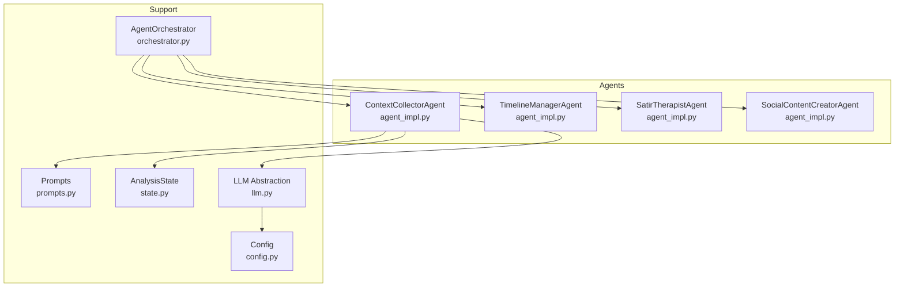
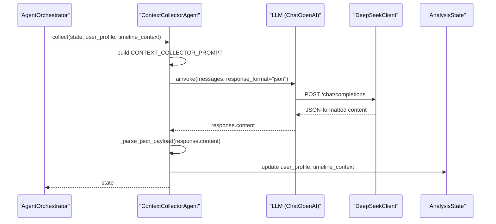
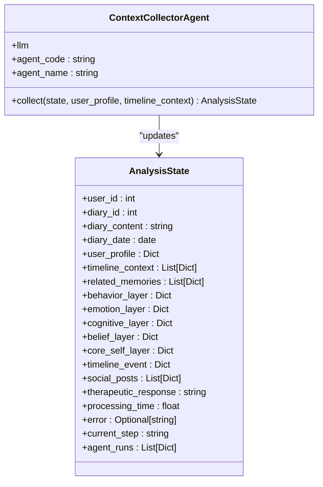
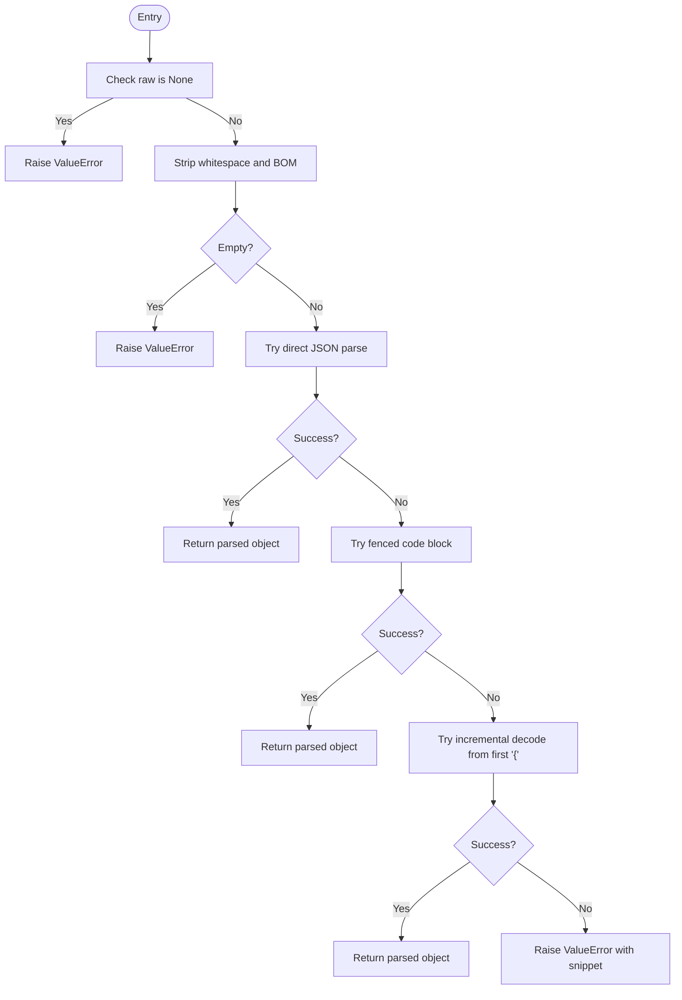
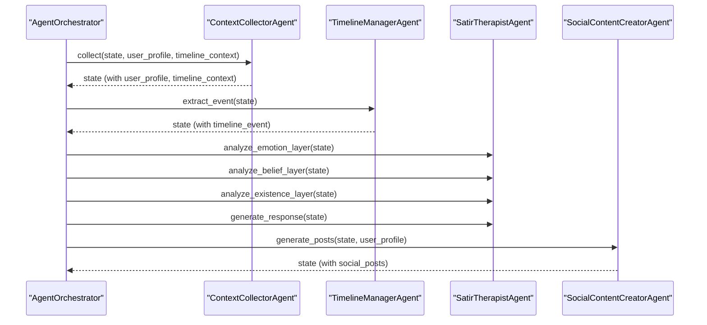
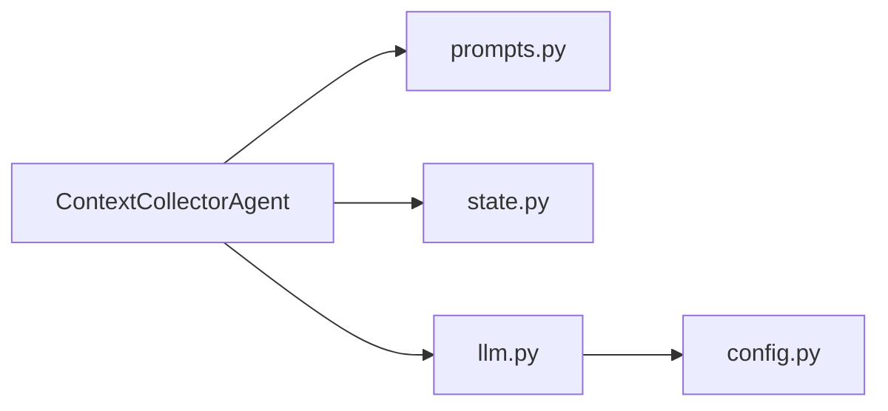

# Context Collector Agent

<cite>
**Referenced Files in This Document**
- [agent_impl.py](file://backend/app/agents/agent_impl.py)
- [prompts.py](file://backend/app/agents/prompts.py)
- [state.py](file://backend/app/agents/state.py)
- [orchestrator.py](file://backend/app/agents/orchestrator.py)
- [llm.py](file://backend/app/agents/llm.py)
- [config.py](file://backend/app/core/config.py)
- [test_ai_agents.py](file://backend/test_ai_agents.py)
</cite>

## Table of Contents
1. [Introduction](#introduction)
2. [Project Structure](#project-structure)
3. [Core Components](#core-components)
4. [Architecture Overview](#architecture-overview)
5. [Detailed Component Analysis](#detailed-component-analysis)
6. [Dependency Analysis](#dependency-analysis)
7. [Performance Considerations](#performance-considerations)
8. [Troubleshooting Guide](#troubleshooting-guide)
9. [Conclusion](#conclusion)

## Introduction
This document provides comprehensive documentation for the ContextCollectorAgent, the entry point of the multi-agent analysis pipeline. It explains how the agent collects and aggregates user profile information and timeline context, initializes with a deterministic LLM configuration, handles parameters for collection, integrates the CONTEXT_COLLECTOR_PROMPT, updates shared state, and manages errors with fallback mechanisms. It also outlines the agent's role in orchestrating downstream agents and preparing structured context for subsequent analysis stages.

## Project Structure
The ContextCollectorAgent resides in the agents subsystem alongside other specialized agents and orchestration logic. The relevant modules are organized as follows:
- Agent implementations and utilities: agent_impl.py
- Prompt templates: prompts.py
- Shared state definition: state.py
- Orchestration workflow: orchestrator.py
- LLM abstraction and provider integration: llm.py
- Application configuration: config.py
- Example test harness: test_ai_agents.py

**Diagram sources**
- [agent_impl.py:92-142](file://backend/app/agents/agent_impl.py#L92-L142)
- [prompts.py:9-28](file://backend/app/agents/prompts.py#L9-L28)
- [state.py:10-45](file://backend/app/agents/state.py#L10-L45)
- [orchestrator.py:18-131](file://backend/app/agents/orchestrator.py#L18-L131)
- [llm.py:202-220](file://backend/app/agents/llm.py#L202-L220)
- [config.py:62-70](file://backend/app/core/config.py#L62-L70)

**Section sources**
- [agent_impl.py:92-142](file://backend/app/agents/agent_impl.py#L92-L142)
- [prompts.py:9-28](file://backend/app/agents/prompts.py#L9-L28)
- [state.py:10-45](file://backend/app/agents/state.py#L10-L45)
- [orchestrator.py:18-131](file://backend/app/agents/orchestrator.py#L18-L131)
- [llm.py:202-220](file://backend/app/agents/llm.py#L202-L220)
- [config.py:62-70](file://backend/app/core/config.py#L62-L70)

## Core Components
- ContextCollectorAgent: Initializes an LLM with a deterministic temperature, constructs a prompt using user profile and timeline context, invokes the LLM with JSON response formatting, parses the response robustly, and updates shared state with collected context.
- Prompt template: CONTEXT_COLLECTOR_PROMPT defines the structured input and desired JSON output schema for context extraction.
- State management: AnalysisState defines the shared dictionary-like state used across agents.
- Orchestrator: Coordinates the multi-agent workflow, invoking ContextCollectorAgent as the first step.
- LLM abstraction: Provides a simplified ChatOpenAI-compatible interface backed by a DeepSeek client, enabling deterministic temperature control and JSON response formatting.

Key implementation references:
- Agent initialization and collect method: [agent_impl.py:92-142](file://backend/app/agents/agent_impl.py#L92-L142)
- Prompt template: [prompts.py:9-28](file://backend/app/agents/prompts.py#L9-L28)
- State schema: [state.py:10-45](file://backend/app/agents/state.py#L10-L45)
- Orchestrator integration: [orchestrator.py:84-86](file://backend/app/agents/orchestrator.py#L84-L86)
- LLM configuration: [llm.py:202-220](file://backend/app/agents/llm.py#L202-L220)

**Section sources**
- [agent_impl.py:92-142](file://backend/app/agents/agent_impl.py#L92-L142)
- [prompts.py:9-28](file://backend/app/agents/prompts.py#L9-L28)
- [state.py:10-45](file://backend/app/agents/state.py#L10-L45)
- [orchestrator.py:84-86](file://backend/app/agents/orchestrator.py#L84-L86)
- [llm.py:202-220](file://backend/app/agents/llm.py#L202-L220)

## Architecture Overview
The ContextCollectorAgent acts as the pipeline entry point. It receives user profile and timeline context, builds a structured prompt, and produces a JSON payload consumed by downstream agents. The orchestrator coordinates the full workflow, passing the shared state among agents.

**Diagram sources**
- [agent_impl.py:100-142](file://backend/app/agents/agent_impl.py#L100-L142)
- [prompts.py:9-28](file://backend/app/agents/prompts.py#L9-L28)
- [llm.py:159-199](file://backend/app/agents/llm.py#L159-L199)
- [llm.py:21-66](file://backend/app/agents/llm.py#L21-L66)
- [state.py:10-45](file://backend/app/agents/state.py#L10-L45)

**Section sources**
- [agent_impl.py:100-142](file://backend/app/agents/agent_impl.py#L100-L142)
- [prompts.py:9-28](file://backend/app/agents/prompts.py#L9-L28)
- [llm.py:159-199](file://backend/app/agents/llm.py#L159-L199)
- [llm.py:21-66](file://backend/app/agents/llm.py#L21-L66)
- [state.py:10-45](file://backend/app/agents/state.py#L10-L45)

## Detailed Component Analysis

### ContextCollectorAgent
- Initialization: Creates an LLM instance with a fixed temperature for deterministic behavior during context collection.
- Parameter handling: Accepts AnalysisState, user_profile, and timeline_context; uses them to construct the prompt and update state.
- Prompt integration: Uses CONTEXT_COLLECTOR_PROMPT to request a JSON object containing current mood, main events, concerns, and hopes.
- JSON parsing: Employs a robust parser that tolerates various LLM output formats (pure JSON, fenced code blocks, and partial text).
- State update: Stores user_profile and timeline_context into the shared state for downstream agents.
- Error handling: Catches exceptions, records run metadata, and ensures state is preserved even on failure.

**Diagram sources**
- [agent_impl.py:92-142](file://backend/app/agents/agent_impl.py#L92-L142)
- [state.py:10-45](file://backend/app/agents/state.py#L10-L45)

**Section sources**
- [agent_impl.py:92-142](file://backend/app/agents/agent_impl.py#L92-L142)
- [state.py:10-45](file://backend/app/agents/state.py#L10-L45)

### JSON Parsing Logic (_parse_json_payload)
The parser supports multiple output formats commonly produced by LLMs:
- Direct JSON
- Markdown fenced code blocks
- Partial text with embedded JSON starting at the first opening brace

It raises a clear error when parsing fails, enabling robust error handling in the agent.

**Diagram sources**
- [agent_impl.py:25-68](file://backend/app/agents/agent_impl.py#L25-L68)

**Section sources**
- [agent_impl.py:25-68](file://backend/app/agents/agent_impl.py#L25-L68)

### Prompt Integration (CONTEXT_COLLECTOR_PROMPT)
The prompt template instructs the LLM to analyze user profile, recent timeline context, and diary content, returning a JSON object with:
- current_mood
- main_events
- concerns
- hopes

This structured output is essential for downstream agents to interpret the user’s current state.

**Section sources**
- [prompts.py:9-28](file://backend/app/agents/prompts.py#L9-L28)

### State Update Mechanism
After successful parsing, the agent updates the shared state with:
- user_profile
- timeline_context

This ensures downstream agents (e.g., TimelineManagerAgent, SatirTherapistAgent, SocialContentCreatorAgent) receive the aggregated context.

**Section sources**
- [agent_impl.py:128-134](file://backend/app/agents/agent_impl.py#L128-L134)
- [state.py:10-45](file://backend/app/agents/state.py#L10-L45)

### Error Handling and Fallbacks
- During collection, exceptions are caught, run metadata is recorded, and the agent ensures user_profile and timeline_context remain in state.
- Downstream agents implement their own fallbacks (e.g., default timeline_event, default social posts), maintaining pipeline resilience.

**Section sources**
- [agent_impl.py:136-141](file://backend/app/agents/agent_impl.py#L136-L141)

### Role in Multi-Agent Orchestration
The ContextCollectorAgent is invoked first by the orchestrator to prepare context. Subsequent agents rely on the shared state populated by this agent.

**Diagram sources**
- [orchestrator.py:84-109](file://backend/app/agents/orchestrator.py#L84-L109)
- [agent_impl.py:144-202](file://backend/app/agents/agent_impl.py#L144-L202)
- [agent_impl.py:205-394](file://backend/app/agents/agent_impl.py#L205-L394)
- [agent_impl.py:396-483](file://backend/app/agents/agent_impl.py#L396-L483)

**Section sources**
- [orchestrator.py:84-109](file://backend/app/agents/orchestrator.py#L84-L109)
- [agent_impl.py:144-202](file://backend/app/agents/agent_impl.py#L144-L202)
- [agent_impl.py:205-394](file://backend/app/agents/agent_impl.py#L205-L394)
- [agent_impl.py:396-483](file://backend/app/agents/agent_impl.py#L396-L483)

### Input/Output Formats
- Inputs:
  - user_profile: dictionary containing user identity and traits
  - timeline_context: list of dictionaries representing recent events
  - state: AnalysisState containing diary content and other fields
- Output:
  - Updated AnalysisState with user_profile and timeline_context set
  - JSON payload parsed from LLM response (current_mood, main_events, concerns, hopes)

Example test data demonstrates realistic shapes for user_profile and timeline_context.

**Section sources**
- [test_ai_agents.py:24-56](file://backend/test_ai_agents.py#L24-L56)
- [state.py:10-45](file://backend/app/agents/state.py#L10-L45)

## Dependency Analysis
- ContextCollectorAgent depends on:
  - Prompts module for CONTEXT_COLLECTOR_PROMPT
  - LLM abstraction for deterministic temperature and JSON response formatting
  - State schema for shared state updates
- LLM abstraction depends on:
  - Config for API keys and base URLs
  - DeepSeek client for HTTP requests

**Diagram sources**
- [agent_impl.py:92-142](file://backend/app/agents/agent_impl.py#L92-L142)
- [prompts.py:9-28](file://backend/app/agents/prompts.py#L9-L28)
- [state.py:10-45](file://backend/app/agents/state.py#L10-L45)
- [llm.py:202-220](file://backend/app/agents/llm.py#L202-L220)
- [config.py:62-70](file://backend/app/core/config.py#L62-L70)

**Section sources**
- [agent_impl.py:92-142](file://backend/app/agents/agent_impl.py#L92-L142)
- [prompts.py:9-28](file://backend/app/agents/prompts.py#L9-L28)
- [state.py:10-45](file://backend/app/agents/state.py#L10-L45)
- [llm.py:202-220](file://backend/app/agents/llm.py#L202-L220)
- [config.py:62-70](file://backend/app/core/config.py#L62-L70)

## Performance Considerations
- Deterministic temperature: Using a fixed temperature reduces variability in context extraction, aiding reproducibility.
- JSON response formatting: Requesting JSON from the LLM reduces parsing overhead and improves reliability.
- Robust parsing: The parser avoids retries and backoff loops, minimizing latency while handling diverse LLM outputs.
- Single-shot invocation: The agent performs one LLM call per collection, keeping the pipeline efficient.

[No sources needed since this section provides general guidance]

## Troubleshooting Guide
Common issues and resolutions:
- Empty or None LLM response: The parser raises a clear error; ensure the prompt is well-formed and the LLM supports JSON response formatting.
- Malformed JSON output: The parser attempts multiple strategies; if all fail, verify the prompt’s JSON schema and response_format flag.
- API configuration errors: Confirm API key and base URL are set in configuration; the LLM abstraction relies on these values.
- State not updating: Verify the collect method updates user_profile and timeline_context; otherwise, downstream agents will lack context.

**Section sources**
- [agent_impl.py:25-68](file://backend/app/agents/agent_impl.py#L25-L68)
- [llm.py:21-66](file://backend/app/agents/llm.py#L21-L66)
- [config.py:62-70](file://backend/app/core/config.py#L62-L70)

## Conclusion
The ContextCollectorAgent is the foundation of the multi-agent analysis pipeline. It deterministically collects and structures user context, integrates a robust JSON parsing strategy, and prepares downstream agents with reliable state. Its design emphasizes clarity, resilience, and ease of integration within the orchestrated workflow.