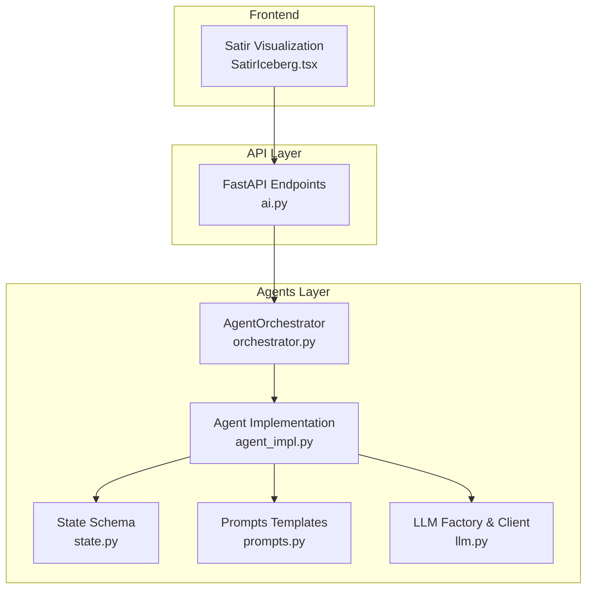
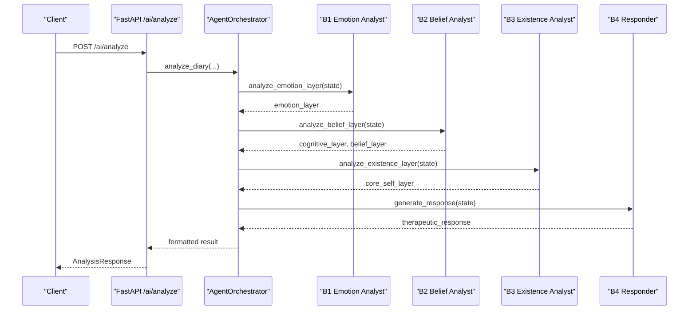
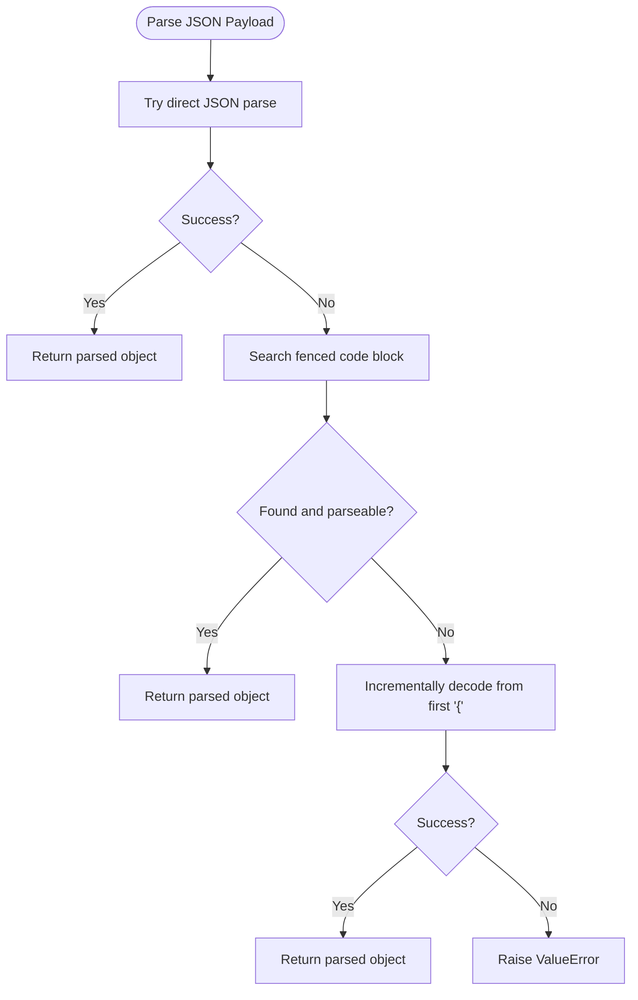
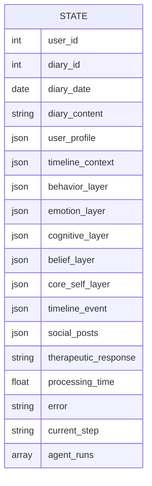
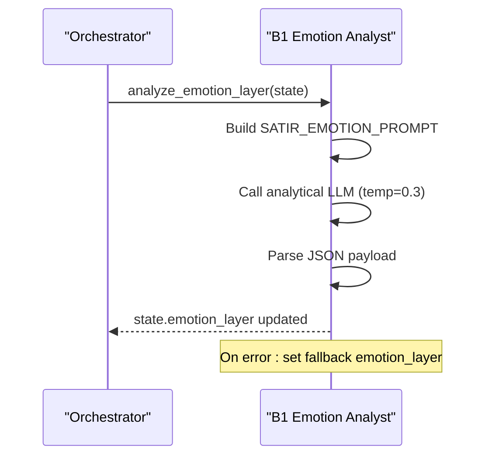
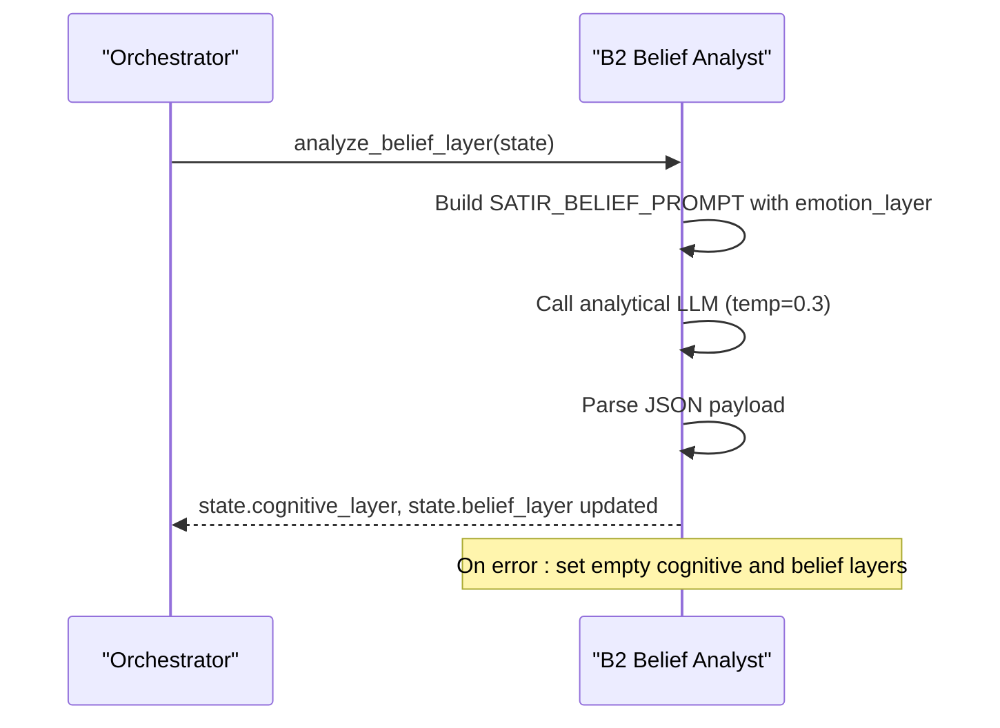
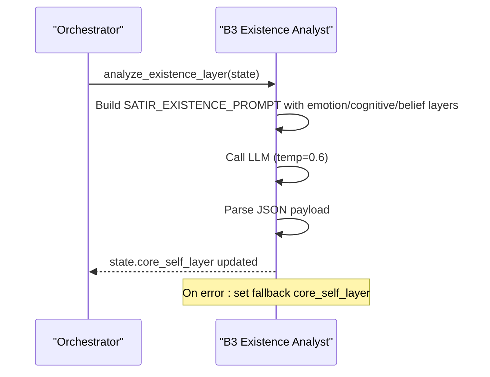
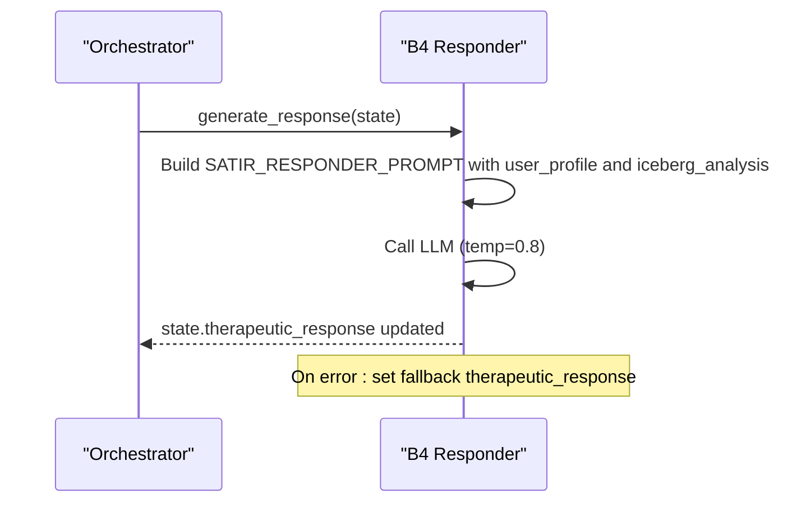
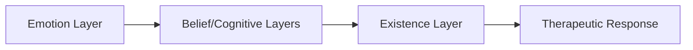
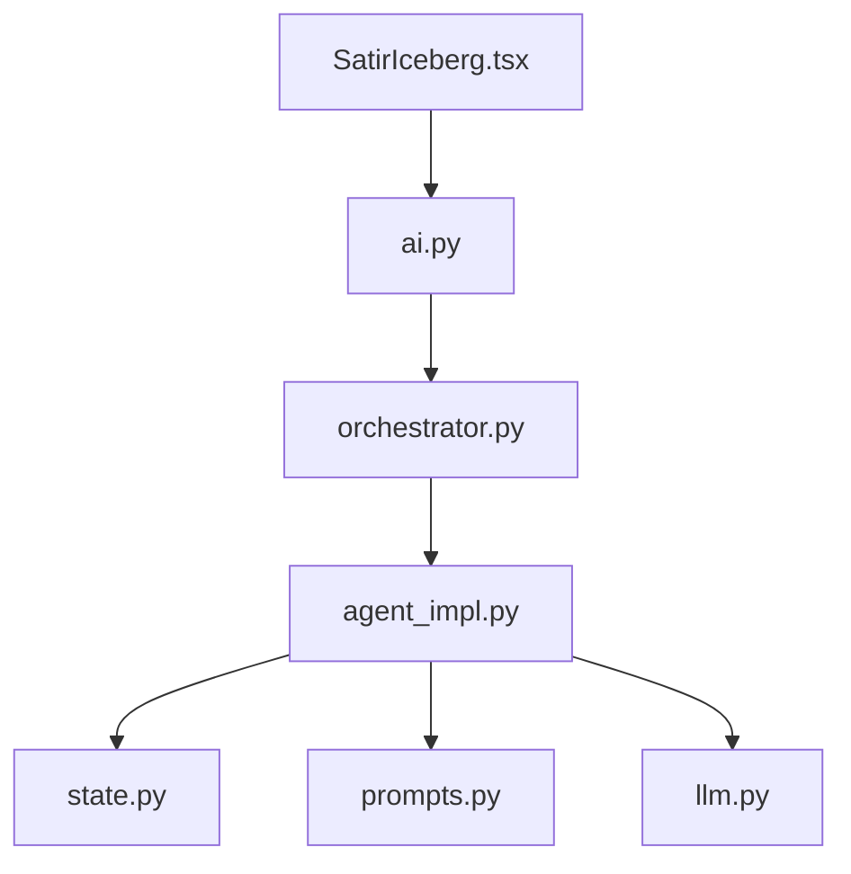

# Satir Therapist Agents

<cite>
**Referenced Files in This Document**
- [agent_impl.py](file://backend/app/agents/agent_impl.py)
- [state.py](file://backend/app/agents/state.py)
- [prompts.py](file://backend/app/agents/prompts.py)
- [orchestrator.py](file://backend/app/agents/orchestrator.py)
- [llm.py](file://backend/app/agents/llm.py)
- [config.py](file://backend/app/core/config.py)
- [ai.py](file://backend/app/api/v1/ai.py)
- [test_ai_agents.py](file://backend/tests/test_ai_agents.py)
- [SatirIceberg.tsx](file://frontend/src/pages/analysis/SatirIceberg.tsx)
</cite>

## Table of Contents
1. [Introduction](#introduction)
2. [Project Structure](#project-structure)
3. [Core Components](#core-components)
4. [Architecture Overview](#architecture-overview)
5. [Detailed Component Analysis](#detailed-component-analysis)
6. [Dependency Analysis](#dependency-analysis)
7. [Performance Considerations](#performance-considerations)
8. [Troubleshooting Guide](#troubleshooting-guide)
9. [Conclusion](#conclusion)
10. [Appendices](#appendices)

## Introduction
This document describes the multi-layered SatirTherapistAgent implementation used to analyze user diary entries using the five-layer Satir Iceberg Model. It covers the four specialized agents (B1–B4) responsible for emotion, belief/cognition, existence, and therapeutic response generation. The document explains LLM configurations, analytical temperature settings, JSON parsing strategies, state mutations across layers, error handling with fallback states, and the integration between emotional, cognitive, and existential analysis phases.

## Project Structure
The agents subsystem resides under backend/app/agents and integrates with the API layer and frontend visualization.



**Diagram sources**
- [orchestrator.py:18-176](file://backend/app/agents/orchestrator.py#L18-L176)
- [agent_impl.py:1-484](file://backend/app/agents/agent_impl.py#L1-L484)
- [state.py:10-45](file://backend/app/agents/state.py#L10-L45)
- [prompts.py:1-244](file://backend/app/agents/prompts.py#L1-L244)
- [llm.py:1-220](file://backend/app/agents/llm.py#L1-L220)
- [ai.py:406-639](file://backend/app/api/v1/ai.py#L406-L639)
- [SatirIceberg.tsx:1-216](file://frontend/src/pages/analysis/SatirIceberg.tsx#L1-L216)

**Section sources**
- [orchestrator.py:18-176](file://backend/app/agents/orchestrator.py#L18-L176)
- [agent_impl.py:1-484](file://backend/app/agents/agent_impl.py#L1-L484)
- [state.py:10-45](file://backend/app/agents/state.py#L10-L45)
- [prompts.py:1-244](file://backend/app/agents/prompts.py#L1-L244)
- [llm.py:1-220](file://backend/app/agents/llm.py#L1-L220)
- [ai.py:406-639](file://backend/app/api/v1/ai.py#L406-L639)
- [SatirIceberg.tsx:1-216](file://frontend/src/pages/analysis/SatirIceberg.tsx#L1-L216)

## Core Components
- AgentOrchestrator: Coordinates the end-to-end workflow across agents.
- SatirTherapistAgent: Implements B1 (Emotion Analyst), B2 (Belief Analyst), B3 (Existence Analyst), and B4 (Responder).
- State Management: Typed dictionary defining the shared state across steps.
- Prompt Templates: Structured prompts for each layer and role.
- LLM Factory: Provides configured ChatOpenAI-compatible clients backed by DeepSeek API.

Key responsibilities:
- Progressive analysis: behavior → emotion → cognition/belief → existence → response.
- JSON parsing robustness across varied LLM outputs.
- Fallback states on failures to ensure resilient operation.
- Unified orchestration and result formatting for API exposure.

**Section sources**
- [orchestrator.py:21-131](file://backend/app/agents/orchestrator.py#L21-L131)
- [agent_impl.py:205-394](file://backend/app/agents/agent_impl.py#L205-L394)
- [state.py:10-45](file://backend/app/agents/state.py#L10-L45)
- [prompts.py:60-163](file://backend/app/agents/prompts.py#L60-L163)
- [llm.py:202-220](file://backend/app/agents/llm.py#L202-L220)

## Architecture Overview
The system follows a sequential, layered pipeline with explicit state transitions and error resilience.



**Diagram sources**
- [ai.py:520-532](file://backend/app/api/v1/ai.py#L520-L532)
- [orchestrator.py:92-105](file://backend/app/agents/orchestrator.py#L92-L105)
- [agent_impl.py:214-393](file://backend/app/agents/agent_impl.py#L214-L393)

## Detailed Component Analysis

### LLM Configuration and Temperature Settings
- Regular LLM: Used for general tasks and creative content generation.
- Analytical LLM: Used for structured, precise analysis tasks.
- Creative LLM: Used for social content generation requiring varied styles.

Temperature settings optimized for psychological analysis:
- B1/B2 (analytical): temperature 0.3 for deterministic, focused outputs.
- B3 (existential): temperature 0.6 to balance insightfulness and stability.
- B4 (responder): temperature 0.8 to encourage empathetic, nuanced responses.
- Social Creator: temperature 0.9 for creative variety.

These settings align with the prompts’ JSON response_format requirements and the need for structured outputs in early layers.

**Section sources**
- [llm.py:202-220](file://backend/app/agents/llm.py#L202-L220)
- [agent_impl.py:209-212](file://backend/app/agents/agent_impl.py#L209-L212)
- [prompts.py:76,104,129,162:76-162](file://backend/app/agents/prompts.py#L76-L162)

### JSON Parsing Strategies
Robust extraction handles multiple LLM output forms:
- Direct JSON object.
- Markdown fenced code blocks (```json ... ```).
- Incremental decoding from first brace to ignore trailing text.

Failure triggers ValueError with a concise message. The parser is used consistently across agents to ensure uniformity.



**Diagram sources**
- [agent_impl.py:25-68](file://backend/app/agents/agent_impl.py#L25-L68)

**Section sources**
- [agent_impl.py:25-68](file://backend/app/agents/agent_impl.py#L25-L68)

### State Mutations Across Layers
The state evolves progressively through the five layers. Each agent writes to specific keys while preserving prior layers.



- Behavior layer: synthesized from diary content for context.
- Emotion layer: surface and underlying emotions, intensity.
- Cognitive layer: irrational beliefs and automatic thoughts.
- Belief layer: core beliefs and life rules.
- Core self layer: yearnings, deepest desire, existence insight.
- Timeline event: extracted from diary content.
- Social posts: generated variants.
- Therapeutic response: final empathetic synthesis.

**Diagram sources**
- [state.py:10-45](file://backend/app/agents/state.py#L10-L45)

**Section sources**
- [state.py:10-45](file://backend/app/agents/state.py#L10-L45)
- [agent_impl.py:239,280,333,384](file://backend/app/agents/agent_impl.py#L239-L384)

### B1: Emotion Analyst (Surface to Underlying Emotions)
- Purpose: Extract surface emotion and underlying emotion with intensity.
- Prompt: Focuses on the second layer of Satir’s model.
- Output keys: emotion_layer.
- Robustness: On failure, sets a safe fallback with identifiable markers.



**Diagram sources**
- [agent_impl.py:214-253](file://backend/app/agents/agent_impl.py#L214-L253)
- [prompts.py:62-83](file://backend/app/agents/prompts.py#L62-L83)

**Section sources**
- [agent_impl.py:214-253](file://backend/app/agents/agent_impl.py#L214-L253)
- [prompts.py:62-83](file://backend/app/agents/prompts.py#L62-L83)

### B2: Belief Analyst (Cognitive and Core Beliefs)
- Purpose: Identify non-rational beliefs, automatic thoughts, core beliefs, and life rules.
- Prompt: Builds on emotion_layer to infer higher-order mental constructs.
- Output keys: cognitive_layer and belief_layer.
- Robustness: On failure, initializes empty structures to keep downstream processing intact.



**Diagram sources**
- [agent_impl.py:255-299](file://backend/app/agents/agent_impl.py#L255-L299)
- [prompts.py:86-112](file://backend/app/agents/prompts.py#L86-L112)

**Section sources**
- [agent_impl.py:255-299](file://backend/app/agents/agent_impl.py#L255-L299)
- [prompts.py:86-112](file://backend/app/agents/prompts.py#L86-L112)

### B3: Existence Analyst (Yearnings and Deepest Desire)
- Purpose: Synthesize insights from prior layers into the fifth layer—yearnings, life energy, and deepest desire.
- Prompt: Integrates emotion, cognition, and belief layers.
- Output keys: core_self_layer.
- Robustness: On failure, sets a safe fallback with identifiable markers.



**Diagram sources**
- [agent_impl.py:301-347](file://backend/app/agents/agent_impl.py#L301-L347)
- [prompts.py:115-136](file://backend/app/agents/prompts.py#L115-L136)

**Section sources**
- [agent_impl.py:301-347](file://backend/app/agents/agent_impl.py#L301-L347)
- [prompts.py:115-136](file://backend/app/agents/prompts.py#L115-L136)

### B4: Responder (Therapeutic Reply Generation)
- Purpose: Generate a warm, empathetic, and actionable therapeutic response integrating the five-layer analysis.
- Prompt: Uses a system prompt and the full iceberg analysis.
- Output keys: therapeutic_response.
- Robustness: On failure, provides a fallback supportive message.



**Diagram sources**
- [agent_impl.py:349-393](file://backend/app/agents/agent_impl.py#L349-L393)
- [prompts.py:139-163](file://backend/app/agents/prompts.py#L139-L163)

**Section sources**
- [agent_impl.py:349-393](file://backend/app/agents/agent_impl.py#L349-L393)
- [prompts.py:139-163](file://backend/app/agents/prompts.py#L139-L163)

### Integration Between Emotional, Cognitive, and Existential Phases
- Emotional layer informs belief layer by grounding assumptions in felt experience.
- Belief layer provides the cognitive scaffolding for existence layer insights.
- Existence layer synthesizes into a therapeutic response that connects back to the user’s deepest yearnings.



**Diagram sources**
- [agent_impl.py:214-393](file://backend/app/agents/agent_impl.py#L214-L393)
- [prompts.py:62-136](file://backend/app/agents/prompts.py#L62-L136)

**Section sources**
- [agent_impl.py:214-393](file://backend/app/agents/agent_impl.py#L214-L393)
- [prompts.py:62-136](file://backend/app/agents/prompts.py#L62-L136)

### Example Workflows and Outputs
- Icebergs analysis: The frontend component renders the five layers, enabling interactive exploration of behavior, emotion, cognition, belief, and existence.
- Layer-by-layer processing: The orchestrator advances through B1 → B2 → B3 → B4, updating state at each step.
- Error handling: Each agent sets fallbacks to ensure downstream steps can still run.

**Section sources**
- [SatirIceberg.tsx:10-216](file://frontend/src/pages/analysis/SatirIceberg.tsx#L10-L216)
- [agent_impl.py:214-393](file://backend/app/agents/agent_impl.py#L214-L393)

## Dependency Analysis
- Orchestrator depends on agent_impl implementations and state definitions.
- Agent implementations depend on prompts and LLM factory.
- API layer depends on orchestrator and persists results.
- Frontend depends on API responses and renders the five-layer visualization.



**Diagram sources**
- [ai.py:406-639](file://backend/app/api/v1/ai.py#L406-L639)
- [orchestrator.py:18-176](file://backend/app/agents/orchestrator.py#L18-L176)
- [agent_impl.py:1-484](file://backend/app/agents/agent_impl.py#L1-L484)
- [state.py:10-45](file://backend/app/agents/state.py#L10-L45)
- [prompts.py:1-244](file://backend/app/agents/prompts.py#L1-L244)
- [llm.py:1-220](file://backend/app/agents/llm.py#L1-L220)
- [SatirIceberg.tsx:1-216](file://frontend/src/pages/analysis/SatirIceberg.tsx#L1-L216)

**Section sources**
- [ai.py:406-639](file://backend/app/api/v1/ai.py#L406-L639)
- [orchestrator.py:18-176](file://backend/app/agents/orchestrator.py#L18-L176)
- [agent_impl.py:1-484](file://backend/app/agents/agent_impl.py#L1-L484)
- [state.py:10-45](file://backend/app/agents/state.py#L10-L45)
- [prompts.py:1-244](file://backend/app/agents/prompts.py#L1-L244)
- [llm.py:1-220](file://backend/app/agents/llm.py#L1-L220)
- [SatirIceberg.tsx:1-216](file://frontend/src/pages/analysis/SatirIceberg.tsx#L1-L216)

## Performance Considerations
- Temperature tuning: Lower temperatures (0.3) for structured analysis; higher for empathy and creativity.
- JSON parsing overhead: The parser attempts multiple strategies; ensure prompts consistently produce JSON to minimize retries.
- Concurrency: Current implementation runs agents sequentially. For improved throughput, consider parallelizing independent steps (e.g., B1/B2/B3) while preserving dependencies.
- Streaming: The LLM client supports streaming; integrate for progressive UI updates if latency is a concern.

[No sources needed since this section provides general guidance]

## Troubleshooting Guide
Common issues and remedies:
- Empty or malformed LLM output:
  - Verify response_format is set appropriately for JSON prompts.
  - Use the robust parser to handle fenced code blocks and incremental decoding.
- Missing keys in state after failures:
  - Agents set fallback dictionaries; ensure downstream steps check for presence before use.
- API-level errors:
  - The API catches exceptions and returns error metadata; inspect the metadata field for details.

Operational checks:
- Confirm environment variables for DeepSeek API key and base URL are set.
- Validate that the orchestrator receives a populated state with user profile and timeline context.

**Section sources**
- [agent_impl.py:25-68](file://backend/app/agents/agent_impl.py#L25-L68)
- [agent_impl.py:246,296,340,391:246-391](file://backend/app/agents/agent_impl.py#L246-L391)
- [ai.py:534-539](file://backend/app/api/v1/ai.py#L534-L539)
- [config.py:62-70](file://backend/app/core/config.py#L62-L70)

## Conclusion
The SatirTherapistAgent system implements a rigorous, multi-layered psychological analysis pipeline grounded in the five-layer Satir Iceberg Model. By leveraging specialized LLM configurations, structured prompts, robust JSON parsing, and resilient fallbacks, it delivers coherent, empathetic insights and therapeutic responses. The modular design enables future enhancements such as parallelization and streaming for improved performance and user experience.

[No sources needed since this section summarizes without analyzing specific files]

## Appendices

### API Exposure and Workflow Details
- Full analysis endpoint aggregates user context, executes B1–B4, and persists results.
- Simplified endpoints support standalone Satir analysis and social post generation.

**Section sources**
- [ai.py:520-639](file://backend/app/api/v1/ai.py#L520-L639)
- [test_ai_agents.py:16-127](file://backend/tests/test_ai_agents.py#L16-L127)