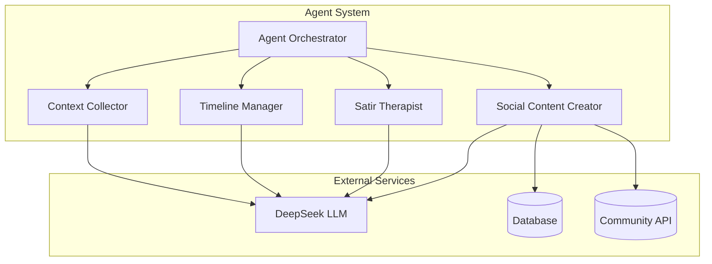
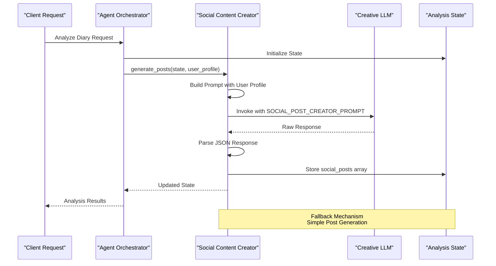
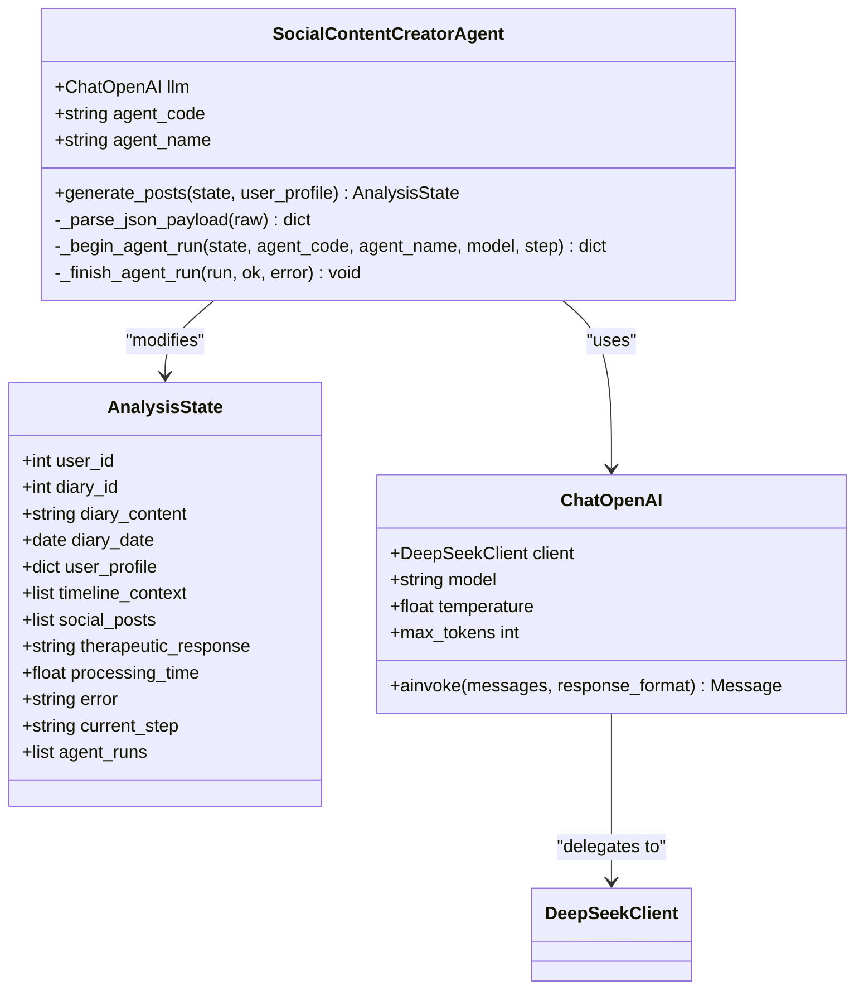
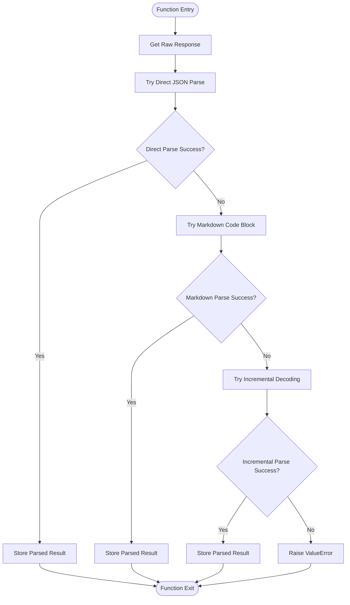
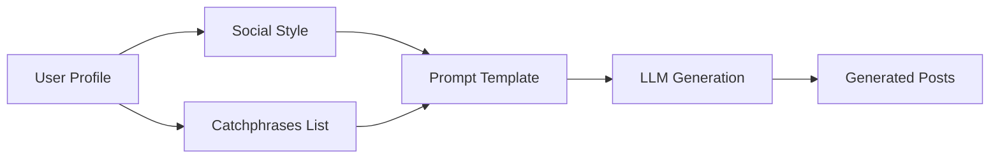
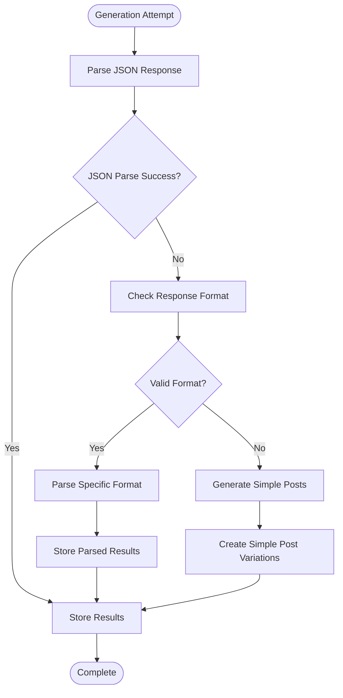
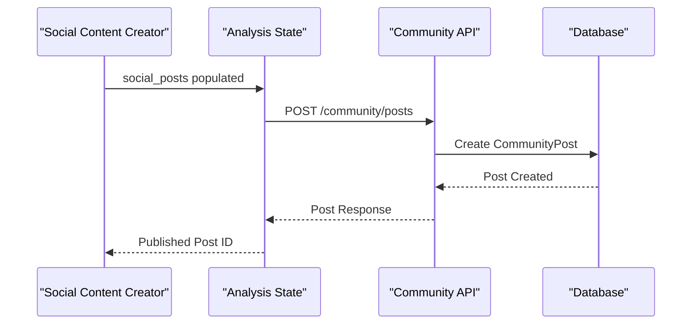
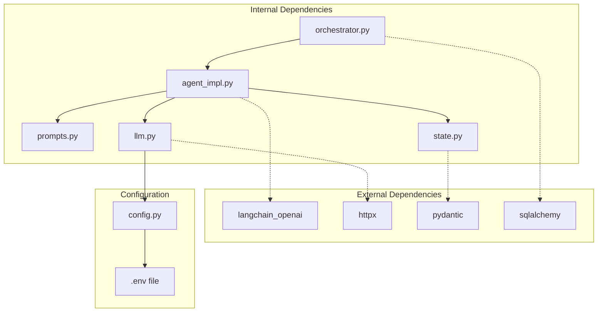
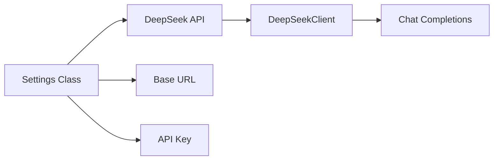
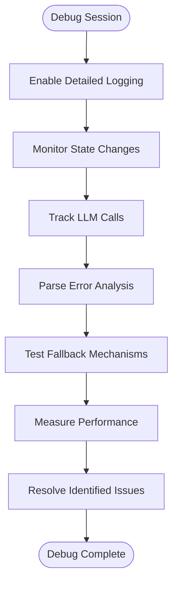

# Social Content Creator Agent

<cite>
**Referenced Files in This Document**
- [agent_impl.py](file://backend/app/agents/agent_impl.py)
- [prompts.py](file://backend/app/agents/prompts.py)
- [state.py](file://backend/app/agents/state.py)
- [orchestrator.py](file://backend/app/agents/orchestrator.py)
- [llm.py](file://backend/app/agents/llm.py)
- [ai.py](file://backend/app/api/v1/ai.py)
- [community.py](file://backend/app/api/v1/community.py)
- [config.py](file://backend/app/core/config.py)
- [test_ai_agents.py](file://backend/test_ai_agents.py)
</cite>

## Table of Contents
1. [Introduction](#introduction)
2. [Project Structure](#project-structure)
3. [Core Components](#core-components)
4. [Architecture Overview](#architecture-overview)
5. [Detailed Component Analysis](#detailed-component-analysis)
6. [Dependency Analysis](#dependency-analysis)
7. [Performance Considerations](#performance-considerations)
8. [Troubleshooting Guide](#troubleshooting-guide)
9. [Conclusion](#conclusion)

## Introduction
The Social Content Creator Agent is a specialized AI component responsible for generating multiple versions of social media posts from diary entries. It transforms personal journal content into engaging, authentic social media posts tailored to individual user profiles, incorporating personality traits, communication styles, and preferred catchphrases. This agent plays a crucial role in the community engagement features by enabling users to share meaningful moments from their lives while maintaining their authentic voice.

## Project Structure
The Social Content Creator Agent is part of a multi-agent AI system that processes diary content through several specialized agents. The agent operates within a structured workflow that includes context collection, timeline extraction, psychological analysis, and finally social content generation.

**Diagram sources**
- [orchestrator.py:18-26](file://backend/app/agents/orchestrator.py#L18-L26)
- [agent_impl.py:396-484](file://backend/app/agents/agent_impl.py#L396-L484)

**Section sources**
- [orchestrator.py:18-176](file://backend/app/agents/orchestrator.py#L18-L176)
- [agent_impl.py:396-484](file://backend/app/agents/agent_impl.py#L396-L484)

## Core Components
The Social Content Creator Agent consists of several key components that work together to transform diary content into social media posts:

### Agent Implementation
The agent is implemented as a dedicated class with sophisticated JSON parsing capabilities and robust error handling mechanisms. It utilizes a creative language model with temperature=0.9 to generate diverse post variations.

### Prompt Engineering
The agent uses a carefully crafted prompt template that incorporates user profile information, emotional context, and stylistic preferences to guide content creation.

### State Management
The agent integrates with a comprehensive state management system that tracks processing metadata, error conditions, and execution metrics.

**Section sources**
- [agent_impl.py:396-484](file://backend/app/agents/agent_impl.py#L396-L484)
- [prompts.py:166-209](file://backend/app/agents/prompts.py#L166-L209)
- [state.py:10-45](file://backend/app/agents/state.py#L10-L45)

## Architecture Overview
The Social Content Creator Agent operates within a multi-agent orchestration system that follows a sequential workflow pattern. Each agent in the pipeline builds upon the results of previous agents, creating a comprehensive analysis and content generation pipeline.

**Diagram sources**
- [orchestrator.py:107-109](file://backend/app/agents/orchestrator.py#L107-L109)
- [agent_impl.py:404-483](file://backend/app/agents/agent_impl.py#L404-L483)

## Detailed Component Analysis

### SocialContentCreatorAgent Class
The SocialContentCreatorAgent is implemented as a dedicated class with comprehensive error handling and state management capabilities.

**Diagram sources**
- [agent_impl.py:396-484](file://backend/app/agents/agent_impl.py#L396-L484)
- [state.py:10-45](file://backend/app/agents/state.py#L10-L45)
- [llm.py:150-220](file://backend/app/agents/llm.py#L150-L220)

#### JSON Parsing Logic
The agent implements sophisticated JSON parsing that handles multiple response formats commonly produced by LLMs:

**Diagram sources**
- [agent_impl.py:25-68](file://backend/app/agents/agent_impl.py#L25-L68)

#### State Mutation Pattern
The agent follows a consistent state mutation pattern that updates the AnalysisState with generated social posts:

| State Field | Purpose | Update Method |
|-------------|---------|---------------|
| `social_posts` | Stores generated post variations | `state["social_posts"] = result.get("posts", [])` |
| `agent_runs` | Tracks agent execution history | `_begin_agent_run()` and `_finish_agent_run()` |
| `processing_time` | Measures execution duration | Automatic timing in orchestrator |
| `error` | Captures error conditions | Exception handling with error propagation |

**Section sources**
- [agent_impl.py:404-483](file://backend/app/agents/agent_impl.py#L404-L483)
- [state.py:34-35](file://backend/app/agents/state.py#L34-L35)

### Integration with User Profile
The agent integrates deeply with user profile information to ensure authentic content generation:

#### Social Style Integration
The agent incorporates user social style preferences into the content generation process:

| Social Style | Characteristic | Content Adaptation |
|--------------|----------------|-------------------|
| Authentic | Natural, genuine | Avoids artificial language |
| Professional | Formal, structured | Uses polished vocabulary |
| Casual | Relaxed, friendly | Incorporates conversational tone |
| Creative | Expressive, artistic | Emphasizes imagery and metaphors |

#### Catchphrase Utilization
The agent seamlessly integrates user catchphrases into generated content:

**Diagram sources**
- [agent_impl.py:416-422](file://backend/app/agents/agent_impl.py#L416-L422)
- [prompts.py:168-208](file://backend/app/agents/prompts.py#L168-L208)

### Fallback Mechanism
The agent implements a robust fallback mechanism that ensures content generation even when LLM responses are problematic:

#### Simple Post Generation
When JSON parsing fails, the agent falls back to generating simple posts:

| Version | Style | Content Strategy |
|---------|-------|------------------|
| A | Concise | Extracts first 50 characters from diary content |
| B | Complete | Uses first 100 characters of diary content |
| C | Personal | Creates version with diary title context |

#### Error Recovery
The fallback mechanism includes comprehensive error recovery:

**Diagram sources**
- [agent_impl.py:458-482](file://backend/app/agents/agent_impl.py#L458-L482)

**Section sources**
- [agent_impl.py:458-482](file://backend/app/agents/agent_impl.py#L458-L482)

### Community Engagement Features
The generated social posts integrate seamlessly with the community platform's engagement features:

#### Post Creation Workflow
The social posts can be directly published to community circles:

| Feature | Implementation | Benefits |
|---------|----------------|----------|
| Circle Selection | Based on emotion tags | Contextually appropriate posting |
| Anonymous Posting | Optional privacy control | User choice in disclosure |
| Image Attachment | Supports multimedia | Enhanced engagement |
| Like/Comment System | Full social features | Community interaction |

#### Integration Points
The agent connects to community APIs for seamless post publishing:

**Diagram sources**
- [community.py:39-56](file://backend/app/api/v1/community.py#L39-L56)

**Section sources**
- [community.py:39-156](file://backend/app/api/v1/community.py#L39-L156)
- [ai.py:770-872](file://backend/app/api/v1/ai.py#L770-L872)

## Dependency Analysis
The Social Content Creator Agent has well-defined dependencies that support its functionality and integration capabilities.

**Diagram sources**
- [agent_impl.py:8-22](file://backend/app/agents/agent_impl.py#L8-L22)
- [llm.py:5-10](file://backend/app/agents/llm.py#L5-L10)
- [config.py:10-105](file://backend/app/core/config.py#L10-L105)

### External Dependencies
The agent relies on several external libraries for core functionality:

| Dependency | Purpose | Version |
|------------|---------|---------|
| langchain_openai | LLM interface abstraction | ^0.1.0 |
| httpx | Async HTTP client | ^0.24.0 |
| pydantic | Data validation | ^2.0.0 |
| sqlalchemy | Database ORM | ^2.0.0 |

### Configuration Management
The agent integrates with the application's configuration system for LLM access:

**Diagram sources**
- [config.py:62-70](file://backend/app/core/config.py#L62-L70)
- [llm.py:13-21](file://backend/app/agents/llm.py#L13-L21)

**Section sources**
- [agent_impl.py:8-22](file://backend/app/agents/agent_impl.py#L8-L22)
- [llm.py:13-220](file://backend/app/agents/llm.py#L13-L220)
- [config.py:10-105](file://backend/app/core/config.py#L10-L105)

## Performance Considerations
The Social Content Creator Agent is designed with several performance optimizations:

### Temperature Configuration
The agent uses temperature=0.9 for creative LLM calls, balancing creativity with coherence. This setting allows for diverse post variations while maintaining readability.

### Asynchronous Processing
All agent operations are implemented asynchronously to maximize throughput and minimize latency in multi-agent workflows.

### Memory Efficiency
The agent implements efficient state management that minimizes memory footprint during long-running analysis sessions.

### Error Recovery
The fallback mechanism ensures that partial failures don't halt the entire analysis pipeline, maintaining system reliability.

## Troubleshooting Guide

### Common Issues and Solutions

#### JSON Parsing Failures
**Problem**: LLM returns non-standard JSON format
**Solution**: The agent implements multiple parsing strategies:
- Direct JSON parsing
- Markdown code block extraction
- Incremental decoding from first brace

#### LLM API Errors
**Problem**: External LLM service unavailable
**Solution**: Graceful degradation to simple post generation with fallback content

#### State Corruption
**Problem**: Analysis state becomes inconsistent
**Solution**: The orchestrator maintains comprehensive error tracking and rollback capabilities

### Debugging Strategies
The agent includes extensive logging and monitoring capabilities:

**Section sources**
- [agent_impl.py:465-467](file://backend/app/agents/agent_impl.py#L465-L467)
- [test_ai_agents.py:16-161](file://backend/test_ai_agents.py#L16-L161)

## Conclusion
The Social Content Creator Agent represents a sophisticated implementation of AI-powered content generation that balances creativity with authenticity. Through its advanced JSON parsing capabilities, robust error handling, and deep integration with user profiles, it enables users to transform personal diary entries into engaging social media content that reflects their true voice and personality.

The agent's role in community engagement extends beyond simple content generation, serving as a bridge between personal reflection and social connection. Its integration with the broader multi-agent system ensures that generated content is contextually appropriate, emotionally resonant, and aligned with users' authentic communication styles.

Future enhancements could include expanded style customization, additional fallback strategies, and enhanced integration with community features for improved user engagement and retention.