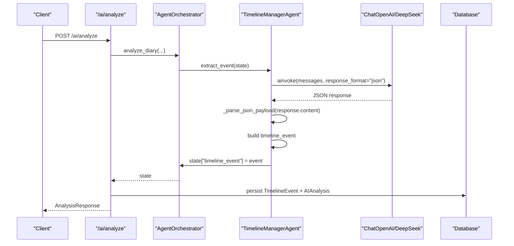
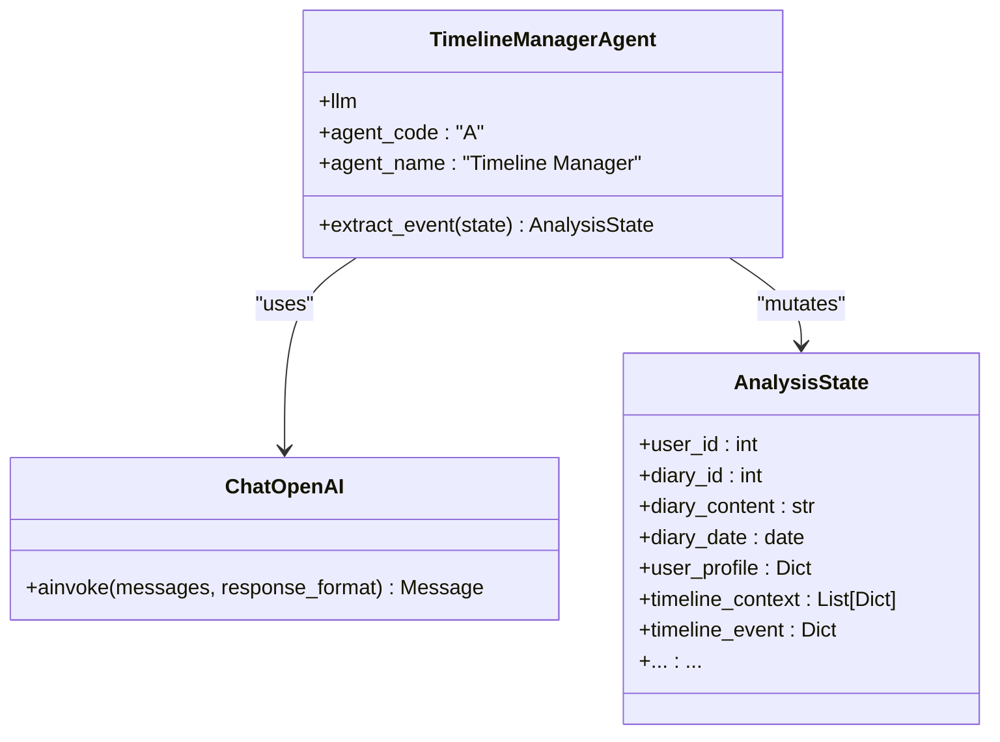
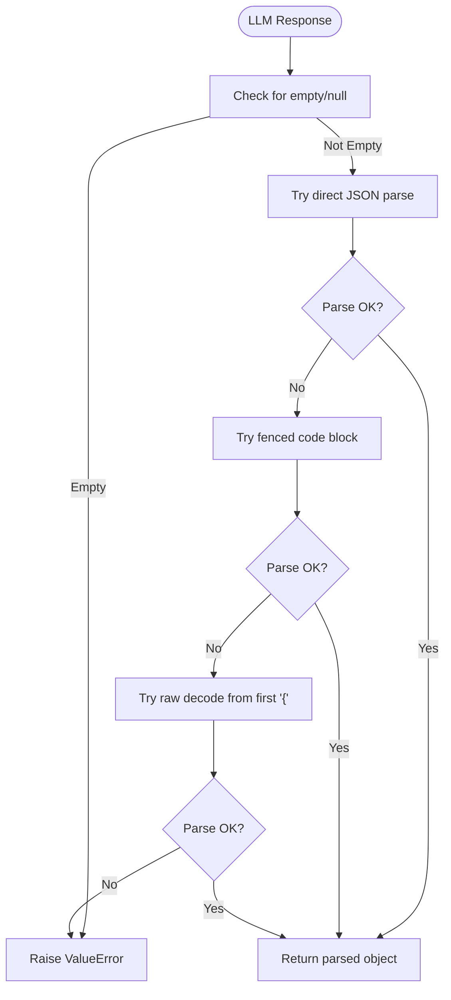
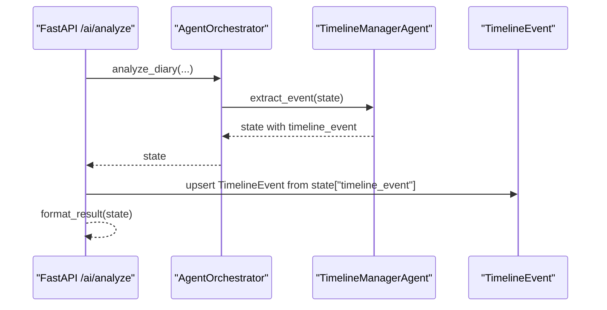
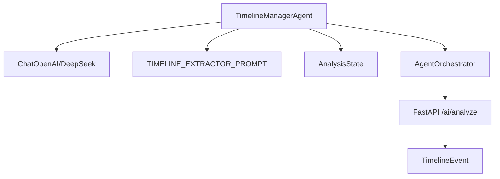

# Timeline Manager Agent

<cite>
**Referenced Files in This Document**
- [agent_impl.py](file://backend/app/agents/agent_impl.py)
- [prompts.py](file://backend/app/agents/prompts.py)
- [state.py](file://backend/app/agents/state.py)
- [orchestrator.py](file://backend/app/agents/orchestrator.py)
- [llm.py](file://backend/app/agents/llm.py)
- [ai.py](file://backend/app/api/v1/ai.py)
- [config.py](file://backend/app/core/config.py)
- [diary.py](file://backend/app/models/diary.py)
- [test_ai_agents.py](file://backend/test_ai_agents.py)
</cite>

## Table of Contents
1. [Introduction](#introduction)
2. [Project Structure](#project-structure)
3. [Core Components](#core-components)
4. [Architecture Overview](#architecture-overview)
5. [Detailed Component Analysis](#detailed-component-analysis)
6. [Dependency Analysis](#dependency-analysis)
7. [Performance Considerations](#performance-considerations)
8. [Troubleshooting Guide](#troubleshooting-guide)
9. [Conclusion](#conclusion)

## Introduction
This document provides comprehensive documentation for the TimelineManagerAgent, focusing on how it extracts structured timeline events from diary content using the TIMELINE_EXTRACTOR_PROMPT. It explains the extract_event() method’s JSON response parsing, the construction of timeline_event objects with event_summary, emotion_tag, importance_score, event_type, and related_entities. It also covers the agent’s fallback mechanism for default events when extraction fails, the temperature=0.5 setting for balanced creativity, the state mutation pattern, integration with the broader analysis pipeline, and practical examples of extracted events.

## Project Structure
The TimelineManagerAgent resides in the backend AI agent subsystem and participates in a multi-agent orchestration pipeline. The key files involved are:
- Agent implementation and orchestration
- Prompt templates
- State management
- LLM abstraction
- API integration
- Database models for persistence
- Tests demonstrating usage

```mermaid
graph TB
subgraph "Agents"
A["agent_impl.py<br/>TimelineManagerAgent"]
P["prompts.py<br/>TIMELINE_EXTRACTOR_PROMPT"]
S["state.py<br/>AnalysisState"]
O["orchestrator.py<br/>AgentOrchestrator"]
L["llm.py<br/>DeepSeekClient/ChatOpenAI"]
end
subgraph "API"
API["ai.py<br/>/ai/analyze endpoint"]
end
subgraph "Persistence"
D["diary.py<br/>TimelineEvent model"]
end
API --> O
O --> A
A --> P
A --> L
A --> S
API --> D
```

**Diagram sources**
- [agent_impl.py:144-203](file://backend/app/agents/agent_impl.py#L144-L203)
- [prompts.py:31-57](file://backend/app/agents/prompts.py#L31-L57)
- [state.py:10-45](file://backend/app/agents/state.py#L10-L45)
- [orchestrator.py:18-176](file://backend/app/agents/orchestrator.py#L18-L176)
- [llm.py:13-220](file://backend/app/agents/llm.py#L13-L220)
- [ai.py:406-639](file://backend/app/api/v1/ai.py#L406-L639)
- [diary.py:67-99](file://backend/app/models/diary.py#L67-L99)

**Section sources**
- [agent_impl.py:144-203](file://backend/app/agents/agent_impl.py#L144-L203)
- [prompts.py:31-57](file://backend/app/agents/prompts.py#L31-L57)
- [state.py:10-45](file://backend/app/agents/state.py#L10-L45)
- [orchestrator.py:18-176](file://backend/app/agents/orchestrator.py#L18-L176)
- [llm.py:13-220](file://backend/app/agents/llm.py#L13-L220)
- [ai.py:406-639](file://backend/app/api/v1/ai.py#L406-L639)
- [diary.py:67-99](file://backend/app/models/diary.py#L67-L99)

## Core Components
- TimelineManagerAgent: Extracts a structured timeline event from diary content using a JSON-formatted prompt and constructs a standardized timeline_event object stored in AnalysisState.
- TIMELINE_EXTRACTOR_PROMPT: Defines the exact JSON schema and constraints for the extracted event.
- AnalysisState: Typed dictionary that carries inputs, intermediate results, and outputs across the agent pipeline.
- AgentOrchestrator: Coordinates the multi-agent workflow, including the TimelineManagerAgent step.
- LLM Abstraction: Provides a ChatOpenAI-compatible interface backed by DeepSeek, enabling JSON response formatting and temperature control.
- API Endpoint: Integrates the orchestrator into the FastAPI service, persists results to the database, and exposes the analysis via HTTP.

Key responsibilities:
- Extract structured event data from unstructured diary text.
- Parse and validate JSON responses robustly.
- Mutate AnalysisState with a normalized timeline_event object.
- Provide fallback behavior when extraction fails.
- Integrate with downstream agents and services.

**Section sources**
- [agent_impl.py:144-203](file://backend/app/agents/agent_impl.py#L144-L203)
- [prompts.py:31-57](file://backend/app/agents/prompts.py#L31-L57)
- [state.py:10-45](file://backend/app/agents/state.py#L10-L45)
- [orchestrator.py:18-176](file://backend/app/agents/orchestrator.py#L18-L176)
- [llm.py:13-220](file://backend/app/agents/llm.py#L13-L220)
- [ai.py:406-639](file://backend/app/api/v1/ai.py#L406-L639)

## Architecture Overview
The TimelineManagerAgent participates in a sequential multi-agent workflow orchestrated by AgentOrchestrator. The flow is:
- Initialize AnalysisState with user_id, diary_id, diary_content, and contextual data.
- ContextCollectorAgent enriches AnalysisState with user_profile and timeline_context.
- TimelineManagerAgent extracts a structured timeline_event and stores it in AnalysisState.
- SatirTherapistAgent performs multi-layer psychological analysis.
- SocialContentCreatorAgent generates social media posts.
- The API endpoint persists results to TimelineEvent and AIAnalysis tables.



**Diagram sources**
- [orchestrator.py:27-120](file://backend/app/agents/orchestrator.py#L27-L120)
- [agent_impl.py:152-202](file://backend/app/agents/agent_impl.py#L152-L202)
- [llm.py:159-199](file://backend/app/agents/llm.py#L159-L199)
- [ai.py:520-632](file://backend/app/api/v1/ai.py#L520-L632)

**Section sources**
- [orchestrator.py:27-120](file://backend/app/agents/orchestrator.py#L27-L120)
- [agent_impl.py:152-202](file://backend/app/agents/agent_impl.py#L152-L202)
- [llm.py:159-199](file://backend/app/agents/llm.py#L159-L199)
- [ai.py:520-632](file://backend/app/api/v1/ai.py#L520-L632)

## Detailed Component Analysis

### TimelineManagerAgent Implementation
The TimelineManagerAgent is responsible for extracting a structured timeline event from diary content. It:
- Uses TIMELINE_EXTRACTOR_PROMPT to constrain the LLM to produce a JSON object with specific keys.
- Calls the LLM with response_format="json" to encourage JSON output.
- Parses the response using a robust JSON extractor that handles raw JSON, fenced code blocks, and incremental decoding.
- Constructs a normalized timeline_event object with:
  - event_summary: concise summary (<=50 chars)
  - emotion_tag: primary emotion
  - importance_score: integer score 1–10
  - event_type: one of work/relationship/health/achievement/other
  - related_entities: persons and locations
- Mutates AnalysisState by setting state["timeline_event"].
- On failure, falls back to a default timeline_event with safe defaults.



**Diagram sources**
- [agent_impl.py:144-203](file://backend/app/agents/agent_impl.py#L144-L203)
- [state.py:10-45](file://backend/app/agents/state.py#L10-L45)
- [llm.py:150-199](file://backend/app/agents/llm.py#L150-L199)

**Section sources**
- [agent_impl.py:144-203](file://backend/app/agents/agent_impl.py#L144-L203)
- [prompts.py:31-57](file://backend/app/agents/prompts.py#L31-L57)
- [state.py:10-45](file://backend/app/agents/state.py#L10-L45)
- [llm.py:150-199](file://backend/app/agents/llm.py#L150-L199)

### JSON Response Parsing Strategy
The agent uses a robust parser to extract JSON from LLM responses:
- Try direct JSON parsing.
- Try extracting JSON from markdown code fences.
- Try incremental decoding from the first occurrence of '{'.
- Raise a clear error if parsing fails.

This ensures resilience against varied LLM outputs while maintaining strict schema adherence.



**Diagram sources**
- [agent_impl.py:25-68](file://backend/app/agents/agent_impl.py#L25-L68)

**Section sources**
- [agent_impl.py:25-68](file://backend/app/agents/agent_impl.py#L25-L68)

### State Mutation Pattern
The agent follows a consistent state mutation pattern:
- Record agent run metadata (agent_code, agent_name, model, step, status).
- Build prompt from TIMELINE_EXTRACTOR_PROMPT and diary_content.
- Call LLM with JSON response format.
- Parse JSON and construct timeline_event.
- Store timeline_event in AnalysisState["timeline_event"].
- On exception, record error, set default timeline_event, and continue.

This pattern ensures deterministic progress tracking and predictable fallback behavior.

**Section sources**
- [agent_impl.py:152-202](file://backend/app/agents/agent_impl.py#L152-L202)

### Fallback Mechanism
When extraction fails:
- The agent records the error in the run metadata.
- It sets AnalysisState["timeline_event"] to a default event with:
  - event_summary: "日记记录"
  - emotion_tag: "记录"
  - importance_score: 5
  - event_type: "other"
  - related_entities: {}

This guarantees downstream steps receive a valid timeline_event object.

**Section sources**
- [agent_impl.py:191-202](file://backend/app/agents/agent_impl.py#L191-L202)

### Temperature Setting and Balanced Creativity
The agent initializes its LLM with temperature=0.5, balancing:
- Deterministic JSON output via response_format="json".
- Slightly creative interpretation of diary content to capture nuanced events.

This setting is appropriate for structured extraction tasks requiring both precision and flexibility.

**Section sources**
- [agent_impl.py:147-149](file://backend/app/agents/agent_impl.py#L147-L149)
- [llm.py:202-219](file://backend/app/agents/llm.py#L202-L219)

### Integration with the Broader Pipeline
The agent integrates with:
- AgentOrchestrator: Called during the timeline_extraction step.
- API Layer: The /ai/analyze endpoint invokes the orchestrator, persists timeline_event to the TimelineEvent table, and returns a unified AnalysisResponse.
- Database Models: TimelineEvent persists structured event data with related_entities and metadata.



**Diagram sources**
- [orchestrator.py:88-90](file://backend/app/agents/orchestrator.py#L88-L90)
- [agent_impl.py:152-202](file://backend/app/agents/agent_impl.py#L152-L202)
- [ai.py:542-580](file://backend/app/api/v1/ai.py#L542-L580)
- [diary.py:67-99](file://backend/app/models/diary.py#L67-L99)

**Section sources**
- [orchestrator.py:88-90](file://backend/app/agents/orchestrator.py#L88-L90)
- [agent_impl.py:152-202](file://backend/app/agents/agent_impl.py#L152-L202)
- [ai.py:542-580](file://backend/app/api/v1/ai.py#L542-L580)
- [diary.py:67-99](file://backend/app/models/diary.py#L67-L99)

### Examples of Extracted Events
Below are representative examples of timeline_event objects produced by the agent. These illustrate the normalized structure and typical values.

- Example 1: Work achievement
  - event_summary: "完成项目里程碑"
  - emotion_tag: "成就感"
  - importance_score: 8
  - event_type: "achievement"
  - related_entities: {"persons": ["团队成员"], "locations": ["公司"]}

- Example 2: Personal relationship
  - event_summary: "和朋友爬山"
  - emotion_tag: "开心"
  - importance_score: 6
  - event_type: "relationship"
  - related_entities: {"persons": ["朋友"], "locations": ["郊外"]}

- Example 3: Health reflection
  - event_summary: "身体不适，决定调整作息"
  - emotion_tag: "担忧"
  - importance_score: 5
  - event_type: "health"
  - related_entities: {"persons": [], "locations": []}

These examples demonstrate how the agent normalizes diverse diary entries into a consistent schema suitable for downstream analysis and visualization.

**Section sources**
- [agent_impl.py:176-185](file://backend/app/agents/agent_impl.py#L176-L185)
- [prompts.py:40-57](file://backend/app/agents/prompts.py#L40-L57)

## Dependency Analysis
The TimelineManagerAgent depends on:
- LLM abstraction for inference and JSON formatting.
- Prompt template for structured extraction.
- State management for cross-step data sharing.
- Orchestration for sequencing and error propagation.
- API layer for persistence and response formatting.
- Database models for event storage.



**Diagram sources**
- [agent_impl.py:144-203](file://backend/app/agents/agent_impl.py#L144-L203)
- [prompts.py:31-57](file://backend/app/agents/prompts.py#L31-L57)
- [state.py:10-45](file://backend/app/agents/state.py#L10-L45)
- [orchestrator.py:18-176](file://backend/app/agents/orchestrator.py#L18-L176)
- [ai.py:406-639](file://backend/app/api/v1/ai.py#L406-L639)
- [diary.py:67-99](file://backend/app/models/diary.py#L67-L99)

**Section sources**
- [agent_impl.py:144-203](file://backend/app/agents/agent_impl.py#L144-L203)
- [prompts.py:31-57](file://backend/app/agents/prompts.py#L31-L57)
- [state.py:10-45](file://backend/app/agents/state.py#L10-L45)
- [orchestrator.py:18-176](file://backend/app/agents/orchestrator.py#L18-L176)
- [ai.py:406-639](file://backend/app/api/v1/ai.py#L406-L639)
- [diary.py:67-99](file://backend/app/models/diary.py#L67-L99)

## Performance Considerations
- Temperature tuning: temperature=0.5 balances determinism for JSON output with sufficient flexibility for nuanced event extraction.
- Prompt constraints: TIMELINE_EXTRACTOR_PROMPT limits output scope and reduces hallucinations.
- Robust JSON parsing: Reduces retries and improves throughput by handling varied LLM outputs efficiently.
- State mutation: Minimal memory overhead; only the timeline_event is added to AnalysisState.
- Persistence: Batch updates occur in the API layer; ensure database indexing on relevant fields (e.g., user_id, diary_id) for optimal write performance.

[No sources needed since this section provides general guidance]

## Troubleshooting Guide
Common issues and resolutions:
- LLM returns non-JSON output:
  - Verify response_format="json" is passed to the LLM invocation.
  - Confirm TIMELINE_EXTRACTOR_PROMPT specifies JSON output format.
- JSON parsing failures:
  - Use the built-in parser which tries multiple strategies (direct, fenced, incremental).
  - Inspect the raw response content to identify formatting issues.
- Extraction errors:
  - The agent falls back to a default timeline_event with safe defaults.
  - Review logs for the recorded error message in the run metadata.
- API persistence errors:
  - The API layer catches exceptions and continues returning analysis results.
  - Check metadata for persist warnings and retry later.

Operational checks:
- Ensure environment variables for DeepSeek are configured.
- Validate that the diary content is sufficiently long and coherent for meaningful extraction.
- Confirm that AnalysisState contains required fields (user_id, diary_id, diary_content).

**Section sources**
- [agent_impl.py:191-202](file://backend/app/agents/agent_impl.py#L191-L202)
- [agent_impl.py:25-68](file://backend/app/agents/agent_impl.py#L25-L68)
- [llm.py:13-220](file://backend/app/agents/llm.py#L13-L220)
- [config.py:62-70](file://backend/app/core/config.py#L62-L70)
- [ai.py:587-591](file://backend/app/api/v1/ai.py#L587-L591)

## Conclusion
The TimelineManagerAgent provides a robust, structured approach to extracting timeline events from diary content. By leveraging a constrained JSON prompt, resilient parsing, and a clear fallback strategy, it ensures reliable state mutation and seamless integration into the broader analysis pipeline. Its balanced temperature setting and careful schema normalization enable downstream agents and services to consume consistent, actionable event data for deeper insights and user-facing features.