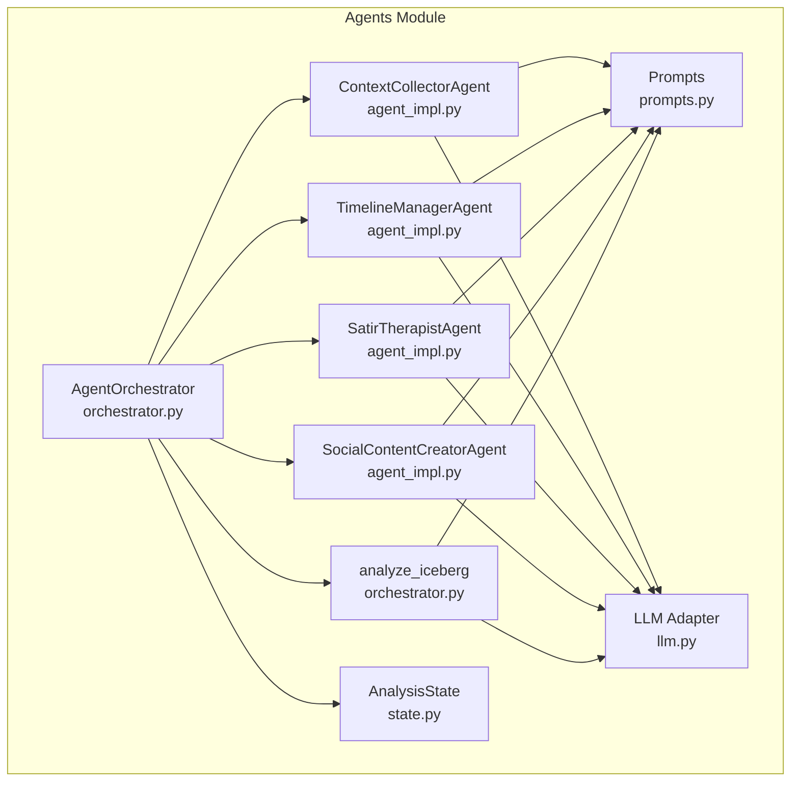
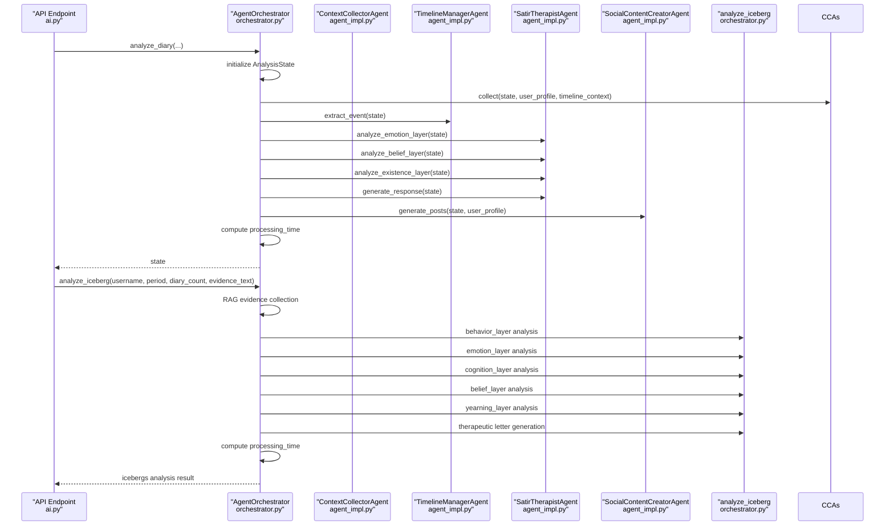
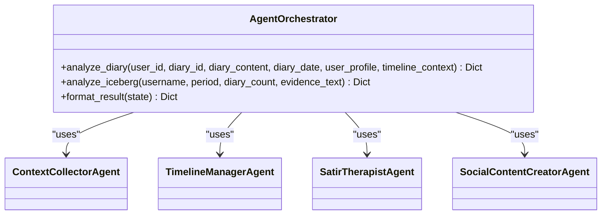
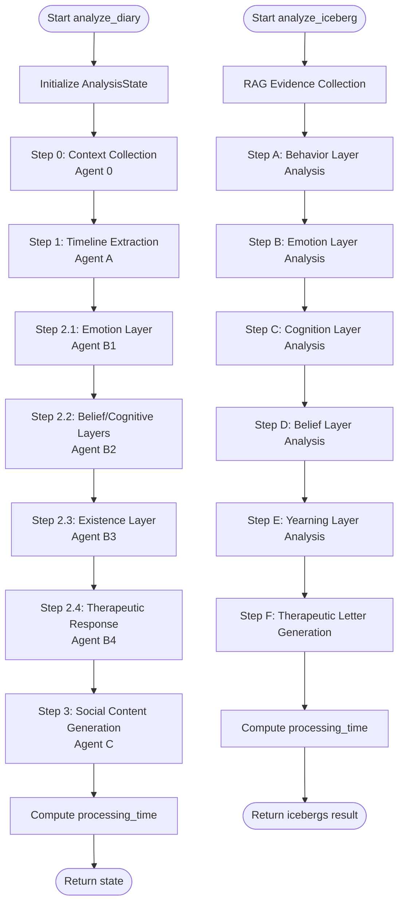

# Agent Orchestrator

<cite>
**Referenced Files in This Document**
- [orchestrator.py](file://backend/app/agents/orchestrator.py)
- [state.py](file://backend/app/agents/state.py)
- [agent_impl.py](file://backend/app/agents/agent_impl.py)
- [prompts.py](file://backend/app/agents/prompts.py)
- [llm.py](file://backend/app/agents/llm.py)
- [ai.py](file://backend/app/api/v1/ai.py)
- [config.py](file://backend/app/core/config.py)
</cite>

## Update Summary
**Changes Made**
- Added comprehensive documentation for the new analyze_iceberg method
- Updated workflow diagrams to include the new multi-agent icebergs analysis system
- Enhanced seven-step analysis pipeline documentation with the new 5-layer psychological analysis
- Added detailed coverage of the new icebergs analysis prompts and JSON response structures
- Updated format_result method documentation to reflect the expanded analysis capabilities
- Added new section covering the RAG integration and multi-agent coordination

## Table of Contents
1. [Introduction](#introduction)
2. [Project Structure](#project-structure)
3. [Core Components](#core-components)
4. [Architecture Overview](#architecture-overview)
5. [Detailed Component Analysis](#detailed-component-analysis)
6. [Dependency Analysis](#dependency-analysis)
7. [Performance Considerations](#performance-considerations)
8. [Troubleshooting Guide](#troubleshooting-guide)
9. [Conclusion](#conclusion)
10. [Appendices](#appendices)

## Introduction
This document provides comprehensive documentation for the AgentOrchestrator class, the central coordinator of the multi-agent AI system. The system now features an enhanced multi-agent icebergs analysis system with comprehensive 5-layer psychological analysis (behavioral patterns, emotional flow, cognitive distortions, core beliefs, deepest yearnings) with RAG integration and detailed JSON response structures. It explains the seven-step analysis pipeline from context collection to therapeutic response generation, details the initialization process, state management through AnalysisState, error handling mechanisms, and the workflow diagram showing agent interactions and state transitions. It also documents the format_result method and its output structure, provides examples of the complete analysis flow, and explains how the orchestrator maintains context across multiple agent interactions.

## Project Structure
The orchestrator resides in the backend agents module and coordinates four specialized agents plus the new icebergs analysis system:
- ContextCollectorAgent (Agent 0)
- TimelineManagerAgent (Agent A)
- SatirTherapistAgent (Agent B) with sub-steps B1–B4
- SocialContentCreatorAgent (Agent C)
- **New**: analyze_iceberg method for comprehensive multi-agent icebergs analysis



**Diagram sources**
- [orchestrator.py:18-340](file://backend/app/agents/orchestrator.py#L18-L340)
- [state.py:10-45](file://backend/app/agents/state.py#L10-L45)
- [agent_impl.py:92-484](file://backend/app/agents/agent_impl.py#L92-L484)
- [prompts.py:7-433](file://backend/app/agents/prompts.py#L7-L433)
- [llm.py:13-220](file://backend/app/agents/llm.py#L13-L220)

**Section sources**
- [orchestrator.py:18-340](file://backend/app/agents/orchestrator.py#L18-L340)
- [state.py:10-45](file://backend/app/agents/state.py#L10-L45)
- [agent_impl.py:92-484](file://backend/app/agents/agent_impl.py#L92-L484)
- [prompts.py:7-433](file://backend/app/agents/prompts.py#L7-L433)
- [llm.py:13-220](file://backend/app/agents/llm.py#L13-L220)

## Core Components
- AgentOrchestrator: Central coordinator that initializes agents and orchestrates the seven-step analysis pipeline plus the new icebergs analysis system.
- AnalysisState: Typed dictionary representing the shared state across agents.
- Agent implementations: Four specialized agents implementing distinct steps in the pipeline.
- **New**: analyze_iceberg: Comprehensive multi-agent icebergs analysis system with 5-layer psychological analysis.
- Prompts: Prompt templates for each agent's tasks including new icebergs analysis prompts.
- LLM adapter: Simplified OpenAI-compatible interface backed by DeepSeek API.

Key responsibilities:
- Initialization: Creates instances of all agents and supports both traditional and icebergs analysis modes.
- Orchestration: Executes steps sequentially with explicit state transitions.
- Error handling: Catches exceptions, records errors, and returns partial results.
- Output formatting: Converts internal state to a standardized result structure.
- **New**: Multi-agent coordination: Manages sequential icebergs analysis with RAG integration.

**Section sources**
- [orchestrator.py:18-340](file://backend/app/agents/orchestrator.py#L18-L340)
- [state.py:10-45](file://backend/app/agents/state.py#L10-L45)
- [agent_impl.py:92-484](file://backend/app/agents/agent_impl.py#L92-L484)
- [prompts.py:7-433](file://backend/app/agents/prompts.py#L7-L433)
- [llm.py:13-220](file://backend/app/agents/llm.py#L13-L220)

## Architecture Overview
The orchestrator coordinates a dual-system architecture with both traditional and icebergs analysis modes. The traditional system follows a linear pipeline with explicit state transitions, while the icebergs system implements a sophisticated multi-agent approach with RAG integration.



**Diagram sources**
- [orchestrator.py:27-131](file://backend/app/agents/orchestrator.py#L27-L131)
- [orchestrator.py:132-294](file://backend/app/agents/orchestrator.py#L132-L294)
- [agent_impl.py:100-141](file://backend/app/agents/agent_impl.py#L100-L141)
- [agent_impl.py:152-202](file://backend/app/agents/agent_impl.py#L152-L202)
- [agent_impl.py:214-393](file://backend/app/agents/agent_impl.py#L214-L393)
- [agent_impl.py:404-483](file://backend/app/agents/agent_impl.py#L404-L483)
- [ai.py:358-388](file://backend/app/api/v1/ai.py#L358-L388)

## Detailed Component Analysis

### AgentOrchestrator
Responsibilities:
- Initializes agents: ContextCollectorAgent, TimelineManagerAgent, SatirTherapistAgent, SocialContentCreatorAgent.
- **New**: Coordinates comprehensive icebergs analysis with RAG integration.
- Executes the seven-step pipeline with explicit state transitions.
- Handles exceptions and populates error metadata.
- Computes total processing time.
- Formats final result via format_result.

**New** analyze_iceberg method:
- **Purpose**: Comprehensive multi-agent icebergs analysis system with 5-layer psychological analysis.
- **Input**: username, period, diary_count, evidence_text (RAG results).
- **Output**: behavior_layer, emotion_layer, cognition_layer, belief_layer, yearning_layer, letter, agent_runs.
- **Process**: Sequential 5-layer analysis with JSON validation and fallback mechanisms.

Initialization:
- Creates agent instances in __init__.
- No external dependencies beyond agent_impl imports.

Pipeline steps:
- Traditional pipeline: context_collection → timeline_extraction → satir_analysis phases → social_content_generation
- **New** Icebergs pipeline: behavior_layer → emotion_layer → cognition_layer → belief_layer → yearning_layer → therapeutic_letter

Error handling:
- Wraps the entire pipeline in a try-except block.
- On failure, sets error field and returns state with partial results.
- **New**: Individual agent runs tracked with success/error status and duration.

Output formatting:
- format_result converts internal state to a structured dictionary suitable for API responses.
- **New**: Supports both traditional and icebergs analysis output formats.

**Section sources**
- [orchestrator.py:18-340](file://backend/app/agents/orchestrator.py#L18-L340)

#### Class Diagram


**Diagram sources**
- [orchestrator.py:18-340](file://backend/app/agents/orchestrator.py#L18-L340)
- [agent_impl.py:92-484](file://backend/app/agents/agent_impl.py#L92-L484)

### AnalysisState
Typed dictionary defining the shared state across agents. Keys include:
- Inputs: user_id, diary_id, diary_content, diary_date, user_profile, timeline_context, related_memories.
- Intermediate outputs: behavior_layer, emotion_layer, cognitive_layer, belief_layer, core_self_layer, timeline_event, social_posts.
- Final outputs: therapeutic_response.
- Metadata: processing_time, error, current_step, agent_runs.

**New**: Enhanced for icebergs analysis with additional layer tracking:
- behavior_layer: Behavioral patterns and activities
- emotion_layer: Emotional flow and trends
- cognition_layer: Cognitive distortions and thought patterns
- belief_layer: Core beliefs and life rules
- yearning_layer: Deeper yearnings and life direction

This structure ensures predictable data flow and simplifies debugging and persistence.

**Section sources**
- [state.py:10-45](file://backend/app/agents/state.py#L10-L45)

### Agent Implementations

#### ContextCollectorAgent (Agent 0)
- Purpose: Collect contextual information from user profile and timeline context.
- Input: AnalysisState, user_profile, timeline_context.
- Output: Updates AnalysisState with collected context.
- Error handling: Logs and continues; preserves original inputs.

Key behaviors:
- Builds a prompt using CONTEXT_COLLECTOR_PROMPT.
- Calls LLM with JSON response format.
- Parses JSON payload robustly.

**Section sources**
- [agent_impl.py:92-142](file://backend/app/agents/agent_impl.py#L92-L142)
- [prompts.py:9-28](file://backend/app/agents/prompts.py#L9-L28)

#### TimelineManagerAgent (Agent A)
- Purpose: Extract a structured timeline event from diary content.
- Input: AnalysisState.
- Output: timeline_event in AnalysisState.
- Error handling: Falls back to default event on failure.

Key behaviors:
- Uses TIMELINE_EXTRACTOR_PROMPT.
- Constructs event with summary, emotion tag, importance score, type, and related entities.
- Graceful degradation to default event.

**Section sources**
- [agent_impl.py:144-202](file://backend/app/agents/agent_impl.py#L144-L202)
- [prompts.py:33-57](file://backend/app/agents/prompts.py#L33-L57)

#### SatirTherapistAgent (Agent B)
- Purpose: Perform five-layer analysis using the Satir Iceberg Model.
- Sub-steps:
  - B1: analyze_emotion_layer
  - B2: analyze_belief_layer
  - B3: analyze_existence_layer
  - B4: generate_response

Key behaviors:
- Uses separate LLMs for analytical tasks and creative response generation.
- Each sub-step builds on previous layers.
- Robust JSON parsing and fallbacks on failures.

**Section sources**
- [agent_impl.py:205-393](file://backend/app/agents/agent_impl.py#L205-L393)
- [prompts.py:62-163](file://backend/app/agents/prompts.py#L62-L163)

#### SocialContentCreatorAgent (Agent C)
- Purpose: Generate social media posts based on user profile and event context.
- Input: AnalysisState, user_profile.
- Output: social_posts in AnalysisState.
- Error handling: Generates simple fallback posts on failure.

Key behaviors:
- Uses SOCIAL_POST_CREATOR_PROMPT.
- Attempts multiple strategies to parse JSON from LLM output.
- Fallback to two simple posts if parsing fails.

**Section sources**
- [agent_impl.py:396-483](file://backend/app/agents/agent_impl.py#L396-L483)
- [prompts.py:168-208](file://backend/app/agents/prompts.py#L168-L208)

### New: analyze_iceberg Method
**Purpose**: Comprehensive multi-agent icebergs analysis system with 5-layer psychological analysis and RAG integration.

**Process Flow**:
1. **Behavior Layer Analysis (Step A)**: Identifies behavioral patterns and activities across diary entries
2. **Emotion Layer Analysis (Step B)**: Analyzes emotional flow and trends over time
3. **Cognition Layer Analysis (Step C)**: Discovers cognitive distortions and thought patterns
4. **Belief Layer Analysis (Step D)**: Uncovers core beliefs and life rules
5. **Yearning Layer Analysis (Step E)**: Reveals deepest yearnings and life direction
6. **Therapeutic Letter Generation (Step F)**: Creates personalized healing letter

**Key Features**:
- **RAG Integration**: Uses evidence_text from retrieval augmented generation
- **Sequential Processing**: Each layer builds upon previous analyses
- **JSON Validation**: Strict JSON parsing with multiple fallback strategies
- **Performance Tracking**: Detailed agent_runs logging with timing
- **Error Handling**: Graceful degradation with fallback responses

**Output Structure**:
```json
{
  "behavior_layer": {...},
  "emotion_layer": {...},
  "cognition_layer": {...},
  "belief_layer": {...},
  "yearning_layer": {...},
  "letter": "Personalized therapeutic letter",
  "agent_runs": [...],
  "processing_time": 0.0
}
```

**Section sources**
- [orchestrator.py:132-294](file://backend/app/agents/orchestrator.py#L132-L294)
- [prompts.py:213-397](file://backend/app/agents/prompts.py#L213-L397)

### Prompts
Each agent has a dedicated prompt template defining:
- Task description
- Input context formatting
- Output schema expectations
- Style and tone requirements

**New Icebergs Analysis Prompts**:
- ICEBERG_BEHAVIOR_PROMPT: Identifies behavioral patterns across multiple diary entries
- ICEBERG_EMOTION_PROMPT: Analyzes emotional flow and trends over time periods
- ICEBERG_COGNITION_PROMPT: Discovers repeated thought patterns and cognitive distortions
- ICEBERG_BELIEF_PROMPT: Uncovers core beliefs and self-narratives
- ICEBERG_YEARNING_PROMPT: Reveals deepest yearnings and life direction
- ICEBERG_LETTER_PROMPT: Generates personalized therapeutic letters

**Traditional Prompts**:
- CONTEXT_COLLECTOR_PROMPT: Summarizes current mood, concerns, and hopes.
- TIMELINE_EXTRACTOR_PROMPT: Extracts event summary, emotion tag, importance, type, and entities.
- SATIR_EMOTION_PROMPT: Analyzes surface and underlying emotions.
- SATIR_BELIEF_PROMPT: Identifies irrational beliefs, automatic thoughts, core beliefs, and life rules.
- SATIR_EXISTENCE_PROMPT: Discovers yearnings, life energy, deepest desire, and existence insight.
- SATIR_RESPONDER_PROMPT: Generates a warm, therapeutic response.
- SOCIAL_POST_CREATOR_PROMPT: Produces multiple versions of social posts.

**Section sources**
- [prompts.py:7-433](file://backend/app/agents/prompts.py#L7-L433)

### LLM Adapter
The system uses a simplified OpenAI-compatible interface backed by DeepSeek API:
- DeepSeekClient: Handles HTTP requests to DeepSeek chat completions.
- ChatOpenAI: LangChain-compatible wrapper around DeepSeekClient.
- get_llm/get_analytical_llm/get_creative_llm: Factory functions returning configured LLM instances.

**Enhanced Integration**:
- **New**: Direct access to deepseek_client for icebergs analysis
- **New**: Support for JSON response format validation
- **New**: Temperature tuning for different analysis types (0.3 for analytical, 0.8 for creative)

Integration:
- Agents call ChatOpenAI.ainvoke with system and human messages.
- **New**: Icebergs analysis uses direct JSON parsing with validation.
- Response format support for JSON output.

**Section sources**
- [llm.py:13-220](file://backend/app/agents/llm.py#L13-L220)
- [config.py:62-70](file://backend/app/core/config.py#L62-L70)

### Workflow Diagram with State Transitions


**Diagram sources**
- [orchestrator.py:27-131](file://backend/app/agents/orchestrator.py#L27-L131)
- [orchestrator.py:132-294](file://backend/app/agents/orchestrator.py#L132-L294)

## Dependency Analysis
- AgentOrchestrator depends on:
  - agent_impl.py for agent implementations
  - state.py for AnalysisState type
  - **New**: Direct access to deepseek_client for icebergs analysis
- Agent implementations depend on:
  - prompts.py for templates
  - llm.py for LLM interface
- API endpoint (ai.py) depends on AgentOrchestrator for orchestration and result formatting.
- **New**: RAG service integration for evidence collection.

Potential circular dependencies:
- None detected among orchestrator, agents, and state.

External dependencies:
- DeepSeek API via llm.py
- LangChain-compatible interface abstraction
- **New**: RAG service for evidence collection

**Section sources**
- [orchestrator.py:9-15](file://backend/app/agents/orchestrator.py#L9-L15)
- [agent_impl.py:12-22](file://backend/app/agents/agent_impl.py#L12-L22)
- [ai.py:21, 358-388:21-388](file://backend/app/api/v1/ai.py#L21-L388)

## Performance Considerations
- Asynchronous execution: All agent methods are async, enabling concurrent I/O-bound LLM calls.
- **New**: Sequential icebergs analysis with optimized prompt chaining.
- Temperature tuning: Different LLM configurations for analytical vs. creative tasks.
- JSON parsing robustness: Multiple strategies to extract structured output from LLM responses.
- Error handling: Graceful fallbacks prevent pipeline termination and preserve partial results.
- Timing: Total processing time computed at the end for observability.
- **New**: Detailed agent_runs tracking for performance monitoring.

## Troubleshooting Guide
Common issues and resolutions:
- LLM response parsing failures:
  - Cause: Non-JSON or malformed responses.
  - Resolution: The system attempts multiple parsing strategies; falls back to defaults.
- Agent failures:
  - Cause: Network errors, timeouts, or invalid prompts.
  - Resolution: Each agent logs errors and continues; state.error captures the error message.
- **New**: Icebergs analysis failures:
  - Cause: Missing evidence_text or invalid JSON responses.
  - Resolution: Individual steps log errors and continue; fallback responses provided.
- Missing API keys:
  - Cause: DeepSeek API key not configured.
  - Resolution: Configure settings.deepseek_api_key and settings.deepseek_base_url.
- JSON decode errors:
  - Cause: Malformed JSON in agent outputs.
  - Resolution: _parse_json_payload handles various formats; fallbacks exist in agents.

Operational tips:
- Monitor processing_time and agent_runs for performance insights.
- Inspect metadata.workflow and workflow_detail for step-by-step breakdown.
- Use format_result to standardize outputs for clients.
- **New**: Track individual agent_runs for detailed performance analysis.

**Section sources**
- [agent_impl.py:25-68](file://backend/app/agents/agent_impl.py#L25-L68)
- [agent_impl.py:136-141](file://backend/app/agents/agent_impl.py#L136-L141)
- [agent_impl.py:191-202](file://backend/app/agents/agent_impl.py#L191-L202)
- [agent_impl.py:293-298](file://backend/app/agents/agent_impl.py#L293-L298)
- [agent_impl.py:337-346](file://backend/app/agents/agent_impl.py#L337-L346)
- [agent_impl.py:388-393](file://backend/app/agents/agent_impl.py#L388-L393)
- [agent_impl.py:465-483](file://backend/app/agents/agent_impl.py#L465-L483)
- [orchestrator.py:121-130](file://backend/app/agents/orchestrator.py#L121-L130)
- [orchestrator.py:160-169](file://backend/app/agents/orchestrator.py#L160-L169)
- [config.py:62-70](file://backend/app/core/config.py#L62-L70)

## Conclusion
The AgentOrchestrator provides a robust, modular framework for multi-agent analysis with enhanced icebergs analysis capabilities. Its dual-system architecture supports both traditional seven-step analysis and comprehensive multi-agent icebergs analysis with 5-layer psychological insights. The design emphasizes resilience, observability, extensibility, and sophisticated RAG integration, making it suitable for iterative improvements and integration with broader systems.

## Appendices

### Seven-Step Analysis Pipeline Details
- Step 0: Context Collection
  - Agent 0 gathers user profile and timeline context.
  - Updates AnalysisState with collected context.
- Step 1: Timeline Extraction
  - Agent A extracts a structured timeline event.
  - Provides event_summary, emotion_tag, importance_score, event_type, and related_entities.
- Steps 2.1–2.4: Satir Analysis
  - B1: Emotion layer analysis (surface and underlying emotions).
  - B2: Belief/cognitive layers (irrational beliefs, automatic thoughts, core beliefs, life rules).
  - B3: Existence layer (yearnings, life energy, deepest desire, existence insight).
  - B4: Therapeutic response generation.
- Step 3: Social Content Generation
  - Agent C generates multiple social media post variants.

**New**: Five-Layer Icebergs Analysis
- **Layer A**: Behavior patterns and activities across diary entries
- **Layer B**: Emotional flow and trends over time periods
- **Layer C**: Cognitive distortions and repeated thought patterns
- **Layer D**: Core beliefs and self-narratives
- **Layer E**: Deeper yearnings and life direction
- **Layer F**: Personalized therapeutic letter

**Section sources**
- [orchestrator.py:83-109](file://backend/app/agents/orchestrator.py#L83-L109)
- [orchestrator.py:132-294](file://backend/app/agents/orchestrator.py#L132-L294)
- [agent_impl.py:100-141](file://backend/app/agents/agent_impl.py#L100-L141)
- [agent_impl.py:152-202](file://backend/app/agents/agent_impl.py#L152-L202)
- [agent_impl.py:214-393](file://backend/app/agents/agent_impl.py#L214-L393)
- [agent_impl.py:404-483](file://backend/app/agents/agent_impl.py#L404-L483)

### format_result Output Structure
The method transforms internal AnalysisState into a standardized result:
- diary_id, user_id
- timeline_event
- satir_analysis: behavior_layer, emotion_layer, cognitive_layer, belief_layer, core_self_layer
- therapeutic_response
- social_posts
- metadata: processing_time, current_step, error, workflow, workflow_detail, agent_runs

**New**: Icebergs Analysis Output
- behavior_layer, emotion_layer, cognition_layer, belief_layer, yearning_layer
- letter (personalized therapeutic message)
- evidence (RAG evidence used in analysis)
- metadata: analysis_scope, window_days, analyzed_diary_count, retrieved_chunk_count

**Section sources**
- [orchestrator.py:296-335](file://backend/app/agents/orchestrator.py#L296-L335)
- [ai.py:371-388](file://backend/app/api/v1/ai.py#L371-L388)

### Example Usage
- API endpoint usage:
  - The endpoint orchestrates analysis, formats results, persists timeline events and analysis results, and returns the formatted output.
  - **New**: Icebergs analysis endpoint integrates RAG evidence collection and multi-agent coordination.
- Test usage:
  - The test script demonstrates end-to-end execution with sample inputs and prints selected fields from the state.

**Section sources**
- [ai.py:358-388](file://backend/app/api/v1/ai.py#L358-L388)
- [ai.py:391-549](file://backend/app/api/v1/ai.py#L391-L549)