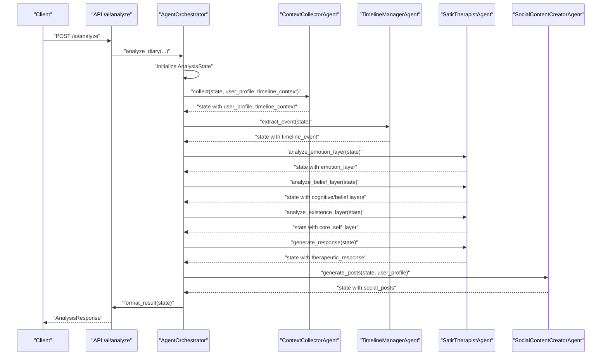
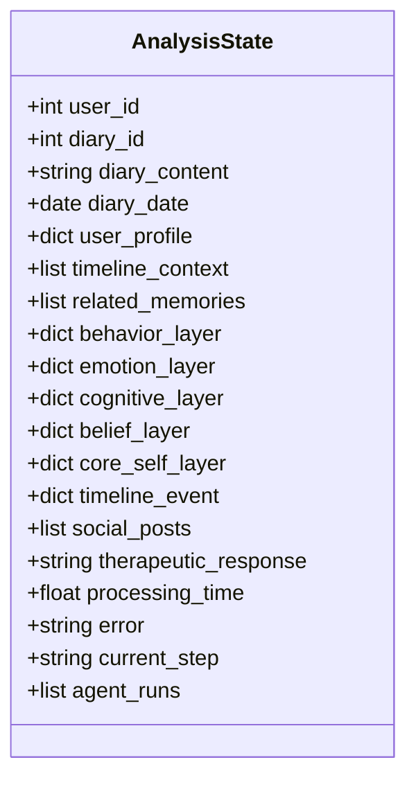
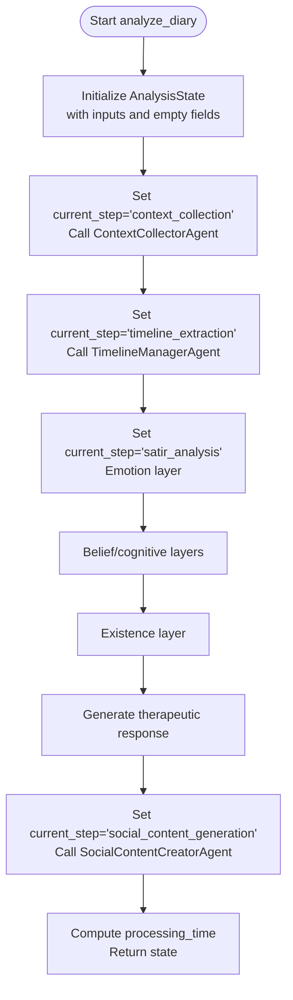
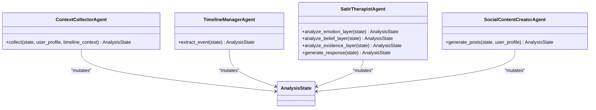
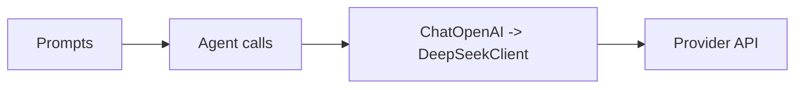
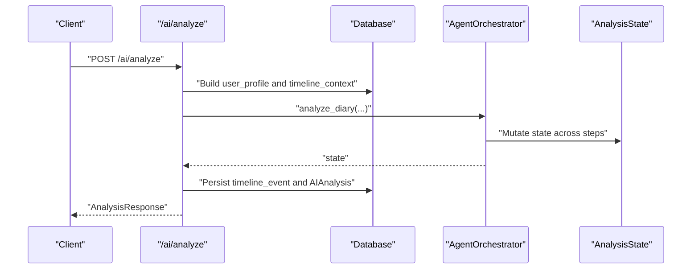
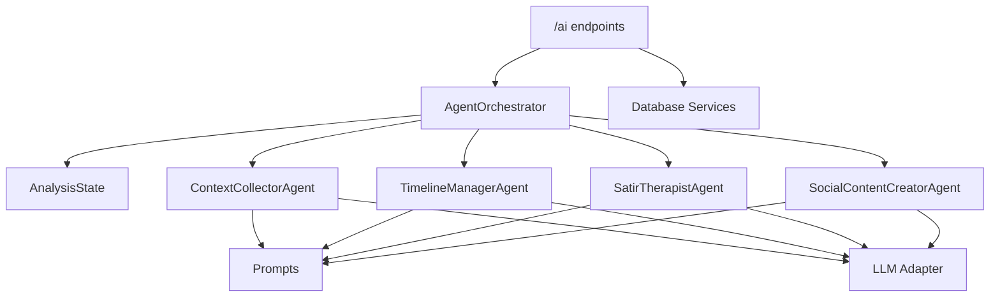

# Analysis State Management

<cite>
**Referenced Files in This Document**
- [state.py](file://backend/app/agents/state.py)
- [orchestrator.py](file://backend/app/agents/orchestrator.py)
- [agent_impl.py](file://backend/app/agents/agent_impl.py)
- [prompts.py](file://backend/app/agents/prompts.py)
- [llm.py](file://backend/app/agents/llm.py)
- [ai.py](file://backend/app/api/v1/ai.py)
- [config.py](file://backend/app/core/config.py)
- [test_ai_agents.py](file://backend/test_ai_agents.py)
</cite>

## Table of Contents
1. [Introduction](#introduction)
2. [Project Structure](#project-structure)
3. [Core Components](#core-components)
4. [Architecture Overview](#architecture-overview)
5. [Detailed Component Analysis](#detailed-component-analysis)
6. [Dependency Analysis](#dependency-analysis)
7. [Performance Considerations](#performance-considerations)
8. [Troubleshooting Guide](#troubleshooting-guide)
9. [Conclusion](#conclusion)
10. [Appendices](#appendices)

## Introduction
This document explains the AnalysisState management system used by the multi-agent workflow for diary analysis. It covers the state structure, initialization, transitions, data flow between agents, and final formatting. It also provides examples of state snapshots across workflow stages and highlights how the state system preserves context across multiple analysis steps while enabling complex multi-step analysis with data consistency.

## Project Structure
The state management spans several modules:
- State definition and typing
- Orchestrator that coordinates agents and manages state transitions
- Individual agents that mutate the state
- Prompts and LLM adapters used by agents
- API endpoints that trigger analysis and persist results
- Configuration for LLM providers

```mermaid
graph TB
subgraph "Agents"
A0["ContextCollectorAgent"]
AA["TimelineManagerAgent"]
AB["SatirTherapistAgent"]
AC["SocialContentCreatorAgent"]
end
subgraph "State & Orchestration"
State["AnalysisState (TypedDict)"]
Orchestrator["AgentOrchestrator"]
end
subgraph "Prompts & LLM"
Prompts["Prompts"]
LLM["LLM Adapter (ChatOpenAI -> DeepSeek)"]
end
subgraph "API"
API["/ai endpoints"]
end
API --> Orchestrator
Orchestrator --> A0
Orchestrator --> AA
Orchestrator --> AB
Orchestrator --> AC
A0 --> Prompts
AA --> Prompts
AB --> Prompts
AC --> Prompts
A0 --> LLM
AA --> LLM
AB --> LLM
AC --> LLM
Orchestrator --> State
A0 --> State
AA --> State
AB --> State
AC --> State
```

**Diagram sources**
- [state.py:10-45](file://backend/app/agents/state.py#L10-L45)
- [orchestrator.py:18-176](file://backend/app/agents/orchestrator.py#L18-L176)
- [agent_impl.py:92-484](file://backend/app/agents/agent_impl.py#L92-L484)
- [prompts.py:1-244](file://backend/app/agents/prompts.py#L1-L244)
- [llm.py:13-220](file://backend/app/agents/llm.py#L13-L220)
- [ai.py:406-638](file://backend/app/api/v1/ai.py#L406-L638)

**Section sources**
- [state.py:10-45](file://backend/app/agents/state.py#L10-L45)
- [orchestrator.py:18-176](file://backend/app/agents/orchestrator.py#L18-L176)
- [agent_impl.py:92-484](file://backend/app/agents/agent_impl.py#L92-L484)
- [prompts.py:1-244](file://backend/app/agents/prompts.py#L1-L244)
- [llm.py:13-220](file://backend/app/agents/llm.py#L13-L220)
- [ai.py:406-638](file://backend/app/api/v1/ai.py#L406-L638)

## Core Components
- AnalysisState: Defines the complete state schema used across the workflow, including inputs, context, analysis layers, outputs, and metadata.
- AgentOrchestrator: Initializes state, sequences agent steps, and formats the final result.
- Agents: Mutate the shared state by adding context, extracting events, performing layered analysis, and generating outputs.
- Prompts: Provide structured instructions for each agent’s tasks.
- LLM Adapter: Bridges LangChain-like calls to the configured provider.
- API Layer: Triggers analysis, builds initial context, and persists results.

Key state fields:
- Inputs: user_id, diary_id, diary_content, diary_date
- Context: user_profile, timeline_context, related_memories
- Analysis layers: behavior_layer, emotion_layer, cognitive_layer, belief_layer, core_self_layer
- Additional outputs: timeline_event, social_posts, therapeutic_response
- Metadata: processing_time, error, current_step, agent_runs

**Section sources**
- [state.py:10-45](file://backend/app/agents/state.py#L10-L45)
- [orchestrator.py:27-131](file://backend/app/agents/orchestrator.py#L27-L131)
- [agent_impl.py:92-484](file://backend/app/agents/agent_impl.py#L92-L484)

## Architecture Overview
The system follows a pipeline orchestrated by AgentOrchestrator:
1. Initialization: Build AnalysisState with inputs and empty placeholders for derived fields.
2. Context collection: Populate user_profile and timeline_context.
3. Timeline extraction: Produce timeline_event.
4. Satir analysis: Populate emotion_layer, cognitive_layer, belief_layer, and core_self_layer.
5. Therapeutic response: Generate therapeutic_response.
6. Social posts: Generate social_posts.
7. Final formatting: Return a structured result with metadata.



**Diagram sources**
- [orchestrator.py:27-131](file://backend/app/agents/orchestrator.py#L27-L131)
- [agent_impl.py:100-484](file://backend/app/agents/agent_impl.py#L100-L484)
- [ai.py:520-532](file://backend/app/api/v1/ai.py#L520-L532)

## Detailed Component Analysis

### State Definition and Schema
AnalysisState is a TypedDict that defines the complete schema for the workflow state. It separates concerns into:
- Inputs: immutable identifiers and content
- Context: derived from user profile and timeline context
- Analysis layers: five-layer model (behavior, emotion, cognition, belief, core self)
- Outputs: timeline_event, social_posts, therapeutic_response
- Metadata: runtime diagnostics and execution history



**Diagram sources**
- [state.py:10-45](file://backend/app/agents/state.py#L10-L45)

**Section sources**
- [state.py:10-45](file://backend/app/agents/state.py#L10-L45)

### Orchestrator: State Initialization and Transitions
The orchestrator initializes AnalysisState with inputs and empty placeholders, then sequentially invokes agents. Each agent update is a mutation of the shared state dictionary. The orchestrator also records agent runs and timing metadata.

Key responsibilities:
- Initialize state with defaults
- Transition current_step between steps
- Aggregate agent runs and errors
- Compute processing_time
- Format final result



**Diagram sources**
- [orchestrator.py:27-131](file://backend/app/agents/orchestrator.py#L27-L131)

**Section sources**
- [orchestrator.py:27-131](file://backend/app/agents/orchestrator.py#L27-L131)

### Agent Implementations: State Updates and Error Handling
Each agent receives the shared state and mutates specific fields. Agents wrap their operations with run tracking and degrade gracefully on failures by setting safe defaults.

- ContextCollectorAgent: Populates user_profile and timeline_context.
- TimelineManagerAgent: Produces timeline_event with summary, emotion tag, importance score, and related entities.
- SatirTherapistAgent: Adds emotion_layer, cognitive_layer, belief_layer, and core_self_layer; generates therapeutic_response.
- SocialContentCreatorAgent: Generates social_posts with multiple versions.



**Diagram sources**
- [agent_impl.py:92-484](file://backend/app/agents/agent_impl.py#L92-L484)
- [state.py:10-45](file://backend/app/agents/state.py#L10-L45)

**Section sources**
- [agent_impl.py:92-484](file://backend/app/agents/agent_impl.py#L92-L484)

### Prompts and LLM Integration
Agents use structured prompts to guide LLMs. The LLM adapter simulates LangChain’s interface and routes calls to the configured provider.

- Prompts define the exact JSON schema expectations for each agent.
- LLM adapter supports response_format for JSON outputs and streaming.
- Configuration loads provider credentials and base URL.



**Diagram sources**
- [prompts.py:1-244](file://backend/app/agents/prompts.py#L1-L244)
- [llm.py:13-220](file://backend/app/agents/llm.py#L13-L220)
- [config.py:62-70](file://backend/app/core/config.py#L62-L70)

**Section sources**
- [prompts.py:1-244](file://backend/app/agents/prompts.py#L1-L244)
- [llm.py:13-220](file://backend/app/agents/llm.py#L13-L220)
- [config.py:62-70](file://backend/app/core/config.py#L62-L70)

### API Integration and Persistence
The API endpoint constructs user_profile and timeline_context, invokes the orchestrator, formats the result, and persists analysis artifacts.

- Builds user_profile from aggregated diary statistics.
- Gathers timeline_context from the timeline service.
- Calls orchestrator.analyze_diary and orchestrator.format_result.
- Persists timeline events and analysis results.



**Diagram sources**
- [ai.py:406-638](file://backend/app/api/v1/ai.py#L406-L638)
- [orchestrator.py:132-171](file://backend/app/agents/orchestrator.py#L132-L171)

**Section sources**
- [ai.py:406-638](file://backend/app/api/v1/ai.py#L406-L638)
- [orchestrator.py:132-171](file://backend/app/agents/orchestrator.py#L132-L171)

## Dependency Analysis
- Orchestrator depends on agents and state.
- Agents depend on prompts and LLM adapter.
- API depends on orchestrator and services for context building.
- LLM adapter depends on configuration for provider settings.



**Diagram sources**
- [orchestrator.py:18-176](file://backend/app/agents/orchestrator.py#L18-L176)
- [agent_impl.py:92-484](file://backend/app/agents/agent_impl.py#L92-L484)
- [prompts.py:1-244](file://backend/app/agents/prompts.py#L1-L244)
- [llm.py:13-220](file://backend/app/agents/llm.py#L13-L220)
- [ai.py:406-638](file://backend/app/api/v1/ai.py#L406-L638)

**Section sources**
- [orchestrator.py:18-176](file://backend/app/agents/orchestrator.py#L18-L176)
- [agent_impl.py:92-484](file://backend/app/agents/agent_impl.py#L92-L484)
- [prompts.py:1-244](file://backend/app/agents/prompts.py#L1-L244)
- [llm.py:13-220](file://backend/app/agents/llm.py#L13-L220)
- [ai.py:406-638](file://backend/app/api/v1/ai.py#L406-L638)

## Performance Considerations
- Asynchronous LLM calls reduce latency; ensure provider rate limits are respected.
- Structured JSON prompts improve reliability and reduce retries.
- State mutations are in-memory; keep prompt sizes reasonable to minimize token costs.
- Error degradation avoids cascading failures; consider caching frequently used context.

## Troubleshooting Guide
Common issues and remedies:
- LLM parsing failures: Agents include robust JSON parsing helpers and degrade to safe defaults.
- Missing context: Ensure user_profile and timeline_context are populated before invoking agents.
- Provider errors: Verify configuration keys and base URLs.
- State corruption: Since state is a mutable dict, avoid concurrent writes; the orchestrator serializes steps.

Operational checks:
- Confirm provider credentials and base URL are set.
- Validate prompt JSON schemas align with agent expectations.
- Inspect agent_runs metadata for timing and error details.

**Section sources**
- [agent_impl.py:25-68](file://backend/app/agents/agent_impl.py#L25-L68)
- [agent_impl.py:136-141](file://backend/app/agents/agent_impl.py#L136-L141)
- [agent_impl.py:191-202](file://backend/app/agents/agent_impl.py#L191-L202)
- [agent_impl.py:293-298](file://backend/app/agents/agent_impl.py#L293-L298)
- [agent_impl.py:337-346](file://backend/app/agents/agent_impl.py#L337-L346)
- [agent_impl.py:465-482](file://backend/app/agents/agent_impl.py#L465-L482)
- [config.py:62-70](file://backend/app/core/config.py#L62-L70)

## Conclusion
The AnalysisState management system provides a clean, typed, and mutable state container that enables a multi-agent workflow to preserve context across steps. The orchestrator coordinates agent invocations, and each agent mutates the shared state with structured outputs. The API layer integrates context building, orchestration, and persistence. Together, these components support complex, multi-step analysis while maintaining data consistency and resilience.

## Appendices

### State Snapshots Across Workflow Stages
Below are representative snapshots of AnalysisState at key stages. These illustrate how fields evolve as the workflow progresses.

- After initialization:
  - Fields present: user_id, diary_id, diary_content, diary_date, user_profile, timeline_context, related_memories, behavior_layer, emotion_layer, cognitive_layer, belief_layer, core_self_layer, timeline_event, social_posts, therapeutic_response, processing_time, error, current_step, agent_runs
  - Notes: related_memories, analysis layers, timeline_event, social_posts, therapeutic_response are empty; current_step is "initialize"

- After context collection:
  - Fields present: user_id, diary_id, diary_content, diary_date, user_profile, timeline_context, related_memories, behavior_layer, emotion_layer, cognitive_layer, belief_layer, core_self_layer, timeline_event, social_posts, therapeutic_response, processing_time, error, current_step, agent_runs
  - Notes: user_profile and timeline_context are populated; current_step is "context_collection"

- After timeline extraction:
  - Fields present: user_id, diary_id, diary_content, diary_date, user_profile, timeline_context, related_memories, behavior_layer, emotion_layer, cognitive_layer, belief_layer, core_self_layer, timeline_event, social_posts, therapeutic_response, processing_time, error, current_step, agent_runs
  - Notes: timeline_event is populated; current_step is "timeline_extraction"

- After Satir analysis (emotion, belief, existence):
  - Fields present: user_id, diary_id, diary_content, diary_date, user_profile, timeline_context, related_memories, behavior_layer, emotion_layer, cognitive_layer, belief_layer, core_self_layer, timeline_event, social_posts, therapeutic_response, processing_time, error, current_step, agent_runs
  - Notes: emotion_layer, cognitive_layer, belief_layer, core_self_layer are populated; current_step is "satir_analysis"

- After therapeutic response generation:
  - Fields present: user_id, diary_id, diary_content, diary_date, user_profile, timeline_context, related_memories, behavior_layer, emotion_layer, cognitive_layer, belief_layer, core_self_layer, timeline_event, social_posts, therapeutic_response, processing_time, error, current_step, agent_runs
  - Notes: therapeutic_response is populated; current_step is "satir_analysis"

- After social posts generation:
  - Fields present: user_id, diary_id, diary_content, diary_date, user_profile, timeline_context, related_memories, behavior_layer, emotion_layer, cognitive_layer, belief_layer, core_self_layer, timeline_event, social_posts, therapeutic_response, processing_time, error, current_step, agent_runs
  - Notes: social_posts is populated; current_step is "social_content_generation"

- Final formatted result:
  - Fields present: diary_id, user_id, timeline_event, satir_analysis, therapeutic_response, social_posts, metadata
  - Notes: metadata includes processing_time, current_step, error, workflow steps, and agent_runs

These snapshots demonstrate how the state preserves context across steps and aggregates outputs progressively.

**Section sources**
- [orchestrator.py:52-73](file://backend/app/agents/orchestrator.py#L52-L73)
- [agent_impl.py:100-141](file://backend/app/agents/agent_impl.py#L100-L141)
- [agent_impl.py:152-202](file://backend/app/agents/agent_impl.py#L152-L202)
- [agent_impl.py:214-393](file://backend/app/agents/agent_impl.py#L214-L393)
- [agent_impl.py:404-483](file://backend/app/agents/agent_impl.py#L404-L483)
- [orchestrator.py:132-171](file://backend/app/agents/orchestrator.py#L132-L171)

### Example Test Case
A test script demonstrates end-to-end usage of the orchestrator with realistic inputs and prints intermediate results.

- Prepares user_profile and timeline_context
- Invokes orchestrator.analyze_diary
- Prints timeline_event, emotion_layer, core_self_layer, therapeutic_response, and social_posts
- Handles exceptions and shows error metadata

**Section sources**
- [test_ai_agents.py:16-127](file://backend/test_ai_agents.py#L16-L127)