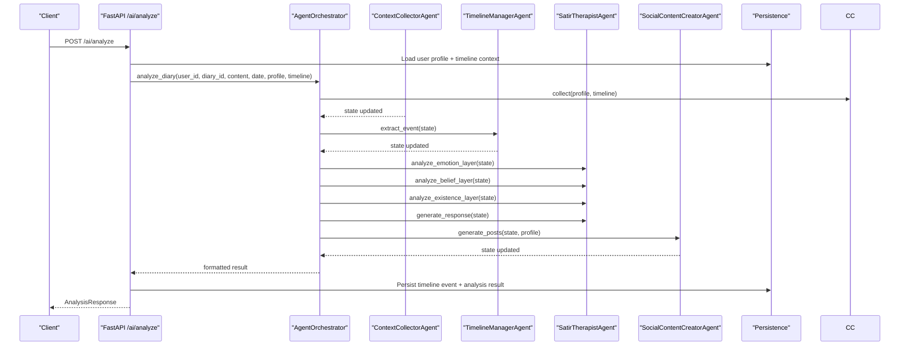
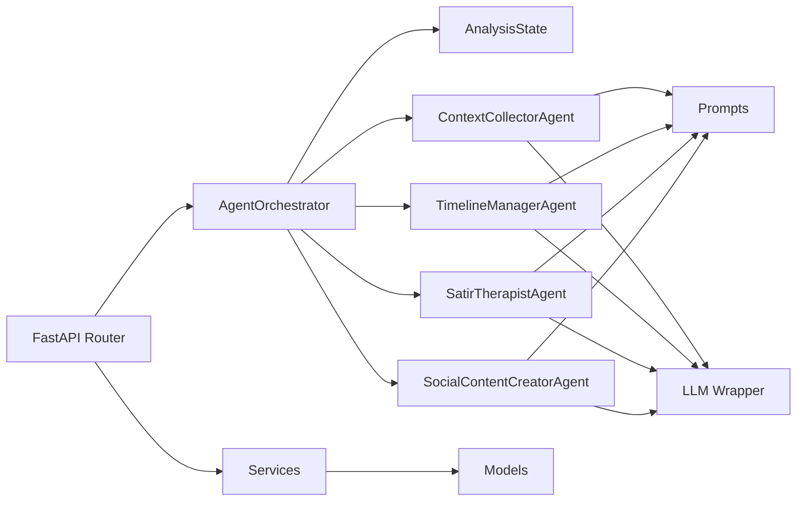
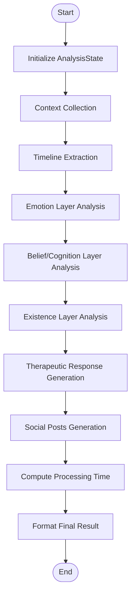

# Multi-Agent System

<cite>
**Referenced Files in This Document**
- [orchestrator.py](file://backend/app/agents/orchestrator.py)
- [state.py](file://backend/app/agents/state.py)
- [agent_impl.py](file://backend/app/agents/agent_impl.py)
- [prompts.py](file://backend/app/agents/prompts.py)
- [llm.py](file://backend/app/agents/llm.py)
- [ai.py](file://backend/app/api/v1/ai.py)
- [schemas/ai.py](file://backend/app/schemas/ai.py)
- [diary.py](file://backend/app/models/diary.py)
- [diary_service.py](file://backend/app/services/diary_service.py)
- [config.py](file://backend/app/core/config.py)
- [test_ai_agents.py](file://backend/test_ai_agents.py)
</cite>

## Table of Contents
1. [Introduction](#introduction)
2. [Project Structure](#project-structure)
3. [Core Components](#core-components)
4. [Architecture Overview](#architecture-overview)
5. [Detailed Component Analysis](#detailed-component-analysis)
6. [Dependency Analysis](#dependency-analysis)
7. [Performance Considerations](#performance-considerations)
8. [Troubleshooting Guide](#troubleshooting-guide)
9. [Conclusion](#conclusion)
10. [Appendices](#appendices)

## Introduction
This document describes the multi-agent AI system architecture used to analyze user diary entries and produce structured insights, therapeutic responses, and social media content suggestions. The system centers around the AgentOrchestrator, which coordinates four specialized agents:
- ContextCollectorAgent: Aggregates user profile and timeline context
- TimelineManagerAgent: Extracts and structures timeline events from diary content
- SatirTherapistAgent: Performs five-layer analysis using the Satir Iceberg Model (behavior, emotion, cognition, beliefs, core self)
- SocialContentCreatorAgent: Generates multiple variants of social media posts based on user style and mood

The orchestrator manages a shared state object (AnalysisState) that carries inputs, intermediate results, and outputs across agents. It also formats the final result for API responses and persists analysis outcomes.

## Project Structure
The multi-agent system resides under backend/app/agents and integrates with FastAPI endpoints under backend/app/api/v1. Supporting services and models handle persistence and data retrieval.

```mermaid
graph TB
subgraph "Agents"
O["AgentOrchestrator<br/>orchestrator.py"]
C["ContextCollectorAgent<br/>agent_impl.py"]
T["TimelineManagerAgent<br/>agent_impl.py"]
S["SatirTherapistAgent<br/>agent_impl.py"]
P["SocialContentCreatorAgent<br/>agent_impl.py"]
end
subgraph "State & Prompts"
ST["AnalysisState<br/>state.py"]
PR["Prompts<br/>prompts.py"]
end
subgraph "LLM Layer"
L["LLM Wrapper<br/>llm.py"]
end
subgraph "API"
API["FastAPI Router<br/>ai.py"]
SCH["Pydantic Schemas<br/>schemas/ai.py"]
end
subgraph "Persistence"
MD["Models<br/>diary.py"]
SV["Services<br/>diary_service.py"]
end
O --> C
O --> T
O --> S
O --> P
C --> PR
T --> PR
S --> PR
P --> PR
C --> L
T --> L
S --> L
P --> L
O --> ST
API --> O
API --> SV
SV --> MD
API --> SCH
```

**Diagram sources**
- [orchestrator.py:18-176](file://backend/app/agents/orchestrator.py#L18-L176)
- [agent_impl.py:92-484](file://backend/app/agents/agent_impl.py#L92-L484)
- [state.py:10-45](file://backend/app/agents/state.py#L10-L45)
- [prompts.py:7-244](file://backend/app/agents/prompts.py#L7-L244)
- [llm.py:13-220](file://backend/app/agents/llm.py#L13-L220)
- [ai.py:406-639](file://backend/app/api/v1/ai.py#L406-L639)
- [schemas/ai.py:74-108](file://backend/app/schemas/ai.py#L74-L108)
- [diary.py:29-154](file://backend/app/models/diary.py#L29-L154)
- [diary_service.py:66-637](file://backend/app/services/diary_service.py#L66-L637)

**Section sources**
- [orchestrator.py:18-176](file://backend/app/agents/orchestrator.py#L18-L176)
- [agent_impl.py:92-484](file://backend/app/agents/agent_impl.py#L92-L484)
- [state.py:10-45](file://backend/app/agents/state.py#L10-L45)
- [prompts.py:7-244](file://backend/app/agents/prompts.py#L7-L244)
- [llm.py:13-220](file://backend/app/agents/llm.py#L13-L220)
- [ai.py:406-639](file://backend/app/api/v1/ai.py#L406-L639)
- [schemas/ai.py:74-108](file://backend/app/schemas/ai.py#L74-L108)
- [diary.py:29-154](file://backend/app/models/diary.py#L29-L154)
- [diary_service.py:66-637](file://backend/app/services/diary_service.py#L66-L637)

## Core Components
- AgentOrchestrator: Central coordinator that initializes agents, runs the sequential analysis pipeline, manages state transitions, and formats results.
- AnalysisState: Typed dictionary defining the shared state across agents, including inputs, intermediate results, outputs, and metadata.
- Agent implementations: Four specialized agents with distinct responsibilities and prompt templates.
- LLM wrapper: Provides a simplified asynchronous interface compatible with LangChain-like usage while delegating to a DeepSeek-compatible API.
- API endpoints: Expose analysis workflows to clients, integrate with persistence, and return structured results.

Key responsibilities:
- Orchestrator: Pipeline control, state initialization, step tracking, error handling, and result formatting.
- ContextCollectorAgent: Builds contextual inputs from user profile and timeline context.
- TimelineManagerAgent: Extracts and structures a single timeline event from the diary content.
- SatirTherapistAgent: Executes multi-stage psychological analysis and generates a therapeutic response.
- SocialContentCreatorAgent: Produces multiple social media post variants aligned with user style.

**Section sources**
- [orchestrator.py:18-176](file://backend/app/agents/orchestrator.py#L18-L176)
- [state.py:10-45](file://backend/app/agents/state.py#L10-L45)
- [agent_impl.py:92-484](file://backend/app/agents/agent_impl.py#L92-L484)
- [prompts.py:7-244](file://backend/app/agents/prompts.py#L7-L244)
- [llm.py:13-220](file://backend/app/agents/llm.py#L13-L220)

## Architecture Overview
The system follows a sequential pipeline orchestrated by AgentOrchestrator. Each agent consumes the shared state, mutates it, and passes it forward. Agents communicate indirectly via the state object and use prompt templates to guide LLM inference.



**Diagram sources**
- [ai.py:406-639](file://backend/app/api/v1/ai.py#L406-L639)
- [orchestrator.py:27-131](file://backend/app/agents/orchestrator.py#L27-L131)
- [agent_impl.py:100-483](file://backend/app/agents/agent_impl.py#L100-L483)

## Detailed Component Analysis

### AgentOrchestrator
Responsibilities:
- Initialize specialized agents
- Build initial AnalysisState from request inputs
- Execute sequential pipeline: context collection → timeline extraction → Satir analysis (emotion → belief/cognition → existence) → response generation → social posts
- Track current step, agent runs, and processing time
- Format final result for API responses

State management:
- Initializes AnalysisState with user_id, diary_id, diary_content, diary_date, user_profile, timeline_context, and empty slots for analysis results and metadata.
- Updates current_step and agent_runs during each stage.
- On completion, computes processing_time and returns the state.

Error handling:
- Wraps pipeline in try/except; captures exceptions, sets error field, and returns partial state for diagnostics.

Result formatting:
- Converts internal state to AnalysisResponse shape with timeline_event, satir_analysis, therapeutic_response, social_posts, and metadata including workflow steps and agent runs.

**Section sources**
- [orchestrator.py:18-176](file://backend/app/agents/orchestrator.py#L18-L176)
- [state.py:10-45](file://backend/app/agents/state.py#L10-L45)
- [ai.py:520-632](file://backend/app/api/v1/ai.py#L520-L632)

### AnalysisState
Structure:
- Inputs: user_id, diary_id, diary_content, diary_date, user_profile, timeline_context, related_memories
- Intermediate results: behavior_layer, emotion_layer, cognitive_layer, belief_layer, core_self_layer, timeline_event, social_posts
- Outputs: therapeutic_response
- Metadata: processing_time, error, current_step, agent_runs

Usage:
- Passed by reference across agents; each agent updates relevant fields.
- Used by orchestrator to compute timing and to format final response.

**Section sources**
- [state.py:10-45](file://backend/app/agents/state.py#L10-L45)

### ContextCollectorAgent
Role:
- Aggregates user profile and timeline context into the shared state.

Workflow:
- Constructs a JSON-formatted prompt using CONTEXT_COLLECTOR_PROMPT
- Calls LLM with response_format="json"
- Parses JSON payload robustly (direct JSON, fenced code blocks, incremental parsing)
- Updates state with user_profile and timeline_context

Error handling:
- On failure, still preserves original inputs and marks run as failed.

**Section sources**
- [agent_impl.py:92-142](file://backend/app/agents/agent_impl.py#L92-L142)
- [prompts.py:9-28](file://backend/app/agents/prompts.py#L9-L28)

### TimelineManagerAgent
Role:
- Extracts a single timeline event from the diary content.

Workflow:
- Uses TIMELINE_EXTRACTOR_PROMPT to produce a structured event with summary, emotion tag, importance score, type, and related entities
- Builds a normalized event object and stores it in state["timeline_event"]

Error handling:
- On failure, falls back to a default event with safe defaults.

**Section sources**
- [agent_impl.py:144-203](file://backend/app/agents/agent_impl.py#L144-L203)
- [prompts.py:33-57](file://backend/app/agents/prompts.py#L33-L57)

### SatirTherapistAgent
Role:
- Performs five-layer psychological analysis using the Satir Iceberg Model and generates a therapeutic response.

Components:
- analyze_emotion_layer: Emotion surface vs underlying, intensity, and analysis
- analyze_belief_layer: Irrational beliefs, automatic thoughts, core beliefs, life rules, and analysis
- analyze_existence_layer: Deeper yearnings, life energy, deepest desire, and insight
- generate_response: Synthesizes a warm, personalized therapeutic reply

Workflow:
- Each stage constructs a prompt using the appropriate template and updates state fields
- Uses different LLM instances tuned for analytical tasks

Error handling:
- On failure, populates default placeholders for each layer and continues pipeline

**Section sources**
- [agent_impl.py:205-394](file://backend/app/agents/agent_impl.py#L205-L394)
- [prompts.py:62-163](file://backend/app/agents/prompts.py#L62-L163)

### SocialContentCreatorAgent
Role:
- Generates multiple variants of social media posts tailored to the user’s style and mood.

Workflow:
- Uses SOCIAL_POST_CREATOR_PROMPT to produce a JSON with multiple post versions
- Robustly parses JSON from various LLM output formats
- Falls back to simple variants if parsing fails

Error handling:
- On failure, produces two simple fallback posts

**Section sources**
- [agent_impl.py:396-484](file://backend/app/agents/agent_impl.py#L396-L484)
- [prompts.py:168-208](file://backend/app/agents/prompts.py#L168-L208)

### LLM Wrapper and Prompt Templates
- LLM wrapper: DeepSeekClient and ChatOpenAI-compatible adapter provide asynchronous invocation and streaming support, with response_format handling for JSON outputs.
- Prompt templates: Structured JSON schemas embedded in prompts guide agents to produce consistent outputs.

**Section sources**
- [llm.py:13-220](file://backend/app/agents/llm.py#L13-L220)
- [prompts.py:7-244](file://backend/app/agents/prompts.py#L7-L244)

### API Integration and Persistence
- FastAPI router exposes /ai/analyze, which:
  - Loads user profile and timeline context
  - Invokes AgentOrchestrator
  - Formats result via orchestrator.format_result
  - Persists timeline event and analysis result to DB
  - Returns AnalysisResponse schema

- Persistence models:
  - Diary, TimelineEvent, AIAnalysis, SocialPostSample
  - Services handle timeline reconstruction and event refinement

**Section sources**
- [ai.py:406-639](file://backend/app/api/v1/ai.py#L406-L639)
- [schemas/ai.py:74-108](file://backend/app/schemas/ai.py#L74-L108)
- [diary.py:29-154](file://backend/app/models/diary.py#L29-L154)
- [diary_service.py:281-637](file://backend/app/services/diary_service.py#L281-L637)

## Dependency Analysis


**Diagram sources**
- [orchestrator.py:18-176](file://backend/app/agents/orchestrator.py#L18-L176)
- [agent_impl.py:92-484](file://backend/app/agents/agent_impl.py#L92-L484)
- [prompts.py:7-244](file://backend/app/agents/prompts.py#L7-L244)
- [llm.py:13-220](file://backend/app/agents/llm.py#L13-L220)
- [ai.py:406-639](file://backend/app/api/v1/ai.py#L406-L639)
- [diary_service.py:66-637](file://backend/app/services/diary_service.py#L66-L637)
- [diary.py:29-154](file://backend/app/models/diary.py#L29-L154)

**Section sources**
- [orchestrator.py:18-176](file://backend/app/agents/orchestrator.py#L18-L176)
- [agent_impl.py:92-484](file://backend/app/agents/agent_impl.py#L92-L484)
- [prompts.py:7-244](file://backend/app/agents/prompts.py#L7-L244)
- [llm.py:13-220](file://backend/app/agents/llm.py#L13-L220)
- [ai.py:406-639](file://backend/app/api/v1/ai.py#L406-L639)
- [diary_service.py:66-637](file://backend/app/services/diary_service.py#L66-L637)
- [diary.py:29-154](file://backend/app/models/diary.py#L29-L154)

## Performance Considerations
- Asynchronous LLM calls: All agents use async LLM invocation to minimize latency and improve throughput.
- Temperature tuning: Different LLM instances are configured for analytical vs creative tasks to balance quality and determinism.
- JSON parsing robustness: Multiple strategies (direct JSON, fenced code blocks, incremental parsing) reduce failures caused by LLM output variations.
- Streaming support: LLM wrapper supports streaming for long-form generation, enabling progressive UI updates.
- State reuse: Agents mutate the shared state rather than copying data, reducing memory overhead.
- Error degradation: Each agent provides fallback outputs to keep the pipeline resilient.

[No sources needed since this section provides general guidance]

## Troubleshooting Guide
Common issues and resolutions:
- LLM output not in JSON: The system includes robust parsing helpers that attempt multiple strategies. If parsing fails, agents fall back to safe defaults and mark run errors.
- Missing API credentials: Ensure DeepSeek API key and base URL are configured in environment settings.
- Database persistence errors: API routes catch and log persistence warnings without failing the main analysis; check metadata for warnings.
- Empty or invalid inputs: API validates request payloads and returns meaningful HTTP errors.

Operational checks:
- Verify environment variables for DeepSeek configuration.
- Run the test script to validate agent orchestration end-to-end.
- Inspect agent_runs and error fields in the final result for detailed diagnostics.

**Section sources**
- [agent_impl.py:25-68](file://backend/app/agents/agent_impl.py#L25-L68)
- [config.py:62-70](file://backend/app/core/config.py#L62-L70)
- [ai.py:534-592](file://backend/app/api/v1/ai.py#L534-L592)
- [test_ai_agents.py:16-161](file://backend/test_ai_agents.py#L16-L161)

## Conclusion
The multi-agent AI system provides a modular, resilient pipeline for diary analysis. AgentOrchestrator coordinates four specialized agents, each with precise responsibilities and robust error handling. The shared AnalysisState ensures context continuity across steps, while structured prompts and JSON parsing enable reliable outputs. The API layer integrates with persistence and returns a standardized response, enabling downstream UI consumption and future extensions.

[No sources needed since this section summarizes without analyzing specific files]

## Appendices

### Workflow Diagram: Sequential Analysis Pipeline


**Diagram sources**
- [orchestrator.py:27-131](file://backend/app/agents/orchestrator.py#L27-L131)

### Example Agent Interactions
- ContextCollectorAgent receives user_profile and timeline_context, updates state, and returns control to orchestrator.
- TimelineManagerAgent extracts a single event and writes it to state["timeline_event"].
- SatirTherapistAgent executes three analysis stages and a response stage, updating emotion_layer, belief_layer, cognitive_layer, and core_self_layer.
- SocialContentCreatorAgent generates multiple post variants and writes them to state["social_posts"].

**Section sources**
- [agent_impl.py:100-483](file://backend/app/agents/agent_impl.py#L100-L483)

### State Transition Mechanism
- Orchestrator sets current_step before invoking each agent.
- Each agent updates relevant fields in AnalysisState.
- Orchestrator aggregates agent_runs with timestamps and statuses.

**Section sources**
- [orchestrator.py:52-131](file://backend/app/agents/orchestrator.py#L52-L131)
- [agent_impl.py:70-90](file://backend/app/agents/agent_impl.py#L70-L90)

### Error Handling Strategies
- Try/catch around the entire pipeline; on error, set error field and return partial state.
- Individual agents catch exceptions, record run status, and populate safe defaults.
- API routes propagate errors as HTTP exceptions with detailed messages.

**Section sources**
- [orchestrator.py:121-130](file://backend/app/agents/orchestrator.py#L121-L130)
- [agent_impl.py:136-141](file://backend/app/agents/agent_impl.py#L136-L141)
- [agent_impl.py:191-202](file://backend/app/agents/agent_impl.py#L191-L202)
- [agent_impl.py:293-298](file://backend/app/agents/agent_impl.py#L293-L298)
- [agent_impl.py:337-346](file://backend/app/agents/agent_impl.py#L337-L346)
- [agent_impl.py:388-393](file://backend/app/agents/agent_impl.py#L388-L393)
- [agent_impl.py:465-482](file://backend/app/agents/agent_impl.py#L465-L482)
- [ai.py:534-539](file://backend/app/api/v1/ai.py#L534-L539)

### Performance Monitoring
- agent_runs records agent_code, agent_name, model, step, status, started_at, ended_at, duration_ms, and optional error.
- processing_time tracks total pipeline duration.
- Metadata includes workflow steps and agent_runs for observability.

**Section sources**
- [agent_impl.py:70-90](file://backend/app/agents/agent_impl.py#L70-L90)
- [orchestrator.py:111-119](file://backend/app/agents/orchestrator.py#L111-L119)
- [orchestrator.py:132-171](file://backend/app/agents/orchestrator.py#L132-L171)