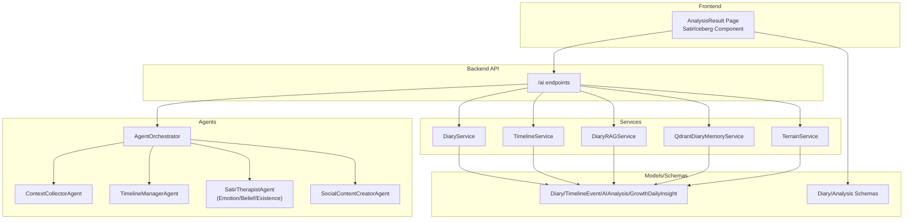
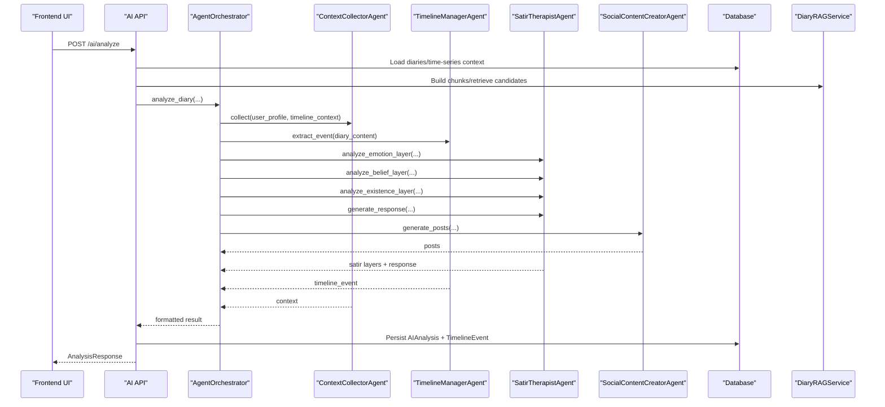
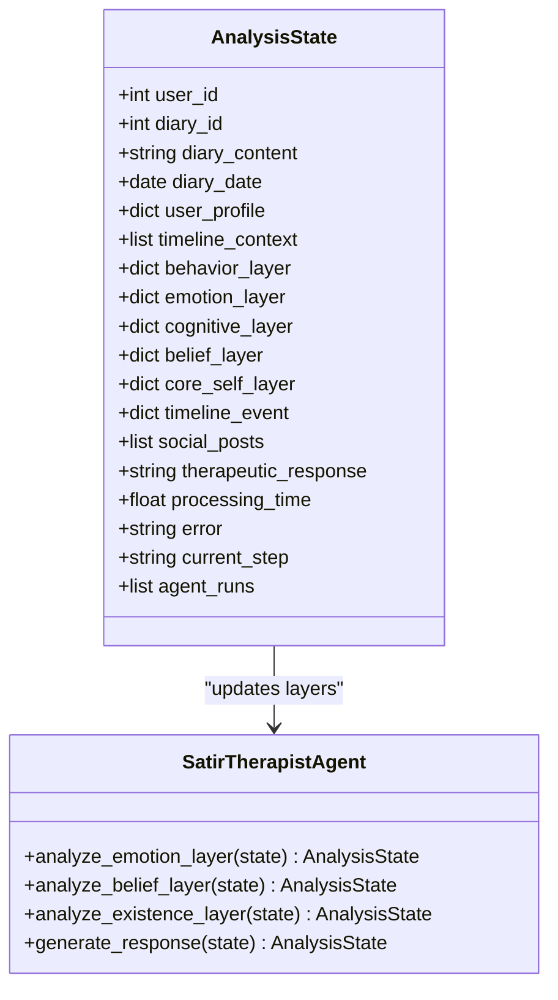
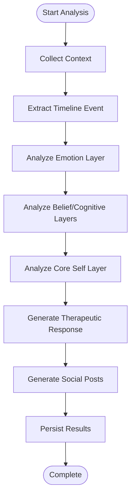
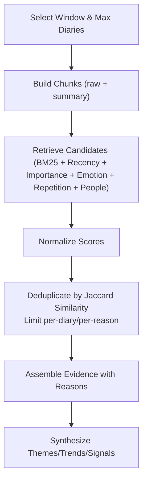
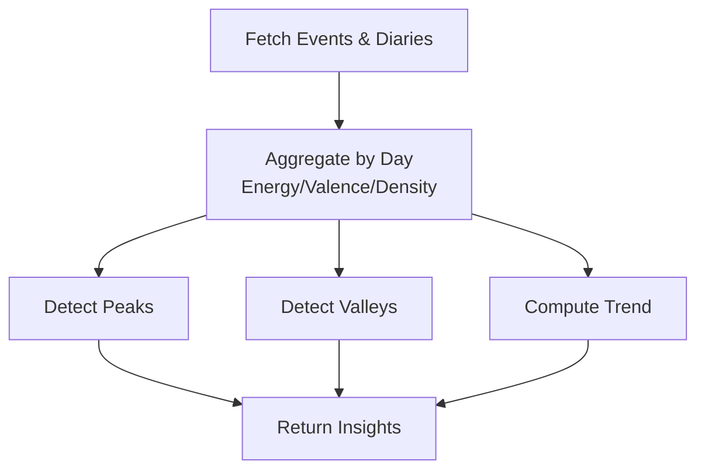
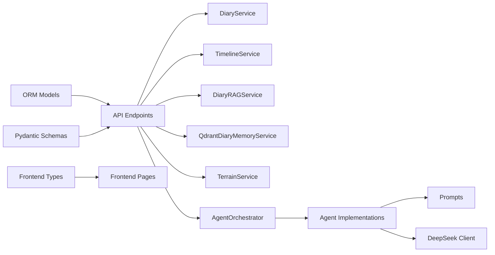

# Psychological Analysis Models

<cite>
**Referenced Files in This Document**
- [backend/app/models/diary.py](file://backend/app/models/diary.py)
- [backend/app/schemas/diary.py](file://backend/app/schemas/diary.py)
- [backend/app/schemas/ai.py](file://backend/app/schemas/ai.py)
- [backend/app/services/diary_service.py](file://backend/app/services/diary_service.py)
- [backend/app/services/rag_service.py](file://backend/app/services/rag_service.py)
- [backend/app/services/qdrant_memory_service.py](file://backend/app/services/qdrant_memory_service.py)
- [backend/app/services/terrain_service.py](file://backend/app/services/terrain_service.py)
- [backend/app/agents/state.py](file://backend/app/agents/state.py)
- [backend/app/agents/orchestrator.py](file://backend/app/agents/orchestrator.py)
- [backend/app/agents/agent_impl.py](file://backend/app/agents/agent_impl.py)
- [backend/app/agents/prompts.py](file://backend/app/agents/prompts.py)
- [backend/app/agents/llm.py](file://backend/app/agents/llm.py)
- [backend/app/api/v1/ai.py](file://backend/app/api/v1/ai.py)
- [frontend/src/types/analysis.ts](file://frontend/src/types/analysis.ts)
- [frontend/src/pages/analysis/SatirIceberg.tsx](file://frontend/src/pages/analysis/SatirIceberg.tsx)
- [frontend/src/pages/analysis/AnalysisResult.tsx](file://frontend/src/pages/analysis/AnalysisResult.tsx)
</cite>

## Table of Contents
1. [Introduction](#introduction)
2. [Project Structure](#project-structure)
3. [Core Components](#core-components)
4. [Architecture Overview](#architecture-overview)
5. [Detailed Component Analysis](#detailed-component-analysis)
6. [Dependency Analysis](#dependency-analysis)
7. [Performance Considerations](#performance-considerations)
8. [Troubleshooting Guide](#troubleshooting-guide)
9. [Conclusion](#conclusion)
10. [Appendices](#appendices)

## Introduction
This document explains the psychological analysis models implemented in the Yinyinji (Yinji) application, focusing on the Satir Iceberg Model and multi-day trend analysis. It covers the five-layer model (behavior, emotion, cognition, belief, core self), the therapeutic analysis workflow, emotional layer processing, cognitive restructuring techniques, belief system exploration, multi-day trend detection, pattern recognition, progress tracking, therapeutic response generation, personalized intervention strategies, and mental health assessment criteria. It also includes examples of analysis workflows, interpretation guidelines, clinical validation approaches, ethical considerations, bias mitigation, and professional supervision requirements for AI psychological analysis.

## Project Structure
The psychological analysis spans backend services, agents, APIs, and frontend visualization:
- Backend models and schemas define data structures for diaries, timeline events, AI analyses, and growth insights.
- Services orchestrate diary operations, RAG-based comprehensive analysis, memory indexing, and terrain (emotional landscape) analysis.
- Agents implement the Satir Iceberg workflow with specialized roles for context collection, timeline extraction, emotion/cognition/belief/existence analysis, and therapeutic response generation.
- API endpoints expose single-diary and user-integrated analysis, daily guidance, and social post generation.
- Frontend renders the Satir Iceberg visualization and the full analysis result page.

**Diagram sources**
- [backend/app/api/v1/ai.py:406-638](file://backend/app/api/v1/ai.py#L406-L638)
- [backend/app/agents/orchestrator.py:18-175](file://backend/app/agents/orchestrator.py#L18-L175)
- [backend/app/agents/agent_impl.py:92-484](file://backend/app/agents/agent_impl.py#L92-L484)
- [backend/app/services/diary_service.py:66-636](file://backend/app/services/diary_service.py#L66-L636)
- [backend/app/services/rag_service.py:147-359](file://backend/app/services/rag_service.py#L147-L359)
- [backend/app/services/qdrant_memory_service.py:45-188](file://backend/app/services/qdrant_memory_service.py#L45-L188)
- [backend/app/services/terrain_service.py:166-359](file://backend/app/services/terrain_service.py#L166-L359)
- [backend/app/models/diary.py:29-186](file://backend/app/models/diary.py#L29-L186)
- [backend/app/schemas/diary.py:9-101](file://backend/app/schemas/diary.py#L9-L101)
- [frontend/src/pages/analysis/AnalysisResult.tsx:1-410](file://frontend/src/pages/analysis/AnalysisResult.tsx#L1-L410)
- [frontend/src/pages/analysis/SatirIceberg.tsx:1-216](file://frontend/src/pages/analysis/SatirIceberg.tsx#L1-L216)

**Section sources**
- [backend/app/api/v1/ai.py:406-638](file://backend/app/api/v1/ai.py#L406-L638)
- [backend/app/agents/orchestrator.py:18-175](file://backend/app/agents/orchestrator.py#L18-L175)
- [backend/app/agents/agent_impl.py:92-484](file://backend/app/agents/agent_impl.py#L92-L484)
- [backend/app/services/diary_service.py:66-636](file://backend/app/services/diary_service.py#L66-L636)
- [backend/app/services/rag_service.py:147-359](file://backend/app/services/rag_service.py#L147-L359)
- [backend/app/services/qdrant_memory_service.py:45-188](file://backend/app/services/qdrant_memory_service.py#L45-L188)
- [backend/app/services/terrain_service.py:166-359](file://backend/app/services/terrain_service.py#L166-L359)
- [backend/app/models/diary.py:29-186](file://backend/app/models/diary.py#L29-L186)
- [backend/app/schemas/diary.py:9-101](file://backend/app/schemas/diary.py#L9-L101)
- [frontend/src/pages/analysis/AnalysisResult.tsx:1-410](file://frontend/src/pages/analysis/AnalysisResult.tsx#L1-L410)
- [frontend/src/pages/analysis/SatirIceberg.tsx:1-216](file://frontend/src/pages/analysis/SatirIceberg.tsx#L1-L216)

## Core Components
- Satir Iceberg Model: Five-layer psychological model implemented via specialized agents:
  - Behavior layer: observable actions/events extracted from diary content.
  - Emotion layer: surface and underlying emotions with intensity.
  - Cognitive layer: irrational beliefs and automatic thoughts.
  - Belief layer: core beliefs and life rules.
  - Core Self layer: deepest desire and universal needs.
- Therapeutic Workflow: orchestrated by AgentOrchestrator, integrating context, timeline extraction, layered analysis, and therapeutic response generation.
- Multi-day Analysis: RAG-based comprehensive analysis over configurable windows, with trend detection and pattern recognition.
- Emotional Landscape: TerrainService aggregates daily energy/valence/density to detect peaks, valleys, and trends.
- Persistence: AIAnalysis model stores last analysis per diary; TimelineEvent persists structured events.

**Section sources**
- [backend/app/agents/prompts.py:62-163](file://backend/app/agents/prompts.py#L62-L163)
- [backend/app/agents/orchestrator.py:27-131](file://backend/app/agents/orchestrator.py#L27-L131)
- [backend/app/agents/agent_impl.py:205-394](file://backend/app/agents/agent_impl.py#L205-L394)
- [backend/app/services/rag_service.py:147-359](file://backend/app/services/rag_service.py#L147-L359)
- [backend/app/services/terrain_service.py:166-359](file://backend/app/services/terrain_service.py#L166-L359)
- [backend/app/models/diary.py:102-132](file://backend/app/models/diary.py#L102-L132)

## Architecture Overview
The system integrates frontend UI, API orchestration, agent-based psychological analysis, and persistence.

**Diagram sources**
- [backend/app/api/v1/ai.py:406-638](file://backend/app/api/v1/ai.py#L406-L638)
- [backend/app/agents/orchestrator.py:27-131](file://backend/app/agents/orchestrator.py#L27-L131)
- [backend/app/agents/agent_impl.py:92-484](file://backend/app/agents/agent_impl.py#L92-L484)
- [backend/app/services/rag_service.py:147-359](file://backend/app/services/rag_service.py#L147-L359)
- [backend/app/models/diary.py:102-132](file://backend/app/models/diary.py#L102-L132)

## Detailed Component Analysis

### Satir Iceberg Model Implementation
The five-layer model is implemented through specialized prompts and agents:
- Emotion Layer: Extracts surface and underlying emotions, intensity, and analysis.
- Cognitive Layer: Identifies irrational beliefs and automatic thoughts.
- Belief Layer: Identifies core beliefs and life rules.
- Existence Layer: Explores deepest desire and universal needs.
- Behavior Layer: Captures observable event/action summaries.

**Diagram sources**
- [backend/app/agents/state.py:10-45](file://backend/app/agents/state.py#L10-L45)
- [backend/app/agents/agent_impl.py:205-394](file://backend/app/agents/agent_impl.py#L205-L394)

**Section sources**
- [backend/app/agents/prompts.py:62-163](file://backend/app/agents/prompts.py#L62-L163)
- [backend/app/agents/agent_impl.py:214-347](file://backend/app/agents/agent_impl.py#L214-L347)
- [backend/app/agents/state.py:10-45](file://backend/app/agents/state.py#L10-L45)

### Therapeutic Analysis Workflow
The workflow proceeds through:
1. Context Collection: Aggregates user profile and timeline context.
2. Timeline Extraction: Builds structured events from diary content.
3. Satir Layers:
   - Emotion layer analysis.
   - Belief/cognitive layer analysis.
   - Existence layer analysis.
4. Therapeutic Response Generation: Synthesizes a warm, non-judgmental reply.
5. Social Posts Generation: Creates multiple variants of shareable posts.

**Diagram sources**
- [backend/app/agents/orchestrator.py:27-131](file://backend/app/agents/orchestrator.py#L27-L131)
- [backend/app/agents/agent_impl.py:92-484](file://backend/app/agents/agent_impl.py#L92-L484)

**Section sources**
- [backend/app/agents/orchestrator.py:27-131](file://backend/app/agents/orchestrator.py#L27-L131)
- [backend/app/agents/agent_impl.py:92-484](file://backend/app/agents/agent_impl.py#L92-L484)

### Emotional Layer Processing
- Surface emotion: explicit expression in text.
- Underlying emotion: inferred deeper feeling.
- Intensity: numeric rating informed by punctuation, emotion words, and tags.
- Analysis: concise synthesis of both.

Implementation highlights:
- Prompt-driven extraction with JSON output.
- Fallbacks when parsing fails.
- Integration with downstream belief and existence layers.

**Section sources**
- [backend/app/agents/prompts.py:62-83](file://backend/app/agents/prompts.py#L62-L83)
- [backend/app/agents/agent_impl.py:214-253](file://backend/app/agents/agent_impl.py#L214-L253)

### Cognitive Restructuring Techniques
- Irrational beliefs: identifies rigid, absolute thinking patterns.
- Automatic thoughts: recurring negative thought patterns.
- Belief layer: core beliefs and life rules guiding behavior.

Implementation highlights:
- Uses emotion layer as context for deeper analysis.
- Outputs structured lists for targeted reflection and intervention.

**Section sources**
- [backend/app/agents/prompts.py:86-112](file://backend/app/agents/prompts.py#L86-L112)
- [backend/app/agents/agent_impl.py:255-299](file://backend/app/agents/agent_impl.py#L255-L299)

### Belief System Exploration
- Core beliefs: fundamental self-concepts.
- Life rules: behavioral principles derived from experiences.
- Analysis synthesis: contextual interpretation grounded in prior layers.

**Section sources**
- [backend/app/agents/prompts.py:86-112](file://backend/app/agents/prompts.py#L86-L112)
- [backend/app/agents/agent_impl.py:255-299](file://backend/app/agents/agent_impl.py#L255-L299)

### Multi-day Analysis Algorithms
- Window selection: configurable days and max diaries.
- Integrated corpus: combines multiple diaries in chronological order.
- RAG pipeline:
  - Chunk building: splits content into overlapping segments; builds daily summaries.
  - Retrieval: BM25-like scoring with recency, importance, emotion intensity, repetition, and person hit bonuses.
  - Deduplication: limits per-diary and per-reason counts; removes near-duplicates by Jaccard similarity.
  - Evidence assembly: aggregates snippets with reasons and scores.

**Diagram sources**
- [backend/app/api/v1/ai.py:267-403](file://backend/app/api/v1/ai.py#L267-L403)
- [backend/app/services/rag_service.py:147-359](file://backend/app/services/rag_service.py#L147-L359)

**Section sources**
- [backend/app/api/v1/ai.py:267-403](file://backend/app/api/v1/ai.py#L267-L403)
- [backend/app/services/rag_service.py:147-359](file://backend/app/services/rag_service.py#L147-L359)

### Trend Identification, Pattern Recognition, and Progress Tracking
- TerrainService aggregates daily points by:
  - Energy: max importance among events/day.
  - Valence: average of emotion valence mapped from tags.
  - Density: number of events/diaries.
- Peak/Valley Detection:
  - Peaks: local maxima exceeding thresholds.
  - Valleys: contiguous low-energy periods.
- Trend Detection: simple linear comparison of first vs. second half averages.
- Visualization: frontend displays terrain insights and trend descriptions.

**Diagram sources**
- [backend/app/services/terrain_service.py:166-359](file://backend/app/services/terrain_service.py#L166-L359)
- [frontend/src/pages/analysis/AnalysisResult.tsx:212-385](file://frontend/src/pages/analysis/AnalysisResult.tsx#L212-L385)

**Section sources**
- [backend/app/services/terrain_service.py:166-359](file://backend/app/services/terrain_service.py#L166-L359)
- [frontend/src/pages/analysis/AnalysisResult.tsx:212-385](file://frontend/src/pages/analysis/AnalysisResult.tsx#L212-L385)

### Therapeutic Response Generation and Personalized Interventions
- Response generation synthesizes the five-layer analysis into a warm, non-judgmental reply.
- Personalization leverages user profile, recent context, and diary content.
- Intervention suggestions emerge implicitly from the analysis synthesis.

**Section sources**
- [backend/app/agents/prompts.py:139-163](file://backend/app/agents/prompts.py#L139-L163)
- [backend/app/agents/agent_impl.py:349-393](file://backend/app/agents/agent_impl.py#L349-L393)

### Mental Health Assessment Criteria
- Emotion valence mapping: converts emotion tags to a continuous (-1..1) scale for analytics.
- Threshold-based detection: peak/valley thresholds inform significant mood states.
- Trend analysis: detects ascending/descending/stable patterns.
- Complementary indicators: importance scores, repetition, and people mentions.

**Section sources**
- [backend/app/services/terrain_service.py:14-54](file://backend/app/services/terrain_service.py#L14-L54)
- [backend/app/services/terrain_service.py:59-162](file://backend/app/services/terrain_service.py#L59-L162)

### Frontend Visualization and Interpretation
- SatirIceberg component renders the five layers with expandable cards and intensity visualization.
- AnalysisResult page presents timeline events, five-layer analysis, therapeutic response, and social posts with copy-to-clipboard support.

**Section sources**
- [frontend/src/pages/analysis/SatirIceberg.tsx:1-216](file://frontend/src/pages/analysis/SatirIceberg.tsx#L1-L216)
- [frontend/src/pages/analysis/AnalysisResult.tsx:1-410](file://frontend/src/pages/analysis/AnalysisResult.tsx#L1-L410)
- [frontend/src/types/analysis.ts:66-142](file://frontend/src/types/analysis.ts#L66-L142)

## Dependency Analysis
Key dependencies and interactions:
- API depends on services for diary/timeline/RAG/memory/terrain.
- Agents depend on prompts and LLM clients.
- Models/schema types define data contracts across layers.
- Frontend consumes typed responses and renders visualizations.

**Diagram sources**
- [backend/app/api/v1/ai.py:406-638](file://backend/app/api/v1/ai.py#L406-L638)
- [backend/app/services/diary_service.py:66-636](file://backend/app/services/diary_service.py#L66-L636)
- [backend/app/services/rag_service.py:147-359](file://backend/app/services/rag_service.py#L147-L359)
- [backend/app/services/qdrant_memory_service.py:45-188](file://backend/app/services/qdrant_memory_service.py#L45-L188)
- [backend/app/services/terrain_service.py:166-359](file://backend/app/services/terrain_service.py#L166-L359)
- [backend/app/agents/orchestrator.py:18-175](file://backend/app/agents/orchestrator.py#L18-L175)
- [backend/app/agents/agent_impl.py:92-484](file://backend/app/agents/agent_impl.py#L92-L484)
- [backend/app/agents/prompts.py:1-244](file://backend/app/agents/prompts.py#L1-L244)
- [backend/app/agents/llm.py:13-220](file://backend/app/agents/llm.py#L13-L220)
- [backend/app/models/diary.py:29-186](file://backend/app/models/diary.py#L29-L186)
- [backend/app/schemas/diary.py:9-101](file://backend/app/schemas/diary.py#L9-L101)
- [frontend/src/types/analysis.ts:1-142](file://frontend/src/types/analysis.ts#L1-L142)
- [frontend/src/pages/analysis/AnalysisResult.tsx:1-410](file://frontend/src/pages/analysis/AnalysisResult.tsx#L1-L410)

**Section sources**
- [backend/app/api/v1/ai.py:406-638](file://backend/app/api/v1/ai.py#L406-L638)
- [backend/app/agents/llm.py:13-220](file://backend/app/agents/llm.py#L13-L220)
- [backend/app/models/diary.py:29-186](file://backend/app/models/diary.py#L29-L186)
- [backend/app/schemas/diary.py:9-101](file://backend/app/schemas/diary.py#L9-L101)
- [frontend/src/types/analysis.ts:1-142](file://frontend/src/types/analysis.ts#L1-L142)

## Performance Considerations
- Tokenization and BM25 scoring: efficient chunking and scoring with normalization.
- Retrieval limits: top-k and deduplication reduce redundant evidence.
- Memory service: optional vector indexing for faster retrieval when configured.
- Agent orchestration: structured steps with timing metadata aid profiling.
- Frontend rendering: lazy loading and expandable cards optimize UX for long analyses.

[No sources needed since this section provides general guidance]

## Troubleshooting Guide
Common issues and mitigations:
- LLM parsing failures:
  - The system attempts multiple strategies: pure JSON, fenced code blocks, incremental decode.
  - Falls back to safe defaults for each layer when parsing fails.
- Missing or empty results:
  - API validates window and returns fallbacks when insufficient data exists.
  - Frontend handles missing saved results and allows manual re-run.
- Persistence warnings:
  - API captures persistence errors in metadata without blocking the response.
- Copy-to-clipboard fallback:
  - Frontend gracefully degrades to textarea-based copy when Clipboard API is unavailable.

**Section sources**
- [backend/app/agents/agent_impl.py:25-68](file://backend/app/agents/agent_impl.py#L25-L68)
- [backend/app/api/v1/ai.py:406-638](file://backend/app/api/v1/ai.py#L406-L638)
- [frontend/src/pages/analysis/AnalysisResult.tsx:80-117](file://frontend/src/pages/analysis/AnalysisResult.tsx#L80-L117)

## Conclusion
The Yinyinji application implements a robust, agent-based psychological analysis framework grounded in the Satir Iceberg Model and enriched by multi-day trend analysis. It balances depth (five-layer psychological processing) with practicality (structured outputs, persistence, and visualization). The system’s modular design enables future enhancements, such as expanded memory indexing and advanced clinical validation pipelines.

[No sources needed since this section summarizes without analyzing specific files]

## Appendices

### Example Analysis Workflows
- Single-diary integrated analysis:
  - Select window and max diaries.
  - Build user profile and timeline context.
  - Run orchestrator with agents for emotion, belief, existence, and response.
  - Persist AIAnalysis and TimelineEvent.
- Multi-day comprehensive analysis:
  - Build chunks from diaries.
  - Retrieve candidates across themes (emotions, continuity, turning points, growth).
  - Deduplicate and assemble evidence.
  - Synthesize summary, themes, trends, signals, and suggestions.

**Section sources**
- [backend/app/api/v1/ai.py:267-403](file://backend/app/api/v1/ai.py#L267-L403)
- [backend/app/api/v1/ai.py:406-638](file://backend/app/api/v1/ai.py#L406-L638)
- [backend/app/services/rag_service.py:147-359](file://backend/app/services/rag_service.py#L147-L359)

### Interpretation Guidelines
- Emotion layer: distinguish surface vs. underlying; consider intensity when interpreting.
- Cognitive layer: focus on identifying rigid beliefs and replacing them with balanced alternatives.
- Belief layer: explore core values and life rules; align interventions with personal meaning.
- Existence layer: connect experiences to universal needs and deepest desires.
- Timeline events: use importance and emotion tags to contextualize daily experiences.
- Terrain insights: interpret peaks as meaningful energy spikes and valleys as recovery windows.

**Section sources**
- [backend/app/agents/prompts.py:62-163](file://backend/app/agents/prompts.py#L62-L163)
- [backend/app/services/terrain_service.py:59-162](file://backend/app/services/terrain_service.py#L59-L162)

### Clinical Validation Approaches
- Ground-truth alignment: compare agent outputs against expert-coded themes and layers.
- Inter-rater reliability: assess consistency across multiple expert coders.
- Outcome measures: correlate terrain trends with self-reported mood scales.
- Iterative refinement: adjust prompts and scoring heuristics based on validation feedback.

[No sources needed since this section provides general guidance]

### Ethical Considerations, Bias Mitigation, and Professional Supervision
- Informed consent: clearly communicate AI limitations and encourage professional care when indicated.
- Bias mitigation: diversify training data and prompts; monitor for demographic disparities; periodically audit outputs.
- Safety safeguards: avoid diagnostic statements; emphasize supportive, non-pathologizing language.
- Professional supervision: require oversight for high-risk users; provide escalation pathways.
- Transparency: display processing time, analysis scope, and agent runs in metadata.

[No sources needed since this section provides general guidance]