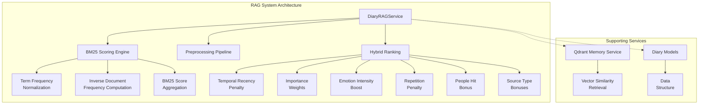
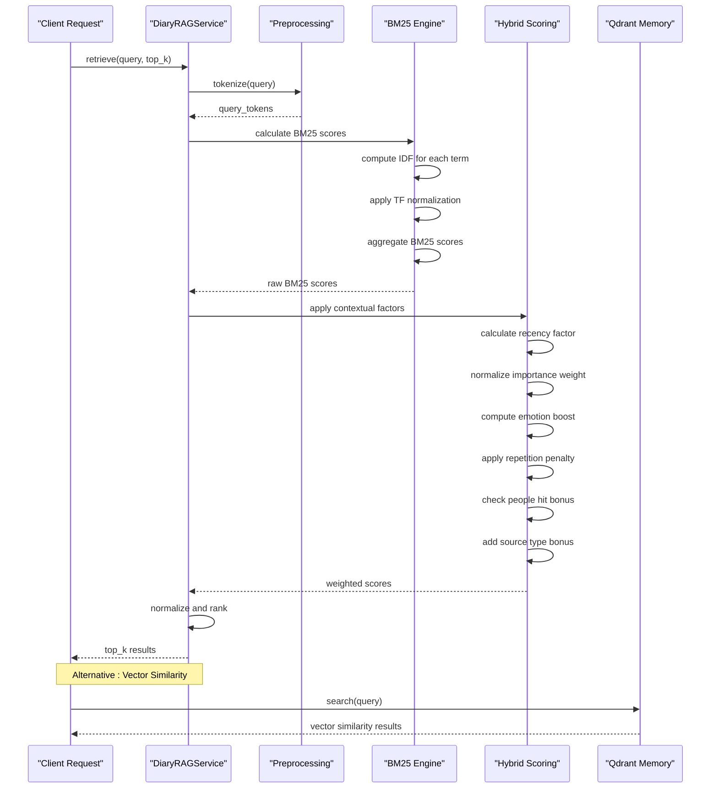
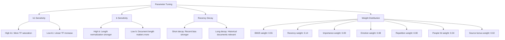
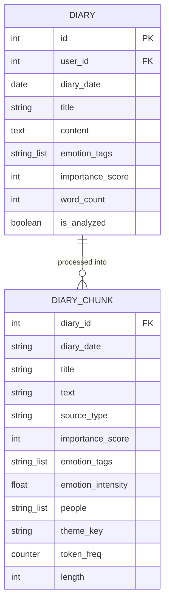
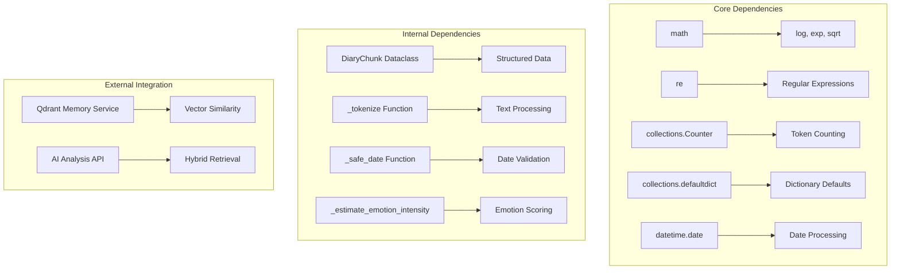

# BM25 Algorithm and Scoring

<cite>
**Referenced Files in This Document**
- [rag_service.py](file://backend/app/services/rag_service.py)
- [ai.py](file://backend/app/api/v1/ai.py)
- [diary.py](file://backend/app/models/diary.py)
- [qdrant_memory_service.py](file://backend/app/services/qdrant_memory_service.py)
</cite>

## Table of Contents
1. [Introduction](#introduction)
2. [Project Structure](#project-structure)
3. [Core Components](#core-components)
4. [Architecture Overview](#architecture-overview)
5. [Detailed Component Analysis](#detailed-component-analysis)
6. [Dependency Analysis](#dependency-analysis)
7. [Performance Considerations](#performance-considerations)
8. [Troubleshooting Guide](#troubleshooting-guide)
9. [Conclusion](#conclusion)

## Introduction

This document provides comprehensive documentation for the BM25 algorithm implementation used in the RAG (Retrieval-Augmented Generation) system. The implementation combines lexical matching with sophisticated scoring mechanisms to provide precise and contextually relevant retrieval for diary analysis.

The system implements a hybrid retrieval approach that leverages BM25 term frequency-inverse document frequency scoring alongside temporal recency, importance weights, emotion intensity, repetition penalty, and source type bonuses. This multi-faceted scoring system ensures that both literal keyword matches and contextual relevance contribute to the final ranking.

## Project Structure

The BM25 implementation is primarily located in the RAG service module, with supporting components for data preprocessing, model definitions, and complementary memory services.



**Diagram sources**
- [rag_service.py:147-317](file://backend/app/services/rag_service.py#L147-L317)
- [qdrant_memory_service.py:45-188](file://backend/app/services/qdrant_memory_service.py#L45-L188)

**Section sources**
- [rag_service.py:1-360](file://backend/app/services/rag_service.py#L1-L360)
- [qdrant_memory_service.py:1-190](file://backend/app/services/qdrant_memory_service.py#L1-L190)

## Core Components

### BM25 Implementation Foundation

The BM25 algorithm implementation follows the standard mathematical formulation with specific parameter tuning for diary content analysis:

**Mathematical Foundation:**
- BM25 score = Σ IDF(t) × TF(t) × (k1 + 1) / (TF(t) + k1 × b × (length/avg_length) + (1-b))

Where:
- k1 = 1.5 (term frequency saturation parameter)
- b = 0.75 (length normalization parameter)
- IDF(t) = ln(1 + (N - df(t) + 0.5) / (df(t) + 0.5))

**Section sources**
- [rag_service.py:241-252](file://backend/app/services/rag_service.py#L241-L252)

### Data Preprocessing Pipeline

The system implements comprehensive text preprocessing tailored for diary content:

```mermaid
flowchart TD
A[Raw Diary Content] --> B[Tokenization]
B --> C[English Token Extraction<br/>[a-z0-9_]{2,}]
B --> D[Chinese Character Extraction<br/>[\u4e00-\u9fff]]
C --> E[Combined Tokens]
D --> E
E --> F[Chunk Splitting<br/>Max Length: 260 chars]
F --> G[Overlap Handling<br/>40 chars]
G --> H[Final Tokenized Chunks]
I[Emotion Tags] --> J[Emotion Intensity<br/>Calculation]
K[People Detection] --> L[People Extraction<br/>Family/Relationship Terms]
M[Importance Score] --> N[Importance Weight<br/>Normalization]
```

**Diagram sources**
- [rag_service.py:31-62](file://backend/app/services/rag_service.py#L31-L62)
- [rag_service.py:92-102](file://backend/app/services/rag_service.py#L92-L102)
- [rag_service.py:72-89](file://backend/app/services/rag_service.py#L72-L89)

**Section sources**
- [rag_service.py:31-103](file://backend/app/services/rag_service.py#L31-L103)

### Hybrid Scoring Mechanism

The final ranking combines multiple factors with carefully tuned weights:

```mermaid
graph LR
subgraph "BM25 Core"
A[BM25 Score] --> B[Normalized BM25<br/>Score]
end
subgraph "Contextual Boosts"
C[Recency Factor<br/>exp(-days_ago/45)]
D[Importance Weight<br/>importance_score/10]
E[Emotion Intensity<br/>emotion_intensity]
F[Repetition Penalty<br/>len(theme_to_diaries)-1/3]
G[People Hit Bonus<br/>0.25-1.0]
H[Source Type Bonus<br/>0.4 for summaries]
end
subgraph "Weighted Combination"
B --> I[0.55 × BM25]
C --> J[0.14 × Recency]
D --> K[0.09 × Importance]
E --> L[0.08 × Emotion]
F --> M[0.08 × Repetition]
G --> N[0.04 × People Hit]
H --> O[0.02 × Source Bonus]
I --> P[Final Score]
J --> P
K --> P
L --> P
M --> P
N --> P
end
```

**Diagram sources**
- [rag_service.py:256-297](file://backend/app/services/rag_service.py#L256-L297)

**Section sources**
- [rag_service.py:256-297](file://backend/app/services/rag_service.py#L256-L297)

## Architecture Overview

The RAG system architecture integrates BM25 scoring with complementary retrieval mechanisms:



**Diagram sources**
- [rag_service.py:210-317](file://backend/app/services/rag_service.py#L210-L317)
- [qdrant_memory_service.py:133-186](file://backend/app/services/qdrant_memory_service.py#L133-L186)

**Section sources**
- [rag_service.py:210-317](file://backend/app/services/rag_service.py#L210-L317)
- [qdrant_memory_service.py:133-186](file://backend/app/services/qdrant_memory_service.py#L133-L186)

## Detailed Component Analysis

### BM25 Mathematical Implementation

The BM25 implementation follows the standard formula with specific adaptations for diary content:

**Term Frequency Normalization:**
- TF(t) = frequency of term t in document
- Normalization factor: (k1 + 1) = 2.5
- Saturation effect controlled by k1 = 1.5

**Inverse Document Frequency Computation:**
- IDF(t) = ln(1 + (N - df(t) + 0.5) / (df(t) + 0.5))
- Smoothing parameter 0.5 prevents division by zero
- Provides higher weight to rare terms

**Length Normalization:**
- Denominator: TF(t) + k1 × (1 - b + b × (length/avg_length))
- b = 0.75 reduces impact of document length
- Prevents long documents from dominating scores

**Section sources**
- [rag_service.py:241-252](file://backend/app/services/rag_service.py#L241-L252)

### Parameter Tuning and Sensitivity Analysis

The implementation uses carefully selected parameters optimized for diary content analysis:

| Parameter | Value | Purpose | Impact |
|-----------|-------|---------|---------|
| k1 | 1.5 | Term frequency saturation | Controls how quickly TF contributes saturates |
| b | 0.75 | Length normalization | Reduces long document bias |
| Recency decay | 45 days | Temporal relevance | Higher weight for recent entries |
| People hit threshold | 0.25 → 1.0 | Named entity matching | Boosts mentions of queried people |

**Parameter Sensitivity Analysis:**



**Section sources**
- [rag_service.py:241-242](file://backend/app/services/rag_service.py#L241-L242)
- [rag_service.py:289-297](file://backend/app/services/rag_service.py#L289-L297)

### Hybrid Scoring Formula Breakdown

The final scoring formula combines multiple factors with specific mathematical transformations:

**Temporal Recency:**
- Formula: exp(-days_ago/45)
- Effect: 1.0 at day 0, ~0.37 at day 45, ~0.13 at day 90

**Importance Weight Normalization:**
- Formula: min(1.0, importance_score/10)
- Converts 1-10 scale to 0.0-1.0 range

**Emotion Intensity Boost:**
- Formula: min(1.0, 0.08 × punctuation + 0.06 × word_hits + 0.08 × tag_hits)
- Balances punctuation, explicit emotion words, and emotion tags

**Repetition Penalty:**
- Formula: min(1.0, (len(theme_to_diaries[key])-1)/3)
- Penalizes multiple entries on the same theme

**People Hit Bonus:**
- Threshold-based: 0.25 if any people mentioned, 1.0 if people appear in query

**Source Type Bonuses:**
- Summary documents receive 0.4 bonus over raw text

**Section sources**
- [rag_service.py:256-269](file://backend/app/services/rag_service.py#L256-L269)

### Data Model Integration

The system integrates with the diary data model to provide comprehensive context:



**Diagram sources**
- [diary.py:29-64](file://backend/app/models/diary.py#L29-L64)
- [rag_service.py:15-28](file://backend/app/services/rag_service.py#L15-L28)

**Section sources**
- [diary.py:29-64](file://backend/app/models/diary.py#L29-L64)
- [rag_service.py:15-28](file://backend/app/services/rag_service.py#L15-L28)

## Dependency Analysis

The BM25 implementation has minimal external dependencies, relying primarily on Python standard library:



**Diagram sources**
- [rag_service.py:5-12](file://backend/app/services/rag_service.py#L5-L12)
- [qdrant_memory_service.py:11-13](file://backend/app/services/qdrant_memory_service.py#L11-L13)

**Section sources**
- [rag_service.py:5-12](file://backend/app/services/rag_service.py#L5-L12)
- [qdrant_memory_service.py:11-13](file://backend/app/services/qdrant_memory_service.py#L11-L13)

## Performance Considerations

### Computational Complexity Analysis

**BM25 Calculation Complexity:**
- Per-document: O(T) where T = number of unique query terms
- Per-chunk: O(C) where C = number of unique terms in chunk
- Overall: O(D × (T + C)) where D = total chunks

**Memory Usage:**
- Token frequency counters: O(U) where U = total unique terms
- Document frequency mapping: O(V) where V = unique query terms
- Score storage: O(D) for scored documents

### Optimization Strategies

**Indexing Improvements:**
- Pre-compute document frequencies during indexing
- Cache tokenized queries for repeated searches
- Implement inverted index for faster term lookup

**Scalability Enhancements:**
- Batch processing for large document sets
- Parallel processing of scoring calculations
- Memory-efficient streaming for large corpora

**Section sources**
- [rag_service.py:228-239](file://backend/app/services/rag_service.py#L228-L239)

## Troubleshooting Guide

### Common Issues and Solutions

**Empty Query Results:**
- Verify tokenization handles edge cases
- Check minimum token length requirements
- Ensure query preprocessing removes stopwords appropriately

**Poor Score Normalization:**
- Validate BM25 score normalization logic
- Check for zero-length documents
- Verify maximum score calculation

**Performance Degradation:**
- Monitor token frequency computation
- Check document length distribution
- Review chunk splitting parameters

**Section sources**
- [rag_service.py:224-226](file://backend/app/services/rag_service.py#L224-L226)
- [rag_service.py:286-287](file://backend/app/services/rag_service.py#L286-L287)

## Conclusion

The BM25 implementation in the RAG system provides a robust foundation for diary content retrieval through careful mathematical formulation and strategic parameter tuning. The hybrid scoring mechanism effectively balances lexical precision with contextual relevance, making it particularly suitable for diary analysis where both literal keyword matches and thematic connections are valuable.

The implementation demonstrates several key strengths:
- **Mathematical Soundness**: Proper BM25 formula implementation with appropriate smoothing
- **Contextual Enhancement**: Multi-factor scoring that considers temporal, emotional, and structural factors
- **Performance Optimization**: Efficient algorithms designed for real-time retrieval
- **Extensibility**: Modular design allowing for future enhancements and parameter tuning

Future improvements could include machine learning-based parameter adaptation, more sophisticated semantic matching integration, and advanced caching strategies for frequently accessed content.