# Diary Chunking and Preprocessing

<cite>
**Referenced Files in This Document**
- [rag_service.py](file://backend/app/services/rag_service.py)
- [diary.py](file://backend/app/models/diary.py)
- [diary_service.py](file://backend/app/services/diary_service.py)
- [diaries.py](file://backend/app/api/v1/diaries.py)
</cite>

## Table of Contents
1. [Introduction](#introduction)
2. [Project Structure](#project-structure)
3. [Core Components](#core-components)
4. [Architecture Overview](#architecture-overview)
5. [Detailed Component Analysis](#detailed-component-analysis)
6. [Dependency Analysis](#dependency-analysis)
7. [Performance Considerations](#performance-considerations)
8. [Troubleshooting Guide](#troubleshooting-guide)
9. [Conclusion](#conclusion)

## Introduction
This document explains the diary chunking and preprocessing pipeline used by the Retrieval-Augmented Generation (RAG) system. It covers:
- Text segmentation algorithm that splits diary content into optimal chunks using overlapping windows and sentence boundary detection
- Multilingual tokenization supporting Chinese characters and English words
- Chunk metadata extraction including emotion intensity calculation, people entity recognition, and theme key generation
- The chunk creation process from raw diary content to structured DiaryChunk objects with token frequency analysis
- Examples of chunk size optimization, overlap strategies, and preprocessing rules for different content types
- Performance considerations for large diary volumes and memory management during chunk processing

## Project Structure
The RAG pipeline lives in the backend services module and integrates with the diary model and API layer.

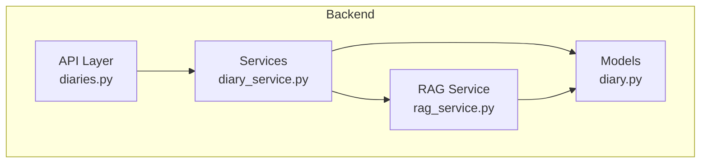

**Diagram sources**
- [diaries.py:299-318](file://backend/app/api/v1/diaries.py#L299-L318)
- [diary_service.py:280-522](file://backend/app/services/diary_service.py#L280-L522)
- [rag_service.py:147-208](file://backend/app/services/rag_service.py#L147-L208)
- [diary.py:29-64](file://backend/app/models/diary.py#L29-L64)

**Section sources**
- [diaries.py:299-318](file://backend/app/api/v1/diaries.py#L299-L318)
- [diary_service.py:280-522](file://backend/app/services/diary_service.py#L280-L522)
- [rag_service.py:147-208](file://backend/app/services/rag_service.py#L147-L208)
- [diary.py:29-64](file://backend/app/models/diary.py#L29-L64)

## Core Components
- DiaryChunk: The structured representation of a chunk with metadata and token frequencies
- Tokenizer: Lowercase normalization and multilingual tokenization
- Segmenter: Sentence-aware splitting with overlapping windows
- Metadata extractors: People recognition, emotion intensity estimation, theme key generation
- Chunk builder: Aggregates metadata and creates DiaryChunk instances
- Retrieval engine: BM25-like scoring with recency, importance, emotion, repetition, and people hit bonuses

**Section sources**
- [rag_service.py:15-35](file://backend/app/services/rag_service.py#L15-L35)
- [rag_service.py:38-62](file://backend/app/services/rag_service.py#L38-L62)
- [rag_service.py:72-102](file://backend/app/services/rag_service.py#L72-L102)
- [rag_service.py:127-134](file://backend/app/services/rag_service.py#L127-L134)
- [rag_service.py:147-208](file://backend/app/services/rag_service.py#L147-L208)
- [rag_service.py:210-317](file://backend/app/services/rag_service.py#L210-L317)

## Architecture Overview
End-to-end flow from API to chunking and retrieval.

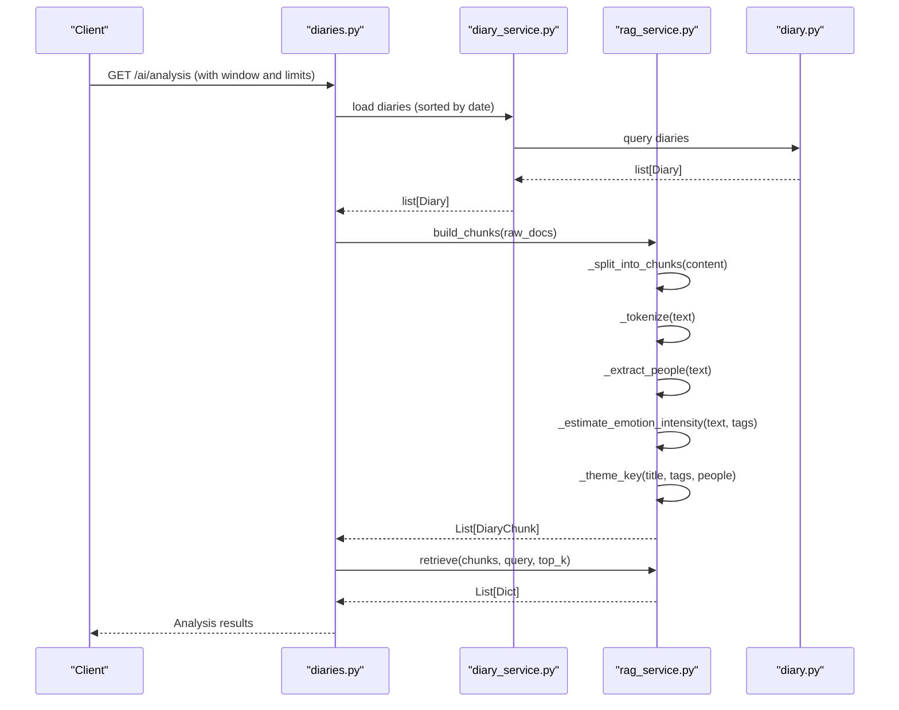

**Diagram sources**
- [diaries.py:279-318](file://backend/app/api/v1/diaries.py#L279-L318)
- [diary_service.py:280-522](file://backend/app/services/diary_service.py#L280-L522)
- [rag_service.py:147-208](file://backend/app/services/rag_service.py#L147-L208)
- [rag_service.py:210-317](file://backend/app/services/rag_service.py#L210-L317)

## Detailed Component Analysis

### Text Segmentation and Overlapping Windows
The segmentation algorithm splits content into sentence-like segments and aggregates them into chunks respecting a maximum length and overlap.

Key behaviors:
- Splits on sentence boundaries: newline and punctuation marks
- Strips whitespace and ignores empty segments
- Uses a sliding-window approach with configurable overlap
- Ensures chunks fit within max_len while preserving sentence integrity where possible

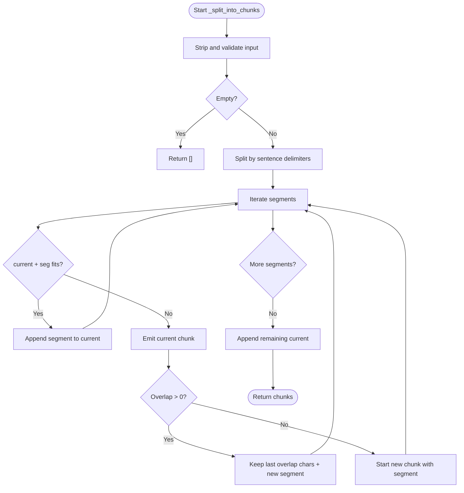

**Diagram sources**
- [rag_service.py:38-62](file://backend/app/services/rag_service.py#L38-L62)

**Section sources**
- [rag_service.py:38-62](file://backend/app/services/rag_service.py#L38-L62)

### Multilingual Tokenization
Tokenization converts text into a sequence of tokens:
- Lowercases all text
- Extracts English tokens with a minimum length threshold
- Extracts Chinese characters individually

This produces a balanced token set suitable for BM25-style retrieval and deduplication.

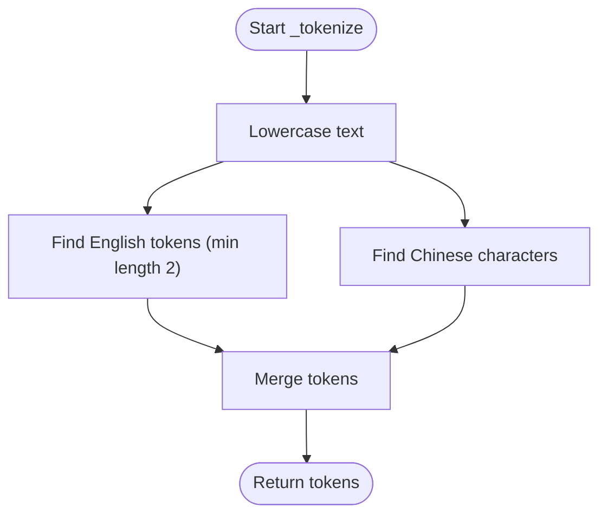

**Diagram sources**
- [rag_service.py:31-35](file://backend/app/services/rag_service.py#L31-L35)

**Section sources**
- [rag_service.py:31-35](file://backend/app/services/rag_service.py#L31-L35)

### Emotion Intensity Calculation
Emotion intensity is estimated from:
- Punctuation indicators (exclamation and question marks)
- Occurrence of predefined emotion words
- Number of emotion tags present

The score is normalized to a bounded range.

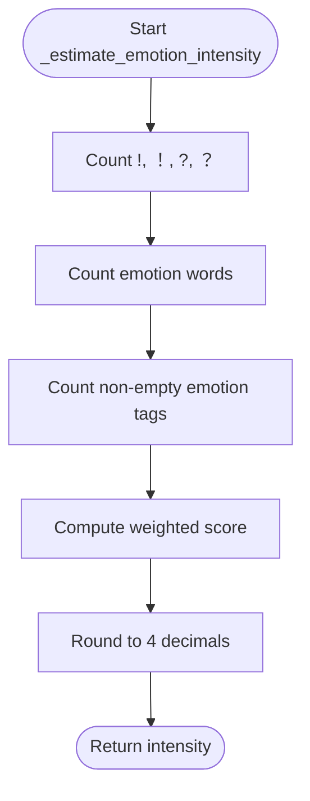

**Diagram sources**
- [rag_service.py:92-102](file://backend/app/services/rag_service.py#L92-L102)

**Section sources**
- [rag_service.py:92-102](file://backend/app/services/rag_service.py#L92-L102)

### People Entity Recognition
People extraction identifies:
- Relation terms (e.g., family, friends, colleagues)
- Suffix-based Chinese names (e.g., “老师”, “同学”, “同事”)
- English names (capitalized first letter, followed by lowercase letters)

Duplicates are removed and a cap is enforced.

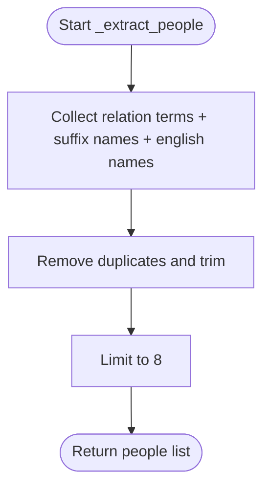

**Diagram sources**
- [rag_service.py:72-89](file://backend/app/services/rag_service.py#L72-L89)

**Section sources**
- [rag_service.py:72-89](file://backend/app/services/rag_service.py#L72-L89)

### Theme Key Generation
Theme keys combine:
- Tokenized title (first 5 tokens)
- Lowercased emotion tags (non-empty)
- Lowercased people (non-empty)

The first 6 parts are joined with a delimiter; defaults to a general key if empty.

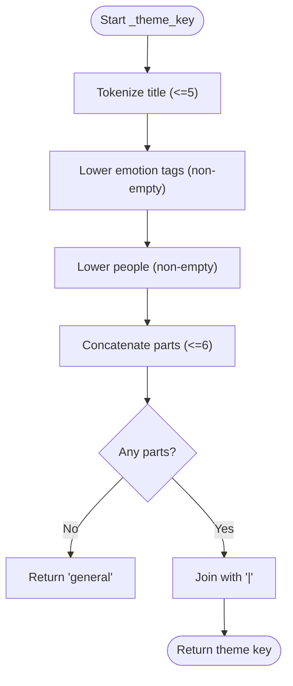

**Diagram sources**
- [rag_service.py:127-134](file://backend/app/services/rag_service.py#L127-L134)

**Section sources**
- [rag_service.py:127-134](file://backend/app/services/rag_service.py#L127-L134)

### Chunk Creation and Metadata Extraction
The chunk builder:
- Builds a daily summary text with metadata
- Tokenizes the summary and emits a summary-type chunk if tokens exist
- Iterates over segmented raw chunks, tokenizes with title prefix, and emits raw-type chunks
- Populates DiaryChunk with:
  - Identity and date
  - Title and text
  - Source type (summary/raw)
  - Importance score
  - Emotion tags and computed intensity
  - Recognized people
  - Theme key
  - Token frequency Counter and length

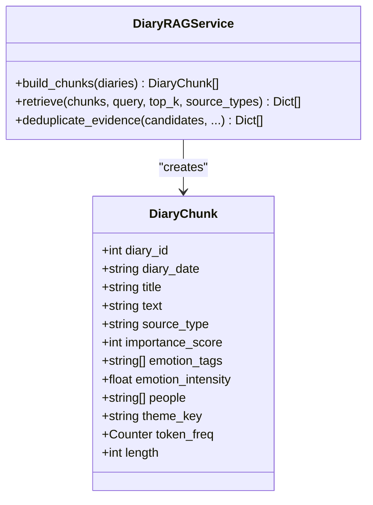

**Diagram sources**
- [rag_service.py:15-29](file://backend/app/services/rag_service.py#L15-L29)
- [rag_service.py:147-208](file://backend/app/services/rag_service.py#L147-L208)

**Section sources**
- [rag_service.py:15-29](file://backend/app/services/rag_service.py#L15-L29)
- [rag_service.py:147-208](file://backend/app/services/rag_service.py#L147-L208)

### Retrieval and Scoring
The retrieval engine:
- Filters chunks by source type
- Tokenizes the query
- Computes BM25-like scores per chunk using term frequencies and inverse document frequencies
- Applies normalization and combines multiple signals:
  - Normalized BM25 score
  - Recency decay
  - Importance score
  - Emotion intensity
  - Repetition penalty (per theme)
  - People hit bonus
  - Source bonus for summaries
- Sorts and returns top-k results with snippet previews

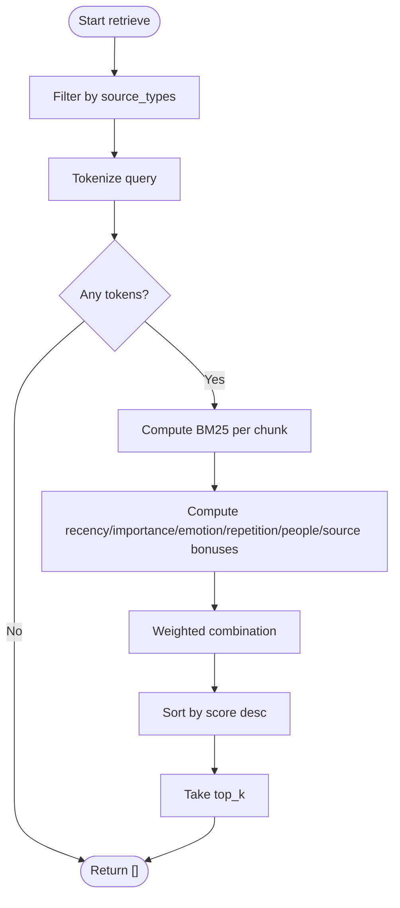

**Diagram sources**
- [rag_service.py:210-317](file://backend/app/services/rag_service.py#L210-L317)

**Section sources**
- [rag_service.py:210-317](file://backend/app/services/rag_service.py#L210-L317)

### Deduplication of Evidence
Evidence deduplication prevents redundant results:
- Limits per-diary and per-reason counts
- Computes token sets for candidate snippets
- Uses Jaccard similarity to detect near-duplicates and suppress them

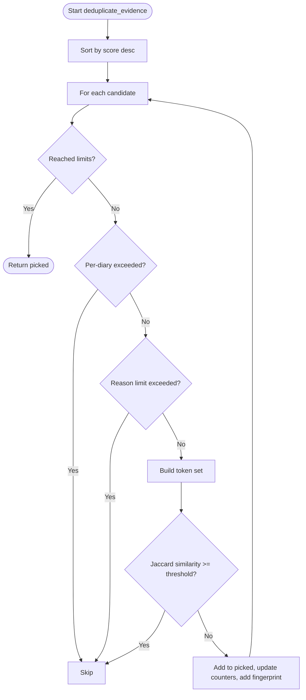

**Diagram sources**
- [rag_service.py:319-356](file://backend/app/services/rag_service.py#L319-L356)

**Section sources**
- [rag_service.py:319-356](file://backend/app/services/rag_service.py#L319-L356)

## Dependency Analysis
- API layer requests diaries and triggers chunk building
- Diary service loads diaries from the database model
- RAG service depends on tokenizer, segmenter, and metadata extractors
- Retrieval depends on chunk token frequencies and theme grouping

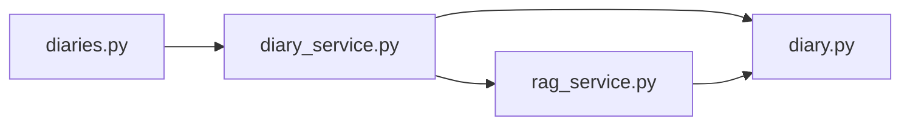

**Diagram sources**
- [diaries.py:279-318](file://backend/app/api/v1/diaries.py#L279-L318)
- [diary_service.py:280-522](file://backend/app/services/diary_service.py#L280-L522)
- [rag_service.py:147-208](file://backend/app/services/rag_service.py#L147-L208)
- [diary.py:29-64](file://backend/app/models/diary.py#L29-L64)

**Section sources**
- [diaries.py:279-318](file://backend/app/api/v1/diaries.py#L279-L318)
- [diary_service.py:280-522](file://backend/app/services/diary_service.py#L280-L522)
- [rag_service.py:147-208](file://backend/app/services/rag_service.py#L147-L208)
- [diary.py:29-64](file://backend/app/models/diary.py#L29-L64)

## Performance Considerations
- Chunk sizing and overlap
  - Default max length and overlap are tuned for readability and recall balance
  - Adjust max_len and overlap for content density and query patterns
- Tokenization cost
  - Tokenization is linear in text length; keep titles short and avoid excessive pre-tokenization
- Retrieval scaling
  - BM25 computation scales with number of chunks and unique tokens; consider filtering by source type and limiting top_k
  - Use deduplication to reduce redundant results and downstream processing
- Memory management
  - Token frequency counters are per chunk; for very large batches, consider streaming or batching chunk creation and retrieval
  - Deduplication fingerprints are sets of tokens; monitor memory usage when handling many candidates
- Database throughput
  - Diary loading is O(n); ensure indexes on user_id, date, and emotion tags for efficient queries

[No sources needed since this section provides general guidance]

## Troubleshooting Guide
- No chunks produced
  - Verify content is not empty and meets minimum token thresholds
  - Check that sentence boundaries split content into non-empty segments
- Low recall
  - Increase overlap to capture cross-boundary semantics
  - Reduce max_len for more granular chunks
- Poor relevance
  - Adjust weights in the weighted combination
  - Use source_type filtering to prefer summary chunks for broad queries
- Duplicate results
  - Tune similarity threshold and per-diary/per-reason limits in deduplication
- Performance bottlenecks
  - Monitor tokenization and BM25 computations; consider reducing top_k or enabling source filtering

**Section sources**
- [rag_service.py:38-62](file://backend/app/services/rag_service.py#L38-L62)
- [rag_service.py:210-317](file://backend/app/services/rag_service.py#L210-L317)
- [rag_service.py:319-356](file://backend/app/services/rag_service.py#L319-L356)

## Conclusion
The diary chunking and preprocessing pipeline provides a robust, multilingual foundation for RAG retrieval. By combining sentence-aware segmentation, tokenization, metadata extraction, and a weighted scoring mechanism, it enables precise and contextually relevant recall across large diary volumes. Tuning chunk size, overlap, and retrieval weights allows balancing precision and recall for diverse use cases.