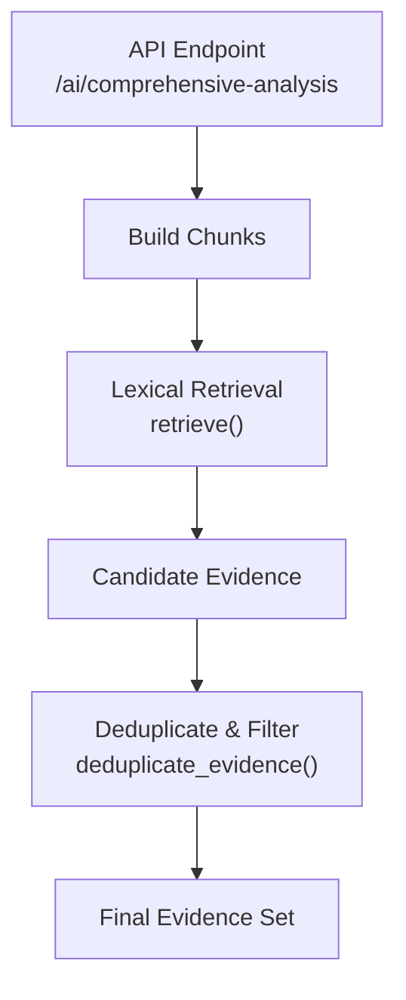
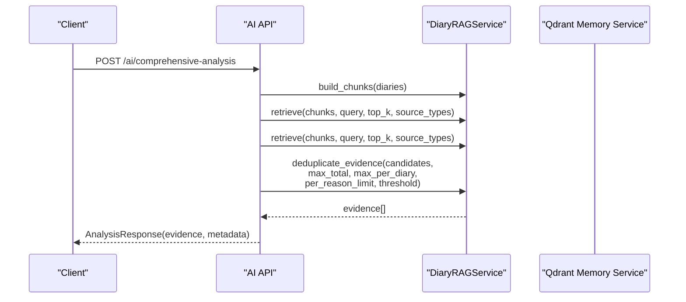
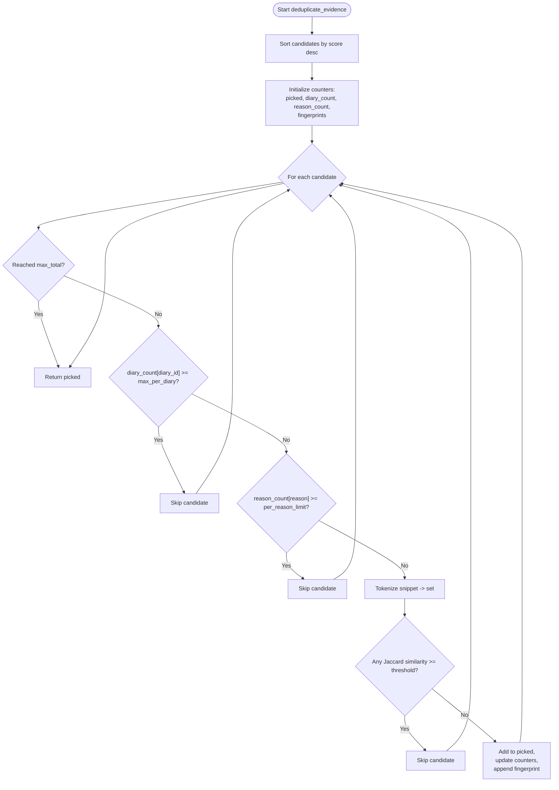
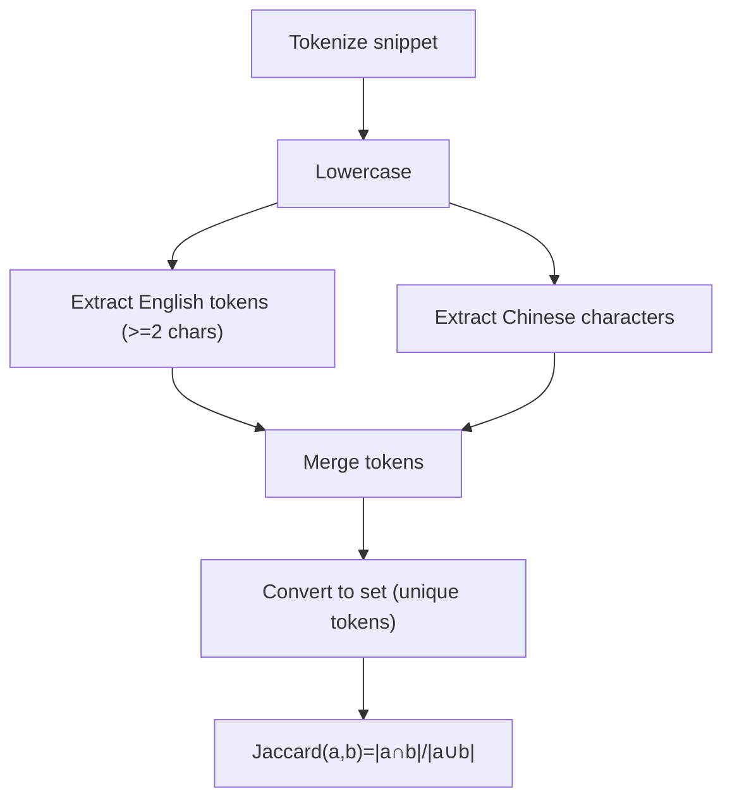
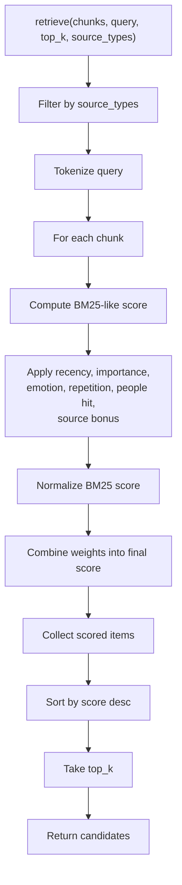
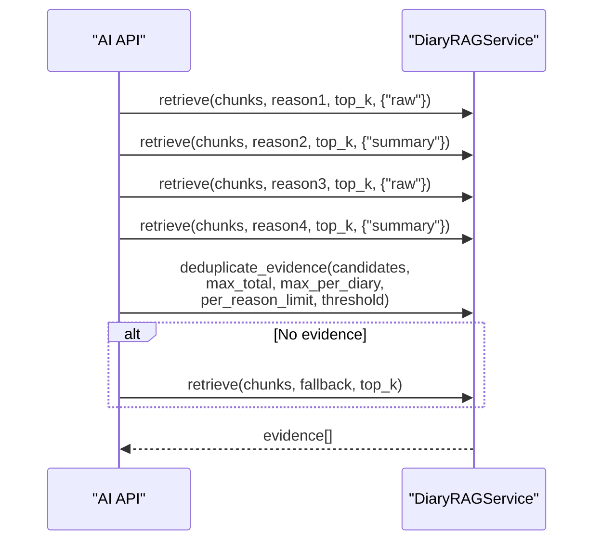
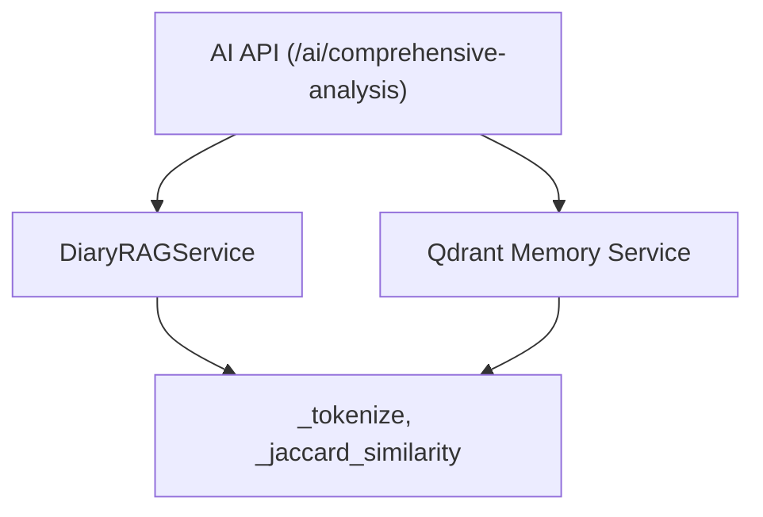

# Evidence Deduplication and Filtering

<cite>
**Referenced Files in This Document**
- [rag_service.py](file://backend/app/services/rag_service.py)
- [qdrant_memory_service.py](file://backend/app/services/qdrant_memory_service.py)
- [ai.py](file://backend/app/api/v1/ai.py)
- [config.py](file://backend/app/core/config.py)
</cite>

## Table of Contents
1. [Introduction](#introduction)
2. [Project Structure](#project-structure)
3. [Core Components](#core-components)
4. [Architecture Overview](#architecture-overview)
5. [Detailed Component Analysis](#detailed-component-analysis)
6. [Dependency Analysis](#dependency-analysis)
7. [Performance Considerations](#performance-considerations)
8. [Troubleshooting Guide](#troubleshooting-guide)
9. [Conclusion](#conclusion)
10. [Appendices](#appendices)

## Introduction
This document explains the evidence deduplication and filtering system used in the Retrieval-Augmented Generation (RAG) pipeline. It focuses on:
- Token fingerprint-based Jaccard similarity detection to remove near-duplicate evidence
- Multi-constraint filtering: maximum total evidence, per-diary caps, per-reason categorization caps
- Threshold tuning for similarity and how it affects recall vs. diversity
- Constraint enforcement to prevent bias from single sources and ensure diverse evidence selection
- Practical examples of deduplication scenarios, constraint interactions, and filtering effectiveness
- Trade-offs between recall and diversity and optimization strategies for different analysis contexts

## Project Structure
The deduplication and filtering logic lives primarily in the RAG service module. Evidence retrieval is orchestrated by the AI API endpoint, which builds candidate sets from lexical retrieval and then applies deduplication and constraints.

**Diagram sources**
- [ai.py:267-403](file://backend/app/api/v1/ai.py#L267-L403)
- [rag_service.py:147-359](file://backend/app/services/rag_service.py#L147-L359)

**Section sources**
- [ai.py:267-403](file://backend/app/api/v1/ai.py#L267-L403)
- [rag_service.py:147-359](file://backend/app/services/rag_service.py#L147-L359)

## Core Components
- Evidence builder and retriever: constructs chunks from diaries and retrieves candidates using BM25-like scoring with recency, importance, emotion, repetition, people hit, and source bonus.
- Deduplication and filtering: sorts candidates by score, enforces per-diary and per-reason caps, and removes near-duplicates using Jaccard similarity on token fingerprints.
- Memory service: provides vector-based retrieval for diary memory, tokenization and hashing utilities used by both memory and RAG.

Key parameters and thresholds:
- max_total: total cap on selected evidence
- max_per_diary: per-diary cap
- per_reason_limit: per-category (reason) cap
- similarity_threshold: Jaccard similarity threshold for duplicate detection

**Section sources**
- [rag_service.py:147-359](file://backend/app/services/rag_service.py#L147-L359)
- [ai.py:327-333](file://backend/app/api/v1/ai.py#L327-L333)

## Architecture Overview
The RAG pipeline integrates lexical retrieval with deduplication and multi-constraint filtering. Evidence is collected from multiple reasons (themes), combined, and then deduplicated and filtered before being passed to the LLM for analysis.

**Diagram sources**
- [ai.py:267-403](file://backend/app/api/v1/ai.py#L267-L403)
- [rag_service.py:147-359](file://backend/app/services/rag_service.py#L147-L359)
- [qdrant_memory_service.py:175-188](file://backend/app/services/qdrant_memory_service.py#L175-L188)

## Detailed Component Analysis

### Deduplication and Filtering Logic
The deduplication function performs:
- Sorting candidates by score (descending)
- Enforcing hard caps: total evidence, per-diary, per-reason
- Duplicate detection via Jaccard similarity on token fingerprints
- Maintaining a rolling fingerprint list to compare against

**Diagram sources**
- [rag_service.py:319-356](file://backend/app/services/rag_service.py#L319-L356)

**Section sources**
- [rag_service.py:319-356](file://backend/app/services/rag_service.py#L319-L356)

### Tokenization and Jaccard Similarity
- Tokenization splits text into lowercase tokens, capturing English tokens of length ≥ 2 and Chinese characters. This produces robust token sets for similarity comparisons.
- Jaccard similarity computes intersection over union of token sets, providing a normalized measure of overlap.

**Diagram sources**
- [rag_service.py:31-35](file://backend/app/services/rag_service.py#L31-L35)
- [rag_service.py:136-144](file://backend/app/services/rag_service.py#L136-L144)

**Section sources**
- [rag_service.py:31-35](file://backend/app/services/rag_service.py#L31-L35)
- [rag_service.py:136-144](file://backend/app/services/rag_service.py#L136-L144)

### Evidence Retrieval and Scoring
Evidence is built from:
- Raw chunks extracted from diary content
- Summary chunks derived from daily summaries

Scoring factors include BM25-like term frequency weighting, recency decay, importance, emotion intensity, repetition penalty, people hit bonus, and source type bonus. Final scores are normalized and combined into a weighted score.

**Diagram sources**
- [rag_service.py:210-317](file://backend/app/services/rag_service.py#L210-L317)

**Section sources**
- [rag_service.py:210-317](file://backend/app/services/rag_service.py#L210-L317)

### Integration in the AI Pipeline
The AI endpoint composes evidence from multiple reasons (themes), merges raw and summary retrievals, and applies deduplication with constraints. If no evidence remains after deduplication, it falls back to a broader retrieval.

**Diagram sources**
- [ai.py:321-337](file://backend/app/api/v1/ai.py#L321-L337)
- [rag_service.py:319-356](file://backend/app/services/rag_service.py#L319-L356)

**Section sources**
- [ai.py:321-337](file://backend/app/api/v1/ai.py#L321-L337)
- [rag_service.py:319-356](file://backend/app/services/rag_service.py#L319-L356)

## Dependency Analysis
- The AI endpoint depends on the RAG service for building chunks, retrieving candidates, and deduplicating evidence.
- The RAG service uses internal tokenization and Jaccard similarity functions.
- The memory service provides vector-based retrieval and shares tokenization utilities, but the deduplication logic operates on the textual snippets produced by the RAG service.

**Diagram sources**
- [ai.py:267-403](file://backend/app/api/v1/ai.py#L267-L403)
- [rag_service.py:147-359](file://backend/app/services/rag_service.py#L147-L359)
- [qdrant_memory_service.py:19-38](file://backend/app/services/qdrant_memory_service.py#L19-L38)

**Section sources**
- [ai.py:267-403](file://backend/app/api/v1/ai.py#L267-L403)
- [rag_service.py:147-359](file://backend/app/services/rag_service.py#L147-L359)
- [qdrant_memory_service.py:19-38](file://backend/app/services/qdrant_memory_service.py#L19-L38)

## Performance Considerations
- Complexity:
  - Deduplication loop iterates over candidates and compares against fingerprints; worst-case complexity is O(C × F) where C is the number of candidates and F is the number of fingerprints retained so far. With typical small F (bounded by caps), this remains efficient.
  - Tokenization and Jaccard similarity are linear in token counts.
- Tuning:
  - Increasing similarity_threshold reduces duplicates but risks dropping legitimate evidence; decreasing it increases recall but may introduce redundancy.
  - Adjusting max_total controls the final evidence size; lowering it improves diversity by forcing stricter duplicate removal.
  - Per-diary and per-reason caps prevent dominance by single sources or categories, improving diversity.
- Vector vs. lexical:
  - The memory service’s vector retrieval is separate from the deduplication logic; the latter operates on textual snippets and token fingerprints.

[No sources needed since this section provides general guidance]

## Troubleshooting Guide
Common issues and mitigations:
- No evidence returned after deduplication:
  - Verify that similarity_threshold is not overly strict; consider lowering it slightly.
  - Increase max_total to allow more picks.
  - Reduce per_reason_limit or max_per_diary if constraints are too tight.
  - Confirm that candidates contain sufficient variety across reasons and diaries.
- Bias toward single sources or reasons:
  - Lower per_reason_limit to force coverage across categories.
  - Lower max_per_diary to prevent dominance by a single diary.
- Overly aggressive deduplication:
  - Decrease similarity_threshold to allow more overlapping evidence.
  - Review tokenization behavior; ensure snippet content is meaningful and not truncated excessively.

**Section sources**
- [rag_service.py:319-356](file://backend/app/services/rag_service.py#L319-L356)
- [ai.py:327-333](file://backend/app/api/v1/ai.py#L327-L333)

## Conclusion
The evidence deduplication and filtering system ensures high-quality, diverse, and non-redundant evidence for analysis. By combining BM25-like lexical retrieval with Jaccard similarity-based duplicate detection and multi-constraint filtering, it balances recall and diversity while preventing bias from single sources or categories. Tuning parameters allows adaptation to different analysis contexts and user needs.

[No sources needed since this section summarizes without analyzing specific files]

## Appendices

### Parameter Reference
- max_total: Total cap on selected evidence
- max_per_diary: Maximum evidence per diary
- per_reason_limit: Maximum evidence per reason/category
- similarity_threshold: Jaccard similarity threshold for duplicate detection

**Section sources**
- [rag_service.py:319-356](file://backend/app/services/rag_service.py#L319-L356)
- [ai.py:327-333](file://backend/app/api/v1/ai.py#L327-L333)

### Example Scenarios
- Scenario A: High similarity threshold with low max_total
  - Effect: Fewer duplicates removed, but risk of missing relevant evidence; diversity may suffer.
- Scenario B: Low similarity threshold with higher max_total
  - Effect: More evidence retained; potential redundancy; improved recall at cost of diversity.
- Scenario C: Tight per-reason and per-diary caps
  - Effect: Stronger diversity across reasons and diaries; prevents single-source dominance.

[No sources needed since this section provides general guidance]