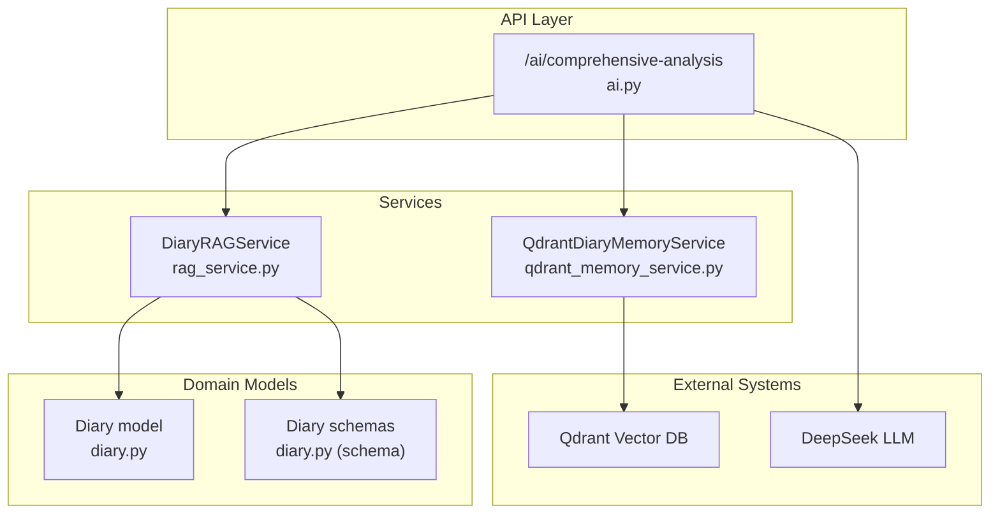
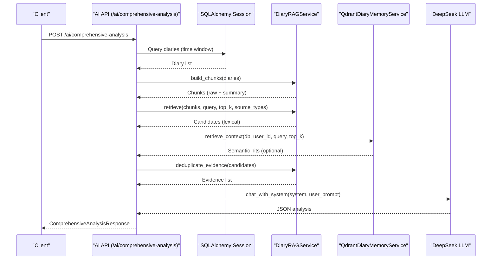
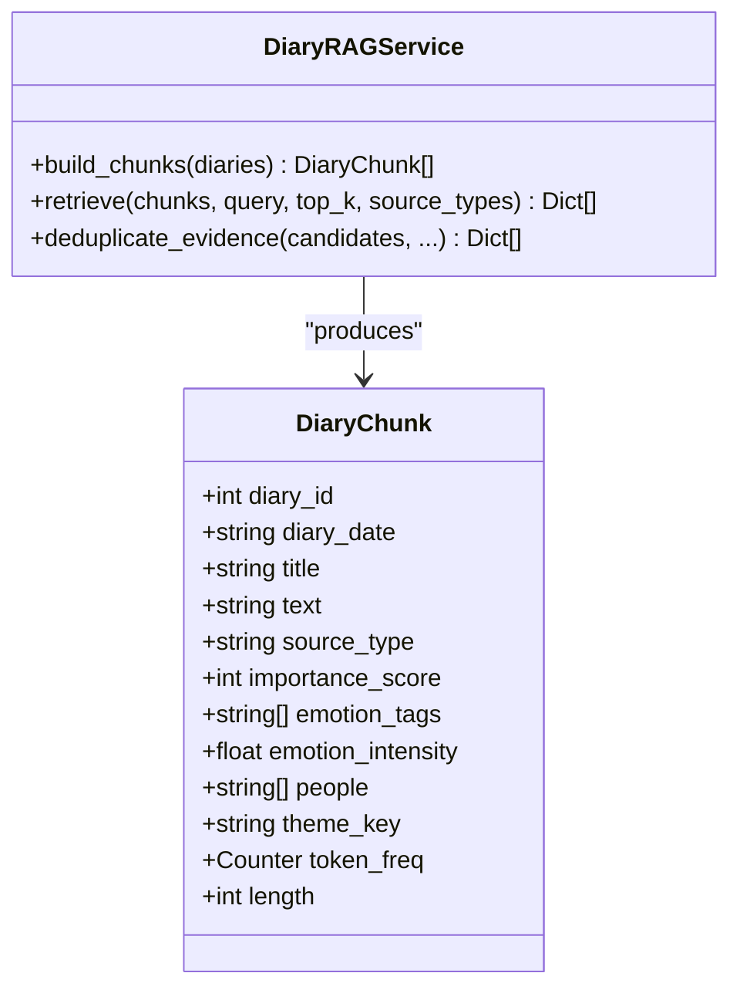
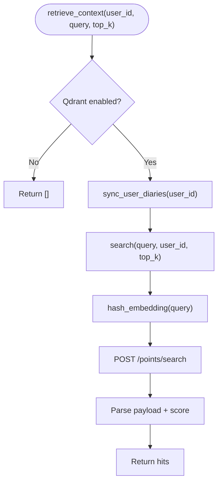
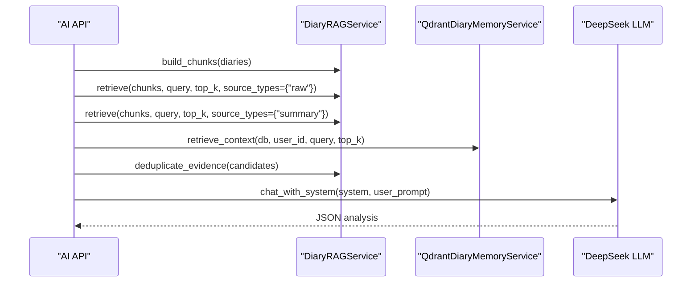
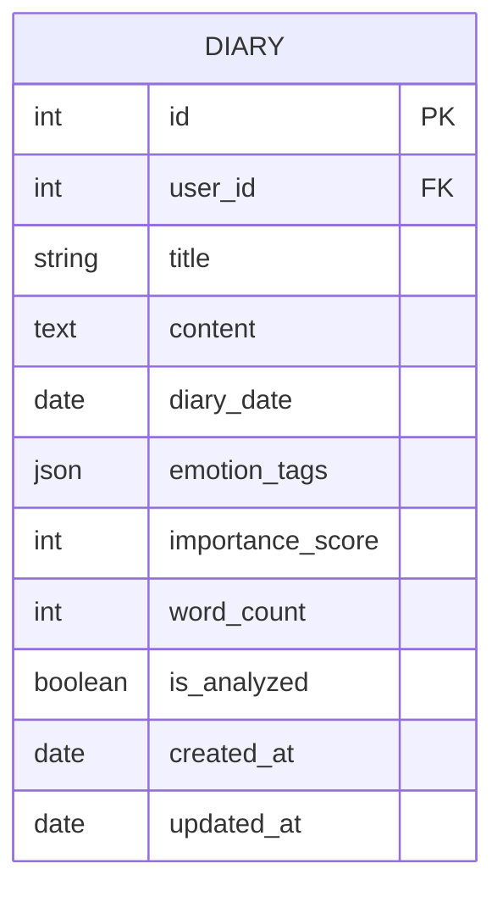
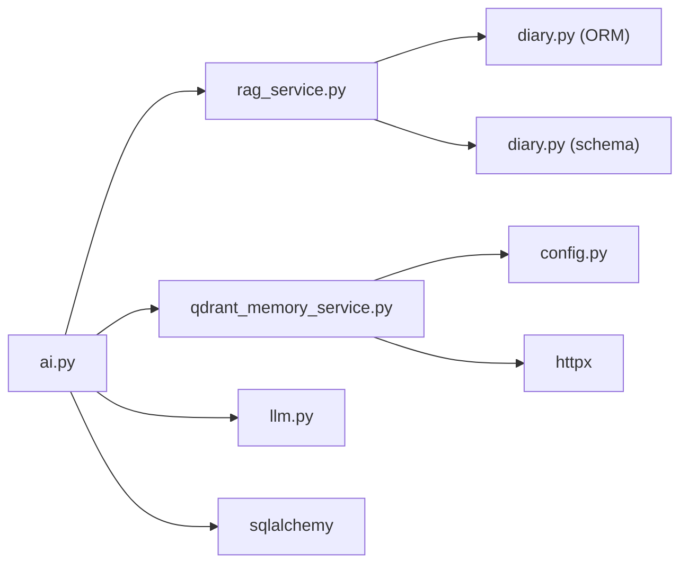

# Retrieval-Augmented Generation (RAG)

<cite>
**Referenced Files in This Document**
- [rag_service.py](file://backend/app/services/rag_service.py)
- [qdrant_memory_service.py](file://backend/app/services/qdrant_memory_service.py)
- [diary.py](file://backend/app/models/diary.py)
- [diary.py (schema)](file://backend/app/schemas/diary.py)
- [diaries.py](file://backend/app/api/v1/diaries.py)
- [ai.py](file://backend/app/api/v1/ai.py)
- [config.py](file://backend/app/core/config.py)
- [llm.py](file://backend/app/agents/llm.py)
- [requirements.txt](file://backend/requirements.txt)
</cite>

## Table of Contents
1. [Introduction](#introduction)
2. [Project Structure](#project-structure)
3. [Core Components](#core-components)
4. [Architecture Overview](#architecture-overview)
5. [Detailed Component Analysis](#detailed-component-analysis)
6. [Dependency Analysis](#dependency-analysis)
7. [Performance Considerations](#performance-considerations)
8. [Troubleshooting Guide](#troubleshooting-guide)
9. [Conclusion](#conclusion)
10. [Appendices](#appendices)

## Introduction
This document explains the custom Retrieval-Augmented Generation (RAG) implementation powering the “Comprehensive Analysis” feature in the Yinji application. It covers:
- Diary preprocessing pipeline: text cleaning, chunk segmentation, metadata extraction
- BM25-based lexical retrieval with weighted scoring and evidence deduplication
- Hybrid retrieval strategy combining lexical and semantic signals
- Qdrant vector database integration for semantic search and memory management
- Ranking formula, query expansion, and retrieval workflows
- Cost management, indexing strategies, and scalability considerations

## Project Structure
The RAG system spans services, models, schemas, APIs, and configuration:
- Services: RAG chunking and retrieval, Qdrant memory sync/search
- Models/Schemas: Diary entity and Pydantic DTOs
- API: Endpoints that orchestrate RAG-driven analysis
- Config: Qdrant connection and vector dimension settings
- LLM: DeepSeek client used downstream for synthesis

**Diagram sources**
- [ai.py:267-403](file://backend/app/api/v1/ai.py#L267-L403)
- [rag_service.py:147-360](file://backend/app/services/rag_service.py#L147-L360)
- [qdrant_memory_service.py:45-188](file://backend/app/services/qdrant_memory_service.py#L45-L188)
- [diary.py:29-64](file://backend/app/models/diary.py#L29-L64)
- [diary.py (schema):9-63](file://backend/app/schemas/diary.py#L9-L63)
- [config.py:72-88](file://backend/app/core/config.py#L72-L88)

**Section sources**
- [ai.py:267-403](file://backend/app/api/v1/ai.py#L267-L403)
- [rag_service.py:147-360](file://backend/app/services/rag_service.py#L147-L360)
- [qdrant_memory_service.py:45-188](file://backend/app/services/qdrant_memory_service.py#L45-L188)
- [diary.py:29-64](file://backend/app/models/diary.py#L29-L64)
- [diary.py (schema):9-63](file://backend/app/schemas/diary.py#L9-L63)
- [config.py:72-88](file://backend/app/core/config.py#L72-L88)

## Core Components
- DiaryRAGService: Builds chunks from diary entries, runs BM25-style lexical retrieval with temporal, importance, emotion, repetition, and people heuristics, and deduplicates evidence.
- QdrantDiaryMemoryService: Hash-based embedding encoder, collection lifecycle, user-scoped sync, and semantic search.
- API orchestration: Pulls diaries, builds chunks, retrieves candidates, deduplicates, and synthesizes insights via LLM.
- Configuration: Qdrant URL/API key/collection/vector dimension.

Key capabilities:
- Lexical chunking with overlap and sentence-aware segmentation
- Theme-aware grouping and repetition penalty
- Recency decay and weighted fusion
- Evidence deduplication using token Jaccard similarity
- Semantic search via Qdrant with cosine distance

**Section sources**
- [rag_service.py:147-360](file://backend/app/services/rag_service.py#L147-L360)
- [qdrant_memory_service.py:45-188](file://backend/app/services/qdrant_memory_service.py#L45-L188)
- [ai.py:267-403](file://backend/app/api/v1/ai.py#L267-L403)
- [config.py:72-88](file://backend/app/core/config.py#L72-L88)

## Architecture Overview
The RAG pipeline is invoked by the comprehensive analysis endpoint. It fetches recent diaries, builds lexical chunks, retrieves candidates via BM25, optionally enriches with semantic hits, deduplicates, and passes evidence to the LLM for synthesis.

**Diagram sources**
- [ai.py:267-403](file://backend/app/api/v1/ai.py#L267-L403)
- [rag_service.py:147-360](file://backend/app/services/rag_service.py#L147-L360)
- [qdrant_memory_service.py:175-186](file://backend/app/services/qdrant_memory_service.py#L175-L186)
- [llm.py:68-92](file://backend/app/agents/llm.py#L68-L92)

## Detailed Component Analysis

### DiaryRAGService
Responsibilities:
- Chunk construction: summary chunk per diary plus sentence-aware overlapping chunks from raw content
- Metadata extraction: people, emotion intensity, theme key, token frequency, length
- Lexical retrieval: BM25-like scoring with IDF, TF, length normalization; temporal decay; importance/emotion/repetition penalties; people hit bonus; source-type bonus
- Evidence deduplication: per-diary cap, per-reason cap, and token-set Jaccard similarity threshold

**Diagram sources**
- [rag_service.py:15-29](file://backend/app/services/rag_service.py#L15-L29)
- [rag_service.py:147-360](file://backend/app/services/rag_service.py#L147-L360)

Key algorithms and scoring:
- Tokenization supports English words and Chinese characters
- Chunking splits on sentence boundaries with overlap
- BM25-like score computed per query term and normalized by max BM25
- Final score fused from:
  - Normalized BM25
  - Recency decay
  - Importance score
  - Emotion intensity
  - Repetition penalty (theme cardinality)
  - People hit bonus
  - Source bonus (summary vs raw)

Evidence deduplication:
- Sort by score, enforce caps per diary and per reason category
- Compute token sets and compare Jaccard similarity against fingerprints

**Section sources**
- [rag_service.py:31-360](file://backend/app/services/rag_service.py#L31-L360)

### QdrantDiaryMemoryService
Responsibilities:
- Hash-based embedding generator (token → MD5 → dim-indexed histogram → normalized)
- Collection creation/ensurance with cosine distance
- User-scoped sync of diary vectors with payload
- Semantic search constrained by user_id filter
- Retrieve-context wrapper that ensures fresh data before search

**Diagram sources**
- [qdrant_memory_service.py:175-186](file://backend/app/services/qdrant_memory_service.py#L175-L186)
- [qdrant_memory_service.py:94-131](file://backend/app/services/qdrant_memory_service.py#L94-L131)
- [qdrant_memory_service.py:133-173](file://backend/app/services/qdrant_memory_service.py#L133-L173)

Embedding details:
- Tokenization identical to lexical pipeline
- Hash-based sparse histogram encoding into fixed dimension
- L2-normalization for unit vectors

Collection and filters:
- Vector size equals configured dimension
- Payload includes diary metadata for downstream use
- Filter ensures user isolation

**Section sources**
- [qdrant_memory_service.py:26-38](file://backend/app/services/qdrant_memory_service.py#L26-L38)
- [qdrant_memory_service.py:62-83](file://backend/app/services/qdrant_memory_service.py#L62-L83)
- [qdrant_memory_service.py:102-131](file://backend/app/services/qdrant_memory_service.py#L102-L131)
- [qdrant_memory_service.py:133-173](file://backend/app/services/qdrant_memory_service.py#L133-L173)
- [config.py:85-88](file://backend/app/core/config.py#L85-L88)

### API Orchestration and Hybrid Retrieval
The comprehensive analysis endpoint:
- Fetches diaries within a rolling window
- Builds lexical chunks and retrieves candidates for multiple reasons (queries)
- Optionally augments with semantic hits from Qdrant
- Deduplicates evidence and synthesizes JSON via LLM

**Diagram sources**
- [ai.py:267-403](file://backend/app/api/v1/ai.py#L267-L403)
- [rag_service.py:147-360](file://backend/app/services/rag_service.py#L147-L360)
- [qdrant_memory_service.py:175-186](file://backend/app/services/qdrant_memory_service.py#L175-L186)
- [llm.py:68-92](file://backend/app/agents/llm.py#L68-L92)

**Section sources**
- [ai.py:267-403](file://backend/app/api/v1/ai.py#L267-L403)

### Data Models and Schemas
- Diary ORM model defines fields used by RAG (title, content, emotion_tags, importance_score, diary_date)
- Pydantic schemas define request/response shapes for diary operations

**Diagram sources**
- [diary.py:29-64](file://backend/app/models/diary.py#L29-L64)

**Section sources**
- [diary.py:29-64](file://backend/app/models/diary.py#L29-L64)
- [diary.py (schema):9-63](file://backend/app/schemas/diary.py#L9-L63)

## Dependency Analysis
- Internal dependencies:
  - API depends on RAG and Qdrant services
  - RAG depends on SQLAlchemy models for metadata and schemas for validation
  - Qdrant service depends on configuration for cluster settings
- External dependencies:
  - httpx for HTTP requests to Qdrant
  - DeepSeek client for LLM synthesis
  - SQLAlchemy for ORM and database access

**Diagram sources**
- [ai.py:267-403](file://backend/app/api/v1/ai.py#L267-L403)
- [rag_service.py:147-360](file://backend/app/services/rag_service.py#L147-L360)
- [qdrant_memory_service.py:45-188](file://backend/app/services/qdrant_memory_service.py#L45-L188)
- [diary.py:29-64](file://backend/app/models/diary.py#L29-L64)
- [diary.py (schema):9-63](file://backend/app/schemas/diary.py#L9-L63)
- [config.py:72-88](file://backend/app/core/config.py#L72-L88)
- [llm.py:13-220](file://backend/app/agents/llm.py#L13-L220)
- [requirements.txt:1-26](file://backend/requirements.txt#L1-L26)

**Section sources**
- [requirements.txt:1-26](file://backend/requirements.txt#L1-L26)
- [config.py:72-88](file://backend/app/core/config.py#L72-L88)

## Performance Considerations
- Chunk sizing and overlap:
  - Sentence-aware segmentation with overlap reduces loss across boundaries
  - Adjust max_len and overlap to balance granularity and recall
- BM25 tuning:
  - k1 and b parameters control TF saturation and length normalization
  - Normalize BM25 by max score per batch to stabilize fusion weights
- Fusion weights:
  - Current weights emphasize lexical score, with modest contributions from recency, importance, emotion, repetition, people hit, and source bonus
  - Tune weights based on domain feedback and evaluation metrics
- Deduplication:
  - Jaccard threshold balances precision/recall; adjust per use case
  - Caps per diary and per reason category prevent dominance by single sources
- Qdrant embedding:
  - Hash-based encoding is deterministic and lightweight; dimensionality trade-off affects storage and speed
  - Cosine distance suitable for normalized vectors
- Memory management:
  - Sync only recent diaries (limit configurable) to keep collection small and fast
  - Use user_id filter to avoid cross-user scans
- Cost control:
  - Limit top_k and payload fields to essential metadata
  - Batch operations via upsert for fewer network calls
- Scalability:
  - Horizontal scaling Qdrant cluster
  - Indexing: ensure vector dimension and distance match embedding function
  - Consider sharding by user_id for very large deployments

[No sources needed since this section provides general guidance]

## Troubleshooting Guide
Common issues and remedies:
- No candidates returned:
  - Verify query tokens are not empty after tokenization
  - Check that source_types filter does not exclude all chunks
  - Confirm diaries exist within the selected date window
- Empty Qdrant results:
  - Ensure Qdrant URL/API key/collection are configured
  - Verify collection exists and vectors were upserted
  - Confirm user_id filter matches stored payload
- LLM parsing failures:
  - Validate JSON response format and retry with stricter prompts
- Deduplication too aggressive:
  - Lower Jaccard threshold or increase per-reason cap
- Slow retrieval:
  - Reduce top_k, limit payload fields, or pre-filter diaries by date range

**Section sources**
- [rag_service.py:210-317](file://backend/app/services/rag_service.py#L210-L317)
- [qdrant_memory_service.py:133-173](file://backend/app/services/qdrant_memory_service.py#L133-L173)
- [ai.py:372-384](file://backend/app/api/v1/ai.py#L372-L384)

## Conclusion
The Yinji RAG implementation combines a lightweight BM25-style lexical retriever with optional semantic augmentation to support comprehensive psychological growth analysis. Its modular design enables incremental improvements: expand query coverage, refine fusion weights, scale Qdrant, and iterate on deduplication thresholds. The system emphasizes practicality, cost awareness, and user isolation while remaining extensible for future enhancements.

[No sources needed since this section summarizes without analyzing specific files]

## Appendices

### Retrieval Workflow Examples
- Lexical-only retrieval:
  - Build chunks from diaries
  - Retrieve with source_types restricted to raw or summary
  - Deduplicate and synthesize
- Hybrid retrieval:
  - Retrieve lexical candidates
  - Augment with semantic hits from Qdrant
  - Merge, deduplicate, and synthesize

**Section sources**
- [ai.py:313-337](file://backend/app/api/v1/ai.py#L313-L337)
- [rag_service.py:147-360](file://backend/app/services/rag_service.py#L147-L360)
- [qdrant_memory_service.py:175-186](file://backend/app/services/qdrant_memory_service.py#L175-L186)

### Chunk Size Optimization Tips
- Start with max_len around 200–300 characters and overlap ~20–40%
- Increase overlap for dense topics (e.g., therapy notes) to preserve context
- Prefer sentence-aware splitting to maintain coherence

**Section sources**
- [rag_service.py:38-62](file://backend/app/services/rag_service.py#L38-L62)

### Memory Retrieval Patterns
- Retrieve context per query by syncing user’s recent diaries and searching with user_id filter
- Keep payload minimal (title, snippet, emotion_tags, importance_score) to reduce bandwidth and storage

**Section sources**
- [qdrant_memory_service.py:85-131](file://backend/app/services/qdrant_memory_service.py#L85-L131)
- [qdrant_memory_service.py:133-173](file://backend/app/services/qdrant_memory_service.py#L133-L173)

### Cost Management and Indexing
- Configure Qdrant vector dimension aligned with embedding function
- Use cosine distance for normalized hash embeddings
- Limit returned fields and top_k to reduce cost and latency
- Ensure collection exists and is properly sized for expected workload

**Section sources**
- [config.py:85-88](file://backend/app/core/config.py#L85-L88)
- [qdrant_memory_service.py:62-83](file://backend/app/services/qdrant_memory_service.py#L62-L83)
- [qdrant_memory_service.py:139-148](file://backend/app/services/qdrant_memory_service.py#L139-L148)