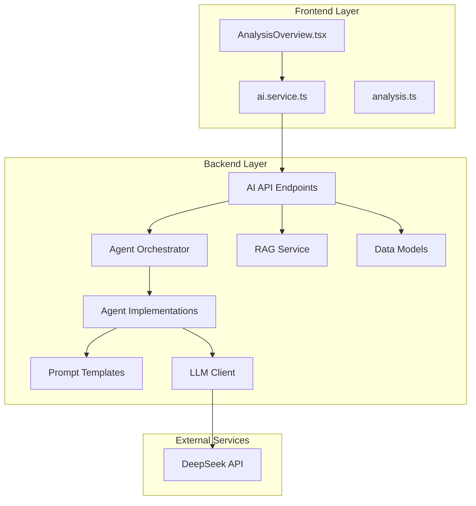
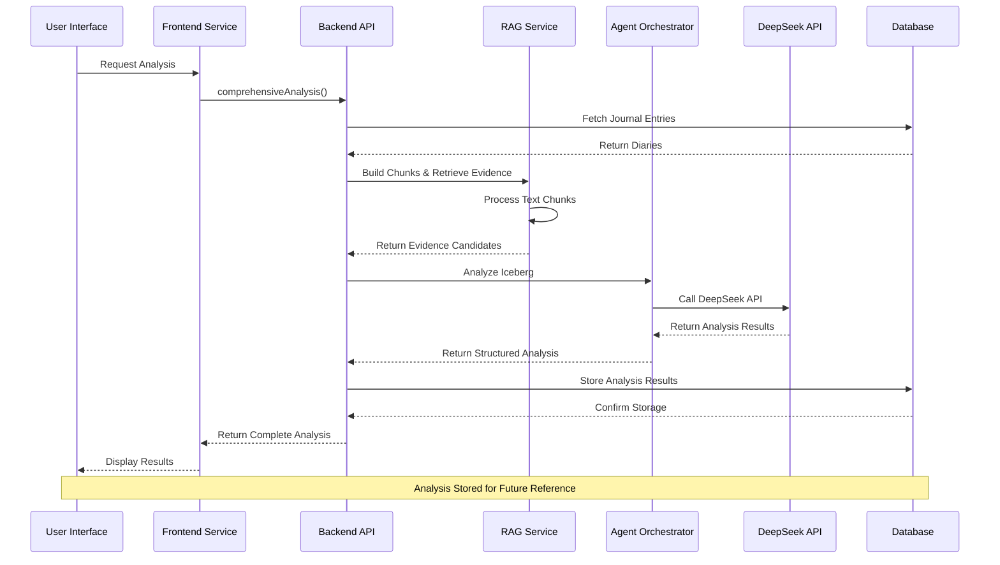
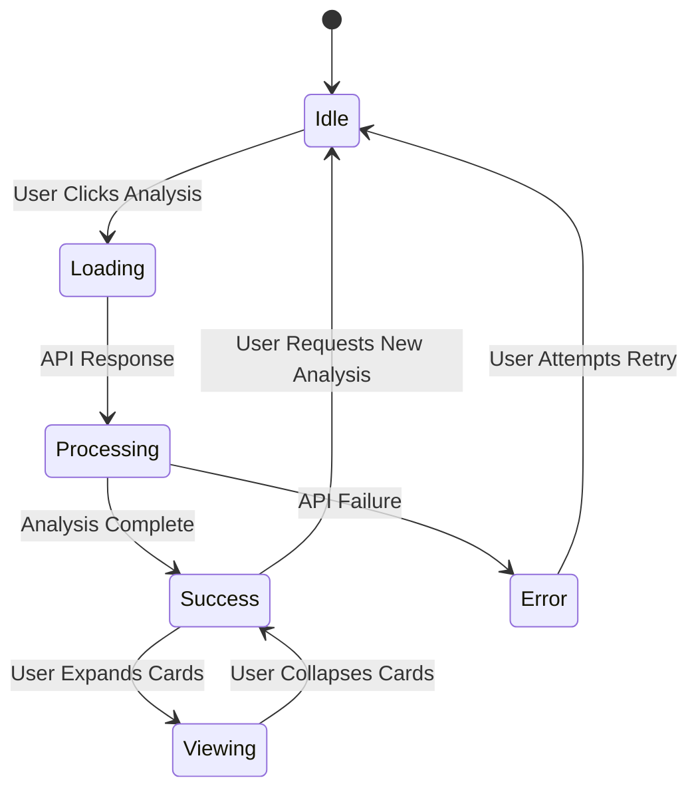
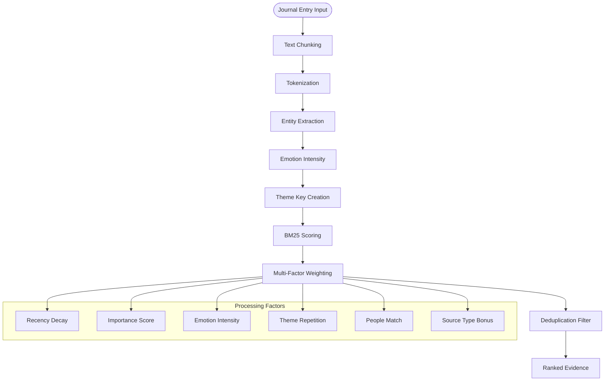
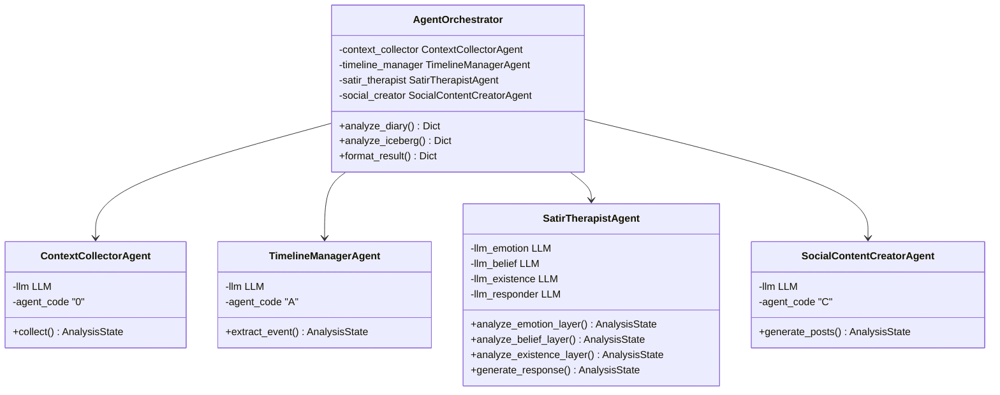
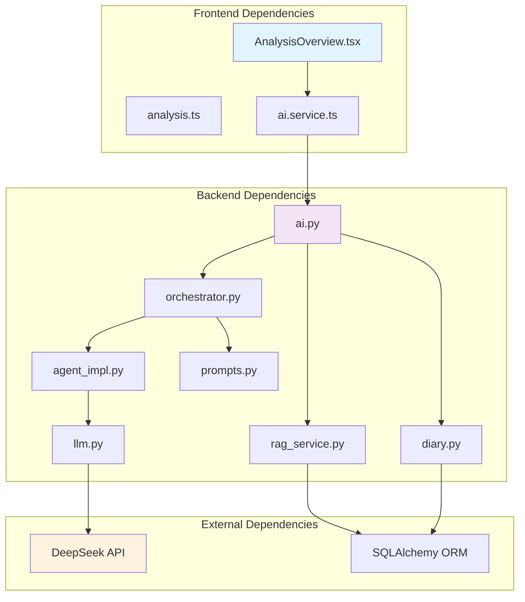

# Analysis Overview Component

<cite>
**Referenced Files in This Document**
- [AnalysisOverview.tsx](file://frontend/src/pages/analysis/AnalysisOverview.tsx)
- [analysis.ts](file://frontend/src/types/analysis.ts)
- [ai.service.ts](file://frontend/src/services/ai.service.ts)
- [ai.py](file://backend/app/api/v1/ai.py)
- [rag_service.py](file://backend/app/services/rag_service.py)
- [orchestrator.py](file://backend/app/agents/orchestrator.py)
- [agent_impl.py](file://backend/app/agents/agent_impl.py)
- [prompts.py](file://backend/app/agents/prompts.py)
- [llm.py](file://backend/app/agents/llm.py)
- [diary.py](file://backend/app/models/diary.py)
- [diary.schema.py](file://backend/app/schemas/diary.py)
</cite>

## Table of Contents
1. [Introduction](#introduction)
2. [Project Structure](#project-structure)
3. [Core Components](#core-components)
4. [Architecture Overview](#architecture-overview)
5. [Detailed Component Analysis](#detailed-component-analysis)
6. [Dependency Analysis](#dependency-analysis)
7. [Performance Considerations](#performance-considerations)
8. [Troubleshooting Guide](#troubleshooting-guide)
9. [Conclusion](#conclusion)

## Introduction

The Analysis Overview Component is a sophisticated React-based interface that presents comprehensive psychological insights derived from user journal entries using the Satir Iceberg Model. This component serves as the primary user interface for displaying multi-layered analysis results, featuring five distinct depth levels that progressively reveal deeper psychological patterns and insights.

The component integrates advanced AI-powered analysis capabilities, combining Retrieval-Augmented Generation (RAG) techniques with multi-agent orchestration to provide users with meaningful self-reflection opportunities. It transforms raw journal data into structured insights about behavior patterns, emotional trends, cognitive processes, core beliefs, and deepest desires.

## Project Structure

The Analysis Overview Component follows a clear separation of concerns across the frontend and backend architecture:



**Diagram sources**
- [AnalysisOverview.tsx:1-395](file://frontend/src/pages/analysis/AnalysisOverview.tsx#L1-L395)
- [ai.service.ts:1-112](file://frontend/src/services/ai.service.ts#L1-L112)
- [ai.py:268-388](file://backend/app/api/v1/ai.py#L268-L388)

**Section sources**
- [AnalysisOverview.tsx:1-395](file://frontend/src/pages/analysis/AnalysisOverview.tsx#L1-L395)
- [ai.service.ts:1-112](file://frontend/src/services/ai.service.ts#L1-L112)
- [ai.py:268-388](file://backend/app/api/v1/ai.py#L268-L388)

## Core Components

### Frontend Analysis Component

The Analysis Overview Component is built around several key frontend elements:

#### Iceberg Layer Configuration
The component defines five distinct layers of psychological analysis, each with unique visual styling and semantic meaning:

| Layer | Depth Level | Purpose | Visual Indicators |
|-------|-------------|---------|-------------------|
| Behavior | Surface Level | Observable actions and patterns | Wave icon, sky blue gradients |
| Emotion | Subsurface Level | Feelings and emotional patterns | Droplet icon, blue gradients |
| Cognition | Deeper Level | Thinking patterns and beliefs | Brain icon, indigo gradients |
| Belief | Deep Level | Core values and life principles | Key icon, violet gradients |
| Yearning | Deepest Level | Fundamental desires and life energy | Heart icon, purple gradients |

#### Interactive Card System
Each layer is presented as an expandable card with smooth animations and progressive disclosure:

- **Summary View**: Initial collapsed state showing layer summary
- **Expanded Details**: Full breakdown of patterns, evidence, and insights
- **Visual Enhancements**: Color-coded indicators, emotion flow visualization
- **Progressive Animation**: Staggered entrance effects for depth perception

#### Evidence Presentation
The component displays supporting evidence with:
- **Source Attribution**: Diary dates and titles
- **Relevance Scoring**: Quality indicators for each evidence piece
- **Context Snippets**: Extracted text fragments from original entries
- **Reason Classification**: Why each piece was selected for analysis

**Section sources**
- [AnalysisOverview.tsx:8-60](file://frontend/src/pages/analysis/AnalysisOverview.tsx#L8-L60)
- [AnalysisOverview.tsx:80-238](file://frontend/src/pages/analysis/AnalysisOverview.tsx#L80-L238)
- [AnalysisOverview.tsx:240-395](file://frontend/src/pages/analysis/AnalysisOverview.tsx#L240-L395)

### Backend Analysis Pipeline

The backend implements a sophisticated multi-agent system for processing analysis requests:

#### RAG-Based Evidence Collection
The system employs Retrieval-Augmented Generation to gather relevant evidence from user journals:

1. **Chunk Processing**: Original journal entries are split into manageable text segments
2. **Semantic Indexing**: Each chunk is processed for themes, emotions, and key entities
3. **Weighted Retrieval**: Evidence is ranked based on relevance, recency, and importance
4. **Deduplication**: Similar evidence is filtered to prevent redundancy

#### Multi-Agent Orchestration
The analysis pipeline coordinates multiple specialized agents:

1. **Context Collector**: Gathers user profile and timeline context
2. **Timeline Manager**: Extracts significant events from journal content
3. **Satir Analyst**: Performs five-layer psychological analysis
4. **Social Content Creator**: Generates shareable content variants

**Section sources**
- [rag_service.py:147-360](file://backend/app/services/rag_service.py#L147-L360)
- [orchestrator.py:18-340](file://backend/app/agents/orchestrator.py#L18-L340)
- [agent_impl.py:92-484](file://backend/app/agents/agent_impl.py#L92-L484)

## Architecture Overview

The Analysis Overview Component implements a comprehensive microservices architecture with clear separation between presentation, business logic, and data processing layers:



**Diagram sources**
- [ai.service.ts:44-47](file://frontend/src/services/ai.service.ts#L44-L47)
- [ai.py:268-388](file://backend/app/api/v1/ai.py#L268-L388)
- [orchestrator.py:132-294](file://backend/app/agents/orchestrator.py#L132-L294)

The architecture follows these key principles:

### Data Flow Patterns
1. **Request Processing**: Frontend → Backend API → Agent Orchestration
2. **Evidence Gathering**: RAG Service → Multi-layer Analysis
3. **Result Formatting**: Agent Results → Structured Output
4. **Persistence**: Analysis Results → Database Storage

### Error Handling Strategy
- **Frontend**: Graceful loading states and error messaging
- **Backend**: Comprehensive exception handling with fallback responses
- **API Layer**: HTTP status codes and detailed error messages
- **Database**: Transaction rollback and warning propagation

**Section sources**
- [ai.py:268-388](file://backend/app/api/v1/ai.py#L268-L388)
- [AnalysisOverview.tsx:249-263](file://frontend/src/pages/analysis/AnalysisOverview.tsx#L249-L263)

## Detailed Component Analysis

### Frontend Component Implementation

#### State Management Architecture
The Analysis Overview Component implements sophisticated state management for handling complex user interactions:



**Diagram sources**
- [AnalysisOverview.tsx:241-263](file://frontend/src/pages/analysis/AnalysisOverview.tsx#L241-L263)

#### Visual Design System
The component employs a sophisticated color and animation system:

| Layer | Gradient | Border | Text Color | Tag Background |
|-------|----------|--------|------------|----------------|
| Behavior | Sky Blue | Sky-200 | Sky-700 | Sky-50 |
| Emotion | Blue | Blue-200 | Blue-700 | Blue-50 |
| Cognition | Indigo | Indigo-200 | Indigo-700 | Indigo-50 |
| Belief | Violet | Violet-300 | Violet-100 | Violet-900/30 |
| Yearning | Purple | Purple-400 | Amber-100 | Purple-900/30 |

#### Animation and Interaction Patterns
The component implements progressive disclosure with:
- **Staggered Animations**: Cards appear with increasing delays (120ms intervals)
- **Smooth Transitions**: Opacity and position changes with 700ms duration
- **Interactive Elements**: Expand/collapse buttons with chevron icons
- **Visual Feedback**: Hover states and active selections

**Section sources**
- [AnalysisOverview.tsx:8-60](file://frontend/src/pages/analysis/AnalysisOverview.tsx#L8-L60)
- [AnalysisOverview.tsx:241-395](file://frontend/src/pages/analysis/AnalysisOverview.tsx#L241-L395)

### Backend Processing Pipeline

#### RAG Service Implementation
The Retrieval-Augmented Generation service provides sophisticated text processing:



**Diagram sources**
- [rag_service.py:147-360](file://backend/app/services/rag_service.py#L147-L360)

#### Agent Orchestration System
The multi-agent system coordinates specialized analysis capabilities:



**Diagram sources**
- [orchestrator.py:18-340](file://backend/app/agents/orchestrator.py#L18-L340)
- [agent_impl.py:92-484](file://backend/app/agents/agent_impl.py#L92-L484)

**Section sources**
- [rag_service.py:147-360](file://backend/app/services/rag_service.py#L147-L360)
- [orchestrator.py:18-340](file://backend/app/agents/orchestrator.py#L18-L340)
- [agent_impl.py:92-484](file://backend/app/agents/agent_impl.py#L92-L484)

### Data Models and Types

#### Analysis Response Structure
The component handles complex nested data structures representing multi-layer analysis:

```mermaid
erDiagram
ICEBERG_ANALYSIS_RESPONSE {
behavior_layer BehaviorLayer
emotion_layer EmotionLayer
cognition_layer CognitionLayer
belief_layer BeliefLayer
yearning_layer YearningLayer
letter string
evidence EvidenceItem[]
metadata AnalysisMetadata
}
BEHAVIOR_LAYER {
patterns BehaviorPattern[]
summary string
}
EMOTION_LAYER {
emotion_flow EmotionPhase[]
turning_points TurningPoint[]
summary string
}
COGNITION_LAYER {
thought_patterns ThoughtPattern[]
summary string
}
BELIEF_LAYER {
core_beliefs CoreBelief[]
self_narrative string
summary string
}
YEARNING_LAYER {
yearnings Yearning[]
life_energy string
summary string
}
ICEBERG_ANALYSIS_RESPONSE ||--|| BEHAVIOR_LAYER
ICEBERG_ANALYSIS_RESPONSE ||--|| EMOTION_LAYER
ICEBERG_ANALYSIS_RESPONSE ||--|| COGNITION_LAYER
ICEBERG_ANALYSIS_RESPONSE ||--|| BELIEF_LAYER
ICEBERG_ANALYSIS_RESPONSE ||--|| YEARNING_LAYER
```

**Diagram sources**
- [analysis.ts:119-139](file://frontend/src/types/analysis.ts#L119-L139)

**Section sources**
- [analysis.ts:119-139](file://frontend/src/types/analysis.ts#L119-L139)
- [analysis.ts:46-139](file://frontend/src/types/analysis.ts#L46-L139)

## Dependency Analysis

The Analysis Overview Component exhibits strong modularity with clear dependency boundaries:



**Diagram sources**
- [AnalysisOverview.tsx:1-6](file://frontend/src/pages/analysis/AnalysisOverview.tsx#L1-L6)
- [ai.py:23-31](file://backend/app/api/v1/ai.py#L23-L31)
- [llm.py:13-220](file://backend/app/agents/llm.py#L13-L220)

### Component Coupling Analysis

The component demonstrates excellent separation of concerns:

- **Frontend**: Pure UI logic with minimal business logic
- **Backend**: Well-structured API layer with clear service boundaries
- **Data Access**: Clean SQLAlchemy models with proper relationships
- **External Integration**: Dedicated LLM client with clear interface

### Potential Circular Dependencies
No circular dependencies detected in the analysis component structure.

**Section sources**
- [AnalysisOverview.tsx:1-6](file://frontend/src/pages/analysis/AnalysisOverview.tsx#L1-L6)
- [ai.py:23-31](file://backend/app/api/v1/ai.py#L23-L31)
- [diary.py:29-133](file://backend/app/models/diary.py#L29-L133)

## Performance Considerations

### Frontend Performance Optimization
The Analysis Overview Component implements several performance optimization strategies:

#### Lazy Loading and Progressive Rendering
- **Staggered Card Appearances**: 120ms delays between card animations
- **Conditional Rendering**: Evidence only loaded when cards are expanded
- **Memory Management**: Proper cleanup of animation listeners and timers

#### Network Optimization
- **Request Debouncing**: Prevents rapid successive analysis requests
- **Error Caching**: Failed requests are not retried automatically
- **Timeout Handling**: 60-second timeout for analysis completion

### Backend Performance Strategies
The backend implements comprehensive optimization techniques:

#### RAG Processing Efficiency
- **Chunk Size Optimization**: 260-character chunks with 40-character overlap
- **Early Termination**: Stop processing when sufficient evidence found
- **Memory Management**: Efficient token counting and deduplication

#### Agent Parallelization
- **Asynchronous Processing**: Multiple agents can operate concurrently
- **Resource Pooling**: Shared LLM clients with connection pooling
- **Batch Operations**: Multiple evidence items processed together

### Scalability Considerations
- **Database Indexing**: Proper indexing on user_id, diary_date, and created_at
- **Pagination**: Limits on returned evidence items (max 18)
- **Caching**: Analysis results cached for quick retrieval

## Troubleshooting Guide

### Common Frontend Issues

#### Analysis Loading Problems
**Symptoms**: Loading spinner remains indefinitely
**Causes**: 
- Network connectivity issues
- Backend API timeouts
- Large analysis windows requiring extensive processing

**Solutions**:
1. Verify network connectivity
2. Reduce analysis window size (30 days vs 90 days)
3. Check browser console for JavaScript errors
4. Clear browser cache and retry

#### Visual Rendering Issues
**Symptoms**: Cards not appearing or animations not working
**Causes**:
- CSS animation conflicts
- Browser compatibility issues
- DOM manipulation errors

**Solutions**:
1. Check browser developer tools for CSS errors
2. Verify animation support in target browsers
3. Test with different browsers/devices

### Backend Troubleshooting

#### API Response Failures
**Common Error Codes**:
- **400 Bad Request**: Invalid analysis parameters
- **404 Not Found**: User or diary not found
- **500 Internal Server Error**: Processing failures

**Diagnostic Steps**:
1. Check API endpoint availability
2. Verify authentication tokens
3. Review backend logs for stack traces
4. Validate database connectivity

#### Analysis Processing Issues
**Symptoms**: Long processing times or incomplete results
**Causes**:
- Insufficient journal entries
- LLM API rate limiting
- Database performance issues

**Solutions**:
1. Ensure adequate journal history (minimum 3 entries)
2. Check LLM API quota limits
3. Monitor database query performance
4. Consider reducing analysis window size

### Database and Persistence Issues

#### Analysis Storage Failures
**Symptoms**: Analysis results not persisting
**Causes**:
- Database transaction failures
- Schema migration issues
- Permission problems

**Solutions**:
1. Verify database connectivity
2. Check schema migration status
3. Review database permissions
4. Enable database logging for debugging

**Section sources**
- [AnalysisOverview.tsx:249-263](file://frontend/src/pages/analysis/AnalysisOverview.tsx#L249-L263)
- [ai.py:297-301](file://backend/app/api/v1/ai.py#L297-L301)
- [ai.py:365-369](file://backend/app/api/v1/ai.py#L365-L369)

## Conclusion

The Analysis Overview Component represents a sophisticated implementation of modern web application architecture, seamlessly integrating frontend interactivity with backend AI-powered analysis capabilities. The component successfully bridges the gap between complex psychological analysis and intuitive user experience through careful design and implementation choices.

### Key Strengths

**Architectural Excellence**: The component demonstrates excellent separation of concerns with clear frontend/backend boundaries, modular agent systems, and robust data flow patterns.

**User Experience Innovation**: The progressive disclosure approach, smooth animations, and layered presentation create an engaging and meaningful user journey through psychological self-discovery.

**Technical Sophistication**: Implementation of RAG techniques, multi-agent orchestration, and comprehensive error handling showcases advanced software engineering practices.

### Areas for Enhancement

**Performance Optimization**: Consider implementing virtual scrolling for large evidence sets and lazy-loading of detailed analysis content.

**Accessibility**: Enhanced screen reader support and keyboard navigation would improve accessibility compliance.

**Testing Coverage**: Expanded unit and integration testing would improve reliability and maintainability.

The Analysis Overview Component serves as an exemplary model for building complex, data-driven applications that prioritize both technical excellence and user experience. Its modular architecture and clear design patterns provide a solid foundation for future enhancements and extensions.