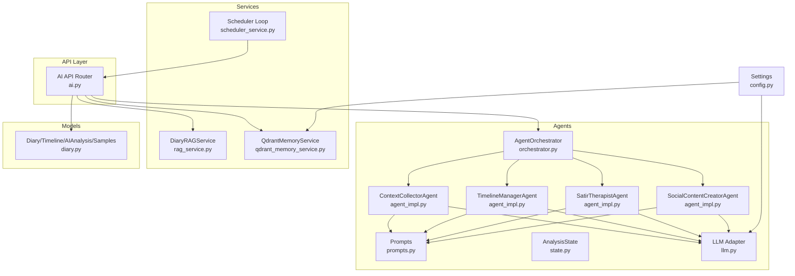
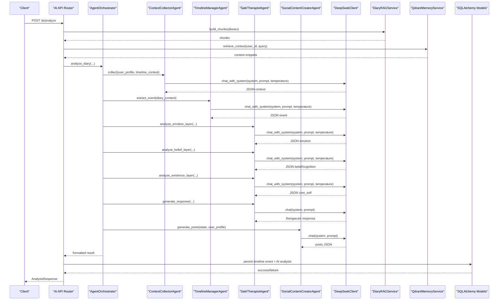
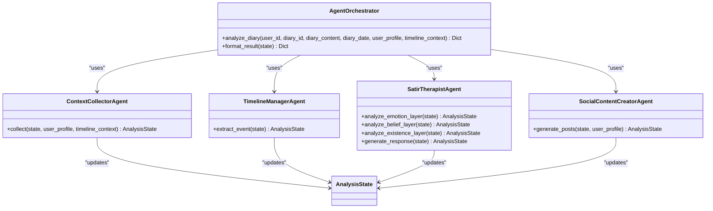
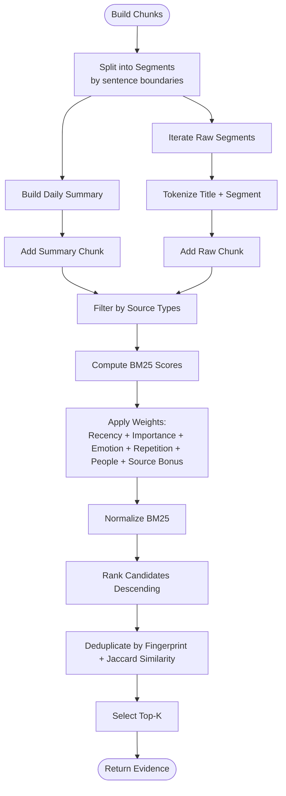
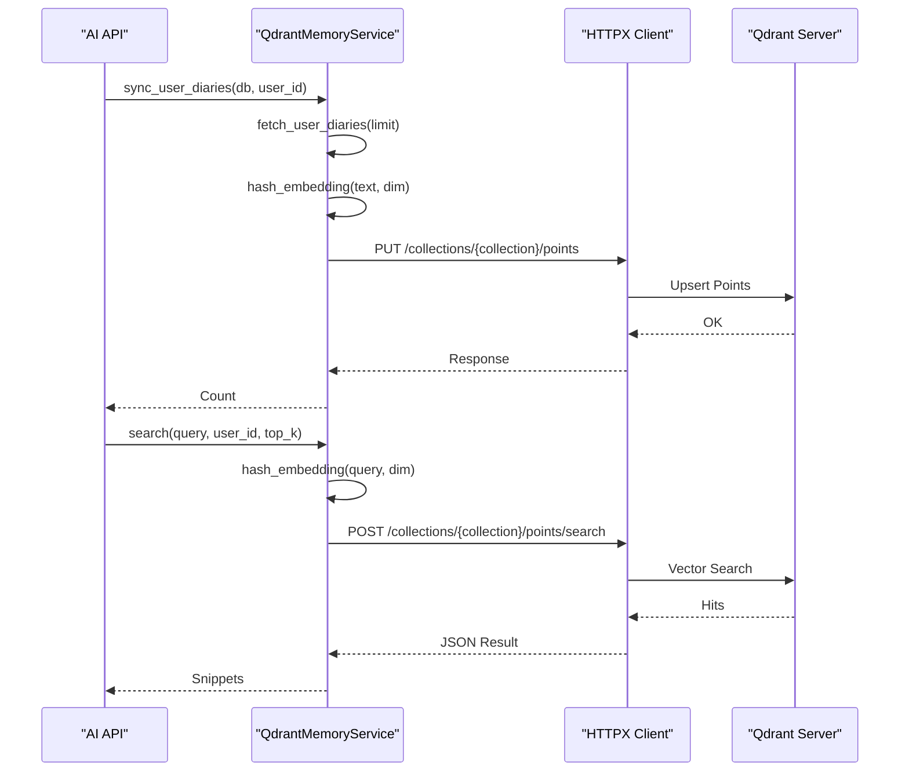
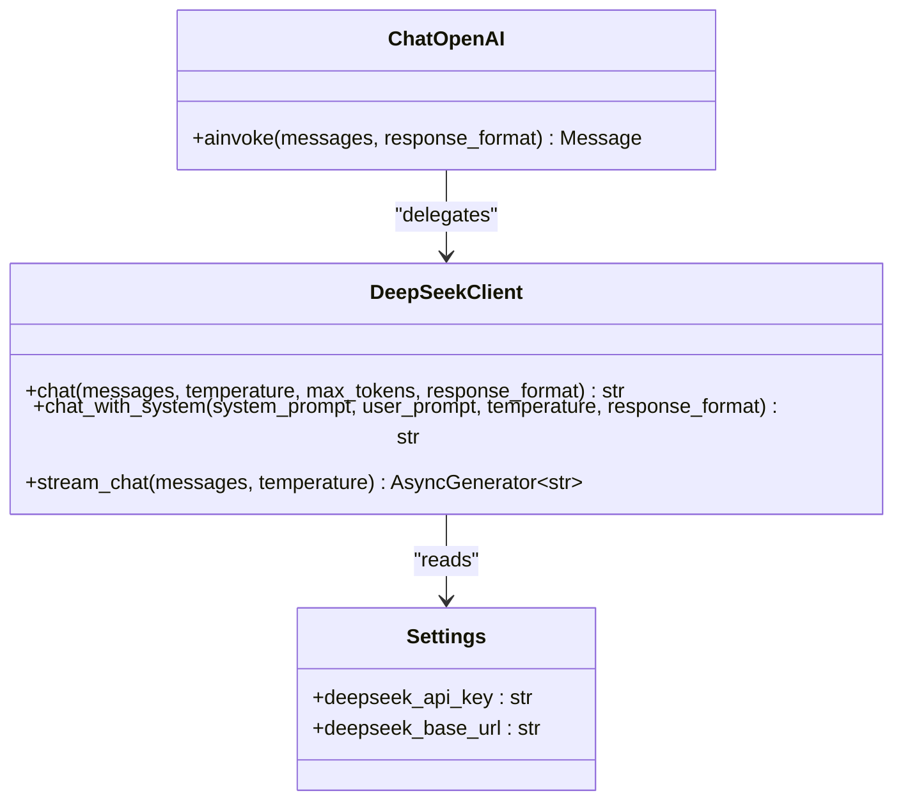
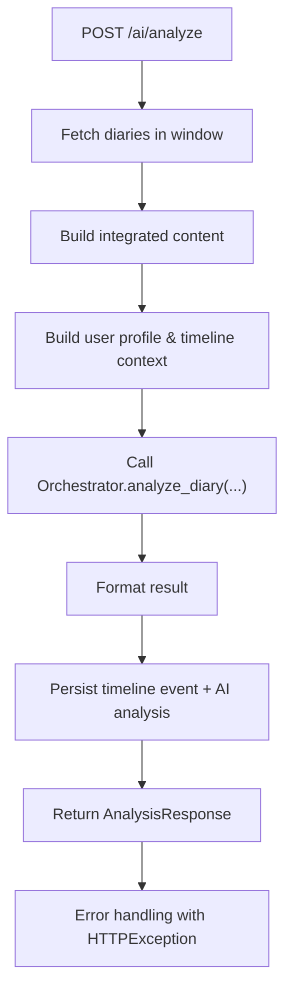
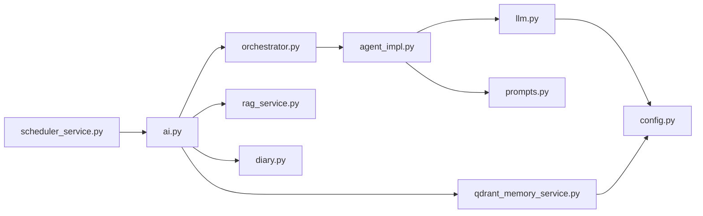
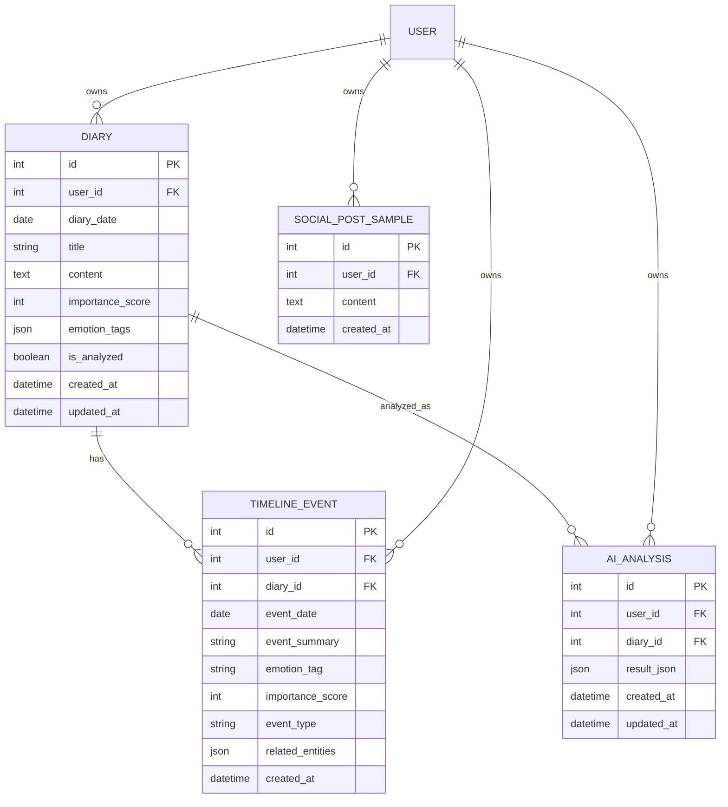

# AI System Architecture

<cite>
**Referenced Files in This Document**
- [main.py](file://backend/main.py)
- [config.py](file://backend/app/core/config.py)
- [ai.py](file://backend/app/api/v1/ai.py)
- [orchestrator.py](file://backend/app/agents/orchestrator.py)
- [agent_impl.py](file://backend/app/agents/agent_impl.py)
- [state.py](file://backend/app/agents/state.py)
- [prompts.py](file://backend/app/agents/prompts.py)
- [llm.py](file://backend/app/agents/llm.py)
- [rag_service.py](file://backend/app/services/rag_service.py)
- [qdrant_memory_service.py](file://backend/app/services/qdrant_memory_service.py)
- [diary.py](file://backend/app/models/diary.py)
- [scheduler_service.py](file://backend/app/services/scheduler_service.py)
</cite>

## Table of Contents
1. [Introduction](#introduction)
2. [Project Structure](#project-structure)
3. [Core Components](#core-components)
4. [Architecture Overview](#architecture-overview)
5. [Detailed Component Analysis](#detailed-component-analysis)
6. [Dependency Analysis](#dependency-analysis)
7. [Performance Considerations](#performance-considerations)
8. [Troubleshooting Guide](#troubleshooting-guide)
9. [Conclusion](#conclusion)
10. [Appendices](#appendices)

## Introduction
This document describes the AI system architecture of the 映记 intelligent system. It covers the multi-agent architecture with specialized agents for psychological analysis, content generation, and memory management; the agent orchestration system coordinating workflow execution; the Retrieval-Augmented Generation (RAG) implementation with a custom BM25 algorithm, diary chunking, and evidence deduplication; vector database integration with Qdrant for semantic search and memory storage; LLM integration with DeepSeek API, streaming response handling, and temperature control mechanisms; prompt engineering architecture with specialized templates; and the state management system for maintaining conversation context and session data. System diagrams illustrate the AI pipeline from user input through multiple agents to final output, including error handling and fallback mechanisms.

## Project Structure
The backend is organized around modular components:
- API layer: FastAPI routers exposing AI analysis endpoints
- Agents: Specialized agents for context collection, timeline extraction, psychological analysis (Satir Iceberg), and social content creation
- Services: RAG service for diary retrieval, Qdrant memory service for vector search, scheduler for daily tasks
- Models: SQLAlchemy ORM models for diaries, timeline events, AI analyses, and social samples
- Core: Configuration management and dependency injection

**Diagram sources**
- [ai.py:1-902](file://backend/app/api/v1/ai.py#L1-L902)
- [orchestrator.py:1-176](file://backend/app/agents/orchestrator.py#L1-L176)
- [agent_impl.py:1-484](file://backend/app/agents/agent_impl.py#L1-L484)
- [prompts.py:1-244](file://backend/app/agents/prompts.py#L1-L244)
- [state.py:1-45](file://backend/app/agents/state.py#L1-L45)
- [llm.py:1-220](file://backend/app/agents/llm.py#L1-L220)
- [rag_service.py:1-360](file://backend/app/services/rag_service.py#L1-L360)
- [qdrant_memory_service.py:1-190](file://backend/app/services/qdrant_memory_service.py#L1-L190)
- [diary.py:1-186](file://backend/app/models/diary.py#L1-L186)
- [scheduler_service.py:1-130](file://backend/app/services/scheduler_service.py#L1-L130)
- [config.py:1-105](file://backend/app/core/config.py#L1-L105)

**Section sources**
- [main.py:1-119](file://backend/main.py#L1-L119)
- [config.py:1-105](file://backend/app/core/config.py#L1-L105)

## Core Components
- AgentOrchestrator: Coordinates multi-agent workflows for diary analysis, including context collection, timeline extraction, Satir ice berg analysis, and social content generation.
- Agent implementations: ContextCollectorAgent, TimelineManagerAgent, SatirTherapistAgent (with sub-steps for emotion, belief/cognition, existence layers, and response generation), SocialContentCreatorAgent.
- Prompt templates: Specialized prompts for each agent and system-level prompts for tone and role.
- LLM integration: DeepSeek API client with synchronous and streaming modes, temperature control, and JSON response formatting.
- RAG service: Custom BM25-based retrieval with diary chunking, recency weighting, importance scoring, emotion intensity, repetition penalty, people hit bonus, and evidence deduplication.
- Qdrant memory service: Vector embedding via hashing, collection management, user diary synchronization, and semantic search with filters.
- State management: TypedDict-based AnalysisState capturing inputs, intermediate results, outputs, and metadata.
- API endpoints: Comprehensive analysis, daily guidance, title generation, social style samples, and result persistence.

**Section sources**
- [orchestrator.py:18-176](file://backend/app/agents/orchestrator.py#L18-L176)
- [agent_impl.py:92-484](file://backend/app/agents/agent_impl.py#L92-L484)
- [prompts.py:1-244](file://backend/app/agents/prompts.py#L1-L244)
- [llm.py:13-220](file://backend/app/agents/llm.py#L13-L220)
- [rag_service.py:147-360](file://backend/app/services/rag_service.py#L147-L360)
- [qdrant_memory_service.py:45-190](file://backend/app/services/qdrant_memory_service.py#L45-L190)
- [state.py:10-45](file://backend/app/agents/state.py#L10-L45)
- [ai.py:267-639](file://backend/app/api/v1/ai.py#L267-L639)

## Architecture Overview
The system follows a pipeline-driven AI architecture:
- User input enters via FastAPI endpoints.
- The orchestrator composes multiple agents to perform layered analysis.
- LLM calls are executed through a unified adapter that integrates with DeepSeek API.
- Memory retrieval uses both lexical RAG (custom BM25) and vector search (Qdrant).
- Results are persisted and returned to clients, with robust error handling and fallbacks.

**Diagram sources**
- [ai.py:406-639](file://backend/app/api/v1/ai.py#L406-L639)
- [orchestrator.py:27-171](file://backend/app/agents/orchestrator.py#L27-L171)
- [agent_impl.py:100-483](file://backend/app/agents/agent_impl.py#L100-L483)
- [llm.py:21-143](file://backend/app/agents/llm.py#L21-L143)
- [rag_service.py:147-360](file://backend/app/services/rag_service.py#L147-L360)
- [qdrant_memory_service.py:175-186](file://backend/app/services/qdrant_memory_service.py#L175-L186)
- [diary.py:29-153](file://backend/app/models/diary.py#L29-L153)

## Detailed Component Analysis

### Multi-Agent Orchestration
The orchestrator coordinates four specialized agents:
- Agent 0: ContextCollectorAgent collects user profile and timeline context, normalizing inputs for downstream agents.
- Agent A: TimelineManagerAgent extracts structured timeline events from diary content.
- Agent B: SatirTherapistAgent performs five-layer psychological analysis:
  - Emotion layer: surface vs underlying emotions
  - Cognitive layer: irrational beliefs and automatic thoughts
  - Belief layer: core beliefs and life rules
  - Existence layer: deepest desires and insights
  - Response generation: therapeutic reply synthesized from all layers
- Agent C: SocialContentCreatorAgent generates multiple versions of social media posts tailored to user style.

**Diagram sources**
- [orchestrator.py:18-176](file://backend/app/agents/orchestrator.py#L18-L176)
- [agent_impl.py:92-484](file://backend/app/agents/agent_impl.py#L92-L484)
- [state.py:10-45](file://backend/app/agents/state.py#L10-L45)

**Section sources**
- [orchestrator.py:27-171](file://backend/app/agents/orchestrator.py#L27-L171)
- [agent_impl.py:92-484](file://backend/app/agents/agent_impl.py#L92-L484)

### RAG Implementation with Custom BM25
The RAG service implements:
- DiaryChunk data model with tokenization, theme keys, and metadata
- Chunk building from summaries and raw content with overlap
- BM25 scoring with IDF, TF, and length normalization
- Weighted ranking incorporating recency, importance, emotion intensity, repetition, people hit, and source type bonus
- Evidence deduplication by fingerprinting and Jaccard similarity thresholds

**Diagram sources**
- [rag_service.py:147-360](file://backend/app/services/rag_service.py#L147-L360)

**Section sources**
- [rag_service.py:147-360](file://backend/app/services/rag_service.py#L147-L360)

### Vector Database Integration with Qdrant
The Qdrant service:
- Ensures collection existence with cosine distance vectors
- Hashes tokens into fixed-dimension vectors for embedding
- Synchronizes user diaries to Qdrant points with payloads
- Performs vector search with user filters and returns structured results
- Provides retrieve_context that syncs before search for real-time freshness

**Diagram sources**
- [qdrant_memory_service.py:45-190](file://backend/app/services/qdrant_memory_service.py#L45-L190)

**Section sources**
- [qdrant_memory_service.py:45-190](file://backend/app/services/qdrant_memory_service.py#L45-L190)

### LLM Integration with DeepSeek API
The LLM integration:
- DeepSeekClient supports synchronous chat, system-prompt chat, and streaming chat
- Temperature controls per agent type (analytical, creative, general)
- Response format enforcement for JSON outputs
- LangChain compatibility wrapper (ChatOpenAI) for agent implementations

**Diagram sources**
- [llm.py:13-220](file://backend/app/agents/llm.py#L13-L220)
- [config.py:62-70](file://backend/app/core/config.py#L62-L70)

**Section sources**
- [llm.py:13-220](file://backend/app/agents/llm.py#L13-L220)
- [config.py:62-70](file://backend/app/core/config.py#L62-L70)

### Prompt Engineering Architecture
Specialized prompt templates guide each agent:
- ContextCollectorPrompt: Extracts current mood, main events, concerns, hopes
- TimelineExtractorPrompt: Produces event summary, emotion tag, importance score, entity mentions
- SatirEmotionPrompt: Emotion layer analysis
- SatirBeliefPrompt: Cognitive and belief layer analysis
- SatirExistencePrompt: Existence layer insights
- SatirResponderPrompt: Therapeutic response synthesis
- SocialPostCreatorPrompt: Multi-version social posts
- System prompts define roles and tones for analysts and social creators

**Section sources**
- [prompts.py:7-244](file://backend/app/agents/prompts.py#L7-L244)

### State Management System
AnalysisState captures:
- Inputs: user_id, diary_id, diary_content, diary_date, user_profile, timeline_context
- Intermediate results: related_memories, behavior/emotion/cognitive/belief/core_self layers, timeline_event
- Outputs: therapeutic_response, social_posts
- Metadata: processing_time, error, current_step, agent_runs

**Section sources**
- [state.py:10-45](file://backend/app/agents/state.py#L10-L45)

### API Endpoints and Workflows
Key endpoints:
- /ai/analyze: Full integrated analysis with orchestration, persistence, and error handling
- /ai/comprehensive-analysis: User-level RAG analysis over configurable windows
- /ai/daily-guidance: Personalized writing prompts
- /ai/generate-title: Title suggestions
- /ai/social-style-samples: Manage user social post samples
- /ai/result/{diary_id}: Retrieve saved analysis results
- Background task endpoint (placeholder for async mode)

**Diagram sources**
- [ai.py:406-639](file://backend/app/api/v1/ai.py#L406-L639)

**Section sources**
- [ai.py:267-639](file://backend/app/api/v1/ai.py#L267-L639)

## Dependency Analysis
- API depends on orchestrator, RAG service, Qdrant service, and SQLAlchemy models
- Agents depend on prompts and LLM adapter
- LLM adapter depends on configuration for credentials and endpoints
- RAG service is standalone with internal utilities
- Qdrant service depends on configuration and SQLAlchemy models
- Scheduler runs independently and triggers refinement tasks

**Diagram sources**
- [ai.py:1-902](file://backend/app/api/v1/ai.py#L1-L902)
- [orchestrator.py:1-176](file://backend/app/agents/orchestrator.py#L1-L176)
- [agent_impl.py:1-484](file://backend/app/agents/agent_impl.py#L1-L484)
- [prompts.py:1-244](file://backend/app/agents/prompts.py#L1-L244)
- [llm.py:1-220](file://backend/app/agents/llm.py#L1-L220)
- [rag_service.py:1-360](file://backend/app/services/rag_service.py#L1-L360)
- [qdrant_memory_service.py:1-190](file://backend/app/services/qdrant_memory_service.py#L1-L190)
- [diary.py:1-186](file://backend/app/models/diary.py#L1-L186)
- [scheduler_service.py:1-130](file://backend/app/services/scheduler_service.py#L1-L130)
- [config.py:1-105](file://backend/app/core/config.py#L1-L105)

**Section sources**
- [ai.py:1-902](file://backend/app/api/v1/ai.py#L1-L902)
- [orchestrator.py:1-176](file://backend/app/agents/orchestrator.py#L1-L176)
- [agent_impl.py:1-484](file://backend/app/agents/agent_impl.py#L1-L484)
- [llm.py:1-220](file://backend/app/agents/llm.py#L1-L220)
- [config.py:1-105](file://backend/app/core/config.py#L1-L105)

## Performance Considerations
- Temperature tuning: Lower for analytical tasks (emotion/belief/existence), moderate for general, higher for creative content generation.
- Chunking strategy: Sentence-aware splitting with overlap to preserve context while controlling token counts.
- BM25 weights: Balanced combination of lexical match, recency, importance, emotion, repetition, and people hit to reduce noise.
- Vector dimension: Fixed 256-dimensional hashing embeddings for efficient Qdrant storage and search.
- Streaming: Available for interactive experiences; synchronous mode used for deterministic JSON outputs.
- Persistence: Batch writes for timeline events and AI analyses; error-safe rollback with warnings in metadata.

[No sources needed since this section provides general guidance]

## Troubleshooting Guide
Common issues and fallbacks:
- JSON parsing failures: Multiple strategies (direct JSON, fenced code blocks, incremental decode) with explicit error messages.
- Agent failures: Each agent records run metadata with duration and error; orchestrator continues with defaults or degraded outputs.
- Qdrant unavailability: retrieve_context returns empty list; API falls back gracefully.
- RAG empty results: Hybrid retrieval with fallback query and evidence deduplication limits.
- HTTP exceptions: API endpoints wrap errors with HTTPException and include detailed messages.

**Section sources**
- [agent_impl.py:25-68](file://backend/app/agents/agent_impl.py#L25-L68)
- [agent_impl.py:136-141](file://backend/app/agents/agent_impl.py#L136-L141)
- [agent_impl.py:191-202](file://backend/app/agents/agent_impl.py#L191-L202)
- [agent_impl.py:293-298](file://backend/app/agents/agent_impl.py#L293-L298)
- [agent_impl.py:337-346](file://backend/app/agents/agent_impl.py#L337-L346)
- [agent_impl.py:388-392](file://backend/app/agents/agent_impl.py#L388-L392)
- [agent_impl.py:465-482](file://backend/app/agents/agent_impl.py#L465-L482)
- [qdrant_memory_service.py:175-186](file://backend/app/services/qdrant_memory_service.py#L175-L186)
- [ai.py:34-64](file://backend/app/api/v1/ai.py#L34-L64)
- [ai.py:372-384](file://backend/app/api/v1/ai.py#L372-L384)

## Conclusion
The 映记 intelligent system integrates a robust multi-agent AI architecture with specialized agents for psychological analysis, timeline extraction, and social content generation. The agent orchestration system coordinates these agents around a shared state, while the RAG implementation augments analysis with historical diary context using a custom BM25 algorithm and Qdrant vector search. LLM integration with DeepSeek API supports both synchronous and streaming modes with precise temperature control and JSON formatting. The system emphasizes reliability through structured error handling, fallback mechanisms, and persistent state management.

[No sources needed since this section summarizes without analyzing specific files]

## Appendices

### Data Models Overview

**Diagram sources**
- [diary.py:29-153](file://backend/app/models/diary.py#L29-L153)