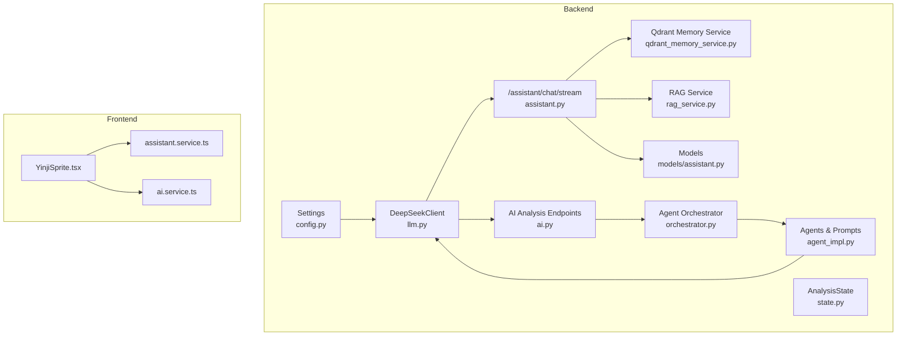
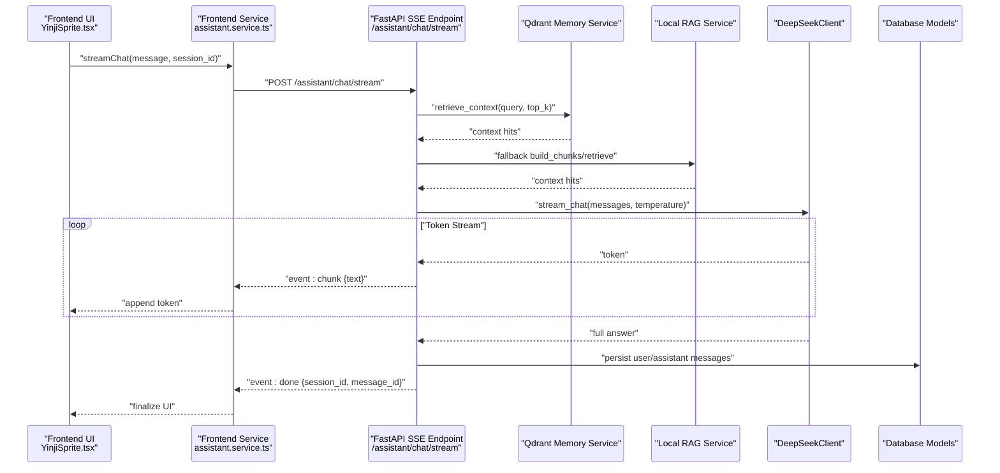
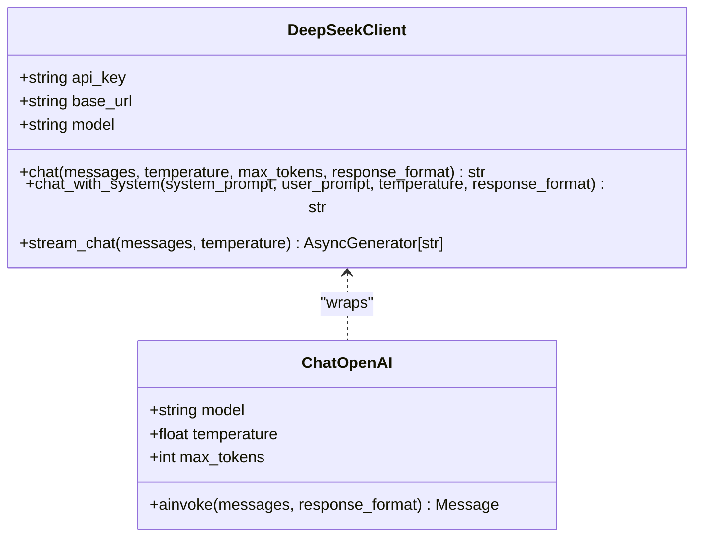
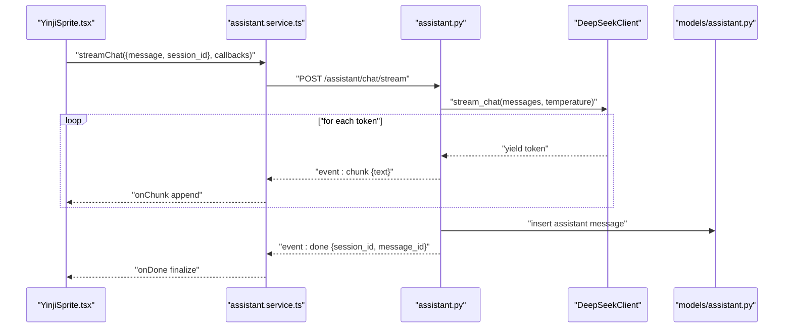
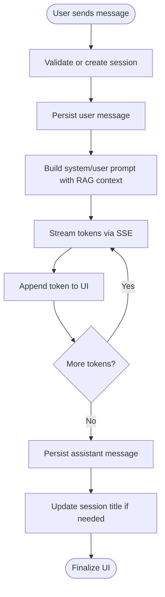
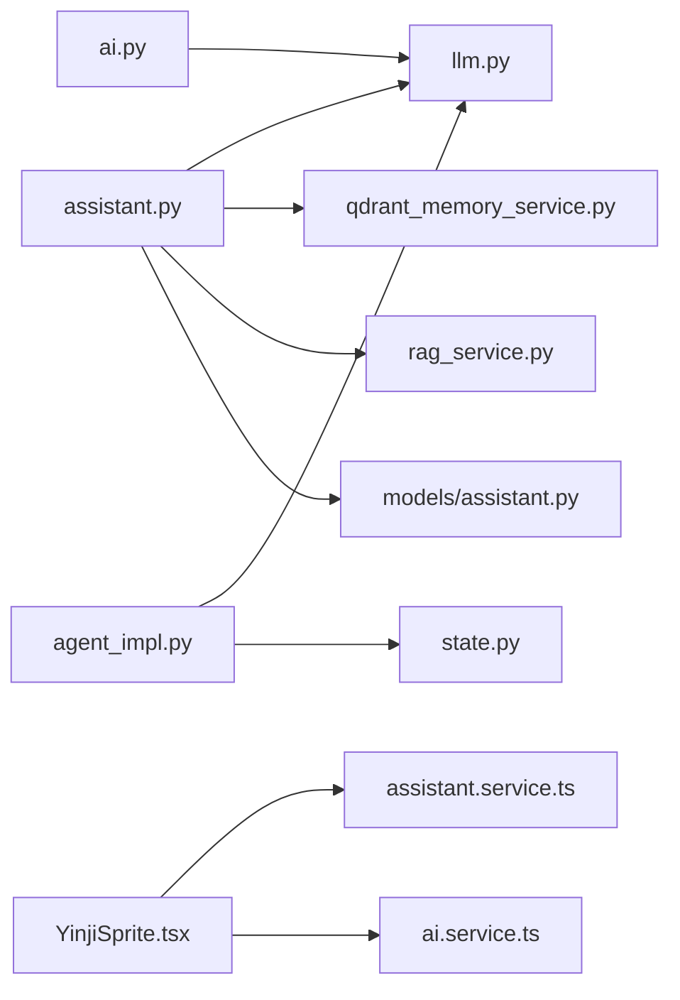

# LLM Integration

<cite>
**Referenced Files in This Document**
- [llm.py](file://backend/app/agents/llm.py)
- [assistant.py](file://backend/app/api/v1/assistant.py)
- [ai.py](file://backend/app/api/v1/ai.py)
- [config.py](file://backend/app/core/config.py)
- [state.py](file://backend/app/agents/state.py)
- [agent_impl.py](file://backend/app/agents/agent_impl.py)
- [rag_service.py](file://backend/app/services/rag_service.py)
- [qdrant_memory_service.py](file://backend/app/services/qdrant_memory_service.py)
- [assistant.service.ts](file://frontend/src/services/assistant.service.ts)
- [YinjiSprite.tsx](file://frontend/src/components/assistant/YinjiSprite.tsx)
- [ai.service.ts](file://frontend/src/services/ai.service.ts)
- [models/assistant.py](file://backend/app/models/assistant.py)
</cite>

## Table of Contents
1. [Introduction](#introduction)
2. [Project Structure](#project-structure)
3. [Core Components](#core-components)
4. [Architecture Overview](#architecture-overview)
5. [Detailed Component Analysis](#detailed-component-analysis)
6. [Dependency Analysis](#dependency-analysis)
7. [Performance Considerations](#performance-considerations)
8. [Troubleshooting Guide](#troubleshooting-guide)
9. [Conclusion](#conclusion)
10. [Appendices](#appendices)

## Introduction
This document explains the Large Language Model integration architecture in 映记 (Yinji). It focuses on the DeepSeek API client, streaming response handling, real-time conversation management, temperature control, response formatting, error handling, and the LLM request/response lifecycle. It also covers context management, conversation state preservation, SSE implementation, client-side streaming handling, configuration options, model selection criteria, and cost optimization strategies.

## Project Structure
The LLM integration spans backend Python services and frontend TypeScript components:
- Backend:
  - DeepSeek client and compatibility layer
  - Assistant streaming endpoint with SSE
  - AI analysis endpoints (non-streaming)
  - Agent orchestration and state management
  - RAG and Qdrant memory retrieval
  - Configuration and persistence models
- Frontend:
  - Assistant service for SSE parsing
  - UI component for the AI companion with real-time streaming

**Diagram sources**
- [config.py:62-70](file://backend/app/core/config.py#L62-L70)
- [llm.py:13-146](file://backend/app/agents/llm.py#L13-L146)
- [assistant.py:277-387](file://backend/app/api/v1/assistant.py#L277-L387)
- [ai.py:267-403](file://backend/app/api/v1/ai.py#L267-L403)
- [state.py:10-45](file://backend/app/agents/state.py#L10-L45)
- [agent_impl.py:92-484](file://backend/app/agents/agent_impl.py#L92-L484)
- [rag_service.py:147-360](file://backend/app/services/rag_service.py#L147-L360)
- [qdrant_memory_service.py:45-190](file://backend/app/services/qdrant_memory_service.py#L45-L190)
- [models/assistant.py:13-77](file://backend/app/models/assistant.py#L13-L77)
- [assistant.service.ts:99-126](file://frontend/src/services/assistant.service.ts#L99-L126)
- [YinjiSprite.tsx:281-335](file://frontend/src/components/assistant/YinjiSprite.tsx#L281-L335)
- [ai.service.ts:14-111](file://frontend/src/services/ai.service.ts#L14-L111)

**Section sources**
- [llm.py:13-146](file://backend/app/agents/llm.py#L13-L146)
- [assistant.py:277-387](file://backend/app/api/v1/assistant.py#L277-L387)
- [ai.py:267-403](file://backend/app/api/v1/ai.py#L267-L403)
- [config.py:62-70](file://backend/app/core/config.py#L62-L70)
- [state.py:10-45](file://backend/app/agents/state.py#L10-L45)
- [agent_impl.py:92-484](file://backend/app/agents/agent_impl.py#L92-L484)
- [rag_service.py:147-360](file://backend/app/services/rag_service.py#L147-L360)
- [qdrant_memory_service.py:45-190](file://backend/app/services/qdrant_memory_service.py#L45-L190)
- [models/assistant.py:13-77](file://backend/app/models/assistant.py#L13-L77)
- [assistant.service.ts:99-126](file://frontend/src/services/assistant.service.ts#L99-L126)
- [YinjiSprite.tsx:281-335](file://frontend/src/components/assistant/YinjiSprite.tsx#L281-L335)
- [ai.service.ts:14-111](file://frontend/src/services/ai.service.ts#L14-L111)

## Core Components
- DeepSeek API client:
  - Non-streaming and streaming chat methods
  - Temperature control and optional JSON response format
  - Compatibility wrapper for LangChain-like invocation
- Assistant streaming endpoint:
  - SSE-based streaming with structured events
  - Real-time conversation management with sessions/messages
  - Retrieval-augmented context from Qdrant and local RAG
- Agent orchestration and state:
  - Multi-agent workflow with typed state
  - Specialized agents for context, timeline, Satir layers, and social posts
- Frontend streaming handler:
  - Parses SSE events and updates UI progressively
  - Manages sessions, messages, and UI feedback during streaming

**Section sources**
- [llm.py:13-146](file://backend/app/agents/llm.py#L13-L146)
- [assistant.py:277-387](file://backend/app/api/v1/assistant.py#L277-L387)
- [state.py:10-45](file://backend/app/agents/state.py#L10-L45)
- [agent_impl.py:92-484](file://backend/app/agents/agent_impl.py#L92-L484)
- [assistant.service.ts:99-126](file://frontend/src/services/assistant.service.ts#L99-L126)
- [YinjiSprite.tsx:281-335](file://frontend/src/components/assistant/YinjiSprite.tsx#L281-L335)

## Architecture Overview
The system integrates a DeepSeek client with FastAPI endpoints and a React UI. The assistant endpoint builds a system prompt enriched with RAG context, streams tokens via SSE, and persists messages and sessions. The AI analysis endpoints use the DeepSeek client for non-streaming tasks and optionally enforce JSON output formatting.

**Diagram sources**
- [YinjiSprite.tsx:300-335](file://frontend/src/components/assistant/YinjiSprite.tsx#L300-L335)
- [assistant.service.ts:99-126](file://frontend/src/services/assistant.service.ts#L99-L126)
- [assistant.py:277-387](file://backend/app/api/v1/assistant.py#L277-L387)
- [qdrant_memory_service.py:175-186](file://backend/app/services/qdrant_memory_service.py#L175-L186)
- [rag_service.py:210-317](file://backend/app/services/rag_service.py#L210-L317)
- [llm.py:94-143](file://backend/app/agents/llm.py#L94-L143)
- [models/assistant.py:13-77](file://backend/app/models/assistant.py#L13-L77)

## Detailed Component Analysis

### DeepSeek API Client
- Responsibilities:
  - Build and send requests to DeepSeek chat completions
  - Support non-streaming and streaming modes
  - Apply temperature, max tokens, and optional JSON response format
  - Provide compatibility wrappers for LangChain-like usage
- Key behaviors:
  - Non-streaming: constructs payload with stream=false, parses choices[0].message.content
  - Streaming: sets stream=true, iterates response lines, filters "data: " prefixes, parses JSON chunks, yields delta content
  - JSON format: adds response_format when requested
  - LangChain compatibility: ChatOpenAI wrapper supports system/user messages and response_format

**Diagram sources**
- [llm.py:13-146](file://backend/app/agents/llm.py#L13-L146)

**Section sources**
- [llm.py:13-146](file://backend/app/agents/llm.py#L13-L146)

### Streaming Response Handling (SSE)
- Backend SSE endpoint:
  - Accepts user message and optional session_id
  - Creates/validates session, persists user message
  - Builds system and user prompts with RAG context
  - Streams tokens via SSE with structured events:
    - meta: initial session/message ids
    - chunk: incremental text pieces
    - done: completion metadata and persisted message id
    - error: error propagation
- Frontend SSE parser:
  - Splits buffer by \n\n boundaries
  - Extracts event name and data JSON
  - Invokes callbacks for meta/chunk/done/error
- Conversation state:
  - Sessions and messages stored in database
  - UI maintains temporary assistant message until done

**Diagram sources**
- [assistant.py:277-387](file://backend/app/api/v1/assistant.py#L277-L387)
- [llm.py:94-143](file://backend/app/agents/llm.py#L94-L143)
- [assistant.service.ts:99-126](file://frontend/src/services/assistant.service.ts#L99-L126)
- [YinjiSprite.tsx:300-335](file://frontend/src/components/assistant/YinjiSprite.tsx#L300-L335)
- [models/assistant.py:13-77](file://backend/app/models/assistant.py#L13-L77)

**Section sources**
- [assistant.py:277-387](file://backend/app/api/v1/assistant.py#L277-L387)
- [assistant.service.ts:99-126](file://frontend/src/services/assistant.service.ts#L99-L126)
- [YinjiSprite.tsx:300-335](file://frontend/src/components/assistant/YinjiSprite.tsx#L300-L335)
- [models/assistant.py:13-77](file://backend/app/models/assistant.py#L13-L77)

### Real-Time Conversation Management
- Session lifecycle:
  - Create session if none provided
  - Persist user message immediately
  - On completion, persist assistant message and update session title if needed
- Message persistence:
  - Separate tables for profiles, sessions, and messages
  - Supports listing sessions, messages, clearing, and archiving
- UI state:
  - Temporary assistant message with empty content
  - Progressive rendering as tokens arrive
  - Final refresh after done event

**Diagram sources**
- [assistant.py:277-387](file://backend/app/api/v1/assistant.py#L277-L387)
- [models/assistant.py:13-77](file://backend/app/models/assistant.py#L13-L77)

**Section sources**
- [assistant.py:277-387](file://backend/app/api/v1/assistant.py#L277-L387)
- [models/assistant.py:13-77](file://backend/app/models/assistant.py#L13-L77)

### Temperature Control Mechanisms
- Non-streaming endpoints:
  - Titles and daily guidance endpoints demonstrate temperature usage (e.g., 0.75 for guidance)
- Streaming assistant endpoint:
  - Uses temperature=0.75 for balanced creativity and coherence
- Agent orchestration:
  - Different agents use varying temperatures:
    - Context collector: 0.3
    - Timeline manager: 0.5
    - Satir emotion/belief: analytical (0.3–0.6)
    - Satir responder: creative (0.8)
    - Social creator: 0.9
- Recommendations:
  - Lower temperature for structured outputs (JSON, analysis)
  - Higher temperature for creative content generation

**Section sources**
- [ai.py:180-184](file://backend/app/api/v1/ai.py#L180-L184)
- [assistant.py:352-354](file://backend/app/api/v1/assistant.py#L352-L354)
- [agent_impl.py:96-212](file://backend/app/agents/agent_impl.py#L96-L212)

### Response Formatting and JSON Envelope
- JSON enforcement:
  - Some endpoints request JSON output via response_format
  - Frontend-safe JSON parsing handles raw JSON, fenced code blocks, and partial text
- Agent parsing:
  - Robust extraction of JSON payloads from LLM responses
- Practical guidance:
  - Prefer explicit JSON requests for structured outputs
  - Always apply safe parsing with fallbacks

**Section sources**
- [ai.py:34-64](file://backend/app/api/v1/ai.py#L34-L64)
- [agent_impl.py:25-67](file://backend/app/agents/agent_impl.py#L25-L67)

### Error Handling Strategies
- Backend:
  - Raises HTTP exceptions for invalid inputs and runtime errors
  - SSE endpoint emits structured error events
  - Agent orchestration wraps steps with try/catch and records error state
- Frontend:
  - SSE parser invokes onError callback
  - UI displays toast notifications and stops responding state
- Recovery:
  - Fallbacks for guidance questions
  - Graceful degradation in agent steps

**Section sources**
- [ai.py:121-125](file://backend/app/api/v1/ai.py#L121-L125)
- [assistant.py:384-385](file://backend/app/api/v1/assistant.py#L384-L385)
- [YinjiSprite.tsx:325-334](file://frontend/src/components/assistant/YinjiSprite.tsx#L325-L334)

### LLM Request/Response Cycle and Context Management
- Request construction:
  - System/user prompts built from user profile, timeline context, and RAG hits
  - Optional JSON response format enforced when needed
- Response consumption:
  - Streaming tokens appended progressively
  - Completion persisted and session finalized
- Context retention:
  - Recent conversation history included in prompts
  - Qdrant and local RAG provide semantic context

**Section sources**
- [assistant.py:328-341](file://backend/app/api/v1/assistant.py#L328-L341)
- [assistant.py:312-326](file://backend/app/api/v1/assistant.py#L312-L326)
- [qdrant_memory_service.py:175-186](file://backend/app/services/qdrant_memory_service.py#L175-L186)
- [rag_service.py:210-317](file://backend/app/services/rag_service.py#L210-L317)

### Conversation State Preservation
- Typed state for agent workflows:
  - Tracks user and timeline context, analysis layers, therapeutic response, social posts, and metadata
- Persistence:
  - Sessions and messages stored in database
  - UI maintains transient state until done event

**Section sources**
- [state.py:10-45](file://backend/app/agents/state.py#L10-L45)
- [models/assistant.py:13-77](file://backend/app/models/assistant.py#L13-L77)

### Streaming Architecture and Client-Side Handling
- Backend:
  - StreamingResponse with text/event-stream media type
  - Event names: meta, chunk, done, error
- Frontend:
  - Parses SSE lines, extracts event/data, and dispatches callbacks
  - Progressive UI updates and finalization

**Section sources**
- [assistant.py:387-387](file://backend/app/api/v1/assistant.py#L387-L387)
- [assistant.service.ts:99-126](file://frontend/src/services/assistant.service.ts#L99-L126)
- [YinjiSprite.tsx:313-324](file://frontend/src/components/assistant/YinjiSprite.tsx#L313-L324)

### LLM Configuration Options and Model Selection
- Configuration:
  - API key and base URL loaded from settings
- Model selection:
  - DeepSeek client defaults to a specific model
  - Compat wrapper allows specifying model and temperature
- Temperature presets:
  - Convenience functions for creative and analytical modes

**Section sources**
- [config.py:62-70](file://backend/app/core/config.py#L62-L70)
- [llm.py:19-21](file://backend/app/agents/llm.py#L19-L21)
- [llm.py:202-220](file://backend/app/agents/llm.py#L202-L220)

### Cost Optimization Strategies
- Token control:
  - Limit max_tokens and use concise prompts
- Streaming benefits:
  - Reduced latency and early termination
- Context pruning:
  - Cap RAG hits and limit conversation history
- Rate-aware usage:
  - Monitor timeouts and retry policies at caller level

[No sources needed since this section provides general guidance]

### Examples of API Interactions, Parsing, and Recovery
- Example interactions:
  - Generate daily guidance with JSON response format
  - Comprehensive user-level analysis with RAG
  - Assistant streaming chat with SSE
- Safe JSON parsing:
  - Handles raw JSON, fenced code blocks, and partial text
- Recovery:
  - Fallback questions when AI guidance fails
  - Graceful degradation in agent steps

**Section sources**
- [ai.py:180-206](file://backend/app/api/v1/ai.py#L180-L206)
- [ai.py:372-384](file://backend/app/api/v1/ai.py#L372-L384)
- [assistant.py:277-387](file://backend/app/api/v1/assistant.py#L277-L387)
- [ai.py:34-64](file://backend/app/api/v1/ai.py#L34-L64)

## Dependency Analysis
- Internal dependencies:
  - Assistant endpoint depends on DeepSeek client, Qdrant memory service, and local RAG
  - Agent orchestration depends on agents and state
  - Frontend depends on assistant service and UI components
- External dependencies:
  - httpx for HTTP/Streaming
  - SQLAlchemy ORM for persistence
  - FastAPI for endpoints and SSE

**Diagram sources**
- [assistant.py:277-387](file://backend/app/api/v1/assistant.py#L277-L387)
- [llm.py:13-146](file://backend/app/agents/llm.py#L13-L146)
- [qdrant_memory_service.py:45-190](file://backend/app/services/qdrant_memory_service.py#L45-L190)
- [rag_service.py:147-360](file://backend/app/services/rag_service.py#L147-L360)
- [models/assistant.py:13-77](file://backend/app/models/assistant.py#L13-L77)
- [agent_impl.py:92-484](file://backend/app/agents/agent_impl.py#L92-L484)
- [state.py:10-45](file://backend/app/agents/state.py#L10-L45)
- [YinjiSprite.tsx:281-335](file://frontend/src/components/assistant/YinjiSprite.tsx#L281-L335)
- [assistant.service.ts:99-126](file://frontend/src/services/assistant.service.ts#L99-L126)
- [ai.service.ts:14-111](file://frontend/src/services/ai.service.ts#L14-L111)

**Section sources**
- [assistant.py:277-387](file://backend/app/api/v1/assistant.py#L277-L387)
- [llm.py:13-146](file://backend/app/agents/llm.py#L13-L146)
- [qdrant_memory_service.py:45-190](file://backend/app/services/qdrant_memory_service.py#L45-L190)
- [rag_service.py:147-360](file://backend/app/services/rag_service.py#L147-L360)
- [models/assistant.py:13-77](file://backend/app/models/assistant.py#L13-L77)
- [agent_impl.py:92-484](file://backend/app/agents/agent_impl.py#L92-L484)
- [state.py:10-45](file://backend/app/agents/state.py#L10-L45)
- [YinjiSprite.tsx:281-335](file://frontend/src/components/assistant/YinjiSprite.tsx#L281-L335)
- [assistant.service.ts:99-126](file://frontend/src/services/assistant.service.ts#L99-L126)
- [ai.service.ts:14-111](file://frontend/src/services/ai.service.ts#L14-L111)

## Performance Considerations
- Streaming reduces perceived latency and enables early termination
- Keep prompts concise and limit RAG hits to reduce token usage
- Tune temperature per task: lower for structured outputs, higher for creativity
- Monitor timeouts and implement retry/backoff at the caller level
- Persist only necessary conversation history to keep prompts short

[No sources needed since this section provides general guidance]

## Troubleshooting Guide
- Streaming issues:
  - Verify SSE media type and event parsing
  - Check for malformed lines and missing data
- API failures:
  - Inspect error events and propagate user-friendly messages
  - Validate API key and base URL configuration
- JSON parsing:
  - Apply safe parsing with fallbacks for malformed outputs
- Agent errors:
  - Review orchestration error capture and degrade gracefully

**Section sources**
- [assistant.py:384-385](file://backend/app/api/v1/assistant.py#L384-L385)
- [assistant.service.ts:99-126](file://frontend/src/services/assistant.service.ts#L99-L126)
- [ai.py:34-64](file://backend/app/api/v1/ai.py#L34-L64)
- [agent_impl.py:136-141](file://backend/app/agents/agent_impl.py#L136-L141)

## Conclusion
The LLM integration in 映记 combines a robust DeepSeek client, SSE-based streaming, and a structured conversation lifecycle. The system balances performance and user experience through streaming, context-aware prompts, and resilient error handling. Configuration options and temperature presets enable tailored behavior across tasks, while RAG services enhance contextual relevance.

## Appendices
- Configuration keys:
  - deepseek_api_key
  - deepseek_base_url
- Models and tables:
  - AssistantProfile, AssistantSession, AssistantMessage

**Section sources**
- [config.py:62-70](file://backend/app/core/config.py#L62-L70)
- [models/assistant.py:13-77](file://backend/app/models/assistant.py#L13-L77)