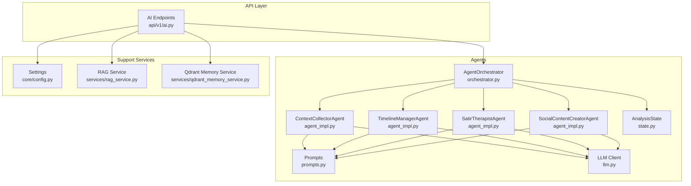
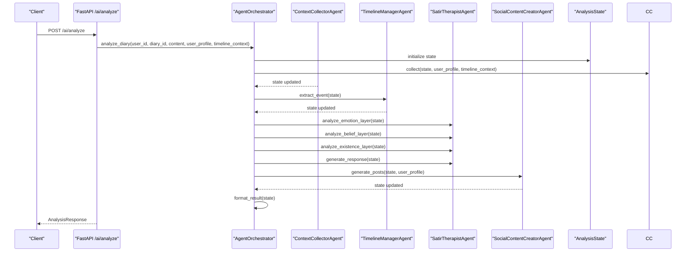
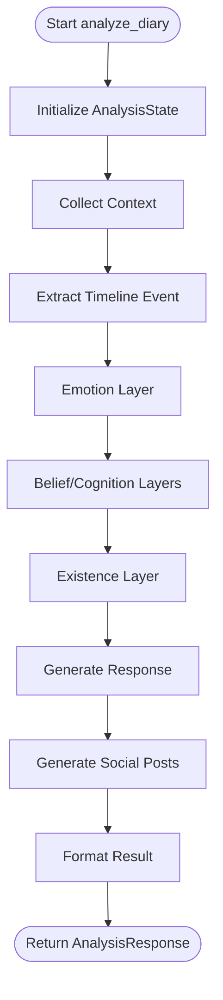
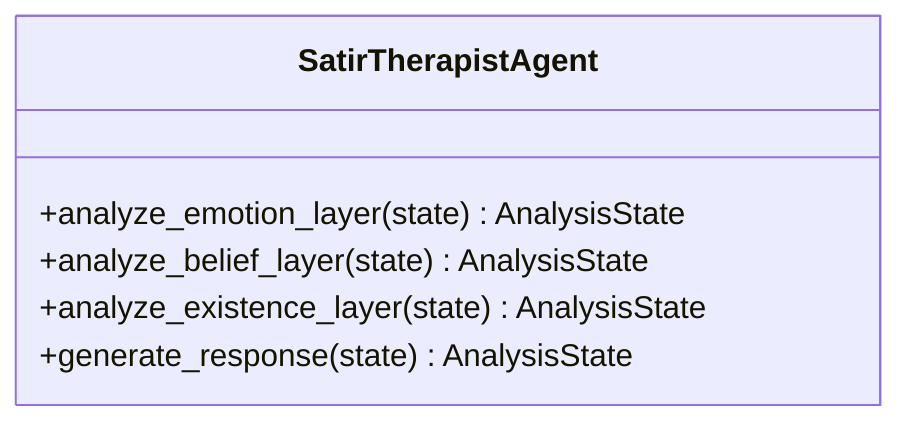
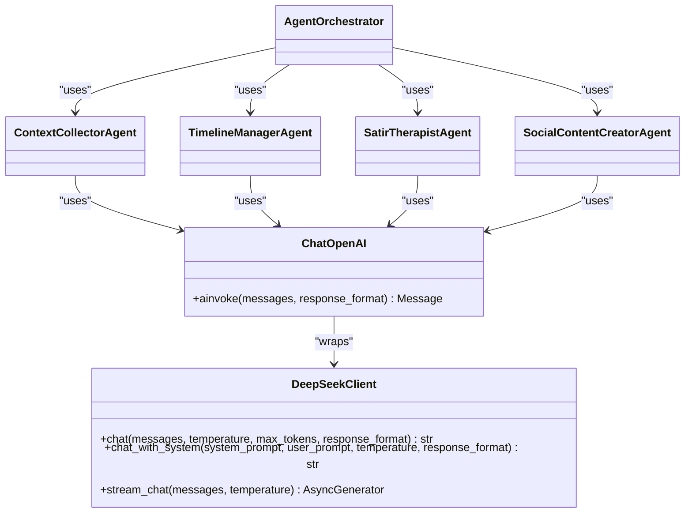
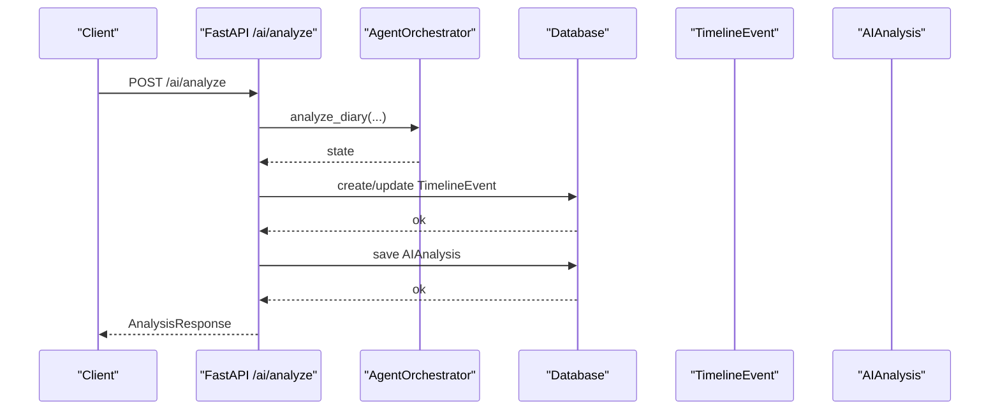
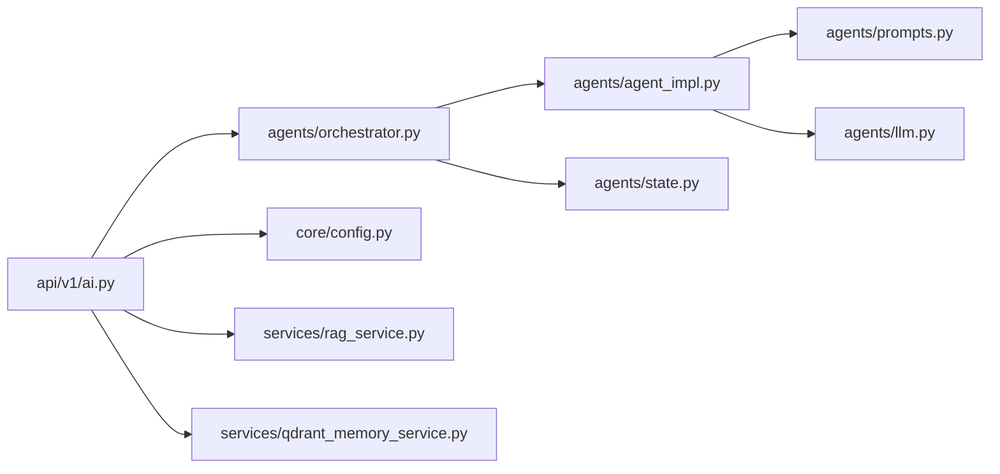

# Multi-Agent System

<cite>
**Referenced Files in This Document**
- [backend/app/agents/__init__.py](file://backend/app/agents/__init__.py)
- [backend/app/agents/orchestrator.py](file://backend/app/agents/orchestrator.py)
- [backend/app/agents/agent_impl.py](file://backend/app/agents/agent_impl.py)
- [backend/app/agents/state.py](file://backend/app/agents/state.py)
- [backend/app/agents/prompts.py](file://backend/app/agents/prompts.py)
- [backend/app/agents/llm.py](file://backend/app/agents/llm.py)
- [backend/app/api/v1/ai.py](file://backend/app/api/v1/ai.py)
- [backend/test_ai_agents.py](file://backend/test_ai_agents.py)
- [backend/app/core/config.py](file://backend/app/core/config.py)
- [backend/app/services/qdrant_memory_service.py](file://backend/app/services/qdrant_memory_service.py)
- [backend/app/services/rag_service.py](file://backend/app/services/rag_service.py)
- [backend/app/schemas/ai.py](file://backend/app/schemas/ai.py)
</cite>

## Table of Contents
1. [Introduction](#introduction)
2. [Project Structure](#project-structure)
3. [Core Components](#core-components)
4. [Architecture Overview](#architecture-overview)
5. [Detailed Component Analysis](#detailed-component-analysis)
6. [Dependency Analysis](#dependency-analysis)
7. [Performance Considerations](#performance-considerations)
8. [Troubleshooting Guide](#troubleshooting-guide)
9. [Conclusion](#conclusion)
10. [Appendices](#appendices)

## Introduction
This document describes the multi-agent system architecture in the project, focusing on the AI agent orchestration that coordinates psychological analysis, content generation, and memory-related tasks. It explains agent specialization, inter-agent communication protocols, state management, lifecycle management, error handling, fallback strategies, and configuration/resource allocation. The system integrates FastAPI endpoints, a lightweight LLM client, and optional memory services for retrieval-augmented analysis.

## Project Structure
The multi-agent system resides under backend/app/agents and is wired into FastAPI endpoints under backend/app/api/v1. Supporting services include a simplified LLM client, configuration, and optional memory/RAG services.

**Diagram sources**
- [backend/app/agents/orchestrator.py:18-176](file://backend/app/agents/orchestrator.py#L18-L176)
- [backend/app/agents/agent_impl.py:92-484](file://backend/app/agents/agent_impl.py#L92-L484)
- [backend/app/agents/state.py:10-45](file://backend/app/agents/state.py#L10-L45)
- [backend/app/agents/prompts.py:7-244](file://backend/app/agents/prompts.py#L7-L244)
- [backend/app/agents/llm.py:13-220](file://backend/app/agents/llm.py#L13-L220)
- [backend/app/api/v1/ai.py:1-902](file://backend/app/api/v1/ai.py#L1-L902)
- [backend/app/core/config.py:10-105](file://backend/app/core/config.py#L10-L105)
- [backend/app/services/rag_service.py:147-360](file://backend/app/services/rag_service.py#L147-L360)
- [backend/app/services/qdrant_memory_service.py:45-190](file://backend/app/services/qdrant_memory_service.py#L45-L190)

**Section sources**
- [backend/app/agents/__init__.py:1-8](file://backend/app/agents/__init__.py#L1-L8)
- [backend/app/agents/orchestrator.py:18-176](file://backend/app/agents/orchestrator.py#L18-L176)
- [backend/app/agents/agent_impl.py:92-484](file://backend/app/agents/agent_impl.py#L92-L484)
- [backend/app/agents/state.py:10-45](file://backend/app/agents/state.py#L10-L45)
- [backend/app/agents/prompts.py:7-244](file://backend/app/agents/prompts.py#L7-L244)
- [backend/app/agents/llm.py:13-220](file://backend/app/agents/llm.py#L13-L220)
- [backend/app/api/v1/ai.py:1-902](file://backend/app/api/v1/ai.py#L1-L902)
- [backend/app/core/config.py:10-105](file://backend/app/core/config.py#L10-L105)
- [backend/app/services/rag_service.py:147-360](file://backend/app/services/rag_service.py#L147-L360)
- [backend/app/services/qdrant_memory_service.py:45-190](file://backend/app/services/qdrant_memory_service.py#L45-L190)

## Core Components
- AgentOrchestrator: Central coordinator that sequences agent steps and manages shared state.
- Specialized Agents:
  - ContextCollectorAgent: Gathers user profile and timeline context.
  - TimelineManagerAgent: Extracts structured timeline events from diary content.
  - SatirTherapistAgent: Performs five-layer psychological analysis and generates a therapeutic response.
  - SocialContentCreatorAgent: Generates multiple versions of social media posts.
- State Management: Typed dictionary encapsulating input, intermediate, and output data plus metadata.
- Prompts: Task-specific prompt templates for each agent.
- LLM Client: Thin wrapper around an external provider with compatibility for LangChain-like invocation.
- API Integration: FastAPI endpoints trigger orchestration, persist results, and optionally integrate memory/RAG.

**Section sources**
- [backend/app/agents/orchestrator.py:18-176](file://backend/app/agents/orchestrator.py#L18-L176)
- [backend/app/agents/agent_impl.py:92-484](file://backend/app/agents/agent_impl.py#L92-L484)
- [backend/app/agents/state.py:10-45](file://backend/app/agents/state.py#L10-L45)
- [backend/app/agents/prompts.py:7-244](file://backend/app/agents/prompts.py#L7-L244)
- [backend/app/agents/llm.py:13-220](file://backend/app/agents/llm.py#L13-L220)
- [backend/app/api/v1/ai.py:406-639](file://backend/app/api/v1/ai.py#L406-L639)

## Architecture Overview
The orchestration follows a deterministic pipeline:
1. Initialize AnalysisState with inputs.
2. Context collection.
3. Timeline event extraction.
4. Five-layer psychological analysis (emotion → cognition/beliefs → existence).
5. Therapeutic response generation.
6. Social content generation.
7. Format and return results, persisting timeline events and analysis artifacts.

**Diagram sources**
- [backend/app/api/v1/ai.py:406-639](file://backend/app/api/v1/ai.py#L406-L639)
- [backend/app/agents/orchestrator.py:27-131](file://backend/app/agents/orchestrator.py#L27-L131)
- [backend/app/agents/agent_impl.py:100-483](file://backend/app/agents/agent_impl.py#L100-L483)
- [backend/app/agents/state.py:10-45](file://backend/app/agents/state.py#L10-L45)

## Detailed Component Analysis

### AgentOrchestrator
- Responsibilities:
  - Initializes AnalysisState.
  - Coordinates agent execution in strict order.
  - Aggregates results and formats output.
  - Tracks processing time and errors.
- Inter-Agent Protocol:
  - Passes a shared AnalysisState across agents.
  - Uses a current_step marker to reflect progress.
  - Records per-agent runs with timing and status.
- Error Handling:
  - Catches exceptions during orchestration and populates error field.
  - Returns partial results with error metadata.

**Diagram sources**
- [backend/app/agents/orchestrator.py:27-131](file://backend/app/agents/orchestrator.py#L27-L131)

**Section sources**
- [backend/app/agents/orchestrator.py:18-176](file://backend/app/agents/orchestrator.py#L18-L176)

### ContextCollectorAgent
- Purpose: Build contextual understanding from user profile and timeline context.
- Inputs: user_profile, timeline_context, diary_content.
- Outputs: Updates AnalysisState with user_profile and timeline_context.
- Robustness: Parses JSON payloads robustly; logs and continues on failure.

**Section sources**
- [backend/app/agents/agent_impl.py:92-142](file://backend/app/agents/agent_impl.py#L92-L142)
- [backend/app/agents/prompts.py:7-28](file://backend/app/agents/prompts.py#L7-L28)

### TimelineManagerAgent
- Purpose: Extract a structured timeline event from diary content.
- Outputs: timeline_event with summary, emotion tag, importance, type, and related entities.
- Fallback: On error, creates a default minimal event to keep the pipeline moving.

**Section sources**
- [backend/app/agents/agent_impl.py:144-203](file://backend/app/agents/agent_impl.py#L144-L203)
- [backend/app/agents/prompts.py:31-57](file://backend/app/agents/prompts.py#L31-L57)

### SatirTherapistAgent
- Purpose: Psychological analysis via five layers (behavior → emotion → cognition → beliefs → core self).
- Sub-agents:
  - analyze_emotion_layer: Surface vs underlying emotions.
  - analyze_belief_layer: Irrational beliefs and automatic thoughts; core beliefs and life rules.
  - analyze_existence_layer: Deeper yearnings and insights.
  - generate_response: Therapeutic reply synthesized from all layers.
- Fallbacks: On error, writes safe defaults into state to preserve downstream steps.

**Diagram sources**
- [backend/app/agents/agent_impl.py:205-394](file://backend/app/agents/agent_impl.py#L205-L394)

**Section sources**
- [backend/app/agents/agent_impl.py:205-394](file://backend/app/agents/agent_impl.py#L205-L394)
- [backend/app/agents/prompts.py:60-163](file://backend/app/agents/prompts.py#L60-L163)

### SocialContentCreatorAgent
- Purpose: Generate multiple variants of social media posts based on user style and diary content.
- Fallback: On parsing failures, produces two simple post variants.

**Section sources**
- [backend/app/agents/agent_impl.py:396-484](file://backend/app/agents/agent_impl.py#L396-L484)
- [backend/app/agents/prompts.py:166-208](file://backend/app/agents/prompts.py#L166-L208)

### State Management (AnalysisState)
- Typed dictionary containing:
  - Inputs: user_id, diary_id, diary_content, diary_date.
  - Context: user_profile, timeline_context, related_memories.
  - Analysis layers: behavior_layer, emotion_layer, cognitive_layer, belief_layer, core_self_layer.
  - Derived: timeline_event, social_posts, therapeutic_response.
  - Metadata: processing_time, error, current_step, agent_runs.
- Used as the single source of truth passed between agents.

**Section sources**
- [backend/app/agents/state.py:10-45](file://backend/app/agents/state.py#L10-L45)

### Prompts
- ContextCollectorAgent prompt template.
- TimelineExtractor prompt template.
- Satir prompts for emotion, beliefs/cognition, existence, and responder.
- SocialContentCreator prompt template.
- System-level prompts for analysts and social writers.

**Section sources**
- [backend/app/agents/prompts.py:7-244](file://backend/app/agents/prompts.py#L7-L244)

### LLM Client and Agent Implementation Patterns
- LLM abstraction:
  - DeepSeekClient handles HTTP calls to the provider.
  - ChatOpenAI-compatible wrapper supports ainvoke with system/user messages and optional JSON response format.
  - Factory functions return specialized LLM instances (analytical vs creative vs general).
- Agent patterns:
  - Each agent encapsulates its own LLM instance(s) and prompt usage.
  - Shared state is mutated in-place; agents return the state for chaining.
  - Robust JSON parsing helpers handle varied LLM outputs.

**Diagram sources**
- [backend/app/agents/llm.py:13-220](file://backend/app/agents/llm.py#L13-L220)
- [backend/app/agents/orchestrator.py:9-25](file://backend/app/agents/orchestrator.py#L9-L25)
- [backend/app/agents/agent_impl.py:92-484](file://backend/app/agents/agent_impl.py#L92-L484)

**Section sources**
- [backend/app/agents/llm.py:13-220](file://backend/app/agents/llm.py#L13-L220)
- [backend/app/agents/agent_impl.py:25-90](file://backend/app/agents/agent_impl.py#L25-L90)

### API Integration and Persistence
- FastAPI endpoints:
  - /ai/analyze: Orchestrates multi-step analysis, aggregates results, persists timeline events and AI analysis artifacts.
  - /ai/comprehensive-analysis: Uses RAG to synthesize user-level insights.
  - Additional endpoints for daily guidance, title suggestions, and social samples.
- Persistence:
  - Creates or updates TimelineEvent linked to the anchor or most recent diary.
  - Saves AnalysisResponse into AIAnalysis for later retrieval.

**Diagram sources**
- [backend/app/api/v1/ai.py:406-639](file://backend/app/api/v1/ai.py#L406-L639)

**Section sources**
- [backend/app/api/v1/ai.py:406-639](file://backend/app/api/v1/ai.py#L406-L639)
- [backend/app/schemas/ai.py:74-83](file://backend/app/schemas/ai.py#L74-L83)

### Memory and Retrieval (Optional)
- Qdrant Memory Service: Syncs user diaries to a vector collection and performs semantic search.
- RAG Service: Builds chunks, computes BM25/recency/importance/emotion/repetition scores, and deduplicates evidence.

**Section sources**
- [backend/app/services/qdrant_memory_service.py:45-190](file://backend/app/services/qdrant_memory_service.py#L45-L190)
- [backend/app/services/rag_service.py:147-360](file://backend/app/services/rag_service.py#L147-L360)

## Dependency Analysis
- Internal dependencies:
  - orchestrator depends on agent_impl and state.
  - agent_impl depends on prompts and llm.
  - api/v1/ai depends on orchestrator and services.
- External dependencies:
  - httpx for asynchronous HTTP calls.
  - SQLAlchemy for persistence.
  - Optional: Qdrant and RAG services for advanced retrieval.

**Diagram sources**
- [backend/app/api/v1/ai.py:1-902](file://backend/app/api/v1/ai.py#L1-L902)
- [backend/app/agents/orchestrator.py:1-176](file://backend/app/agents/orchestrator.py#L1-L176)
- [backend/app/agents/agent_impl.py:1-484](file://backend/app/agents/agent_impl.py#L1-L484)
- [backend/app/agents/prompts.py:1-244](file://backend/app/agents/prompts.py#L1-L244)
- [backend/app/agents/llm.py:1-220](file://backend/app/agents/llm.py#L1-L220)
- [backend/app/agents/state.py:1-45](file://backend/app/agents/state.py#L1-L45)
- [backend/app/core/config.py:1-105](file://backend/app/core/config.py#L1-L105)
- [backend/app/services/rag_service.py:1-360](file://backend/app/services/rag_service.py#L1-L360)
- [backend/app/services/qdrant_memory_service.py:1-190](file://backend/app/services/qdrant_memory_service.py#L1-L190)

**Section sources**
- [backend/app/api/v1/ai.py:1-902](file://backend/app/api/v1/ai.py#L1-L902)
- [backend/app/agents/orchestrator.py:1-176](file://backend/app/agents/orchestrator.py#L1-L176)
- [backend/app/agents/agent_impl.py:1-484](file://backend/app/agents/agent_impl.py#L1-L484)
- [backend/app/agents/prompts.py:1-244](file://backend/app/agents/prompts.py#L1-L244)
- [backend/app/agents/llm.py:1-220](file://backend/app/agents/llm.py#L1-L220)
- [backend/app/agents/state.py:1-45](file://backend/app/agents/state.py#L1-L45)
- [backend/app/core/config.py:1-105](file://backend/app/core/config.py#L1-L105)
- [backend/app/services/rag_service.py:1-360](file://backend/app/services/rag_service.py#L1-L360)
- [backend/app/services/qdrant_memory_service.py:1-190](file://backend/app/services/qdrant_memory_service.py#L1-L190)

## Performance Considerations
- Asynchronous LLM calls: All agents use async invocations to minimize latency.
- Lightweight LLM client: Avoids heavy frameworks; uses streaming only when needed.
- JSON parsing resilience: Multiple strategies to extract structured outputs from LLM responses.
- RAG scoring: Uses BM25, recency, importance, emotion intensity, repetition, and entity matching to rank evidence efficiently.
- Vector indexing: Qdrant service ensures scalable retrieval with cosine distance and payload filtering.

[No sources needed since this section provides general guidance]

## Troubleshooting Guide
- LLM output parsing:
  - Use the robust JSON parsing helpers to handle raw text, fenced code blocks, and incremental decoding.
- Agent-level failures:
  - Each agent records run metadata (agent_code, agent_name, model, step, status, duration, error).
  - On error, agents write safe defaults into state to keep the pipeline resilient.
- API-level failures:
  - Endpoints catch exceptions and return HTTP 500 with error details.
  - Persistence warnings are included in metadata when timeline or analysis save fails.
- Configuration:
  - Ensure DEEPSEEK_API_KEY and DEEPSEEK_BASE_URL are configured.
  - For memory services, configure Qdrant URL, API key, and collection name.

**Section sources**
- [backend/app/agents/agent_impl.py:25-90](file://backend/app/agents/agent_impl.py#L25-L90)
- [backend/app/agents/orchestrator.py:121-131](file://backend/app/agents/orchestrator.py#L121-L131)
- [backend/app/api/v1/ai.py:534-540](file://backend/app/api/v1/ai.py#L534-L540)
- [backend/app/core/config.py:62-90](file://backend/app/core/config.py#L62-L90)

## Conclusion
The multi-agent system provides a modular, resilient orchestration framework for psychological analysis, timeline structuring, therapeutic synthesis, and social content generation. Its state-driven design, robust error handling, and optional memory/RAG integrations enable scalable and maintainable AI-powered insights.

[No sources needed since this section summarizes without analyzing specific files]

## Appendices

### Agent Lifecycle and Coordination Examples
- Lifecycle:
  - Initialization: AnalysisState constructed with inputs and empty outputs.
  - Execution: Sequential agent steps mutate state; each step records run metrics.
  - Finalization: Results formatted and returned; optional persistence.
- Coordination:
  - Shared state ensures data locality and reduces duplication.
  - Strict ordering guarantees dependencies between psychological layers.

**Section sources**
- [backend/app/agents/orchestrator.py:50-119](file://backend/app/agents/orchestrator.py#L50-L119)
- [backend/app/agents/state.py:10-45](file://backend/app/agents/state.py#L10-L45)

### Decision-Making and Fallback Patterns
- Decision-making:
  - Each agent focuses on a distinct subtask with explicit prompts.
  - JSON response format requests improve reliability.
- Fallbacks:
  - TimelineManagerAgent and SocialContentCreatorAgent fall back to safe defaults on errors.
  - SatirTherapistAgent writes safe defaults for each layer to preserve downstream synthesis.

**Section sources**
- [backend/app/agents/agent_impl.py:191-202](file://backend/app/agents/agent_impl.py#L191-L202)
- [backend/app/agents/agent_impl.py:465-482](file://backend/app/agents/agent_impl.py#L465-L482)
- [backend/app/agents/agent_impl.py:243-251](file://backend/app/agents/agent_impl.py#L243-L251)
- [backend/app/agents/agent_impl.py:293-297](file://backend/app/agents/agent_impl.py#L293-L297)
- [backend/app/agents/agent_impl.py:337-345](file://backend/app/agents/agent_impl.py#L337-L345)
- [backend/app/agents/agent_impl.py:388-391](file://backend/app/agents/agent_impl.py#L388-L391)

### Configuration and Resource Allocation
- Configuration:
  - Settings include API keys, base URLs, CORS origins, database URL, JWT, and Qdrant parameters.
- Resource allocation:
  - LLM factory functions control temperature and model selection per agent specialization.
  - Optional memory services scale horizontally with vector dimension and collection tuning.

**Section sources**
- [backend/app/core/config.py:10-105](file://backend/app/core/config.py#L10-L105)
- [backend/app/agents/llm.py:202-220](file://backend/app/agents/llm.py#L202-L220)
- [backend/app/services/qdrant_memory_service.py:45-54](file://backend/app/services/qdrant_memory_service.py#L45-L54)

### Testing the Agent System
- Test script demonstrates end-to-end orchestration with configurable user profile, timeline context, and diary content.
- Provides interactive confirmation and prints structured results.

**Section sources**
- [backend/test_ai_agents.py:16-127](file://backend/test_ai_agents.py#L16-L127)