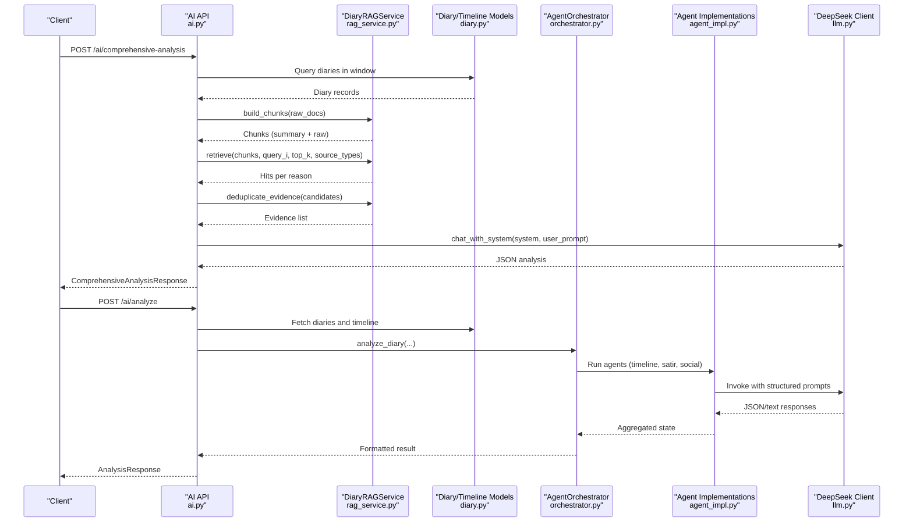
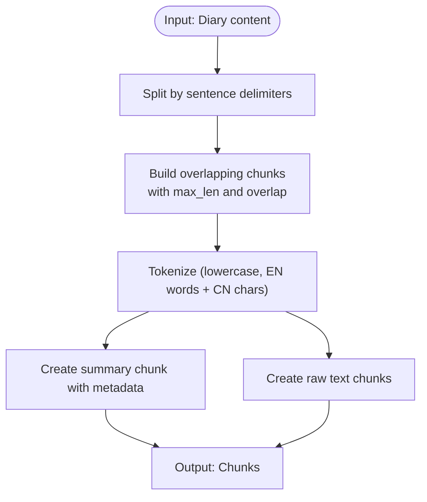
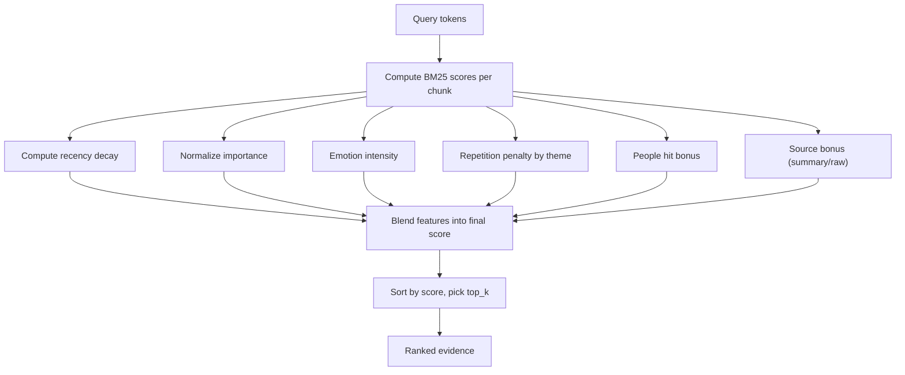
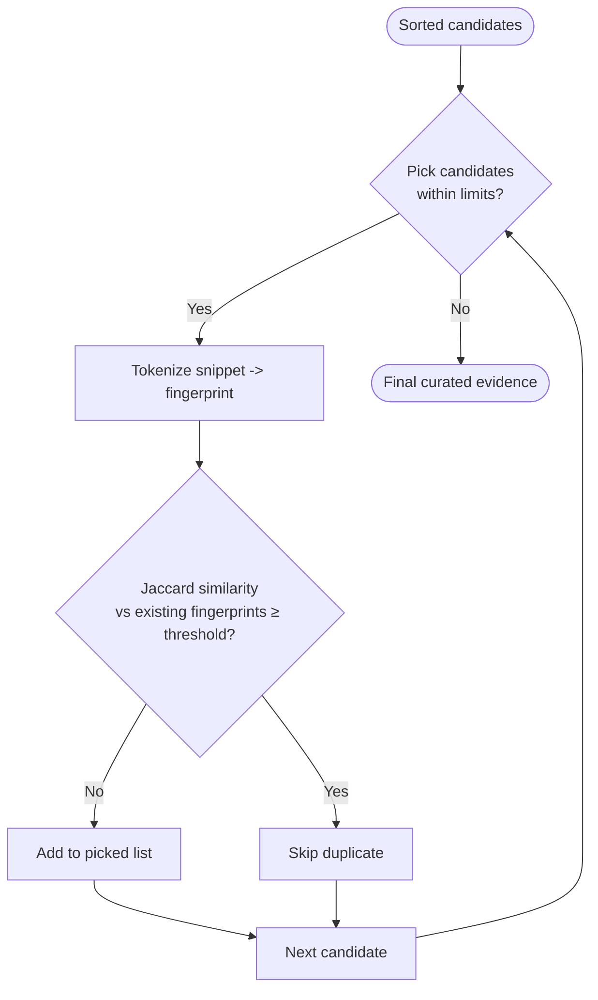
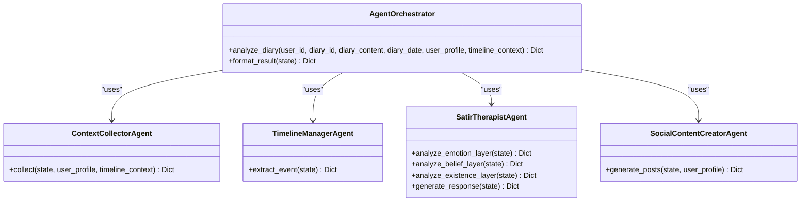
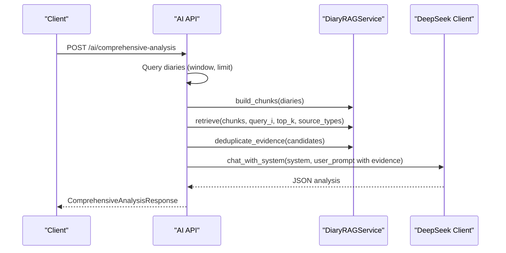
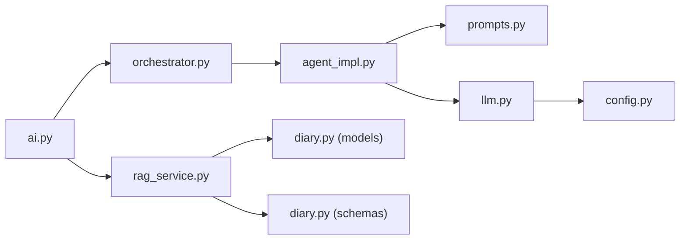

# RAG Implementation

<cite>
**Referenced Files in This Document**
- [rag_service.py](file://backend/app/services/rag_service.py)
- [prompts.py](file://backend/app/agents/prompts.py)
- [diary.py](file://backend/app/models/diary.py)
- [diary.py (schema)](file://backend/app/schemas/diary.py)
- [ai.py](file://backend/app/api/v1/ai.py)
- [orchestrator.py](file://backend/app/agents/orchestrator.py)
- [agent_impl.py](file://backend/app/agents/agent_impl.py)
- [llm.py](file://backend/app/agents/llm.py)
- [config.py](file://backend/app/core/config.py)
- [PRD-产品需求文档.md](file://docs/PRD-产品需求文档.md)
- [test_ai_agents.py](file://backend/test_ai_agents.py)
</cite>

## Table of Contents
1. [Introduction](#introduction)
2. [Project Structure](#project-structure)
3. [Core Components](#core-components)
4. [Architecture Overview](#architecture-overview)
5. [Detailed Component Analysis](#detailed-component-analysis)
6. [Dependency Analysis](#dependency-analysis)
7. [Performance Considerations](#performance-considerations)
8. [Troubleshooting Guide](#troubleshooting-guide)
9. [Conclusion](#conclusion)
10. [Appendices](#appendices)

## Introduction
This document explains the Retrieval-Augmented Generation (RAG) implementation in 映记 (Yinji), focusing on the custom BM25-based diary chunking and evidence deduplication pipeline. It details the diary chunking strategy, lexical similarity scoring, hybrid ranking, prompt engineering architecture for psychological analysis and content generation, evidence aggregation, relevance scoring, and context window management. It also documents the end-to-end RAG pipeline from user query through retrieval to final response generation, along with examples of prompt templates, query processing workflows, performance optimization techniques, error handling, fallback mechanisms, and quality assessment of retrieved results.

## Project Structure
The RAG implementation spans several modules:
- Services: Diary chunking, BM25 retrieval, and evidence deduplication live in the RAG service.
- Agents: Psychological analysis and content generation are orchestrated via specialized agents and prompts.
- API: Endpoints orchestrate RAG-based analysis and integrate with the agent system.
- Models/Schemas: Define data structures for diaries and timeline events used by RAG.
- Configuration: LLM provider settings and Qdrant vector settings are centralized.

```mermaid
graph TB
subgraph "API Layer"
AI["AI API Endpoints<br/>ai.py"]
end
subgraph "Services"
RAG["DiaryRAGService<br/>rag_service.py"]
end
subgraph "Agents"
Orchestrator["AgentOrchestrator<br/>orchestrator.py"]
Agents["Agent Implementations<br/>agent_impl.py"]
Prompts["Prompt Templates<br/>prompts.py"]
end
subgraph "Models & Schemas"
Models["Diary/Timeline Models<br/>diary.py"]
Schemas["Pydantic Schemas<br/>diary.py (schema)"]
end
subgraph "LLM Integration"
LLM["DeepSeek Client<br/>llm.py"]
CFG["Settings<br/>config.py"]
end
AI --> RAG
AI --> Orchestrator
Orchestrator --> Agents
Agents --> Prompts
Agents --> LLM
LLM --> CFG
RAG --> Models
RAG --> Schemas
```

**Diagram sources**
- [ai.py:267-403](file://backend/app/api/v1/ai.py#L267-L403)
- [rag_service.py:147-360](file://backend/app/services/rag_service.py#L147-L360)
- [orchestrator.py:18-176](file://backend/app/agents/orchestrator.py#L18-L176)
- [agent_impl.py:1-484](file://backend/app/agents/agent_impl.py#L1-L484)
- [prompts.py:1-244](file://backend/app/agents/prompts.py#L1-L244)
- [llm.py:13-220](file://backend/app/agents/llm.py#L13-L220)
- [config.py:10-105](file://backend/app/core/config.py#L10-L105)
- [diary.py:29-186](file://backend/app/models/diary.py#L29-L186)
- [diary.py (schema):9-101](file://backend/app/schemas/diary.py#L9-L101)

**Section sources**
- [ai.py:267-403](file://backend/app/api/v1/ai.py#L267-L403)
- [rag_service.py:147-360](file://backend/app/services/rag_service.py#L147-L360)
- [orchestrator.py:18-176](file://backend/app/agents/orchestrator.py#L18-L176)
- [agent_impl.py:1-484](file://backend/app/agents/agent_impl.py#L1-L484)
- [prompts.py:1-244](file://backend/app/agents/prompts.py#L1-L244)
- [llm.py:13-220](file://backend/app/agents/llm.py#L13-L220)
- [config.py:10-105](file://backend/app/core/config.py#L10-L105)
- [diary.py:29-186](file://backend/app/models/diary.py#L29-L186)
- [diary.py (schema):9-101](file://backend/app/schemas/diary.py#L9-L101)

## Core Components
- DiaryRAGService: Implements chunk building, BM25 retrieval, hybrid scoring, and evidence deduplication.
- Agent Orchestration: Coordinates specialized agents for psychological analysis and content generation.
- Prompt Templates: Structured prompts for context collection, timeline extraction, Satir analysis, and social content creation.
- API Endpoints: Expose RAG-based comprehensive analysis and integrate with the agent system.
- Data Models: Define diary and timeline event structures used by RAG and agents.

Key capabilities:
- Diary chunking with sentence-aware splitting and tokenization.
- BM25 lexical scoring with term frequency normalization and inverse document frequency weighting.
- Hybrid scoring combining recency, importance, emotion intensity, repetition penalty, people hit, and source bonus.
- Evidence deduplication using Jaccard similarity on token sets.
- Context window management via configurable windows and limits.

**Section sources**
- [rag_service.py:147-360](file://backend/app/services/rag_service.py#L147-L360)
- [prompts.py:1-244](file://backend/app/agents/prompts.py#L1-L244)
- [ai.py:267-403](file://backend/app/api/v1/ai.py#L267-L403)
- [diary.py:29-186](file://backend/app/models/diary.py#L29-L186)
- [diary.py (schema):9-101](file://backend/app/schemas/diary.py#L9-L101)

## Architecture Overview
The RAG pipeline integrates lexical retrieval with psychological analysis and content generation:



**Diagram sources**
- [ai.py:267-403](file://backend/app/api/v1/ai.py#L267-L403)
- [rag_service.py:147-360](file://backend/app/services/rag_service.py#L147-L360)
- [diary.py:29-186](file://backend/app/models/diary.py#L29-L186)
- [orchestrator.py:18-176](file://backend/app/agents/orchestrator.py#L18-L176)
- [agent_impl.py:1-484](file://backend/app/agents/agent_impl.py#L1-L484)
- [llm.py:13-220](file://backend/app/agents/llm.py#L13-L220)

## Detailed Component Analysis

### Diary Chunking Strategy
- Sentence-aware segmentation using punctuation-aware splits to respect natural boundaries.
- Overlapping windows to preserve context across chunk boundaries.
- Tokenization supports both Chinese characters and English tokens, lowercased for robust matching.
- Two chunk types:
  - Summary chunks derived from daily summaries enriched with metadata (date, title, emotion tags, importance).
  - Raw chunks from segmented diary content, preserving original text while tokenizing for BM25.



**Diagram sources**
- [rag_service.py:38-62](file://backend/app/services/rag_service.py#L38-L62)
- [rag_service.py:31-35](file://backend/app/services/rag_service.py#L31-L35)
- [rag_service.py:105-124](file://backend/app/services/rag_service.py#L105-L124)
- [rag_service.py:147-208](file://backend/app/services/rag_service.py#L147-L208)

**Section sources**
- [rag_service.py:31-62](file://backend/app/services/rag_service.py#L31-L62)
- [rag_service.py:105-124](file://backend/app/services/rag_service.py#L105-L124)
- [rag_service.py:147-208](file://backend/app/services/rag_service.py#L147-L208)

### BM25 Lexical Retrieval and Hybrid Scoring
- Query tokenization mirrors chunk tokenization.
- BM25 computation:
  - IDF per term across chunks.
  - TF-normalized by document length using the BM25(k1, b) formulation.
- Additional features blended into a composite score:
  - Recency decay based on diary date.
  - Normalized importance score.
  - Emotion intensity proxy.
  - Repetition penalty per theme-key group.
  - People hit bonus if people entities appear in query.
  - Source bonus for summary chunks.
- Final score normalized and weighted across features.



**Diagram sources**
- [rag_service.py:210-317](file://backend/app/services/rag_service.py#L210-L317)
- [rag_service.py:137-144](file://backend/app/services/rag_service.py#L137-L144)
- [rag_service.py:241-297](file://backend/app/services/rag_service.py#L241-L297)

**Section sources**
- [rag_service.py:210-317](file://backend/app/services/rag_service.py#L210-L317)
- [rag_service.py:137-144](file://backend/app/services/rag_service.py#L137-L144)

### Evidence Deduplication and Quality Control
- Iterates candidates by descending score.
- Enforces limits:
  - Maximum total picks.
  - Maximum per-diary and per-reason caps.
- Uses Jaccard similarity on token sets to suppress near-duplicate snippets.
- Produces a curated evidence list suitable for downstream LLM synthesis.



**Diagram sources**
- [rag_service.py:319-356](file://backend/app/services/rag_service.py#L319-L356)
- [rag_service.py:137-144](file://backend/app/services/rag_service.py#L137-L144)

**Section sources**
- [rag_service.py:319-356](file://backend/app/services/rag_service.py#L319-L356)

### Prompt Engineering Architecture
The system uses specialized templates for:
- Context Collector: Aggregates user profile and timeline context.
- Timeline Extractor: Extracts structured events from diary content.
- Satir Analyst: Five-layer psychological analysis (emotion, cognition, belief, existence).
- Social Content Creator: Generates multiple versions of social posts aligned with user style.



**Diagram sources**
- [orchestrator.py:18-176](file://backend/app/agents/orchestrator.py#L18-L176)
- [agent_impl.py:92-484](file://backend/app/agents/agent_impl.py#L92-L484)
- [prompts.py:1-244](file://backend/app/agents/prompts.py#L1-L244)

**Section sources**
- [prompts.py:9-28](file://backend/app/agents/prompts.py#L9-L28)
- [prompts.py:33-57](file://backend/app/agents/prompts.py#L33-L57)
- [prompts.py:62-163](file://backend/app/agents/prompts.py#L62-L163)
- [prompts.py:168-208](file://backend/app/agents/prompts.py#L168-L208)
- [prompts.py:213-243](file://backend/app/agents/prompts.py#L213-L243)
- [agent_impl.py:92-484](file://backend/app/agents/agent_impl.py#L92-L484)
- [orchestrator.py:18-176](file://backend/app/agents/orchestrator.py#L18-L176)

### API Workflow: Comprehensive RAG Analysis
- Endpoint: POST /ai/comprehensive-analysis
- Steps:
  - Query diaries within a configurable window.
  - Build chunks (summary + raw).
  - Issue multiple domain-specific queries (emotional trends, continuity, turning points, growth cues, relationships).
  - Retrieve hits for each query, mixing raw and summary sources.
  - Deduplicate evidence by score, per-diary, per-reason, and token-set similarity.
  - Construct a system prompt and user prompt with curated evidence.
  - Call LLM to produce a structured JSON response.
  - Return evidence and metadata for transparency.



**Diagram sources**
- [ai.py:267-403](file://backend/app/api/v1/ai.py#L267-L403)
- [rag_service.py:147-360](file://backend/app/services/rag_service.py#L147-L360)
- [llm.py:68-93](file://backend/app/agents/llm.py#L68-L93)

**Section sources**
- [ai.py:267-403](file://backend/app/api/v1/ai.py#L267-L403)

### Context Window Management
- Analysis windows are controlled by request parameters (window_days, max_diaries).
- Diaries are sorted chronologically to maintain temporal order.
- Timeline context is fetched within the same window to enrich prompts and agent reasoning.

**Section sources**
- [ai.py:267-403](file://backend/app/api/v1/ai.py#L267-L403)
- [diary.py (schema):9-14](file://backend/app/schemas/diary.py#L9-L14)

### Data Models and Schemas Supporting RAG
- Diary model stores content, dates, emotion tags, importance, and related metadata used during chunking and scoring.
- TimelineEvent model provides structured events extracted from diaries for context and potential future vector retrieval.
- Pydantic schemas define request/response shapes for API endpoints.

**Section sources**
- [diary.py:29-61](file://backend/app/models/diary.py#L29-L61)
- [diary.py:67-99](file://backend/app/models/diary.py#L67-L99)
- [diary.py (schema):9-101](file://backend/app/schemas/diary.py#L9-L101)

## Dependency Analysis
- API depends on RAG service for chunking, retrieval, and deduplication.
- API also coordinates agent orchestration for psychological analysis and content generation.
- Agents depend on prompt templates and the LLM client.
- LLM client depends on configuration settings for provider credentials and endpoints.
- RAG service relies on diary models and schemas for input data.



**Diagram sources**
- [ai.py:267-403](file://backend/app/api/v1/ai.py#L267-L403)
- [rag_service.py:147-360](file://backend/app/services/rag_service.py#L147-L360)
- [orchestrator.py:18-176](file://backend/app/agents/orchestrator.py#L18-L176)
- [agent_impl.py:1-484](file://backend/app/agents/agent_impl.py#L1-L484)
- [prompts.py:1-244](file://backend/app/agents/prompts.py#L1-L244)
- [llm.py:13-220](file://backend/app/agents/llm.py#L13-L220)
- [config.py:10-105](file://backend/app/core/config.py#L10-L105)
- [diary.py:29-186](file://backend/app/models/diary.py#L29-L186)
- [diary.py (schema):9-101](file://backend/app/schemas/diary.py#L9-L101)

**Section sources**
- [ai.py:267-403](file://backend/app/api/v1/ai.py#L267-L403)
- [rag_service.py:147-360](file://backend/app/services/rag_service.py#L147-L360)
- [orchestrator.py:18-176](file://backend/app/agents/orchestrator.py#L18-L176)
- [agent_impl.py:1-484](file://backend/app/agents/agent_impl.py#L1-L484)
- [prompts.py:1-244](file://backend/app/agents/prompts.py#L1-L244)
- [llm.py:13-220](file://backend/app/agents/llm.py#L13-L220)
- [config.py:10-105](file://backend/app/core/config.py#L10-L105)
- [diary.py:29-186](file://backend/app/models/diary.py#L29-L186)
- [diary.py (schema):9-101](file://backend/app/schemas/diary.py#L9-L101)

## Performance Considerations
- Chunking:
  - Tune max_len and overlap to balance recall and context retention.
  - Prefer sentence-aware splitting to avoid fragmenting meaning.
- BM25:
  - Use appropriate k1 and b parameters; current defaults are set in code.
  - Normalize scores to reduce variance across documents.
- Hybrid scoring:
  - Adjust feature weights to emphasize domain-relevant signals (e.g., recency for recent emotional trends).
- Deduplication:
  - Calibrate similarity threshold to balance diversity vs. redundancy.
  - Limit per-diary and per-reason counts to prevent bias toward single sources.
- API:
  - Cap window_days and max_diaries to control latency and cost.
  - Stream LLM responses when supported by provider for improved UX.

[No sources needed since this section provides general guidance]

## Troubleshooting Guide
- JSON parsing failures:
  - The API includes a robust parser that attempts multiple strategies (direct JSON, fenced code blocks, incremental decode).
  - If parsing fails, endpoints return HTTP 500 with a clear error message.
- Empty or insufficient evidence:
  - The comprehensive analysis endpoint falls back to a generic query when no candidates are found after deduplication.
- Agent errors:
  - Agent orchestrator captures exceptions and populates error metadata; partial results may still be returned.
- LLM invocation:
  - The LLM client handles timeouts and streaming; ensure provider credentials and base URL are configured correctly.
- Configuration:
  - Verify DeepSeek API key and base URL in settings; missing or invalid values will cause LLM calls to fail.

**Section sources**
- [ai.py:34-64](file://backend/app/api/v1/ai.py#L34-L64)
- [ai.py:334-336](file://backend/app/api/v1/ai.py#L334-L336)
- [orchestrator.py:121-130](file://backend/app/agents/orchestrator.py#L121-L130)
- [llm.py:57-66](file://backend/app/agents/llm.py#L57-L66)
- [config.py:62-70](file://backend/app/core/config.py#L62-L70)

## Conclusion
The RAG implementation in 映记 combines a custom BM25-based lexical retriever with a multi-agent psychological analysis pipeline. Diary chunking leverages sentence-aware segmentation and tokenization, while hybrid scoring blends lexical, temporal, and contextual signals. Evidence deduplication ensures diverse, high-quality inputs for LLM synthesis. The API layer orchestrates retrieval and agent workflows, providing structured outputs and transparent metadata for quality assessment.

[No sources needed since this section summarizes without analyzing specific files]

## Appendices

### Prompt Template Examples
- Context Collector: Aggregates user profile and timeline context for downstream tasks.
- Timeline Extractor: Produces structured event summaries with emotion tags and importance.
- Satir Emotion Prompt: Guides extraction of surface and underlying emotions.
- Satir Belief Prompt: Targets irrational beliefs and automatic thoughts.
- Satir Existence Prompt: Explores deepest yearnings and life energy.
- Satir Responder Prompt: Generates a warm, therapeutic reply grounded in five-layer insights.
- Social Post Creator: Produces multiple versions of social media posts aligned with user style.

**Section sources**
- [prompts.py:9-28](file://backend/app/agents/prompts.py#L9-L28)
- [prompts.py:33-57](file://backend/app/agents/prompts.py#L33-L57)
- [prompts.py:62-163](file://backend/app/agents/prompts.py#L62-L163)
- [prompts.py:168-208](file://backend/app/agents/prompts.py#L168-L208)
- [prompts.py:213-243](file://backend/app/agents/prompts.py#L213-L243)

### Query Processing Workflows
- Comprehensive RAG:
  - Build chunks from diaries within the analysis window.
  - Issue multiple domain-specific queries and retrieve hits from both raw and summary sources.
  - Deduplicate evidence and construct a system/user prompt for the LLM.
  - Parse and return structured JSON with evidence metadata.
- Agent-based Analysis:
  - Collect context, extract timeline events, perform five-layer Satir analysis, and generate social posts.
  - Persist results and update timeline events accordingly.

**Section sources**
- [ai.py:267-403](file://backend/app/api/v1/ai.py#L267-L403)
- [orchestrator.py:27-120](file://backend/app/agents/orchestrator.py#L27-L120)
- [agent_impl.py:92-484](file://backend/app/agents/agent_impl.py#L92-L484)

### Performance Optimization Techniques
- Reduce retrieval cost by limiting top_k and using source_type filters.
- Tune chunk size and overlap to minimize redundant tokens.
- Adjust hybrid scoring weights to prioritize domain-relevant signals.
- Use deduplication thresholds to improve signal-to-noise ratio.
- Configure window sizes to balance depth and latency.

[No sources needed since this section provides general guidance]

### Error Handling and Fallback Mechanisms
- JSON parsing fallbacks: Try multiple strategies to extract structured output.
- Evidence fallback: Use a generic query when no candidates are found.
- Agent degradation: Populate default values and continue with partial results.
- LLM client timeouts: Ensure graceful handling and retry strategies where applicable.

**Section sources**
- [ai.py:34-64](file://backend/app/api/v1/ai.py#L34-L64)
- [ai.py:334-336](file://backend/app/api/v1/ai.py#L334-L336)
- [agent_impl.py:194-202](file://backend/app/agents/agent_impl.py#L194-L202)
- [agent_impl.py:390-393](file://backend/app/agents/agent_impl.py#L390-L393)
- [agent_impl.py:466-482](file://backend/app/agents/agent_impl.py#L466-L482)

### Quality Assessment of Retrieved Results
- Inspect evidence metadata: scores, reasons, and snippet previews.
- Review deduplication parameters and their impact on diversity.
- Evaluate hybrid scores against domain expectations (recency, importance, emotion).
- Validate prompt templates for completeness and alignment with user intent.

**Section sources**
- [ai.py:394-403](file://backend/app/api/v1/ai.py#L394-L403)
- [rag_service.py:319-356](file://backend/app/services/rag_service.py#L319-L356)
- [rag_service.py:286-297](file://backend/app/services/rag_service.py#L286-L297)