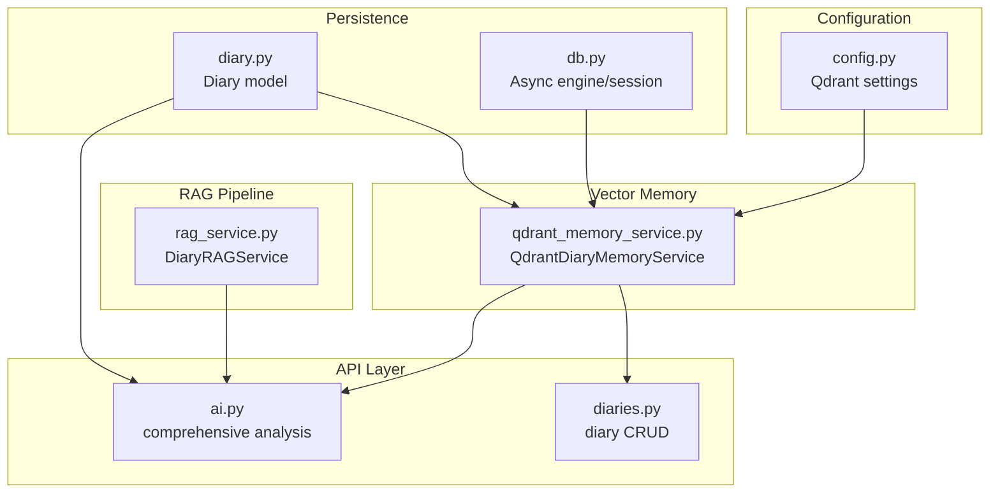
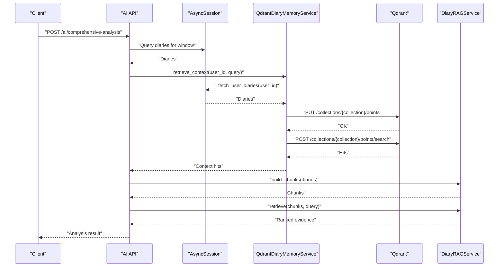
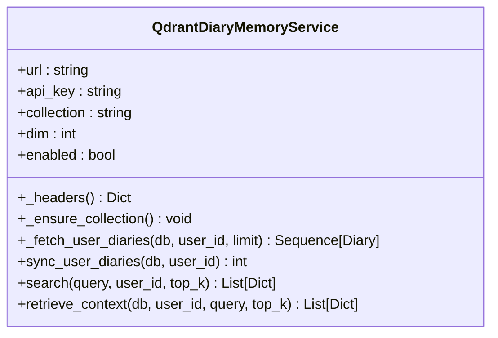
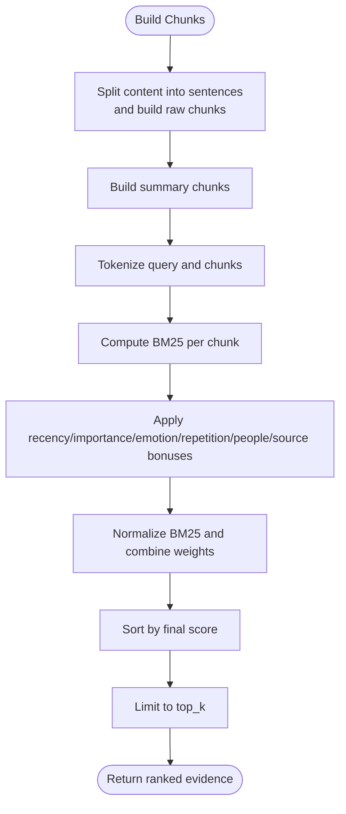
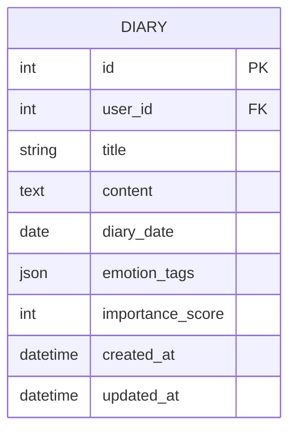
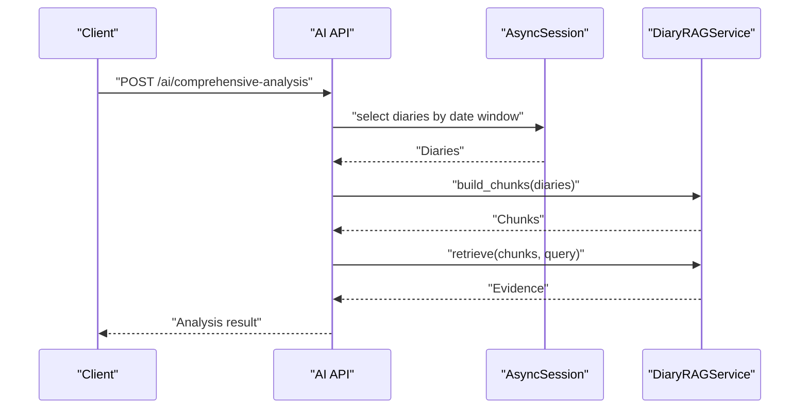
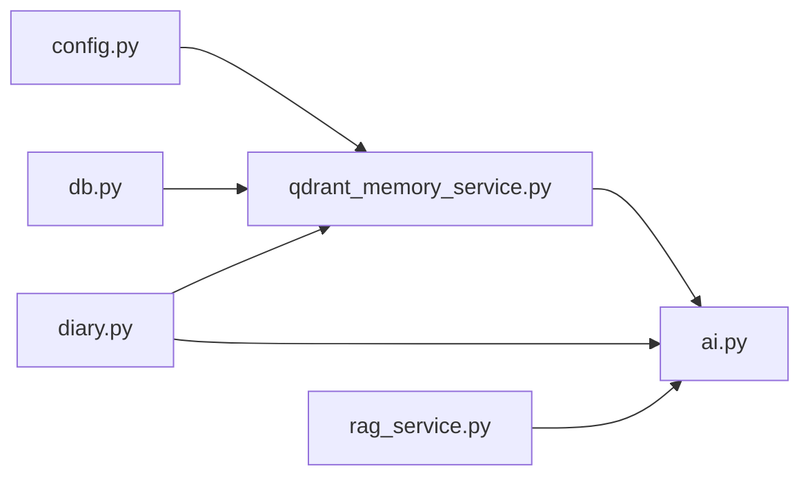

# Vector Database Integration

<cite>
**Referenced Files in This Document**
- [qdrant_memory_service.py](file://backend/app/services/qdrant_memory_service.py)
- [rag_service.py](file://backend/app/services/rag_service.py)
- [config.py](file://backend/app/core/config.py)
- [diary.py](file://backend/app/models/diary.py)
- [db.py](file://backend/app/db.py)
- [ai.py](file://backend/app/api/v1/ai.py)
- [diaries.py](file://backend/app/api/v1/diaries.py)
</cite>

## Table of Contents
1. [Introduction](#introduction)
2. [Project Structure](#project-structure)
3. [Core Components](#core-components)
4. [Architecture Overview](#architecture-overview)
5. [Detailed Component Analysis](#detailed-component-analysis)
6. [Dependency Analysis](#dependency-analysis)
7. [Performance Considerations](#performance-considerations)
8. [Troubleshooting Guide](#troubleshooting-guide)
9. [Conclusion](#conclusion)
10. [Appendices](#appendices)

## Introduction
This document explains the vector database integration with Qdrant in 映记. It covers how diary embeddings are generated, stored, and searched, how memory is managed for retrieval, and how the lightweight RAG pipeline integrates with semantic search. It also documents configuration, collection management, ranking strategies, and operational considerations for scalability, backups, and migrations.

## Project Structure
The vector integration spans several modules:
- Configuration defines Qdrant connection and vector parameters.
- Memory service handles embedding generation, collection creation, synchronization, and similarity search.
- RAG service performs lexical chunking and weighted ranking for comprehensive analysis.
- API endpoints orchestrate retrieval and analysis workflows.
- Database models define the persisted diary records used as the source of truth for embeddings.

**Diagram sources**
- [config.py:72-88](file://backend/app/core/config.py#L72-L88)
- [qdrant_memory_service.py:45-188](file://backend/app/services/qdrant_memory_service.py#L45-L188)
- [rag_service.py:147-360](file://backend/app/services/rag_service.py#L147-L360)
- [ai.py:267-403](file://backend/app/api/v1/ai.py#L267-L403)
- [diaries.py:55-183](file://backend/app/api/v1/diaries.py#L55-L183)
- [db.py:11-23](file://backend/app/db.py#L11-L23)
- [diary.py:29-64](file://backend/app/models/diary.py#L29-L64)

**Section sources**
- [config.py:72-88](file://backend/app/core/config.py#L72-L88)
- [qdrant_memory_service.py:45-188](file://backend/app/services/qdrant_memory_service.py#L45-L188)
- [rag_service.py:147-360](file://backend/app/services/rag_service.py#L147-L360)
- [ai.py:267-403](file://backend/app/api/v1/ai.py#L267-L403)
- [diaries.py:55-183](file://backend/app/api/v1/diaries.py#L55-L183)
- [db.py:11-23](file://backend/app/db.py#L11-L23)
- [diary.py:29-64](file://backend/app/models/diary.py#L29-L64)

## Core Components
- QdrantDiaryMemoryService: Embedding generation, collection management, synchronization, and similarity search.
- DiaryRAGService: Lexical chunking, BM25 scoring, temporal and thematic weighting, and evidence deduplication.
- Configuration: Qdrant URL, API key, collection name, and vector dimension.
- Diary model: Source of truth for diary content and metadata used to construct vectors and payloads.
- Async database engine/session: Provides transactional access to diary records.

Key responsibilities:
- Embedding generation: Tokenization and hashing-based vectorization with cosine distance.
- Collection lifecycle: Ensure collection exists with configured dimension and distance metric.
- Synchronization: Upsert vectors for a user’s recent diaries.
- Semantic search: Cosine similarity search with user-scoped filters.
- RAG integration: Build chunks from diaries and rank candidates for analysis.

**Section sources**
- [qdrant_memory_service.py:19-38](file://backend/app/services/qdrant_memory_service.py#L19-L38)
- [qdrant_memory_service.py:62-83](file://backend/app/services/qdrant_memory_service.py#L62-L83)
- [qdrant_memory_service.py:94-131](file://backend/app/services/qdrant_memory_service.py#L94-L131)
- [qdrant_memory_service.py:133-173](file://backend/app/services/qdrant_memory_service.py#L133-L173)
- [rag_service.py:147-360](file://backend/app/services/rag_service.py#L147-L360)
- [config.py:72-88](file://backend/app/core/config.py#L72-L88)
- [diary.py:29-64](file://backend/app/models/diary.py#L29-L64)
- [db.py:11-23](file://backend/app/db.py#L11-L23)

## Architecture Overview
The vector memory pipeline is designed around a lightweight, deterministic embedding scheme and a hybrid retrieval strategy. The system ensures real-time availability of embeddings by synchronizing user diaries to Qdrant before search. For comprehensive analysis, a lexical RAG pipeline augments semantic recall with BM25 and contextual weights.

**Diagram sources**
- [ai.py:267-403](file://backend/app/api/v1/ai.py#L267-L403)
- [qdrant_memory_service.py:85-131](file://backend/app/services/qdrant_memory_service.py#L85-L131)
- [qdrant_memory_service.py:133-173](file://backend/app/services/qdrant_memory_service.py#L133-L173)
- [rag_service.py:147-317](file://backend/app/services/rag_service.py#L147-L317)

## Detailed Component Analysis

### QdrantDiaryMemoryService
- Embedding generation: Tokenization splits into English tokens and Chinese characters. A hashing-based vectorizer counts token hashes modulo dimension and normalizes to unit length. This produces a sparse, deterministic vector suitable for cosine similarity.
- Collection management: Ensures the collection exists with the configured vector size and cosine distance. Creation is idempotent.
- Synchronization: Fetches a user’s diaries, constructs vectors from title and content, and upserts points with payload metadata (user_id, diary_id, date, title, snippet, emotion_tags, importance_score).
- Search: Builds a query vector, applies a user filter, and returns top-k hits with scores and payload fields.

**Diagram sources**
- [qdrant_memory_service.py:45-188](file://backend/app/services/qdrant_memory_service.py#L45-L188)

**Section sources**
- [qdrant_memory_service.py:19-38](file://backend/app/services/qdrant_memory_service.py#L19-L38)
- [qdrant_memory_service.py:62-83](file://backend/app/services/qdrant_memory_service.py#L62-L83)
- [qdrant_memory_service.py:85-131](file://backend/app/services/qdrant_memory_service.py#L85-L131)
- [qdrant_memory_service.py:133-173](file://backend/app/services/qdrant_memory_service.py#L133-L173)

### DiaryRAGService
- Chunk building: Creates both “summary” and “raw” chunks. Summary chunks are derived from daily summaries with metadata; raw chunks split content by sentence boundaries with overlap.
- Ranking: Computes BM25 per chunk, normalizes by average document length, and combines with recency, importance, emotion intensity, repetition penalty, people hit bonus, and source bonus into a composite score.
- Deduplication: Filters near-duplicate evidence using Jaccard similarity on token sets, respecting per-diary and per-reason limits.

**Diagram sources**
- [rag_service.py:147-317](file://backend/app/services/rag_service.py#L147-L317)

**Section sources**
- [rag_service.py:147-317](file://backend/app/services/rag_service.py#L147-L317)
- [rag_service.py:319-356](file://backend/app/services/rag_service.py#L319-L356)

### Configuration and Data Model
- Configuration: Qdrant URL, API key, collection name, and vector dimension are defined centrally. The dimension must match the embedding function.
- Diary model: Provides the canonical diary record with title, content, emotion_tags, importance_score, and dates used to construct vectors and payloads.

**Diagram sources**
- [diary.py:29-64](file://backend/app/models/diary.py#L29-L64)

**Section sources**
- [config.py:72-88](file://backend/app/core/config.py#L72-L88)
- [diary.py:29-64](file://backend/app/models/diary.py#L29-L64)

### API Integration
- Comprehensive analysis endpoint orchestrates retrieval and ranking. It fetches diaries for a window, builds chunks, retrieves evidence via lexical and summary sources, deduplicates, and passes evidence to the LLM for synthesis.
- Diary CRUD endpoints support the lifecycle of diary content that feeds the vector memory.

**Diagram sources**
- [ai.py:267-403](file://backend/app/api/v1/ai.py#L267-L403)
- [rag_service.py:147-317](file://backend/app/services/rag_service.py#L147-L317)

**Section sources**
- [ai.py:267-403](file://backend/app/api/v1/ai.py#L267-L403)
- [diaries.py:55-183](file://backend/app/api/v1/diaries.py#L55-L183)

## Dependency Analysis
- QdrantDiaryMemoryService depends on:
  - Configuration for Qdrant endpoint, API key, collection, and dimension.
  - SQLAlchemy async session for fetching diaries.
  - httpx for HTTP requests to Qdrant.
- DiaryRAGService depends on:
  - Diary records for content and metadata.
  - Internal tokenization, splitting, and ranking utilities.
- API endpoints depend on:
  - Services for retrieval and analysis.
  - Database sessions for diary queries.

**Diagram sources**
- [config.py:72-88](file://backend/app/core/config.py#L72-L88)
- [qdrant_memory_service.py:15-16](file://backend/app/services/qdrant_memory_service.py#L15-L16)
- [db.py:11-23](file://backend/app/db.py#L11-L23)
- [diary.py:29-64](file://backend/app/models/diary.py#L29-L64)
- [ai.py:267-403](file://backend/app/api/v1/ai.py#L267-L403)
- [rag_service.py:147-317](file://backend/app/services/rag_service.py#L147-L317)

**Section sources**
- [qdrant_memory_service.py:15-16](file://backend/app/services/qdrant_memory_service.py#L15-L16)
- [db.py:11-23](file://backend/app/db.py#L11-L23)
- [diary.py:29-64](file://backend/app/models/diary.py#L29-L64)
- [ai.py:267-403](file://backend/app/api/v1/ai.py#L267-L403)
- [rag_service.py:147-317](file://backend/app/services/rag_service.py#L147-L317)

## Performance Considerations
- Embedding cost: Hash-based vectorization is O(n_tokens × dim) per text; keep dimension reasonable (default 256) to balance recall and latency.
- Collection size: Upserts are batched per user; limit the number of diaries synchronized per run to control write volume.
- Search limits: Top-k is bounded to a small window to reduce network and compute overhead.
- Network timeouts: Asynchronous clients with explicit timeouts prevent long-hanging requests.
- RAG ranking: BM25 normalization and weighted combination are linear in chunk count; tune top_k and dedup thresholds to balance quality and latency.
- Indexing strategy: Qdrant collection uses cosine distance; ensure consistent dimensionality and payload filtering for efficient retrieval.

[No sources needed since this section provides general guidance]

## Troubleshooting Guide
Common issues and resolutions:
- Qdrant disabled: If URL or API key are missing, vector operations return empty results. Verify configuration.
- Collection not found: The service attempts to create the collection with the configured dimension and cosine distance. Check connectivity and credentials.
- Empty query: Queries must be non-empty; otherwise, search returns no results.
- Synchronization failures: If upsert fails, the operation is retried; inspect network errors and payload sizes.
- Retrieval exceptions: The retrieval context wrapper catches exceptions and returns empty results to avoid breaking analysis.

Operational checks:
- Confirm Qdrant endpoint and API key are set in configuration.
- Validate that the collection exists and has the expected vector size.
- Monitor top_k and payload sizes to stay within Qdrant limits.

**Section sources**
- [qdrant_memory_service.py:52-54](file://backend/app/services/qdrant_memory_service.py#L52-L54)
- [qdrant_memory_service.py:62-83](file://backend/app/services/qdrant_memory_service.py#L62-L83)
- [qdrant_memory_service.py:133-137](file://backend/app/services/qdrant_memory_service.py#L133-L137)
- [qdrant_memory_service.py:175-185](file://backend/app/services/qdrant_memory_service.py#L175-L185)

## Conclusion
The 映记 vector integration uses a deterministic, hashing-based embedding approach paired with Qdrant’s cosine similarity search and a lightweight RAG pipeline. This hybrid strategy balances speed, determinism, and interpretability while enabling real-time retrieval and comprehensive analysis. Configuration is centralized, and the design supports incremental scaling and operational safety.

[No sources needed since this section summarizes without analyzing specific files]

## Appendices

### Vector Operations and Search Queries
- Embedding generation: Tokenization and hashing-based vectorization with normalization.
- Collection management: Ensure collection exists with configured dimension and cosine distance.
- Synchronization: Upsert points with payload metadata for user diaries.
- Semantic search: Filter by user_id, return top-k hits with scores and payload fields.

Examples (paths only):
- [Embedding function:26-38](file://backend/app/services/qdrant_memory_service.py#L26-L38)
- [Collection creation:62-83](file://backend/app/services/qdrant_memory_service.py#L62-L83)
- [Upsert points:123-129](file://backend/app/services/qdrant_memory_service.py#L123-L129)
- [Search query:133-158](file://backend/app/services/qdrant_memory_service.py#L133-L158)

**Section sources**
- [qdrant_memory_service.py:26-38](file://backend/app/services/qdrant_memory_service.py#L26-L38)
- [qdrant_memory_service.py:62-83](file://backend/app/services/qdrant_memory_service.py#L62-L83)
- [qdrant_memory_service.py:123-129](file://backend/app/services/qdrant_memory_service.py#L123-L129)
- [qdrant_memory_service.py:133-158](file://backend/app/services/qdrant_memory_service.py#L133-L158)

### Memory Management Patterns
- Real-time synchronization: Before search, synchronize a user’s diaries to ensure freshness.
- Payload retention: Store diary_id, date, title, snippet, emotion_tags, and importance_score for downstream use.
- Point ID scheme: Deterministic composite ID derived from user_id and diary_id.

Examples (paths only):
- [Synchronization:94-131](file://backend/app/services/qdrant_memory_service.py#L94-L131)
- [Payload construction:102-121](file://backend/app/services/qdrant_memory_service.py#L102-L121)
- [Point ID:41-42](file://backend/app/services/qdrant_memory_service.py#L41-L42)

**Section sources**
- [qdrant_memory_service.py:94-131](file://backend/app/services/qdrant_memory_service.py#L94-L131)
- [qdrant_memory_service.py:102-121](file://backend/app/services/qdrant_memory_service.py#L102-L121)
- [qdrant_memory_service.py:41-42](file://backend/app/services/qdrant_memory_service.py#L41-L42)

### RAG Integration and Ranking
- Chunking: Sentence-aware splitting with overlap; dual source types (summary and raw).
- Ranking formula: Weighted combination of BM25, recency, importance, emotion intensity, repetition, people hit, and source bonus.
- Deduplication: Jaccard similarity on token sets with per-diary and per-reason caps.

Examples (paths only):
- [Chunk building:147-208](file://backend/app/services/rag_service.py#L147-L208)
- [Retrieval and ranking:210-317](file://backend/app/services/rag_service.py#L210-L317)
- [Deduplication:319-356](file://backend/app/services/rag_service.py#L319-L356)

**Section sources**
- [rag_service.py:147-208](file://backend/app/services/rag_service.py#L147-L208)
- [rag_service.py:210-317](file://backend/app/services/rag_service.py#L210-L317)
- [rag_service.py:319-356](file://backend/app/services/rag_service.py#L319-L356)

### Qdrant Configuration and Collection Management
- Settings: qdrant_url, qdrant_api_key, qdrant_collection, qdrant_vector_dim.
- Distance metric: Cosine.
- Dimension: Must match embedding function.

Examples (paths only):
- [Settings definition:72-88](file://backend/app/core/config.py#L72-L88)
- [Distance and size:72-77](file://backend/app/services/qdrant_memory_service.py#L72-L77)

**Section sources**
- [config.py:72-88](file://backend/app/core/config.py#L72-L88)
- [qdrant_memory_service.py:72-77](file://backend/app/services/qdrant_memory_service.py#L72-L77)

### Scalability, Backup, and Migration
- Scalability: Keep top_k small, limit batch sizes, and monitor Qdrant cluster health. Consider sharding by user_id or date ranges if needed.
- Backup: Export Qdrant collection snapshots or use Qdrant Cloud backup features. Persist diary content in the relational database for reconstruction.
- Migration: On dimension change, recreate the collection with new size and re-sync vectors. Maintain backward compatibility by keeping old collection during transition.

[No sources needed since this section provides general guidance]