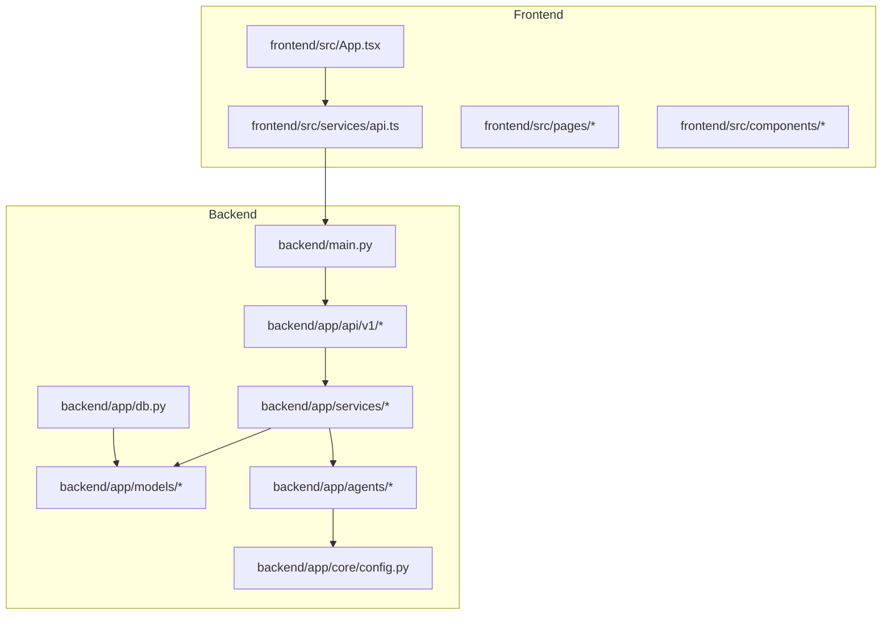
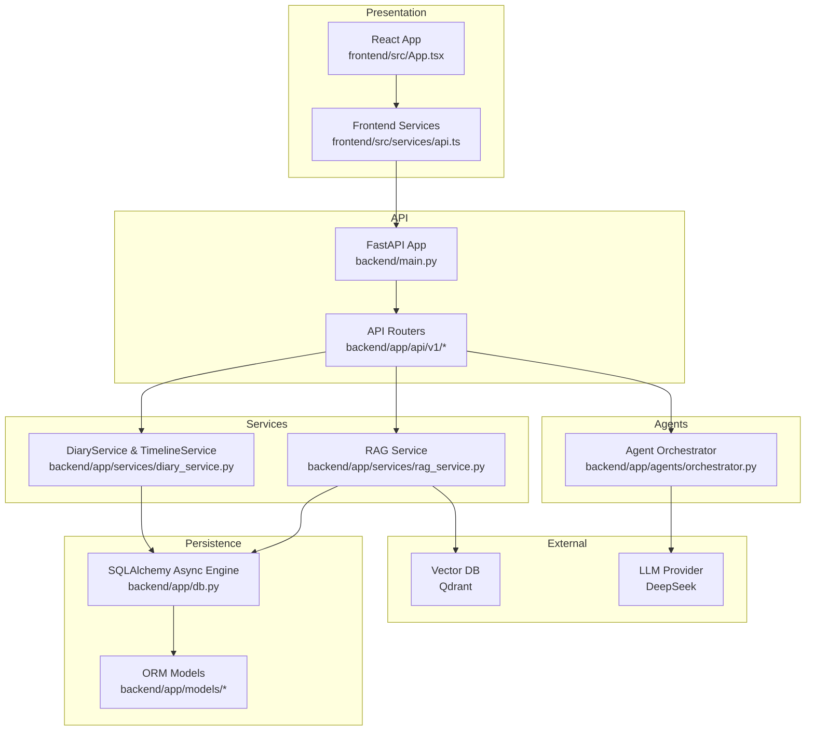
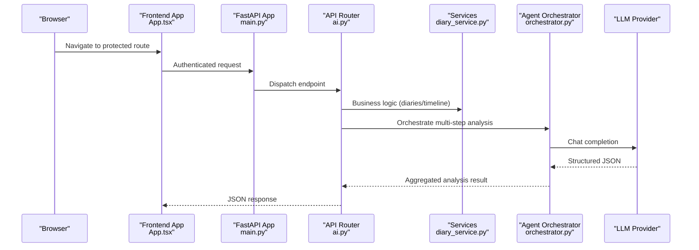
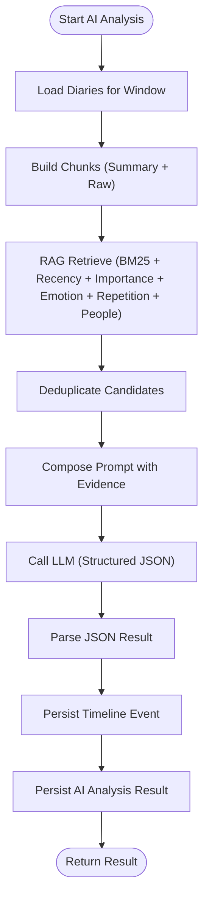
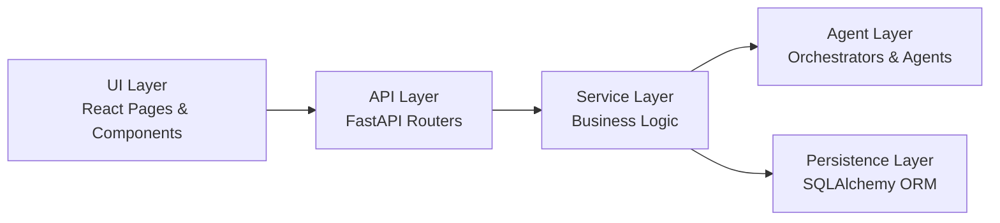
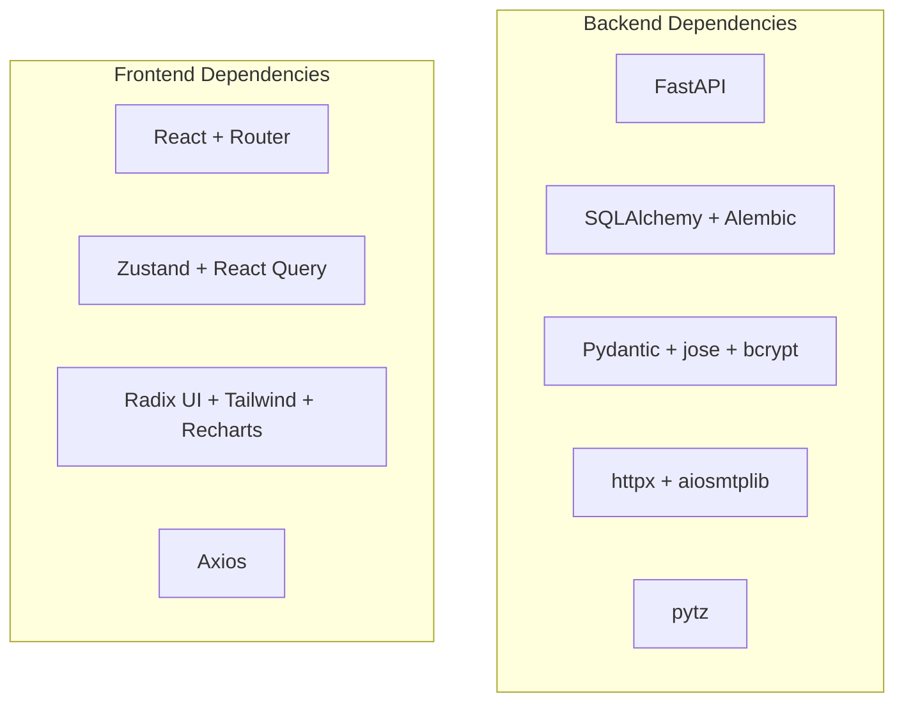
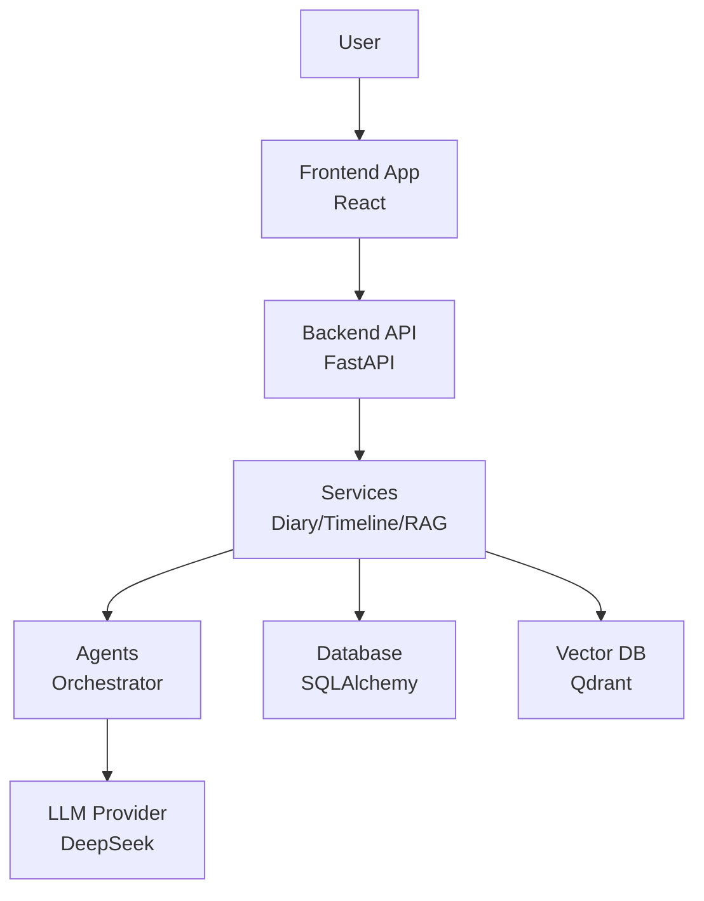

# Architecture Overview

<cite>
**Referenced Files in This Document**
- [backend/main.py](file://backend/main.py)
- [backend/app/core/config.py](file://backend/app/core/config.py)
- [backend/app/db.py](file://backend/app/db.py)
- [backend/app/models/database.py](file://backend/app/models/database.py)
- [backend/app/models/diary.py](file://backend/app/models/diary.py)
- [backend/app/schemas/diary.py](file://backend/app/schemas/diary.py)
- [backend/app/services/diary_service.py](file://backend/app/services/diary_service.py)
- [backend/app/services/rag_service.py](file://backend/app/services/rag_service.py)
- [backend/app/api/v1/ai.py](file://backend/app/api/v1/ai.py)
- [backend/app/agents/orchestrator.py](file://backend/app/agents/orchestrator.py)
- [frontend/src/App.tsx](file://frontend/src/App.tsx)
- [frontend/src/services/api.ts](file://frontend/src/services/api.ts)
- [backend/requirements.txt](file://backend/requirements.txt)
- [frontend/package.json](file://frontend/package.json)
</cite>

## Table of Contents
1. [Introduction](#introduction)
2. [Project Structure](#project-structure)
3. [Core Components](#core-components)
4. [Architecture Overview](#architecture-overview)
5. [Detailed Component Analysis](#detailed-component-analysis)
6. [Dependency Analysis](#dependency-analysis)
7. [Performance Considerations](#performance-considerations)
8. [Troubleshooting Guide](#troubleshooting-guide)
9. [Conclusion](#conclusion)
10. [Appendices](#appendices)

## Introduction
This document presents the architecture overview of the 映记 (Memory Mark) system. It describes the high-level design patterns, including clean architecture, separation of concerns, and component boundaries. The system follows a full-stack architecture with a FastAPI backend, a React frontend, and AI integration layers. The data flow spans from user input through AI processing to visualization. The backend is organized into API, services, agents, and UI layers, with microservices-like separation. External integrations include an LLM provider and a vector database for retrieval-augmented generation (RAG). Scalability, security, and deployment topology are addressed, along with the AI pipeline architecture and vector database integration.

## Project Structure
The 映记 project is organized into two major parts:
- Backend: FastAPI application with routing, services, agents, models, schemas, and configuration.
- Frontend: React application with routing, pages, services, stores, and UI components.



**Diagram sources**
- [backend/main.py:1-108](file://backend/main.py#L1-L108)
- [backend/app/core/config.py:1-105](file://backend/app/core/config.py#L1-L105)
- [backend/app/db.py:1-59](file://backend/app/db.py#L1-L59)
- [backend/app/models/database.py:1-70](file://backend/app/models/database.py#L1-L70)
- [backend/app/models/diary.py:1-186](file://backend/app/models/diary.py#L1-L186)
- [backend/app/services/diary_service.py:1-637](file://backend/app/services/diary_service.py#L1-L637)
- [backend/app/agents/orchestrator.py:1-176](file://backend/app/agents/orchestrator.py#L1-L176)
- [frontend/src/App.tsx:1-242](file://frontend/src/App.tsx#L1-L242)
- [frontend/src/services/api.ts:1-43](file://frontend/src/services/api.ts#L1-L43)

**Section sources**
- [backend/main.py:1-108](file://backend/main.py#L1-L108)
- [frontend/src/App.tsx:1-242](file://frontend/src/App.tsx#L1-L242)

## Core Components
- FastAPI application entrypoint initializes lifecycle, CORS, static file serving, and registers routers for authentication, diaries, AI analysis, users, community, and assistant.
- Configuration module centralizes environment-driven settings including database URL, JWT, SMTP, DeepSeek API, and Qdrant vector database.
- Database layer defines SQLAlchemy async engine, session factory, base declarative class, and initialization routine that creates all tables.
- Data models define domain entities for users, verification codes, diaries, timeline events, AI analyses, social post samples, and growth insights.
- Services encapsulate business logic for diaries and timelines, including event creation, refinement via AI, and timeline retrieval.
- RAG service implements lightweight retrieval logic over user diaries with chunking, BM25 scoring, recency weighting, and deduplication.
- Agents orchestrate multi-step AI analysis workflows, coordinating specialized agents for context collection, timeline management, therapeutic analysis, and social content generation.
- API endpoints expose AI analysis, daily guidance, social style samples, and integrated analysis workflows, integrating with services and agents.

**Section sources**
- [backend/app/core/config.py:1-105](file://backend/app/core/config.py#L1-L105)
- [backend/app/db.py:1-59](file://backend/app/db.py#L1-L59)
- [backend/app/models/database.py:1-70](file://backend/app/models/database.py#L1-L70)
- [backend/app/models/diary.py:1-186](file://backend/app/models/diary.py#L1-L186)
- [backend/app/schemas/diary.py:1-101](file://backend/app/schemas/diary.py#L1-L101)
- [backend/app/services/diary_service.py:1-637](file://backend/app/services/diary_service.py#L1-L637)
- [backend/app/services/rag_service.py:1-360](file://backend/app/services/rag_service.py#L1-L360)
- [backend/app/agents/orchestrator.py:1-176](file://backend/app/agents/orchestrator.py#L1-L176)
- [backend/app/api/v1/ai.py:1-902](file://backend/app/api/v1/ai.py#L1-L902)

## Architecture Overview
The 映记 system adopts a layered architecture aligned with clean architecture principles:
- Presentation Layer: React frontend handles routing, state, and UI rendering.
- API Layer: FastAPI routes and endpoints manage requests, authentication, and orchestration.
- Service Layer: Business logic services encapsulate domain operations and coordinate persistence.
- Agent Layer: AI orchestrators coordinate specialized agents for multi-step analysis.
- Persistence Layer: SQLAlchemy async ORM with Alembic migrations manages relational storage.
- External Integrations: LLM provider for chat completions and vector database for RAG.



**Diagram sources**
- [backend/main.py:1-108](file://backend/main.py#L1-L108)
- [backend/app/api/v1/ai.py:1-902](file://backend/app/api/v1/ai.py#L1-L902)
- [backend/app/services/diary_service.py:1-637](file://backend/app/services/diary_service.py#L1-L637)
- [backend/app/services/rag_service.py:1-360](file://backend/app/services/rag_service.py#L1-L360)
- [backend/app/agents/orchestrator.py:1-176](file://backend/app/agents/orchestrator.py#L1-L176)
- [backend/app/db.py:1-59](file://backend/app/db.py#L1-L59)
- [backend/app/models/diary.py:1-186](file://backend/app/models/diary.py#L1-L186)
- [frontend/src/App.tsx:1-242](file://frontend/src/App.tsx#L1-L242)
- [frontend/src/services/api.ts:1-43](file://frontend/src/services/api.ts#L1-L43)

## Detailed Component Analysis

### Full-Stack Routing and Authentication Flow
The frontend app sets up private/public routes and lazy loads pages. The API initializes CORS, mounts static uploads, and registers routers for authentication, diaries, AI, users, community, and assistant. Authentication middleware ensures protected endpoints.



**Diagram sources**
- [frontend/src/App.tsx:1-242](file://frontend/src/App.tsx#L1-L242)
- [backend/main.py:1-108](file://backend/main.py#L1-L108)
- [backend/app/api/v1/ai.py:1-902](file://backend/app/api/v1/ai.py#L1-L902)
- [backend/app/services/diary_service.py:1-637](file://backend/app/services/diary_service.py#L1-L637)
- [backend/app/agents/orchestrator.py:1-176](file://backend/app/agents/orchestrator.py#L1-L176)

**Section sources**
- [frontend/src/App.tsx:1-242](file://frontend/src/App.tsx#L1-L242)
- [backend/main.py:1-108](file://backend/main.py#L1-L108)
- [backend/app/api/v1/ai.py:1-902](file://backend/app/api/v1/ai.py#L1-L902)

### Data Persistence and Models
The persistence layer uses SQLAlchemy with async sessions and Alembic migrations. Core models include users, verification codes, diaries, timeline events, AI analyses, social post samples, and growth insights. The database initialization script registers models and creates tables.

```mermaid
erDiagram
USERS {
int id PK
string email UK
string password_hash
string username
string avatar_url
string mbti
string social_style
string current_state
json catchphrases
boolean is_active
boolean is_verified
datetime created_at
datetime updated_at
}
DIARIES {
int id PK
int user_id FK
string title
text content
text content_html
date diary_date
json emotion_tags
int importance_score
int word_count
json images
boolean is_analyzed
datetime created_at
datetime updated_at
}
TIMELINE_EVENTS {
int id PK
int user_id FK
int diary_id FK
date event_date
string event_summary
string emotion_tag
int importance_score
string event_type
json related_entities
datetime created_at
}
AI_ANALYSES {
int id PK
int user_id FK
int diary_id FK UK
json result_json
datetime created_at
datetime updated_at
}
SOCIAL_POST_SAMPLES {
int id PK
int user_id FK
text content
datetime created_at
}
GROWTH_DAILY_INSIGHTS {
int id PK
int user_id FK
date insight_date
string primary_emotion
string summary
string source
datetime created_at
datetime updated_at
}
USERS ||--o{ DIARIES : "owns"
USERS ||--o{ TIMELINE_EVENTS : "owns"
DIARIES ||--o{ TIMELINE_EVENTS : "generates"
DIARIES ||--o{ AI_ANALYSES : "targets"
USERS ||--o{ SOCIAL_POST_SAMPLES : "provides"
USERS ||--o{ GROWTH_DAILY_INSIGHTS : "has"
```

**Diagram sources**
- [backend/app/models/database.py:1-70](file://backend/app/models/database.py#L1-L70)
- [backend/app/models/diary.py:1-186](file://backend/app/models/diary.py#L1-L186)

**Section sources**
- [backend/app/db.py:1-59](file://backend/app/db.py#L1-L59)
- [backend/app/models/database.py:1-70](file://backend/app/models/database.py#L1-L70)
- [backend/app/models/diary.py:1-186](file://backend/app/models/diary.py#L1-L186)

### AI Pipeline and RAG Architecture
The AI pipeline integrates RAG over user diaries and structured agent orchestration:
- RAG Service: Builds chunks from diary summaries and raw content, applies BM25 scoring with recency, importance, emotion, repetition, and people hit bonuses, and deduplicates candidates.
- Agent Orchestrator: Coordinates specialized agents for context collection, timeline extraction, five-layer Satir analysis, and social content generation.
- API Endpoints: Expose comprehensive analysis, daily guidance, and social style samples, invoking RAG and agents, and persisting results.



**Diagram sources**
- [backend/app/services/rag_service.py:1-360](file://backend/app/services/rag_service.py#L1-L360)
- [backend/app/agents/orchestrator.py:1-176](file://backend/app/agents/orchestrator.py#L1-L176)
- [backend/app/api/v1/ai.py:1-902](file://backend/app/api/v1/ai.py#L1-L902)

**Section sources**
- [backend/app/services/rag_service.py:1-360](file://backend/app/services/rag_service.py#L1-L360)
- [backend/app/agents/orchestrator.py:1-176](file://backend/app/agents/orchestrator.py#L1-L176)
- [backend/app/api/v1/ai.py:1-902](file://backend/app/api/v1/ai.py#L1-L902)

### Microservices-like Separation
- API Layer: FastAPI routers encapsulate endpoints for authentication, diaries, AI analysis, users, community, and assistant.
- Service Layer: Business logic services handle CRUD, timeline management, and integration with AI.
- Agent Layer: Specialized agents and orchestrator coordinate complex workflows.
- UI Layer: React components and pages render views and manage user interactions.



**Diagram sources**
- [backend/app/api/v1/ai.py:1-902](file://backend/app/api/v1/ai.py#L1-L902)
- [backend/app/services/diary_service.py:1-637](file://backend/app/services/diary_service.py#L1-L637)
- [backend/app/agents/orchestrator.py:1-176](file://backend/app/agents/orchestrator.py#L1-L176)
- [backend/app/db.py:1-59](file://backend/app/db.py#L1-L59)
- [frontend/src/App.tsx:1-242](file://frontend/src/App.tsx#L1-L242)

**Section sources**
- [backend/app/api/v1/ai.py:1-902](file://backend/app/api/v1/ai.py#L1-L902)
- [backend/app/services/diary_service.py:1-637](file://backend/app/services/diary_service.py#L1-L637)
- [backend/app/agents/orchestrator.py:1-176](file://backend/app/agents/orchestrator.py#L1-L176)
- [frontend/src/App.tsx:1-242](file://frontend/src/App.tsx#L1-L242)

## Dependency Analysis
- Backend dependencies include FastAPI, Uvicorn, SQLAlchemy, Alembic, Pydantic, python-jose, passlib, httpx, aiosmtplib, and pytz.
- Frontend dependencies include React, React Router, Zustand, TanStack React Query, Axios, Tailwind-based UI libraries, and Recharts for visualization.



**Diagram sources**
- [backend/requirements.txt:1-26](file://backend/requirements.txt#L1-L26)
- [frontend/package.json:1-54](file://frontend/package.json#L1-L54)

**Section sources**
- [backend/requirements.txt:1-26](file://backend/requirements.txt#L1-L26)
- [frontend/package.json:1-54](file://frontend/package.json#L1-L54)

## Performance Considerations
- Asynchronous I/O: SQLAlchemy async engine and sessions minimize blocking during database operations.
- Caching and Deduplication: RAG service deduplicates candidate evidence to reduce redundant LLM calls.
- Chunking Strategy: Diary content is split into overlapping chunks to balance recall and token limits.
- Vector Database: Qdrant integration supports efficient similarity search; ensure proper indexing and collection configuration.
- Frontend Responsiveness: Lazy loading of pages and components improves initial load performance.

[No sources needed since this section provides general guidance]

## Troubleshooting Guide
- Health Checks: The backend exposes a health endpoint indicating application and database connectivity.
- Authentication Errors: Frontend interceptors handle 401 responses by clearing tokens and redirecting to the welcome page.
- CORS Misconfiguration: Verify allowed origins in configuration align with frontend deployment origins.
- Database Initialization: Ensure database URL and migration steps are correctly configured; initialize tables on startup.

**Section sources**
- [backend/main.py:89-95](file://backend/main.py#L89-L95)
- [frontend/src/services/api.ts:28-40](file://frontend/src/services/api.ts#L28-L40)
- [backend/app/core/config.py:17-20](file://backend/app/core/config.py#L17-L20)
- [backend/app/db.py:45-59](file://backend/app/db.py#L45-L59)

## Conclusion
The 映记 system demonstrates a clean, layered architecture with clear separation of concerns across API, services, agents, and UI. The AI pipeline integrates RAG over user diaries and structured agent orchestration, while the frontend provides responsive navigation and visualization. Security is enforced through JWT-based authentication and CORS policies. Persistence leverages asynchronous SQLAlchemy with Alembic migrations. External integrations include an LLM provider and a vector database for scalable retrieval. The architecture supports scalability through modular components, async I/O, and potential horizontal scaling of backend services.

[No sources needed since this section summarizes without analyzing specific files]

## Appendices

### System Context Diagram


**Diagram sources**
- [frontend/src/App.tsx:1-242](file://frontend/src/App.tsx#L1-L242)
- [backend/main.py:1-108](file://backend/main.py#L1-L108)
- [backend/app/api/v1/ai.py:1-902](file://backend/app/api/v1/ai.py#L1-L902)
- [backend/app/services/diary_service.py:1-637](file://backend/app/services/diary_service.py#L1-L637)
- [backend/app/services/rag_service.py:1-360](file://backend/app/services/rag_service.py#L1-L360)
- [backend/app/agents/orchestrator.py:1-176](file://backend/app/agents/orchestrator.py#L1-L176)
- [backend/app/db.py:1-59](file://backend/app/db.py#L1-L59)