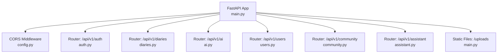
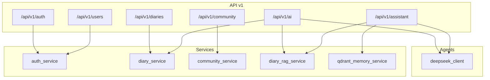
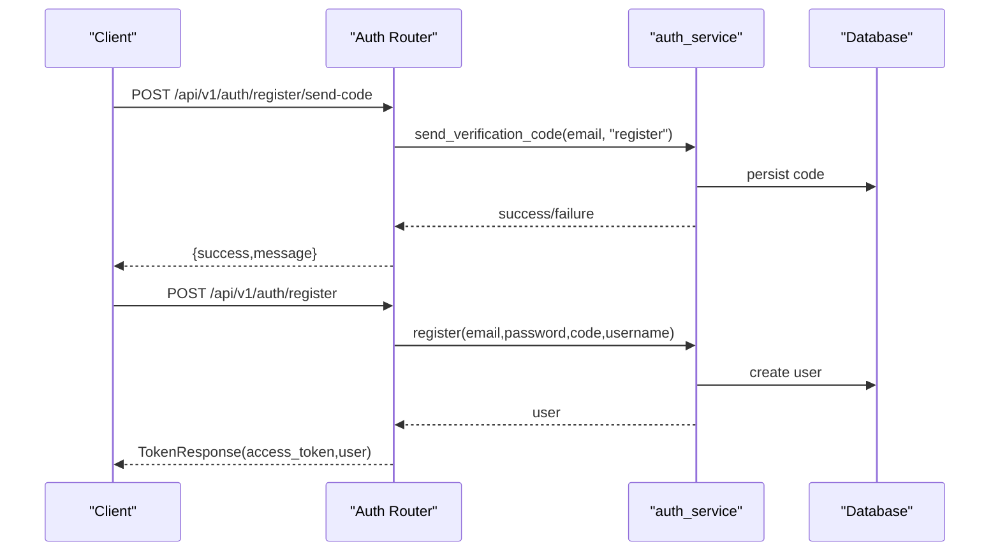
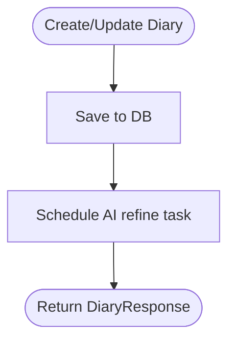
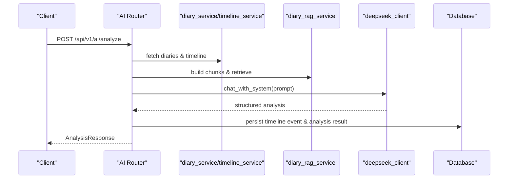
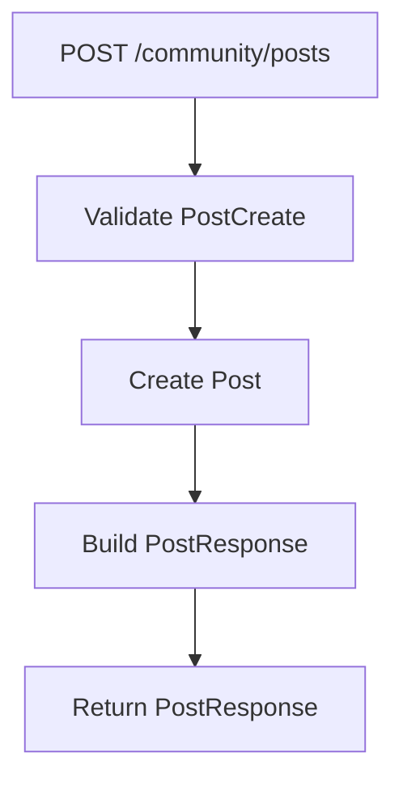
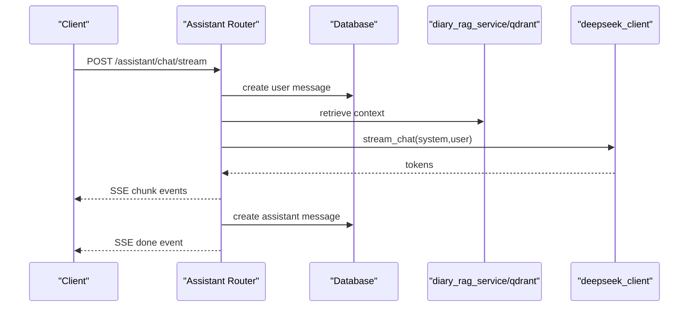
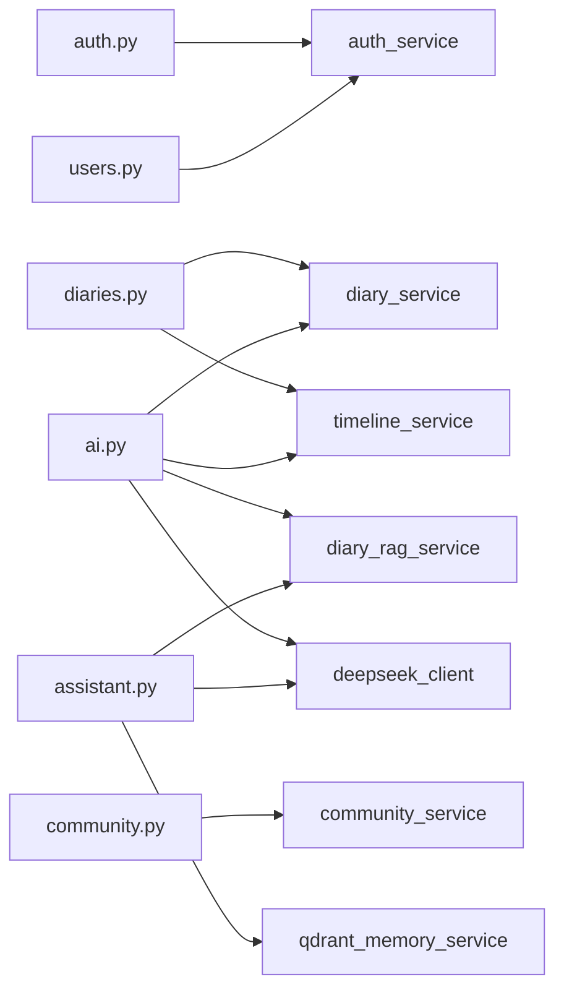

# API Layer

<cite>
**Referenced Files in This Document**
- [main.py](file://backend/main.py)
- [config.py](file://backend/app/core/config.py)
- [auth.py](file://backend/app/api/v1/auth.py)
- [diaries.py](file://backend/app/api/v1/diaries.py)
- [ai.py](file://backend/app/api/v1/ai.py)
- [community.py](file://backend/app/api/v1/community.py)
- [assistant.py](file://backend/app/api/v1/assistant.py)
- [users.py](file://backend/app/api/v1/users.py)
- [auth_schemas.py](file://backend/app/schemas/auth.py)
- [diary_schemas.py](file://backend/app/schemas/diary.py)
- [ai_schemas.py](file://backend/app/schemas/ai.py)
- [community_schemas.py](file://backend/app/schemas/community.py)
</cite>

## Table of Contents
1. [Introduction](#introduction)
2. [Project Structure](#project-structure)
3. [Core Components](#core-components)
4. [Architecture Overview](#architecture-overview)
5. [Detailed Component Analysis](#detailed-component-analysis)
6. [Dependency Analysis](#dependency-analysis)
7. [Performance Considerations](#performance-considerations)
8. [Troubleshooting Guide](#troubleshooting-guide)
9. [Conclusion](#conclusion)
10. [Appendices](#appendices)

## Introduction
This document describes the API layer of the 映记 backend, built with FastAPI. It covers the versioned API group v1, routing registration, endpoint categories, request/response schemas, authentication requirements, error handling, and operational patterns. It also outlines the API versioning strategy, rate limiting, and validation mechanisms present in the codebase.

## Project Structure
The API layer is organized under app/api/v1 with dedicated routers for each domain:
- Authentication (/api/v1/auth)
- Diaries (/api/v1/diaries)
- AI analysis (/api/v1/ai)
- Users (/api/v1/users)
- Community (/api/v1/community)
- Assistant (/api/v1/assistant)

The main application initializes the FastAPI app, registers CORS, mounts static uploads, and includes all v1 routers with a shared prefix and tags for grouping.

**Diagram sources**
- [main.py:42-87](file://backend/main.py#L42-L87)
- [config.py:17-20](file://backend/app/core/config.py#L17-L20)

**Section sources**
- [main.py:42-87](file://backend/main.py#L42-L87)

## Core Components
- API versioning: All routes are registered under /api/v1 with a version tag. The application title and version are set from configuration.
- Authentication: JWT-based via a dependency that requires an active user; endpoints include register, login (code/password), reset password, logout, and profile retrieval.
- Data validation: Pydantic models define request/response schemas with field-level validation and constraints.
- Error handling: HTTPException is raised with appropriate status codes and messages; some endpoints differentiate between client errors and rate-limit errors.
- Rate limiting: The configuration defines maximum code requests per period and code expiration; enforcement occurs in the authentication service.
- CORS: Configured from environment-derived origins.

**Section sources**
- [main.py:42-87](file://backend/main.py#L42-L87)
- [config.py:17-60](file://backend/app/core/config.py#L17-L60)

## Architecture Overview
The API layer composes domain-specific routers that depend on:
- Database sessions (async SQLAlchemy)
- Services (business logic)
- Agents (LLM clients)
- Schemas (validation and serialization)

**Diagram sources**
- [main.py:59-80](file://backend/main.py#L59-L80)
- [auth.py:18-20](file://backend/app/api/v1/auth.py#L18-L20)
- [diaries.py:23-27](file://backend/app/api/v1/diaries.py#L23-L27)
- [ai.py:22-29](file://backend/app/api/v1/ai.py#L22-L29)
- [assistant.py:17-24](file://backend/app/api/v1/assistant.py#L17-L24)

## Detailed Component Analysis

### Authentication Endpoints
- Route prefix: /api/v1/auth
- Authentication requirement: Most endpoints require an active user token via a dependency; /auth/me retrieves the current user.
- Endpoints:
  - POST /auth/register/send-code: Send registration code
  - POST /auth/register/verify: Verify registration code
  - POST /auth/register: Register user (returns token)
  - POST /auth/login/send-code: Send login code
  - POST /auth/login: Login with code
  - POST /auth/login/password: Login with password
  - POST /auth/reset-password/send-code: Send reset code
  - POST /auth/reset-password: Reset password
  - POST /auth/logout: Logout
  - GET /auth/me: Get current user info
  - GET /auth/test-email: Test email sending (dev-only)
- Request/response schemas:
  - SendCodeRequest, VerifyCodeRequest, RegisterRequest, LoginRequest, PasswordLoginRequest, ResetPasswordRequest
  - TokenResponse, UserResponse
- Validation and error handling:
  - Type constraints enforced by Pydantic
  - HTTPException with 400/429/500 depending on failure type
- Typical usage:
  - Registration flow: send-code → verify → register
  - Login flow: send-code → login or password-login
  - After successful login, use the returned bearer token for protected endpoints

**Diagram sources**
- [auth.py:25-125](file://backend/app/api/v1/auth.py#L25-L125)
- [auth_schemas.py:10-37](file://backend/app/schemas/auth.py#L10-L37)

**Section sources**
- [auth.py:22-316](file://backend/app/api/v1/auth.py#L22-L316)
- [auth_schemas.py:10-106](file://backend/app/schemas/auth.py#L10-L106)

### Diary Management Endpoints
- Route prefix: /api/v1/diaries
- Authentication requirement: Active user required
- Endpoints:
  - CRUD: POST /, GET /, GET /{diary_id}, PUT /{diary_id}, DELETE /{diary_id}
  - Date queries: GET /date/{target_date}
  - Pagination: GET /
  - Images: POST /upload-image
  - Timeline: GET /timeline/recent, GET /timeline/range, GET /timeline/date/{target_date}, POST /timeline/rebuild
  - Terrain: GET /timeline/terrain
  - Growth daily insight: GET /growth/daily-insight
- Request/response schemas:
  - DiaryCreate, DiaryUpdate, DiaryResponse, DiaryListResponse
  - TimelineEventCreate, TimelineEventResponse
- Validation and error handling:
  - Pydantic validators enforce content length and defaults
  - 404 Not Found for missing resources
  - Image upload validates MIME type and size
- Notes:
  - Timeline AI refinement runs asynchronously after creation/update
  - Timeline rebuild is idempotent over a date range

**Diagram sources**
- [diaries.py:55-182](file://backend/app/api/v1/diaries.py#L55-L182)

**Section sources**
- [diaries.py:29-491](file://backend/app/api/v1/diaries.py#L29-L491)
- [diary_schemas.py:9-101](file://backend/app/schemas/diary.py#L9-L101)

### AI Analysis Endpoints
- Route prefix: /api/v1/ai
- Authentication requirement: Active user required
- Endpoints:
  - POST /ai/generate-title: AI-generated title suggestion
  - GET /ai/daily-guidance: Personalized writing prompt
  - GET/PUT /ai/social-style-samples: Manage social post style samples
  - POST /ai/comprehensive-analysis: RAG-based user-level analysis
  - POST /ai/analyze: Integrated analysis (async-friendly)
  - GET /ai/analyze-async: Placeholder for async analysis
  - GET /ai/analyses: List saved analysis records
  - GET /ai/result/{diary_id}: Retrieve last saved analysis for a diary
  - POST /ai/satir-analysis: Iceberg model analysis only
  - POST /ai/social-posts: Generate social posts only
- Request/response schemas:
  - AnalysisRequest, ComprehensiveAnalysisRequest
  - AnalysisResponse, ComprehensiveAnalysisResponse, DailyGuidanceResponse, TitleSuggestionResponse
- Validation and error handling:
  - Content length checks for title generation
  - JSON parsing helpers for structured LLM outputs
  - 404/400/500 as appropriate
- Notes:
  - Uses RAG retrieval and hybrid ranking
  - Integrates with timeline and diary services
  - Results cached per diary for reuse

**Diagram sources**
- [ai.py:406-638](file://backend/app/api/v1/ai.py#L406-L638)
- [diaries.py:23-27](file://backend/app/api/v1/diaries.py#L23-L27)

**Section sources**
- [ai.py:31-902](file://backend/app/api/v1/ai.py#L31-L902)
- [ai_schemas.py:9-108](file://backend/app/schemas/ai.py#L9-L108)

### Community Endpoints
- Route prefix: /api/v1/community
- Authentication requirement: Active user required
- Endpoints:
  - Circles: GET /community/circles
  - Posts: POST /community/posts, GET /community/posts, GET /community/posts/mine, GET /community/posts/{post_id}, PUT /community/posts/{post_id}, DELETE /community/posts/{post_id}
  - Comments: POST /community/posts/{post_id}/comments, GET /community/posts/{post_id}/comments, DELETE /community/comments/{comment_id}
  - Interactions: POST /community/posts/{post_id}/like, POST /community/posts/{post_id}/collect, GET /community/collections
  - History: GET /community/history
  - Images: POST /community/upload-image
- Request/response schemas:
  - PostCreate, PostUpdate, PostResponse, PostListResponse
  - CommentCreate, CommentResponse, CommentListResponse
  - CircleInfo, ViewHistoryItem, ViewHistoryResponse
- Validation and error handling:
  - MIME/type checks for image uploads
  - 404/400 as needed for permissions and existence
- Notes:
  - Anonymous posting supported
  - Likes, collects, and collections tracked per user

**Diagram sources**
- [community.py:39-156](file://backend/app/api/v1/community.py#L39-L156)

**Section sources**
- [community.py:20-324](file://backend/app/api/v1/community.py#L20-L324)
- [community_schemas.py:12-124](file://backend/app/schemas/community.py#L12-L124)

### Assistant Endpoints (Chat Sessions, Voice Interactions)
- Route prefix: /api/v1/assistant
- Authentication requirement: Active user required
- Endpoints:
  - Profile: GET /assistant/profile, PUT /assistant/profile
  - Sessions: GET /assistant/sessions, POST /assistant/sessions, DELETE /assistant/sessions/{session_id}
  - Messages: GET /assistant/sessions/{session_id}/messages, POST /assistant/sessions/{session_id}/clear
  - Chat: POST /assistant/chat/stream (Server-Sent Events stream)
- Request/response models:
  - AssistantProfileResponse, AssistantProfileUpdateRequest
  - AssistantSessionResponse, CreateSessionRequest
  - AssistantMessageResponse
- Validation and error handling:
  - Session existence checks
  - Message content length validation
  - SSE events for streaming
- Notes:
  - Streamed responses use SSE with meta/chunk/done/error frames
  - RAG context retrieved from Qdrant or local RAG

**Diagram sources**
- [assistant.py:26-389](file://backend/app/api/v1/assistant.py#L26-L389)

**Section sources**
- [assistant.py:26-389](file://backend/app/api/v1/assistant.py#L26-L389)

### Users Endpoints
- Route prefix: /api/v1/users
- Authentication requirement: Active user required
- Endpoints:
  - GET /users/profile: Get user profile
  - PUT /users/profile: Update profile (username, MBTI, social style, current state, catchphrases)
  - POST /users/avatar: Upload avatar (jpg/png/gif/webp, ≤2MB)
- Request/response schemas:
  - UserResponse, ProfileUpdateRequest
- Validation and error handling:
  - MIME/type and size checks for avatar
  - Old avatar cleanup on upload

**Section sources**
- [users.py:14-103](file://backend/app/api/v1/users.py#L14-L103)
- [auth_schemas.py:58-84](file://backend/app/schemas/auth.py#L58-L84)

## Dependency Analysis
- Router composition: Each router module defines endpoints and depends on services, agents, and schemas.
- Cross-router dependencies:
  - diaries.py depends on timeline_service and diary_service
  - ai.py depends on diary_service, timeline_service, diary_rag_service, and deepseek_client
  - assistant.py depends on qdrant_memory_service, diary_rag_service, and deepseek_client
  - community.py depends on community_service
  - users.py depends on auth service for profile updates
- External integrations:
  - DeepSeek LLM client for chat and streaming
  - Qdrant memory service for semantic retrieval
  - SMTP/email service for verification emails

**Diagram sources**
- [auth.py:18-20](file://backend/app/api/v1/auth.py#L18-L20)
- [diaries.py:23-27](file://backend/app/api/v1/diaries.py#L23-L27)
- [ai.py:22-29](file://backend/app/api/v1/ai.py#L22-L29)
- [assistant.py:17-24](file://backend/app/api/v1/assistant.py#L17-L24)
- [community.py:16-17](file://backend/app/api/v1/community.py#L16-L17)
- [users.py:10-12](file://backend/app/api/v1/users.py#L10-L12)

**Section sources**
- [main.py:59-80](file://backend/main.py#L59-L80)

## Performance Considerations
- Asynchronous design: All endpoints use async SQLAlchemy sessions and async operations for LLM calls.
- Streaming responses: Assistant chat uses SSE to stream tokens, reducing perceived latency.
- Caching and reuse:
  - AI analysis results are persisted per diary to avoid recomputation.
  - Growth daily insights are cached per date per user.
- Retrieval efficiency:
  - Hybrid RAG retrieval with deduplication and limits.
  - Qdrant-backed semantic retrieval with fallback to local RAG.
- Recommendations:
  - Add rate limiting middleware for high-frequency endpoints.
  - Consider pagination limits and query timeouts for AI and community endpoints.
  - Monitor LLM latency and implement circuit breakers.

[No sources needed since this section provides general guidance]

## Troubleshooting Guide
- Authentication failures:
  - Verify token presence and validity; check 401/403 responses.
  - Registration/login/reset flows return 400/429; inspect detail messages for cause.
- Validation errors:
  - Pydantic validation errors surface as 422; review field constraints (length, type, range).
- Resource not found:
  - 404 responses for missing diaries, posts, comments, or sessions.
- Rate limiting:
  - Excessive verification code requests trigger 429; wait until cooldown.
- Image uploads:
  - Ensure allowed MIME types and size limits; check upload directories exist.
- AI/Assistant errors:
  - LLM failures return 500; check logs for model errors.
  - Assistant streaming errors emit SSE error frames.

**Section sources**
- [auth.py:36-51](file://backend/app/api/v1/auth.py#L36-L51)
- [diaries.py:216-228](file://backend/app/api/v1/diaries.py#L216-L228)
- [assistant.py:384-386](file://backend/app/api/v1/assistant.py#L384-L386)

## Conclusion
The 映记 API layer organizes functionality into cohesive v1 routes with strong validation, clear separation of concerns, and robust integrations with LLMs and retrieval systems. Authentication is centralized, and most endpoints require an active user. The design supports incremental enhancements such as rate limiting, caching, and improved streaming semantics.

[No sources needed since this section summarizes without analyzing specific files]

## Appendices

### API Versioning Strategy
- All endpoints are grouped under /api/v1 with a shared prefix and tags.
- Application version is exposed via app metadata.

**Section sources**
- [main.py:59-80](file://backend/main.py#L59-L80)
- [config.py:14-16](file://backend/app/core/config.py#L14-L16)

### Rate Limiting and Validation Patterns
- Rate limiting:
  - Verification code requests per period and expiry configured in settings.
  - Enforced in authentication service; returns 429 when exceeded.
- Request validation:
  - Pydantic models define strict field constraints and defaults.
  - Custom validators handle content normalization and defaults.

**Section sources**
- [config.py:52-60](file://backend/app/core/config.py#L52-L60)
- [diary_schemas.py:18-32](file://backend/app/schemas/diary.py#L18-L32)

### Example Usage Scenarios
- Register and login:
  - Send code → Verify code → Register → Receive token → Use token for protected routes.
- Write and analyze a diary:
  - Create diary → Optionally generate title → Trigger integrated analysis → Retrieve saved result.
- Community participation:
  - Create post → Add comments → Like/collect → Browse history.
- Chat with Assistant:
  - Start or select a session → Stream chat → Clear or archive session.

[No sources needed since this section provides general guidance]