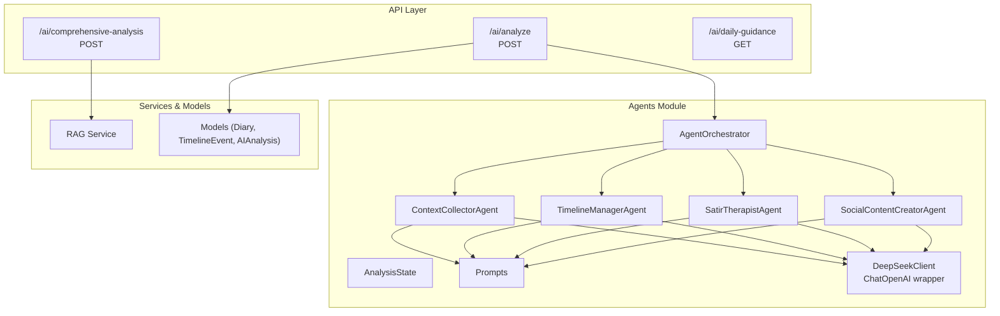
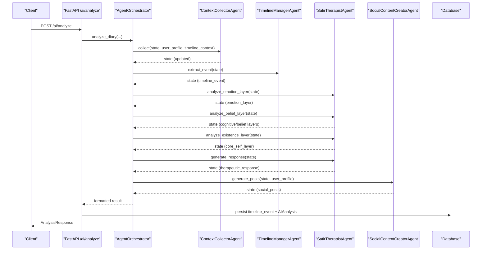
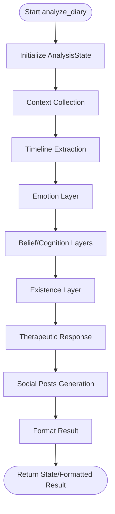
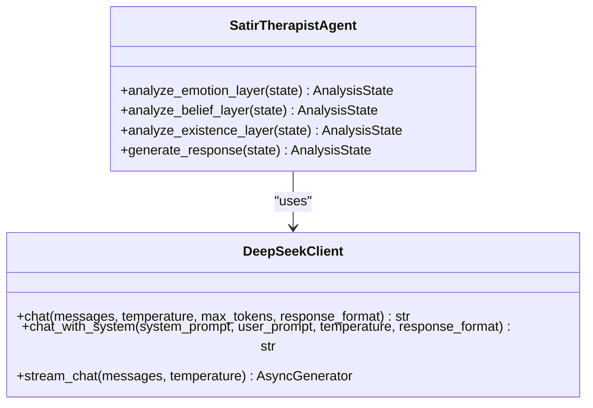
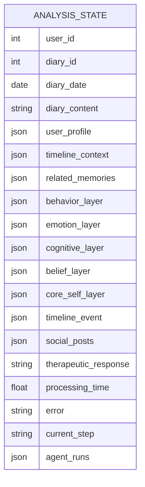
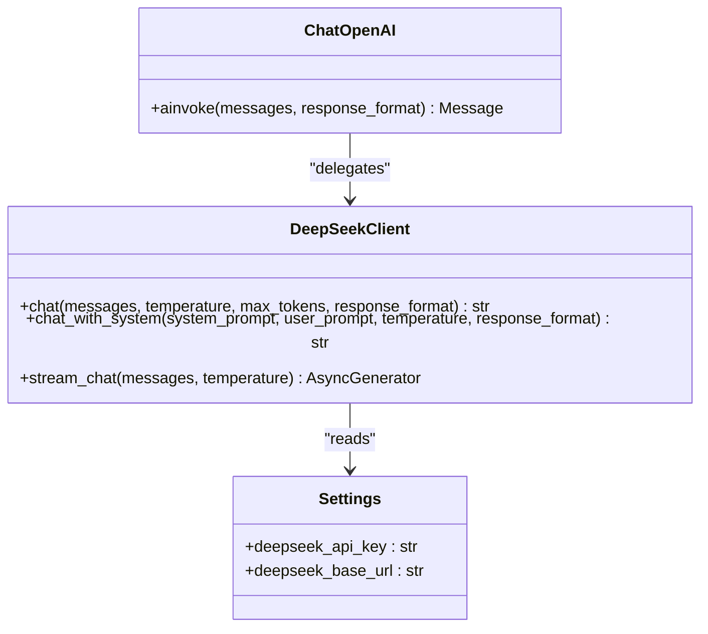
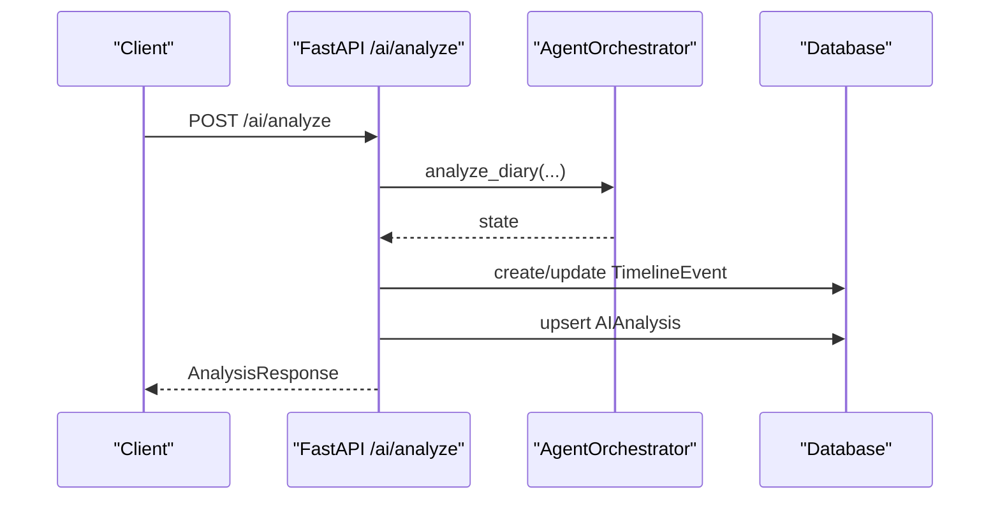
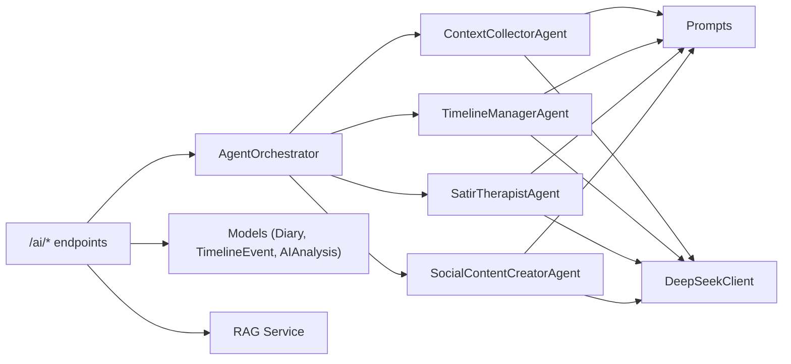

# Agent System

<cite>
**Referenced Files in This Document**
- [orchestrator.py](file://backend/app/agents/orchestrator.py)
- [agent_impl.py](file://backend/app/agents/agent_impl.py)
- [state.py](file://backend/app/agents/state.py)
- [prompts.py](file://backend/app/agents/prompts.py)
- [llm.py](file://backend/app/agents/llm.py)
- [ai.py](file://backend/app/api/v1/ai.py)
- [config.py](file://backend/app/core/config.py)
- [schemas/ai.py](file://backend/app/schemas/ai.py)
- [main.py](file://backend/main.py)
- [rag_service.py](file://backend/app/services/rag_service.py)
- [diary.py](file://backend/app/models/diary.py)
- [test_ai_agents.py](file://backend/test_ai_agents.py)
</cite>

## Table of Contents
1. [Introduction](#introduction)
2. [Project Structure](#project-structure)
3. [Core Components](#core-components)
4. [Architecture Overview](#architecture-overview)
5. [Detailed Component Analysis](#detailed-component-analysis)
6. [Dependency Analysis](#dependency-analysis)
7. [Performance Considerations](#performance-considerations)
8. [Troubleshooting Guide](#troubleshooting-guide)
9. [Conclusion](#conclusion)
10. [Appendices](#appendices)

## Introduction
This document describes the multi-agent AI architecture of the “Yinji” (映记) application. It focuses on the agent orchestration system, agent lifecycle management, inter-agent communication, specialized agent implementations, LLM integration with DeepSeek API, streaming response handling, temperature control mechanisms, prompt engineering, state management, collaboration patterns, error handling, and performance optimization.

## Project Structure
The agent system resides under backend/app/agents and integrates with FastAPI endpoints under backend/app/api/v1. The orchestration coordinates four specialized agents: Context Collector, Timeline Manager, Satir Therapist (multi-step), and Social Content Creator. LLM calls are handled via a simplified DeepSeek client compatible with LangChain’s interface.

**Diagram sources**
- [ai.py:406-638](file://backend/app/api/v1/ai.py#L406-L638)
- [orchestrator.py:18-176](file://backend/app/agents/orchestrator.py#L18-L176)
- [agent_impl.py:92-484](file://backend/app/agents/agent_impl.py#L92-L484)
- [prompts.py:1-244](file://backend/app/agents/prompts.py#L1-L244)
- [llm.py:13-220](file://backend/app/agents/llm.py#L13-L220)
- [rag_service.py:147-360](file://backend/app/services/rag_service.py#L147-L360)
- [diary.py:29-153](file://backend/app/models/diary.py#L29-L153)

**Section sources**
- [main.py:60-87](file://backend/main.py#L60-L87)
- [ai.py:31-31](file://backend/app/api/v1/ai.py#L31-L31)

## Core Components
- Agent Orchestrator: Coordinates the end-to-end analysis pipeline across agents and manages state transitions and error propagation.
- Specialized Agents:
  - ContextCollectorAgent: Aggregates user profile and timeline context into structured state.
  - TimelineManagerAgent: Extracts and structures a timeline event from diary content.
  - SatirTherapistAgent: Multi-step analysis across emotion, cognition/belief, and core self layers, plus therapeutic response generation.
  - SocialContentCreatorAgent: Generates multiple versions of social media posts based on user style and context.
- State Management: Typed dictionary representing the shared state across agents and steps.
- Prompt Engineering: Role-based, structured prompts with JSON constraints and system-level guidance.
- LLM Integration: DeepSeek client with synchronous and streaming modes, temperature control, and LangChain-compatible wrapper.

**Section sources**
- [orchestrator.py:18-176](file://backend/app/agents/orchestrator.py#L18-L176)
- [agent_impl.py:92-484](file://backend/app/agents/agent_impl.py#L92-L484)
- [state.py:10-45](file://backend/app/agents/state.py#L10-L45)
- [prompts.py:1-244](file://backend/app/agents/prompts.py#L1-L244)
- [llm.py:13-220](file://backend/app/agents/llm.py#L13-L220)

## Architecture Overview
The system follows an orchestrator-driven pattern where a central coordinator invokes specialized agents sequentially. Each agent updates the shared state and may trigger downstream agents implicitly through the orchestrator’s flow. The orchestrator also formats results for API responses and persists analysis outcomes.

**Diagram sources**
- [ai.py:406-638](file://backend/app/api/v1/ai.py#L406-L638)
- [orchestrator.py:27-129](file://backend/app/agents/orchestrator.py#L27-L129)
- [agent_impl.py:100-483](file://backend/app/agents/agent_impl.py#L100-L483)

## Detailed Component Analysis

### Agent Orchestrator
- Responsibilities:
  - Initialize AnalysisState with inputs and metadata.
  - Invoke agents in a fixed order: context collection → timeline extraction → Satir layers → therapeutic response → social posts.
  - Track processing time, current step, and agent runs.
  - Format final result for API clients.
- Error handling:
  - Catches exceptions during orchestration, records error in state, and returns partial results with timing metadata.
- Collaboration:
  - Passes state between agents; each agent mutates the shared state.

**Diagram sources**
- [orchestrator.py:27-171](file://backend/app/agents/orchestrator.py#L27-L171)

**Section sources**
- [orchestrator.py:18-176](file://backend/app/agents/orchestrator.py#L18-L176)

### ContextCollectorAgent
- Purpose: Aggregate user profile and timeline context into the shared state.
- Behavior:
  - Builds a structured prompt using user_profile and timeline_context.
  - Calls LLM with JSON response format.
  - Parses and validates JSON payload.
  - Records agent run metrics and handles errors gracefully.

**Section sources**
- [agent_impl.py:92-142](file://backend/app/agents/agent_impl.py#L92-L142)
- [prompts.py:9-28](file://backend/app/agents/prompts.py#L9-L28)
- [llm.py:202-220](file://backend/app/agents/llm.py#L202-L220)

### TimelineManagerAgent
- Purpose: Extract a structured timeline event from diary content.
- Behavior:
  - Uses a dedicated prompt to produce event_summary, emotion_tag, importance_score, event_type, and related_entities.
  - Falls back to a default event if parsing fails.
  - Updates state with timeline_event.

**Section sources**
- [agent_impl.py:144-203](file://backend/app/agents/agent_impl.py#L144-L203)
- [prompts.py:33-57](file://backend/app/agents/prompts.py#L33-L57)

### SatirTherapistAgent (Multi-step)
- Emotion Layer (B1):
  - Analyzes surface vs underlying emotions and intensity.
- Belief/Cognition Layers (B2):
  - Extracts irrational beliefs, automatic thoughts, core beliefs, life rules.
- Existence Layer (B3):
  - Synthesizes insights about yearnings, life energy, deepest desire.
- Therapeutic Response (B4):
  - Generates a warm, structured response integrating all layers.

**Diagram sources**
- [agent_impl.py:205-394](file://backend/app/agents/agent_impl.py#L205-L394)
- [llm.py:13-146](file://backend/app/agents/llm.py#L13-L146)

**Section sources**
- [agent_impl.py:205-394](file://backend/app/agents/agent_impl.py#L205-L394)
- [prompts.py:62-163](file://backend/app/agents/prompts.py#L62-L163)

### SocialContentCreatorAgent
- Purpose: Generate multiple versions of social media posts tailored to user style.
- Behavior:
  - Builds a prompt incorporating username, social style, catchphrases, diary content, and emotion tags.
  - Attempts multiple strategies to parse JSON output.
  - Falls back to simple templates if parsing fails.

**Section sources**
- [agent_impl.py:396-484](file://backend/app/agents/agent_impl.py#L396-L484)
- [prompts.py:168-208](file://backend/app/agents/prompts.py#L168-L208)

### State Management
- AnalysisState defines the shared typed state across agents, including inputs, intermediate layers, outputs, and metadata.
- The orchestrator initializes and updates this state incrementally.

**Diagram sources**
- [state.py:10-45](file://backend/app/agents/state.py#L10-L45)

**Section sources**
- [state.py:10-45](file://backend/app/agents/state.py#L10-L45)

### Prompt Engineering System
- Role-based prompts:
  - SYSTEM_PROMPT_ANALYST and SYSTEM_PROMPT_SOCIAL define agent roles and tone.
  - Task-specific prompts for each agent step with explicit JSON constraints.
- Context management:
  - Prompts receive user_profile, timeline_context, emotion tags, and previous analysis results.
- Style customization:
  - Social posts prompt incorporates user social_style and catchphrases.

**Section sources**
- [prompts.py:1-244](file://backend/app/agents/prompts.py#L1-L244)

### LLM Integration and Temperature Control
- DeepSeekClient:
  - Provides synchronous chat and streaming chat APIs.
  - Supports response_format for JSON output.
  - Configurable temperature and max_tokens.
- LangChain Compatibility:
  - ChatOpenAI wrapper adapts to LangChain’s ainvoke interface.
- Temperature Profiles:
  - get_analytical_llm: low temperature for deterministic JSON.
  - get_creative_llm: higher temperature for creative outputs.
  - get_llm: balanced temperature for general tasks.

**Diagram sources**
- [llm.py:13-220](file://backend/app/agents/llm.py#L13-L220)
- [config.py:62-70](file://backend/app/core/config.py#L62-L70)

**Section sources**
- [llm.py:13-220](file://backend/app/agents/llm.py#L13-L220)
- [config.py:62-70](file://backend/app/core/config.py#L62-L70)

### API Integration and Persistence
- FastAPI endpoints:
  - /ai/analyze orchestrates the agent pipeline and persists results.
  - /ai/comprehensive-analysis uses RAG to synthesize user-level insights.
  - /ai/daily-guidance generates personalized writing prompts.
- Persistence:
  - TimelineEvent created/updated for the target diary.
  - AIAnalysis saved per diary for quick retrieval.

**Diagram sources**
- [ai.py:406-638](file://backend/app/api/v1/ai.py#L406-L638)
- [diary.py:67-132](file://backend/app/models/diary.py#L67-L132)

**Section sources**
- [ai.py:406-638](file://backend/app/api/v1/ai.py#L406-L638)
- [diary.py:67-132](file://backend/app/models/diary.py#L67-L132)

## Dependency Analysis
- Internal dependencies:
  - Orchestrator depends on specialized agents and AnalysisState.
  - Agents depend on prompts and LLM wrappers.
  - API endpoints depend on orchestrator and persistence models.
- External dependencies:
  - DeepSeek API via httpx.
  - SQLAlchemy ORM for persistence.
  - Pydantic schemas for request/response validation.

**Diagram sources**
- [orchestrator.py:9-25](file://backend/app/agents/orchestrator.py#L9-L25)
- [agent_impl.py:12-22](file://backend/app/agents/agent_impl.py#L12-L22)
- [ai.py:22-29](file://backend/app/api/v1/ai.py#L22-L29)
- [rag_service.py:147-360](file://backend/app/services/rag_service.py#L147-L360)
- [diary.py:29-153](file://backend/app/models/diary.py#L29-L153)

**Section sources**
- [orchestrator.py:9-25](file://backend/app/agents/orchestrator.py#L9-L25)
- [agent_impl.py:12-22](file://backend/app/agents/agent_impl.py#L12-L22)
- [ai.py:22-29](file://backend/app/api/v1/ai.py#L22-L29)

## Performance Considerations
- Temperature tuning:
  - Lower temperature for JSON-constrained tasks (analytical agents).
  - Higher temperature for creative tasks (social posts).
- Streaming:
  - DeepSeekClient supports streaming mode; while orchestrator currently uses synchronous calls, streaming can be introduced for long-running tasks to improve perceived latency.
- Chunking and deduplication:
  - RAG service splits content into chunks and deduplicates evidence to reduce redundant processing.
- Caching:
  - Persisted AIAnalysis avoids recomputation for the same diary.
- Concurrency:
  - Orchestrator executes agents sequentially; consider parallelizing independent steps (e.g., multiple LLM calls) with asyncio.gather where safe.

[No sources needed since this section provides general guidance]

## Troubleshooting Guide
- JSON parsing failures:
  - Agents include robust parsers to handle raw JSON, fenced code blocks, and incremental decoding. If parsing still fails, agents fall back to default or degraded states.
- LLM errors:
  - Exceptions are caught, logged, and recorded in state.error; orchestrator returns partial results with processing_time.
- API-level issues:
  - Endpoints validate inputs and return HTTP 4xx/5xx with descriptive messages. Check request schemas and environment variables for DeepSeek credentials.
- Testing:
  - Use the provided test script to validate the agent pipeline end-to-end.

**Section sources**
- [agent_impl.py:25-68](file://backend/app/agents/agent_impl.py#L25-L68)
- [agent_impl.py:136-141](file://backend/app/agents/agent_impl.py#L136-L141)
- [agent_impl.py:191-202](file://backend/app/agents/agent_impl.py#L191-L202)
- [agent_impl.py:293-298](file://backend/app/agents/agent_impl.py#L293-L298)
- [agent_impl.py:337-346](file://backend/app/agents/agent_impl.py#L337-L346)
- [agent_impl.py:388-392](file://backend/app/agents/agent_impl.py#L388-L392)
- [agent_impl.py:465-482](file://backend/app/agents/agent_impl.py#L465-L482)
- [orchestrator.py:121-130](file://backend/app/agents/orchestrator.py#L121-L130)
- [ai.py:534-540](file://backend/app/api/v1/ai.py#L534-L540)
- [test_ai_agents.py:16-161](file://backend/test_ai_agents.py#L16-L161)

## Conclusion
The Yinji multi-agent AI system demonstrates a clean orchestrator pattern with specialized agents, robust state management, and strong prompt engineering. It integrates DeepSeek via a lightweight client, supports JSON-constrained outputs, and persists results for reuse. The modular design enables future enhancements such as streaming responses, parallelization, and expanded agent capabilities.

[No sources needed since this section summarizes without analyzing specific files]

## Appendices

### Example Collaboration Patterns
- Sequential orchestration with shared state updates.
- Conditional fallbacks when parsing or LLM calls fail.
- Persistance of timeline events and AI analyses for later retrieval.

**Section sources**
- [orchestrator.py:83-130](file://backend/app/agents/orchestrator.py#L83-L130)
- [agent_impl.py:136-141](file://backend/app/agents/agent_impl.py#L136-L141)
- [ai.py:541-631](file://backend/app/api/v1/ai.py#L541-L631)

### API Definitions (Selected)
- /ai/analyze: POST, AnalysisRequest → AnalysisResponse
- /ai/comprehensive-analysis: POST, ComprehensiveAnalysisRequest → ComprehensiveAnalysisResponse
- /ai/daily-guidance: GET → DailyGuidanceResponse
- /ai/social-style-samples: GET/PUT → SocialStyleSamplesResponse

**Section sources**
- [ai.py:83-206](file://backend/app/api/v1/ai.py#L83-L206)
- [ai.py:267-403](file://backend/app/api/v1/ai.py#L267-L403)
- [ai.py:128-206](file://backend/app/api/v1/ai.py#L128-L206)
- [ai.py:209-264](file://backend/app/api/v1/ai.py#L209-L264)
- [schemas/ai.py:9-83](file://backend/app/schemas/ai.py#L9-L83)