# Backend Architecture

<cite>
**Referenced Files in This Document**
- [main.py](file://backend/main.py)
- [app/__init__.py](file://backend/app/__init__.py)
- [app/core/config.py](file://backend/app/core/config.py)
- [app/db.py](file://backend/app/db.py)
- [app/core/deps.py](file://backend/app/core/deps.py)
- [app/core/security.py](file://backend/app/core/security.py)
- [app/api/v1/auth.py](file://backend/app/api/v1/auth.py)
- [app/services/auth_service.py](file://backend/app/services/auth_service.py)
- [app/models/database.py](file://backend/app/models/database.py)
- [app/api/v1/diaries.py](file://backend/app/api/v1/diaries.py)
- [app/services/diary_service.py](file://backend/app/services/diary_service.py)
- [app/models/diary.py](file://backend/app/models/diary.py)
- [app/models/community.py](file://backend/app/models/community.py)
- [app/agents/orchestrator.py](file://backend/app/agents/orchestrator.py)
- [app/agents/agent_impl.py](file://backend/app/agents/agent_impl.py)
</cite>

## Table of Contents
1. [Introduction](#introduction)
2. [Project Structure](#project-structure)
3. [Core Components](#core-components)
4. [Architecture Overview](#architecture-overview)
5. [Detailed Component Analysis](#detailed-component-analysis)
6. [Dependency Analysis](#dependency-analysis)
7. [Performance Considerations](#performance-considerations)
8. [Troubleshooting Guide](#troubleshooting-guide)
9. [Conclusion](#conclusion)
10. [Appendices](#appendices)

## Introduction
This document describes the backend architecture of the 映记 (Yinji) smart diary application. Built on FastAPI, the backend follows clean architecture principles with clear separation between API controllers, services, models, and utilities. It integrates asynchronous database operations via SQLAlchemy ORM, dependency injection, robust authentication with JWT and password hashing, and a multi-agent AI analysis pipeline orchestrated by dedicated agents. The system emphasizes modularity, maintainability, and scalability while supporting features such as diary management, community interactions, and intelligent insights.

## Project Structure
The backend is organized into layers:
- Application entrypoint and lifecycle management
- Core configuration, security, and dependency injection
- Database layer with SQLAlchemy ORM and model definitions
- API routers grouped by feature domains
- Services encapsulating business logic
- Agents implementing multi-agent orchestration and LLM-driven analysis

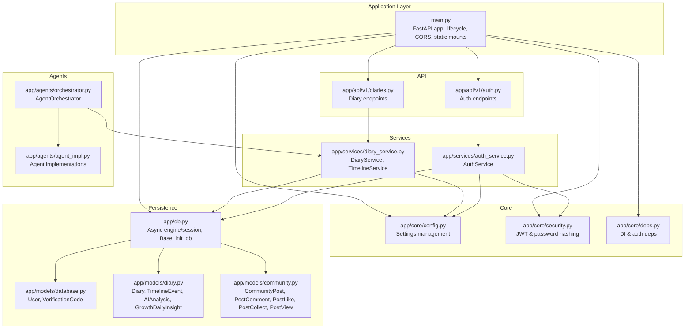

**Diagram sources**
- [main.py:1-119](file://backend/main.py#L1-L119)
- [app/core/config.py:1-105](file://backend/app/core/config.py#L1-L105)
- [app/db.py:1-59](file://backend/app/db.py#L1-L59)
- [app/core/security.py:1-92](file://backend/app/core/security.py#L1-L92)
- [app/core/deps.py:1-103](file://backend/app/core/deps.py#L1-L103)
- [app/models/database.py:1-70](file://backend/app/models/database.py#L1-L70)
- [app/models/diary.py:1-186](file://backend/app/models/diary.py#L1-L186)
- [app/models/community.py:1-176](file://backend/app/models/community.py#L1-L176)
- [app/api/v1/auth.py:1-316](file://backend/app/api/v1/auth.py#L1-L316)
- [app/api/v1/diaries.py:1-501](file://backend/app/api/v1/diaries.py#L1-L501)
- [app/services/auth_service.py:1-358](file://backend/app/services/auth_service.py#L1-L358)
- [app/services/diary_service.py:1-637](file://backend/app/services/diary_service.py#L1-L637)
- [app/agents/orchestrator.py:1-176](file://backend/app/agents/orchestrator.py#L1-L176)
- [app/agents/agent_impl.py:1-484](file://backend/app/agents/agent_impl.py#L1-L484)

**Section sources**
- [main.py:1-119](file://backend/main.py#L1-L119)
- [app/core/config.py:1-105](file://backend/app/core/config.py#L1-L105)
- [app/db.py:1-59](file://backend/app/db.py#L1-L59)

## Core Components
- FastAPI application with lifespan management for database initialization and scheduled tasks
- Centralized configuration via pydantic settings with environment-driven values
- Asynchronous SQLAlchemy ORM with dependency-injected sessions
- Authentication service with JWT token creation/verification and bcrypt password hashing
- API routers for authentication, diary management, and community features
- Business logic services for domain operations
- Multi-agent AI orchestration for diary analysis and social content generation

**Section sources**
- [main.py:19-40](file://backend/main.py#L19-L40)
- [app/core/config.py:10-105](file://backend/app/core/config.py#L10-L105)
- [app/db.py:11-59](file://backend/app/db.py#L11-L59)
- [app/core/security.py:12-92](file://backend/app/core/security.py#L12-L92)
- [app/api/v1/auth.py:22-316](file://backend/app/api/v1/auth.py#L22-L316)
- [app/api/v1/diaries.py:29-501](file://backend/app/api/v1/diaries.py#L29-L501)
- [app/services/auth_service.py:16-358](file://backend/app/services/auth_service.py#L16-L358)
- [app/services/diary_service.py:66-637](file://backend/app/services/diary_service.py#L66-L637)
- [app/agents/orchestrator.py:18-176](file://backend/app/agents/orchestrator.py#L18-L176)

## Architecture Overview
The backend adheres to clean architecture with explicit boundaries:
- API layer: FastAPI routers define endpoints and depend on services
- Service layer: Encapsulates business logic and coordinates persistence
- Persistence layer: SQLAlchemy ORM models and async sessions
- Utility/core layer: Security, configuration, and dependency injection

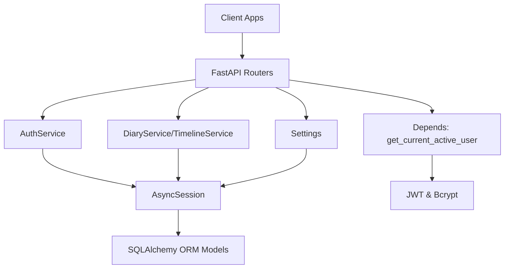

**Diagram sources**
- [main.py:42-87](file://backend/main.py#L42-L87)
- [app/api/v1/auth.py:18-316](file://backend/app/api/v1/auth.py#L18-L316)
- [app/api/v1/diaries.py:23-501](file://backend/app/api/v1/diaries.py#L23-L501)
- [app/services/auth_service.py:16-358](file://backend/app/services/auth_service.py#L16-L358)
- [app/services/diary_service.py:66-637](file://backend/app/services/diary_service.py#L66-L637)
- [app/db.py:31-59](file://backend/app/db.py#L31-L59)
- [app/core/deps.py:18-103](file://backend/app/core/deps.py#L18-L103)
- [app/core/security.py:12-92](file://backend/app/core/security.py#L12-L92)
- [app/core/config.py:10-105](file://backend/app/core/config.py#L10-L105)

## Detailed Component Analysis

### FastAPI Application and Lifecycle
- Application initialization sets CORS, registers routers for auth, diaries, AI, users, community, and assistant
- Static file mounting for uploads
- Lifespan manager initializes the database and starts a scheduler task; cancels on shutdown
- Health check endpoint exposed for monitoring

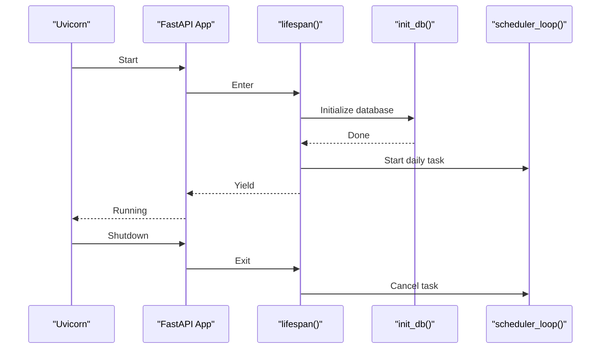

**Diagram sources**
- [main.py:19-40](file://backend/main.py#L19-L40)
- [main.py:42-87](file://backend/main.py#L42-L87)
- [app/db.py:45-59](file://backend/app/db.py#L45-L59)

**Section sources**
- [main.py:19-119](file://backend/main.py#L19-L119)

### Configuration System
- Centralized settings via pydantic-settings with environment file support
- Includes application metadata, database URL, JWT configuration, email SMTP, rate limits, external APIs (DeepSeek), and vector store (Qdrant)
- CORS origins computed from allowed origins string

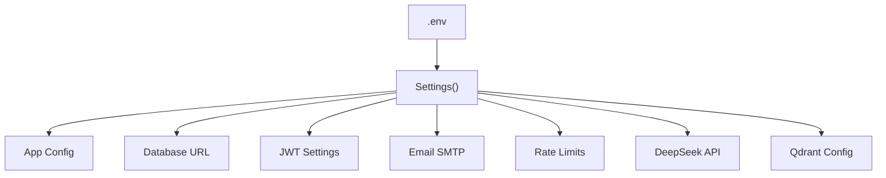

**Diagram sources**
- [app/core/config.py:10-105](file://backend/app/core/config.py#L10-L105)

**Section sources**
- [app/core/config.py:10-105](file://backend/app/core/config.py#L10-L105)

### Database Initialization and Dependency Injection
- Asynchronous SQLAlchemy engine configured from settings
- Session factory with expire_on_commit disabled
- Global Base class for declarative models
- Dependency provider yields sessions per request
- init_db creates all tables by importing model modules

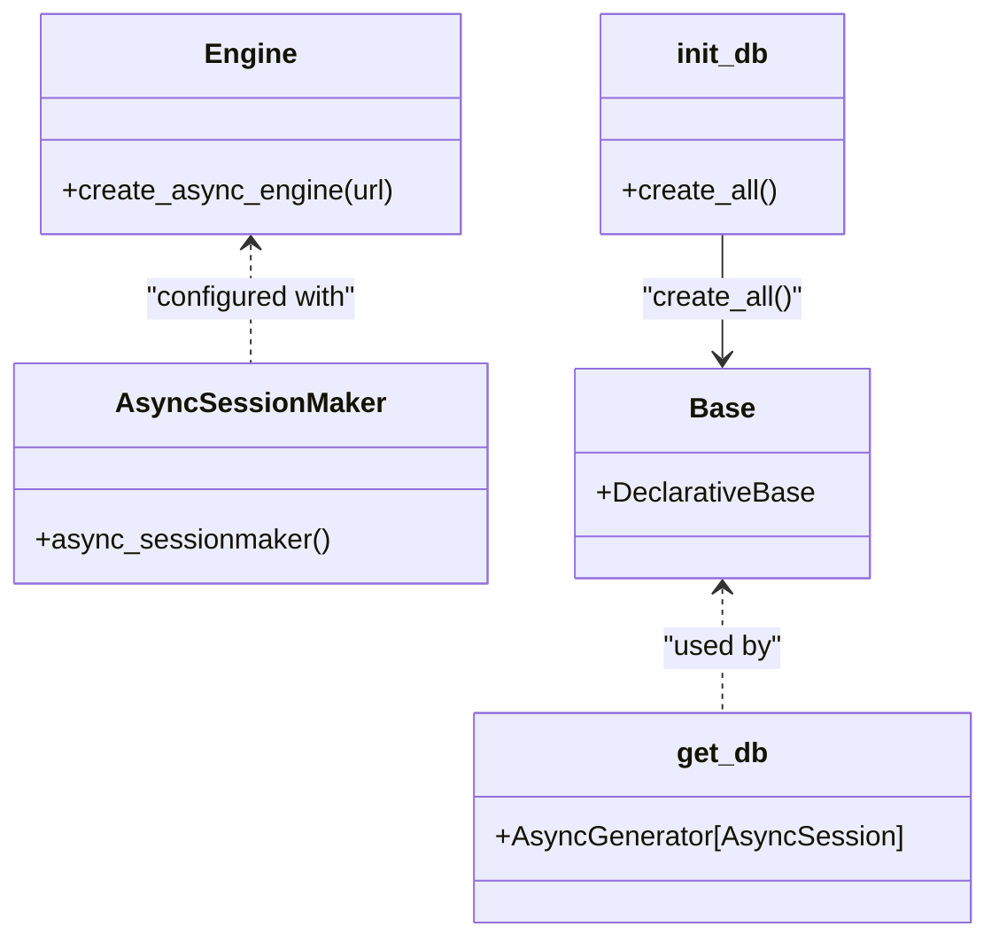

**Diagram sources**
- [app/db.py:11-59](file://backend/app/db.py#L11-L59)

**Section sources**
- [app/db.py:11-59](file://backend/app/db.py#L11-L59)

### Security Architecture
- Password hashing with bcrypt via passlib
- JWT token creation and decoding with configurable algorithm and expiration
- HTTP bearer dependency resolves current user via token verification and DB lookup
- Active user guard ensures user is enabled

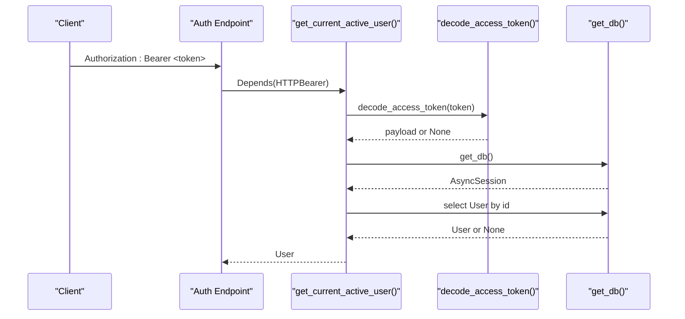

**Diagram sources**
- [app/core/deps.py:18-103](file://backend/app/core/deps.py#L18-L103)
- [app/core/security.py:43-92](file://backend/app/core/security.py#L43-L92)

**Section sources**
- [app/core/security.py:12-92](file://backend/app/core/security.py#L12-L92)
- [app/core/deps.py:18-103](file://backend/app/core/deps.py#L18-L103)

### Authentication Service and API
- Endpoints for registration (email code flow), login (code/password), password reset, logout, and profile retrieval
- Service enforces rate limits, verifies codes against database, manages user activation, and issues JWT tokens
- Uses email service integration for verification code delivery

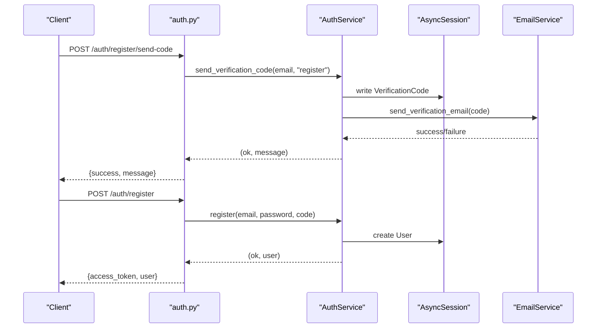

**Diagram sources**
- [app/api/v1/auth.py:25-126](file://backend/app/api/v1/auth.py#L25-L126)
- [app/services/auth_service.py:19-201](file://backend/app/services/auth_service.py#L19-L201)

**Section sources**
- [app/api/v1/auth.py:22-316](file://backend/app/api/v1/auth.py#L22-L316)
- [app/services/auth_service.py:16-358](file://backend/app/services/auth_service.py#L16-L358)

### Diary Management Service and API
- CRUD operations for diaries with pagination, filtering, and date range queries
- Image upload endpoint with size/type validation
- Timeline service auto-creates/upserts events from diaries, supports AI refinement, and rebuilds timelines
- Growth daily insight caching with fallback and AI-generated summaries

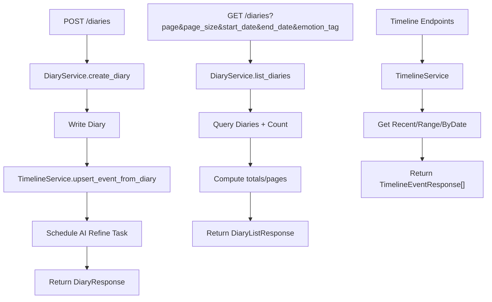

**Diagram sources**
- [app/api/v1/diaries.py:55-334](file://backend/app/api/v1/diaries.py#L55-L334)
- [app/services/diary_service.py:69-279](file://backend/app/services/diary_service.py#L69-L279)
- [app/services/diary_service.py:358-489](file://backend/app/services/diary_service.py#L358-L489)

**Section sources**
- [app/api/v1/diaries.py:29-501](file://backend/app/api/v1/diaries.py#L29-L501)
- [app/services/diary_service.py:66-637](file://backend/app/services/diary_service.py#L66-L637)

### Community Models
- Community posts, comments, likes, collections, and views with unique constraints and foreign keys
- Emotion circles configuration for community segmentation

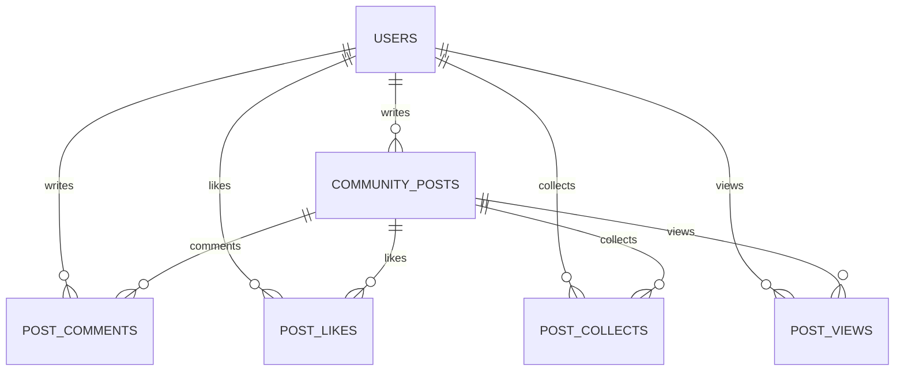

**Diagram sources**
- [app/models/community.py:23-176](file://backend/app/models/community.py#L23-L176)

**Section sources**
- [app/models/community.py:1-176](file://backend/app/models/community.py#L1-L176)

### Agent Orchestration and Multi-Agent Architecture
- Orchestrator coordinates four specialized agents: Context Collector, Timeline Manager, Satir Therapist (multi-stage), and Social Content Creator
- Each agent uses appropriate LLM clients and prompt templates
- Robust JSON parsing helpers handle varied LLM outputs
- Execution state tracks steps, timing, and agent runs; gracefully degrades on failures

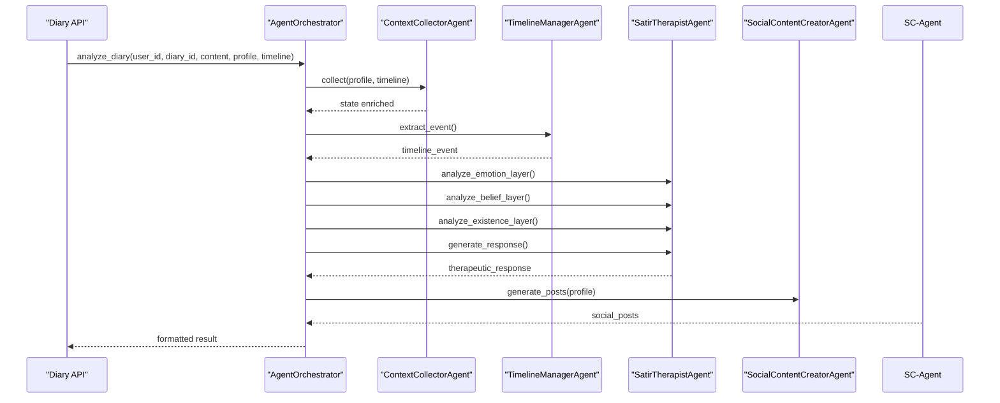

**Diagram sources**
- [app/agents/orchestrator.py:27-131](file://backend/app/agents/orchestrator.py#L27-L131)
- [app/agents/agent_impl.py:100-484](file://backend/app/agents/agent_impl.py#L100-L484)

**Section sources**
- [app/agents/orchestrator.py:18-176](file://backend/app/agents/orchestrator.py#L18-L176)
- [app/agents/agent_impl.py:25-484](file://backend/app/agents/agent_impl.py#L25-L484)

### Database Models Overview
- Users and verification codes for authentication
- Diary entries, timeline events, AI analyses, social post samples, and growth insights
- Community entities for posts, comments, likes, collections, and views

```mermaid
erDiagram
USERS {
int id PK
string email UK
string password_hash
string username
string avatar_url
string mbti
string social_style
string current_state
json catchphrases
bool is_active
bool is_verified
datetime created_at
datetime updated_at
}
VERIFICATION_CODES {
int id PK
string email
string code
string type
datetime expires_at
bool used
datetime created_at
}
DIARIES {
int id PK
int user_id FK
string title
text content
text content_html
date diary_date
json emotion_tags
int importance_score
int word_count
json images
bool is_analyzed
datetime created_at
datetime updated_at
}
TIMELINE_EVENTS {
int id PK
int user_id FK
int diary_id FK
date event_date
string event_summary
string emotion_tag
int importance_score
string event_type
json related_entities
datetime created_at
}
AI_ANALYSES {
int id PK
int user_id FK
int diary_id FK UK
json result_json
datetime created_at
datetime updated_at
}
GROWTH_DAILY_INSIGHTS {
int id PK
int user_id FK
date insight_date
string primary_emotion
string summary
string source
datetime created_at
datetime updated_at
}
COMMUNITY_POSTS {
int id PK
int user_id FK
string circle_id
text content
json images
bool is_anonymous
int like_count
int comment_count
int collect_count
bool is_deleted
datetime created_at
datetime updated_at
}
POST_COMMENTS {
int id PK
int post_id FK
int user_id FK
int parent_id FK
text content
bool is_anonymous
bool is_deleted
datetime created_at
}
POST_LIKES {
int id PK
int user_id FK
int post_id FK
datetime created_at
}
POST_COLLECTS {
int id PK
int user_id FK
int post_id FK
datetime created_at
}
POST_VIEWS {
int id PK
int user_id FK
int post_id FK
datetime created_at
}
USERS ||--o{ DIARIES : "owns"
DIARIES ||--o{ AI_ANALYSES : "analyzed_by"
DIARIES ||--o{ TIMELINE_EVENTS : "generates"
USERS ||--o{ COMMUNITY_POSTS : "writes"
COMMUNITY_POSTS ||--o{ POST_COMMENTS : "comments"
USERS ||--o{ POST_LIKES : "likes"
USERS ||--o{ POST_COLLECTS : "collects"
USERS ||--o{ POST_VIEWS : "views"
```

**Diagram sources**
- [app/models/database.py:13-70](file://backend/app/models/database.py#L13-L70)
- [app/models/diary.py:29-186](file://backend/app/models/diary.py#L29-L186)
- [app/models/community.py:23-176](file://backend/app/models/community.py#L23-L176)

**Section sources**
- [app/models/database.py:1-70](file://backend/app/models/database.py#L1-L70)
- [app/models/diary.py:1-186](file://backend/app/models/diary.py#L1-L186)
- [app/models/community.py:1-176](file://backend/app/models/community.py#L1-L176)

## Dependency Analysis
- API routers depend on services and schemas
- Services depend on models and configuration
- Authentication depends on security utilities and database
- Agents depend on LLM clients and prompt templates
- All database access uses injected async sessions

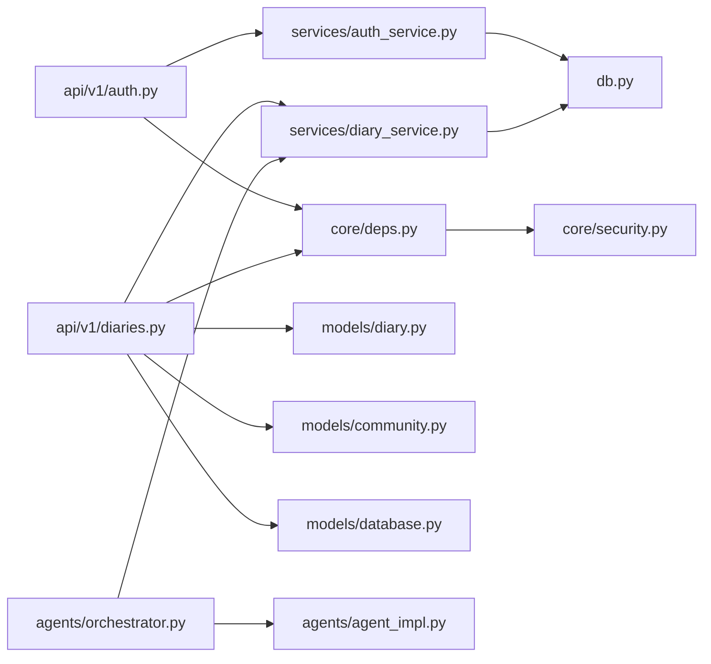

**Diagram sources**
- [app/api/v1/auth.py:18-316](file://backend/app/api/v1/auth.py#L18-L316)
- [app/api/v1/diaries.py:23-501](file://backend/app/api/v1/diaries.py#L23-L501)
- [app/services/auth_service.py:16-358](file://backend/app/services/auth_service.py#L16-L358)
- [app/services/diary_service.py:66-637](file://backend/app/services/diary_service.py#L66-L637)
- [app/db.py:31-59](file://backend/app/db.py#L31-L59)
- [app/core/deps.py:18-103](file://backend/app/core/deps.py#L18-L103)
- [app/core/security.py:12-92](file://backend/app/core/security.py#L12-L92)
- [app/models/diary.py:29-186](file://backend/app/models/diary.py#L29-L186)
- [app/models/community.py:23-176](file://backend/app/models/community.py#L23-L176)
- [app/models/database.py:13-70](file://backend/app/models/database.py#L13-L70)
- [app/agents/orchestrator.py:18-176](file://backend/app/agents/orchestrator.py#L18-L176)
- [app/agents/agent_impl.py:92-484](file://backend/app/agents/agent_impl.py#L92-L484)

**Section sources**
- [app/api/v1/auth.py:18-316](file://backend/app/api/v1/auth.py#L18-L316)
- [app/api/v1/diaries.py:23-501](file://backend/app/api/v1/diaries.py#L23-L501)
- [app/services/auth_service.py:16-358](file://backend/app/services/auth_service.py#L16-L358)
- [app/services/diary_service.py:66-637](file://backend/app/services/diary_service.py#L66-L637)
- [app/db.py:31-59](file://backend/app/db.py#L31-L59)
- [app/core/deps.py:18-103](file://backend/app/core/deps.py#L18-L103)
- [app/core/security.py:12-92](file://backend/app/core/security.py#L12-L92)
- [app/models/diary.py:29-186](file://backend/app/models/diary.py#L29-L186)
- [app/models/community.py:23-176](file://backend/app/models/community.py#L23-L176)
- [app/models/database.py:13-70](file://backend/app/models/database.py#L13-L70)
- [app/agents/orchestrator.py:18-176](file://backend/app/agents/orchestrator.py#L18-L176)
- [app/agents/agent_impl.py:92-484](file://backend/app/agents/agent_impl.py#L92-L484)

## Performance Considerations
- Asynchronous database operations prevent blocking I/O
- Pagination and limit controls for timeline queries
- AI refinement scheduled as fire-and-forget tasks to avoid latency
- JSON parsing helpers reduce retries and improve resilience
- Unique constraints and indexed fields optimize frequent queries

[No sources needed since this section provides general guidance]

## Troubleshooting Guide
- Authentication failures: verify JWT secret, token expiration, and user activation status
- Database connection errors: check database URL and engine configuration
- CORS issues: ensure allowed origins match client origins
- Rate limiting on verification codes: respect max requests per window
- Agent parsing errors: ensure LLM responses conform to expected JSON formats

**Section sources**
- [app/core/security.py:43-92](file://backend/app/core/security.py#L43-L92)
- [app/core/config.py:22-60](file://backend/app/core/config.py#L22-L60)
- [app/api/v1/auth.py:36-53](file://backend/app/api/v1/auth.py#L36-L53)
- [app/agents/agent_impl.py:25-68](file://backend/app/agents/agent_impl.py#L25-L68)

## Conclusion
The 映记 backend demonstrates a well-structured FastAPI application with clean architecture. It leverages asynchronous persistence, robust authentication, modular services, and a sophisticated multi-agent AI pipeline. The design balances simplicity and scalability, enabling future enhancements such as advanced analytics, richer community features, and expanded AI capabilities.

[No sources needed since this section summarizes without analyzing specific files]

## Appendices

### API Routing Patterns
- Modular routers under app/api/v1 grouped by feature domains
- Consistent use of Depends for dependency injection and current user resolution
- Standardized response models and error handling via HTTP exceptions

**Section sources**
- [app/api/v1/auth.py:22-316](file://backend/app/api/v1/auth.py#L22-L316)
- [app/api/v1/diaries.py:29-501](file://backend/app/api/v1/diaries.py#L29-L501)

### Middleware and CORS
- CORS configured via FastAPI middleware with origins from settings
- Static file serving for uploaded assets

**Section sources**
- [main.py:50-87](file://backend/main.py#L50-L87)
- [app/core/config.py:17-20](file://backend/app/core/config.py#L17-L20)

### Migration Strategies
- Database initialization creates all tables at startup
- Model imports included in init_db to register metadata
- Future migrations can leverage Alembic on top of SQLAlchemy models

**Section sources**
- [app/db.py:45-59](file://backend/app/db.py#L45-L59)