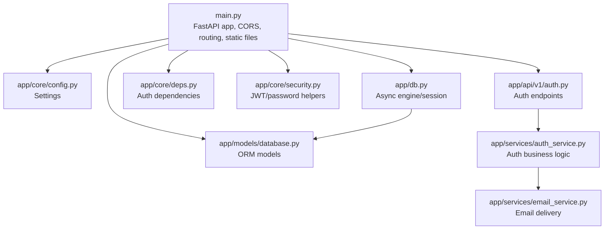
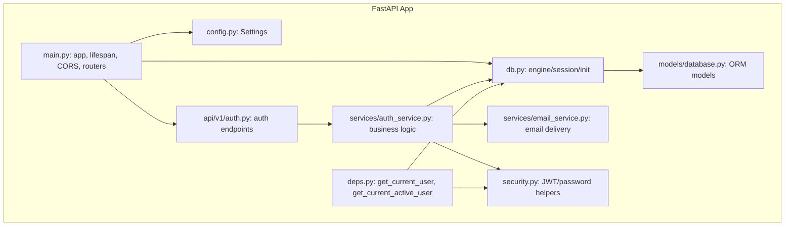
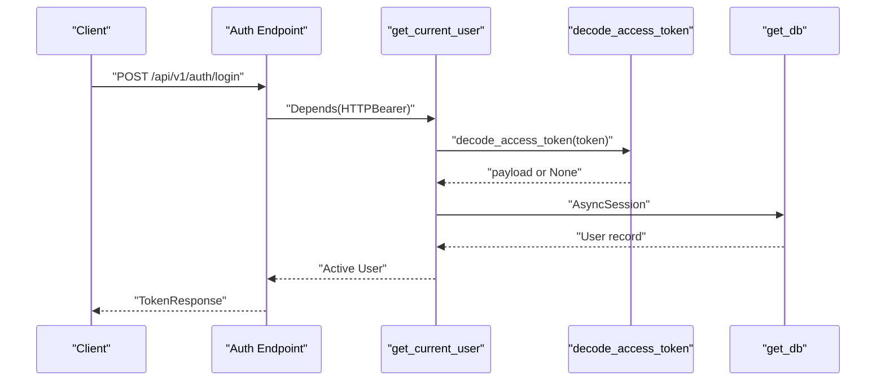
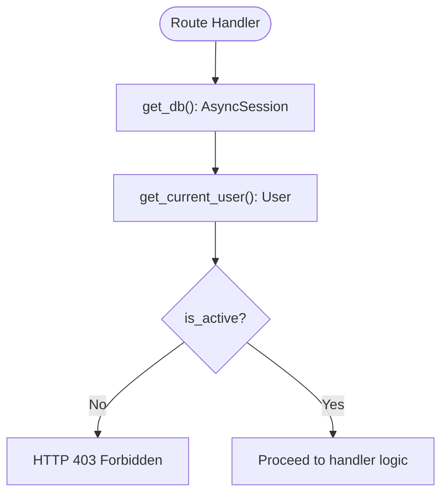
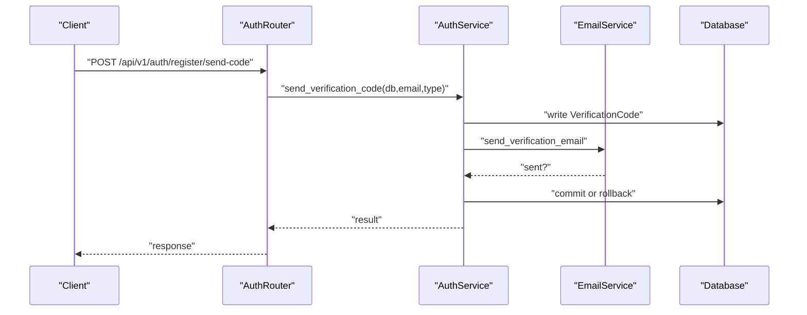
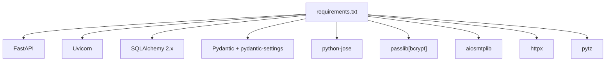

# Core Configuration

<cite>
**Referenced Files in This Document**
- [config.py](file://backend/app/core/config.py)
- [security.py](file://backend/app/core/security.py)
- [deps.py](file://backend/app/core/deps.py)
- [main.py](file://backend/main.py)
- [db.py](file://backend/app/db.py)
- [database.py](file://backend/app/models/database.py)
- [auth_service.py](file://backend/app/services/auth_service.py)
- [email_service.py](file://backend/app/services/email_service.py)
- [auth.py](file://backend/app/api/v1/auth.py)
- [requirements.txt](file://backend/requirements.txt)
- [DEPLOY.md](file://DEPLOY.md)
</cite>

## Table of Contents
1. [Introduction](#introduction)
2. [Project Structure](#project-structure)
3. [Core Components](#core-components)
4. [Architecture Overview](#architecture-overview)
5. [Detailed Component Analysis](#detailed-component-analysis)
6. [Dependency Analysis](#dependency-analysis)
7. [Performance Considerations](#performance-considerations)
8. [Troubleshooting Guide](#troubleshooting-guide)
9. [Conclusion](#conclusion)
10. [Appendices](#appendices)

## Introduction
This document provides comprehensive configuration documentation for the 映记 backend system. It explains how the FastAPI application is configured, how environment variables are managed, how the database is set up, how CORS is configured, and how security parameters are defined. It also documents the dependency injection system, service initialization, JWT settings, password hashing parameters, authentication middleware, environment setup, configuration validation, deployment-specific configurations, and environment-specific overrides for development, staging, and production.

## Project Structure
The configuration system centers around a small set of modules that define application-wide settings, security policies, dependency injection, and database initialization. The FastAPI application wires these together during startup and registers routers for API endpoints.

**Diagram sources**
- [main.py:42-87](file://backend/main.py#L42-L87)
- [config.py:10-105](file://backend/app/core/config.py#L10-L105)
- [db.py:11-59](file://backend/app/db.py#L11-L59)
- [deps.py:18-66](file://backend/app/core/deps.py#L18-L66)
- [security.py:43-92](file://backend/app/core/security.py#L43-L92)
- [database.py:13-70](file://backend/app/models/database.py#L13-L70)
- [auth.py:22-200](file://backend/app/api/v1/auth.py#L22-L200)
- [auth_service.py:16-200](file://backend/app/services/auth_service.py#L16-L200)
- [email_service.py:25-200](file://backend/app/services/email_service.py#L25-L200)

**Section sources**
- [main.py:42-87](file://backend/main.py#L42-L87)
- [config.py:10-105](file://backend/app/core/config.py#L10-L105)
- [db.py:11-59](file://backend/app/db.py#L11-L59)
- [deps.py:18-66](file://backend/app/core/deps.py#L18-L66)
- [security.py:43-92](file://backend/app/core/security.py#L43-L92)
- [database.py:13-70](file://backend/app/models/database.py#L13-L70)
- [auth.py:22-200](file://backend/app/api/v1/auth.py#L22-L200)
- [auth_service.py:16-200](file://backend/app/services/auth_service.py#L16-L200)
- [email_service.py:25-200](file://backend/app/services/email_service.py#L25-L200)

## Core Components
- Settings: Centralized configuration via pydantic-settings with environment file loading and property parsing for CORS origins.
- Security: JWT token creation/verification and password hashing using bcrypt.
- Dependencies: Authentication dependency chain for protected endpoints.
- Database: Async SQLAlchemy engine and session factory with initialization routine.
- Services: Business logic for authentication and email delivery.

Key configuration categories:
- Application identity and debug mode
- CORS origins
- Database URL
- JWT secret, algorithm, and expiration
- Email provider settings (QQ SMTP)
- Verification code policy
- LLM provider settings (DeepSeek)
- Vector storage settings (Qdrant)

Validation and defaults:
- Required fields enforced at runtime via pydantic settings.
- Defaults provided for optional settings to enable local development.

**Section sources**
- [config.py:10-105](file://backend/app/core/config.py#L10-L105)
- [security.py:12-92](file://backend/app/core/security.py#L12-L92)
- [deps.py:18-66](file://backend/app/core/deps.py#L18-L66)
- [db.py:11-59](file://backend/app/db.py#L11-L59)
- [auth_service.py:19-98](file://backend/app/services/auth_service.py#L19-L98)
- [email_service.py:25-154](file://backend/app/services/email_service.py#L25-L154)

## Architecture Overview
The FastAPI application initializes configuration, sets up CORS, mounts static files, and registers API routers. Authentication middleware is applied via dependency injection. Database initialization occurs during application lifespan. Security utilities provide JWT and password hashing.

**Diagram sources**
- [main.py:42-87](file://backend/main.py#L42-L87)
- [deps.py:18-66](file://backend/app/core/deps.py#L18-L66)
- [security.py:43-92](file://backend/app/core/security.py#L43-L92)
- [config.py:10-105](file://backend/app/core/config.py#L10-L105)
- [db.py:11-59](file://backend/app/db.py#L11-L59)
- [database.py:13-70](file://backend/app/models/database.py#L13-L70)
- [auth.py:22-200](file://backend/app/api/v1/auth.py#L22-L200)
- [auth_service.py:16-200](file://backend/app/services/auth_service.py#L16-L200)
- [email_service.py:25-200](file://backend/app/services/email_service.py#L25-L200)

## Detailed Component Analysis

### Environment Variable Management and Settings
- Settings class encapsulates all configuration keys with defaults and descriptions.
- Environment file loading is configured with UTF-8 encoding and case-insensitive lookup.
- CORS origins are parsed from a comma-separated string into a list for middleware configuration.
- Required fields (e.g., JWT secret, email credentials) must be provided at runtime.

Operational impact:
- Changing allowed origins affects browser access.
- Database URL controls persistence backend and connection behavior.
- JWT parameters define token lifetime and signing method.
- Email settings enable verification flows; missing values break registration/login.

**Section sources**
- [config.py:10-105](file://backend/app/core/config.py#L10-L105)

### FastAPI Application Configuration
- Application metadata (title, version) sourced from settings.
- CORS middleware configured with parsed origins and permissive headers/methods.
- Static file mounting for uploads directory with subfolders for avatars, images, and community assets.
- Health check endpoint and root endpoint included.
- Uvicorn runner supports hot reload in debug mode.

**Section sources**
- [main.py:42-119](file://backend/main.py#L42-L119)

### Database Configuration and Initialization
- Asynchronous SQLAlchemy engine created from settings.
- Echo setting mirrors debug flag for SQL logging.
- Session factory configured with commit behavior.
- Initialization creates all registered tables on startup.

**Section sources**
- [db.py:11-59](file://backend/app/db.py#L11-L59)
- [database.py:13-70](file://backend/app/models/database.py#L13-L70)

### Security Configuration: JWT and Password Hashing
- Password hashing uses bcrypt via passlib.
- JWT encode/decode use python-jose with configurable algorithm and secret.
- Access tokens include an expiration delta derived from settings.
- Authentication dependency validates bearer tokens and loads active users.

**Diagram sources**
- [auth.py:158-188](file://backend/app/api/v1/auth.py#L158-L188)
- [deps.py:18-66](file://backend/app/core/deps.py#L18-L66)
- [security.py:73-92](file://backend/app/core/security.py#L73-L92)
- [db.py:31-43](file://backend/app/db.py#L31-L43)

**Section sources**
- [security.py:12-92](file://backend/app/core/security.py#L12-L92)
- [deps.py:18-66](file://backend/app/core/deps.py#L18-L66)

### Dependency Injection System
- get_db provides AsyncSession instances for route handlers.
- get_current_user validates bearer tokens and fetches the current user, raising 401/403 on failure.
- get_current_active_user adds an additional guard for disabled accounts.
- get_trace_id extracts optional tracing header for observability.

**Diagram sources**
- [deps.py:18-89](file://backend/app/core/deps.py#L18-L89)
- [db.py:31-43](file://backend/app/db.py#L31-L43)

**Section sources**
- [deps.py:18-89](file://backend/app/core/deps.py#L18-L89)
- [db.py:31-43](file://backend/app/db.py#L31-L43)

### Authentication Middleware and Endpoints
- Auth endpoints depend on get_current_active_user for protected operations.
- Registration and login use verification codes stored in the database.
- Email service sends codes via QQ SMTP with fallback to synchronous delivery.
- Rate limiting and expiration enforced by settings and database queries.

**Diagram sources**
- [auth.py:25-53](file://backend/app/api/v1/auth.py#L25-L53)
- [auth_service.py:19-98](file://backend/app/services/auth_service.py#L19-L98)
- [email_service.py:48-154](file://backend/app/services/email_service.py#L48-L154)

**Section sources**
- [auth.py:25-188](file://backend/app/api/v1/auth.py#L25-L188)
- [auth_service.py:19-200](file://backend/app/services/auth_service.py#L19-L200)
- [email_service.py:25-200](file://backend/app/services/email_service.py#L25-L200)

### Environment Setup and Validation
- Environment variables loaded from .env with UTF-8 encoding.
- Required fields must be present; otherwise, application startup fails.
- Debug mode toggles SQL echo and hot reload behavior.
- Allowed origins must match frontend URLs to avoid CORS errors.

**Section sources**
- [config.py:90-105](file://backend/app/core/config.py#L90-L105)
- [main.py:109-119](file://backend/main.py#L109-L119)

### Deployment-Specific Configurations
- Docker and systemd deployment steps documented.
- Nginx reverse proxy configuration for frontend and backend.
- HTTPS setup via Certbot recommended.
- Backup and monitoring guidance included.

**Section sources**
- [DEPLOY.md:55-115](file://DEPLOY.md#L55-L115)
- [DEPLOY.md:167-263](file://DEPLOY.md#L167-L263)
- [DEPLOY.md:265-276](file://DEPLOY.md#L265-L276)
- [DEPLOY.md:355-388](file://DEPLOY.md#L355-L388)

### Configuration Overrides by Environment
- Development: Enable debug, use SQLite, localhost origins, shorter token expirations acceptable.
- Staging: Disable debug, use PostgreSQL, restrict allowed origins to staging domain, moderate rate limits.
- Production: Disable debug, use secure secrets, strict allowed origins, robust rate limits, HTTPS-only, external SMTP, vector storage configured.

Note: Specific values are not hardcoded here; adjust the environment variables accordingly.

**Section sources**
- [config.py:14-100](file://backend/app/core/config.py#L14-L100)
- [DEPLOY.md:55-71](file://DEPLOY.md#L55-L71)

## Dependency Analysis
External libraries and their roles:
- FastAPI and Uvicorn for web framework and ASGI server.
- SQLAlchemy 2.x with asyncio for ORM and database operations.
- Pydantic and pydantic-settings for configuration modeling and environment loading.
- python-jose for JWT encoding/decoding.
- passlib with bcrypt for password hashing.
- aiosmtplib for asynchronous SMTP; falls back to smtplib if unavailable.
- httpx for HTTP client needs.
- pytz for timezone utilities.

**Diagram sources**
- [requirements.txt:1-26](file://backend/requirements.txt#L1-L26)

**Section sources**
- [requirements.txt:1-26](file://backend/requirements.txt#L1-L26)

## Performance Considerations
- Keep debug disabled in production to reduce overhead.
- Use PostgreSQL in production for better concurrency and reliability compared to SQLite.
- Configure CORS narrowly to minimize preflight overhead.
- Tune token expiration to balance security and UX.
- Monitor database query logs during development; disable echo in production.
- Prefer asynchronous SMTP when available; fallback is supported but may add latency.

## Troubleshooting Guide
Common configuration issues and resolutions:
- CORS blocked requests: Verify allowed origins include frontend URLs.
- JWT signature errors: Ensure SECRET_KEY matches across deployments and is sufficiently strong.
- Database connection failures: Confirm DATABASE_URL format and credentials; check engine echo logs in debug mode.
- Email sending failures: Validate QQ email settings, authorization code, and port/SSL configuration; check fallback behavior.
- Rate limit exceeded: Adjust max_code_requests_per_5min and verification_code_expire_minutes.
- Authentication failing: Confirm bearer token format and expiration; ensure user is active.

**Section sources**
- [config.py:17-100](file://backend/app/core/config.py#L17-L100)
- [security.py:63-92](file://backend/app/core/security.py#L63-L92)
- [db.py:12-23](file://backend/app/db.py#L12-L23)
- [email_service.py:25-154](file://backend/app/services/email_service.py#L25-L154)
- [auth_service.py:50-51](file://backend/app/services/auth_service.py#L50-L51)

## Conclusion
The 映记 backend’s configuration system is centralized, explicit, and validated at runtime. It cleanly separates concerns across environment management, security, database setup, and dependency injection. By adjusting environment variables per deployment target and following the provided deployment guide, teams can reliably operate the application across development, staging, and production environments.

## Appendices

### Configuration Reference
- Application identity and debug: app_name, app_version, debug
- CORS: allowed_origins (comma-separated), parsed to cors_origins
- Database: database_url
- JWT: secret_key, algorithm, access_token_expire_minutes
- Email (QQ SMTP): qq_email, qq_email_auth_code, smtp_host, smtp_port, smtp_secure
- Verification code policy: verification_code_expire_minutes, max_code_requests_per_5min
- LLM provider: deepseek_api_key, deepseek_base_url
- Vector storage: qdrant_url, qdrant_api_key, qdrant_collection, qdrant_vector_dim

**Section sources**
- [config.py:14-88](file://backend/app/core/config.py#L14-L88)