# Database Layer

<cite>
**Referenced Files in This Document**
- [main.py](file://backend/main.py)
- [db.py](file://backend/app/db.py)
- [config.py](file://backend/app/core/config.py)
- [database.py](file://backend/app/models/database.py)
- [diary.py](file://backend/app/models/diary.py)
- [community.py](file://backend/app/models/community.py)
- [assistant.py](file://backend/app/models/assistant.py)
- [__init__.py](file://backend/app/models/__init__.py)
- [diary_service.py](file://backend/app/services/diary_service.py)
- [community_service.py](file://backend/app/services/community_service.py)
- [migrate_add_profile_fields.py](file://backend/migrate_add_profile_fields.py)
- [rebuild_timeline_events.py](file://backend/scripts/rebuild_timeline_events.py)
- [requirements.txt](file://backend/requirements.txt)
</cite>

## Table of Contents
1. [Introduction](#introduction)
2. [Project Structure](#project-structure)
3. [Core Components](#core-components)
4. [Architecture Overview](#architecture-overview)
5. [Detailed Component Analysis](#detailed-component-analysis)
6. [Dependency Analysis](#dependency-analysis)
7. [Performance Considerations](#performance-considerations)
8. [Troubleshooting Guide](#troubleshooting-guide)
9. [Conclusion](#conclusion)
10. [Appendices](#appendices)

## Introduction
This document describes the 映记 backend database layer built with SQLAlchemy 2.x ORM and asynchronous sessions. It covers the declarative base architecture, model definitions, relationships, database initialization, migration strategies, schema evolution patterns, query patterns, indexing strategies, performance optimization techniques, data validation and integrity mechanisms, and examples of complex queries and aggregations used across the application.

## Project Structure
The database layer is organized around a shared declarative base and modular model files grouped by domain. Services encapsulate query logic and business rules, while configuration and lifecycle management initialize the database at startup.

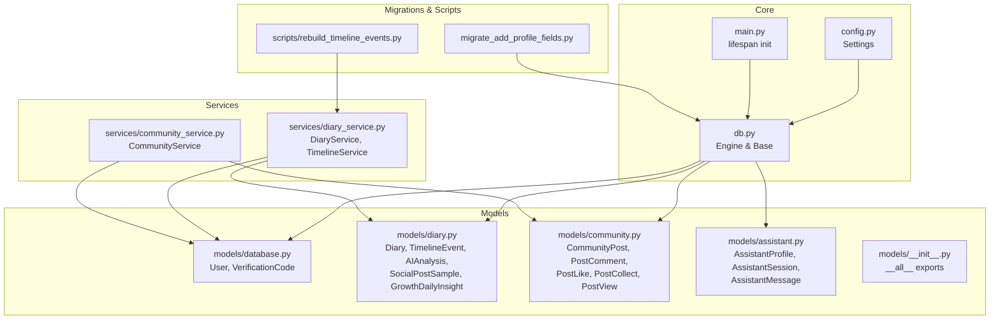

**Diagram sources**
- [main.py:19-40](file://backend/main.py#L19-L40)
- [db.py:26-58](file://backend/app/db.py#L26-L58)
- [config.py:22-26](file://backend/app/core/config.py#L22-L26)
- [database.py:13-70](file://backend/app/models/database.py#L13-L70)
- [diary.py:29-186](file://backend/app/models/diary.py#L29-186)
- [community.py:23-176](file://backend/app/models/community.py#L23-176)
- [assistant.py:13-78](file://backend/app/models/assistant.py#L13-78)
- [__init__.py:4-7](file://backend/app/models/__init__.py#L4-L7)
- [diary_service.py:66-637](file://backend/app/services/diary_service.py#L66-637)
- [community_service.py:13-415](file://backend/app/services/community_service.py#L13-415)
- [migrate_add_profile_fields.py:12-54](file://backend/migrate_add_profile_fields.py#L12-L54)
- [rebuild_timeline_events.py:19-59](file://backend/scripts/rebuild_timeline_events.py#L19-L59)

**Section sources**
- [main.py:19-40](file://backend/main.py#L19-L40)
- [db.py:26-58](file://backend/app/db.py#L26-L58)
- [config.py:22-26](file://backend/app/core/config.py#L22-L26)
- [database.py:13-70](file://backend/app/models/database.py#L13-L70)
- [diary.py:29-186](file://backend/app/models/diary.py#L29-186)
- [community.py:23-176](file://backend/app/models/community.py#L23-176)
- [assistant.py:13-78](file://backend/app/models/assistant.py#L13-78)
- [__init__.py:4-7](file://backend/app/models/__init__.py#L4-L7)
- [diary_service.py:66-637](file://backend/app/services/diary_service.py#L66-637)
- [community_service.py:13-415](file://backend/app/services/community_service.py#L13-415)
- [migrate_add_profile_fields.py:12-54](file://backend/migrate_add_profile_fields.py#L12-L54)
- [rebuild_timeline_events.py:19-59](file://backend/scripts/rebuild_timeline_events.py#L19-L59)

## Core Components
- Declarative Base and Session Management
  - Asynchronous engine configured via application settings.
  - Shared declarative base class for all models.
  - Dependency-injected async session factory for request-scoped operations.
- Database Initialization
  - Startup lifecycle initializes all tables by importing model modules and invoking metadata creation.
- Model Modules
  - Users and verification codes.
  - Diary, timeline events, AI analyses, social samples, and growth insights.
  - Community posts, comments, likes, collects, views.
  - Assistant profiles, sessions, and messages.
- Services
  - Encapsulate complex queries, joins, aggregations, and business rules for diary and community domains.

**Section sources**
- [db.py:11-28](file://backend/app/db.py#L11-L28)
- [db.py:31-43](file://backend/app/db.py#L31-L43)
- [db.py:45-58](file://backend/app/db.py#L45-L58)
- [main.py:22-25](file://backend/main.py#L22-L25)
- [database.py:13-70](file://backend/app/models/database.py#L13-L70)
- [diary.py:29-186](file://backend/app/models/diary.py#L29-186)
- [community.py:23-176](file://backend/app/models/community.py#L23-176)
- [assistant.py:13-78](file://backend/app/models/assistant.py#L13-78)
- [diary_service.py:66-637](file://backend/app/services/diary_service.py#L66-637)
- [community_service.py:13-415](file://backend/app/services/community_service.py#L13-415)

## Architecture Overview
The database architecture follows a layered pattern:
- Configuration supplies the database URL and debug flags.
- Engine and Base define the ORM foundation.
- Models declare tables, columns, indices, and foreign keys.
- Services orchestrate queries, enforce business rules, and maintain referential integrity.
- Lifecycle initialization ensures schema availability at startup.

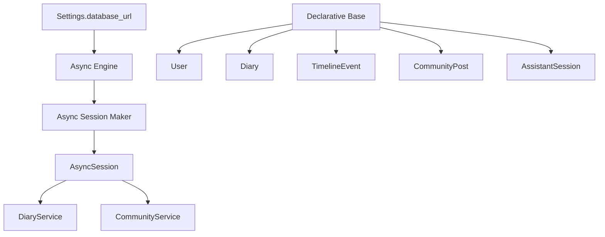

**Diagram sources**
- [config.py:22-26](file://backend/app/core/config.py#L22-L26)
- [db.py:11-28](file://backend/app/db.py#L11-L28)
- [db.py:19-23](file://backend/app/db.py#L19-L23)
- [db.py:31-43](file://backend/app/db.py#L31-L43)
- [database.py:13-41](file://backend/app/models/database.py#L13-L41)
- [diary.py:29-99](file://backend/app/models/diary.py#L29-99)
- [diary.py:67-133](file://backend/app/models/diary.py#L67-133)
- [community.py:23-57](file://backend/app/models/community.py#L23-57)
- [assistant.py:36-54](file://backend/app/models/assistant.py#L36-54)
- [diary_service.py:66-637](file://backend/app/services/diary_service.py#L66-637)
- [community_service.py:13-415](file://backend/app/services/community_service.py#L13-415)

## Detailed Component Analysis

### Declarative Base and Initialization
- Base class is a thin wrapper for SQLAlchemy’s DeclarativeBase.
- Async engine supports SQLite and PostgreSQL via URL scheme.
- Session factory provides per-request AsyncSession instances.
- Initialization imports all model modules to register them with Base.metadata, then creates all tables.

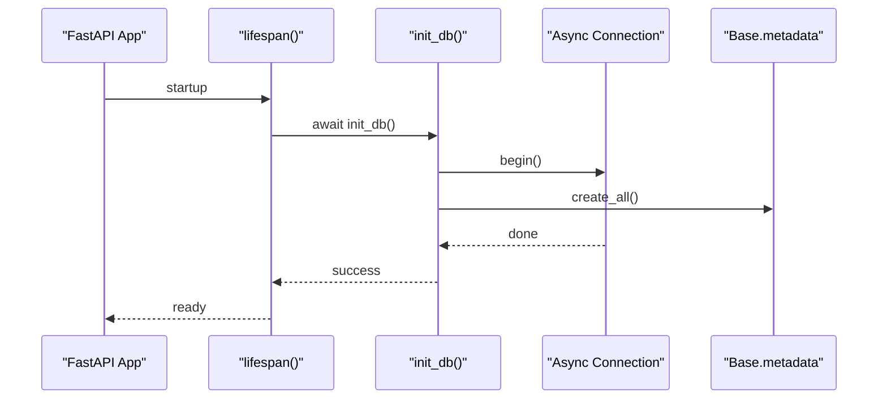

**Diagram sources**
- [main.py:22-25](file://backend/main.py#L22-L25)
- [db.py:45-58](file://backend/app/db.py#L45-L58)

**Section sources**
- [db.py:26-28](file://backend/app/db.py#L26-L28)
- [db.py:11-16](file://backend/app/db.py#L11-L16)
- [db.py:19-23](file://backend/app/db.py#L19-L23)
- [db.py:31-43](file://backend/app/db.py#L31-L43)
- [db.py:45-58](file://backend/app/db.py#L45-L58)
- [main.py:22-25](file://backend/main.py#L22-L25)

### Models Overview and Relationships

#### User and VerificationCode
- User table stores authentication and profile attributes with JSON fields for lists.
- VerificationCode table stores one-time codes with expiration and usage tracking.
- Both include timestamps and indexes on frequently filtered columns.

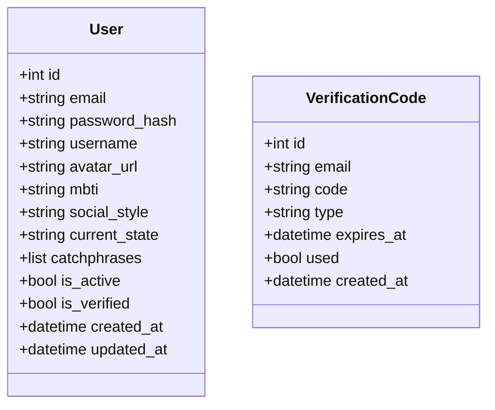

**Diagram sources**
- [database.py:13-41](file://backend/app/models/database.py#L13-L41)
- [database.py:47-69](file://backend/app/models/database.py#L47-L69)

**Section sources**
- [database.py:13-41](file://backend/app/models/database.py#L13-L41)
- [database.py:47-69](file://backend/app/models/database.py#L47-L69)

#### Diary and TimelineEvent
- Diary belongs to User; indexed user_id and diary_date for filtering.
- TimelineEvent belongs to User; optional foreign key to Diary with SET NULL on delete.
- TimelineEvent includes indexes on user_id, event_date, and emotion_tag.
- AIAnalysis references both User and Diary uniquely by diary_id.
- SocialPostSample and GrowthDailyInsight provide auxiliary data with constraints.

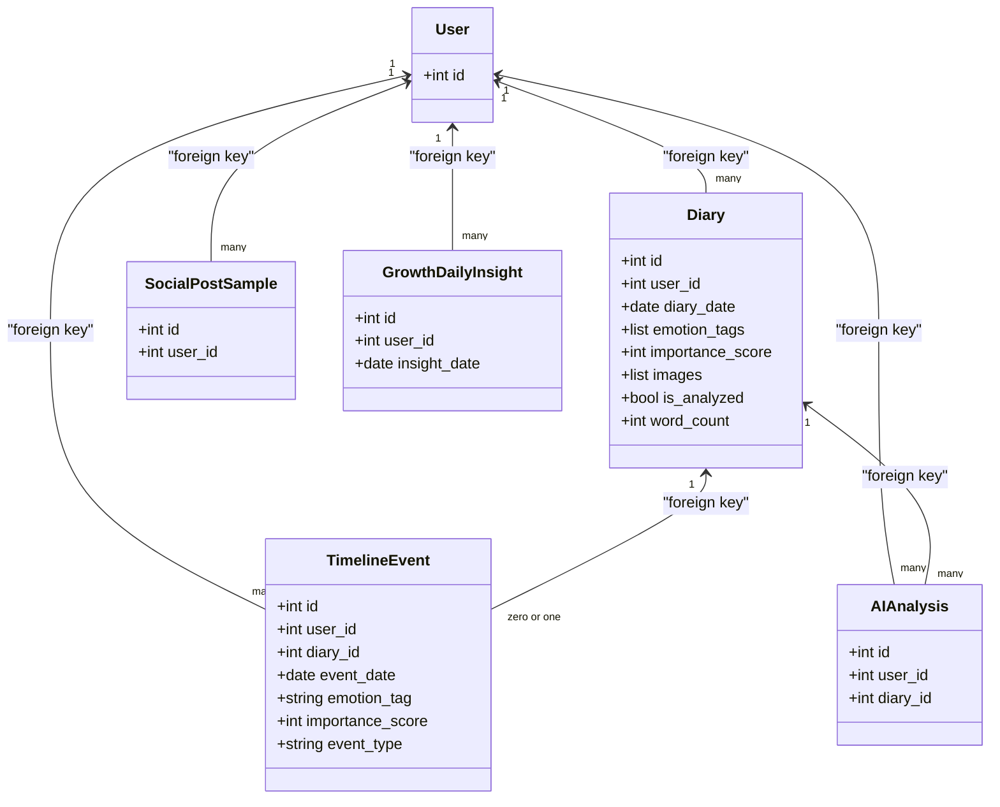

**Diagram sources**
- [diary.py:29-64](file://backend/app/models/diary.py#L29-64)
- [diary.py:67-99](file://backend/app/models/diary.py#L67-99)
- [diary.py:102-133](file://backend/app/models/diary.py#L102-133)
- [diary.py:135-154](file://backend/app/models/diary.py#L135-154)
- [diary.py:156-185](file://backend/app/models/diary.py#L156-185)

**Section sources**
- [diary.py:29-64](file://backend/app/models/diary.py#L29-64)
- [diary.py:67-99](file://backend/app/models/diary.py#L67-99)
- [diary.py:102-133](file://backend/app/models/diary.py#L102-133)
- [diary.py:135-154](file://backend/app/models/diary.py#L135-154)
- [diary.py:156-185](file://backend/app/models/diary.py#L156-185)

#### Community Domain
- CommunityPost belongs to User and Circle; counts maintained in-app.
- PostComment belongs to Post and User; hierarchical replies supported.
- PostLike and PostCollect enforce uniqueness via composite unique constraints.
- PostView records last-viewed timestamps per post per user.

```mermaid
classDiagram
class User {
+int id
}
class CommunityPost {
+int id
+int user_id
+string circle_id
+int like_count
+int comment_count
+int collect_count
}
class PostComment {
+int id
+int post_id
+int user_id
+int parent_id
}
class PostLike {
+int id
+int user_id
+int post_id
}
class PostCollect {
+int id
+int user_id
+int post_id
}
class PostView {
+int id
+int user_id
+int post_id
}
User "1" <-- "many" CommunityPost : "foreign key"
CommunityPost "1" <-- "many" PostComment : "foreign key"
User "1" <-- "many" PostComment : "foreign key"
User "1" <-- "many" PostLike : "foreign key"
CommunityPost "1" <-- "many" PostLike : "foreign key"
User "1" <-- "many" PostCollect : "foreign key"
CommunityPost "1" <-- "many" PostCollect : "foreign key"
User "1" <-- "many" PostView : "foreign key"
CommunityPost "1" <-- "many" PostView : "foreign key"
```

**Diagram sources**
- [community.py:23-57](file://backend/app/models/community.py#L23-57)
- [community.py:60-92](file://backend/app/models/community.py#L60-92)
- [community.py:94-121](file://backend/app/models/community.py#L94-121)
- [community.py:123-150](file://backend/app/models/community.py#L123-150)
- [community.py:152-176](file://backend/app/models/community.py#L152-176)

**Section sources**
- [community.py:23-57](file://backend/app/models/community.py#L23-57)
- [community.py:60-92](file://backend/app/models/community.py#L60-92)
- [community.py:94-121](file://backend/app/models/community.py#L94-121)
- [community.py:123-150](file://backend/app/models/community.py#L123-150)
- [community.py:152-176](file://backend/app/models/community.py#L152-176)

#### Assistant Domain
- AssistantProfile links to User with a unique constraint.
- AssistantSession belongs to User; AssistantMessage belongs to Session and User.

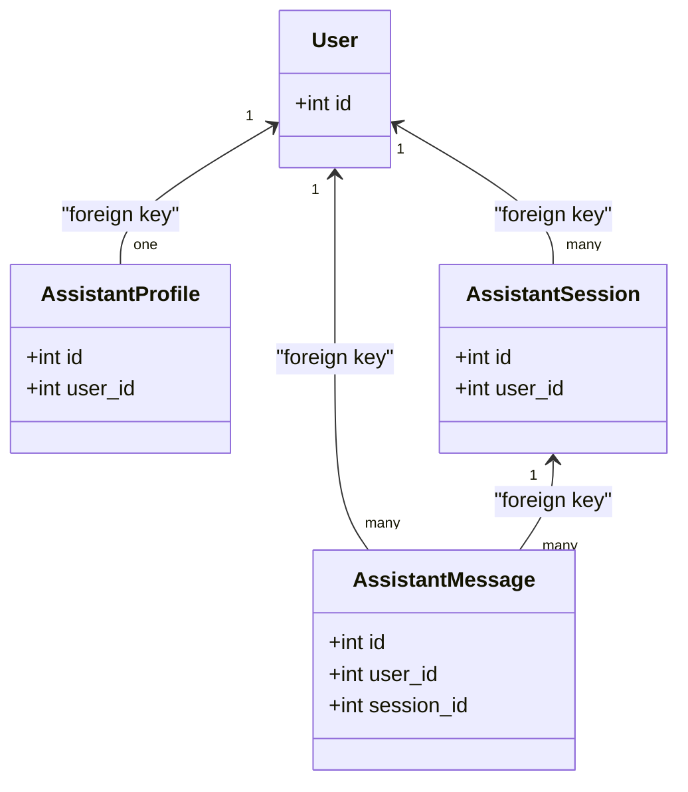

**Diagram sources**
- [assistant.py:13-34](file://backend/app/models/assistant.py#L13-34)
- [assistant.py:36-54](file://backend/app/models/assistant.py#L36-54)
- [assistant.py:57-78](file://backend/app/models/assistant.py#L57-78)

**Section sources**
- [assistant.py:13-34](file://backend/app/models/assistant.py#L13-34)
- [assistant.py:36-54](file://backend/app/models/assistant.py#L36-54)
- [assistant.py:57-78](file://backend/app/models/assistant.py#L57-78)

### Query Patterns, Indexing, and Business Rules

#### Diary Queries
- Filtering by user_id and date range, with JSON containment for emotion_tags.
- Aggregation of counts and pagination with ordering by date and creation time.
- Upsert-like behavior for timeline events keyed by diary_id and user_id.
- Isolation checks to prevent cross-user access to related diaries.

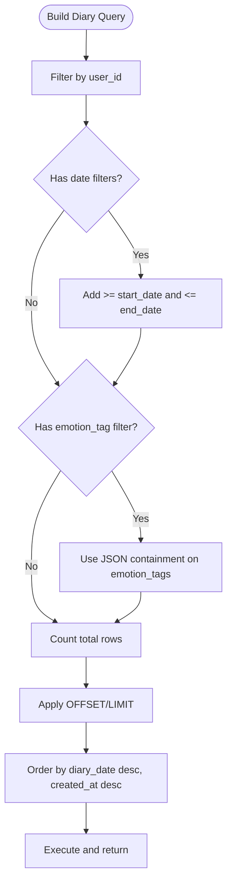

**Diagram sources**
- [diary_service.py:134-187](file://backend/app/services/diary_service.py#L134-L187)

**Section sources**
- [diary_service.py:134-187](file://backend/app/services/diary_service.py#L134-L187)
- [diary_service.py:281-637](file://backend/app/services/diary_service.py#L281-637)

#### Timeline Queries
- Dual isolation: user_id match and optional diary ownership check.
- Subqueries to ensure timeline entries referencing diaries belong to the same user.
- Aggregation of recent events with configurable windows.

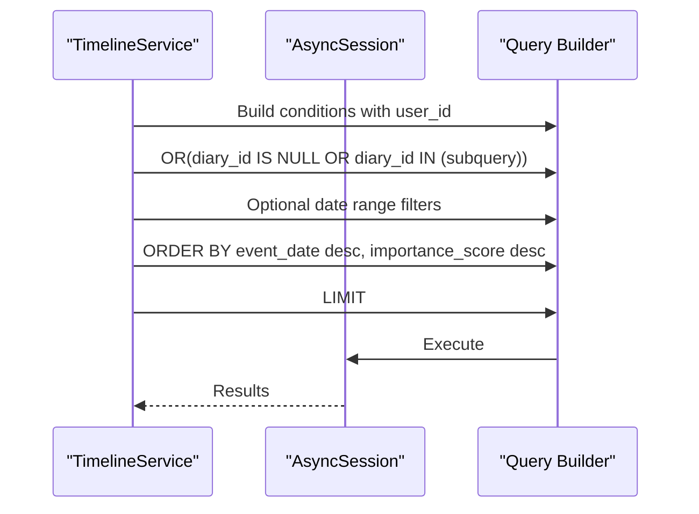

**Diagram sources**
- [diary_service.py:524-570](file://backend/app/services/diary_service.py#L524-L570)

**Section sources**
- [diary_service.py:524-570](file://backend/app/services/diary_service.py#L524-L570)

#### Community Queries
- Count circles with post counts via aggregation.
- Join-based retrieval of collected posts with ordering by collection time.
- Subquery to deduplicate and order user view history by last viewed timestamp.

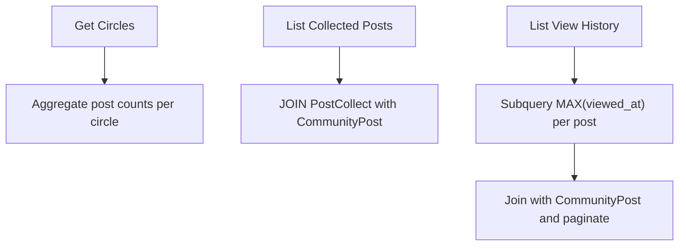

**Diagram sources**
- [community_service.py:18-32](file://backend/app/services/community_service.py#L18-32)
- [community_service.py:281-306](file://backend/app/services/community_service.py#L281-306)
- [community_service.py:315-345](file://backend/app/services/community_service.py#L315-345)

**Section sources**
- [community_service.py:18-32](file://backend/app/services/community_service.py#L18-32)
- [community_service.py:281-306](file://backend/app/services/community_service.py#L281-306)
- [community_service.py:315-345](file://backend/app/services/community_service.py#L315-345)

### Migration Strategies and Schema Evolution
- Alembic is included in requirements for formal migrations.
- A standalone migration script demonstrates adding columns to users table safely.
- Database initialization at startup registers all models and creates tables.

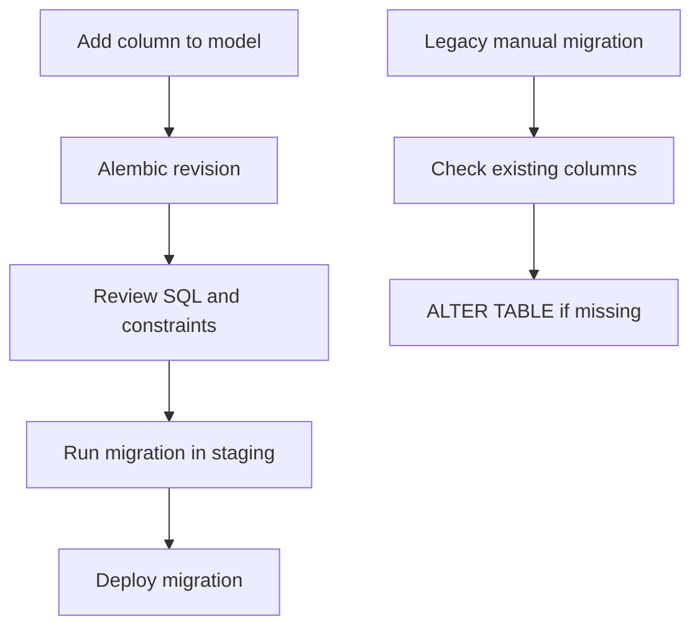

**Diagram sources**
- [requirements.txt:9](file://backend/requirements.txt#L9)
- [migrate_add_profile_fields.py:12-54](file://backend/migrate_add_profile_fields.py#L12-L54)
- [db.py:45-58](file://backend/app/db.py#L45-L58)

**Section sources**
- [requirements.txt:9](file://backend/requirements.txt#L9)
- [migrate_add_profile_fields.py:12-54](file://backend/migrate_add_profile_fields.py#L12-L54)
- [db.py:45-58](file://backend/app/db.py#L45-L58)

## Dependency Analysis
- External dependencies include SQLAlchemy 2.x, aiosqlite, and Alembic.
- Internal dependencies are minimal and centralized in models and services.
- No circular dependencies observed among models; services depend on models and sessions.

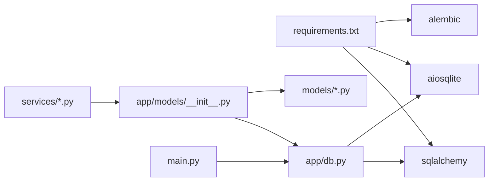

**Diagram sources**
- [requirements.txt:7-9](file://backend/requirements.txt#L7-L9)
- [db.py:6-7](file://backend/app/db.py#L6-L7)
- [__init__.py:4-7](file://backend/app/models/__init__.py#L4-L7)
- [main.py:13](file://backend/main.py#L13)

**Section sources**
- [requirements.txt:7-9](file://backend/requirements.txt#L7-L9)
- [db.py:6-7](file://backend/app/db.py#L6-L7)
- [__init__.py:4-7](file://backend/app/models/__init__.py#L4-L7)
- [main.py:13](file://backend/main.py#L13)

## Performance Considerations
- Indexes on frequently filtered columns (user_id, diary_date, event_date, emotion_tag, circle_id) improve query performance.
- JSON fields used for lists and dictionaries require careful containment queries; consider normalized structures if cardinality grows.
- Pagination with OFFSET/LIMIT is straightforward but can degrade for very large pages; consider keyset pagination for heavy workloads.
- Unique constraints on likes/collects prevent duplicates and support efficient existence checks.
- Subqueries for isolation and view history reduce redundant scans and improve correctness.

[No sources needed since this section provides general guidance]

## Troubleshooting Guide
- Database initialization errors
  - Ensure settings.database_url is set and accessible.
  - Verify that model modules are imported during init_db.
- Session lifecycle issues
  - Use the dependency-injected get_db generator to ensure proper close semantics.
- Migration failures
  - Prefer Alembic for structured migrations; fallback manual scripts should check existing columns before ALTER TABLE.
- Cross-user data exposure
  - Timeline queries include subqueries to ensure diary_id references belong to the requesting user.

**Section sources**
- [config.py:22-26](file://backend/app/core/config.py#L22-L26)
- [db.py:45-58](file://backend/app/db.py#L45-L58)
- [db.py:31-43](file://backend/app/db.py#L31-L43)
- [migrate_add_profile_fields.py:12-54](file://backend/migrate_add_profile_fields.py#L12-L54)
- [diary_service.py:545-555](file://backend/app/services/diary_service.py#L545-L555)

## Conclusion
The 映记 backend employs a clean, modular SQLAlchemy ORM architecture with asynchronous sessions, explicit indexing, and robust initialization. Services encapsulate complex queries and enforce business rules, ensuring data integrity and predictable performance. Formal migrations via Alembic are recommended for production-grade schema evolution, complemented by targeted manual scripts for legacy adjustments.

[No sources needed since this section summarizes without analyzing specific files]

## Appendices

### Appendix A: Example Complex Queries and Aggregations
- Diary listing with date range and emotion tag filtering, plus total count aggregation.
- Timeline retrieval with dual isolation and subquery-based date bounds.
- Community circle counts via aggregation and collected posts via join with ordering.
- View history deduplication using a subquery to select the latest view per post.

**Section sources**
- [diary_service.py:134-187](file://backend/app/services/diary_service.py#L134-L187)
- [diary_service.py:524-570](file://backend/app/services/diary_service.py#L524-L570)
- [community_service.py:18-32](file://backend/app/services/community_service.py#L18-32)
- [community_service.py:281-306](file://backend/app/services/community_service.py#L281-306)
- [community_service.py:315-345](file://backend/app/services/community_service.py#L315-345)

### Appendix B: Data Validation and Integrity Mechanisms
- Foreign keys with cascading and SET NULL behaviors.
- Unique constraints on likes/collects and growth daily insights.
- JSON fields validated by service logic; list normalization via custom TypeDecorator in models.
- Defensive checks in services to prevent cross-user access.

**Section sources**
- [diary.py:34-38](file://backend/app/models/diary.py#L34-L38)
- [diary.py:78-82](file://backend/app/models/diary.py#L78-L82)
- [diary.py:117-119](file://backend/app/models/diary.py#L117-L119)
- [diary.py:159-161](file://backend/app/models/diary.py#L159-L161)
- [community.py:97-99](file://backend/app/models/community.py#L97-L99)
- [community.py:126-128](file://backend/app/models/community.py#L126-L128)
- [diary.py:13-27](file://backend/app/models/diary.py#L13-L27)
- [diary_service.py:301-314](file://backend/app/services/diary_service.py#L301-L314)