# Security Architecture

<cite>
**Referenced Files in This Document**
- [main.py](file://backend/main.py)
- [config.py](file://backend/app/core/config.py)
- [security.py](file://backend/app/core/security.py)
- [deps.py](file://backend/app/core/deps.py)
- [auth.py](file://backend/app/api/v1/auth.py)
- [auth_service.py](file://backend/app/services/auth_service.py)
- [database.py](file://backend/app/models/database.py)
- [auth_schemas.py](file://backend/app/schemas/auth.py)
- [email_service.py](file://backend/app/services/email_service.py)
- [db.py](file://backend/app/db.py)
- [requirements.txt](file://backend/requirements.txt)
- [test_security.py](file://backend/tests/test_security.py)
</cite>

## Table of Contents
1. [Introduction](#introduction)
2. [Project Structure](#project-structure)
3. [Core Components](#core-components)
4. [Architecture Overview](#architecture-overview)
5. [Detailed Component Analysis](#detailed-component-analysis)
6. [Dependency Analysis](#dependency-analysis)
7. [Performance Considerations](#performance-considerations)
8. [Troubleshooting Guide](#troubleshooting-guide)
9. [Conclusion](#conclusion)
10. [Appendices](#appendices)

## Introduction
This document presents the security architecture of the 映记 backend system. It focuses on the JWT-based authentication system, password hashing with bcrypt, session management, user authorization patterns, CORS configuration, CSRF protection posture, input validation strategies, dependency injection patterns for security services, middleware implementation, rate limiting, brute force protection, and security headers configuration. It also provides examples of secure API endpoint implementation, error handling for security violations, and security best practices for development and deployment.

## Project Structure
The security-relevant parts of the backend are organized around:
- Application entry and middleware configuration (CORS)
- Core security utilities (JWT and bcrypt)
- Dependency injection for authentication and authorization
- Authentication API endpoints and service logic
- Data models for users and verification codes
- Email service for verification code delivery
- Configuration management for secrets and policies
- Tests validating security primitives

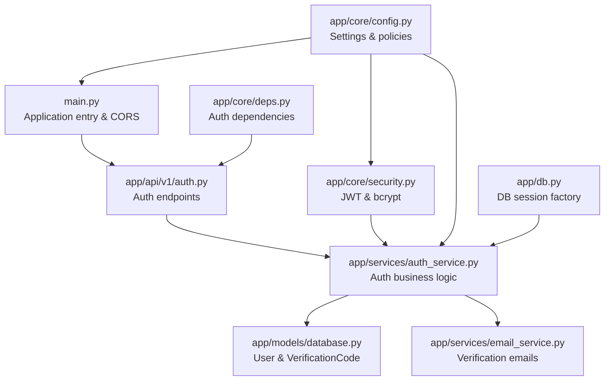

**Diagram sources**
- [main.py:43-87](file://backend/main.py#L43-L87)
- [auth.py:22-316](file://backend/app/api/v1/auth.py#L22-L316)
- [auth_service.py:16-358](file://backend/app/services/auth_service.py#L16-L358)
- [database.py:13-70](file://backend/app/models/database.py#L13-L70)
- [email_service.py:25-226](file://backend/app/services/email_service.py#L25-L226)
- [security.py:1-92](file://backend/app/core/security.py#L1-L92)
- [deps.py:18-103](file://backend/app/core/deps.py#L18-L103)
- [config.py:10-105](file://backend/app/core/config.py#L10-L105)
- [db.py:31-59](file://backend/app/db.py#L31-L59)

**Section sources**
- [main.py:43-87](file://backend/main.py#L43-L87)
- [config.py:10-105](file://backend/app/core/config.py#L10-L105)

## Core Components
- JWT-based authentication: token creation, decoding, and expiration handling.
- Password hashing: bcrypt via passlib.
- Session management: FastAPI async SQLAlchemy sessions.
- Authorization: bearer token extraction and user resolution.
- Rate limiting: per-user verification code requests.
- Brute force protection: account lockout via user activation flag and verification code expiry.
- Input validation: Pydantic schemas with field constraints.
- CORS: configured origins from settings.
- CSRF protection: absence of CSRF middleware; client-side CSRF protection recommended.
- Security headers: absence of security headers; recommended additions included in best practices.

**Section sources**
- [security.py:16-92](file://backend/app/core/security.py#L16-L92)
- [auth_service.py:19-358](file://backend/app/services/auth_service.py#L19-L358)
- [deps.py:18-103](file://backend/app/core/deps.py#L18-L103)
- [auth_schemas.py:10-106](file://backend/app/schemas/auth.py#L10-L106)
- [main.py:50-57](file://backend/main.py#L50-L57)

## Architecture Overview
The authentication flow integrates FastAPI routing, dependency injection, service-layer logic, and persistence. The diagram below maps the end-to-end authentication flow from request to response.

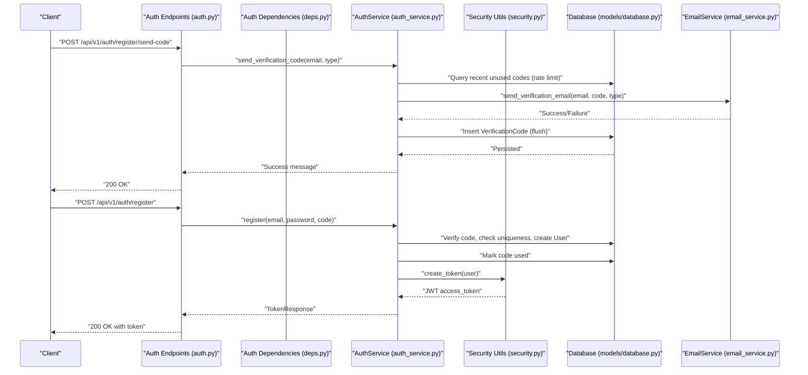

**Diagram sources**
- [auth.py:25-126](file://backend/app/api/v1/auth.py#L25-L126)
- [auth_service.py:19-201](file://backend/app/services/auth_service.py#L19-L201)
- [security.py:43-71](file://backend/app/core/security.py#L43-L71)
- [database.py:13-70](file://backend/app/models/database.py#L13-L70)
- [email_service.py:48-155](file://backend/app/services/email_service.py#L48-L155)

## Detailed Component Analysis

### JWT Authentication System
- Token generation: Uses HS256 with a secret key from settings. Expiration is configurable in minutes.
- Token decoding: Validates signature and checks expiration; returns None on failure.
- Token consumption: Bearer scheme via HTTPBearer dependency; resolves user by sub claim.

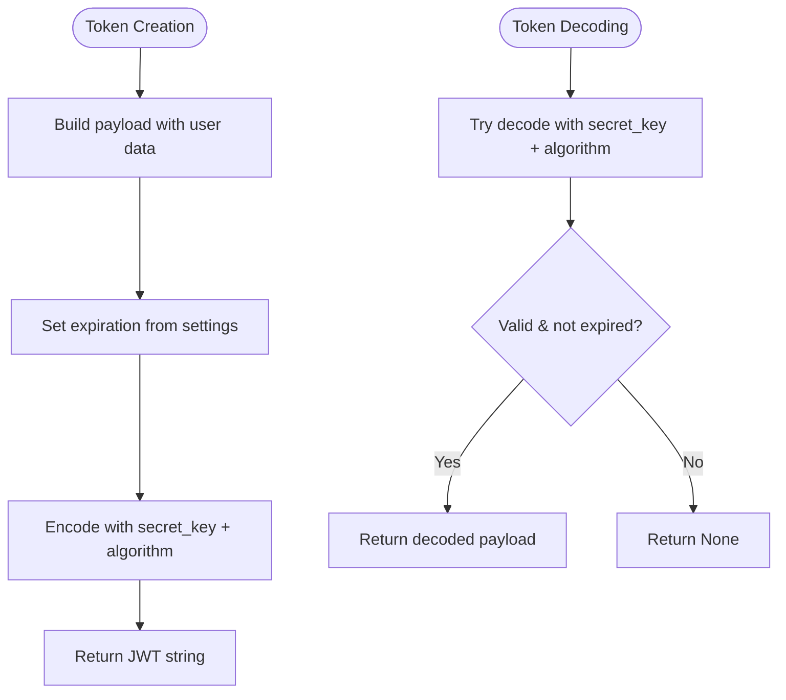

**Diagram sources**
- [security.py:43-92](file://backend/app/core/security.py#L43-L92)
- [config.py:28-38](file://backend/app/core/config.py#L28-L38)

**Section sources**
- [security.py:43-92](file://backend/app/core/security.py#L43-L92)
- [deps.py:18-66](file://backend/app/core/deps.py#L18-L66)
- [auth_service.py:342-354](file://backend/app/services/auth_service.py#L342-L354)

### Password Hashing with bcrypt
- Password hashing uses passlib with bcrypt scheme.
- Verification compares plaintext against stored hash.
- Tests confirm bcrypt prefix and fixed-length hashes.

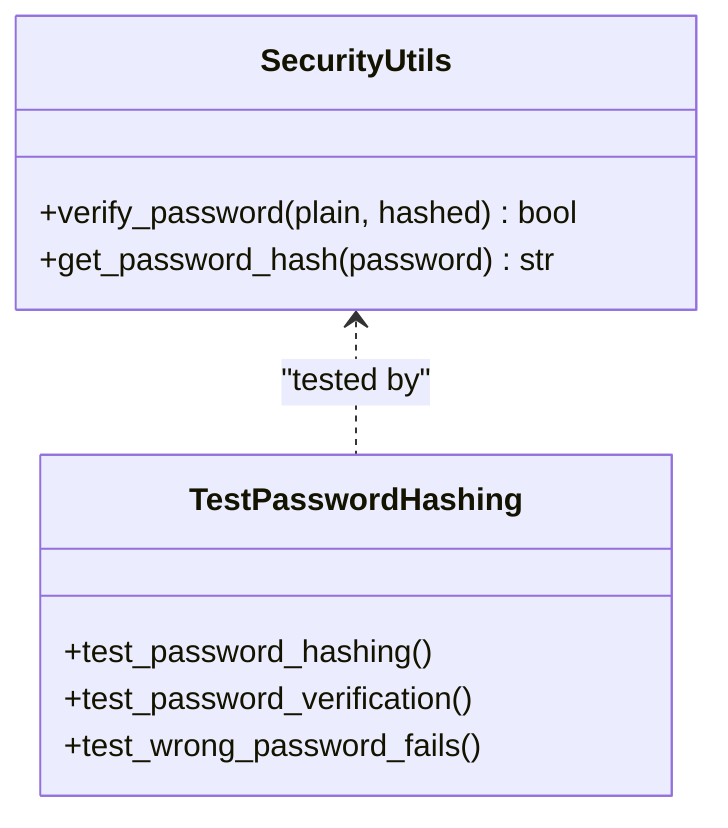

**Diagram sources**
- [security.py:16-41](file://backend/app/core/security.py#L16-L41)
- [test_security.py:15-46](file://backend/tests/test_security.py#L15-L46)

**Section sources**
- [security.py:16-41](file://backend/app/core/security.py#L16-L41)
- [test_security.py:15-46](file://backend/tests/test_security.py#L15-L46)

### Session Management
- Asynchronous SQLAlchemy sessions are provided via a dependency factory.
- Sessions are created per-request and closed automatically.

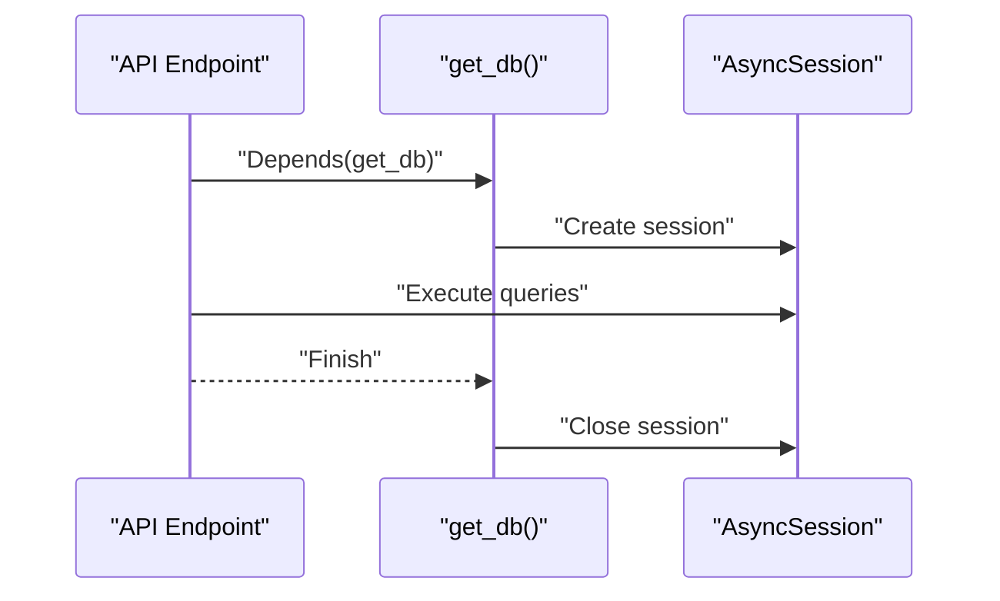

**Diagram sources**
- [db.py:31-43](file://backend/app/db.py#L31-L43)

**Section sources**
- [db.py:31-43](file://backend/app/db.py#L31-L43)

### User Authorization Patterns
- Bearer token extraction via HTTPBearer.
- Current user resolution validates token and loads user from DB.
- Active user check denies access for disabled accounts.

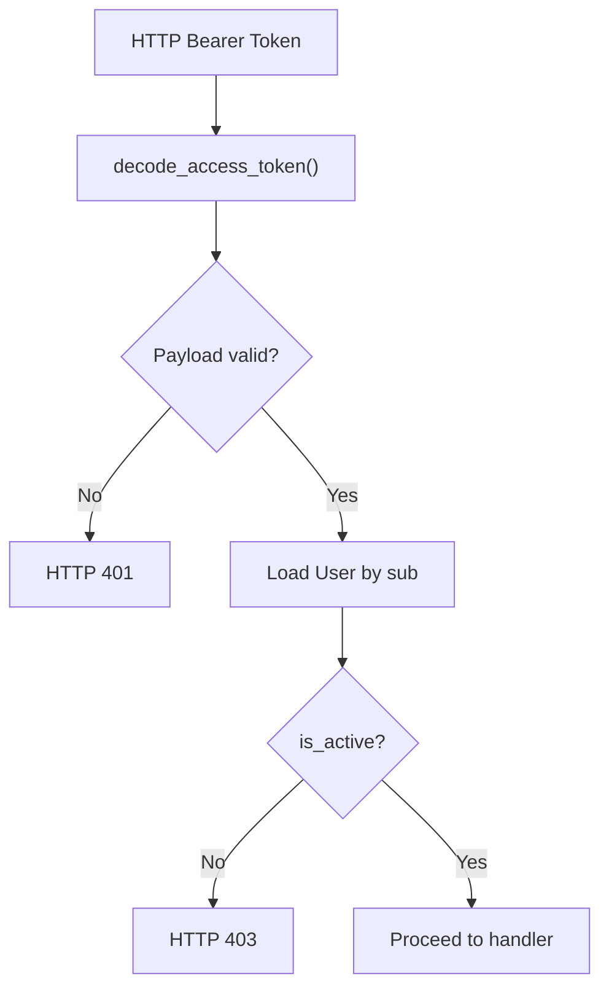

**Diagram sources**
- [deps.py:18-66](file://backend/app/core/deps.py#L18-L66)
- [security.py:73-92](file://backend/app/core/security.py#L73-L92)

**Section sources**
- [deps.py:18-66](file://backend/app/core/deps.py#L18-L66)

### CORS Configuration
- Origins are parsed from settings and applied to the CORSMiddleware.
- Credentials, methods, and headers are permitted broadly.

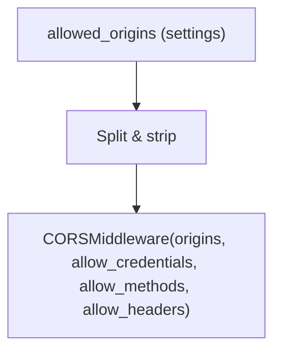

**Diagram sources**
- [config.py:17-20](file://backend/app/core/config.py#L17-L20)
- [config.py:98-100](file://backend/app/core/config.py#L98-L100)
- [main.py:50-57](file://backend/main.py#L50-L57)

**Section sources**
- [config.py:17-20](file://backend/app/core/config.py#L17-L20)
- [config.py:98-100](file://backend/app/core/config.py#L98-L100)
- [main.py:50-57](file://backend/main.py#L50-L57)

### CSRF Protection
- No CSRF middleware is configured in the application.
- Recommendation: Add CSRF middleware or rely on token-based auth with strict SameSite cookies and origin checks.

[No sources needed since this section provides general guidance]

### Input Validation Strategies
- Pydantic schemas enforce field types, lengths, and optional patterns.
- Examples include email validation, fixed-length verification codes, and minimum password lengths.

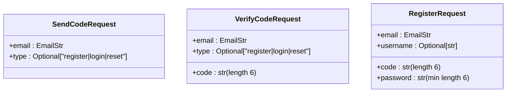

**Diagram sources**
- [auth_schemas.py:10-37](file://backend/app/schemas/auth.py#L10-L37)

**Section sources**
- [auth_schemas.py:10-37](file://backend/app/schemas/auth.py#L10-L37)
- [test_security.py:113-164](file://backend/tests/test_security.py#L113-L164)

### Dependency Injection Patterns for Security Services
- Centralized dependencies for bearer auth and current user retrieval.
- Service layer encapsulates business logic and interacts with models and external services.

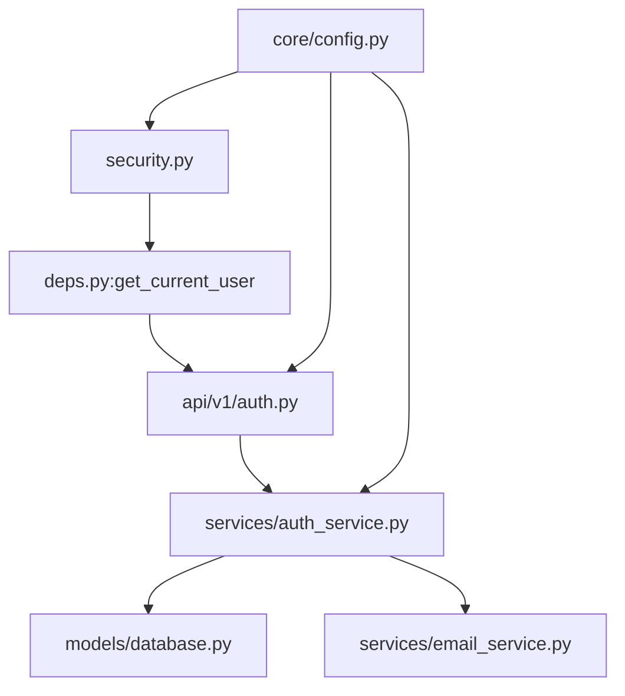

**Diagram sources**
- [deps.py:18-66](file://backend/app/core/deps.py#L18-L66)
- [auth.py:22-316](file://backend/app/api/v1/auth.py#L22-L316)
- [auth_service.py:16-358](file://backend/app/services/auth_service.py#L16-L358)
- [database.py:13-70](file://backend/app/models/database.py#L13-L70)
- [email_service.py:25-226](file://backend/app/services/email_service.py#L25-L226)
- [config.py:10-105](file://backend/app/core/config.py#L10-L105)

**Section sources**
- [deps.py:18-66](file://backend/app/core/deps.py#L18-L66)
- [auth.py:22-316](file://backend/app/api/v1/auth.py#L22-L316)
- [auth_service.py:16-358](file://backend/app/services/auth_service.py#L16-L358)

### Middleware Implementation
- CORS middleware is registered at application startup.
- No additional security middleware (e.g., CSRF) is present.

**Section sources**
- [main.py:50-57](file://backend/main.py#L50-L57)

### Rate Limiting and Brute Force Protection
- Verification code requests are rate-limited per email and type within a rolling 5-minute window.
- Verification codes expire after a short period, mitigating brute force reuse.
- User account status (active) blocks access for disabled users.

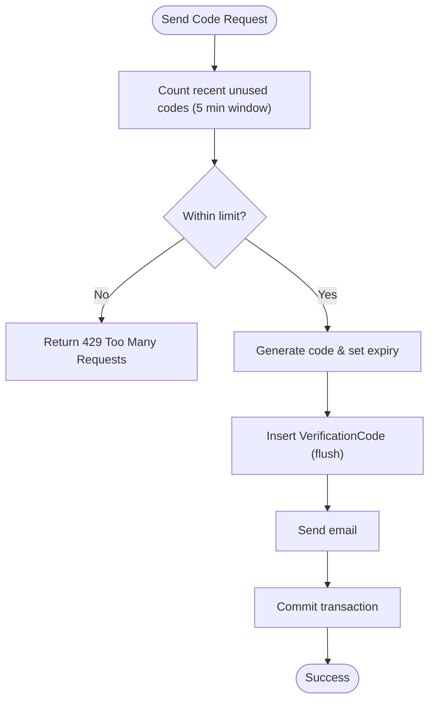

**Diagram sources**
- [auth_service.py:19-98](file://backend/app/services/auth_service.py#L19-L98)
- [config.py:52-60](file://backend/app/core/config.py#L52-L60)

**Section sources**
- [auth_service.py:19-98](file://backend/app/services/auth_service.py#L19-L98)
- [config.py:52-60](file://backend/app/core/config.py#L52-L60)

### Security Headers Configuration
- Not currently configured in the application.
- Recommended additions include Content-Security-Policy, X-Frame-Options, X-Content-Type-Options, and HSTS.

[No sources needed since this section provides general guidance]

### Secure API Endpoint Implementation Example
- Registration flow demonstrates secure handling of verification codes, password hashing, and token issuance.
- Login endpoints support both code-based and password-based authentication.
- Error responses use appropriate HTTP status codes and messages.

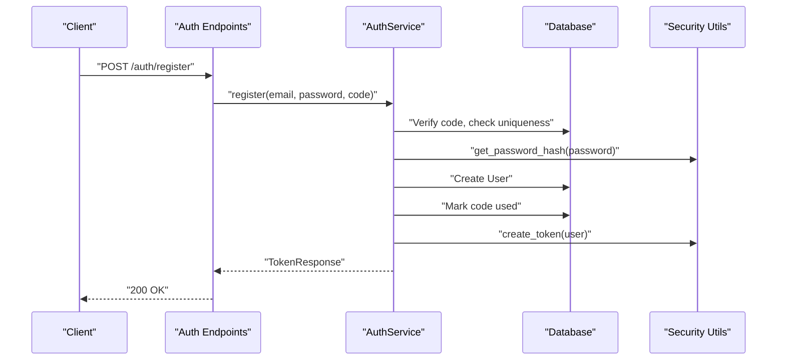

**Diagram sources**
- [auth.py:88-126](file://backend/app/api/v1/auth.py#L88-L126)
- [auth_service.py:142-201](file://backend/app/services/auth_service.py#L142-L201)
- [security.py:30-41](file://backend/app/core/security.py#L30-L41)
- [security.py:43-71](file://backend/app/core/security.py#L43-L71)

**Section sources**
- [auth.py:88-126](file://backend/app/api/v1/auth.py#L88-L126)
- [auth_service.py:142-201](file://backend/app/services/auth_service.py#L142-L201)

### Error Handling for Security Violations
- Authentication failures return 401 with WWW-Authenticate header.
- Disabled or inactive users receive 403.
- Verification errors return 400; rate-limit exceeded returns 429.
- Tests validate proper error responses and validation behavior.

**Section sources**
- [deps.py:35-66](file://backend/app/core/deps.py#L35-L66)
- [auth.py:36-53](file://backend/app/api/v1/auth.py#L36-L53)
- [auth_service.py:131-140](file://backend/app/services/auth_service.py#L131-L140)
- [test_security.py:113-164](file://backend/tests/test_security.py#L113-L164)

## Dependency Analysis
External dependencies relevant to security include FastAPI, python-jose for JWT, passlib for bcrypt, and pydantic/pydantic-settings for configuration and validation.

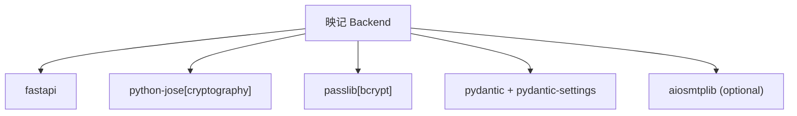

**Diagram sources**
- [requirements.txt:2-26](file://backend/requirements.txt#L2-L26)

**Section sources**
- [requirements.txt:2-26](file://backend/requirements.txt#L2-L26)

## Performance Considerations
- JWT decoding is lightweight; avoid excessive token payloads.
- bcrypt hashing cost can be tuned via passlib configuration if needed.
- Database queries for verification codes and users should leverage indexes on email and verification code fields.
- Email sending is asynchronous when available; otherwise executed in thread pool.

[No sources needed since this section provides general guidance]

## Troubleshooting Guide
Common issues and resolutions:
- Invalid or expired tokens: Ensure correct secret key and algorithm match configuration; verify expiration timing.
- Authentication failures: Confirm Bearer token presence and validity; check user activation status.
- Verification code errors: Validate code length and type; ensure code is not expired or already used.
- Rate limit exceeded: Implement client-side backoff and reduce request frequency.
- CORS issues: Verify allowed origins and credentials configuration.

**Section sources**
- [security.py:73-92](file://backend/app/core/security.py#L73-L92)
- [deps.py:35-66](file://backend/app/core/deps.py#L35-L66)
- [auth_service.py:118-140](file://backend/app/services/auth_service.py#L118-L140)
- [config.py:98-100](file://backend/app/core/config.py#L98-L100)

## Conclusion
The 映记 backend implements a robust JWT-based authentication system with bcrypt password hashing, strong input validation, and rate limiting for verification codes. Authorization relies on bearer tokens resolved to active users. While CORS is configured, CSRF protection and security headers are not yet implemented and should be added. The modular design with dependency injection supports maintainable security practices.

[No sources needed since this section summarizes without analyzing specific files]

## Appendices

### Best Practices Checklist
- Enforce CSRF protection via middleware or token-based strategies.
- Add security headers (CSP, X-Frame-Options, X-Content-Type-Options, HSTS).
- Reduce access token lifetime and introduce refresh token rotation.
- Strengthen password policy (minimum 8 characters, mixed character sets).
- Harden verification code storage and comparison to prevent timing attacks.
- Monitor and log authentication events for anomaly detection.

[No sources needed since this section provides general guidance]