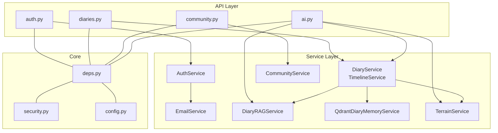
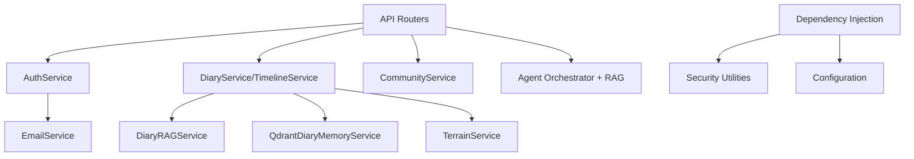
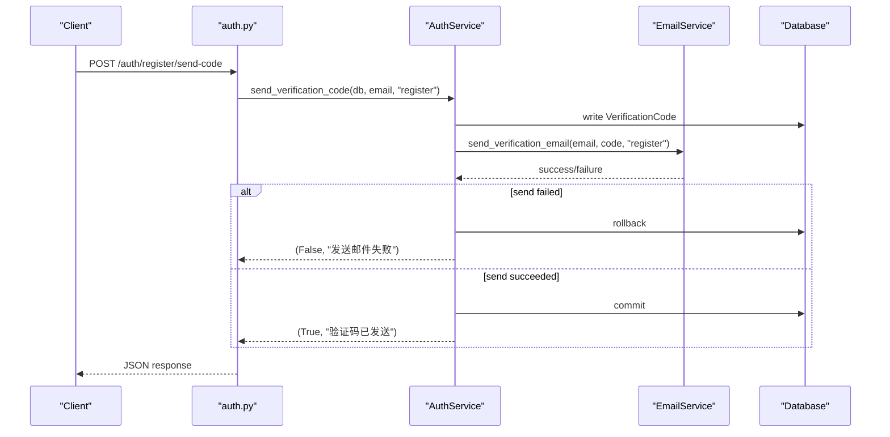
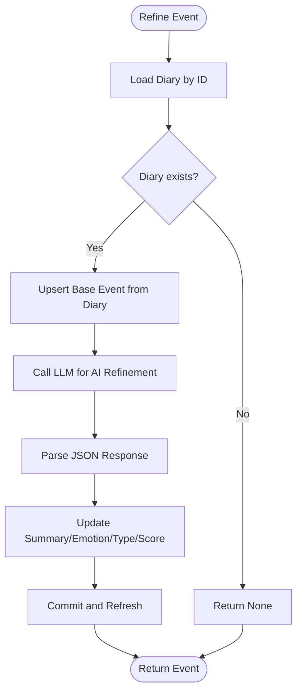
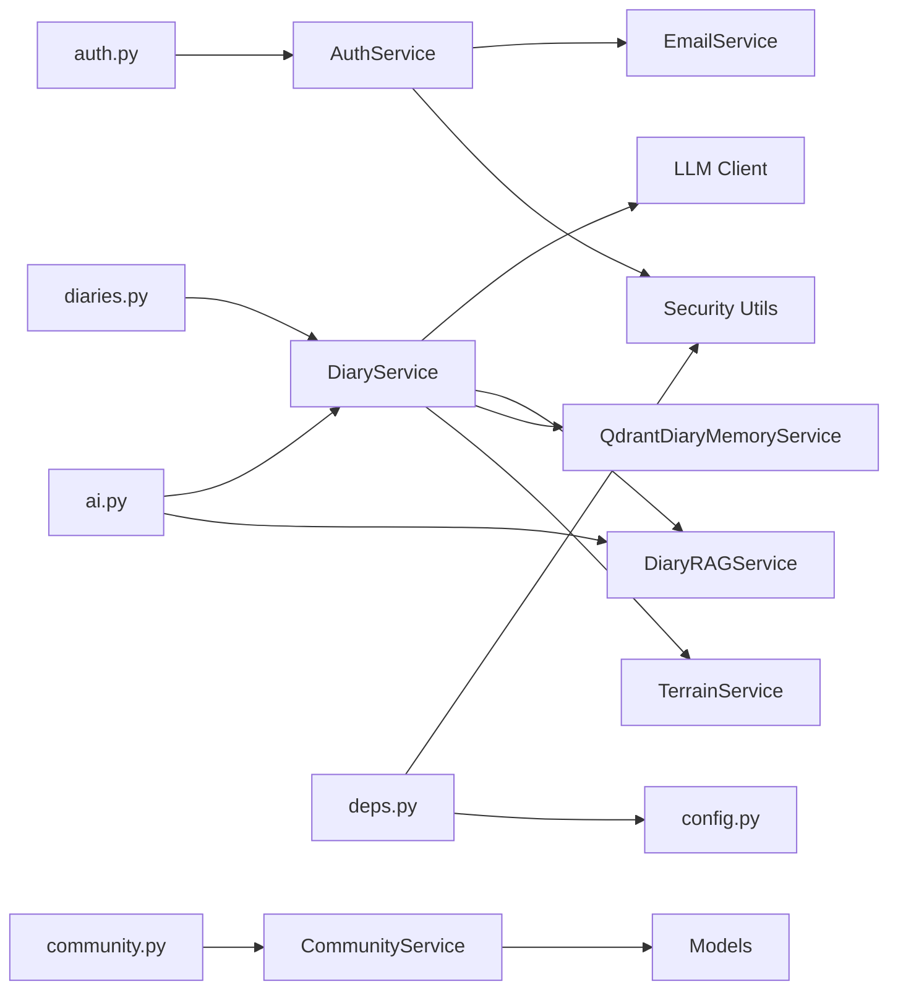

# Service Layer

<cite>
**Referenced Files in This Document**
- [auth_service.py](file://backend/app/services/auth_service.py)
- [diary_service.py](file://backend/app/services/diary_service.py)
- [community_service.py](file://backend/app/services/community_service.py)
- [email_service.py](file://backend/app/services/email_service.py)
- [qdrant_memory_service.py](file://backend/app/services/qdrant_memory_service.py)
- [rag_service.py](file://backend/app/services/rag_service.py)
- [terrain_service.py](file://backend/app/services/terrain_service.py)
- [config.py](file://backend/app/core/config.py)
- [deps.py](file://backend/app/core/deps.py)
- [security.py](file://backend/app/core/security.py)
- [auth.py](file://backend/app/api/v1/auth.py)
- [diaries.py](file://backend/app/api/v1/diaries.py)
- [community.py](file://backend/app/api/v1/community.py)
- [ai.py](file://backend/app/api/v1/ai.py)
- [main.py](file://backend/main.py)
</cite>

## Table of Contents
1. [Introduction](#introduction)
2. [Project Structure](#project-structure)
3. [Core Components](#core-components)
4. [Architecture Overview](#architecture-overview)
5. [Detailed Component Analysis](#detailed-component-analysis)
6. [Dependency Analysis](#dependency-analysis)
7. [Performance Considerations](#performance-considerations)
8. [Troubleshooting Guide](#troubleshooting-guide)
9. [Conclusion](#conclusion)
10. [Appendices](#appendices)

## Introduction
This document provides comprehensive service layer documentation for the 映记 backend. It explains the separation of concerns across authentication, diary management, community, email, RAG, Qdrant memory, and terrain services. For each service, we describe business logic, method responsibilities, error handling, integration patterns, dependency injection, transaction management, and validation strategies. We also outline service composition, cross-service communication, usage examples, testing strategies, and performance considerations.

## Project Structure
The backend is organized around a layered architecture:
- API layer: FastAPI routers define endpoints and orchestrate service calls.
- Service layer: Business logic implemented as cohesive service classes.
- Core utilities: Security, dependency injection, and configuration.
- Models and schemas: SQLAlchemy models and Pydantic schemas for persistence and validation.
- Agents and LLM integration: Orchestration and LLM clients used by services.

**Diagram sources**
- [auth.py:1-316](file://backend/app/api/v1/auth.py#L1-L316)
- [diaries.py:1-491](file://backend/app/api/v1/diaries.py#L1-L491)
- [community.py:1-324](file://backend/app/api/v1/community.py#L1-L324)
- [ai.py:1-902](file://backend/app/api/v1/ai.py#L1-L902)
- [auth_service.py:1-358](file://backend/app/services/auth_service.py#L1-L358)
- [diary_service.py:1-637](file://backend/app/services/diary_service.py#L1-L637)
- [community_service.py:1-415](file://backend/app/services/community_service.py#L1-L415)
- [email_service.py:1-226](file://backend/app/services/email_service.py#L1-L226)
- [rag_service.py:1-360](file://backend/app/services/rag_service.py#L1-L360)
- [qdrant_memory_service.py:1-190](file://backend/app/services/qdrant_memory_service.py#L1-L190)
- [terrain_service.py:1-360](file://backend/app/services/terrain_service.py#L1-L360)
- [deps.py:1-103](file://backend/app/core/deps.py#L1-L103)
- [security.py:1-92](file://backend/app/core/security.py#L1-L92)
- [config.py:1-105](file://backend/app/core/config.py#L1-L105)

**Section sources**
- [main.py:1-119](file://backend/main.py#L1-L119)
- [auth.py:1-316](file://backend/app/api/v1/auth.py#L1-L316)
- [diaries.py:1-491](file://backend/app/api/v1/diaries.py#L1-L491)
- [community.py:1-324](file://backend/app/api/v1/community.py#L1-L324)
- [ai.py:1-902](file://backend/app/api/v1/ai.py#L1-L902)

## Core Components
This section introduces each service’s responsibilities and key capabilities.

- Authentication Service
  - Handles verification code generation and delivery via email, verification, registration, login (code and password), password reset, and JWT token creation.
  - Integrates with EmailService and database models for verification codes and users.
  - Implements rate limiting and validation for code requests.

- Diary Management Service
  - CRUD for Diaries and TimelineEvents.
  - Automatic timeline event creation/upsert from diary entries.
  - AI-powered refinement of timeline events using an LLM client.
  - Rebuild timeline for user windows and fetch timeline data with isolation checks.

- Community Service
  - Manages posts, comments, likes, collects, views, and anonymous posting.
  - Builds enriched responses with author info and engagement flags.
  - Supports image upload and retrieval of view history.

- Email Service
  - Sends verification emails for registration, login, and password reset.
  - Supports both async and sync SMTP transports with graceful fallback.
  - Provides test email functionality.

- RAG Service
  - Lightweight retrieval-augmented generation support for diary analysis.
  - Splits diary content into chunks, builds weighted BM25-like scores, and deduplicates evidence.

- Qdrant Memory Service
  - Hash-vector embedding for diary content.
  - Ensures collection existence, upserts points, and searches within user scope.
  - Synchronizes user diaries before retrieval to keep memory fresh.

- Terrain Service
  - Aggregates timeline events and diaries into daily “energy”, “valence”, and “density” metrics.
  - Detects peaks and valleys, computes trends, and generates insights.

**Section sources**
- [auth_service.py:1-358](file://backend/app/services/auth_service.py#L1-L358)
- [diary_service.py:1-637](file://backend/app/services/diary_service.py#L1-L637)
- [community_service.py:1-415](file://backend/app/services/community_service.py#L1-L415)
- [email_service.py:1-226](file://backend/app/services/email_service.py#L1-L226)
- [rag_service.py:1-360](file://backend/app/services/rag_service.py#L1-L360)
- [qdrant_memory_service.py:1-190](file://backend/app/services/qdrant_memory_service.py#L1-L190)
- [terrain_service.py:1-360](file://backend/app/services/terrain_service.py#L1-L360)

## Architecture Overview
The service layer follows a clean architecture with clear boundaries:
- API layer validates inputs and delegates to services.
- Services encapsulate business logic and coordinate with external systems (LLM, Qdrant, SMTP).
- Core utilities handle security, dependency injection, and configuration.
- Transactions are managed per request/session boundary, with explicit commit/rollback semantics in services where needed.

**Diagram sources**
- [auth.py:1-316](file://backend/app/api/v1/auth.py#L1-L316)
- [diaries.py:1-491](file://backend/app/api/v1/diaries.py#L1-L491)
- [community.py:1-324](file://backend/app/api/v1/community.py#L1-L324)
- [ai.py:1-902](file://backend/app/api/v1/ai.py#L1-L902)
- [auth_service.py:1-358](file://backend/app/services/auth_service.py#L1-L358)
- [diary_service.py:1-637](file://backend/app/services/diary_service.py#L1-L637)
- [community_service.py:1-415](file://backend/app/services/community_service.py#L1-L415)
- [email_service.py:1-226](file://backend/app/services/email_service.py#L1-L226)
- [rag_service.py:1-360](file://backend/app/services/rag_service.py#L1-L360)
- [qdrant_memory_service.py:1-190](file://backend/app/services/qdrant_memory_service.py#L1-L190)
- [terrain_service.py:1-360](file://backend/app/services/terrain_service.py#L1-L360)
- [deps.py:1-103](file://backend/app/core/deps.py#L1-L103)
- [security.py:1-92](file://backend/app/core/security.py#L1-L92)
- [config.py:1-105](file://backend/app/core/config.py#L1-L105)

## Detailed Component Analysis

### Authentication Service
- Responsibilities
  - Generate and deliver verification codes via email.
  - Enforce rate limits and validity checks.
  - Register users, login via code or password, and reset passwords.
  - Create JWT access tokens.

- Method Signatures and Behavior
  - send_verification_code(db, email, code_type) -> (success, message)
  - verify_code(db, email, code, code_type) -> (success, message)
  - register(db, email, password, code, username=None) -> (success, message, user)
  - login(db, email, code) -> (success, message, user)
  - login_with_password(db, email, password) -> (success, message, user)
  - reset_password(db, email, code, new_password) -> (success, message)
  - create_token(user) -> token

- Error Handling
  - Rate limiting returns HTTP 429 when thresholds exceeded.
  - Validation errors return HTTP 400 with descriptive messages.
  - Authentication failures raise 401/403 depending on context.

- Integration Patterns
  - Uses EmailService for sending codes and rollback on send failure.
  - Uses security utilities for hashing and token creation.

- Transaction Management
  - Writes VerificationCode before sending email; rolls back on send failure.
  - Commits user creation and updates after successful verification.

- Validation Strategies
  - Validates email uniqueness during registration.
  - Checks user activation status during login.
  - Enforces code expiration and usage constraints.

**Diagram sources**
- [auth.py:25-53](file://backend/app/api/v1/auth.py#L25-L53)
- [auth_service.py:19-97](file://backend/app/services/auth_service.py#L19-L97)
- [email_service.py:48-154](file://backend/app/services/email_service.py#L48-L154)

**Section sources**
- [auth_service.py:1-358](file://backend/app/services/auth_service.py#L1-L358)
- [auth.py:1-316](file://backend/app/api/v1/auth.py#L1-L316)
- [security.py:1-92](file://backend/app/core/security.py#L1-L92)
- [config.py:1-105](file://backend/app/core/config.py#L1-L105)

### Diary Management Service
- Responsibilities
  - Diary CRUD and pagination with filters.
  - Timeline event creation and enrichment from diary content.
  - AI refinement of timeline events using LLM.
  - Rebuilding timeline for user windows and fetching timeline data with cross-user isolation.

- Method Signatures and Behavior
  - create_diary(db, user_id, diary_data) -> Diary
  - list_diaries(db, user_id, page, page_size, start_date, end_date, emotion_tag) -> (List[Diary], total)
  - update_diary(db, diary_id, user_id, diary_data) -> Diary or None
  - delete_diary(db, diary_id, user_id) -> bool
  - get_diaries_by_date(db, user_id, target_date) -> List[Diary]
  - create_event(db, user_id, event_data) -> TimelineEvent
  - upsert_event_from_diary(db, user_id, diary, force_overwrite_ai=False) -> TimelineEvent
  - refine_event_from_diary_with_ai(db, user_id, diary_id) -> TimelineEvent or None
  - rebuild_events_for_user(db, user_id, start_date, end_date, limit) -> stats
  - get_timeline(db, user_id, start_date, end_date, limit) -> List[TimelineEvent]
  - get_events_by_date(db, user_id, target_date) -> List[TimelineEvent]
  - get_recent_events(db, user_id, days) -> List[TimelineEvent]

- Error Handling
  - Returns None or raises ValueError for invalid inputs (e.g., diary_id mismatch).
  - Gracefully handles LLM parsing errors and falls back to existing event.

- Integration Patterns
  - Uses LLM client for AI refinement.
  - Coordinates with TimelineService for event lifecycle.
  - Uses RAG service for chunk building and Qdrant memory service for retrieval.

- Transaction Management
  - Explicit flush/commit/rollback around verification code writes and event updates.
  - Batch operations in rebuild_events_for_user iterate and commit per diary.

- Validation Strategies
  - Cross-user ownership checks for diary_id binding.
  - Defensive checks to prevent unauthorized event creation.

**Diagram sources**
- [diary_service.py:410-488](file://backend/app/services/diary_service.py#L410-L488)

**Section sources**
- [diary_service.py:1-637](file://backend/app/services/diary_service.py#L1-L637)
- [diaries.py:1-491](file://backend/app/api/v1/diaries.py#L1-L491)
- [rag_service.py:1-360](file://backend/app/services/rag_service.py#L1-L360)
- [qdrant_memory_service.py:1-190](file://backend/app/services/qdrant_memory_service.py#L1-L190)

### Community Service
- Responsibilities
  - Manage posts (CRUD, pagination, filtering by circle).
  - Comments (nested comments, counts).
  - Engagement: likes, collects, view history.
  - Anonymous posting and user info resolution.

- Method Signatures and Behavior
  - get_circles(db) -> List[dict]
  - create_post(db, user_id, circle_id, content, images=None, is_anonymous=False) -> Post
  - list_posts(db, circle_id=None, page, page_size) -> (List[Post], total)
  - list_user_posts(db, user_id, page, page_size) -> (List[Post], total)
  - update_post(db, post_id, user_id, content=None, images=None) -> Post or None
  - delete_post(db, post_id, user_id) -> bool
  - create_comment(db, post_id, user_id, content, parent_id=None, is_anonymous=False) -> Comment
  - list_comments(db, post_id) -> (List[Comment], total)
  - delete_comment(db, comment_id, user_id) -> bool
  - toggle_like(db, post_id, user_id) -> bool
  - is_liked(db, post_id, user_id) -> bool
  - toggle_collect(db, post_id, user_id) -> bool
  - is_collected(db, post_id, user_id) -> bool
  - list_collected_posts(db, user_id, page, page_size) -> (List[Post], total)
  - record_view(db, post_id, user_id) -> None
  - list_view_history(db, user_id, page, page_size) -> (List[dict], total)
  - build_post_response(db, post, current_user_id) -> dict
  - build_comment_response(db, comment) -> dict

- Error Handling
  - Raises ValueError for invalid inputs (e.g., anonymous edit).
  - Returns None or raises 404 for missing resources.

- Integration Patterns
  - Builds enriched responses with author info and engagement flags.
  - Records view history per user/post.

- Transaction Management
  - Atomic commits per operation; cascades counts on comment/delete.

- Validation Strategies
  - Ownership checks for updates/deletes.
  - Anonymous post restrictions enforced.

**Section sources**
- [community_service.py:1-415](file://backend/app/services/community_service.py#L1-L415)
- [community.py:1-324](file://backend/app/api/v1/community.py#L1-L324)

### Email Service
- Responsibilities
  - Generate random verification codes.
  - Send verification emails for register/login/reset.
  - Support async (aiosmtplib) and sync (smtplib) SMTP transports with fallback.

- Method Signatures and Behavior
  - generate_code(length=6) -> str
  - send_verification_email(to_email, code, code_type="register") -> bool
  - send_test_email(to_email) -> bool

- Error Handling
  - Returns False on transport exceptions; logs failures.

- Integration Patterns
  - Used by AuthService for verification code delivery.

- Transaction Management
  - No database transactions; pure I/O.

- Validation Strategies
  - No runtime validation; relies on caller to ensure proper inputs.

**Section sources**
- [email_service.py:1-226](file://backend/app/services/email_service.py#L1-L226)

### RAG Service
- Responsibilities
  - Build chunks from diary documents (summaries and raw content).
  - Retrieve relevant chunks using BM25-like scoring with recency, importance, emotion, repetition, and people hit.
  - Deduplicate evidence across reasons and diaries.

- Method Signatures and Behavior
  - build_chunks(diaries) -> List[DiaryChunk]
  - retrieve(chunks, query, top_k, source_types) -> List[Dict]
  - deduplicate_evidence(candidates, ...) -> List[Dict]

- Error Handling
  - Gracefully handles empty inputs and returns empty lists.

- Integration Patterns
  - Consumed by AI analysis endpoints and diary services.

- Transaction Management
  - Stateless; no DB operations.

- Validation Strategies
  - Normalizes and filters inputs; ensures non-empty tokens for scoring.

**Section sources**
- [rag_service.py:1-360](file://backend/app/services/rag_service.py#L1-L360)

### Qdrant Memory Service
- Responsibilities
  - Ensure Qdrant collection exists.
  - Embed diary content into hash vectors and upsert points.
  - Search within user scope and retrieve contextual snippets.

- Method Signatures and Behavior
  - sync_user_diaries(db, user_id) -> int
  - search(query, user_id, top_k) -> List[Dict]
  - retrieve_context(db, user_id, query, top_k) -> List[Dict]

- Error Handling
  - Returns empty list on disabled or failed operations.

- Integration Patterns
  - Called by diary services to keep memory fresh before retrieval.

- Transaction Management
  - Stateless; no DB operations.

- Validation Strategies
  - Validates enabled state and non-empty query.

**Section sources**
- [qdrant_memory_service.py:1-190](file://backend/app/services/qdrant_memory_service.py#L1-L190)

### Terrain Service
- Responsibilities
  - Aggregate timeline events and diaries into daily metrics.
  - Detect peaks and valleys, compute trends, and generate insights.
  - Map emotion tags to valence values.

- Method Signatures and Behavior
  - get_terrain_data(db, user_id, days, end_date) -> Dict
  - _fetch_events(db, user_id, start_date, end_date) -> List[TimelineEvent]
  - _fetch_diaries(db, user_id, start_date, end_date) -> List[Diary]
  - _aggregate_by_day(events, diaries, start_date, end_date) -> List[Dict]

- Error Handling
  - Graceful fallbacks when insufficient data.

- Integration Patterns
  - Used by diary endpoints for terrain visualization.

- Transaction Management
  - Stateless; no DB operations.

- Validation Strategies
  - Defensive aggregation with None for missing days.

**Section sources**
- [terrain_service.py:1-360](file://backend/app/services/terrain_service.py#L1-L360)
- [diaries.py:326-342](file://backend/app/api/v1/diaries.py#L326-L342)

## Dependency Analysis
- Dependency Injection
  - FastAPI Depends injects database sessions and current user via core deps.
  - Services receive AsyncSession and operate within the request scope.

- Service Coupling
  - AuthService depends on EmailService and security utilities.
  - DiaryService/TimelineService depend on LLM client, RAG service, and Qdrant service.
  - CommunityService depends on models and core deps.
  - AI endpoints orchestrate services and agents.

- External Dependencies
  - SMTP (EmailService), HTTP client (Qdrant), LLM client (deepseek_client), SQLAlchemy ORM.

**Diagram sources**
- [auth_service.py:1-358](file://backend/app/services/auth_service.py#L1-L358)
- [diary_service.py:1-637](file://backend/app/services/diary_service.py#L1-L637)
- [community_service.py:1-415](file://backend/app/services/community_service.py#L1-L415)
- [email_service.py:1-226](file://backend/app/services/email_service.py#L1-L226)
- [rag_service.py:1-360](file://backend/app/services/rag_service.py#L1-L360)
- [qdrant_memory_service.py:1-190](file://backend/app/services/qdrant_memory_service.py#L1-L190)
- [terrain_service.py:1-360](file://backend/app/services/terrain_service.py#L1-L360)
- [auth.py:1-316](file://backend/app/api/v1/auth.py#L1-L316)
- [diaries.py:1-491](file://backend/app/api/v1/diaries.py#L1-L491)
- [community.py:1-324](file://backend/app/api/v1/community.py#L1-L324)
- [ai.py:1-902](file://backend/app/api/v1/ai.py#L1-L902)
- [deps.py:1-103](file://backend/app/core/deps.py#L1-L103)
- [security.py:1-92](file://backend/app/core/security.py#L1-L92)
- [config.py:1-105](file://backend/app/core/config.py#L1-L105)

**Section sources**
- [deps.py:1-103](file://backend/app/core/deps.py#L1-L103)
- [config.py:1-105](file://backend/app/core/config.py#L1-L105)

## Performance Considerations
- Asynchronous I/O
  - EmailService supports async SMTP; use aiosmtplib when available to avoid blocking threads.
  - Qdrant service uses async HTTP client for upsert and search.

- Transaction Boundaries
  - Keep DB work minimal inside hot paths; batch operations where possible.
  - Use explicit flush/commit/rollback to maintain consistency (e.g., verification code writes).

- Caching and Deduplication
  - RAG service deduplicates evidence to reduce redundant processing.
  - Terrain service aggregates daily metrics to avoid repeated scans.

- Vector Indexing
  - Ensure Qdrant collection is pre-created and dimension matches embedding function.
  - Limit top_k and window sizes to control latency.

- Concurrency
  - Use background tasks for long-running AI refinements to avoid blocking requests.

[No sources needed since this section provides general guidance]

## Troubleshooting Guide
- Authentication
  - If verification email fails, check SMTP settings and auth code; verify rate limits.
  - Ensure user is active before login.

- Diary and Timeline
  - If AI refinement fails, verify LLM client configuration and retry.
  - For timeline rebuild, confirm user scope and date windows.

- Community
  - For anonymous edits failing, ensure post is not anonymous.
  - For view history discrepancies, verify subquery correctness.

- Email
  - If async SMTP unavailable, service gracefully falls back to sync mode.

- RAG and Qdrant
  - If retrieval returns empty, confirm collection exists and user scope filter.
  - Validate query length and enablement flags.

**Section sources**
- [auth_service.py:1-358](file://backend/app/services/auth_service.py#L1-L358)
- [diary_service.py:1-637](file://backend/app/services/diary_service.py#L1-L637)
- [community_service.py:1-415](file://backend/app/services/community_service.py#L1-L415)
- [email_service.py:1-226](file://backend/app/services/email_service.py#L1-L226)
- [rag_service.py:1-360](file://backend/app/services/rag_service.py#L1-L360)
- [qdrant_memory_service.py:1-190](file://backend/app/services/qdrant_memory_service.py#L1-L190)

## Conclusion
The 映记 backend employs a clean, service-oriented architecture with strong separation of concerns. Each service encapsulates domain logic, integrates with external systems thoughtfully, and manages transactions carefully. The API layer remains thin, delegating business logic to services, enabling maintainability, testability, and scalability.

[No sources needed since this section summarizes without analyzing specific files]

## Appendices

### Service Usage Examples
- Authentication
  - Send verification code: POST /api/v1/auth/register/send-code
  - Register: POST /api/v1/auth/register
  - Login: POST /api/v1/auth/login

- Diary
  - Create diary: POST /api/v1/diaries/
  - Get timeline: GET /api/v1/diaries/timeline/recent
  - Rebuild timeline: POST /api/v1/diaries/timeline/rebuild
  - Get terrain: GET /api/v1/diaries/timeline/terrain

- Community
  - Create post: POST /api/v1/community/posts
  - Like post: POST /api/v1/community/posts/{post_id}/like
  - Upload image: POST /api/v1/community/upload-image

- AI
  - Compose analysis: POST /api/v1/ai/comprehensive-analysis
  - Analyze diary: POST /api/v1/ai/analyze
  - Generate title: POST /api/v1/ai/generate-title

**Section sources**
- [auth.py:1-316](file://backend/app/api/v1/auth.py#L1-L316)
- [diaries.py:1-491](file://backend/app/api/v1/diaries.py#L1-L491)
- [community.py:1-324](file://backend/app/api/v1/community.py#L1-L324)
- [ai.py:1-902](file://backend/app/api/v1/ai.py#L1-L902)

### Testing Strategies
- Unit tests for services
  - Mock AsyncSession and external clients (EmailService, Qdrant, LLM).
  - Test error paths (invalid inputs, rate limits, network failures).
- Integration tests
  - End-to-end API tests with test database fixtures.
  - Verify cross-service flows (e.g., diary creation triggers timeline upsert).
- Configuration-driven tests
  - Toggle Qdrant and SMTP enablement flags to validate fallbacks.

[No sources needed since this section provides general guidance]