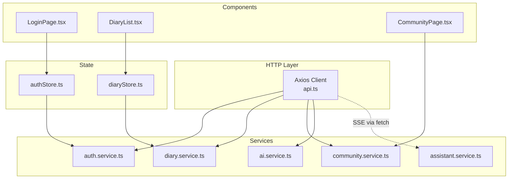
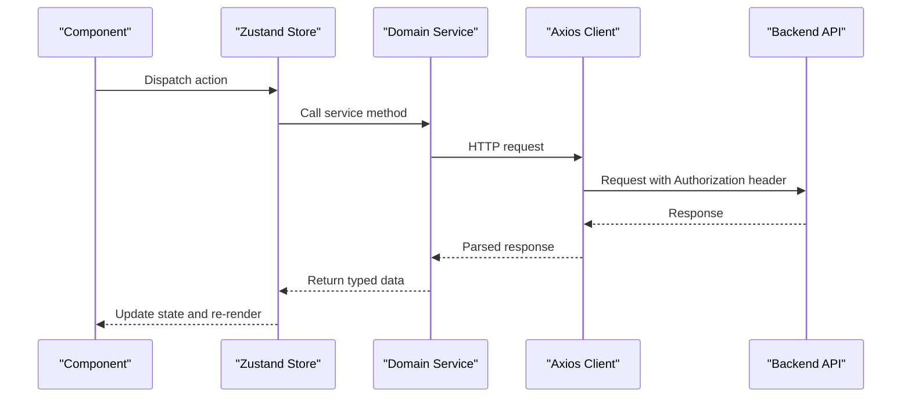
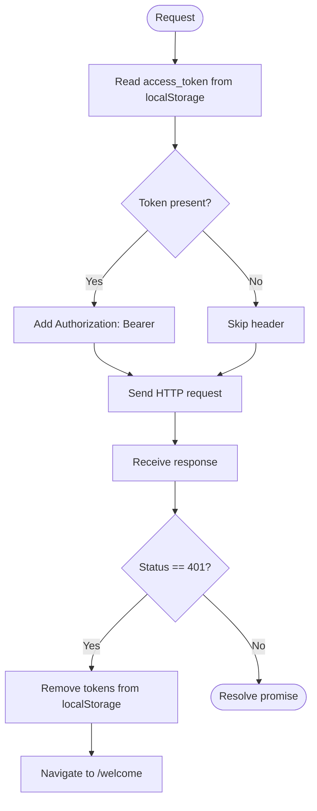
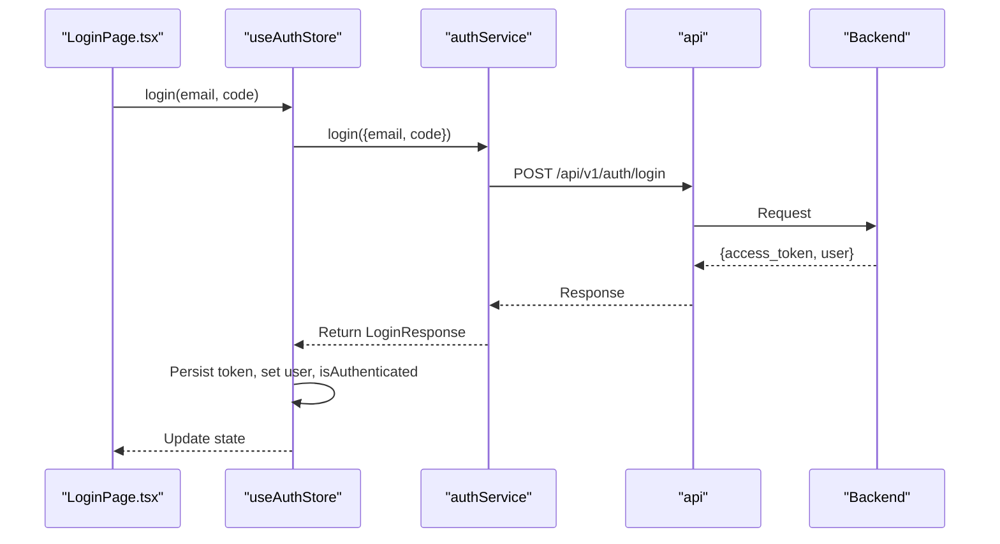
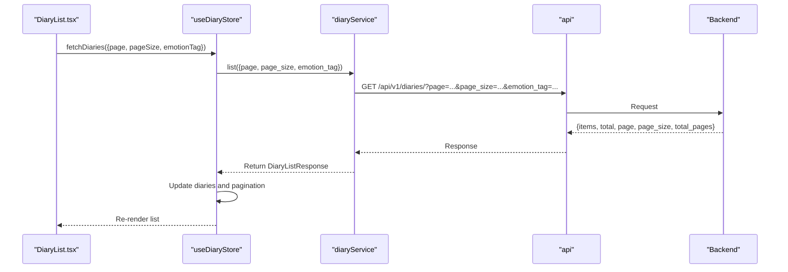
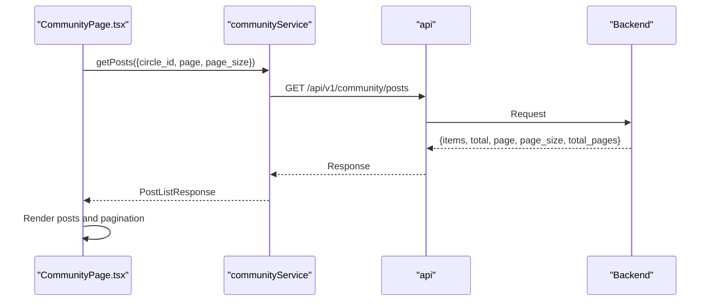
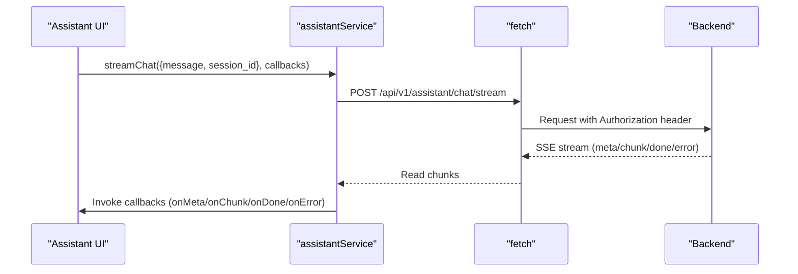
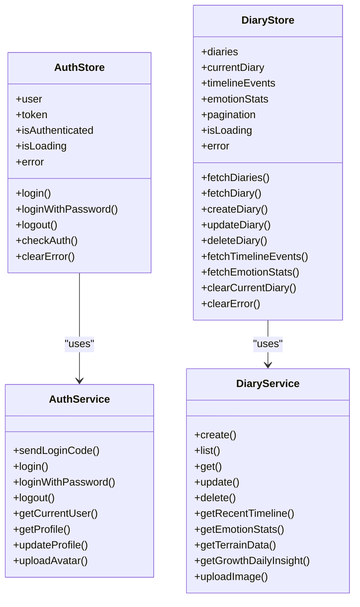
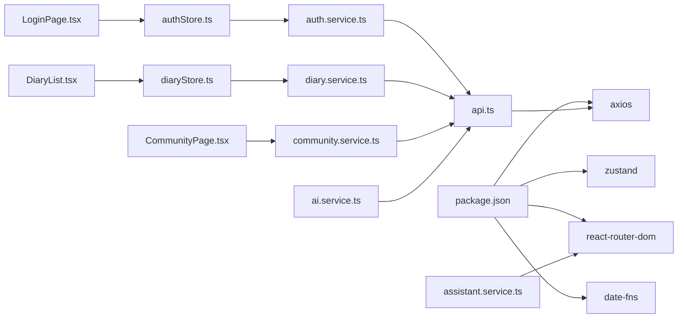

# API Integration

<cite>
**Referenced Files in This Document**
- [api.ts](file://frontend/src/services/api.ts)
- [auth.service.ts](file://frontend/src/services/auth.service.ts)
- [diary.service.ts](file://frontend/src/services/diary.service.ts)
- [community.service.ts](file://frontend/src/services/community.service.ts)
- [ai.service.ts](file://frontend/src/services/ai.service.ts)
- [assistant.service.ts](file://frontend/src/services/assistant.service.ts)
- [authStore.ts](file://frontend/src/store/authStore.ts)
- [diaryStore.ts](file://frontend/src/store/diaryStore.ts)
- [auth.ts](file://frontend/src/types/auth.ts)
- [diary.ts](file://frontend/src/types/diary.ts)
- [LoginPage.tsx](file://frontend/src/pages/auth/LoginPage.tsx)
- [DiaryList.tsx](file://frontend/src/pages/diaries/DiaryList.tsx)
- [CommunityPage.tsx](file://frontend/src/pages/community/CommunityPage.tsx)
- [routes.ts](file://frontend/src/constants/routes.ts)
- [package.json](file://frontend/package.json)
</cite>

## Table of Contents
1. [Introduction](#introduction)
2. [Project Structure](#project-structure)
3. [Core Components](#core-components)
4. [Architecture Overview](#architecture-overview)
5. [Detailed Component Analysis](#detailed-component-analysis)
6. [Dependency Analysis](#dependency-analysis)
7. [Performance Considerations](#performance-considerations)
8. [Troubleshooting Guide](#troubleshooting-guide)
9. [Conclusion](#conclusion)
10. [Appendices](#appendices)

## Introduction
This document describes the API integration layer for the 映记 frontend. It covers HTTP client configuration, request/response interceptors, error handling strategies, and the service layer architecture. It documents the dedicated services for authentication, diary management, community features, AI analysis, and assistant functionality, including endpoint mapping, request parameter formatting, and response data transformation. It also explains authentication token management, offline handling strategies, service composition patterns, dependency injection via module imports, and integration with global state management. Finally, it provides usage examples in components, error handling patterns, and performance optimization techniques for API calls.

## Project Structure
The frontend API integration is organized around a shared Axios client and domain-specific service modules. Global state is managed with Zustand stores that orchestrate service calls and update UI state. Components consume these stores and services to render views and drive user interactions.

**Diagram sources**
- [api.ts:1-43](file://frontend/src/services/api.ts#L1-L43)
- [auth.service.ts:1-100](file://frontend/src/services/auth.service.ts#L1-L100)
- [diary.service.ts:1-112](file://frontend/src/services/diary.service.ts#L1-L112)
- [community.service.ts:1-180](file://frontend/src/services/community.service.ts#L1-L180)
- [ai.service.ts:1-112](file://frontend/src/services/ai.service.ts#L1-L112)
- [assistant.service.ts:1-128](file://frontend/src/services/assistant.service.ts#L1-L128)
- [authStore.ts:1-146](file://frontend/src/store/authStore.ts#L1-L146)
- [diaryStore.ts:1-164](file://frontend/src/store/diaryStore.ts#L1-L164)
- [LoginPage.tsx:1-263](file://frontend/src/pages/auth/LoginPage.tsx#L1-L263)
- [DiaryList.tsx:1-211](file://frontend/src/pages/diaries/DiaryList.tsx#L1-L211)
- [CommunityPage.tsx:1-358](file://frontend/src/pages/community/CommunityPage.tsx#L1-L358)

**Section sources**
- [api.ts:1-43](file://frontend/src/services/api.ts#L1-L43)
- [auth.service.ts:1-100](file://frontend/src/services/auth.service.ts#L1-L100)
- [diary.service.ts:1-112](file://frontend/src/services/diary.service.ts#L1-L112)
- [community.service.ts:1-180](file://frontend/src/services/community.service.ts#L1-L180)
- [ai.service.ts:1-112](file://frontend/src/services/ai.service.ts#L1-L112)
- [assistant.service.ts:1-128](file://frontend/src/services/assistant.service.ts#L1-L128)
- [authStore.ts:1-146](file://frontend/src/store/authStore.ts#L1-L146)
- [diaryStore.ts:1-164](file://frontend/src/store/diaryStore.ts#L1-L164)
- [LoginPage.tsx:1-263](file://frontend/src/pages/auth/LoginPage.tsx#L1-L263)
- [DiaryList.tsx:1-211](file://frontend/src/pages/diaries/DiaryList.tsx#L1-L211)
- [CommunityPage.tsx:1-358](file://frontend/src/pages/community/CommunityPage.tsx#L1-L358)

## Core Components
- HTTP client and interceptors: Centralized Axios client with base URL, timeouts, and automatic bearer token injection. A response interceptor handles 401 Unauthorized by clearing tokens and redirecting to the welcome route.
- Domain services:
  - Authentication service: Email code flows, password login, registration, profile management, avatar upload.
  - Diary service: CRUD, timeline retrieval, emotion statistics, terrain insights, daily growth insight, image upload.
  - Community service: Circles, posts CRUD, comments, likes, collections, view history, image upload.
  - AI service: Analysis, async tasks, Satir analysis, social posts generation, comprehensive analysis, daily guidance, model info, title generation.
  - Assistant service: Profile/session/message management and streaming chat via fetch SSE.
- Global state:
  - Auth store: Manages user, token, authentication state, loading/error, and integrates with auth service.
  - Diary store: Manages diaries, timeline events, emotion stats, pagination, and integrates with diary service.

**Section sources**
- [api.ts:1-43](file://frontend/src/services/api.ts#L1-L43)
- [auth.service.ts:1-100](file://frontend/src/services/auth.service.ts#L1-L100)
- [diary.service.ts:1-112](file://frontend/src/services/diary.service.ts#L1-L112)
- [community.service.ts:1-180](file://frontend/src/services/community.service.ts#L1-L180)
- [ai.service.ts:1-112](file://frontend/src/services/ai.service.ts#L1-L112)
- [assistant.service.ts:1-128](file://frontend/src/services/assistant.service.ts#L1-L128)
- [authStore.ts:1-146](file://frontend/src/store/authStore.ts#L1-L146)
- [diaryStore.ts:1-164](file://frontend/src/store/diaryStore.ts#L1-L164)

## Architecture Overview
The frontend follows a layered architecture:
- Presentation layer: React components and pages.
- State layer: Zustand stores encapsulate async flows and UI state.
- Service layer: Typed Axios wrappers per domain.
- HTTP layer: Shared Axios client with interceptors.

**Diagram sources**
- [authStore.ts:1-146](file://frontend/src/store/authStore.ts#L1-L146)
- [diaryStore.ts:1-164](file://frontend/src/store/diaryStore.ts#L1-L164)
- [auth.service.ts:1-100](file://frontend/src/services/auth.service.ts#L1-L100)
- [diary.service.ts:1-112](file://frontend/src/services/diary.service.ts#L1-L112)
- [api.ts:1-43](file://frontend/src/services/api.ts#L1-L43)

## Detailed Component Analysis

### HTTP Client and Interceptors
- Base configuration:
  - Base URL loaded from environment variable.
  - JSON content-type header.
  - Long timeout suitable for AI and assistant endpoints.
- Request interceptor:
  - Reads access token from localStorage and injects Authorization header.
- Response interceptor:
  - On 401 Unauthorized, clears tokens and navigates to the welcome route.

**Diagram sources**
- [api.ts:14-40](file://frontend/src/services/api.ts#L14-L40)

**Section sources**
- [api.ts:1-43](file://frontend/src/services/api.ts#L1-L43)

### Authentication Service
- Endpoints covered:
  - Send login code, login with code, login with password.
  - Send register code, verify register code, register.
  - Send reset password code, reset password.
  - Logout, get current user, get profile, update profile, upload avatar.
- Parameter formatting:
  - Uses JSON bodies for most requests.
  - Avatar upload uses multipart/form-data with a file field.
- Response transformation:
  - Returns typed data (e.g., LoginResponse, User).

**Diagram sources**
- [authStore.ts:32-50](file://frontend/src/store/authStore.ts#L32-L50)
- [auth.service.ts:18-28](file://frontend/src/services/auth.service.ts#L18-L28)
- [api.ts:14-26](file://frontend/src/services/api.ts#L14-L26)

**Section sources**
- [auth.service.ts:1-100](file://frontend/src/services/auth.service.ts#L1-L100)
- [auth.ts:17-44](file://frontend/src/types/auth.ts#L17-L44)
- [authStore.ts:32-50](file://frontend/src/store/authStore.ts#L32-L50)

### Diary Service
- Endpoints covered:
  - Create, list, get, update, delete.
  - Get by date, recent timeline, timeline range/date, emotion stats, terrain data, daily growth insight.
  - Upload image (multipart/form-data).
- Parameter formatting:
  - GET parameters for pagination and filters.
  - POST/PUT JSON bodies for creation/update.
- Response transformation:
  - Returns typed models (Diary, TimelineEvent, EmotionStats, TerrainResponse, GrowthDailyInsight).

**Diagram sources**
- [diaryStore.ts:50-74](file://frontend/src/store/diaryStore.ts#L50-L74)
- [diary.service.ts:21-31](file://frontend/src/services/diary.service.ts#L21-L31)
- [diary.ts:39-45](file://frontend/src/types/diary.ts#L39-L45)

**Section sources**
- [diary.service.ts:1-112](file://frontend/src/services/diary.service.ts#L1-L112)
- [diary.ts:6-19](file://frontend/src/types/diary.ts#L6-L19)
- [diaryStore.ts:50-74](file://frontend/src/store/diaryStore.ts#L50-L74)

### Community Service
- Endpoints covered:
  - Circles, posts CRUD, my posts, post detail, update/delete post.
  - Comments CRUD under a post.
  - Toggle like and collect on posts.
  - Collections listing, view history.
  - Image upload (multipart/form-data).
- Parameter formatting:
  - GET parameters for pagination and filtering (e.g., circle_id).
  - POST/PUT JSON payloads for content and metadata.
- Response transformation:
  - Returns typed models (Post, Comment, PostListResponse, ViewHistoryResponse, CircleInfo).

**Diagram sources**
- [CommunityPage.tsx:47-58](file://frontend/src/pages/community/CommunityPage.tsx#L47-L58)
- [community.service.ts:88-95](file://frontend/src/services/community.service.ts#L88-L95)

**Section sources**
- [community.service.ts:1-180](file://frontend/src/services/community.service.ts#L1-L180)
- [CommunityPage.tsx:47-58](file://frontend/src/pages/community/CommunityPage.tsx#L47-L58)

### AI Service
- Endpoints covered:
  - Analyze, analyze-async, Satir analysis, social posts generation, comprehensive analysis (RAG), daily guidance, social style samples (get/save), analyses list, result by diary, model info, generate title.
- Parameter formatting:
  - JSON bodies for analysis requests and metadata.
  - GET parameters for pagination.
- Response transformation:
  - Returns typed models (AnalysisResponse, ComprehensiveAnalysisResponse, DailyGuidanceResponse, SocialStyleSamplesResponse).

**Section sources**
- [ai.service.ts:1-112](file://frontend/src/services/ai.service.ts#L1-L112)

### Assistant Service
- Endpoints covered:
  - Profile, update profile.
  - Sessions: list, create, archive, clear.
  - Messages: list.
  - Streaming chat via fetch with Server-Sent Events (SSE).
- Parameter formatting:
  - JSON bodies for chat and session operations.
  - Authorization header included for SSE requests.
- Response transformation:
  - Parses SSE events (meta, chunk, done, error) and invokes callbacks.

**Diagram sources**
- [assistant.service.ts:69-125](file://frontend/src/services/assistant.service.ts#L69-L125)

**Section sources**
- [assistant.service.ts:1-128](file://frontend/src/services/assistant.service.ts#L1-L128)

### Global State Management and Composition
- Auth store:
  - Holds user, token, isAuthenticated, isLoading, error.
  - Integrates with authService for login, logout, and profile operations.
  - Persists minimal slice to localStorage for session continuity.
- Diary store:
  - Holds diaries, currentDiary, timelineEvents, emotionStats, pagination, isLoading, error.
  - Integrates with diaryService for CRUD and analytics operations.

**Diagram sources**
- [authStore.ts:23-145](file://frontend/src/store/authStore.ts#L23-L145)
- [diaryStore.ts:36-163](file://frontend/src/store/diaryStore.ts#L36-L163)
- [auth.service.ts:11-99](file://frontend/src/services/auth.service.ts#L11-L99)
- [diary.service.ts:14-111](file://frontend/src/services/diary.service.ts#L14-L111)

**Section sources**
- [authStore.ts:1-146](file://frontend/src/store/authStore.ts#L1-L146)
- [diaryStore.ts:1-164](file://frontend/src/store/diaryStore.ts#L1-L164)

## Dependency Analysis
- External libraries:
  - axios for HTTP requests.
  - zustand for global state.
  - date-fns for date formatting.
  - radix-ui and lucide-react for UI primitives.
- Internal dependencies:
  - Services depend on the shared api client.
  - Stores depend on services for async operations.
  - Components depend on stores for state and actions.

**Diagram sources**
- [package.json:14-36](file://frontend/package.json#L14-L36)
- [api.ts:1-43](file://frontend/src/services/api.ts#L1-L43)
- [auth.service.ts:1-100](file://frontend/src/services/auth.service.ts#L1-L100)
- [diary.service.ts:1-112](file://frontend/src/services/diary.service.ts#L1-L112)
- [community.service.ts:1-180](file://frontend/src/services/community.service.ts#L1-L180)
- [ai.service.ts:1-112](file://frontend/src/services/ai.service.ts#L1-L112)
- [assistant.service.ts:1-128](file://frontend/src/services/assistant.service.ts#L1-L128)
- [authStore.ts:1-146](file://frontend/src/store/authStore.ts#L1-L146)
- [diaryStore.ts:1-164](file://frontend/src/store/diaryStore.ts#L1-L164)
- [LoginPage.tsx:1-263](file://frontend/src/pages/auth/LoginPage.tsx#L1-L263)
- [DiaryList.tsx:1-211](file://frontend/src/pages/diaries/DiaryList.tsx#L1-L211)
- [CommunityPage.tsx:1-358](file://frontend/src/pages/community/CommunityPage.tsx#L1-L358)

**Section sources**
- [package.json:14-36](file://frontend/package.json#L14-L36)

## Performance Considerations
- Prefer paginated endpoints to limit payload sizes (e.g., diary list, community posts).
- Cache frequently accessed data in stores to avoid redundant network calls.
- Use optimistic updates for quick UI feedback (e.g., like toggles) and reconcile with server responses.
- Debounce or throttle frequent operations (e.g., real-time search) to reduce API load.
- For long-running AI tasks, use async endpoints and poll or rely on SSE completion events.
- Minimize multipart uploads by compressing images before upload.

## Troubleshooting Guide
- 401 Unauthorized:
  - Symptom: Automatic logout and navigation to the welcome route.
  - Action: Ensure token is present in localStorage and refreshed if needed.
- Network timeouts:
  - Symptom: Long-running AI or assistant requests may timeout.
  - Action: Increase timeout in the HTTP client if appropriate; implement retry with exponential backoff for idempotent operations.
- CORS or base URL misconfiguration:
  - Symptom: Requests fail due to missing or incorrect VITE_API_BASE_URL.
  - Action: Verify environment variable and backend CORS policy.
- SSE streaming failures:
  - Symptom: Assistant chat stops unexpectedly.
  - Action: Validate Authorization header presence and backend SSE endpoint health.

**Section sources**
- [api.ts:28-40](file://frontend/src/services/api.ts#L28-L40)

## Conclusion
The 映记 frontend employs a clean separation of concerns: a shared HTTP client with interceptors, typed domain services, and state stores that orchestrate user flows. The architecture supports robust authentication, diary management, community features, AI analysis, and assistant streaming. By leveraging global state and consistent error handling, the system remains maintainable and user-friendly. Extending the API surface involves adding endpoints to services, updating types, and wiring them into stores and components.

## Appendices

### API Endpoint Reference by Service
- Authentication
  - POST /api/v1/auth/login/send-code
  - POST /api/v1/auth/login
  - POST /api/v1/auth/login/password
  - POST /api/v1/auth/register/send-code
  - POST /api/v1/auth/register/verify
  - POST /api/v1/auth/register
  - POST /api/v1/auth/reset-password/send-code
  - POST /api/v1/auth/reset-password
  - POST /api/v1/auth/logout
  - GET /api/v1/auth/me
  - GET /api/v1/users/profile
  - PUT /api/v1/users/profile
  - POST /api/v1/users/avatar
- Diary
  - POST /api/v1/diaries/
  - GET /api/v1/diaries/
  - GET /api/v1/diaries/:id
  - PUT /api/v1/diaries/:id
  - DELETE /api/v1/diaries/:id
  - GET /api/v1/diaries/date/:date
  - GET /api/v1/diaries/timeline/recent
  - GET /api/v1/diaries/timeline/range
  - GET /api/v1/diaries/timeline/date/:date
  - GET /api/v1/diaries/stats/emotions
  - GET /api/v1/diaries/timeline/terrain
  - GET /api/v1/diaries/growth/daily-insight
  - POST /api/v1/diaries/upload-image
- Community
  - GET /api/v1/community/circles
  - POST /api/v1/community/posts
  - GET /api/v1/community/posts
  - GET /api/v1/community/posts/mine
  - GET /api/v1/community/posts/:id
  - PUT /api/v1/community/posts/:id
  - DELETE /api/v1/community/posts/:id
  - POST /api/v1/community/upload-image
  - GET /api/v1/community/posts/:id/comments
  - POST /api/v1/community/posts/:id/comments
  - DELETE /api/v1/community/comments/:id
  - POST /api/v1/community/posts/:id/like
  - POST /api/v1/community/posts/:id/collect
  - GET /api/v1/community/collections
  - GET /api/v1/community/history
- AI
  - POST /api/v1/ai/analyze
  - POST /api/v1/ai/analyze-async
  - POST /api/v1/ai/satir-analysis
  - POST /api/v1/ai/social-posts
  - POST /api/v1/ai/comprehensive-analysis
  - GET /api/v1/ai/daily-guidance
  - GET /api/v1/ai/social-style-samples
  - PUT /api/v1/ai/social-style-samples
  - GET /api/v1/ai/analyses
  - GET /api/v1/ai/result/:diary_id
  - GET /api/v1/ai/models
  - POST /api/v1/ai/generate-title
- Assistant
  - GET /api/v1/assistant/profile
  - PUT /api/v1/assistant/profile
  - GET /api/v1/assistant/sessions
  - POST /api/v1/assistant/sessions
  - DELETE /api/v1/assistant/sessions/:id
  - POST /api/v1/assistant/sessions/:id/clear
  - GET /api/v1/assistant/sessions/:id/messages
  - POST /api/v1/assistant/chat/stream

**Section sources**
- [auth.service.ts:12-98](file://frontend/src/services/auth.service.ts#L12-L98)
- [diary.service.ts:15-110](file://frontend/src/services/diary.service.ts#L15-L110)
- [community.service.ts:70-179](file://frontend/src/services/community.service.ts#L70-L179)
- [ai.service.ts:14-111](file://frontend/src/services/ai.service.ts#L14-L111)
- [assistant.service.ts:35-125](file://frontend/src/services/assistant.service.ts#L35-L125)

### Example Usage in Components
- Login page:
  - Uses auth store actions to trigger login flows and displays errors via toast.
- Diary list:
  - Uses diary store to fetch and paginate diaries, and to delete entries.
- Community page:
  - Uses community service to fetch posts, toggle likes/collects, and manage pagination.

**Section sources**
- [LoginPage.tsx:22-58](file://frontend/src/pages/auth/LoginPage.tsx#L22-L58)
- [DiaryList.tsx:29-52](file://frontend/src/pages/diaries/DiaryList.tsx#L29-L52)
- [CommunityPage.tsx:47-101](file://frontend/src/pages/community/CommunityPage.tsx#L47-L101)