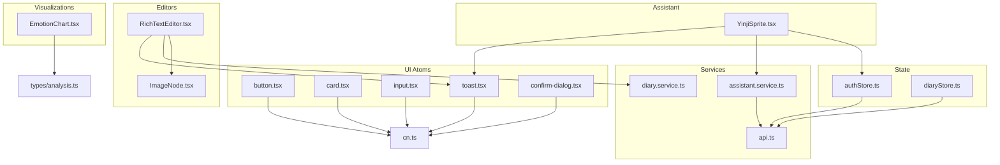
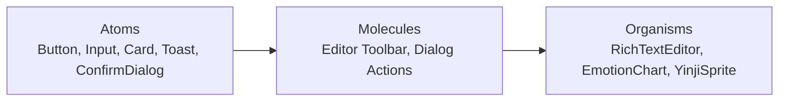
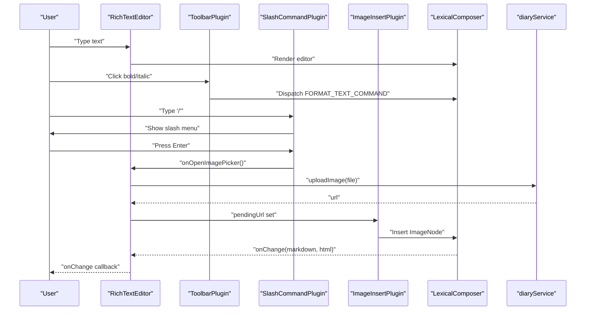
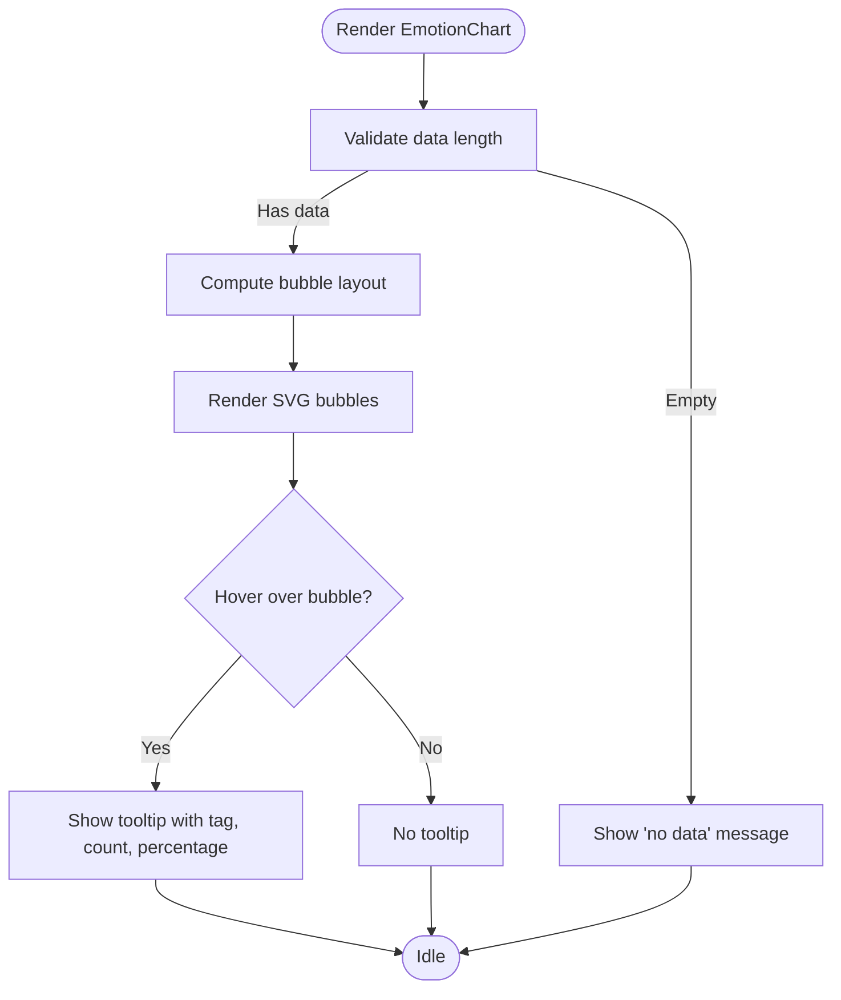
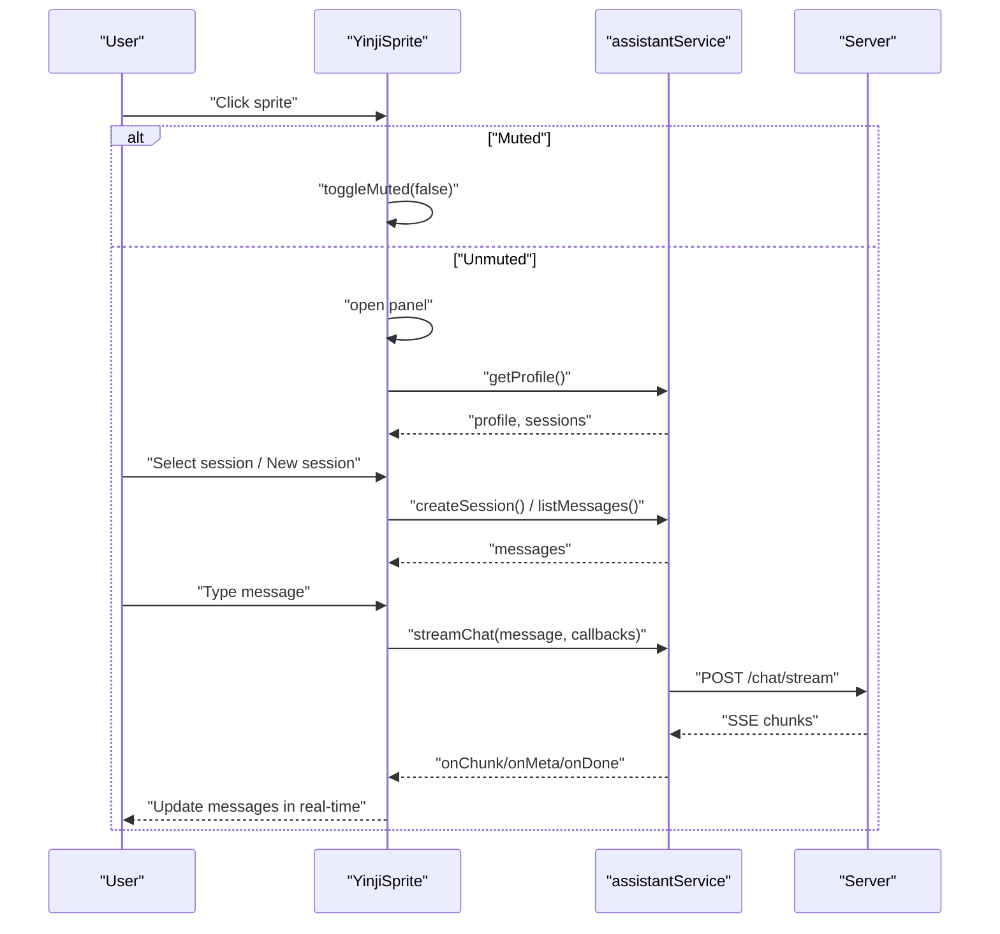
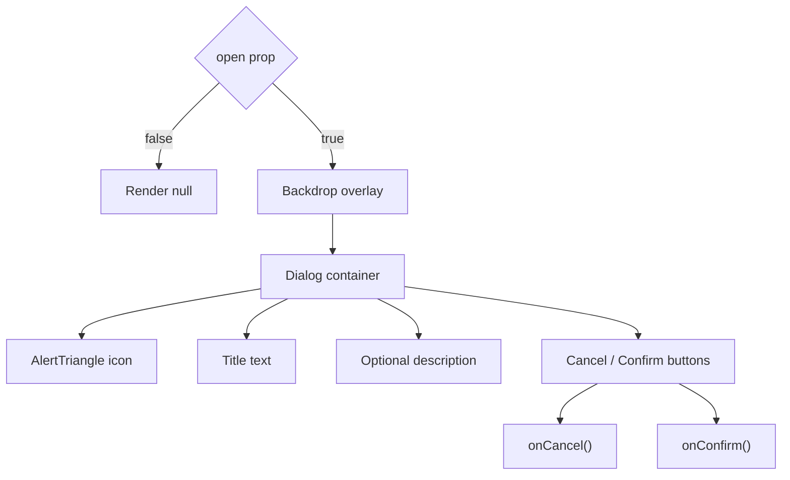
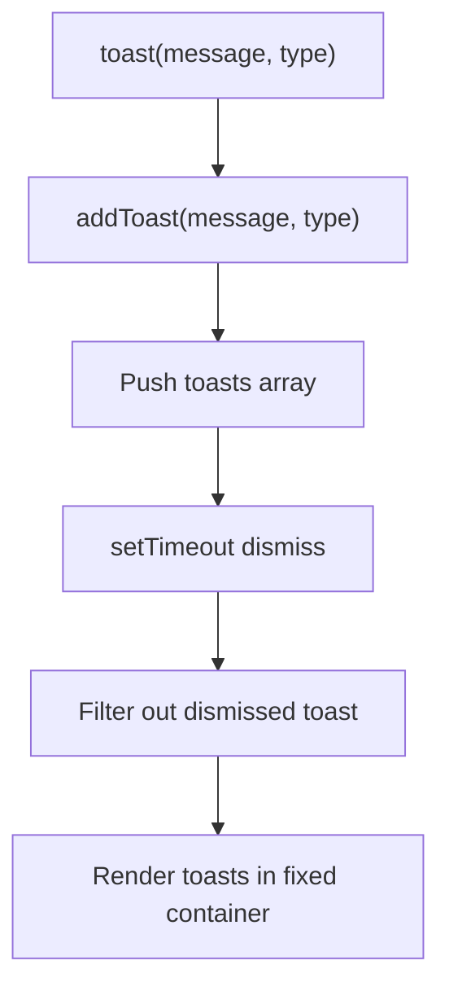
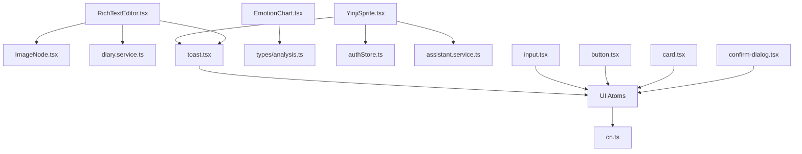

# Component System

<cite>
**Referenced Files in This Document**
- [button.tsx](file://frontend/src/components/ui/button.tsx)
- [card.tsx](file://frontend/src/components/ui/card.tsx)
- [input.tsx](file://frontend/src/components/ui/input.tsx)
- [toast.tsx](file://frontend/src/components/ui/toast.tsx)
- [confirm-dialog.tsx](file://frontend/src/components/ui/confirm-dialog.tsx)
- [RichTextEditor.tsx](file://frontend/src/components/editor/RichTextEditor.tsx)
- [ImageNode.tsx](file://frontend/src/components/editor/ImageNode.tsx)
- [EmotionChart.tsx](file://frontend/src/components/common/EmotionChart.tsx)
- [YinjiSprite.tsx](file://frontend/src/components/assistant/YinjiSprite.tsx)
- [Loading.tsx](file://frontend/src/components/common/Loading.tsx)
- [cn.ts](file://frontend/src/utils/cn.ts)
- [authStore.ts](file://frontend/src/store/authStore.ts)
- [diaryStore.ts](file://frontend/src/store/diaryStore.ts)
- [assistant.service.ts](file://frontend/src/services/assistant.service.ts)
- [api.ts](file://frontend/src/services/api.ts)
- [diary.service.ts](file://frontend/src/services/diary.service.ts)
- [routes.ts](file://frontend/src/constants/routes.ts)
- [App.tsx](file://frontend/src/App.tsx)
- [main.tsx](file://frontend/src/main.tsx)
- [index.css](file://frontend/src/index.css)
- [tailwind.config.js](file://frontend/src/tailwind.config.js)
- [postcss.config.js](file://frontend/src/postcss.config.js)
- [vite.config.ts](file://frontend/src/vite-config.ts)
</cite>

## Table of Contents
1. [Introduction](#introduction)
2. [Project Structure](#project-structure)
3. [Core Components](#core-components)
4. [Architecture Overview](#architecture-overview)
5. [Detailed Component Analysis](#detailed-component-analysis)
6. [Dependency Analysis](#dependency-analysis)
7. [Performance Considerations](#performance-considerations)
8. [Troubleshooting Guide](#troubleshooting-guide)
9. [Conclusion](#conclusion)
10. [Appendices](#appendices)

## Introduction
This document describes the component system of the 映记 React application with a focus on atomic design principles. It documents reusable UI components (atoms), their composition into molecules and organisms, and specialized components such as the RichTextEditor integrated with Lexical, EmotionChart for data visualization, and YinjiSprite for AI assistant functionality. It also covers component lifecycle management, state handling, integration with global state, styling via Tailwind CSS, testing strategies, and performance optimization techniques.

## Project Structure
The frontend is organized around a clear separation of concerns:
- Atomic UI primitives under components/ui
- Specialized editors and visualizations under components/editor and components/common
- Assistant UI under components/assistant
- Global state stores under store
- Services under services
- Utilities under utils
- Constants and types under constants and types

**Diagram sources**
- [button.tsx:1-52](file://frontend/src/components/ui/button.tsx#L1-L52)
- [card.tsx:1-57](file://frontend/src/components/ui/card.tsx#L1-L57)
- [input.tsx:1-25](file://frontend/src/components/ui/input.tsx#L1-L25)
- [toast.tsx:1-61](file://frontend/src/components/ui/toast.tsx#L1-L61)
- [confirm-dialog.tsx:1-77](file://frontend/src/components/ui/confirm-dialog.tsx#L1-L77)
- [RichTextEditor.tsx:1-383](file://frontend/src/components/editor/RichTextEditor.tsx#L1-L383)
- [ImageNode.tsx:1-87](file://frontend/src/components/editor/ImageNode.tsx#L1-L87)
- [EmotionChart.tsx:1-269](file://frontend/src/components/common/EmotionChart.tsx#L1-L269)
- [YinjiSprite.tsx:1-545](file://frontend/src/components/assistant/YinjiSprite.tsx#L1-L545)
- [authStore.ts:1-146](file://frontend/src/store/authStore.ts#L1-L146)
- [diaryStore.ts:1-164](file://frontend/src/store/diaryStore.ts#L1-L164)
- [assistant.service.ts:1-128](file://frontend/src/services/assistant.service.ts#L1-L128)
- [api.ts](file://frontend/src/services/api.ts)
- [diary.service.ts](file://frontend/src/services/diary.service.ts)
- [cn.ts:1-8](file://frontend/src/utils/cn.ts#L1-L8)

**Section sources**
- [button.tsx:1-52](file://frontend/src/components/ui/button.tsx#L1-L52)
- [card.tsx:1-57](file://frontend/src/components/ui/card.tsx#L1-L57)
- [input.tsx:1-25](file://frontend/src/components/ui/input.tsx#L1-L25)
- [toast.tsx:1-61](file://frontend/src/components/ui/toast.tsx#L1-L61)
- [confirm-dialog.tsx:1-77](file://frontend/src/components/ui/confirm-dialog.tsx#L1-L77)
- [RichTextEditor.tsx:1-383](file://frontend/src/components/editor/RichTextEditor.tsx#L1-L383)
- [ImageNode.tsx:1-87](file://frontend/src/components/editor/ImageNode.tsx#L1-L87)
- [EmotionChart.tsx:1-269](file://frontend/src/components/common/EmotionChart.tsx#L1-L269)
- [YinjiSprite.tsx:1-545](file://frontend/src/components/assistant/YinjiSprite.tsx#L1-L545)
- [authStore.ts:1-146](file://frontend/src/store/authStore.ts#L1-L146)
- [diaryStore.ts:1-164](file://frontend/src/store/diaryStore.ts#L1-L164)
- [assistant.service.ts:1-128](file://frontend/src/services/assistant.service.ts#L1-L128)
- [api.ts](file://frontend/src/services/api.ts)
- [diary.service.ts](file://frontend/src/services/diary.service.ts)
- [cn.ts:1-8](file://frontend/src/utils/cn.ts#L1-L8)

## Core Components
This section documents the atomic UI components and their props, styling, and composition patterns.

- Button
  - Purpose: Unified button primitive with variant and size variants.
  - Props: Inherits button attributes plus variant and size from cva.
  - Composition: Used inside CardHeader/CardContent, ConfirmDialog actions, and editor toolbar.
  - Styling: Tailwind classes merged via cn with cva variants.

- Card
  - Purpose: Container with header, title, description, content, and footer segments.
  - Props: Standard HTML div attributes; composed via forwardRef.
  - Composition: Used in dialogs, dashboards, and forms.

- Input
  - Purpose: Styled text input with focus-visible ring and placeholder styles.
  - Props: Standard HTML input attributes.
  - Styling: Tailwind classes via cn.

- Toast Provider and toast
  - Purpose: Global notification system with transient toasts.
  - API: toast(message, type) and ToastProvider wrapping app.
  - Behavior: Auto-dismiss after delay; supports success, error, info.

- Confirm Dialog
  - Purpose: Modal confirmation dialog with optional danger styling.
  - Props: open, title, description, confirmText, cancelText, danger, onConfirm, onCancel.
  - Styling: Gradient backgrounds and subtle shadows.

**Section sources**
- [button.tsx:32-51](file://frontend/src/components/ui/button.tsx#L32-L51)
- [card.tsx:5-56](file://frontend/src/components/ui/card.tsx#L5-L56)
- [input.tsx:5-24](file://frontend/src/components/ui/input.tsx#L5-L24)
- [toast.tsx:5-60](file://frontend/src/components/ui/toast.tsx#L5-L60)
- [confirm-dialog.tsx:4-76](file://frontend/src/components/ui/confirm-dialog.tsx#L4-L76)

## Architecture Overview
The component system follows atomic design:
- Atoms: Button, Input, Card segments, Toast, ConfirmDialog
- Molecules: Editor toolbar buttons, dialog action rows
- Organisms: RichTextEditor (with plugins), EmotionChart, YinjiSprite panel

[No sources needed since this diagram shows conceptual workflow, not actual code structure]

## Detailed Component Analysis

### RichTextEditor (Lexical Integration)
RichTextEditor composes multiple Lexical plugins and a custom ImageNode to provide a Markdown-friendly editor with image insertion and slash commands.

**Diagram sources**
- [RichTextEditor.tsx:282-382](file://frontend/src/components/editor/RichTextEditor.tsx#L282-L382)
- [ImageNode.tsx:10-87](file://frontend/src/components/editor/ImageNode.tsx#L10-L87)
- [diary.service.ts](file://frontend/src/services/diary.service.ts)

Key implementation highlights:
- Toolbar updates active formats via selection listeners.
- Slash command detection opens a contextual menu.
- Image insertion uses a dedicated plugin and custom node.
- Change handler converts editor state to Markdown and HTML.
- Uses theme configuration and error boundary.

Usage and customization:
- Props: value, onChange, placeholder, minHeight.
- Customization: theme overrides, additional Lexical nodes/plugins, transformers.

**Section sources**
- [RichTextEditor.tsx:253-382](file://frontend/src/components/editor/RichTextEditor.tsx#L253-L382)
- [ImageNode.tsx:10-87](file://frontend/src/components/editor/ImageNode.tsx#L10-L87)

### EmotionChart (Data Visualization)
EmotionChart renders an interactive bubble chart of emotion statistics with force-directed layout and hover tooltips.

**Diagram sources**
- [EmotionChart.tsx:158-268](file://frontend/src/components/common/EmotionChart.tsx#L158-L268)

Key implementation highlights:
- Color mapping via EMOTION_COLORS with fallback logic.
- Force-directed layout with collision avoidance.
- Radial gradients per bubble and smooth scaling on hover.
- Responsive sizing and SVG viewBox.

Usage and customization:
- Props: data array, optional type.
- Customization: adjust radii, colors, layout thresholds.

**Section sources**
- [EmotionChart.tsx:5-269](file://frontend/src/components/common/EmotionChart.tsx#L5-L269)

### YinjiSprite (AI Assistant)
YinjiSprite is a draggable floating assistant panel with session management, streaming chat, and persistence.

**Diagram sources**
- [YinjiSprite.tsx:20-545](file://frontend/src/components/assistant/YinjiSprite.tsx#L20-L545)
- [assistant.service.ts:69-128](file://frontend/src/services/assistant.service.ts#L69-L128)

Key implementation highlights:
- Draggable sprite with pointer capture and requestAnimationFrame updates.
- Panel drag with bounds clamping.
- Streaming chat with SSE-like handling and local optimistic updates.
- Session CRUD and message listing.
- Persistence of position and mute state.

Integration with global state:
- Uses authStore for authentication gating.
- No direct store dependency; relies on service layer and local state.

**Section sources**
- [YinjiSprite.tsx:20-545](file://frontend/src/components/assistant/YinjiSprite.tsx#L20-L545)
- [assistant.service.ts:35-128](file://frontend/src/services/assistant.service.ts#L35-L128)

### ConfirmDialog
A reusable confirmation dialog with gradient action buttons and backdrop blur.

**Diagram sources**
- [confirm-dialog.tsx:15-76](file://frontend/src/components/ui/confirm-dialog.tsx#L15-L76)

**Section sources**
- [confirm-dialog.tsx:4-76](file://frontend/src/components/ui/confirm-dialog.tsx#L4-L76)

### Toast System
Toast provider manages transient notifications with automatic dismissal.

**Diagram sources**
- [toast.tsx:13-60](file://frontend/src/components/ui/toast.tsx#L13-L60)

**Section sources**
- [toast.tsx:5-60](file://frontend/src/components/ui/toast.tsx#L5-L60)

### Loading Component
Provides spinner-based loading indicators in multiple sizes and a full-screen variant.

**Section sources**
- [Loading.tsx:4-54](file://frontend/src/components/common/Loading.tsx#L4-L54)

## Dependency Analysis
Component dependencies and relationships:

**Diagram sources**
- [RichTextEditor.tsx:1-383](file://frontend/src/components/editor/RichTextEditor.tsx#L1-L383)
- [ImageNode.tsx:1-87](file://frontend/src/components/editor/ImageNode.tsx#L1-L87)
- [EmotionChart.tsx:1-269](file://frontend/src/components/common/EmotionChart.tsx#L1-L269)
- [YinjiSprite.tsx:1-545](file://frontend/src/components/assistant/YinjiSprite.tsx#L1-L545)
- [authStore.ts:1-146](file://frontend/src/store/authStore.ts#L1-L146)
- [assistant.service.ts:1-128](file://frontend/src/services/assistant.service.ts#L1-L128)
- [toast.tsx:1-61](file://frontend/src/components/ui/toast.tsx#L1-L61)
- [button.tsx:1-52](file://frontend/src/components/ui/button.tsx#L1-L52)
- [card.tsx:1-57](file://frontend/src/components/ui/card.tsx#L1-L57)
- [input.tsx:1-25](file://frontend/src/components/ui/input.tsx#L1-L25)
- [confirm-dialog.tsx:1-77](file://frontend/src/components/ui/confirm-dialog.tsx#L1-L77)
- [cn.ts:1-8](file://frontend/src/utils/cn.ts#L1-L8)

**Section sources**
- [RichTextEditor.tsx:1-383](file://frontend/src/components/editor/RichTextEditor.tsx#L1-L383)
- [YinjiSprite.tsx:1-545](file://frontend/src/components/assistant/YinjiSprite.tsx#L1-L545)
- [toast.tsx:1-61](file://frontend/src/components/ui/toast.tsx#L1-L61)
- [button.tsx:1-52](file://frontend/src/components/ui/button.tsx#L1-L52)
- [card.tsx:1-57](file://frontend/src/components/ui/card.tsx#L1-L57)
- [input.tsx:1-25](file://frontend/src/components/ui/input.tsx#L1-L25)
- [confirm-dialog.tsx:1-77](file://frontend/src/components/ui/confirm-dialog.tsx#L1-L77)
- [cn.ts:1-8](file://frontend/src/utils/cn.ts#L1-L8)

## Performance Considerations
- Memoization
  - EmotionChart uses useMemo for bubble layout computation to avoid re-layout on unrelated re-renders.
  - RichTextEditor uses useCallback for change handler to prevent unnecessary re-renders of plugins.

- Rendering optimization
  - ImageNode is a DecoratorNode that minimizes DOM updates and provides lazy loading.
  - YinjiSprite bypasses React during drag updates by writing directly to DOM within requestAnimationFrame for smooth movement.

- Streaming and debouncing
  - Assistant streaming updates messages incrementally and defers expensive UI work until done.
  - Toast auto-dismiss prevents accumulation of notifications.

- CSS and class merging
  - Tailwind classes are merged via cn to avoid redundant styles and improve maintainability.

[No sources needed since this section provides general guidance]

## Troubleshooting Guide
Common issues and resolutions:
- Lexical editor not updating
  - Ensure onChange handler reads editor state synchronously and converts to Markdown/HTML.
  - Verify theme and node registration in initialConfig.

- Toast not appearing
  - Confirm ToastProvider wraps the application root.
  - Check that toast is called after provider mounts.

- Assistant panel not opening
  - Verify authentication state and profile load success.
  - Ensure assistantService endpoints are reachable and token is present.

- Dragging feels laggy
  - Confirm pointer capture and requestAnimationFrame usage in drag handlers.
  - Reduce unnecessary re-renders in parent components.

**Section sources**
- [RichTextEditor.tsx:315-326](file://frontend/src/components/editor/RichTextEditor.tsx#L315-L326)
- [toast.tsx:17-60](file://frontend/src/components/ui/toast.tsx#L17-L60)
- [YinjiSprite.tsx:45-88](file://frontend/src/components/assistant/YinjiSprite.tsx#L45-L88)

## Conclusion
The 映记 component system embraces atomic design with robust, reusable atoms (Button, Input, Card, Toast, ConfirmDialog) and specialized molecules/organisms (RichTextEditor, EmotionChart, YinjiSprite). Clear separation of concerns, strong typing, and Tailwind-based styling enable consistent UI and efficient development. Integration with global state and service layers ensures scalable behavior, while performance-conscious patterns keep interactions smooth.

[No sources needed since this section summarizes without analyzing specific files]

## Appendices

### Styling Approach with Tailwind CSS
- Utility-first classes applied via cn for safe merging and overrides.
- Variants defined with cva for consistent button styles.
- Component-specific themes (e.g., RichTextEditor) encapsulate appearance.

**Section sources**
- [cn.ts:5-7](file://frontend/src/utils/cn.ts#L5-L7)
- [button.tsx:6-30](file://frontend/src/components/ui/button.tsx#L6-L30)
- [RichTextEditor.tsx:260-276](file://frontend/src/components/editor/RichTextEditor.tsx#L260-L276)

### Component Lifecycle Management
- RichTextEditor: registers update listeners, handles selection changes, and cleans up listeners on unmount.
- EmotionChart: computes layout once per data change using useMemo.
- YinjiSprite: sets up drag handlers with pointer capture, persists position on end, and clamps positions on resize.

**Section sources**
- [RichTextEditor.tsx:85-119](file://frontend/src/components/editor/RichTextEditor.tsx#L85-L119)
- [EmotionChart.tsx:164-164](file://frontend/src/components/common/EmotionChart.tsx#L164-L164)
- [YinjiSprite.tsx:126-183](file://frontend/src/components/assistant/YinjiSprite.tsx#L126-L183)

### Integration Patterns with Global State
- Authentication gating: YinjiSprite conditionally renders only when authenticated.
- Store-driven data: EmotionChart receives emotion stats from diaryStore; RichTextEditor integrates with diaryService for uploads.
- Service abstraction: assistantService encapsulates SSE-like streaming and session management.

**Section sources**
- [YinjiSprite.tsx:337-337](file://frontend/src/components/assistant/YinjiSprite.tsx#L337-L337)
- [diaryStore.ts:152-159](file://frontend/src/store/diaryStore.ts#L152-L159)
- [assistant.service.ts:69-128](file://frontend/src/services/assistant.service.ts#L69-L128)

### Testing Strategies
- Unit tests for pure functions (e.g., layout algorithms in EmotionChart).
- Component snapshot tests for UI primitives (Button, Input, Card).
- Integration tests for editor behavior (change handler, image insertion).
- E2E tests for assistant panel (drag, session creation, streaming).

[No sources needed since this section provides general guidance]