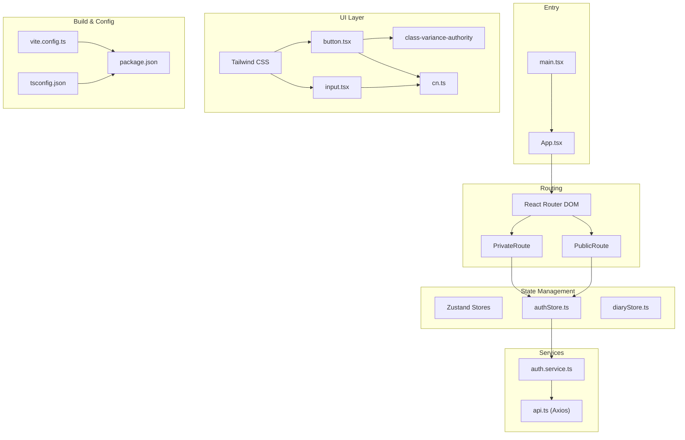
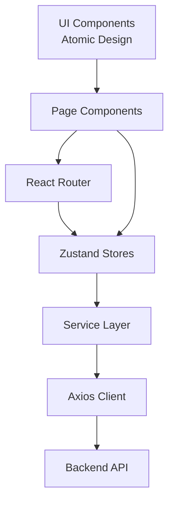
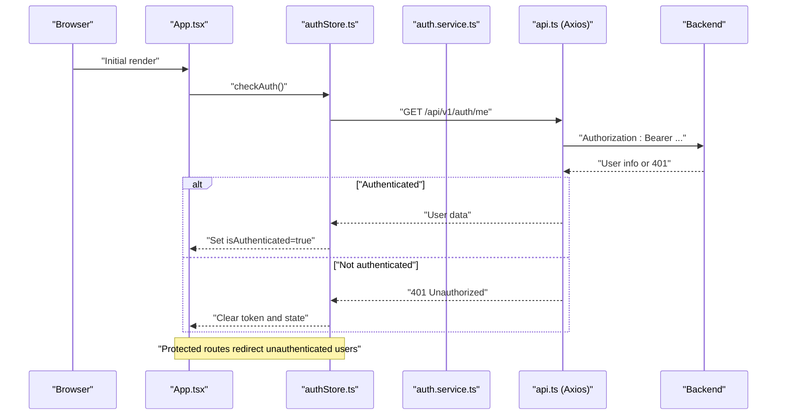
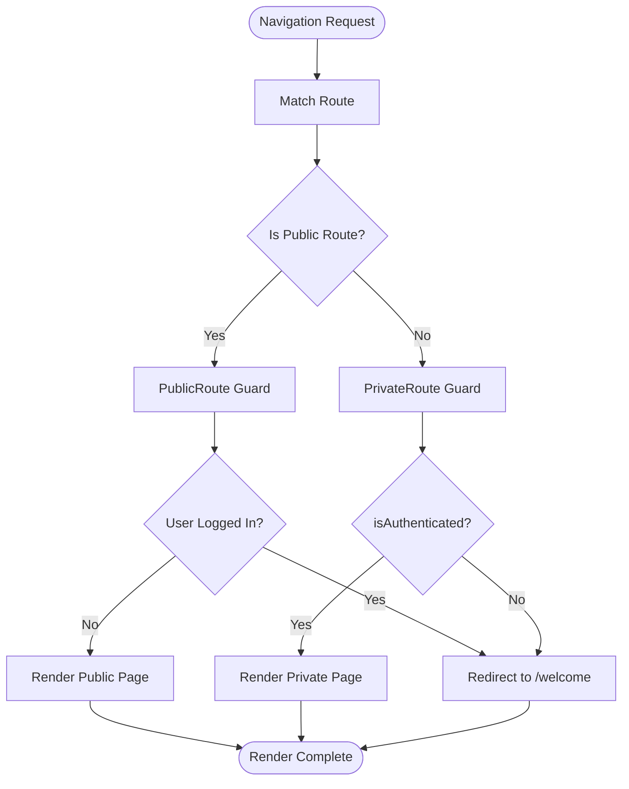
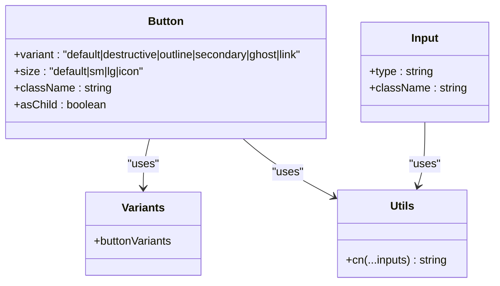
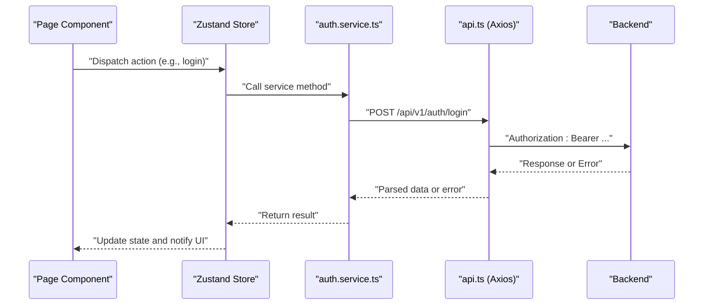
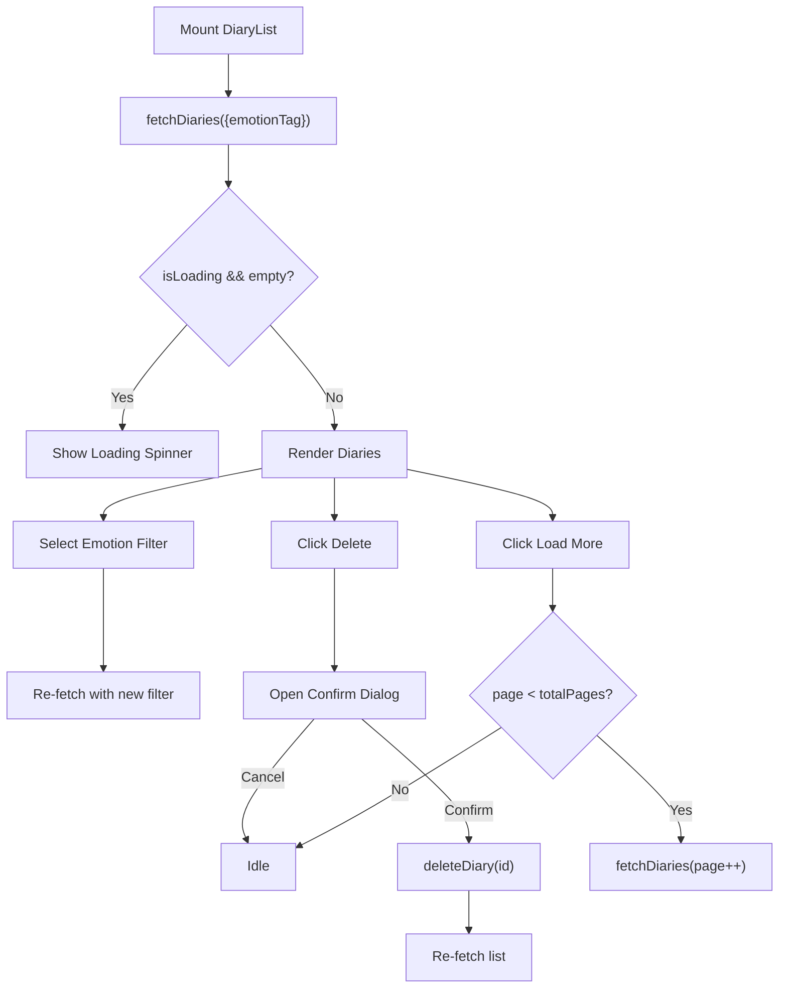
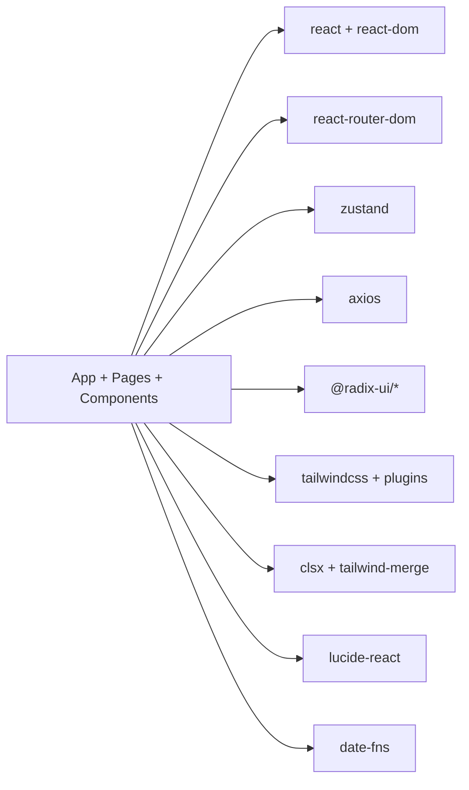
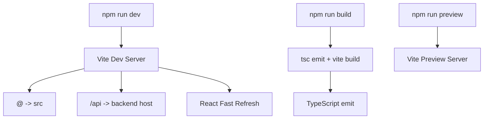

# Frontend Architecture

<cite>
**Referenced Files in This Document**
- [main.tsx](file://frontend/src/main.tsx)
- [App.tsx](file://frontend/src/App.tsx)
- [package.json](file://frontend/package.json)
- [vite.config.ts](file://frontend/vite.config.ts)
- [tsconfig.json](file://frontend/tsconfig.json)
- [authStore.ts](file://frontend/src/store/authStore.ts)
- [api.ts](file://frontend/src/services/api.ts)
- [routes.ts](file://frontend/src/constants/routes.ts)
- [tailwind.config.js](file://frontend/tailwind.config.js)
- [cn.ts](file://frontend/src/utils/cn.ts)
- [button.tsx](file://frontend/src/components/ui/button.tsx)
- [input.tsx](file://frontend/src/components/ui/input.tsx)
- [auth.service.ts](file://frontend/src/services/auth.service.ts)
- [auth.ts](file://frontend/src/types/auth.ts)
- [DiaryList.tsx](file://frontend/src/pages/diaries/DiaryList.tsx)
</cite>

## Table of Contents
1. [Introduction](#introduction)
2. [Project Structure](#project-structure)
3. [Core Components](#core-components)
4. [Architecture Overview](#architecture-overview)
5. [Detailed Component Analysis](#detailed-component-analysis)
6. [Dependency Analysis](#dependency-analysis)
7. [Performance Considerations](#performance-considerations)
8. [Troubleshooting Guide](#troubleshooting-guide)
9. [Conclusion](#conclusion)
10. [Appendices](#appendices)

## Introduction
This document describes the frontend architecture of the YINJI (映记) React application. It covers the React 18+ and TypeScript implementation, component-based design patterns aligned with atomic design principles, state management via Zustand stores, routing with protected/public routes and lazy loading, the service layer for API integration, build system with Vite and TypeScript, UI component library integration, styling with Tailwind CSS, and responsive design. It also includes component interaction diagrams and data flow patterns to help developers understand how the frontend works end-to-end.

## Project Structure
The frontend is organized around a clear separation of concerns:
- Entry point and root app configuration
- Routing with lazy-loaded pages and route guards
- State management with Zustand stores
- Service layer for API integration
- UI components following atomic design principles
- Build configuration with Vite and TypeScript

**Diagram sources**
- [main.tsx:1-12](file://frontend/src/main.tsx#L1-L12)
- [App.tsx:1-242](file://frontend/src/App.tsx#L1-L242)
- [authStore.ts:1-146](file://frontend/src/store/authStore.ts#L1-L146)
- [api.ts:1-43](file://frontend/src/services/api.ts#L1-L43)
- [auth.service.ts:1-100](file://frontend/src/services/auth.service.ts#L1-L100)
- [button.tsx:1-52](file://frontend/src/components/ui/button.tsx#L1-L52)
- [input.tsx:1-25](file://frontend/src/components/ui/input.tsx#L1-L25)
- [cn.ts:1-8](file://frontend/src/utils/cn.ts#L1-L8)
- [vite.config.ts:1-27](file://frontend/vite.config.ts#L1-L27)
- [tsconfig.json:1-32](file://frontend/tsconfig.json#L1-L32)
- [package.json:1-54](file://frontend/package.json#L1-L54)

**Section sources**
- [main.tsx:1-12](file://frontend/src/main.tsx#L1-L12)
- [App.tsx:1-242](file://frontend/src/App.tsx#L1-L242)
- [package.json:1-54](file://frontend/package.json#L1-L54)
- [vite.config.ts:1-27](file://frontend/vite.config.ts#L1-L27)
- [tsconfig.json:1-32](file://frontend/tsconfig.json#L1-L32)

## Core Components
- Application entry and root component: Initializes React 18 Strict Mode, registers the root App, and applies global styles.
- Root routing: Centralizes route definitions, lazy-loading pages, and route guards for authentication.
- Authentication store: Manages user session, tokens, and authentication actions with persistence.
- API client: Axios-based HTTP client with request/response interceptors for token injection and error handling.
- UI primitives: Atomic components (Button, Input) with variant and size support, styled via Tailwind and merged with clsx/tailwind-merge.
- Utilities: Class name merging helper for robust component styling.

Key implementation references:
- App root and routing: [App.tsx:61-239](file://frontend/src/App.tsx#L61-L239)
- Authentication store: [authStore.ts:23-145](file://frontend/src/store/authStore.ts#L23-L145)
- API client: [api.ts:6-42](file://frontend/src/services/api.ts#L6-L42)
- UI Button: [button.tsx:38-49](file://frontend/src/components/ui/button.tsx#L38-L49)
- UI Input: [input.tsx:7-21](file://frontend/src/components/ui/input.tsx#L7-L21)
- Class merge utility: [cn.ts:5-7](file://frontend/src/utils/cn.ts#L5-L7)

**Section sources**
- [App.tsx:61-239](file://frontend/src/App.tsx#L61-L239)
- [authStore.ts:23-145](file://frontend/src/store/authStore.ts#L23-L145)
- [api.ts:6-42](file://frontend/src/services/api.ts#L6-L42)
- [button.tsx:38-49](file://frontend/src/components/ui/button.tsx#L38-L49)
- [input.tsx:7-21](file://frontend/src/components/ui/input.tsx#L7-L21)
- [cn.ts:5-7](file://frontend/src/utils/cn.ts#L5-L7)

## Architecture Overview
The frontend follows a layered architecture:
- Presentation layer: React components, atomic UI primitives, and page-level components.
- State management: Zustand stores for global state (auth, diary).
- Services: Axios-based API client with interceptors and typed service modules.
- Routing: Protected/private routes with lazy-loaded page components.
- Styling: Tailwind CSS with atomic component variants and a class merging utility.

[No sources needed since this diagram shows conceptual workflow, not actual code structure]

## Detailed Component Analysis

### Authentication Flow and State Management
The authentication flow integrates route guards, Zustand store actions, and the auth service. The sequence below maps the actual code paths.

**Diagram sources**
- [App.tsx:61-130](file://frontend/src/App.tsx#L61-L130)
- [authStore.ts:107-132](file://frontend/src/store/authStore.ts#L107-L132)
- [auth.service.ts:67-70](file://frontend/src/services/auth.service.ts#L67-L70)
- [api.ts:14-40](file://frontend/src/services/api.ts#L14-L40)

**Section sources**
- [App.tsx:61-130](file://frontend/src/App.tsx#L61-L130)
- [authStore.ts:107-132](file://frontend/src/store/authStore.ts#L107-L132)
- [auth.service.ts:67-70](file://frontend/src/services/auth.service.ts#L67-L70)
- [api.ts:14-40](file://frontend/src/services/api.ts#L14-L40)

### Route Guards and Lazy Loading
The routing system defines public and private routes and uses Suspense for lazy-loaded page components. Protected routes redirect unauthenticated users to the welcome page, while public routes prevent logged-in users from accessing registration/login.

**Diagram sources**
- [App.tsx:32-59](file://frontend/src/App.tsx#L32-L59)
- [App.tsx:78-233](file://frontend/src/App.tsx#L78-L233)

**Section sources**
- [App.tsx:32-59](file://frontend/src/App.tsx#L32-L59)
- [App.tsx:78-233](file://frontend/src/App.tsx#L78-L233)

### UI Component Library and Styling Patterns
The UI layer uses atomic design principles with:
- Base components (Input, Button) leveraging class variance authority for variants and sizes.
- Utility class merging via cn to combine conditional Tailwind classes safely.
- Tailwind configuration supporting dark mode, custom color palettes, and responsive design.

**Diagram sources**
- [button.tsx:6-30](file://frontend/src/components/ui/button.tsx#L6-L30)
- [button.tsx:38-49](file://frontend/src/components/ui/button.tsx#L38-L49)
- [input.tsx:7-21](file://frontend/src/components/ui/input.tsx#L7-L21)
- [cn.ts:5-7](file://frontend/src/utils/cn.ts#L5-L7)

**Section sources**
- [button.tsx:6-30](file://frontend/src/components/ui/button.tsx#L6-L30)
- [button.tsx:38-49](file://frontend/src/components/ui/button.tsx#L38-L49)
- [input.tsx:7-21](file://frontend/src/components/ui/input.tsx#L7-L21)
- [cn.ts:5-7](file://frontend/src/utils/cn.ts#L5-L7)
- [tailwind.config.js:1-86](file://frontend/tailwind.config.js#L1-L86)

### Service Layer and HTTP Client
The service layer encapsulates API endpoints behind typed service modules, while the HTTP client injects Authorization headers and centralizes error handling for 401 responses.

**Diagram sources**
- [authStore.ts:32-50](file://frontend/src/store/authStore.ts#L32-L50)
- [auth.service.ts:19-22](file://frontend/src/services/auth.service.ts#L19-L22)
- [api.ts:14-26](file://frontend/src/services/api.ts#L14-L26)

**Section sources**
- [authStore.ts:32-50](file://frontend/src/store/authStore.ts#L32-L50)
- [auth.service.ts:19-22](file://frontend/src/services/auth.service.ts#L19-L22)
- [api.ts:14-26](file://frontend/src/services/api.ts#L14-L26)

### Example Page-Level Component: Diary List
The DiaryList page demonstrates:
- Using the diary store to fetch and paginate entries
- Filtering by emotion tags
- Deleting entries with confirmation
- Lazy loading and infinite scroll-like pagination

**Diagram sources**
- [DiaryList.tsx:23-52](file://frontend/src/pages/diaries/DiaryList.tsx#L23-L52)
- [DiaryList.tsx:33-46](file://frontend/src/pages/diaries/DiaryList.tsx#L33-L46)
- [DiaryList.tsx:48-52](file://frontend/src/pages/diaries/DiaryList.tsx#L48-L52)

**Section sources**
- [DiaryList.tsx:23-52](file://frontend/src/pages/diaries/DiaryList.tsx#L23-L52)
- [DiaryList.tsx:33-46](file://frontend/src/pages/diaries/DiaryList.tsx#L33-L46)
- [DiaryList.tsx:48-52](file://frontend/src/pages/diaries/DiaryList.tsx#L48-L52)

## Dependency Analysis
External libraries and their roles:
- React 18+ and React Router DOM for UI and routing
- Zustand for lightweight global state management
- Axios for HTTP requests with interceptors
- Radix UI primitives for accessible UI components
- Tailwind CSS, clsx, and tailwind-merge for styling
- date-fns for date formatting
- Lucide React for icons
- Vite for build tooling and dev server

**Diagram sources**
- [package.json:14-36](file://frontend/package.json#L14-L36)

**Section sources**
- [package.json:14-36](file://frontend/package.json#L14-L36)

## Performance Considerations
- Lazy loading pages with React.lazy and Suspense reduces initial bundle size and improves time-to-interactive.
- Zustand stores avoid unnecessary re-renders by keeping state granular and scoped.
- Axios interceptors centralize token handling and reduce repeated code.
- Tailwind JIT compilation and minimal CSS usage keep styles efficient.
- Prefer component-level memoization and controlled re-renders for frequently updated lists (e.g., diary entries).

[No sources needed since this section provides general guidance]

## Troubleshooting Guide
Common issues and resolutions:
- 401 Unauthorized errors: The HTTP interceptor clears local storage and redirects to the welcome page. Verify token presence and expiration.
- Authentication state not persisting: Ensure the auth store is configured with persistence and only persisted slices are saved.
- Route guard not working: Confirm route guards wrap page components and that the store’s isAuthenticated state updates after checkAuth.
- Styling conflicts: Use the cn utility to merge classes and avoid conflicting Tailwind variants.

**Section sources**
- [api.ts:28-40](file://frontend/src/services/api.ts#L28-L40)
- [authStore.ts:136-144](file://frontend/src/store/authStore.ts#L136-L144)
- [App.tsx:32-59](file://frontend/src/App.tsx#L32-L59)
- [cn.ts:5-7](file://frontend/src/utils/cn.ts#L5-L7)

## Conclusion
The YINJI frontend is structured around a clean, modular architecture:
- React 18+ with TypeScript ensures type safety and modern features.
- Atomic UI components with Tailwind enable consistent, maintainable styling.
- Zustand provides straightforward global state management for auth and other domains.
- React Router handles protected/public routes with lazy loading for optimal performance.
- A centralized Axios client with interceptors simplifies API integration and error handling.

[No sources needed since this section summarizes without analyzing specific files]

## Appendices

### Build System Architecture
- Vite configuration sets up React plugin, path aliases, and development proxy for API endpoints.
- TypeScript configuration enables bundler module resolution, JSX transform, and strict linting.
- Package scripts define dev, build, preview, lint, and test commands.

**Diagram sources**
- [vite.config.ts:6-26](file://frontend/vite.config.ts#L6-L26)
- [tsconfig.json:9-15](file://frontend/tsconfig.json#L9-L15)
- [package.json:6-13](file://frontend/package.json#L6-L13)

**Section sources**
- [vite.config.ts:6-26](file://frontend/vite.config.ts#L6-L26)
- [tsconfig.json:9-15](file://frontend/tsconfig.json#L9-L15)
- [package.json:6-13](file://frontend/package.json#L6-L13)

### Routing Reference
- Public routes: /welcome, /login, /register, /forgot-password
- Private routes: /, /diaries, /diaries/:id, /diaries/new, /diaries/:id/edit, /growth, /analysis, /settings, /community/*
- Legal pages: /privacy, /terms, /refund
- Fallback: Redirect to /welcome for unmatched routes

**Section sources**
- [App.tsx:78-233](file://frontend/src/App.tsx#L78-L233)
- [routes.ts:2-31](file://frontend/src/constants/routes.ts#L2-L31)