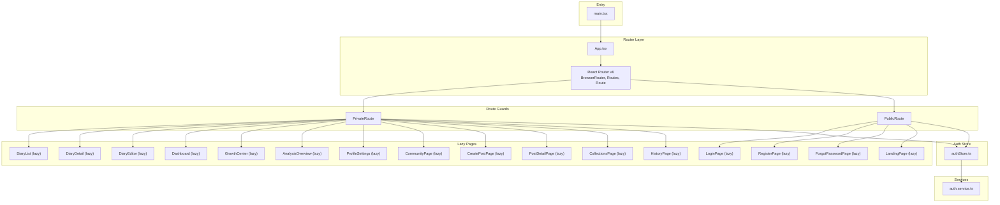
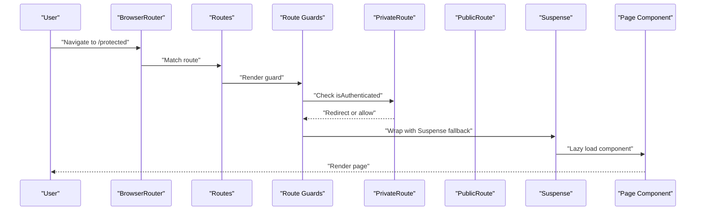
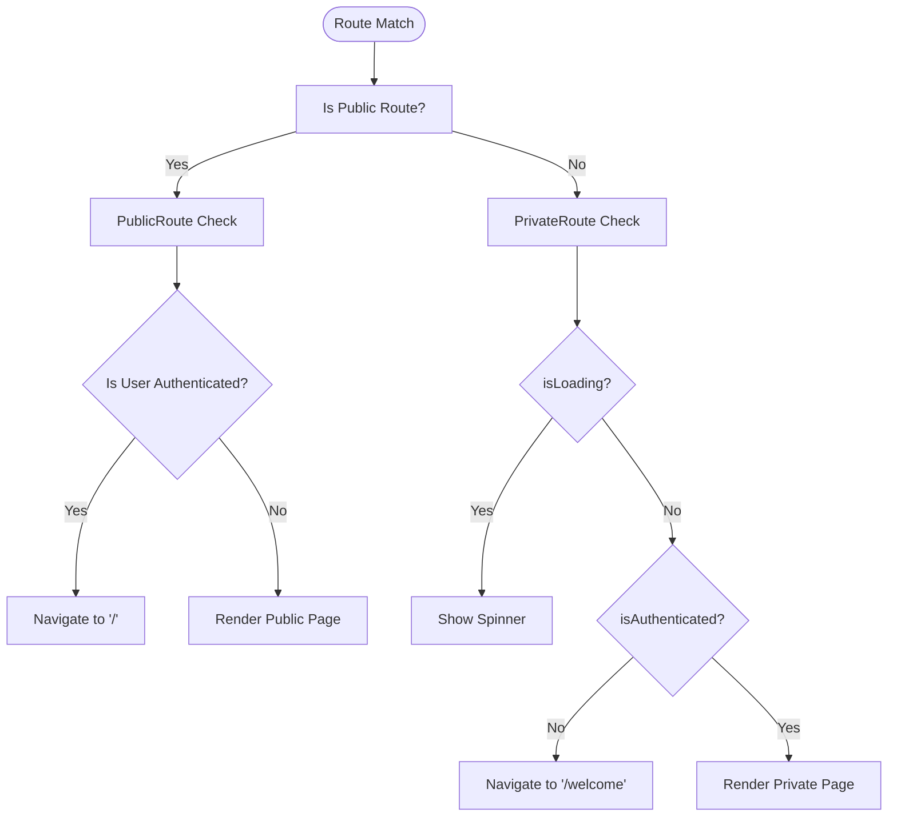
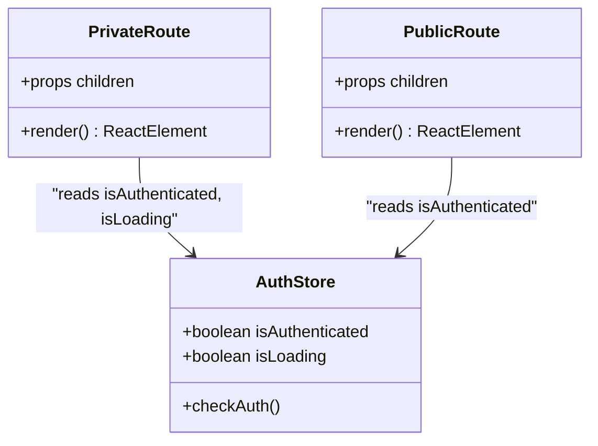
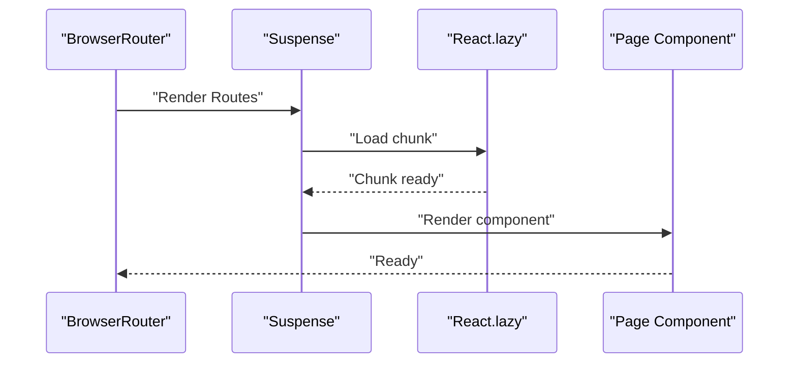
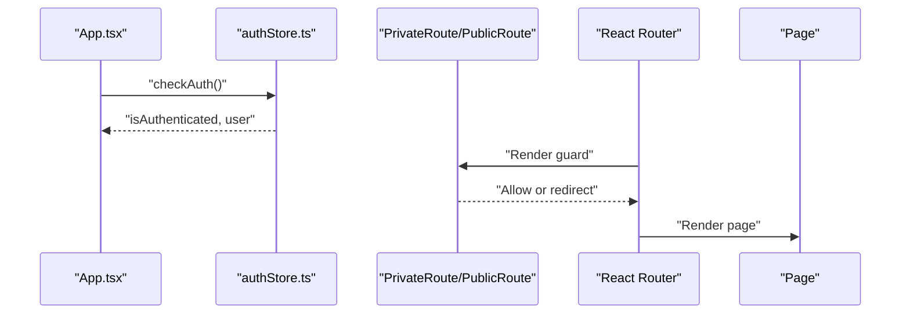
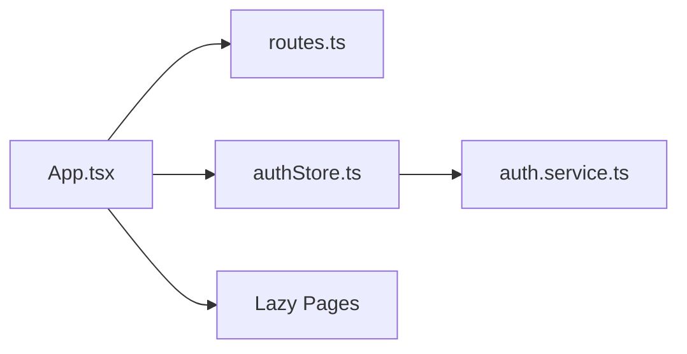

# Routing and Navigation

<cite>
**Referenced Files in This Document**
- [routes.ts](file://frontend/src/constants/routes.ts)
- [App.tsx](file://frontend/src/App.tsx)
- [main.tsx](file://frontend/src/main.tsx)
- [authStore.ts](file://frontend/src/store/authStore.ts)
- [auth.service.ts](file://frontend/src/services/auth.service.ts)
- [LoginPage.tsx](file://frontend/src/pages/auth/LoginPage.tsx)
- [Dashboard.tsx](file://frontend/src/pages/dashboard/Dashboard.tsx)
- [DiaryList.tsx](file://frontend/src/pages/diaries/DiaryList.tsx)
</cite>

## Table of Contents
1. [Introduction](#introduction)
2. [Project Structure](#project-structure)
3. [Core Components](#core-components)
4. [Architecture Overview](#architecture-overview)
5. [Detailed Component Analysis](#detailed-component-analysis)
6. [Dependency Analysis](#dependency-analysis)
7. [Performance Considerations](#performance-considerations)
8. [Troubleshooting Guide](#troubleshooting-guide)
9. [Conclusion](#conclusion)

## Introduction
This document explains the routing and navigation system of the 映记 React application built with React Router v6. It covers route configuration, authentication-based route protection, lazy loading with React.lazy and Suspense, navigation patterns, route parameters and query handling, and the relationship between routing and authentication state. It also documents programmatic navigation, route transitions, and fallback/error handling.

## Project Structure
The routing system is centered around a single App root component that defines all routes, guarded by PrivateRoute and PublicRoute wrappers. Pages are lazily loaded to improve initial load performance. Authentication state is managed in a Zustand store and used to enforce route guards.

**Diagram sources**
- [main.tsx:1-12](file://frontend/src/main.tsx#L1-L12)
- [App.tsx:1-242](file://frontend/src/App.tsx#L1-L242)
- [authStore.ts:1-146](file://frontend/src/store/authStore.ts#L1-L146)
- [auth.service.ts:1-100](file://frontend/src/services/auth.service.ts#L1-L100)

**Section sources**
- [main.tsx:1-12](file://frontend/src/main.tsx#L1-L12)
- [App.tsx:1-242](file://frontend/src/App.tsx#L1-L242)

## Core Components
- Route constants and grouping:
  - routes.ts defines named route keys and helpers for dynamic segments, and exports publicRoutes and privateRoutes arrays for convenience.
- Route definitions and guards:
  - App.tsx declares all routes under a single Routes block, wrapping private routes with PrivateRoute and public routes with PublicRoute.
  - PrivateRoute enforces authentication and shows a spinner while checking auth; PublicRoute blocks logged-in users from accessing login/register-like pages.
- Lazy loading:
  - Pages are imported lazily using React.lazy and wrapped in a global Suspense fallback in App.tsx.
- Programmatic navigation:
  - useNavigate is used across pages to redirect after login, navigate to settings, and move between views.
- Fallback and redirects:
  - A wildcard "*" route navigates to the welcome/public landing page, ensuring graceful handling of unknown paths.

**Section sources**
- [routes.ts:1-32](file://frontend/src/constants/routes.ts#L1-L32)
- [App.tsx:32-59](file://frontend/src/App.tsx#L32-L59)
- [App.tsx:78-233](file://frontend/src/App.tsx#L78-L233)

## Architecture Overview
The routing architecture separates public and private concerns:
- Public routes: welcome, login, register, forgot password, and legal pages.
- Private routes: dashboard, diaries, growth/analysis, settings, and community.
- Route guards are enforced at render-time via wrapper components that inspect authentication state from the store.
- Lazy loading is applied globally via Suspense and per-route lazy imports.

**Diagram sources**
- [App.tsx:32-59](file://frontend/src/App.tsx#L32-L59)
- [App.tsx:78-233](file://frontend/src/App.tsx#L78-L233)

## Detailed Component Analysis

### Route Constants and Grouping
- Purpose: Centralized route keys and helpers for dynamic segments, plus arrays for public/private categorization.
- Dynamic routes:
  - Diary detail and edit routes accept an id parameter.
  - Analysis result route accepts an id parameter.
- Groupings:
  - publicRoutes includes login and register paths.
  - privateRoutes includes all authenticated paths.

**Section sources**
- [routes.ts:1-32](file://frontend/src/constants/routes.ts#L1-L32)

### Route Definitions and Guarded Rendering
- Public routes:
  - "/welcome", "/login", "/register", "/forgot-password".
  - Wrapped with PublicRoute to prevent authenticated users from re-accessing these pages.
- Legal pages:
  - "/privacy", "/terms", "/refund" are publicly accessible without guards.
- Private routes:
  - "/", "/diaries", "/diaries/:id", "/diaries/new", "/diaries/:id/edit", "/growth", "/timeline", "/analysis", "/analysis/:id", "/settings", and community routes.
  - Wrapped with PrivateRoute to enforce authentication.
- Redirects and aliases:
  - "/timeline" redirects to "/growth".
  - "/analysis/:id" redirects to "/analysis" to normalize the route.
  - "*" wildcard redirects to "/welcome".

**Diagram sources**
- [App.tsx:32-59](file://frontend/src/App.tsx#L32-L59)
- [App.tsx:78-233](file://frontend/src/App.tsx#L78-L233)

**Section sources**
- [App.tsx:78-233](file://frontend/src/App.tsx#L78-L233)

### Route Guards: PrivateRoute and PublicRoute
- PrivateRoute:
  - Blocks unauthenticated users and shows a spinner during auth checks.
  - Redirects to "/welcome" when not authenticated.
- PublicRoute:
  - Blocks authenticated users and redirects to "/".
- Both rely on the auth store’s isAuthenticated and isLoading flags.

**Diagram sources**
- [App.tsx:32-59](file://frontend/src/App.tsx#L32-L59)
- [authStore.ts:1-146](file://frontend/src/store/authStore.ts#L1-L146)

**Section sources**
- [App.tsx:32-59](file://frontend/src/App.tsx#L32-L59)
- [authStore.ts:1-146](file://frontend/src/store/authStore.ts#L1-L146)

### Lazy Loading and Suspense
- Global Suspense fallback:
  - A single Suspense wraps the entire Routes block to show a spinner while any lazy-loaded page is being fetched.
- Per-route lazy imports:
  - Diaries, dashboard, growth center, analysis overview, profile settings, community pages, and legal pages are lazy-loaded.
- Benefits:
  - Reduced initial bundle size and improved perceived performance.

**Diagram sources**
- [App.tsx:12-30](file://frontend/src/App.tsx#L12-L30)
- [App.tsx:71-77](file://frontend/src/App.tsx#L71-L77)

**Section sources**
- [App.tsx:12-30](file://frontend/src/App.tsx#L12-L30)
- [App.tsx:71-77](file://frontend/src/App.tsx#L71-L77)

### Navigation Patterns and Programmatic Navigation
- useNavigate is used extensively:
  - After successful login, navigate to "/".
  - From login to register and forgot-password.
  - From dashboard to settings, diaries, growth, and analysis.
  - From diary list to create/edit/detail and back.
- Consistent navigation targets:
  - Use route constants for centralized URLs and dynamic segment helpers.

Examples of programmatic navigation:
- LoginPage: navigate to "/" after login success.
- Dashboard: navigate to "/settings", "/diaries/new", "/diaries", "/growth", "/analysis".
- DiaryList: navigate back to "/" and to "/diaries/new" or "/diaries/:id".

**Section sources**
- [LoginPage.tsx:12-58](file://frontend/src/pages/auth/LoginPage.tsx#L12-L58)
- [Dashboard.tsx:10-72](file://frontend/src/pages/dashboard/Dashboard.tsx#L10-L72)
- [DiaryList.tsx:24-52](file://frontend/src/pages/diaries/DiaryList.tsx#L24-L52)

### Route Parameters and Query Handling
- Route parameters:
  - "/diaries/:id" and "/diaries/:id/edit" for diary detail and editing.
  - "/analysis/:id" for analysis result view (redirects to "/analysis" in route config).
  - "/community/post/:id" for post detail.
- Query handling:
  - No explicit query string parsing is shown in the analyzed files. If needed, integrate useSearchParams from react-router-dom in target pages.

**Section sources**
- [App.tsx:135-157](file://frontend/src/App.tsx#L135-L157)
- [App.tsx:176-179](file://frontend/src/App.tsx#L176-L179)
- [App.tsx:206-212](file://frontend/src/App.tsx#L206-L212)

### Relationship Between Routing and Authentication State
- Auth initialization:
  - App triggers checkAuth on mount to hydrate authentication state from local storage and backend.
- Guard enforcement:
  - PrivateRoute prevents navigation to protected areas until authentication is confirmed.
  - PublicRoute prevents logged-in users from accessing login/register pages.
- Automatic redirects:
  - Unauthenticated users are redirected to "/welcome".
  - Logged-in users are redirected away from public auth pages to "/".
- Logout behavior:
  - Dashboard logout clears auth state and navigates to "/login".

**Diagram sources**
- [App.tsx:61-66](file://frontend/src/App.tsx#L61-L66)
- [authStore.ts:107-132](file://frontend/src/store/authStore.ts#L107-L132)
- [App.tsx:32-59](file://frontend/src/App.tsx#L32-L59)

**Section sources**
- [App.tsx:61-66](file://frontend/src/App.tsx#L61-L66)
- [authStore.ts:107-132](file://frontend/src/store/authStore.ts#L107-L132)
- [App.tsx:32-59](file://frontend/src/App.tsx#L32-L59)

### Fallback Routes and 404 Handling
- Wildcard fallback:
  - "*" route navigates to "/welcome" to ensure users land on a safe public page when entering an invalid URL.
- Additional alias:
  - "/timeline" redirects to "/growth" to normalize navigation.

**Section sources**
- [App.tsx:167](file://frontend/src/App.tsx#L167)
- [App.tsx:232](file://frontend/src/App.tsx#L232)

## Dependency Analysis
- App.tsx depends on:
  - Route constants for route definitions.
  - Auth store for guard logic.
  - Services for authentication initialization.
- Route guards depend on auth store state.
- Pages depend on navigation utilities and route constants.

**Diagram sources**
- [App.tsx:1-242](file://frontend/src/App.tsx#L1-L242)
- [routes.ts:1-32](file://frontend/src/constants/routes.ts#L1-L32)
- [authStore.ts:1-146](file://frontend/src/store/authStore.ts#L1-L146)
- [auth.service.ts:1-100](file://frontend/src/services/auth.service.ts#L1-L100)

**Section sources**
- [App.tsx:1-242](file://frontend/src/App.tsx#L1-L242)
- [routes.ts:1-32](file://frontend/src/constants/routes.ts#L1-L32)
- [authStore.ts:1-146](file://frontend/src/store/authStore.ts#L1-L146)
- [auth.service.ts:1-100](file://frontend/src/services/auth.service.ts#L1-L100)

## Performance Considerations
- Lazy loading reduces initial payload and improves first paint.
- A single global Suspense fallback ensures consistent UX during chunk loads.
- Keep route guards lightweight; avoid heavy computations inside PrivateRoute/PublicRoute render path.
- Consider prefetching frequently visited pages if navigation latency becomes noticeable.

## Troubleshooting Guide
- Users stuck on spinner:
  - Check auth store initialization and network requests to the backend for user retrieval.
- Auth guard redirect loops:
  - Verify isAuthenticated and isLoading transitions and ensure checkAuth resolves quickly.
- Public route still accessible when logged in:
  - Confirm PublicRoute logic and that it redirects to "/" for authenticated users.
- 404 pages:
  - Ensure "*" fallback navigates to a valid public route.
- Logout does not redirect:
  - Confirm logout action clears state and navigation to "/login" occurs after async operation completes.

**Section sources**
- [authStore.ts:107-132](file://frontend/src/store/authStore.ts#L107-L132)
- [App.tsx:32-59](file://frontend/src/App.tsx#L32-L59)
- [App.tsx:232](file://frontend/src/App.tsx#L232)

## Conclusion
The 映记 routing system leverages React Router v6 with clear separation of public and private routes, robust authentication guards, and efficient lazy loading. Route constants centralize URLs and dynamic segments, while programmatic navigation ensures smooth user flows. The combination of Suspense, guard components, and a persistent auth store delivers a secure and responsive navigation experience.