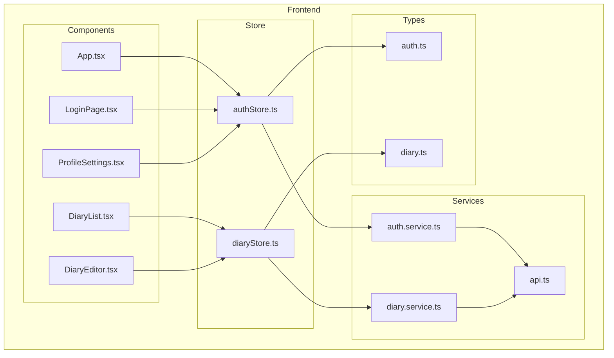
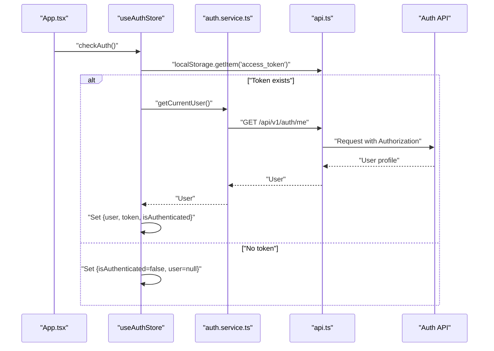
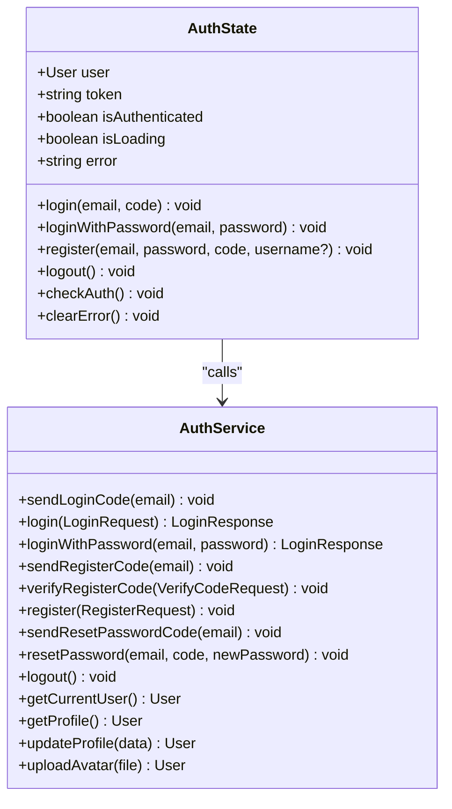
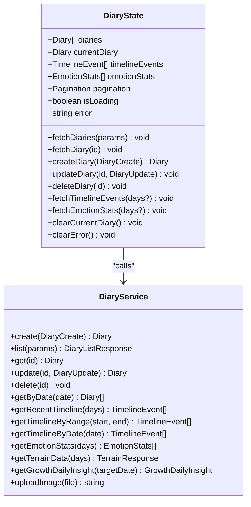
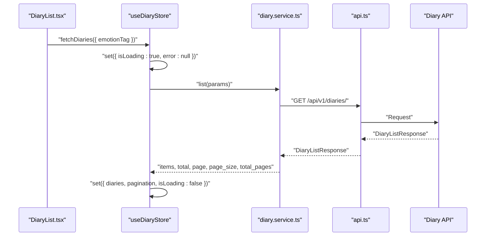
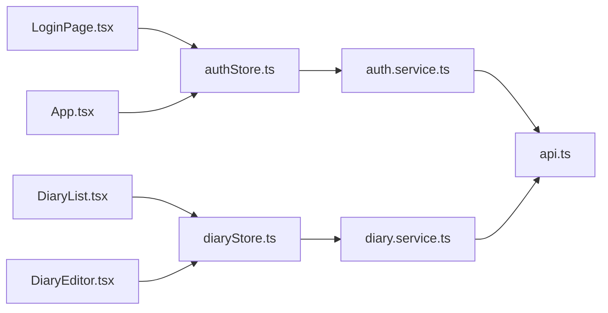

# State Management

<cite>
**Referenced Files in This Document**
- [authStore.ts](file://frontend/src/store/authStore.ts)
- [diaryStore.ts](file://frontend/src/store/diaryStore.ts)
- [auth.ts](file://frontend/src/types/auth.ts)
- [diary.ts](file://frontend/src/types/diary.ts)
- [auth.service.ts](file://frontend/src/services/auth.service.ts)
- [diary.service.ts](file://frontend/src/services/diary.service.ts)
- [api.ts](file://frontend/src/services/api.ts)
- [App.tsx](file://frontend/src/App.tsx)
- [LoginPage.tsx](file://frontend/src/pages/auth/LoginPage.tsx)
- [DiaryEditor.tsx](file://frontend/src/pages/diaries/DiaryEditor.tsx)
- [DiaryList.tsx](file://frontend/src/pages/diaries/DiaryList.tsx)
- [ProfileSettings.tsx](file://frontend/src/pages/settings/ProfileSettings.tsx)
</cite>

## Table of Contents
1. [Introduction](#introduction)
2. [Project Structure](#project-structure)
3. [Core Components](#core-components)
4. [Architecture Overview](#architecture-overview)
5. [Detailed Component Analysis](#detailed-component-analysis)
6. [Dependency Analysis](#dependency-analysis)
7. [Performance Considerations](#performance-considerations)
8. [Troubleshooting Guide](#troubleshooting-guide)
9. [Conclusion](#conclusion)

## Introduction
This document explains the state management architecture of the 映记 application built with Zustand. It covers two global stores:
- Authentication store: manages user session, tokens, and authentication lifecycle
- Diary store: manages diary entries, editing states, timelines, and statistics

It documents initialization, actions, selectors, middleware patterns, subscriptions, updates, persistence strategies, and integration with React components. It also provides debugging techniques and practical usage examples.

## Project Structure
The state management is implemented in the frontend under the store directory, with supporting types and services:
- Store definitions: authentication and diary stores
- Types: strongly typed models for authentication and diary domain
- Services: API clients for authentication and diary operations
- App routing and components: demonstrate store usage and lifecycle

**Diagram sources**
- [authStore.ts:1-146](file://frontend/src/store/authStore.ts#L1-L146)
- [diaryStore.ts:1-164](file://frontend/src/store/diaryStore.ts#L1-L164)
- [auth.ts:1-45](file://frontend/src/types/auth.ts#L1-L45)
- [diary.ts:1-128](file://frontend/src/types/diary.ts#L1-L128)
- [auth.service.ts:1-100](file://frontend/src/services/auth.service.ts#L1-L100)
- [diary.service.ts:1-112](file://frontend/src/services/diary.service.ts#L1-L112)
- [api.ts:1-43](file://frontend/src/services/api.ts#L1-L43)
- [App.tsx:1-242](file://frontend/src/App.tsx#L1-L242)
- [LoginPage.tsx:1-263](file://frontend/src/pages/auth/LoginPage.tsx#L1-L263)
- [DiaryList.tsx:1-211](file://frontend/src/pages/diaries/DiaryList.tsx#L1-L211)
- [DiaryEditor.tsx:1-368](file://frontend/src/pages/diaries/DiaryEditor.tsx#L1-L368)
- [ProfileSettings.tsx](file://frontend/src/pages/settings/ProfileSettings.tsx)

**Section sources**
- [authStore.ts:1-146](file://frontend/src/store/authStore.ts#L1-L146)
- [diaryStore.ts:1-164](file://frontend/src/store/diaryStore.ts#L1-L164)
- [auth.ts:1-45](file://frontend/src/types/auth.ts#L1-L45)
- [diary.ts:1-128](file://frontend/src/types/diary.ts#L1-L128)
- [auth.service.ts:1-100](file://frontend/src/services/auth.service.ts#L1-L100)
- [diary.service.ts:1-112](file://frontend/src/services/diary.service.ts#L1-L112)
- [api.ts:1-43](file://frontend/src/services/api.ts#L1-L43)
- [App.tsx:1-242](file://frontend/src/App.tsx#L1-L242)
- [LoginPage.tsx:1-263](file://frontend/src/pages/auth/LoginPage.tsx#L1-L263)
- [DiaryList.tsx:1-211](file://frontend/src/pages/diaries/DiaryList.tsx#L1-L211)
- [DiaryEditor.tsx:1-368](file://frontend/src/pages/diaries/DiaryEditor.tsx#L1-L368)
- [ProfileSettings.tsx](file://frontend/src/pages/settings/ProfileSettings.tsx)

## Core Components
- Authentication store (Zustand):
  - State: user, token, isAuthenticated, isLoading, error
  - Actions: login, loginWithPassword, register, logout, checkAuth, clearError
  - Persistence: localStorage via Zustand persist middleware (partialized subset)
- Diary store (Zustand):
  - State: diaries, currentDiary, timelineEvents, emotionStats, pagination, isLoading, error
  - Actions: fetchDiaries, fetchDiary, createDiary, updateDiary, deleteDiary, fetchTimelineEvents, fetchEmotionStats, clearCurrentDiary, clearError
- API client (Axios):
  - Interceptors: attach Authorization header from localStorage, handle 401 globally
- Type definitions:
  - Authentication types: User, LoginRequest, LoginResponse, RegisterRequest, VerifyCodeRequest
  - Diary types: Diary, DiaryCreate, DiaryUpdate, TimelineEvent, EmotionStats, TerrainResponse, GrowthDailyInsight

Key patterns:
- Actions encapsulate async flows and update state atomically
- Stores subscribe to state changes via hook-based subscriptions
- Middleware persists only selected slices to localStorage
- Global interceptors centralize token handling and error normalization

**Section sources**
- [authStore.ts:7-21](file://frontend/src/store/authStore.ts#L7-L21)
- [authStore.ts:23-145](file://frontend/src/store/authStore.ts#L23-L145)
- [diaryStore.ts:6-34](file://frontend/src/store/diaryStore.ts#L6-L34)
- [diaryStore.ts:36-163](file://frontend/src/store/diaryStore.ts#L36-L163)
- [api.ts:14-40](file://frontend/src/services/api.ts#L14-L40)
- [auth.ts:3-44](file://frontend/src/types/auth.ts#L3-L44)
- [diary.ts:6-127](file://frontend/src/types/diary.ts#L6-L127)

## Architecture Overview
The application initializes the authentication state on boot, synchronizes with the backend, and exposes reactive state to components. Components consume stores via hooks and drive UI updates. Services abstract API calls, while the Axios client injects tokens and normalizes errors.

**Diagram sources**
- [App.tsx:61-66](file://frontend/src/App.tsx#L61-L66)
- [authStore.ts:107-132](file://frontend/src/store/authStore.ts#L107-L132)
- [auth.service.ts:66-70](file://frontend/src/services/auth.service.ts#L66-L70)
- [api.ts:14-26](file://frontend/src/services/api.ts#L14-L26)

## Detailed Component Analysis

### Authentication Store
The authentication store manages user session lifecycle, token handling, and error states. It integrates with the auth service and persists a minimal slice to localStorage.

**Diagram sources**
- [authStore.ts:7-21](file://frontend/src/store/authStore.ts#L7-L21)
- [authStore.ts:23-145](file://frontend/src/store/authStore.ts#L23-L145)
- [auth.service.ts:11-99](file://frontend/src/services/auth.service.ts#L11-L99)

Key behaviors:
- Initialization: defaults to unauthenticated, loading=false, empty error
- Login variants: code-based and password-based flows update user, token, and isAuthenticated; persist token to localStorage
- Registration: verifies code then registers; clears loading on success
- Logout: calls backend endpoint, resets local state, removes token
- Session check: reads token from localStorage, validates against backend, syncs state; removes stale token on failure
- Error handling: centralized in actions; clearError resets error state

Selectors and subscriptions:
- Components subscribe to user, isAuthenticated, isLoading, error
- Example usage: LoginPage consumes login, loginWithPassword, isLoading, error, clearError

Persistence:
- Persist middleware configured to save user, token, isAuthenticated to localStorage
- Partialization ensures sensitive/full state is not persisted

**Section sources**
- [authStore.ts:23-145](file://frontend/src/store/authStore.ts#L23-L145)
- [auth.service.ts:11-99](file://frontend/src/services/auth.service.ts#L11-L99)
- [LoginPage.tsx:11-58](file://frontend/src/pages/auth/LoginPage.tsx#L11-L58)

### Diary Store
The diary store manages lists, current item, timeline events, emotion statistics, pagination, and loading/error states. It delegates network operations to the diary service.

**Diagram sources**
- [diaryStore.ts:6-34](file://frontend/src/store/diaryStore.ts#L6-L34)
- [diaryStore.ts:36-163](file://frontend/src/store/diaryStore.ts#L36-L163)
- [diary.service.ts:14-111](file://frontend/src/services/diary.service.ts#L14-L111)

Key behaviors:
- Lists and pagination: fetchDiaries updates items and pagination metadata
- CRUD: createDiary prepends to list; updateDiary replaces in list and currentDiary if applicable; deleteDiary removes from list and clears currentDiary if matched
- Timeline and stats: fetchTimelineEvents and fetchEmotionStats populate respective slices
- Editing state: clearCurrentDiary resets currentDiary; clearError resets error
- Error handling: actions set error and loading flags; consumers show feedback

Selectors and subscriptions:
- Components subscribe to diaries, currentDiary, pagination, isLoading, error
- Examples:
  - DiaryList subscribes to diaries, pagination, fetchDiaries, deleteDiary
  - DiaryEditor subscribes to createDiary, updateDiary, isLoading

**Section sources**
- [diaryStore.ts:36-163](file://frontend/src/store/diaryStore.ts#L36-L163)
- [diary.service.ts:14-111](file://frontend/src/services/diary.service.ts#L14-L111)
- [DiaryList.tsx:23-52](file://frontend/src/pages/diaries/DiaryList.tsx#L23-L52)
- [DiaryEditor.tsx:40-143](file://frontend/src/pages/diaries/DiaryEditor.tsx#L40-L143)

### State Initialization and Lifecycle
- App bootstrapping:
  - App.tsx calls useAuthStore.checkAuth() on mount to synchronize state with backend
  - PrivateRoute and PublicRoute use isAuthenticated and isLoading to guard navigation
- Authentication lifecycle:
  - On successful login, token is stored in localStorage and injected into API requests
  - On 401 responses, API interceptor clears tokens and redirects to welcome
- Diary lifecycle:
  - Components trigger fetchDiaries and fetchDiary to hydrate state
  - CRUD actions update state optimistically and synchronously where appropriate

**Diagram sources**
- [DiaryList.tsx:29-31](file://frontend/src/pages/diaries/DiaryList.tsx#L29-L31)
- [diaryStore.ts:50-74](file://frontend/src/store/diaryStore.ts#L50-L74)
- [diary.service.ts:21-31](file://frontend/src/services/diary.service.ts#L21-L31)
- [api.ts:28-40](file://frontend/src/services/api.ts#L28-L40)

**Section sources**
- [App.tsx:61-66](file://frontend/src/App.tsx#L61-L66)
- [App.tsx:32-59](file://frontend/src/App.tsx#L32-L59)
- [api.ts:14-40](file://frontend/src/services/api.ts#L14-L40)
- [diaryStore.ts:50-74](file://frontend/src/store/diaryStore.ts#L50-L74)

### State Subscriptions and Updates
- Subscription pattern:
  - Components import useAuthStore/useDiaryStore and destructure required state/actions
  - React re-renders when subscribed slices change
- Update patterns:
  - Actions set loading/error, perform async work, then update state
  - Some actions use functional updates to derive next state from previous state
- Example integrations:
  - LoginPage: consumes login, loginWithPassword, isLoading, error, clearError
  - DiaryList: consumes diaries, pagination, fetchDiaries, deleteDiary
  - DiaryEditor: consumes createDiary, updateDiary, isLoading
  - ProfileSettings: updates user via useAuthStore.setState

**Section sources**
- [LoginPage.tsx:11-58](file://frontend/src/pages/auth/LoginPage.tsx#L11-L58)
- [DiaryList.tsx:23-52](file://frontend/src/pages/diaries/DiaryList.tsx#L23-L52)
- [DiaryEditor.tsx:40-143](file://frontend/src/pages/diaries/DiaryEditor.tsx#L40-L143)
- [ProfileSettings.tsx](file://frontend/src/pages/settings/ProfileSettings.tsx)

### Middleware Patterns
- Persist middleware (authentication store):
  - Saves user, token, isAuthenticated to localStorage
  - Partialization avoids persisting unnecessary fields
- Request/response interceptors (API client):
  - Adds Authorization header from localStorage
  - Handles 401 globally by clearing tokens and redirecting

**Section sources**
- [authStore.ts:136-144](file://frontend/src/store/authStore.ts#L136-L144)
- [api.ts:14-40](file://frontend/src/services/api.ts#L14-L40)

### State Usage Examples in Components
- Authentication:
  - LoginPage: triggers login variants, shows error/loading, navigates on success
  - App: guards routes using isAuthenticated/isLoading
- Diary:
  - DiaryList: loads paginated diaries, applies emotion filters, deletes entries
  - DiaryEditor: creates/updates diary entries, manages emotion tags and importance score
- Settings:
  - ProfileSettings: updates user via useAuthStore.setState after service call

**Section sources**
- [LoginPage.tsx:11-58](file://frontend/src/pages/auth/LoginPage.tsx#L11-L58)
- [App.tsx:32-59](file://frontend/src/App.tsx#L32-L59)
- [DiaryList.tsx:23-52](file://frontend/src/pages/diaries/DiaryList.tsx#L23-L52)
- [DiaryEditor.tsx:40-143](file://frontend/src/pages/diaries/DiaryEditor.tsx#L40-L143)
- [ProfileSettings.tsx](file://frontend/src/pages/settings/ProfileSettings.tsx)

## Dependency Analysis
- Store-to-service coupling:
  - authStore depends on authService
  - diaryStore depends on diaryService
- Service-to-API coupling:
  - Both services depend on api client
- API client to backend:
  - Interceptors enforce token presence and handle unauthorized responses
- Component-to-store coupling:
  - Components import and subscribe to specific store slices

**Diagram sources**
- [authStore.ts:1-146](file://frontend/src/store/authStore.ts#L1-L146)
- [diaryStore.ts:1-164](file://frontend/src/store/diaryStore.ts#L1-L164)
- [auth.service.ts:1-100](file://frontend/src/services/auth.service.ts#L1-L100)
- [diary.service.ts:1-112](file://frontend/src/services/diary.service.ts#L1-L112)
- [api.ts:1-43](file://frontend/src/services/api.ts#L1-L43)
- [LoginPage.tsx:1-263](file://frontend/src/pages/auth/LoginPage.tsx#L1-L263)
- [DiaryList.tsx:1-211](file://frontend/src/pages/diaries/DiaryList.tsx#L1-L211)
- [DiaryEditor.tsx:1-368](file://frontend/src/pages/diaries/DiaryEditor.tsx#L1-L368)
- [App.tsx:1-242](file://frontend/src/App.tsx#L1-L242)

**Section sources**
- [authStore.ts:1-146](file://frontend/src/store/authStore.ts#L1-L146)
- [diaryStore.ts:1-164](file://frontend/src/store/diaryStore.ts#L1-L164)
- [auth.service.ts:1-100](file://frontend/src/services/auth.service.ts#L1-L100)
- [diary.service.ts:1-112](file://frontend/src/services/diary.service.ts#L1-L112)
- [api.ts:1-43](file://frontend/src/services/api.ts#L1-L43)
- [LoginPage.tsx:1-263](file://frontend/src/pages/auth/LoginPage.tsx#L1-L263)
- [DiaryList.tsx:1-211](file://frontend/src/pages/diaries/DiaryList.tsx#L1-L211)
- [DiaryEditor.tsx:1-368](file://frontend/src/pages/diaries/DiaryEditor.tsx#L1-L368)
- [App.tsx:1-242](file://frontend/src/App.tsx#L1-L242)

## Performance Considerations
- Prefer functional updates in stores when deriving state from previous state to avoid stale reads
- Batch UI updates by minimizing intermediate renders during long async operations
- Use pagination and selective fetching to limit payload sizes
- Debounce or throttle frequent actions (e.g., real-time filters) to reduce redundant network calls
- Keep persisted slices minimal to reduce storage overhead and improve hydration speed

## Troubleshooting Guide
Common issues and resolutions:
- Stale token causing 401:
  - Symptom: Unauthorized errors or forced redirect to welcome
  - Resolution: API interceptor clears tokens automatically; ensure checkAuth runs on app start
- Login/registration failures:
  - Symptom: Error messages shown to user
  - Resolution: Inspect action error handling and surface user-friendly messages; verify backend endpoints and network connectivity
- State not updating after edits:
  - Symptom: UI reflects old data after create/update/delete
  - Resolution: Verify that actions update both list and currentDiary when applicable; ensure functional updates are used
- Excessive re-renders:
  - Symptom: Jank during list operations
  - Resolution: Narrow subscriptions to minimal state slices; avoid subscribing to entire store

Debugging techniques:
- Add logging around store actions to trace state transitions
- Use browser devtools to inspect localStorage keys managed by persist middleware
- Temporarily disable persist middleware to isolate hydration issues
- Verify Authorization header presence in network requests via devtools

**Section sources**
- [api.ts:14-40](file://frontend/src/services/api.ts#L14-L40)
- [authStore.ts:32-50](file://frontend/src/store/authStore.ts#L32-L50)
- [authStore.ts:72-90](file://frontend/src/store/authStore.ts#L72-L90)
- [diaryStore.ts:89-105](file://frontend/src/store/diaryStore.ts#L89-L105)
- [diaryStore.ts:107-123](file://frontend/src/store/diaryStore.ts#L107-L123)
- [diaryStore.ts:125-141](file://frontend/src/store/diaryStore.ts#L125-L141)

## Conclusion
The 映记 application employs a clean, modular state management architecture using Zustand:
- Authentication store handles session lifecycle and integrates with backend APIs and localStorage
- Diary store encapsulates CRUD, pagination, and analytics data flows
- Strong typing, service abstraction, and interceptors ensure predictable behavior
- Components subscribe to minimal state slices for efficient rendering
- Persistence and interceptors provide robust defaults for tokens and error handling

This design supports scalability, maintainability, and a smooth user experience across authentication and diary management workflows.