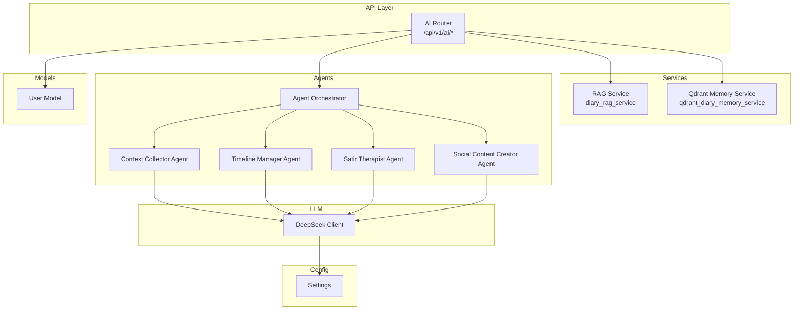
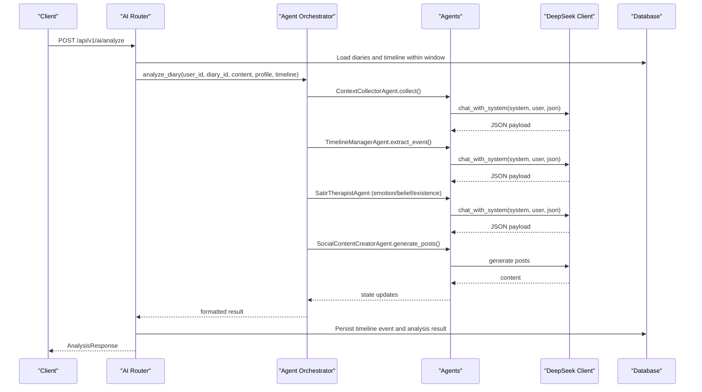
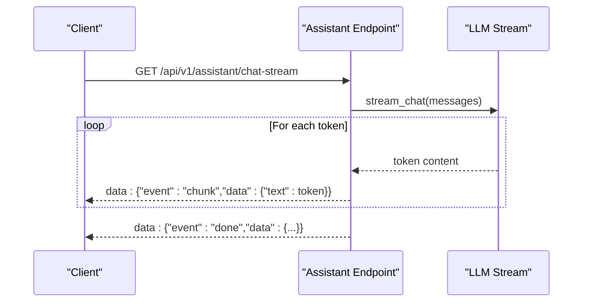
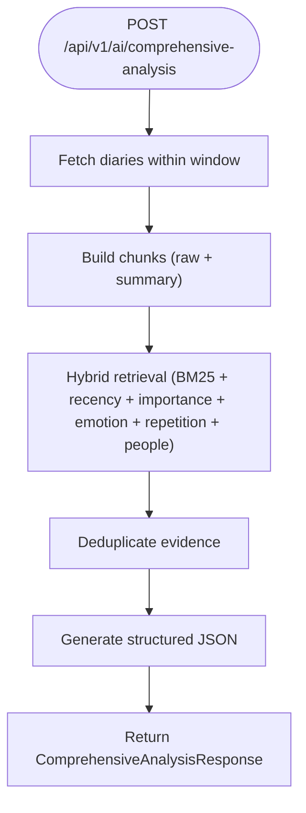
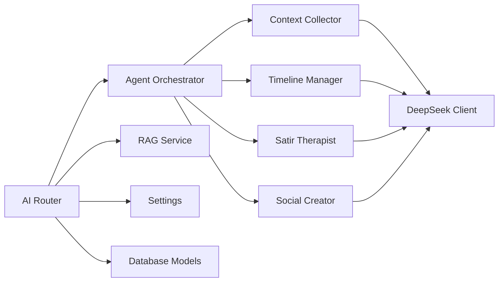

# AI Analysis Endpoints

<cite>
**Referenced Files in This Document**
- [ai.py](file://backend/app/api/v1/ai.py)
- [ai.py (schemas)](file://backend/app/schemas/ai.py)
- [rag_service.py](file://backend/app/services/rag_service.py)
- [orchestrator.py](file://backend/app/agents/orchestrator.py)
- [agent_impl.py](file://backend/app/agents/agent_impl.py)
- [llm.py](file://backend/app/agents/llm.py)
- [config.py](file://backend/app/core/config.py)
- [database.py](file://backend/app/models/database.py)
- [assistant.py](file://backend/app/api/v1/assistant.py)
</cite>

## Table of Contents
1. [Introduction](#introduction)
2. [Project Structure](#project-structure)
3. [Core Components](#core-components)
4. [Architecture Overview](#architecture-overview)
5. [Detailed Component Analysis](#detailed-component-analysis)
6. [Dependency Analysis](#dependency-analysis)
7. [Performance Considerations](#performance-considerations)
8. [Troubleshooting Guide](#troubleshooting-guide)
9. [Conclusion](#conclusion)

## Introduction
This document provides comprehensive API documentation for AI analysis endpoints in the backend. It covers:
- Psychological analysis endpoint for integrated diary analysis
- Multi-day comprehensive analysis using retrieval-augmented synthesis
- Social content generation for WeChat-style posts
- Real-time streaming capabilities via SSE for AI responses
- Batch processing and historical analysis retrieval
- RAG implementation details, LLM integration, and agent orchestration
- Authentication requirements, request/response schemas, streaming protocols, and operational guidance

## Project Structure
The AI analysis functionality is organized under the FastAPI router with modular components:
- API endpoints: centralized in the AI router
- Schemas: request/response models for type safety
- Services: RAG pipeline and memory synchronization
- Agents: multi-agent orchestration and specialized analysis agents
- LLM client: unified interface to external LLM provider
- Configuration: environment-driven settings for LLM provider and optional vector store

**Diagram sources**
- [ai.py](file://backend/app/api/v1/ai.py#L31)
- [rag_service.py](file://backend/app/services/rag_service.py#L147)
- [orchestrator.py](file://backend/app/agents/orchestrator.py#L18)
- [agent_impl.py](file://backend/app/agents/agent_impl.py#L92)
- [llm.py](file://backend/app/agents/llm.py#L13)
- [config.py](file://backend/app/core/config.py#L62)

**Section sources**
- [ai.py:1-31](file://backend/app/api/v1/ai.py#L1-L31)
- [ai.py (schemas):1-108](file://backend/app/schemas/ai.py#L1-L108)
- [rag_service.py:1-360](file://backend/app/services/rag_service.py#L1-L360)
- [orchestrator.py:1-176](file://backend/app/agents/orchestrator.py#L1-L176)
- [agent_impl.py:1-484](file://backend/app/agents/agent_impl.py#L1-L484)
- [llm.py:1-220](file://backend/app/agents/llm.py#L1-L220)
- [config.py:1-105](file://backend/app/core/config.py#L1-L105)

## Core Components
- AI Router: exposes endpoints under /api/v1/ai for analysis, guidance, and social content generation
- RAG Service: builds chunks from diary entries, performs lexical retrieval with BM25 and recency weighting, and deduplicates evidence
- Agent Orchestrator: coordinates four specialized agents for context collection, timeline extraction, Satir analysis, and social content creation
- LLM Client: integrates with a DeepSeek-compatible API supporting synchronous and streaming completions
- Configuration: centralizes provider credentials and base URLs

Key capabilities:
- Integrated psychological analysis with multi-day context aggregation
- Retrieval-augmented synthesis for comprehensive user-level insights
- Style-aware social content generation with few-shot samples
- SSE streaming for real-time AI responses

**Section sources**
- [ai.py:31-31](file://backend/app/api/v1/ai.py#L31-L31)
- [rag_service.py:147-360](file://backend/app/services/rag_service.py#L147-L360)
- [orchestrator.py:18-176](file://backend/app/agents/orchestrator.py#L18-L176)
- [agent_impl.py:92-484](file://backend/app/agents/agent_impl.py#L92-L484)
- [llm.py:13-220](file://backend/app/agents/llm.py#L13-L220)
- [config.py:62-70](file://backend/app/core/config.py#L62-L70)

## Architecture Overview
The AI analysis pipeline combines retrieval, orchestration, and generation:
- Data ingestion: fetches diary entries and timeline events within a configurable window
- RAG synthesis: constructs chunks, retrieves relevant evidence, and deduplicates
- Agent orchestration: executes specialized agents sequentially for layered analysis and content generation
- LLM integration: uses structured prompts and JSON responses for robust parsing
- Persistence: stores analysis results and timeline events for later retrieval

**Diagram sources**
- [ai.py:406-638](file://backend/app/api/v1/ai.py#L406-L638)
- [orchestrator.py:27-130](file://backend/app/agents/orchestrator.py#L27-L130)
- [agent_impl.py:92-484](file://backend/app/agents/agent_impl.py#L92-L484)
- [llm.py:68-93](file://backend/app/agents/llm.py#L68-L93)
- [database.py:13-44](file://backend/app/models/database.py#L13-L44)

## Detailed Component Analysis

### Authentication and Authorization
- All AI endpoints require an active user session via dependency injection
- Authentication is enforced using a current active user dependency
- No explicit rate-limiting is implemented in the AI endpoints; consider upstream rate limits from the LLM provider

**Section sources**
- [ai.py:8-29](file://backend/app/api/v1/ai.py#L8-L29)
- [database.py:13-44](file://backend/app/models/database.py#L13-L44)

### Real-Time Streaming Endpoints
- The assistant module provides a streaming endpoint using Server-Sent Events (SSE)
- While not part of the AI analysis router, it demonstrates the streaming pattern used for real-time LLM responses
- Streaming protocol:
  - Media type: text/event-stream
  - Event lines: data: {"event": "...", "data": {...}}
  - Terminates with a DONE event

**Diagram sources**
- [assistant.py:370-389](file://backend/app/api/v1/assistant.py#L370-L389)
- [llm.py:94-143](file://backend/app/agents/llm.py#L94-L143)

**Section sources**
- [assistant.py:370-389](file://backend/app/api/v1/assistant.py#L370-L389)
- [llm.py:94-143](file://backend/app/agents/llm.py#L94-L143)

### Analysis Generation Endpoints

#### POST /api/v1/ai/analyze
- Purpose: Integrated psychological analysis combining diary content, user profile, and timeline context
- Method: POST
- Request body: AnalysisRequest
  - diary_id: optional[int]
  - window_days: int (default 30, range 7–365)
  - max_diaries: int (default 40, range 5–200)
- Response: AnalysisResponse
  - diary_id, user_id, timeline_event, satir_analysis, therapeutic_response, social_posts, metadata
- Behavior:
  - Aggregates diaries within the analysis window
  - Builds user profile and timeline context
  - Executes orchestrator with four agents: context collection, timeline extraction, Satir analysis (emotion/belief/existence), and social content generation
  - Persists timeline event and analysis result for later retrieval
- Streaming: Not implemented for this endpoint; use assistant streaming for real-time responses

**Diagram sources**
- [ai.py:406-638](file://backend/app/api/v1/ai.py#L406-L638)
- [orchestrator.py:27-130](file://backend/app/agents/orchestrator.py#L27-L130)

**Section sources**
- [ai.py:406-638](file://backend/app/api/v1/ai.py#L406-L638)
- [ai.py (schemas):9-14](file://backend/app/schemas/ai.py#L9-L14)
- [ai.py (schemas):74-83](file://backend/app/schemas/ai.py#L74-L83)

#### POST /api/v1/ai/comprehensive-analysis
- Purpose: User-level comprehensive analysis using RAG over historical diaries
- Method: POST
- Request body: ComprehensiveAnalysisRequest
  - window_days: int (default 90, range 14–365)
  - max_diaries: int (default 120, range 20–500)
  - focus: optional[str]
- Response: ComprehensiveAnalysisResponse
  - summary, key_themes, emotion_trends, continuity_signals, turning_points, growth_suggestions, evidence, metadata
- Behavior:
  - Retrieves diaries within window, builds chunks, and performs hybrid retrieval (raw + summary)
  - Deduplicates evidence and falls back to a general query if needed
  - Generates structured JSON response with themes and suggestions

**Diagram sources**
- [ai.py:267-404](file://backend/app/api/v1/ai.py#L267-L404)
- [rag_service.py:147-360](file://backend/app/services/rag_service.py#L147-L360)

**Section sources**
- [ai.py:267-404](file://backend/app/api/v1/ai.py#L267-L404)
- [ai.py (schemas):16-21](file://backend/app/schemas/ai.py#L16-L21)
- [ai.py (schemas):32-42](file://backend/app/schemas/ai.py#L32-L42)
- [rag_service.py:147-360](file://backend/app/services/rag_service.py#L147-L360)

#### POST /api/v1/ai/social-posts
- Purpose: Generate social content (WeChat-style posts) based on diary content and user style samples
- Method: POST
- Request body: AnalysisRequest
- Response: SocialPostResponse (as defined in agent implementation)
- Behavior:
  - Loads user style samples and constructs a few-shot prompt
  - Generates three variants (A, B, C) with distinct styles
  - Falls back to simplified content if generation fails

**Diagram sources**
- [ai.py:770-872](file://backend/app/api/v1/ai.py#L770-L872)
- [agent_impl.py:396-484](file://backend/app/agents/agent_impl.py#L396-L484)

**Section sources**
- [ai.py:770-872](file://backend/app/api/v1/ai.py#L770-L872)
- [agent_impl.py:396-484](file://backend/app/agents/agent_impl.py#L396-L484)

### Additional AI Endpoints

#### GET /api/v1/ai/daily-guidance
- Purpose: Provide a personalized daily writing prompt based on recent diaries
- Method: GET
- Response: DailyGuidanceResponse
- Behavior:
  - Builds a 30-day context window and generates a JSON-formatted question
  - Falls back to predefined questions if generation fails

**Section sources**
- [ai.py:128-206](file://backend/app/api/v1/ai.py#L128-L206)
- [ai.py (schemas):44-49](file://backend/app/schemas/ai.py#L44-L49)

#### GET /api/v1/ai/social-style-samples
- Purpose: Retrieve stored social style samples for a user
- Method: GET
- Response: SocialStyleSamplesResponse

#### PUT /api/v1/ai/social-style-samples
- Purpose: Upsert social style samples with deduplication and normalization
- Method: PUT
- Request body: SocialStyleSamplesRequest
- Response: SocialStyleSamplesResponse

**Section sources**
- [ai.py:209-265](file://backend/app/api/v1/ai.py#L209-L265)
- [ai.py (schemas):51-62](file://backend/app/schemas/ai.py#L51-L62)

#### GET /api/v1/ai/result/{diary_id}
- Purpose: Retrieve previously saved analysis result for a specific diary
- Method: GET
- Response: AnalysisResponse

**Section sources**
- [ai.py:689-711](file://backend/app/api/v1/ai.py#L689-L711)

#### GET /api/v1/ai/analyses
- Purpose: List recent saved analysis records for a user
- Method: GET
- Response: List-like structure with metadata

**Section sources**
- [ai.py:661-687](file://backend/app/api/v1/ai.py#L661-L687)

#### GET /api/v1/ai/models
- Purpose: Report available models and agent system info
- Method: GET
- Response: Available models and agent system details

**Section sources**
- [ai.py:875-902](file://backend/app/api/v1/ai.py#L875-L902)

### Request/Response Schemas

#### AnalysisRequest
- Fields: diary_id (optional), window_days (default 30), max_diaries (default 40)

#### ComprehensiveAnalysisRequest
- Fields: window_days (default 90), max_diaries (default 120), focus (optional)

#### AnalysisResponse
- Fields: diary_id, user_id, timeline_event, satir_analysis, therapeutic_response, social_posts, metadata

#### ComprehensiveAnalysisResponse
- Fields: summary, key_themes, emotion_trends, continuity_signals, turning_points, growth_suggestions, evidence, metadata

#### DailyGuidanceResponse
- Fields: question, source, metadata

#### SocialStyleSamplesRequest
- Fields: samples (list), replace (bool)

#### SocialStyleSamplesResponse
- Fields: total, samples, metadata

**Section sources**
- [ai.py (schemas):9-14](file://backend/app/schemas/ai.py#L9-L14)
- [ai.py (schemas):16-21](file://backend/app/schemas/ai.py#L16-L21)
- [ai.py (schemas):74-83](file://backend/app/schemas/ai.py#L74-L83)
- [ai.py (schemas):32-42](file://backend/app/schemas/ai.py#L32-L42)
- [ai.py (schemas):44-49](file://backend/app/schemas/ai.py#L44-L49)
- [ai.py (schemas):51-62](file://backend/app/schemas/ai.py#L51-L62)

## Dependency Analysis
- API endpoints depend on:
  - Agent orchestrator for multi-step analysis
  - RAG service for evidence retrieval and deduplication
  - LLM client for structured and streaming completions
  - Database models for persistence and context loading
- Configuration drives LLM provider settings and optional vector store integration

**Diagram sources**
- [ai.py](file://backend/app/api/v1/ai.py#L31)
- [orchestrator.py:18-176](file://backend/app/agents/orchestrator.py#L18-L176)
- [agent_impl.py:92-484](file://backend/app/agents/agent_impl.py#L92-L484)
- [llm.py:13-220](file://backend/app/agents/llm.py#L13-L220)
- [rag_service.py:147-360](file://backend/app/services/rag_service.py#L147-L360)
- [config.py:62-70](file://backend/app/core/config.py#L62-L70)
- [database.py:13-44](file://backend/app/models/database.py#L13-L44)

**Section sources**
- [ai.py:1-31](file://backend/app/api/v1/ai.py#L1-L31)
- [orchestrator.py:18-176](file://backend/app/agents/orchestrator.py#L18-L176)
- [agent_impl.py:92-484](file://backend/app/agents/agent_impl.py#L92-L484)
- [llm.py:13-220](file://backend/app/agents/llm.py#L13-L220)
- [rag_service.py:147-360](file://backend/app/services/rag_service.py#L147-L360)
- [config.py:62-70](file://backend/app/core/config.py#L62-L70)
- [database.py:13-44](file://backend/app/models/database.py#L13-L44)

## Performance Considerations
- RAG retrieval cost scales with:
  - Number of diaries within the window
  - Chunk count (original content plus summaries)
  - Top-k and deduplication thresholds
- Recommendations:
  - Limit window_days and max_diaries to reduce latency
  - Use appropriate temperature settings for deterministic outputs
  - Cache frequently accessed user style samples
  - Monitor LLM provider rate limits and implement client-side throttling if needed
- Streaming:
  - Prefer assistant streaming for long-running completions to improve perceived responsiveness

[No sources needed since this section provides general guidance]

## Troubleshooting Guide
- JSON parsing failures:
  - The system includes robust parsing helpers to extract JSON from fenced code blocks or partial responses
  - If parsing fails, endpoints return fallback responses or raise HTTP exceptions
- Agent errors:
  - Orchestrator captures exceptions and populates error metadata
  - Some agents fall back to default or simplified outputs
- Persistence warnings:
  - Analysis results and timeline events are persisted with rollback handling; warnings are included in metadata when persistence fails

**Section sources**
- [ai.py:34-65](file://backend/app/api/v1/ai.py#L34-L65)
- [orchestrator.py:121-130](file://backend/app/agents/orchestrator.py#L121-L130)
- [agent_impl.py:25-68](file://backend/app/agents/agent_impl.py#L25-L68)

## Conclusion
The AI analysis endpoints provide a comprehensive suite for psychological insight, multi-day synthesis, and social content generation. They integrate a lightweight RAG pipeline, a multi-agent orchestration system, and a unified LLM client. For production deployments, pair these endpoints with proper rate limiting, caching, and monitoring to ensure reliable performance and user experience.