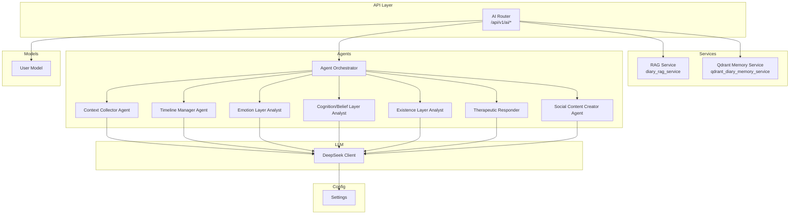
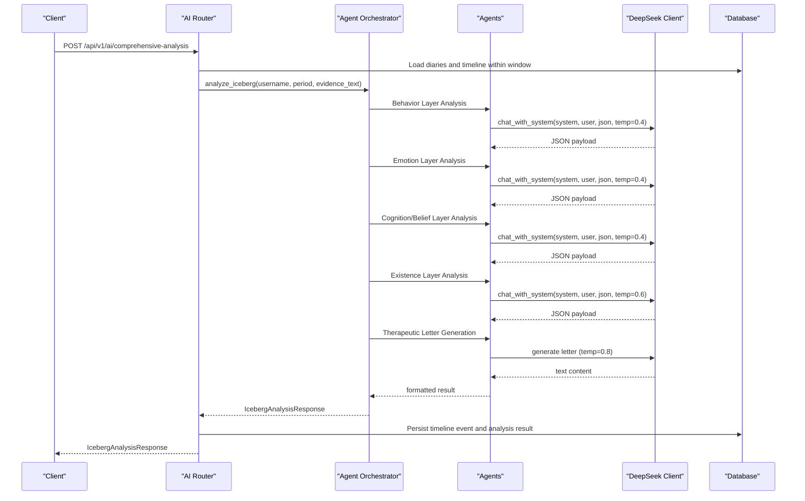
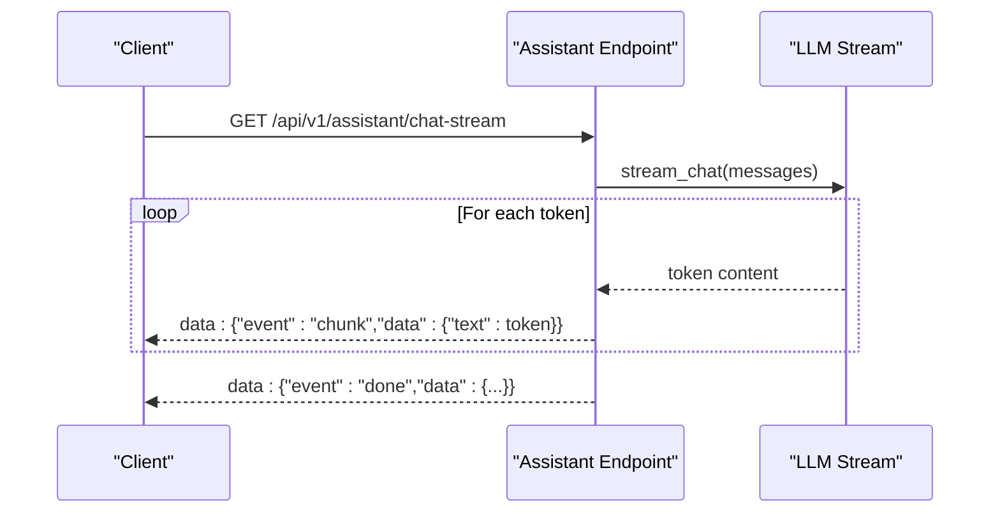
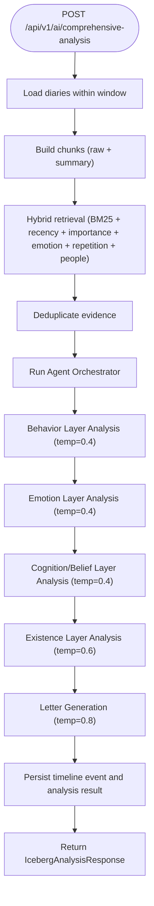
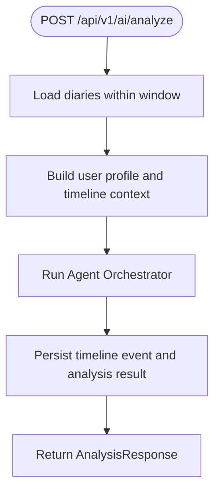
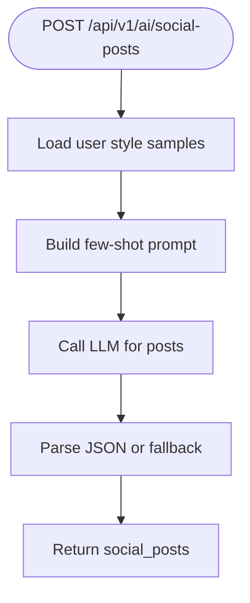
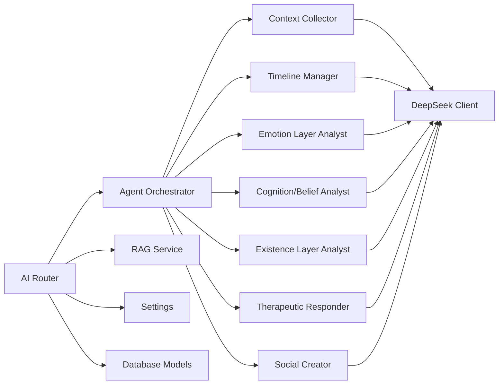

# AI Analysis Endpoints

<cite>
**Referenced Files in This Document**
- [ai.py](file://backend/app/api/v1/ai.py)
- [ai.py (schemas)](file://backend/app/schemas/ai.py)
- [rag_service.py](file://backend/app/services/rag_service.py)
- [orchestrator.py](file://backend/app/agents/orchestrator.py)
- [agent_impl.py](file://backend/app/agents/agent_impl.py)
- [prompts.py](file://backend/app/agents/prompts.py)
- [state.py](file://backend/app/agents/state.py)
- [llm.py](file://backend/app/agents/llm.py)
- [config.py](file://backend/app/core/config.py)
- [database.py](file://backend/app/models/database.py)
- [assistant.py](file://backend/app/api/v1/assistant.py)
</cite>

## Update Summary
**Changes Made**
- Updated comprehensive analysis endpoint to reflect new multi-agent icebergs analysis system
- Added new icebergs analysis response schema with 5-layer psychological analysis
- Enhanced agent orchestration documentation with detailed multi-agent workflow
- Updated analysis endpoints to show the transition from comprehensive analysis to icebergs analysis
- Added detailed documentation for the five-layer psychological analysis (behavior, emotion, cognition, belief, yearning)

## Table of Contents
1. [Introduction](#introduction)
2. [Project Structure](#project-structure)
3. [Core Components](#core-components)
4. [Architecture Overview](#architecture-overview)
5. [Detailed Component Analysis](#detailed-component-analysis)
6. [Dependency Analysis](#dependency-analysis)
7. [Performance Considerations](#performance-considerations)
8. [Troubleshooting Guide](#troubleshooting-guide)
9. [Conclusion](#conclusion)

## Introduction
This document provides comprehensive API documentation for AI analysis endpoints in the backend. The system has evolved to feature a sophisticated multi-agent icebergs analysis system with five-layer psychological analysis and enhanced AI processing capabilities. It covers:
- Multi-agent icebergs analysis endpoint for comprehensive psychological insights
- Five-layer psychological analysis (behavior, emotion, cognition, belief, yearning)
- Social content generation for WeChat-style posts
- Real-time streaming capabilities via SSE for AI responses
- Batch processing and historical analysis retrieval
- RAG implementation details, LLM integration, and advanced agent orchestration
- Authentication requirements, request/response schemas, streaming protocols, and operational guidance

## Project Structure
The AI analysis functionality is organized under the FastAPI router with a sophisticated multi-agent system:
- API endpoints: centralized in the AI router with icebergs analysis as the primary feature
- Schemas: request/response models for type safety including new icebergs analysis response
- Services: RAG pipeline and memory synchronization
- Agents: multi-agent orchestration system with specialized agents for each analysis layer
- LLM client: unified interface to external LLM provider with temperature control
- Configuration: environment-driven settings for LLM provider and optional vector store

**Diagram sources**
- [ai.py](file://backend/app/api/v1/ai.py#L31)
- [rag_service.py](file://backend/app/services/rag_service.py#L147)
- [orchestrator.py](file://backend/app/agents/orchestrator.py#L18)
- [agent_impl.py](file://backend/app/agents/agent_impl.py#L92)
- [prompts.py:1-433](file://backend/app/agents/prompts.py#L1-L433)
- [state.py:10-45](file://backend/app/agents/state.py#L10-L45)
- [llm.py](file://backend/app/agents/llm.py#L13)
- [config.py](file://backend/app/core/config.py#L62)

**Section sources**
- [ai.py:1-31](file://backend/app/api/v1/ai.py#L1-L31)
- [ai.py (schemas):1-174](file://backend/app/schemas/ai.py#L1-L174)
- [rag_service.py:1-360](file://backend/app/services/rag_service.py#L1-L360)
- [orchestrator.py:1-340](file://backend/app/agents/orchestrator.py#L1-L340)
- [agent_impl.py:1-484](file://backend/app/agents/agent_impl.py#L1-L484)
- [prompts.py:1-433](file://backend/app/agents/prompts.py#L1-L433)
- [state.py:1-45](file://backend/app/agents/state.py#L1-L45)
- [llm.py:1-220](file://backend/app/agents/llm.py#L1-L220)
- [config.py:1-105](file://backend/app/core/config.py#L1-L105)

## Core Components
- AI Router: exposes endpoints under /api/v1/ai for icebergs analysis, guidance, and social content generation
- RAG Service: builds chunks from diary entries, performs lexical retrieval with BM25 and recency weighting, and deduplicates evidence
- Agent Orchestrator: coordinates six specialized agents for context collection, timeline extraction, five-layer icebergs analysis, and social content creation
- LLM Client: integrates with a DeepSeek-compatible API supporting synchronous completions with temperature control
- Configuration: centralizes provider credentials and base URLs
- State Management: tracks analysis progress across multiple agents and layers

Key capabilities:
- Five-layer icebergs analysis (behavior, emotion, cognition, belief, yearning) with RAG-powered evidence collection
- Multi-agent orchestration with specialized agents for each analysis layer
- Retrieval-augmented synthesis for comprehensive user-level insights
- Style-aware social content generation with few-shot samples
- SSE streaming for real-time AI responses

**Section sources**
- [ai.py:31-31](file://backend/app/api/v1/ai.py#L31-L31)
- [rag_service.py:147-360](file://backend/app/services/rag_service.py#L147-L360)
- [orchestrator.py:18-340](file://backend/app/agents/orchestrator.py#L18-L340)
- [agent_impl.py:92-484](file://backend/app/agents/agent_impl.py#L92-L484)
- [prompts.py:1-433](file://backend/app/agents/prompts.py#L1-L433)
- [state.py:10-45](file://backend/app/agents/state.py#L10-L45)
- [llm.py:13-220](file://backend/app/agents/llm.py#L13-L220)
- [config.py:62-70](file://backend/app/core/config.py#L62-L70)

## Architecture Overview
The AI analysis pipeline combines retrieval, orchestration, and generation with a sophisticated five-layer icebergs model:
- Data ingestion: fetches diary entries and timeline events within a configurable window
- RAG synthesis: constructs chunks, retrieves relevant evidence, and deduplicates
- Agent orchestration: executes six specialized agents sequentially for five-layer analysis and content generation
- LLM integration: uses structured prompts with temperature control for robust parsing
- Persistence: stores analysis results and timeline events for later retrieval

**Diagram sources**
- [ai.py:268-388](file://backend/app/api/v1/ai.py#L268-L388)
- [orchestrator.py:132-294](file://backend/app/agents/orchestrator.py#L132-L294)
- [agent_impl.py:205-394](file://backend/app/agents/agent_impl.py#L205-L394)
- [prompts.py:213-397](file://backend/app/agents/prompts.py#L213-L397)
- [llm.py:68-93](file://backend/app/agents/llm.py#L68-L93)
- [database.py:13-44](file://backend/app/models/database.py#L13-L44)

## Detailed Component Analysis

### Authentication and Authorization
- All AI endpoints require an active user session via dependency injection
- Authentication is enforced using a current active user dependency
- No explicit rate-limiting is implemented in the AI endpoints; consider upstream rate limits from the LLM provider

**Section sources**
- [ai.py:8-29](file://backend/app/api/v1/ai.py#L8-L29)
- [database.py:13-44](file://backend/app/models/database.py#L13-L44)

### Real-Time Streaming Endpoints
- The assistant module provides a streaming endpoint using Server-Sent Events (SSE)
- While not part of the AI analysis router, it demonstrates the streaming pattern used for real-time LLM responses
- Streaming protocol:
  - Media type: text/event-stream
  - Event lines: data: {"event": "...", "data": {...}}
  - Terminates with a DONE event

**Diagram sources**
- [assistant.py:370-389](file://backend/app/api/v1/assistant.py#L370-L389)
- [llm.py:94-143](file://backend/app/agents/llm.py#L94-L143)

**Section sources**
- [assistant.py:370-389](file://backend/app/api/v1/assistant.py#L370-L389)
- [llm.py:94-143](file://backend/app/agents/llm.py#L94-L143)

### Analysis Generation Endpoints

#### POST /api/v1/ai/comprehensive-analysis
**Updated** This endpoint now implements the new multi-agent icebergs analysis system with five-layer psychological analysis.

- Purpose: Comprehensive icebergs analysis using RAG over historical diaries with multi-agent five-layer psychological analysis
- Method: POST
- Request body: ComprehensiveAnalysisRequest
  - window_days: int (default 90, range 14–365)
  - max_diaries: int (default 120, range 20–500)
  - focus: optional[str]
- Response: IcebergAnalysisResponse
  - behavior_layer, emotion_layer, cognition_layer, belief_layer, yearning_layer, letter, evidence, metadata
- Behavior:
  - Aggregates diaries within the analysis window
  - Builds user profile and timeline context
  - Executes orchestrator with six agents: context collection, timeline extraction, five-layer icebergs analysis, and social content generation
  - Uses specialized prompts for each analysis layer with different temperatures
  - Persists timeline event and analysis result for later retrieval
- Streaming: Not implemented for this endpoint; use assistant streaming for real-time responses

**Diagram sources**
- [ai.py:268-388](file://backend/app/api/v1/ai.py#L268-L388)
- [orchestrator.py:132-294](file://backend/app/agents/orchestrator.py#L132-L294)

**Section sources**
- [ai.py:268-388](file://backend/app/api/v1/ai.py#L268-L388)
- [ai.py (schemas):16-21](file://backend/app/schemas/ai.py#L16-L21)
- [ai.py (schemas):32-42](file://backend/app/schemas/ai.py#L32-L42)
- [ai.py (schemas):98-108](file://backend/app/schemas/ai.py#L98-L108)
- [rag_service.py:147-360](file://backend/app/services/rag_service.py#L147-L360)

#### POST /api/v1/ai/analyze
- Purpose: Integrated psychological analysis combining diary content, user profile, and timeline context
- Method: POST
- Request body: AnalysisRequest
  - diary_id: optional[int]
  - window_days: int (default 30, range 7–365)
  - max_diaries: int (default 40, range 5–200)
- Response: AnalysisResponse
  - diary_id, user_id, timeline_event, satir_analysis, therapeutic_response, social_posts, metadata
- Behavior:
  - Aggregates diaries within the analysis window
  - Builds user profile and timeline context
  - Executes orchestrator with six agents: context collection, timeline extraction, five-layer icebergs analysis, and social content generation
  - Persists timeline event and analysis result for later retrieval
- Streaming: Not implemented for this endpoint; use assistant streaming for real-time responses

**Diagram sources**
- [ai.py:391-623](file://backend/app/api/v1/ai.py#L391-L623)
- [orchestrator.py:27-130](file://backend/app/agents/orchestrator.py#L27-L130)

**Section sources**
- [ai.py:391-623](file://backend/app/api/v1/ai.py#L391-L623)
- [ai.py (schemas):9-14](file://backend/app/schemas/ai.py#L9-L14)
- [ai.py (schemas):140-149](file://backend/app/schemas/ai.py#L140-L149)

#### POST /api/v1/ai/social-posts
- Purpose: Generate social content (WeChat-style posts) based on diary content and user style samples
- Method: POST
- Request body: AnalysisRequest
- Response: SocialPostResponse (as defined in agent implementation)
- Behavior:
  - Loads user style samples and constructs a few-shot prompt
  - Generates three variants (A, B, C) with distinct styles
  - Falls back to simplified content if generation fails

**Diagram sources**
- [ai.py:755-857](file://backend/app/api/v1/ai.py#L755-L857)
- [agent_impl.py:396-484](file://backend/app/agents/agent_impl.py#L396-L484)

**Section sources**
- [ai.py:755-857](file://backend/app/api/v1/ai.py#L755-L857)
- [agent_impl.py:396-484](file://backend/app/agents/agent_impl.py#L396-L484)

### Additional AI Endpoints

#### GET /api/v1/ai/daily-guidance
- Purpose: Provide a personalized daily writing prompt based on recent diaries
- Method: GET
- Response: DailyGuidanceResponse
- Behavior:
  - Builds a 30-day context window and generates a JSON-formatted question
  - Falls back to predefined questions if generation fails

**Section sources**
- [ai.py:129-207](file://backend/app/api/v1/ai.py#L129-L207)
- [ai.py (schemas):110-115](file://backend/app/schemas/ai.py#L110-L115)

#### GET /api/v1/ai/social-style-samples
- Purpose: Retrieve stored social style samples for a user
- Method: GET
- Response: SocialStyleSamplesResponse

#### PUT /api/v1/ai/social-style-samples
- Purpose: Upsert social style samples with deduplication and normalization
- Method: PUT
- Request body: SocialStyleSamplesRequest
- Response: SocialStyleSamplesResponse

**Section sources**
- [ai.py:210-266](file://backend/app/api/v1/ai.py#L210-L266)
- [ai.py (schemas):117-128](file://backend/app/schemas/ai.py#L117-L128)

#### GET /api/v1/ai/result/{diary_id}
- Purpose: Retrieve previously saved analysis result for a specific diary
- Method: GET
- Response: AnalysisResponse

**Section sources**
- [ai.py:674-695](file://backend/app/api/v1/ai.py#L674-L695)

#### GET /api/v1/ai/analyses
- Purpose: List recent saved analysis records for a user
- Method: GET
- Response: List-like structure with metadata

**Section sources**
- [ai.py:646-671](file://backend/app/api/v1/ai.py#L646-L671)

#### GET /api/v1/ai/models
- Purpose: Report available models and agent system info
- Method: GET
- Response: Available models and agent system details

**Section sources**
- [ai.py:860-887](file://backend/app/api/v1/ai.py#L860-L887)

### Request/Response Schemas

#### AnalysisRequest
- Fields: diary_id (optional), window_days (default 30), max_diaries (default 40)

#### ComprehensiveAnalysisRequest
- Fields: window_days (default 90), max_diaries (default 120), focus (optional)

#### IcebergAnalysisResponse
- Fields: behavior_layer, emotion_layer, cognition_layer, belief_layer, yearning_layer, letter, evidence, metadata
- behavior_layer: IcebergBehaviorLayer with patterns and summary
- emotion_layer: IcebergEmotionLayer with emotion_flow, turning_points, and summary
- cognition_layer: IcebergCognitionLayer with thought_patterns and summary
- belief_layer: IcebergBeliefLayer with core_beliefs, self_narrative, and summary
- yearning_layer: IcebergYearningLayer with yearnings, life_energy, and summary
- letter: str (therapeutic letter content)

#### AnalysisResponse
- Fields: diary_id, user_id, timeline_event, satir_analysis, therapeutic_response, social_posts, metadata

#### DailyGuidanceResponse
- Fields: question, source, metadata

#### SocialStyleSamplesRequest
- Fields: samples (list), replace (bool)

#### SocialStyleSamplesResponse
- Fields: total, samples, metadata

**Section sources**
- [ai.py (schemas):9-14](file://backend/app/schemas/ai.py#L9-L14)
- [ai.py (schemas):16-21](file://backend/app/schemas/ai.py#L16-L21)
- [ai.py (schemas):44-49](file://backend/app/schemas/ai.py#L44-L49)
- [ai.py (schemas):98-108](file://backend/app/schemas/ai.py#L98-L108)
- [ai.py (schemas):140-149](file://backend/app/schemas/ai.py#L140-L149)
- [ai.py (schemas):110-115](file://backend/app/schemas/ai.py#L110-L115)
- [ai.py (schemas):117-128](file://backend/app/schemas/ai.py#L117-L128)

## Dependency Analysis
- API endpoints depend on:
  - Agent orchestrator for multi-step analysis
  - RAG service for evidence retrieval and deduplication
  - LLM client for structured and streaming completions
  - Database models for persistence and context loading
- Configuration drives LLM provider settings and optional vector store integration

**Diagram sources**
- [ai.py](file://backend/app/api/v1/ai.py#L31)
- [orchestrator.py:18-340](file://backend/app/agents/orchestrator.py#L18-L340)
- [agent_impl.py:92-484](file://backend/app/agents/agent_impl.py#L92-L484)
- [prompts.py:1-433](file://backend/app/agents/prompts.py#L1-L433)
- [state.py:10-45](file://backend/app/agents/state.py#L10-L45)
- [llm.py:13-220](file://backend/app/agents/llm.py#L13-L220)
- [rag_service.py:147-360](file://backend/app/services/rag_service.py#L147-L360)
- [config.py:62-70](file://backend/app/core/config.py#L62-L70)
- [database.py:13-44](file://backend/app/models/database.py#L13-L44)

**Section sources**
- [ai.py:1-31](file://backend/app/api/v1/ai.py#L1-L31)
- [orchestrator.py:18-340](file://backend/app/agents/orchestrator.py#L18-L340)
- [agent_impl.py:92-484](file://backend/app/agents/agent_impl.py#L92-L484)
- [prompts.py:1-433](file://backend/app/agents/prompts.py#L1-L433)
- [state.py:10-45](file://backend/app/agents/state.py#L10-L45)
- [llm.py:13-220](file://backend/app/agents/llm.py#L13-L220)
- [rag_service.py:147-360](file://backend/app/services/rag_service.py#L147-L360)
- [config.py:62-70](file://backend/app/core/config.py#L62-L70)
- [database.py:13-44](file://backend/app/models/database.py#L13-L44)

## Performance Considerations
- RAG retrieval cost scales with:
  - Number of diaries within the window
  - Chunk count (original content plus summaries)
  - Top-k and deduplication thresholds
- Recommendations:
  - Limit window_days and max_diaries to reduce latency
  - Use appropriate temperature settings for deterministic outputs (0.4 for analytical tasks, 0.6 for existence layer, 0.8 for creative tasks)
  - Cache frequently accessed user style samples
  - Monitor LLM provider rate limits and implement client-side throttling if needed
- Streaming:
  - Prefer assistant streaming for long-running completions to improve perceived responsiveness
- Multi-agent orchestration:
  - Each agent runs sequentially with different temperature settings optimized for their task type
  - Processing time includes all six agents plus RAG evidence collection

## Troubleshooting Guide
- JSON parsing failures:
  - The system includes robust parsing helpers to extract JSON from fenced code blocks or partial responses
  - If parsing fails, endpoints return fallback responses or raise HTTP exceptions
- Agent errors:
  - Orchestrator captures exceptions and populates error metadata
  - Some agents fall back to default or simplified outputs
- Persistence warnings:
  - Analysis results and timeline events are persisted with rollback handling; warnings are included in metadata when persistence fails
- Temperature control issues:
  - Analytical tasks use lower temperatures (0.4) for deterministic outputs
  - Creative tasks use higher temperatures (0.8) for varied responses
  - Existence layer uses moderate temperature (0.6) for balanced creativity and coherence

**Section sources**
- [ai.py:34-65](file://backend/app/api/v1/ai.py#L34-L65)
- [orchestrator.py:121-130](file://backend/app/agents/orchestrator.py#L121-L130)
- [agent_impl.py:25-68](file://backend/app/agents/agent_impl.py#L25-L68)

## Conclusion
The AI analysis endpoints provide a comprehensive suite for five-layer psychological insight, multi-day synthesis, and social content generation. The system has evolved to feature a sophisticated multi-agent icebergs analysis system with six specialized agents for behavior, emotion, cognition, belief, and existence layers. They integrate a lightweight RAG pipeline, advanced multi-agent orchestration system, and a unified LLM client with temperature-controlled analysis. For production deployments, pair these endpoints with proper rate limiting, caching, and monitoring to ensure reliable performance and user experience.