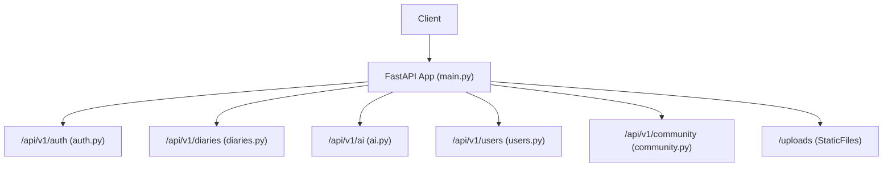
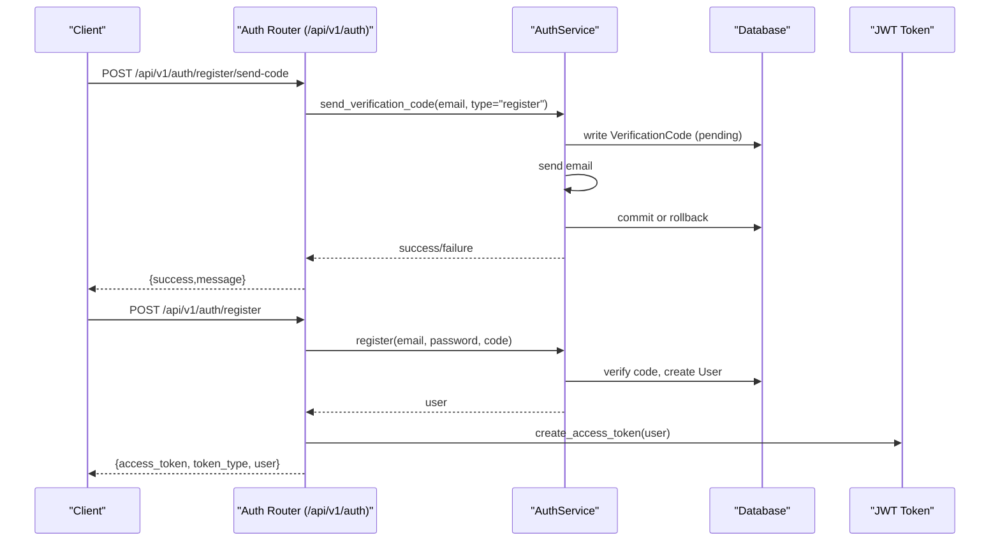
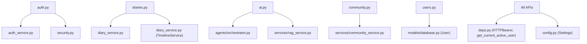
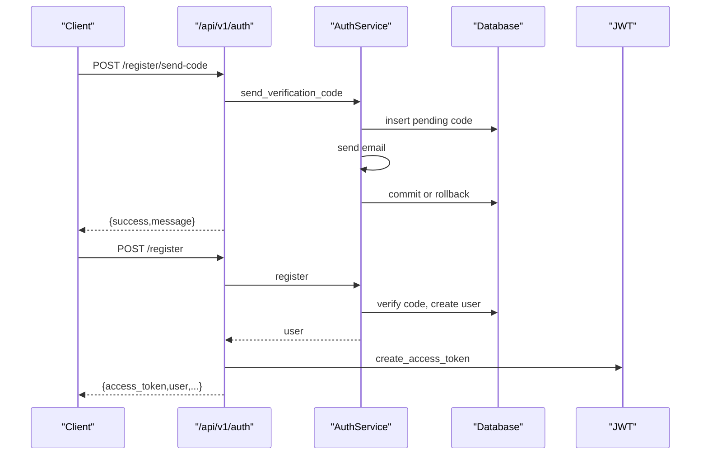

# API Endpoints Reference

<cite>
**Referenced Files in This Document**
- [main.py](file://backend/main.py)
- [auth.py](file://backend/app/api/v1/auth.py)
- [diaries.py](file://backend/app/api/v1/diaries.py)
- [ai.py](file://backend/app/api/v1/ai.py)
- [community.py](file://backend/app/api/v1/community.py)
- [users.py](file://backend/app/api/v1/users.py)
- [auth_schemas.py](file://backend/app/schemas/auth.py)
- [diary_schemas.py](file://backend/app/schemas/diary.py)
- [community_schemas.py](file://backend/app/schemas/community.py)
- [ai_schemas.py](file://backend/app/schemas/ai.py)
- [auth_service.py](file://backend/app/services/auth_service.py)
- [diary_service.py](file://backend/app/services/diary_service.py)
- [config.py](file://backend/app/core/config.py)
- [security.py](file://backend/app/core/security.py)
- [deps.py](file://backend/app/core/deps.py)
</cite>

## Table of Contents
1. [Introduction](#introduction)
2. [Project Structure](#project-structure)
3. [Core Components](#core-components)
4. [Architecture Overview](#architecture-overview)
5. [Detailed Component Analysis](#detailed-component-analysis)
6. [Dependency Analysis](#dependency-analysis)
7. [Performance Considerations](#performance-considerations)
8. [Troubleshooting Guide](#troubleshooting-guide)
9. [Conclusion](#conclusion)
10. [Appendices](#appendices)

## Introduction
This document provides comprehensive API endpoints reference for the 映记 application’s REST API. It covers authentication, diary management, AI analysis, community, and user management endpoints. For each endpoint, you will find HTTP methods, URL patterns, request/response schemas, authentication requirements, validation rules, error handling patterns, and practical usage guidance. Where applicable, curl examples and SDK usage patterns are included.

## Project Structure
The backend is a FastAPI application that mounts multiple routers under /api/v1. Authentication is enforced via bearer tokens. Static file serving is configured for uploads.



**Diagram sources**
- [main.py:60-87](file://backend/main.py#L60-L87)

**Section sources**
- [main.py:42-87](file://backend/main.py#L42-L87)

## Core Components
- Authentication: JWT bearer tokens, verification codes, registration/login/reset flows.
- Diary Management: CRUD, timeline queries, image upload, growth insights.
- AI Analysis: Title suggestions, daily guidance, comprehensive RAG-based analysis, social samples, and analysis persistence.
- Community: Posts, comments, likes/collections, image upload, browsing history.
- User Management: Profile retrieval/update, avatar upload.

**Section sources**
- [auth.py:22-316](file://backend/app/api/v1/auth.py#L22-L316)
- [diaries.py:29-501](file://backend/app/api/v1/diaries.py#L29-L501)
- [ai.py:31-902](file://backend/app/api/v1/ai.py#L31-L902)
- [community.py:20-324](file://backend/app/api/v1/community.py#L20-L324)
- [users.py:14-103](file://backend/app/api/v1/users.py#L14-L103)

## Architecture Overview
High-level API architecture and authentication flow.



**Diagram sources**
- [auth.py:25-125](file://backend/app/api/v1/auth.py#L25-L125)
- [auth_service.py:19-98](file://backend/app/services/auth_service.py#L19-L98)

**Section sources**
- [auth.py:22-316](file://backend/app/api/v1/auth.py#L22-L316)
- [auth_service.py:16-358](file://backend/app/services/auth_service.py#L16-L358)
- [deps.py:18-66](file://backend/app/core/deps.py#L18-L66)
- [security.py:43-71](file://backend/app/core/security.py#L43-L71)

## Detailed Component Analysis

### Authentication Endpoints
All endpoints under /api/v1/auth require no authentication for registration/login code sending and verification; subsequent actions (register, login, reset, logout, profile) require a valid bearer token.

- Base URL: /api/v1/auth
- Authentication: Bearer token for protected endpoints; none for code send/verify
- Rate limiting: Verification code send is limited to a fixed number per 5 minutes per email/type.

Endpoints:
- POST /register/send-code
  - Request: SendCodeRequest (email, optional type="register")
  - Response: {success, message}
  - Validation: type must be "register" if provided
  - Errors: 400 Bad Request (invalid type), 429 Too Many Requests (rate limit), 400 Bad Request (other failures)
  - Example curl:
    ```bash
    curl -X POST "{{baseUrl}}/api/v1/auth/register/send-code" \
      -H "Content-Type: application/json" \
      -d '{"email":"user@example.com","type":"register"}'
    ```

- POST /register/verify
  - Request: VerifyCodeRequest (email, code, optional type="register")
  - Response: {success, message}
  - Validation: type must be "register" if provided
  - Errors: 400 Bad Request (invalid type or invalid/used/expired code)
  - Example curl:
    ```bash
    curl -X POST "{{baseUrl}}/api/v1/auth/register/verify" \
      -H "Content-Type: application/json" \
      -d '{"email":"user@example.com","code":"123456","type":"register"}'
    ```

- POST /register
  - Request: RegisterRequest (email, code, password, optional username)
  - Response: TokenResponse (access_token, token_type, user)
  - Validation: code verified, email not taken
  - Errors: 400 Bad Request (validation/code errors), 429 Too Many Requests (rate limit)
  - Example curl:
    ```bash
    curl -X POST "{{baseUrl}}/api/v1/auth/register" \
      -H "Content-Type: application/json" \
      -d '{"email":"user@example.com","code":"123456","password":"SecurePass!123","username":"alice"}'
    ```

- POST /login/send-code
  - Request: SendCodeRequest (email, optional type="login")
  - Response: {success, message}
  - Validation: type must be "login" if provided
  - Errors: 400 Bad Request (invalid type)
  - Example curl:
    ```bash
    curl -X POST "{{baseUrl}}/api/v1/auth/login/send-code" \
      -H "Content-Type: application/json" \
      -d '{"email":"user@example.com","type":"login"}'
    ```

- POST /login
  - Request: LoginRequest (email, code)
  - Response: TokenResponse
  - Validation: code verified, user exists and active
  - Errors: 400 Bad Request (invalid code or user issues)
  - Example curl:
    ```bash
    curl -X POST "{{baseUrl}}/api/v1/auth/login" \
      -H "Content-Type: application/json" \
      -d '{"email":"user@example.com","code":"123456"}'
    ```

- POST /login/password
  - Request: PasswordLoginRequest (email, password)
  - Response: TokenResponse
  - Validation: user exists, password matches
  - Errors: 400 Bad Request (invalid credentials)
  - Example curl:
    ```bash
    curl -X POST "{{baseUrl}}/api/v1/auth/login/password" \
      -H "Content-Type: application/json" \
      -d '{"email":"user@example.com","password":"MyPassword123"}'
    ```

- POST /reset-password/send-code
  - Request: SendCodeRequest (email, optional type="reset")
  - Response: {success, message}
  - Validation: type must be "reset" if provided
  - Errors: 400 Bad Request (invalid type), 400 Bad Request (email not registered for reset)
  - Example curl:
    ```bash
    curl -X POST "{{baseUrl}}/api/v1/auth/reset-password/send-code" \
      -H "Content-Type: application/json" \
      -d '{"email":"user@example.com","type":"reset"}'
    ```

- POST /reset-password
  - Request: ResetPasswordRequest (email, code, new_password)
  - Response: {success, message}
  - Validation: code verified, user exists
  - Errors: 400 Bad Request (invalid code or user issues)
  - Example curl:
    ```bash
    curl -X POST "{{baseUrl}}/api/v1/auth/reset-password" \
      -H "Content-Type: application/json" \
      -d '{"email":"user@example.com","code":"123456","new_password":"NewPass!456"}'
    ```

- POST /logout
  - Request: none (requires bearer token)
  - Response: {success, message}
  - Example curl:
    ```bash
    curl -X POST "{{baseUrl}}/api/v1/auth/logout" \
      -H "Authorization: Bearer {{access_token}}"
    ```

- GET /me
  - Request: none (requires bearer token)
  - Response: UserResponse
  - Example curl:
    ```bash
    curl -X GET "{{baseUrl}}/api/v1/auth/me" \
      -H "Authorization: Bearer {{access_token}}"
    ```

- GET /test-email
  - Request: email (query)
  - Response: {success, message}
  - Errors: 500 Internal Server Error (email failure)
  - Example curl:
    ```bash
    curl -X GET "{{baseUrl}}/api/v1/auth/test-email?email=user@example.com"
    ```

Schemas:
- SendCodeRequest, VerifyCodeRequest, RegisterRequest, LoginRequest, PasswordLoginRequest, ResetPasswordRequest, TokenResponse, UserResponse

Validation rules:
- Email format validated; passwords minimum length; 6-character codes; optional type constrained to specific values; rate limiting on code sends.

Rate limiting:
- Verification code send limited to a fixed number per 5 minutes per email/type.

Security:
- Access tokens created with HS256; expiration configurable; bearer token required for protected endpoints.

**Section sources**
- [auth.py:25-316](file://backend/app/api/v1/auth.py#L25-L316)
- [auth_schemas.py:10-96](file://backend/app/schemas/auth.py#L10-L96)
- [auth_service.py:19-340](file://backend/app/services/auth_service.py#L19-L340)
- [config.py:52-60](file://backend/app/core/config.py#L52-L60)
- [security.py:43-71](file://backend/app/core/security.py#L43-L71)
- [deps.py:18-66](file://backend/app/core/deps.py#L18-L66)

### Diary Management Endpoints
- Base URL: /api/v1/diaries
- Authentication: Bearer token required
- Image uploads served from /uploads

Endpoints:
- POST /
  - Description: Create a new diary
  - Request: DiaryCreate
  - Response: DiaryResponse
  - Validation: content required; defaults for date; emotion_tags, importance_score range
  - Side effects: Upserts timeline event; schedules AI refinement
  - Example curl:
    ```bash
    curl -X POST "{{baseUrl}}/api/v1/diaries/" \
      -H "Authorization: Bearer {{access_token}}" \
      -H "Content-Type: application/json" \
      -d '{"title":"Meeting","content":"Had a productive meeting.","diary_date":"2025-06-01","emotion_tags":["happy"],"importance_score":7,"images":[]}'
    ```

- GET /
  - Description: List diaries with pagination and filters
  - Query: page (>=1), page_size (1-100), start_date, end_date, emotion_tag
  - Response: DiaryListResponse
  - Example curl:
    ```bash
    curl -X GET "{{baseUrl}}/api/v1/diaries/?page=1&page_size=20&start_date=2025-06-01&end_date=2025-06-30&emotion_tag=happy" \
      -H "Authorization: Bearer {{access_token}}"
    ```

- GET /{diary_id}
  - Description: Get diary by ID
  - Path: diary_id
  - Response: DiaryResponse
  - Errors: 404 Not Found if not exists
  - Example curl:
    ```bash
    curl -X GET "{{baseUrl}}/api/v1/diaries/123" \
      -H "Authorization: Bearer {{access_token}}"
    ```

- PUT /{diary_id}
  - Description: Update diary
  - Path: diary_id
  - Request: DiaryUpdate
  - Response: DiaryResponse
  - Errors: 404 Not Found if not exists
  - Example curl:
    ```bash
    curl -X PUT "{{baseUrl}}/api/v1/diaries/123" \
      -H "Authorization: Bearer {{access_token}}" \
      -H "Content-Type: application/json" \
      -d '{"content":"Updated content","importance_score":8}'
    ```

- DELETE /{diary_id}
  - Description: Delete diary
  - Path: diary_id
  - Response: {success, message}
  - Errors: 404 Not Found if not exists
  - Example curl:
    ```bash
    curl -X DELETE "{{baseUrl}}/api/v1/diaries/123" \
      -H "Authorization: Bearer {{access_token}}"
    ```

- GET /date/{target_date}
  - Description: Get all diaries for a specific date
  - Path: target_date (YYYY-MM-DD)
  - Response: List[DiaryResponse]
  - Example curl:
    ```bash
    curl -X GET "{{baseUrl}}/api/v1/diaries/date/2025-06-01" \
      -H "Authorization: Bearer {{access_token}}"
    ```

- POST /upload-image
  - Description: Upload a diary image
  - Form: file (multipart)
  - Validation: image/jpeg, png, gif, webp; max 10MB
  - Response: {url}
  - Example curl:
    ```bash
    curl -X POST "{{baseUrl}}/api/v1/diaries/upload-image" \
      -H "Authorization: Bearer {{access_token}}" \
      -F "file=@/path/to/image.jpg"
    ```

- GET /timeline/recent
  - Description: Recent timeline events (last N days)
  - Query: days (1-30)
  - Response: List[TimelineEventResponse]
  - Example curl:
    ```bash
    curl -X GET "{{baseUrl}}/api/v1/diaries/timeline/recent?days=7" \
      -H "Authorization: Bearer {{access_token}}"
    ```

- GET /timeline/range
  - Description: Timeline events in a date range
  - Query: start_date (required), end_date (optional), limit (1-500)
  - Response: List[TimelineEventResponse]
  - Example curl:
    ```bash
    curl -X GET "{{baseUrl}}/api/v1/diaries/timeline/range?start_date=2025-06-01&end_date=2025-06-30&limit=100" \
      -H "Authorization: Bearer {{access_token}}"
    ```

- GET /timeline/date/{target_date}
  - Description: Timeline events for a specific date
  - Path: target_date
  - Response: List[TimelineEventResponse]
  - Example curl:
    ```bash
    curl -X GET "{{baseUrl}}/api/v1/diaries/timeline/date/2025-06-01" \
      -H "Authorization: Bearer {{access_token}}"
    ```

- POST /timeline/rebuild
  - Description: Rebuild timeline events for a period (idempotent)
  - Query: days (7-3650)
  - Response: {success, message, stats}
  - Example curl:
    ```bash
    curl -X POST "{{baseUrl}}/api/v1/diaries/timeline/rebuild?days=180" \
      -H "Authorization: Bearer {{access_token}}"
    ```

- GET /timeline/terrain
  - Description: Emotion terrain data (aggregated energy, valence, density)
  - Query: days (7-365)
  - Response: Aggregated terrain metrics
  - Example curl:
    ```bash
    curl -X GET "{{baseUrl}}/api/v1/diaries/timeline/terrain?days=30" \
      -H "Authorization: Bearer {{access_token}}"
    ```

- GET /growth/daily-insight
  - Description: Daily growth insight (first generates, then caches)
  - Query: target_date
  - Response: Insight object (date, primary_emotion, summary, has_content, cached, source)
  - Example curl:
    ```bash
    curl -X GET "{{baseUrl}}/api/v1/diaries/growth/daily-insight?target_date=2025-06-01" \
      -H "Authorization: Bearer {{access_token}}"
    ```

Schemas:
- DiaryCreate, DiaryUpdate, DiaryResponse, DiaryListResponse, TimelineEventCreate, TimelineEventResponse

Validation rules:
- Content required and trimmed; date defaults to today if omitted; importance_score 1-10; emotion_tags list; pagination bounds; image upload constraints.

**Section sources**
- [diaries.py:55-501](file://backend/app/api/v1/diaries.py#L55-L501)
- [diary_schemas.py:9-101](file://backend/app/schemas/diary.py#L9-L101)
- [diary_service.py:69-637](file://backend/app/services/diary_service.py#L69-L637)

### AI Analysis Endpoints
- Base URL: /api/v1/ai
- Authentication: Bearer token required
- Background tasks supported for async execution

Endpoints:
- POST /generate-title
  - Description: Generate a concise Chinese title for diary content
  - Request: TitleSuggestionRequest (content, optional current_title)
  - Response: TitleSuggestionResponse (title)
  - Validation: content minimum length
  - Errors: 400 Bad Request (too short), 500 Internal Server Error (generation failure)
  - Example curl:
    ```bash
    curl -X POST "{{baseUrl}}/api/v1/ai/generate-title" \
      -H "Authorization: Bearer {{access_token}}" \
      -H "Content-Type: application/json" \
      -d '{"content":"Today was a good day...","current_title":"Old Title"}'
    ```

- GET /daily-guidance
  - Description: Get a personalized daily writing prompt based on recent entries
  - Response: DailyGuidanceResponse (question, source, metadata)
  - Example curl:
    ```bash
    curl -X GET "{{baseUrl}}/api/v1/ai/daily-guidance" \
      -H "Authorization: Bearer {{access_token}}"
    ```

- GET /social-style-samples
  - Description: Retrieve user's social media style samples
  - Response: SocialStyleSamplesResponse (total, samples, metadata)
  - Example curl:
    ```bash
    curl -X GET "{{baseUrl}}/api/v1/ai/social-style-samples" \
      -H "Authorization: Bearer {{access_token}}"
    ```

- PUT /social-style-samples
  - Description: Upsert social style samples (merge or replace)
  - Request: SocialStyleSamplesRequest (samples, replace)
  - Response: SocialStyleSamplesResponse
  - Validation: samples normalized, min/max limits
  - Example curl:
    ```bash
    curl -X PUT "{{baseUrl}}/api/v1/ai/social-style-samples" \
      -H "Authorization: Bearer {{access_token}}" \
      -H "Content-Type: application/json" \
      -d '{"samples":["Sample 1","Sample 2"],"replace":true}'
    ```

- POST /comprehensive-analysis
  - Description: User-level comprehensive analysis using RAG
  - Request: ComprehensiveAnalysisRequest (window_days, max_diaries, optional focus)
  - Response: ComprehensiveAnalysisResponse (summary, key_themes, emotion_trends, continuity_signals, turning_points, growth_suggestions, evidence, metadata)
  - Validation: window_days and max_diaries bounds
  - Errors: 400 Bad Request (no content), 500 Internal Server Error (analysis failure)
  - Example curl:
    ```bash
    curl -X POST "{{baseUrl}}/api/v1/ai/comprehensive-analysis" \
      -H "Authorization: Bearer {{access_token}}" \
      -H "Content-Type: application/json" \
      -d '{"window_days":90,"max_diaries":120,"focus":"relationships"}'
    ```

- POST /analyze
  - Description: Integrated user-level analysis (async-friendly)
  - Request: AnalysisRequest (diary_id optional, window_days, max_diaries)
  - Response: AnalysisResponse (diary_id, user_id, timeline_event, satir_analysis, therapeutic_response, social_posts, metadata)
  - Validation: window bounds; fallback to recent entries if empty
  - Errors: 404 Not Found (missing anchor), 400 Bad Request (no content), 500 Internal Server Error (failure)
  - Example curl:
    ```bash
    curl -X POST "{{baseUrl}}/api/v1/ai/analyze" \
      -H "Authorization: Bearer {{access_token}}" \
      -H "Content-Type: application/json" \
      -d '{"diary_id":123,"window_days":30,"max_diaries":40}'
    ```

- POST /analyze-async
  - Description: Async wrapper (currently synchronous)
  - Request: AnalysisRequest
  - Response: Same as /analyze
  - Example curl:
    ```bash
    curl -X POST "{{baseUrl}}/api/v1/ai/analyze-async" \
      -H "Authorization: Bearer {{access_token}}" \
      -H "Content-Type: application/json" \
      -d '{"window_days":30,"max_diaries":40}'
    ```

- GET /analyses
  - Description: List recent saved analysis records
  - Response: {analyses: [...], total}
  - Example curl:
    ```bash
    curl -X GET "{{baseUrl}}/api/v1/ai/analyses" \
      -H "Authorization: Bearer {{access_token}}"
    ```

- GET /result/{diary_id}
  - Description: Retrieve last saved analysis for a specific diary
  - Path: diary_id
  - Response: AnalysisResponse
  - Errors: 404 Not Found (no saved result)
  - Example curl:
    ```bash
    curl -X GET "{{baseUrl}}/api/v1/ai/result/123" \
      -H "Authorization: Bearer {{access_token}}"
    ```

- POST /satir-analysis
  - Description: Simplified Saatir Iceberg analysis (placeholder)
  - Request: AnalysisRequest
  - Response: Partial analysis object
  - Example curl:
    ```bash
    curl -X POST "{{baseUrl}}/api/v1/ai/satir-analysis" \
      -H "Authorization: Bearer {{access_token}}" \
      -H "Content-Type: application/json" \
      -d '{"diary_id":123}'
    ```

- POST /social-posts
  - Description: Generate social media posts based on analysis context
  - Request: AnalysisRequest
  - Response: Generated posts (placeholder)
  - Example curl:
    ```bash
    curl -X POST "{{baseUrl}}/api/v1/ai/social-posts" \
      -H "Authorization: Bearer {{access_token}}" \
      -H "Content-Type: application/json" \
      -d '{"diary_id":123}'
    ```

Schemas:
- AnalysisRequest, ComprehensiveAnalysisRequest, ComprehensiveAnalysisResponse, DailyGuidanceResponse, SocialStyleSamplesRequest, SocialStyleSamplesResponse, TitleSuggestionRequest, TitleSuggestionResponse, AnalysisResponse

Validation rules:
- Window and count bounds; content length checks; JSON parsing helpers for LLM outputs.

**Section sources**
- [ai.py:83-902](file://backend/app/api/v1/ai.py#L83-L902)
- [ai_schemas.py:9-108](file://backend/app/schemas/ai.py#L9-L108)

### Community Endpoints
- Base URL: /api/v1/community
- Authentication: Bearer token required
- Image uploads served from /uploads

Endpoints:
- GET /circles
  - Description: List all emotion circles with post counts
  - Response: List[CircleInfo]
  - Example curl:
    ```bash
    curl -X GET "{{baseUrl}}/api/v1/community/circles" \
      -H "Authorization: Bearer {{access_token}}"
    ```

- POST /posts
  - Description: Create a post (supports anonymous)
  - Request: PostCreate (circle_id, content, images, is_anonymous)
  - Response: PostResponse
  - Validation: content length; images array
  - Example curl:
    ```bash
    curl -X POST "{{baseUrl}}/api/v1/community/posts" \
      -H "Authorization: Bearer {{access_token}}" \
      -H "Content-Type: application/json" \
      -d '{"circle_id":"anxiety","content":"Hello world","images":[],"is_anonymous":false}'
    ```

- GET /posts
  - Description: List posts (paginated, filterable by circle)
  - Query: circle_id (optional), page (>=1), page_size (1-50)
  - Response: PostListResponse
  - Example curl:
    ```bash
    curl -X GET "{{baseUrl}}/api/v1/community/posts?page=1&page_size=20&circle_id=anxiety" \
      -H "Authorization: Bearer {{access_token}}"
    ```

- GET /posts/mine
  - Description: List current user’s posts
  - Query: page, page_size
  - Response: PostListResponse
  - Example curl:
    ```bash
    curl -X GET "{{baseUrl}}/api/v1/community/posts/mine?page=1&page_size=20" \
      -H "Authorization: Bearer {{access_token}}"
    ```

- GET /posts/{post_id}
  - Description: Get post detail and record view
  - Path: post_id
  - Response: PostResponse
  - Errors: 404 Not Found
  - Example curl:
    ```bash
    curl -X GET "{{baseUrl}}/api/v1/community/posts/123" \
      -H "Authorization: Bearer {{access_token}}"
    ```

- PUT /posts/{post_id}
  - Description: Update post (anonymous posts cannot be edited)
  - Path: post_id
  - Request: PostUpdate
  - Response: PostResponse
  - Errors: 404 Not Found or permission denied
  - Example curl:
    ```bash
    curl -X PUT "{{baseUrl}}/api/v1/community/posts/123" \
      -H "Authorization: Bearer {{access_token}}" \
      -H "Content-Type: application/json" \
      -d '{"content":"Updated content","images":[]}'
    ```

- DELETE /posts/{post_id}
  - Description: Delete post
  - Path: post_id
  - Response: {success, message}
  - Errors: 404 Not Found or permission denied
  - Example curl:
    ```bash
    curl -X DELETE "{{baseUrl}}/api/v1/community/posts/123" \
      -H "Authorization: Bearer {{access_token}}"
    ```

- POST /upload-image
  - Description: Upload community image
  - Form: file (multipart)
  - Validation: image/jpeg, png, gif, webp; max 10MB
  - Response: {url}
  - Example curl:
    ```bash
    curl -X POST "{{baseUrl}}/api/v1/community/upload-image" \
      -H "Authorization: Bearer {{access_token}}" \
      -F "file=@/path/to/image.png"
    ```

- POST /posts/{post_id}/comments
  - Description: Add a comment (supports anonymous)
  - Path: post_id
  - Request: CommentCreate
  - Response: CommentResponse
  - Example curl:
    ```bash
    curl -X POST "{{baseUrl}}/api/v1/community/posts/123/comments" \
      -H "Authorization: Bearer {{access_token}}" \
      -H "Content-Type: application/json" \
      -d '{"content":"Great post!","parent_id":null,"is_anonymous":false}'
    ```

- GET /posts/{post_id}/comments
  - Description: List comments for a post
  - Path: post_id
  - Response: CommentListResponse
  - Example curl:
    ```bash
    curl -X GET "{{baseUrl}}/api/v1/community/posts/123/comments" \
      -H "Authorization: Bearer {{access_token}}"
    ```

- DELETE /comments/{comment_id}
  - Description: Delete own comment
  - Path: comment_id
  - Response: {success, message}
  - Errors: 404 Not Found or permission denied
  - Example curl:
    ```bash
    curl -X DELETE "{{baseUrl}}/api/v1/community/comments/456" \
      -H "Authorization: Bearer {{access_token}}"
    ```

- POST /posts/{post_id}/like
  - Description: Toggle like
  - Path: post_id
  - Response: {liked: bool}
  - Example curl:
    ```bash
    curl -X POST "{{baseUrl}}/api/v1/community/posts/123/like" \
      -H "Authorization: Bearer {{access_token}}"
    ```

- POST /posts/{post_id}/collect
  - Description: Toggle collection
  - Path: post_id
  - Response: {collected: bool}
  - Example curl:
    ```bash
    curl -X POST "{{baseUrl}}/api/v1/community/posts/123/collect" \
      -H "Authorization: Bearer {{access_token}}"
    ```

- GET /collections
  - Description: List collected posts
  - Query: page, page_size
  - Response: PostListResponse
  - Example curl:
    ```bash
    curl -X GET "{{baseUrl}}/api/v1/community/collections?page=1&page_size=20" \
      -H "Authorization: Bearer {{access_token}}"
    ```

- GET /history
  - Description: List view history (deduplicated)
  - Query: page, page_size
  - Response: ViewHistoryResponse
  - Example curl:
    ```bash
    curl -X GET "{{baseUrl}}/api/v1/community/history?page=1&page_size=20" \
      -H "Authorization: Bearer {{access_token}}"
    ```

Schemas:
- PostCreate, PostUpdate, PostResponse, PostListResponse, CommentCreate, CommentResponse, CommentListResponse, CircleInfo, ViewHistoryItem, ViewHistoryResponse

Validation rules:
- Content lengths; anonymous restrictions; pagination bounds; image constraints.

**Section sources**
- [community.py:39-324](file://backend/app/api/v1/community.py#L39-L324)
- [community_schemas.py:12-124](file://backend/app/schemas/community.py#L12-L124)

### User Management Endpoints
- Base URL: /api/v1/users
- Authentication: Bearer token required

Endpoints:
- GET /profile
  - Description: Get current user profile
  - Response: UserResponse
  - Example curl:
    ```bash
    curl -X GET "{{baseUrl}}/api/v1/users/profile" \
      -H "Authorization: Bearer {{access_token}}"
    ```

- PUT /profile
  - Description: Update profile (username, MBTI, social_style, current_state, catchphrases)
  - Request: ProfileUpdateRequest
  - Response: UserResponse
  - Example curl:
    ```bash
    curl -X PUT "{{baseUrl}}/api/v1/users/profile" \
      -H "Authorization: Bearer {{access_token}}" \
      -H "Content-Type: application/json" \
      -d '{"username":"alice","social_style":"direct","current_state":"focused"}'
    ```

- POST /avatar
  - Description: Upload avatar
  - Form: file (multipart)
  - Validation: image/jpeg, png, gif, webp; max 2MB; deletes old avatar
  - Response: UserResponse
  - Example curl:
    ```bash
    curl -X POST "{{baseUrl}}/api/v1/users/avatar" \
      -H "Authorization: Bearer {{access_token}}" \
      -F "file=@/path/to/avatar.png"
    ```

Schemas:
- UserResponse, ProfileUpdateRequest

**Section sources**
- [users.py:20-103](file://backend/app/api/v1/users.py#L20-L103)
- [auth_schemas.py:58-84](file://backend/app/schemas/auth.py#L58-L84)

## Dependency Analysis
Key runtime dependencies and relationships among components.



**Diagram sources**
- [auth.py:18-20](file://backend/app/api/v1/auth.py#L18-L20)
- [diaries.py:23-27](file://backend/app/api/v1/diaries.py#L23-L27)
- [ai.py:22-29](file://backend/app/api/v1/ai.py#L22-L29)
- [community.py:16](file://backend/app/api/v1/community.py#L16)
- [users.py:11](file://backend/app/api/v1/users.py#L11)
- [deps.py:18-66](file://backend/app/core/deps.py#L18-L66)
- [config.py:10-105](file://backend/app/core/config.py#L10-L105)

**Section sources**
- [auth.py:18-20](file://backend/app/api/v1/auth.py#L18-L20)
- [diaries.py:23-27](file://backend/app/api/v1/diaries.py#L23-L27)
- [ai.py:22-29](file://backend/app/api/v1/ai.py#L22-L29)
- [community.py:16](file://backend/app/api/v1/community.py#L16)
- [users.py:11](file://backend/app/api/v1/users.py#L11)
- [deps.py:18-66](file://backend/app/core/deps.py#L18-L66)
- [config.py:10-105](file://backend/app/core/config.py#L10-L105)

## Performance Considerations
- Pagination: Use page/page_size consistently across list endpoints to avoid large payloads.
- Limits: Respect endpoint-specific limits (e.g., timeline range limit, image sizes).
- Asynchronous AI refinement: Time-axis AI refinement runs in background; do not block on it.
- Caching: Growth daily insight is cached after first generation; reuse cached results.
- RAG retrieval: Comprehensive analysis deduplicates evidence and caps chunk counts; tune window_days and max_diaries accordingly.

[No sources needed since this section provides general guidance]

## Troubleshooting Guide
Common errors and resolutions:
- 400 Bad Request
  - Invalid parameters or validation failures (e.g., short content, wrong type, missing fields).
  - Example: Registration code type mismatch, invalid social samples, insufficient content length.
- 401 Unauthorized
  - Missing or invalid bearer token; token decoding fails.
  - Resolution: Re-authenticate and obtain a new token.
- 403 Forbidden
  - User disabled or inactive.
- 404 Not Found
  - Resource does not exist (e.g., diary, post, analysis result).
- 429 Too Many Requests
  - Exceeded verification code send rate limit.
- 500 Internal Server Error
  - LLM generation failures, email sending failures, or internal processing errors.

Rate limiting:
- Verification code send: capped per 5 minutes per email/type.

**Section sources**
- [auth.py:36-51](file://backend/app/api/v1/auth.py#L36-L51)
- [auth_service.py:36-51](file://backend/app/services/auth_service.py#L36-L51)
- [deps.py:35-64](file://backend/app/core/deps.py#L35-L64)

## Conclusion
The 映记 API provides a cohesive set of endpoints for authentication, diary management, AI-powered insights, community interaction, and user profile management. All protected endpoints require a valid bearer token. Use the provided schemas and validation rules to construct robust requests, and leverage pagination and limits for efficient client-server interactions.

[No sources needed since this section summarizes without analyzing specific files]

## Appendices

### Authentication Flow (Sequence)


**Diagram sources**
- [auth.py:25-125](file://backend/app/api/v1/auth.py#L25-L125)
- [auth_service.py:19-98](file://backend/app/services/auth_service.py#L19-L98)

### SDK Usage Patterns
- Set Authorization header to "Bearer {{access_token}}" for protected endpoints.
- For multipart uploads (images), use form-data with key "file".
- For JSON bodies, set Content-Type to application/json.
- Handle pagination by reading total, total_pages, and page_size from list responses.

[No sources needed since this section provides general guidance]