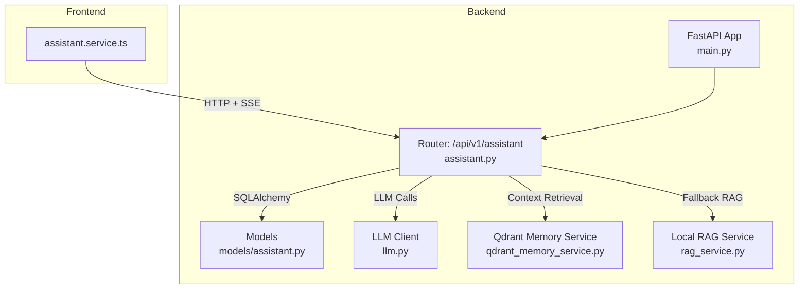
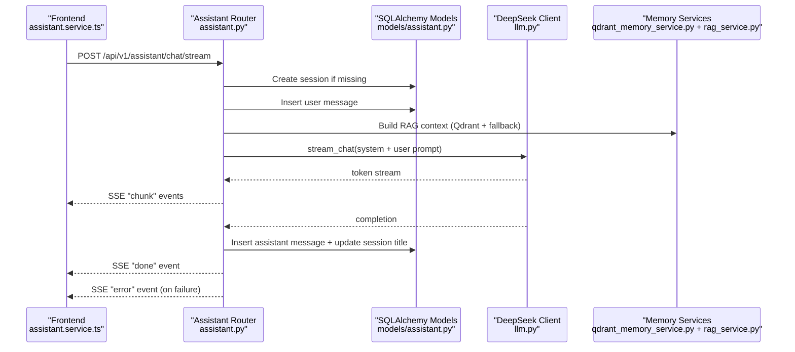
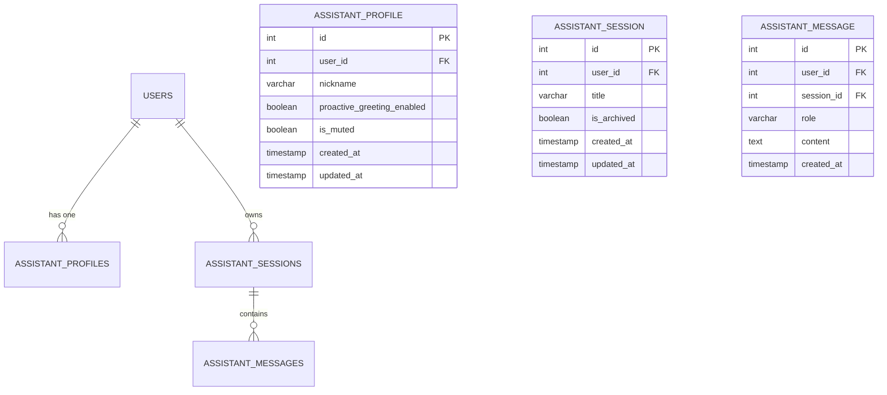
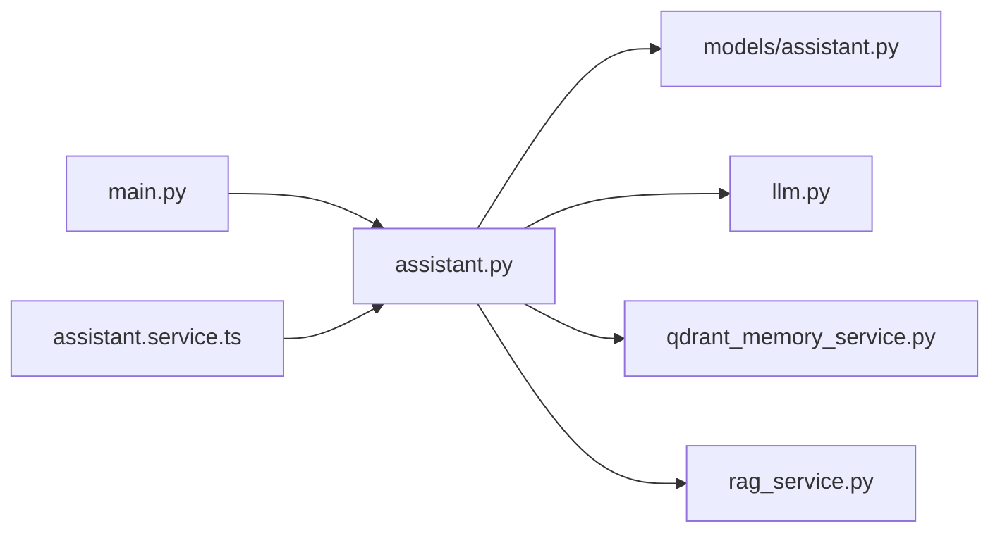

# Assistant Endpoints

<cite>
**Referenced Files in This Document**
- [assistant.py](file://backend/app/api/v1/assistant.py)
- [models/assistant.py](file://backend/app/models/assistant.py)
- [llm.py](file://backend/app/agents/llm.py)
- [qdrant_memory_service.py](file://backend/app/services/qdrant_memory_service.py)
- [rag_service.py](file://backend/app/services/rag_service.py)
- [assistant.service.ts](file://frontend/src/services/assistant.service.ts)
- [config.py](file://backend/app/core/config.py)
- [main.py](file://backend/main.py)
</cite>

## Table of Contents
1. [Introduction](#introduction)
2. [Project Structure](#project-structure)
3. [Core Components](#core-components)
4. [Architecture Overview](#architecture-overview)
5. [Detailed Component Analysis](#detailed-component-analysis)
6. [Dependency Analysis](#dependency-analysis)
7. [Performance Considerations](#performance-considerations)
8. [Troubleshooting Guide](#troubleshooting-guide)
9. [Conclusion](#conclusion)

## Introduction
This document provides comprehensive API documentation for the personal assistant endpoints under the “映记精灵” (Yinji Sprite) assistant system. It covers:
- Chat interaction endpoints: session management, message sending, and session history
- Assistant configuration endpoints: personality settings, voice integration, and preference management
- AI agent system, conversation state management, and streaming response handling
- Real-time interaction patterns, chat protocols, message formatting, and session persistence
- Guidance on handling long-running conversations, error recovery, and assistant customization

## Project Structure
The assistant endpoints are implemented as FastAPI routes under the `/api/v1/assistant` prefix. They integrate with:
- SQLAlchemy models for sessions, messages, and profiles
- LLM client for DeepSeek chat completions (including streaming)
- Memory retrieval services (Qdrant and local RAG) for context-aware responses
- Frontend service that consumes SSE events for streaming chat

**Diagram sources**
- [main.py:78-80](file://backend/main.py#L78-L80)
- [assistant.py:26](file://backend/app/api/v1/assistant.py#L26)
- [models/assistant.py:13](file://backend/app/models/assistant.py#L13)
- [llm.py:13](file://backend/app/agents/llm.py#L13)
- [qdrant_memory_service.py:45](file://backend/app/services/qdrant_memory_service.py#L45)
- [rag_service.py:147](file://backend/app/services/rag_service.py#L147)
- [assistant.service.ts:35](file://frontend/src/services/assistant.service.ts#L35)

**Section sources**
- [main.py:78-80](file://backend/main.py#L78-L80)
- [assistant.py:26](file://backend/app/api/v1/assistant.py#L26)

## Core Components
- Assistant API Router: Defines endpoints for profile, sessions, messages, and streaming chat
- Data Models: AssistantProfile, AssistantSession, AssistantMessage
- LLM Client: DeepSeek client with synchronous and streaming chat capabilities
- Memory Services: Qdrant-based semantic retrieval and local BM25-based RAG
- Frontend Service: SSE consumer for streaming chat responses

Key responsibilities:
- Session lifecycle management (create, archive, clear)
- Message CRUD within sessions
- Streaming chat with structured SSE events
- Context-aware responses using memory retrieval
- Assistant configuration (nickname, muting, greeting behavior)

**Section sources**
- [assistant.py:122-389](file://backend/app/api/v1/assistant.py#L122-L389)
- [models/assistant.py:13-78](file://backend/app/models/assistant.py#L13-L78)
- [llm.py:13-146](file://backend/app/agents/llm.py#L13-L146)
- [qdrant_memory_service.py:45-189](file://backend/app/services/qdrant_memory_service.py#L45-L189)
- [rag_service.py:147-360](file://backend/app/services/rag_service.py#L147-L360)

## Architecture Overview
The assistant system integrates:
- Authentication: Requires a valid JWT bearer token for all assistant endpoints
- Conversation state: Maintained in the database with sessions and messages
- Context retrieval: Prefer Qdrant semantic search; fallback to local RAG
- Streaming responses: SSE with structured events for meta, chunk, done, and error

**Diagram sources**
- [assistant.service.ts:69-125](file://frontend/src/services/assistant.service.ts#L69-L125)
- [assistant.py:277-387](file://backend/app/api/v1/assistant.py#L277-L387)
- [models/assistant.py:13-78](file://backend/app/models/assistant.py#L13-L78)
- [llm.py:94-143](file://backend/app/agents/llm.py#L94-L143)
- [qdrant_memory_service.py:175-186](file://backend/app/services/qdrant_memory_service.py#L175-L186)
- [rag_service.py:210-317](file://backend/app/services/rag_service.py#L210-L317)

## Detailed Component Analysis

### Assistant Profile Endpoints
- GET /api/v1/assistant/profile
  - Purpose: Retrieve current assistant configuration for the user
  - Authentication: Required
  - Response: AssistantProfileResponse (nickname, proactive_greeting_enabled, is_muted, initialized)
  - Behavior: Creates a default profile if none exists

- PUT /api/v1/assistant/profile
  - Purpose: Update assistant configuration
  - Request: AssistantProfileUpdateRequest (nickname, proactive_greeting_enabled, is_muted)
  - Authentication: Required
  - Notes: proactive_greeting_enabled is fixed to false per product requirement

**Section sources**
- [assistant.py:122-157](file://backend/app/api/v1/assistant.py#L122-L157)
- [models/assistant.py:13-34](file://backend/app/models/assistant.py#L13-L34)

### Session Management Endpoints
- GET /api/v1/assistant/sessions
  - Purpose: List active sessions for the user
  - Query: limit (default 20, min 1, max 100)
  - Response: Array of AssistantSessionResponse (id, title, created_at, updated_at)

- POST /api/v1/assistant/sessions
  - Purpose: Create a new session
  - Request: CreateSessionRequest (title)
  - Response: AssistantSessionResponse

- DELETE /api/v1/assistant/sessions/{session_id}
  - Purpose: Archive a session (soft delete)
  - Path: session_id
  - Response: {"ok": true}

- POST /api/v1/assistant/sessions/{session_id}/clear
  - Purpose: Clear all messages in a session
  - Path: session_id
  - Response: {"ok": true}

**Section sources**
- [assistant.py:160-218](file://backend/app/api/v1/assistant.py#L160-L218)
- [models/assistant.py:36-55](file://backend/app/models/assistant.py#L36-L55)

### Session History Endpoint
- GET /api/v1/assistant/sessions/{session_id}/messages
  - Purpose: Retrieve all messages in a session ordered by creation time
  - Path: session_id
  - Response: Array of AssistantMessageResponse (id, role, content, created_at)

**Section sources**
- [assistant.py:221-249](file://backend/app/api/v1/assistant.py#L221-L249)
- [models/assistant.py:57-78](file://backend/app/models/assistant.py#L57-L78)

### Chat Interaction Endpoint
- POST /api/v1/assistant/chat/stream
  - Purpose: Stream assistant responses to user messages with conversation context
  - Authentication: Required
  - Request: ChatStreamRequest (message, session_id?)
  - Streaming Events (SSE):
    - event: "meta", data: {session_id, user_message_id}
    - event: "chunk", data: {text}
    - event: "done", data: {session_id, assistant_message_id, rag_hits}
    - event: "error", data: {message}
  - Behavior:
    - Creates a session if session_id is omitted
    - Inserts user message into DB
    - Builds system + user prompt with:
      - Assistant personality
      - User MBTI
      - Recent conversation history
      - Retrieved memory context (Qdrant or local RAG)
    - Streams tokens from DeepSeek
    - On completion, inserts assistant message and updates session title if default

Real-time protocol:
- Frontend reads SSE lines and dispatches callbacks for meta/chunk/done/error
- Frontend should handle partial lines and buffer concatenation

**Section sources**
- [assistant.py:277-387](file://backend/app/api/v1/assistant.py#L277-L387)
- [assistant.service.ts:69-125](file://frontend/src/services/assistant.service.ts#L69-L125)
- [llm.py:94-143](file://backend/app/agents/llm.py#L94-L143)

### Data Models and Persistence

**Diagram sources**
- [models/assistant.py:13-78](file://backend/app/models/assistant.py#L13-L78)

**Section sources**
- [models/assistant.py:13-78](file://backend/app/models/assistant.py#L13-L78)

### Context Retrieval and RAG
- Qdrant-based retrieval:
  - Sync user diaries to collection (if enabled)
  - Vector search with cosine distance
  - Returns diary fragments with metadata
- Local RAG fallback:
  - Chunk diaries into summaries and raw text
  - BM25-like scoring with recency, importance, emotion, repetition, and people hit
  - Deduplication by Jaccard similarity

**Section sources**
- [assistant.py:85-119](file://backend/app/api/v1/assistant.py#L85-L119)
- [qdrant_memory_service.py:175-186](file://backend/app/services/qdrant_memory_service.py#L175-L186)
- [rag_service.py:147-317](file://backend/app/services/rag_service.py#L147-L317)

### Streaming Response Handling
- Backend emits structured SSE lines:
  - event: "meta" with session and message IDs
  - event: "chunk" with incremental text tokens
  - event: "done" with completion metadata and RAG hits
  - event: "error" with error message
- Frontend parses lines, extracts event and data, and invokes callbacks

**Section sources**
- [assistant.py:343-387](file://backend/app/api/v1/assistant.py#L343-L387)
- [assistant.service.ts:69-125](file://frontend/src/services/assistant.service.ts#L69-L125)

## Dependency Analysis
- Router registration: Assistant router is included in the main app under /api/v1
- Authentication: All assistant endpoints depend on get_current_active_user
- Database: Sessions, messages, and profiles stored via SQLAlchemy ORM
- LLM: DeepSeek client configured via settings (API key and base URL)
- Memory: Qdrant service enabled by settings; fallback RAG used otherwise

**Diagram sources**
- [main.py:78-80](file://backend/main.py#L78-L80)
- [assistant.py:18-25](file://backend/app/api/v1/assistant.py#L18-L25)
- [config.py:62-88](file://backend/app/core/config.py#L62-L88)

**Section sources**
- [main.py:78-80](file://backend/main.py#L78-L80)
- [config.py:62-88](file://backend/app/core/config.py#L62-L88)

## Performance Considerations
- Streaming latency: SSE reduces perceived latency by delivering tokens incrementally
- Context size: Limit recent history and RAG hits to keep prompts concise
- Memory retrieval:
  - Qdrant: Enable only when credentials are provided; otherwise fallback to local RAG
  - Local RAG: Tune top_k and source types to balance relevance and speed
- Token limits: DeepSeek requests are streamed; ensure prompt construction stays within reasonable sizes
- Concurrency: Streaming responses are handled per request; avoid blocking operations in the route

[No sources needed since this section provides general guidance]

## Troubleshooting Guide
Common issues and resolutions:
- Authentication failures:
  - Ensure Authorization header with Bearer token is present
  - Verify token validity and expiration
- Session not found:
  - Confirm session belongs to the authenticated user
  - Use GET /api/v1/assistant/sessions to list active sessions
- Empty or missing context:
  - Check Qdrant availability and credentials
  - Local RAG requires existing diary entries
- Streaming errors:
  - Listen for SSE "error" event and surface message to the user
  - Validate network connectivity and timeouts
- Long-running conversations:
  - Limit recent history length to reduce prompt size
  - Archive old sessions to keep lists manageable

**Section sources**
- [assistant.py:202-218](file://backend/app/api/v1/assistant.py#L202-L218)
- [assistant.py:221-249](file://backend/app/api/v1/assistant.py#L221-L249)
- [assistant.py:384-386](file://backend/app/api/v1/assistant.py#L384-L386)

## Conclusion
The assistant endpoints provide a robust, context-aware chat experience with streaming responses, session persistence, and configurable personality settings. By leveraging Qdrant for semantic memory and local RAG as a fallback, the system balances performance and relevance. The SSE-based streaming protocol enables smooth real-time interactions, while strict authentication and session scoping ensure secure usage.