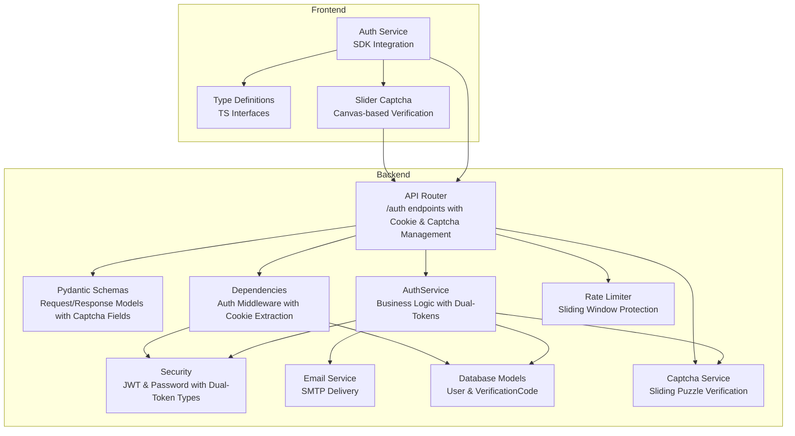
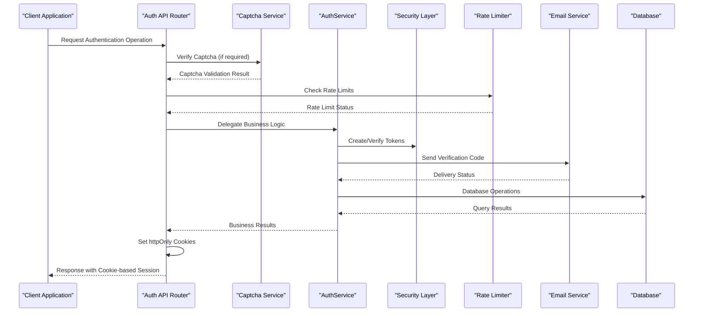
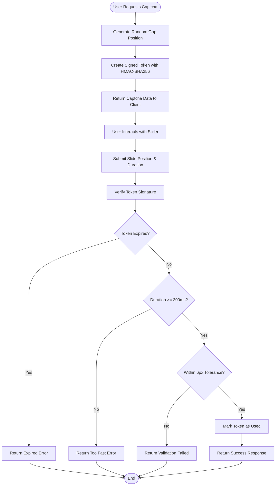
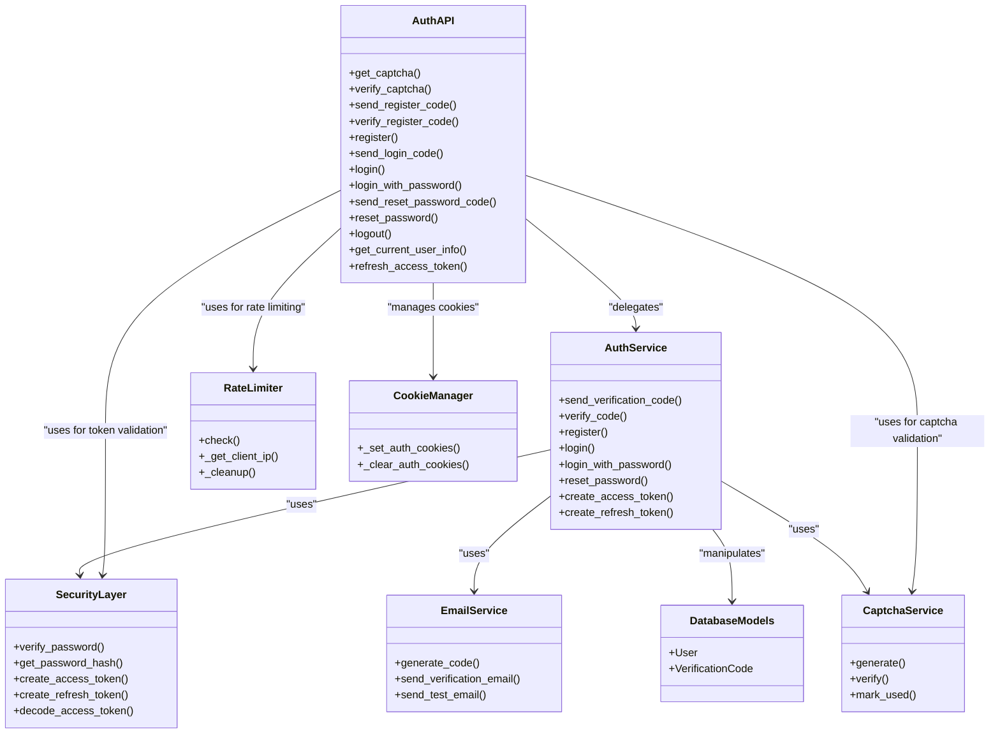
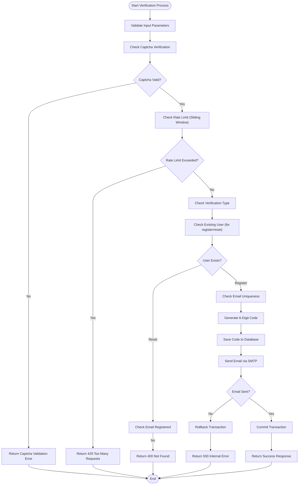

# Authentication Endpoints

<cite>
**Referenced Files in This Document**
- [auth.py](file://backend/app/api/v1/auth.py)
- [auth.py](file://backend/app/schemas/auth.py)
- [auth_service.py](file://backend/app/services/auth_service.py)
- [captcha_service.py](file://backend/app/services/captcha_service.py)
- [security.py](file://backend/app/core/security.py)
- [deps.py](file://backend/app/core/deps.py)
- [rate_limit.py](file://backend/app/core/rate_limit.py)
- [email_service.py](file://backend/app/services/email_service.py)
- [config.py](file://backend/app/core/config.py)
- [database.py](file://backend/app/models/database.py)
- [auth.service.ts](file://frontend/src/services/auth.service.ts)
- [auth.ts](file://frontend/src/types/auth.ts)
- [SliderCaptcha.tsx](file://frontend/src/components/common/SliderCaptcha.tsx)
</cite>

## Update Summary
**Changes Made**
- Added new captcha endpoints: `/api/v1/auth/captcha` and `/api/v1/auth/captcha/verify`
- Enhanced existing authentication endpoints with mandatory captcha verification
- Implemented comprehensive sliding puzzle captcha system with signature verification
- Updated request schemas to include captcha_token, captcha_x, and captcha_duration fields
- Integrated captcha validation into all verification code sending endpoints
- Added frontend slider captcha component with canvas-based puzzle verification

## Table of Contents
1. [Introduction](#introduction)
2. [Project Structure](#project-structure)
3. [Core Components](#core-components)
4. [Architecture Overview](#architecture-overview)
5. [Detailed Component Analysis](#detailed-component-analysis)
6. [Captcha System](#captcha-system)
7. [Cookie-Based Authentication System](#cookie-based-authentication-system)
8. [Dual-Token Authentication](#dual-token-authentication)
9. [Automatic Refresh Mechanism](#automatic-refresh-mechanism)
10. [Rate Limiting Implementation](#rate-limiting-implementation)
11. [Dependency Analysis](#dependency-analysis)
12. [Performance Considerations](#performance-considerations)
13. [Troubleshooting Guide](#troubleshooting-guide)
14. [Conclusion](#conclusion)

## Introduction
This document provides comprehensive API documentation for the authentication system that has migrated from token-based to cookie-based authentication. The system now implements a dual-token authentication system with httpOnly cookies, automatic refresh capabilities, comprehensive rate limiting, and an integrated sliding puzzle captcha system. It covers all authentication-related HTTP endpoints including registration, login, password reset, logout, and user information retrieval. The documentation details HTTP methods, URL patterns, request/response schemas, authentication requirements, parameter validation rules, error handling, verification code system, JWT token generation, session management with cookies, and the new captcha verification system.

## Project Structure
The authentication system is implemented in the backend using FastAPI and structured into several key components with cookie-based session management and integrated captcha verification:
- API endpoints: Define HTTP routes and request/response handling with cookie management and captcha validation
- Schemas: Define request/response data validation using Pydantic with captcha fields
- Services: Implement business logic for authentication operations with dual-token support and captcha integration
- Security: Handle JWT token creation/verification and password hashing with dual-token types
- Dependencies: Manage authentication middleware and user context with cookie extraction
- Rate Limiting: Implement comprehensive sliding window rate limiting
- Email service: Handle verification code delivery via email
- Database models: Define User and VerificationCode entities
- Captcha service: Handle sliding puzzle verification with signature validation



**Diagram sources**
- [auth.py:32](file://backend/app/api/v1/auth.py#L32)
- [auth_service.py:16](file://backend/app/services/auth_service.py#L16)
- [security.py:13](file://backend/app/core/security.py#L13)
- [deps.py:18](file://backend/app/core/deps.py#L18)
- [rate_limit.py:10](file://backend/app/core/rate_limit.py#L10)
- [email_service.py:25](file://backend/app/services/email_service.py#L25)
- [database.py:13](file://backend/app/models/database.py#L13)
- [captcha_service.py:1](file://backend/app/services/captcha_service.py#L1)

**Section sources**
- [auth.py:1-504](file://backend/app/api/v1/auth.py#L1-L504)
- [auth.py:1-109](file://backend/app/schemas/auth.py#L1-L109)
- [auth_service.py:1-358](file://backend/app/services/auth_service.py#L1-L358)
- [captcha_service.py:1-137](file://backend/app/services/captcha_service.py#L1-L137)

## Core Components
The authentication system consists of several interconnected components that work together to provide secure user authentication with cookie-based session management and integrated captcha verification:

### Request/Response Schemas
The system uses Pydantic models to define and validate all request and response data structures, including new captcha-related fields. These schemas ensure data integrity and provide automatic validation and serialization for both token-based and cookie-based operations with captcha integration.

### Business Logic Layer
The AuthService class encapsulates all authentication-related business logic, including verification code generation, user registration, login operations, password reset functionality, dual-token management, and captcha integration.

### Security Layer
Handles JWT token creation and verification with dual-token types (access and refresh), password hashing using bcrypt, and token expiration management with different expiration policies.

### Captcha System
Implements a comprehensive sliding puzzle captcha system with signature verification, anti-bot measures, and memory-based token management to prevent abuse and automated attacks.

### Rate Limiting System
Implements comprehensive sliding window rate limiting with different thresholds for verification code sending and authentication attempts to prevent abuse and spam attacks.

### Cookie Management
Manages httpOnly cookie-based session storage with secure configuration, automatic refresh mechanisms, and seamless integration with the dual-token system.

**Section sources**
- [auth.py:10-109](file://backend/app/schemas/auth.py#L10-L109)
- [auth_service.py:16-358](file://backend/app/services/auth_service.py#L16-L358)
- [security.py:13-87](file://backend/app/core/security.py#L13-L87)
- [captcha_service.py:1-137](file://backend/app/services/captcha_service.py#L1-L137)
- [rate_limit.py:10-58](file://backend/app/core/rate_limit.py#L10-L58)

## Architecture Overview
The authentication system follows a layered architecture with clear separation of concerns and cookie-based session management, now enhanced with integrated captcha verification:



**Diagram sources**
- [auth.py:64](file://backend/app/api/v1/auth.py#L64)
- [auth_service.py:19](file://backend/app/services/auth_service.py#L19)
- [captcha_service.py:73](file://backend/app/services/captcha_service.py#L73)
- [security.py:48](file://backend/app/core/security.py#L48)
- [rate_limit.py:38](file://backend/app/core/rate_limit.py#L38)
- [email_service.py:48](file://backend/app/services/email_service.py#L48)
- [database.py:13](file://backend/app/models/database.py#L13)

## Detailed Component Analysis

### Captcha Endpoints

#### Get Captcha (`GET /auth/captcha`)
Generates and returns sliding puzzle captcha parameters for human verification.

**HTTP Method:** GET  
**URL Pattern:** `/auth/captcha`  
**Authentication:** No authentication required  

**Response Schema:**
- `target_x`: number - Gap x-coordinate for puzzle placement
- `target_y`: number - Gap y-coordinate for puzzle placement
- `token`: string - Signed token for verification
- `piece_size`: number - Puzzle piece size
- `bg_width`: number - Background width
- `bg_height`: number - Background height

**Captcha Parameters:**
- Puzzle dimensions: 300x180 pixels with 44px piece size
- Minimum distance from edges: 50px
- Tolerance: ±6 pixels acceptable error
- Minimum sliding duration: 300ms
- Token expiration: 120 seconds

**Section sources**
- [auth.py:83](file://backend/app/api/v1/auth.py#L83-L89)
- [captcha_service.py:46](file://backend/app/services/captcha_service.py#L46-L70)

#### Verify Captcha (`POST /auth/captcha/verify`)
Validates user's sliding puzzle interaction with signature verification.

**HTTP Method:** POST  
**URL Pattern:** `/auth/captcha/verify`  
**Authentication:** No authentication required  

**Request Schema:**
- `token`: string - Captcha token from `/auth/captcha`
- `slide_x`: number - User's sliding position
- `duration`: number - Sliding duration in milliseconds

**Response Schema:**
- `success`: boolean - Verification result
- `message`: string - Verification status message

**Validation Rules:**
- Token signature verification using HMAC-SHA256
- Token expiration check (120 seconds)
- Anti-replay protection with memory-based token tracking
- Minimum sliding duration validation (≥300ms)
- Coordinate accuracy within 6-pixel tolerance
- Prevents automated bot submissions

**Common Error Responses:**
- 400 Bad Request: Invalid parameters, signature failure, expired token, or validation failure

**Section sources**
- [auth.py:92](file://backend/app/api/v1/auth.py#L92-L115)
- [captcha_service.py:73](file://backend/app/services/captcha_service.py#L73-L123)

### Registration Endpoints

#### Send Registration Code (`POST /auth/register/send-code`)
Sends a 6-digit verification code to the user's email for registration with mandatory captcha verification.

**HTTP Method:** POST  
**URL Pattern:** `/auth/register/send-code`  
**Authentication:** No authentication required  

**Request Schema:**
- `email`: string (required) - User's email address
- `type`: string (optional) - Must be "register" if provided
- `captcha_token`: string (required) - Captcha verification token
- `captcha_x`: number (required) - User's sliding position
- `captcha_duration`: number (required) - Sliding duration in milliseconds

**Response Schema:**
- `success`: boolean - Operation status
- `message`: string - Operation result message

**Captcha Integration:**
- Mandatory captcha verification before sending verification code
- Validates user interaction with sliding puzzle
- Prevents automated registration attempts

**Rate Limiting:**
- Sliding window: 5 requests per minute per IP address
- Uses `send_code_limiter` for verification code rate protection

**Validation Rules:**
- Email must be valid format
- Type field, if present, must equal "register"
- Captcha token must be valid and unexpired
- Captcha coordinates must match target within tolerance
- Captcha duration must meet minimum threshold

**Common Error Responses:**
- 400 Bad Request: Invalid email format, captcha validation failure, type mismatch, or rate limit exceeded
- 429 Too Many Requests: Exceeded rate limit

**Section sources**
- [auth.py:118](file://backend/app/api/v1/auth.py#L118-L149)
- [auth.py:131](file://backend/app/api/v1/auth.py#L131)
- [auth.py:64](file://backend/app/api/v1/auth.py#L64-L81)
- [rate_limit.py:54](file://backend/app/core/rate_limit.py#L54)

#### Verify Registration Code (`POST /auth/register/verify`)
Verifies a registration verification code without completing registration with authentication rate limiting.

**HTTP Method:** POST  
**URL Pattern:** `/auth/register/verify`  
**Authentication:** No authentication required  

**Request Schema:**
- `email`: string (required) - User's email address
- `code`: string (required) - 6-digit verification code
- `type`: string (optional) - Must be "register" if provided

**Response Schema:**
- `success`: boolean - Operation status
- `message`: string - Operation result message

**Rate Limiting:**
- Sliding window: 10 requests per minute per IP address
- Uses `auth_limiter` for authentication attempt rate protection

**Validation Rules:**
- Email must be valid format
- Code must be exactly 6 digits
- Type field, if present, must equal "register"
- Code must match unexpired, unused verification code

**Common Error Responses:**
- 400 Bad Request: Invalid code, expired code, or user already registered
- 429 Too Many Requests: Rate limit exceeded

**Section sources**
- [auth.py:152](file://backend/app/api/v1/auth.py#L152-L183)
- [auth.py:109](file://backend/app/api/v1/auth.py#L109)
- [rate_limit.py:57](file://backend/app/core/rate_limit.py#L57)

#### Complete Registration (`POST /auth/register`)
Registers a new user account using email and password, returning dual tokens via httpOnly cookies.

**HTTP Method:** POST  
**URL Pattern:** `/auth/register`  
**Authentication:** No authentication required  

**Request Schema:**
- `email`: string (required) - User's email address
- `code`: string (required) - 6-digit verification code
- `password`: string (required) - User's password (minimum 6 characters)
- `username`: string (optional) - User's display name

**Response Schema:**
- `access_token`: string - JWT access token
- `token_type`: string - Token type (always "bearer")
- `user`: object - User information (id, email, username, etc.)

**Cookie Management:**
- Sets httpOnly cookies for both access_token and refresh_token
- Access token: 30 minutes expiration
- Refresh token: 7 days expiration
- Secure flags set appropriately for production

**Rate Limiting:**
- Sliding window: 10 requests per minute per IP address
- Uses `auth_limiter` for authentication attempt rate protection

**Validation Rules:**
- Email must be valid format
- Code must be exactly 6 digits
- Password must be at least 6 characters
- Username must be 50 characters or less
- Code must be verified and unexpired
- Email must not already exist

**Common Error Responses:**
- 400 Bad Request: Invalid input, expired code, or email already registered
- 429 Too Many Requests: Rate limit exceeded

**Section sources**
- [auth.py:186](file://backend/app/api/v1/auth.py#L186-L230)
- [auth.py:146](file://backend/app/api/v1/auth.py#L146)
- [auth.py:35](file://backend/app/api/v1/auth.py#L35-L54)

### Login Endpoints

#### Send Login Code (`POST /auth/login/send-code`)
Sends a 6-digit verification code to the user's email for login with mandatory captcha verification.

**HTTP Method:** POST  
**URL Pattern:** `/auth/login/send-code`  
**Authentication:** No authentication required  

**Request Schema:**
- `email`: string (required) - User's email address
- `type`: string (optional) - Must be "login" if provided
- `captcha_token`: string (required) - Captcha verification token
- `captcha_x`: number (required) - User's sliding position
- `captcha_duration`: number (required) - Sliding duration in milliseconds

**Response Schema:**
- `success`: boolean - Operation status
- `message`: string - Operation result message

**Captcha Integration:**
- Mandatory captcha verification before sending verification code
- Validates user interaction with sliding puzzle
- Prevents automated login attempts

**Rate Limiting:**
- Sliding window: 5 requests per minute per IP address
- Uses `send_code_limiter` for verification code rate protection

**Validation Rules:**
- Email must be valid format
- Type field, if present, must equal "login"
- Captcha token must be valid and unexpired
- Captcha coordinates must match target within tolerance
- Captcha duration must meet minimum threshold

**Common Error Responses:**
- 400 Bad Request: Invalid email format, captcha validation failure

**Section sources**
- [auth.py:233](file://backend/app/api/v1/auth.py#L233-L263)
- [auth.py:246](file://backend/app/api/v1/auth.py#L246)
- [auth.py:64](file://backend/app/api/v1/auth.py#L64-L81)
- [rate_limit.py:54](file://backend/app/core/rate_limit.py#L54)

#### Code-based Login (`POST /auth/login`)
Logs a user in using a verification code, returning dual tokens via httpOnly cookies.

**HTTP Method:** POST  
**URL Pattern:** `/auth/login`  
**Authentication:** No authentication required  

**Request Schema:**
- `email`: string (required) - User's email address
- `code`: string (required) - 6-digit verification code

**Response Schema:**
- `access_token`: string - JWT access token
- `token_type`: string - Token type (always "bearer")
- `user`: object - User information (id, email, username, etc.)

**Cookie Management:**
- Sets httpOnly cookies for both access_token and refresh_token
- Access token: 30 minutes expiration
- Refresh token: 7 days expiration

**Rate Limiting:**
- Sliding window: 10 requests per minute per IP address
- Uses `auth_limiter` for authentication attempt rate protection

**Validation Rules:**
- Email must be valid format
- Code must be exactly 6 digits
- Code must be verified and unexpired
- User must exist and be active

**Common Error Responses:**
- 400 Bad Request: Invalid code, expired code, or user not found

**Section sources**
- [auth.py:266](file://backend/app/api/v1/auth.py#L266-L303)
- [auth.py:281](file://backend/app/api/v1/auth.py#L281)
- [auth.py:35](file://backend/app/api/v1/auth.py#L35-L54)

#### Password Login (`POST /auth/login/password`)
Logs a user in using email and password, returning dual tokens via httpOnly cookies.

**HTTP Method:** POST  
**URL Pattern:** `/auth/login/password`  
**Authentication:** No authentication required  

**Request Schema:**
- `email`: string (required) - User's email address
- `password`: string (required) - User's password

**Response Schema:**
- `access_token`: string - JWT access token
- `token_type`: string - Token type (always "bearer")
- `user`: object - User information (id, email, username, etc.)

**Cookie Management:**
- Sets httpOnly cookies for both access_token and refresh_token
- Access token: 30 minutes expiration
- Refresh token: 7 days expiration

**Rate Limiting:**
- Sliding window: 10 requests per minute per IP address
- Uses `auth_limiter` for authentication attempt rate protection

**Validation Rules:**
- Email must be valid format
- Password must be at least 6 characters
- User must exist and be active
- Password must match stored hash

**Common Error Responses:**
- 400 Bad Request: Invalid credentials or user not found

**Section sources**
- [auth.py:306](file://backend/app/api/v1/auth.py#L306-L342)
- [auth.py:321](file://backend/app/api/v1/auth.py#L321)
- [auth.py:35](file://backend/app/api/v1/auth.py#L35-L54)

### Password Reset Endpoints

#### Send Reset Password Code (`POST /auth/reset-password/send-code`)
Sends a 6-digit verification code for password reset with mandatory captcha verification.

**HTTP Method:** POST  
**URL Pattern:** `/auth/reset-password/send-code`  
**Authentication:** No authentication required  

**Request Schema:**
- `email`: string (required) - User's email address
- `type`: string (optional) - Must be "reset" if provided
- `captcha_token`: string (required) - Captcha verification token
- `captcha_x`: number (required) - User's sliding position
- `captcha_duration`: number (required) - Sliding duration in milliseconds

**Response Schema:**
- `success`: boolean - Operation status
- `message`: string - Operation result message

**Captcha Integration:**
- Mandatory captcha verification before sending verification code
- Validates user interaction with sliding puzzle
- Prevents automated password reset attempts

**Rate Limiting:**
- Sliding window: 5 requests per minute per IP address
- Uses `send_code_limiter` for verification code rate protection

**Validation Rules:**
- Email must be valid format
- Type field, if present, must equal "reset"
- User must already be registered
- Captcha token must be valid and unexpired
- Captcha coordinates must match target within tolerance
- Captcha duration must meet minimum threshold

**Common Error Responses:**
- 400 Bad Request: Invalid email format, user not found, or captcha validation failure

**Section sources**
- [auth.py:345](file://backend/app/api/v1/auth.py#L345-L375)
- [auth.py:358](file://backend/app/api/v1/auth.py#L358)
- [auth.py:64](file://backend/app/api/v1/auth.py#L64-L81)
- [rate_limit.py:54](file://backend/app/core/rate_limit.py#L54)

#### Reset Password (`POST /auth/reset-password`)
Resets a user's password using verification code with comprehensive rate limiting.

**HTTP Method:** POST  
**URL Pattern:** `/auth/reset-password`  
**Authentication:** No authentication required  

**Request Schema:**
- `email`: string (required) - User's email address
- `code`: string (required) - 6-digit verification code
- `new_password`: string (required) - New password (minimum 6 characters)

**Response Schema:**
- `success`: boolean - Operation status
- `message`: string - Operation result message

**Rate Limiting:**
- Sliding window: 10 requests per minute per IP address
- Uses `auth_limiter` for authentication attempt rate protection

**Validation Rules:**
- Email must be valid format
- Code must be exactly 6 digits
- New password must be at least 6 characters
- Code must be verified and unexpired
- User must exist

**Common Error Responses:**
- 400 Bad Request: Invalid code, expired code, or user not found

**Section sources**
- [auth.py:378](file://backend/app/api/v1/auth.py#L378-L402)
- [auth.py:392](file://backend/app/api/v1/auth.py#L392)
- [rate_limit.py:57](file://backend/app/core/rate_limit.py#L57)

### Session Management

#### Logout (`POST /auth/logout`)
Logs out the current user by clearing httpOnly cookies.

**HTTP Method:** POST  
**URL Pattern:** `/auth/logout`  
**Authentication:** Bearer token required  

**Request Schema:** None  
**Response Schema:**
- `success`: boolean - Operation status
- `message`: string - Operation result message

**Cookie Management:**
- Clears both access_token and refresh_token cookies
- Removes httpOnly cookies from browser storage

**Authentication Requirements:**
- Requires valid JWT bearer token or cookie-based authentication
- User must be active

**Common Error Responses:**
- 401 Unauthorized: Invalid or missing token
- 403 Forbidden: User disabled

**Section sources**
- [auth.py:405](file://backend/app/api/v1/auth.py#L405-L412)
- [auth.py:57](file://backend/app/api/v1/auth.py#L57-L61)

#### Get Current User Info (`GET /auth/me`)
Retrieves the currently authenticated user's information using cookie-based authentication.

**HTTP Method:** GET  
**URL Pattern:** `/auth/me`  
**Authentication:** Cookie-based authentication required  

**Request Schema:** None  
**Response Schema:**
- `id`: integer - User ID
- `email`: string - User's email
- `username`: string or null - User's display name
- `avatar_url`: string or null - Avatar URL
- `mbti`: string or null - MBTI personality type
- `social_style`: string or null - Social style
- `current_state`: string or null - Current state
- `catchphrases`: array or null - Catchphrases list
- `is_active`: boolean - Account activation status
- `is_verified`: boolean - Email verification status
- `created_at`: string - Account creation timestamp
- `updated_at`: string - Last update timestamp

**Authentication Requirements:**
- Requires valid access token via httpOnly cookie
- User must be active

**Common Error Responses:**
- 401 Unauthorized: Invalid or missing token
- 403 Forbidden: User disabled
- 400 Bad Request: User not activated

**Section sources**
- [auth.py:467](file://backend/app/api/v1/auth.py#L467-L474)
- [auth.py:410](file://backend/app/api/v1/auth.py#L410)
- [auth.py:411](file://backend/app/api/v1/auth.py#L411)

#### Refresh Access Token (`POST /auth/refresh`)
Refreshes the access token using the refresh token cookie for seamless user experience.

**HTTP Method:** POST  
**URL Pattern:** `/auth/refresh`  
**Authentication:** Refresh token cookie required  

**Request Schema:** None  
**Response Schema:**
- `access_token`: string - New JWT access token
- `token_type`: string - Token type (always "bearer")
- `user`: object - User information (id, email, username, etc.)

**Cookie Management:**
- Validates refresh token from httpOnly cookie
- Issues new access token with updated cookie
- Maintains refresh token cookie unchanged

**Authentication Requirements:**
- Requires valid refresh token via httpOnly cookie
- Refresh token must be of type "refresh"
- User must be active

**Common Error Responses:**
- 401 Unauthorized: Missing or invalid refresh token
- 403 Forbidden: User disabled

**Section sources**
- [auth.py:415](file://backend/app/api/v1/auth.py#L415-L464)

## Captcha System

The authentication system now includes a comprehensive sliding puzzle captcha system designed to prevent automated attacks and bot submissions:

### Captcha Architecture
The captcha system implements a multi-layered security approach with canvas-based puzzles, signature verification, and anti-bot measures:



**Diagram sources**
- [captcha_service.py:46](file://backend/app/services/captcha_service.py#L46-L70)
- [captcha_service.py:73](file://backend/app/services/captcha_service.py#L73-L123)

### Captcha Parameters and Security Features
- **Puzzle Dimensions**: 300x180 pixels with 44px puzzle piece size
- **Gap Placement**: Random positions with minimum 50px distance from edges
- **Tolerance**: ±6 pixels acceptable error margin
- **Minimum Duration**: 300ms sliding time to prevent automation
- **Token Expiration**: 120-second validity period
- **Anti-Replay**: Memory-based token tracking prevents reuse
- **Signature Verification**: HMAC-SHA256 prevents token forgery

### Frontend Integration
The frontend provides a comprehensive slider captcha component with canvas rendering and real-time validation:

**Frontend Features:**
- Canvas-based puzzle rendering with gradient backgrounds
- Real-time coordinate validation with local tolerance checking
- Visual feedback for successful/failed attempts
- Automatic token refresh on validation failure
- Touch and mouse support for mobile/desktop compatibility

**Integration Pattern:**
1. Fetch captcha parameters from `/api/v1/auth/captcha`
2. Render interactive slider component
3. Collect user interaction data (token, slide_x, duration)
4. Submit captcha verification to server
5. Proceed with authentication flow only after successful verification

**Section sources**
- [captcha_service.py:1-137](file://backend/app/services/captcha_service.py#L1-L137)
- [auth.py:83](file://backend/app/api/v1/auth.py#L83-L115)
- [auth.py:64](file://backend/app/api/v1/auth.py#L64-L81)
- [SliderCaptcha.tsx:1-377](file://frontend/src/components/common/SliderCaptcha.tsx#L1-L377)

## Cookie-Based Authentication System

The authentication system now implements a comprehensive cookie-based authentication approach with httpOnly cookies for enhanced security:

### Cookie Configuration
- **Access Token Cookie**: `access_token` - httpOnly, 30 minutes expiration
- **Refresh Token Cookie**: `refresh_token` - httpOnly, 7 days expiration
- **Secure Flags**: Disabled for development, should be enabled in production
- **SameSite**: Lax for CSRF protection
- **Path**: Root path for global availability

### Cookie Management Functions
The system provides dedicated functions for cookie manipulation:
- `_set_auth_cookies()`: Sets both access and refresh tokens
- `_clear_auth_cookies()`: Clears authentication cookies
- Automatic cookie extraction from requests

### Frontend Integration
Frontend services automatically handle cookie-based authentication:
- Cookies are sent automatically with each request
- No manual token management required
- Seamless integration with existing API calls

**Section sources**
- [auth.py:35](file://backend/app/api/v1/auth.py#L35-L54)
- [auth.py:57](file://backend/app/api/v1/auth.py#L57-L61)
- [auth.py:415](file://backend/app/api/v1/auth.py#L415-L464)

## Dual-Token Authentication

The system implements a sophisticated dual-token authentication system with distinct roles and expiration policies:

### Token Types and Purposes
- **Access Token**: Short-lived (30 minutes) for routine API operations
- **Refresh Token**: Long-lived (7 days) for seamless token renewal
- **Token Payload**: Contains user ID and token type indicator

### Token Creation Process
1. Successful authentication creates both tokens
2. Access token used for immediate API requests
3. Refresh token stored securely in httpOnly cookie
4. Automatic refresh mechanism handles token renewal

### Token Validation
- Access tokens validated for "access" type
- Refresh tokens validated for "refresh" type
- Separate validation logic prevents token misuse

**Section sources**
- [security.py:48](file://backend/app/core/security.py#L48-L66)
- [security.py:68](file://backend/app/core/security.py#L68-L87)
- [auth.py:219](file://backend/app/api/v1/auth.py#L219-L230)
- [auth.py:292](file://backend/app/api/v1/auth.py#L292-L303)

## Automatic Refresh Mechanism

The system provides seamless automatic refresh capabilities to minimize user disruption:

### Refresh Flow
1. Access token expires during API request
2. Client receives 401 Unauthorized response
3. Automatic refresh request using refresh token cookie
4. New access token issued and stored in cookie
5. Original request retried automatically

### Implementation Details
- Refresh endpoint validates refresh token from cookie
- Issues new access token with updated expiration
- Maintains refresh token cookie unchanged
- Handles user deactivation gracefully

### Frontend Integration
- Automatic retry logic for 401 responses
- Transparent token renewal process
- Minimal impact on user experience

**Section sources**
- [auth.py:415](file://backend/app/api/v1/auth.py#L415-L464)
- [deps.py:18](file://backend/app/core/deps.py#L18-L32)

## Rate Limiting Implementation

The system implements comprehensive rate limiting with sliding window protection:

### Rate Limiting Strategy
- **Sliding Window Algorithm**: Tracks requests within configurable time windows
- **IP-based Throttling**: Prevents abuse from single clients
- **Different Limits**: Separate limits for verification codes and authentication attempts

### Pre-configured Limits
- **Verification Code Sending**: 5 requests per 60 seconds per IP
- **Authentication Attempts**: 10 requests per 60 seconds per IP
- **Memory Storage**: In-memory tracking suitable for single-instance deployments

### Rate Limiter Class
The `RateLimiter` class provides:
- IP address detection with proxy support
- Automatic cleanup of expired requests
- HTTPException integration for 429 responses
- Configurable parameters for different endpoints

### Implementation Examples
- `send_code_limiter`: Used for verification code endpoints
- `auth_limiter`: Used for authentication operation endpoints

**Section sources**
- [rate_limit.py:10](file://backend/app/core/rate_limit.py#L10-L58)
- [auth.py:131](file://backend/app/api/v1/auth.py#L131)
- [auth.py:172](file://backend/app/api/v1/auth.py#L172)
- [auth.py:203](file://backend/app/api/v1/auth.py#L203)
- [auth.py:246](file://backend/app/api/v1/auth.py#L246)
- [auth.py:281](file://backend/app/api/v1/auth.py#L281)
- [auth.py:321](file://backend/app/api/v1/auth.py#L321)
- [auth.py:358](file://backend/app/api/v1/auth.py#L358)
- [auth.py:392](file://backend/app/api/v1/auth.py#L392)

## Dependency Analysis



**Diagram sources**
- [auth.py:32](file://backend/app/api/v1/auth.py#L32)
- [auth_service.py:16](file://backend/app/services/auth_service.py#L16)
- [captcha_service.py:132](file://backend/app/services/captcha_service.py#L132)
- [security.py:13](file://backend/app/core/security.py#L13)
- [rate_limit.py:10](file://backend/app/core/rate_limit.py#L10)
- [email_service.py:25](file://backend/app/services/email_service.py#L25)
- [database.py:13](file://backend/app/models/database.py#L13)

### Verification Code System

The verification code system implements a comprehensive security mechanism with rate limiting and captcha integration:



**Diagram sources**
- [auth_service.py:19](file://backend/app/services/auth_service.py#L19-L98)
- [auth.py:64](file://backend/app/api/v1/auth.py#L64-L81)
- [email_service.py:48](file://backend/app/services/email_service.py#L48-L155)

**Section sources**
- [auth_service.py:19-98](file://backend/app/services/auth_service.py#L19-L98)
- [auth.py:64](file://backend/app/api/v1/auth.py#L64-L81)
- [email_service.py:36](file://backend/app/services/email_service.py#L36-L47)

### JWT Token Generation and Management

The system uses JWT tokens for session management with dual-token types and comprehensive security:

**Token Structure:**
- Access Token: Subject (sub), Email, Expiration (30 minutes), Type ("access")
- Refresh Token: Subject (sub), Expiration (7 days), Type ("refresh")

**Token Creation Process:**
1. Validate user credentials or verification code
2. Create token payload with user data and type indicator
3. Encode with HS256 algorithm using configured secret key
4. Set different expiration times for access and refresh tokens

**Token Validation:**
- Decode JWT using configured secret key
- Verify algorithm matches configuration
- Check expiration timestamp
- Validate token type (access vs refresh)
- Load user from database using user ID

**Section sources**
- [auth_service.py:342](file://backend/app/services/auth_service.py#L342-L353)
- [security.py:48](file://backend/app/core/security.py#L48-L66)
- [security.py:68](file://backend/app/core/security.py#L68-L87)
- [config.py:28](file://backend/app/core/config.py#L28-L37)

## Performance Considerations
The authentication system implements several performance optimizations with cookie-based session management and integrated captcha verification:

### Captcha Performance
- **Canvas Rendering**: Efficient client-side canvas rendering with device pixel ratio scaling
- **Local Validation**: Preliminary coordinate validation reduces server load
- **Memory Management**: Automatic cleanup of expired captcha tokens
- **Signature Verification**: Optimized HMAC-SHA256 signature checking

### Rate Limiting
- Sliding window algorithm for precise rate control
- Memory-based storage suitable for single-instance deployments
- Different thresholds for verification codes vs authentication attempts
- Automatic cleanup of expired rate limit entries

### Database Optimization
- Proper indexing on email fields for quick lookups
- Efficient query patterns using SQLAlchemy ORM
- Transaction management to prevent race conditions
- Verification code deduplication and cleanup

### Email Delivery
- Asynchronous SMTP support with fallback to synchronous
- Connection pooling and efficient resource management
- Retry mechanisms for failed deliveries

### Token Management
- Lightweight JWT tokens with minimal payload
- Efficient token validation without database queries
- Configurable expiration times for optimal security/performance balance
- Automatic refresh reduces token expiration overhead

### Cookie Management
- httpOnly cookies prevent XSS attacks
- Automatic cookie handling reduces client-side complexity
- Seamless integration with existing API patterns

## Troubleshooting Guide

### Common Authentication Issues

**Cookie Problems:**
- **Issue**: Cookies not being sent with requests
  - **Cause**: Browser security settings or CORS configuration
  - **Solution**: Check SameSite settings, ensure proper CORS configuration, verify cookie domain/path settings

**Captcha Issues:**
- **Issue**: Captcha validation fails with "请先完成人机验证" (Please complete human verification)
  - **Cause**: Missing captcha_token, captcha_x, or captcha_duration fields
  - **Solution**: Ensure captcha verification completes before sending verification code requests

**Rate Limit Exceeded:**
- **Issue**: Receiving 429 Too Many Requests
  - **Cause**: Too many verification code requests within sliding window period
  - **Solution**: Wait for rate limit to reset or reduce request frequency

**Expired Verification Codes:**
- **Issue**: Code validation fails with "expired" message
  - **Cause**: Code exceeded 5-minute validity period
  - **Solution**: Request a new verification code

**Invalid Credentials:**
- **Issue**: Login fails with invalid credentials
  - **Cause**: Wrong email/password combination or disabled user account
  - **Solution**: Verify credentials or contact support

**Token Validation Errors:**
- **Issue**: 401 Unauthorized on protected endpoints
  - **Cause**: Invalid, expired, or malformed JWT token
  - **Solution**: Re-authenticate to obtain new token

**Refresh Token Issues:**
- **Issue**: Automatic refresh fails silently
  - **Cause**: Expired refresh token or user deactivation
  - **Solution**: Force re-login to obtain new refresh token

### Client Integration Examples

**Frontend SDK Usage:**
The frontend provides a comprehensive authentication service with TypeScript interfaces and automatic cookie handling, now enhanced with captcha integration:

```typescript
// Example: Complete registration flow with captcha verification
const registerUser = async (email: string, password: string) => {
  // Step 1: Get captcha parameters
  const captchaResponse = await fetch('/api/v1/auth/captcha');
  const captchaData = await captchaResponse.json();
  
  // Step 2: Show slider captcha component
  const captchaResult = await showSliderCaptcha(captchaData);
  
  // Step 3: Verify captcha
  const captchaVerify = await fetch('/api/v1/auth/captcha/verify', {
    method: 'POST',
    headers: {'Content-Type': 'application/json'},
    body: JSON.stringify({
      token: captchaResult.token,
      slide_x: captchaResult.slide_x,
      duration: captchaResult.duration
    })
  });
  
  if (!captchaVerify.ok) {
    throw new Error('Captcha verification failed');
  }
  
  // Step 4: Send verification code with captcha data
  await authService.sendRegisterCode(email, captchaResult);
  
  // Step 5: Verify code (client receives code via email)
  const verificationResult = await authService.verifyRegisterCode({
    email,
    code: receivedCode,
    type: 'register'
  });
  
  // Step 6: Complete registration (cookies handled automatically)
  const loginResult = await authService.register({
    email,
    password,
    code: receivedCode,
    username: displayName
  });
  
  // Cookies automatically stored in browser
  // Subsequent requests include authentication automatically
  return loginResult.user;
};

// Example: Automatic refresh flow
const handle401Error = async (error: any) => {
  if (error.response?.status === 401) {
    try {
      // Attempt automatic refresh
      await authService.refreshAccessToken();
      // Retry original request
      return retryOriginalRequest();
    } catch {
      // Refresh failed, force login
      redirectToLogin();
    }
  }
};
```

**Curl Examples:**

```bash
# Get captcha parameters
curl -X GET "http://localhost:8000/api/v1/auth/captcha"

# Verify captcha (after user completes slider)
curl -X POST "http://localhost:8000/api/v1/auth/captcha/verify" \
  -H "Content-Type: application/json" \
  -d '{"token":"captchatoken","slide_x":120,"duration":800}'

# Send registration code with captcha verification
curl -X POST "http://localhost:8000/api/v1/auth/register/send-code" \
  -H "Content-Type: application/json" \
  -d '{"email":"user@example.com","type":"register","captcha_token":"captchatoken","captcha_x":120,"captcha_duration":800}'

# Verify registration code
curl -X POST "http://localhost:8000/api/v1/auth/register/verify" \
  -H "Content-Type: application/json" \
  -d '{"email":"user@example.com","code":"123456","type":"register"}'

# Complete registration (returns cookies automatically)
curl -X POST "http://localhost:8000/api/v1/auth/register" \
  -H "Content-Type: application/json" \
  -d '{"email":"user@example.com","password":"securepassword","code":"123456"}'

# Login with verification code (returns cookies automatically)
curl -X POST "http://localhost:8000/api/v1/auth/login" \
  -H "Content-Type: application/json" \
  -d '{"email":"user@example.com","code":"123456"}'

# Login with password (returns cookies automatically)
curl -X POST "http://localhost:8000/api/v1/auth/login/password" \
  -H "Content-Type: application/json" \
  -d '{"email":"user@example.com","password":"securepassword"}'

# Get current user info (uses cookies automatically)
curl -X GET "http://localhost:8000/api/v1/auth/me"

# Manual refresh (uses refresh cookie)
curl -X POST "http://localhost:8000/api/v1/auth/refresh"

# Logout (clears cookies)
curl -X POST "http://localhost:8000/api/v1/auth/logout"
```

**Section sources**
- [auth.service.ts:11](file://frontend/src/services/auth.service.ts#L11-L118)
- [auth.ts:3](file://frontend/src/types/auth.ts#L3-L45)
- [SliderCaptcha.tsx:1-377](file://frontend/src/components/common/SliderCaptcha.tsx#L1-L377)

## Conclusion
The authentication system provides a comprehensive, secure, and user-friendly authentication solution with cookie-based session management, dual-token authentication, and integrated captcha verification. The system has successfully migrated from token-based to cookie-based authentication with the following key features:

- **Cookie-Based Authentication**: Implements httpOnly cookies for enhanced security and seamless user experience
- **Dual-Token System**: Provides separate access and refresh tokens with different expiration policies
- **Automatic Refresh**: Seamless token renewal eliminates user interruption
- **Integrated Captcha System**: Comprehensive sliding puzzle captcha with signature verification and anti-bot measures
- **Enhanced Security**: Multi-layered security with token validation, rate limiting, captcha verification, and cookie management
- **Flexible Verification System**: Comprehensive verification code system with configurable expiration and rate limits
- **Developer-Friendly**: Well-documented APIs with clear request/response schemas, captcha integration, and comprehensive error handling
- **Production Ready**: Includes proper database transactions, email delivery, security best practices, and frontend integration

The system balances security requirements with usability, providing multiple authentication pathways while maintaining strong security controls. The cookie-based approach eliminates the need for manual token management while providing enhanced protection against common security vulnerabilities. The dual-token system ensures long-term session stability while maintaining security through automatic refresh mechanisms. The comprehensive rate limiting implementation protects the system from abuse while maintaining good user experience. The integrated captcha system provides robust protection against automated attacks and bot submissions.

The modular architecture allows for easy maintenance and extension of authentication features as requirements evolve, with clear separation of concerns between cookie management, token handling, rate limiting, captcha verification, and business logic. The addition of mandatory captcha verification significantly enhances the system's security posture while maintaining a smooth user experience through the frontend slider component integration.