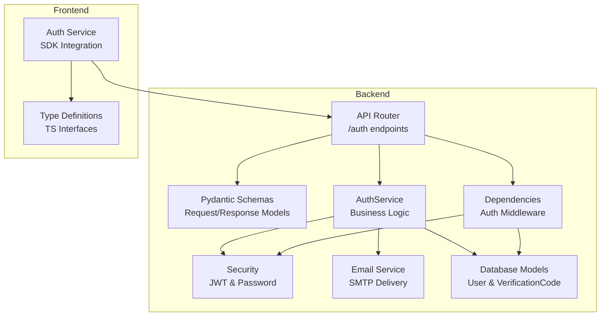
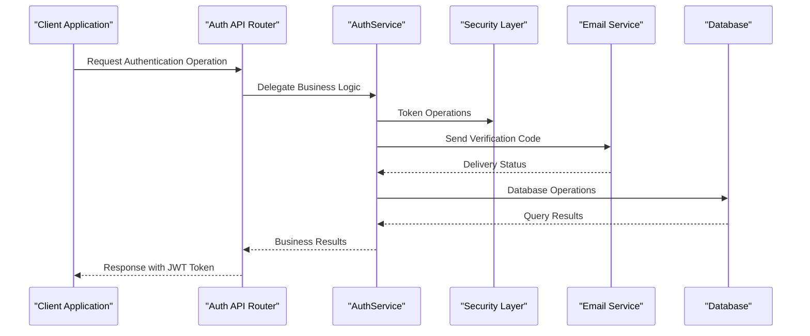
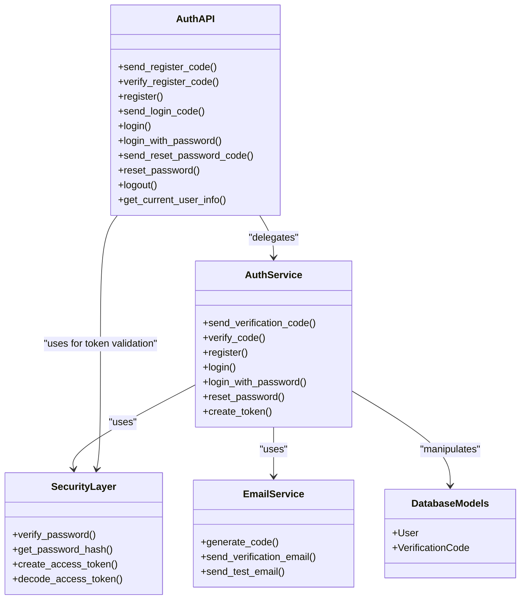
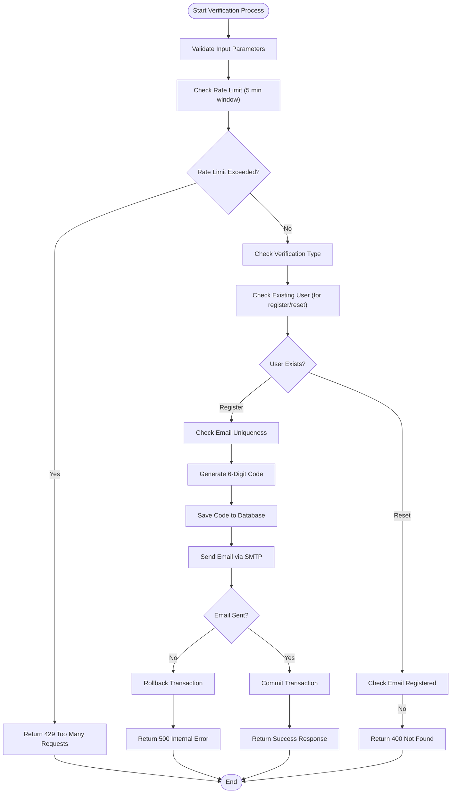

# Authentication Endpoints

<cite>
**Referenced Files in This Document**
- [auth.py](file://backend/app/api/v1/auth.py)
- [auth_schemas.py](file://backend/app/schemas/auth.py)
- [auth_service.py](file://backend/app/services/auth_service.py)
- [security.py](file://backend/app/core/security.py)
- [deps.py](file://backend/app/core/deps.py)
- [email_service.py](file://backend/app/services/email_service.py)
- [config.py](file://backend/app/core/config.py)
- [database_models.py](file://backend/app/models/database.py)
- [auth_frontend_service.ts](file://frontend/src/services/auth.service.ts)
- [auth_frontend_types.ts](file://frontend/src/types/auth.ts)
</cite>

## Table of Contents
1. [Introduction](#introduction)
2. [Project Structure](#project-structure)
3. [Core Components](#core-components)
4. [Architecture Overview](#architecture-overview)
5. [Detailed Component Analysis](#detailed-component-analysis)
6. [Dependency Analysis](#dependency-analysis)
7. [Performance Considerations](#performance-considerations)
8. [Troubleshooting Guide](#troubleshooting-guide)
9. [Conclusion](#conclusion)

## Introduction
This document provides comprehensive API documentation for the authentication system. It covers all authentication-related HTTP endpoints, including registration, login, password reset, logout, and user information retrieval. The documentation details HTTP methods, URL patterns, request/response schemas, authentication requirements, parameter validation rules, error handling, verification code system, JWT token generation, and session management. It also includes curl examples and SDK usage patterns for client integration.

## Project Structure
The authentication system is implemented in the backend using FastAPI and structured into several key components:
- API endpoints: Define HTTP routes and request/response handling
- Schemas: Define request/response data validation using Pydantic
- Services: Implement business logic for authentication operations
- Security: Handle JWT token creation/verification and password hashing
- Dependencies: Manage authentication middleware and user context
- Email service: Handle verification code delivery via email
- Database models: Define User and VerificationCode entities



**Diagram sources**
- [auth.py:22](file://backend/app/api/v1/auth.py#L22)
- [auth_service.py:16](file://backend/app/services/auth_service.py#L16)
- [security.py:43](file://backend/app/core/security.py#L43)
- [deps.py:18](file://backend/app/core/deps.py#L18)
- [email_service.py:25](file://backend/app/services/email_service.py#L25)
- [database_models.py:13](file://backend/app/models/database.py#L13)

**Section sources**
- [auth.py:1-316](file://backend/app/api/v1/auth.py#L1-L316)
- [auth_schemas.py:1-106](file://backend/app/schemas/auth.py#L1-L106)
- [auth_service.py:1-358](file://backend/app/services/auth_service.py#L1-L358)

## Core Components
The authentication system consists of several interconnected components that work together to provide secure user authentication:

### Request/Response Schemas
The system uses Pydantic models to define and validate all request and response data structures. These schemas ensure data integrity and provide automatic validation and serialization.

### Business Logic Layer
The AuthService class encapsulates all authentication-related business logic, including verification code generation, user registration, login operations, and password reset functionality.

### Security Layer
Handles JWT token creation and verification, password hashing using bcrypt, and token expiration management.

### Email Delivery
Manages SMTP-based email delivery for verification codes with support for both synchronous and asynchronous transmission methods.

**Section sources**
- [auth_schemas.py:10-106](file://backend/app/schemas/auth.py#L10-L106)
- [auth_service.py:16-358](file://backend/app/services/auth_service.py#L16-L358)
- [security.py:13-92](file://backend/app/core/security.py#L13-L92)
- [email_service.py:25-226](file://backend/app/services/email_service.py#L25-L226)

## Architecture Overview
The authentication system follows a layered architecture with clear separation of concerns:



**Diagram sources**
- [auth.py:25](file://backend/app/api/v1/auth.py#L25)
- [auth_service.py:19](file://backend/app/services/auth_service.py#L19)
- [security.py:43](file://backend/app/core/security.py#L43)
- [email_service.py:48](file://backend/app/services/email_service.py#L48)
- [database_models.py:13](file://backend/app/models/database.py#L13)

## Detailed Component Analysis

### Registration Endpoints

#### Send Registration Code (`POST /auth/register/send-code`)
Sends a 6-digit verification code to the user's email for registration.

**HTTP Method:** POST  
**URL Pattern:** `/auth/register/send-code`  
**Authentication:** No authentication required  

**Request Schema:**
- `email`: string (required) - User's email address
- `type`: string (optional) - Must be "register" if provided

**Response Schema:**
- `success`: boolean - Operation status
- `message`: string - Operation result message

**Validation Rules:**
- Email must be valid format
- Type field, if present, must equal "register"
- Rate limiting: Maximum 3 requests per 5 minutes per email

**Common Error Responses:**
- 400 Bad Request: Invalid email format, type mismatch, or rate limit exceeded
- 429 Too Many Requests: Exceeded rate limit

**Section sources**
- [auth.py:25](file://backend/app/api/v1/auth.py#L25-L53)
- [auth_schemas.py:10](file://backend/app/schemas/auth.py#L10-L18)
- [auth_service.py:19](file://backend/app/services/auth_service.py#L19-L98)

#### Verify Registration Code (`POST /auth/register/verify`)
Verifies a registration verification code without completing registration.

**HTTP Method:** POST  
**URL Pattern:** `/auth/register/verify`  
**Authentication:** No authentication required  

**Request Schema:**
- `email`: string (required) - User's email address
- `code`: string (required) - 6-digit verification code
- `type`: string (optional) - Must be "register" if provided

**Response Schema:**
- `success`: boolean - Operation status
- `message`: string - Operation result message

**Validation Rules:**
- Email must be valid format
- Code must be exactly 6 digits
- Type field, if present, must equal "register"
- Code must match unexpired, unused verification code

**Common Error Responses:**
- 400 Bad Request: Invalid code, expired code, or user already registered
- 429 Too Many Requests: Rate limit exceeded

**Section sources**
- [auth.py:56](file://backend/app/api/v1/auth.py#L56-L85)
- [auth_schemas.py:20](file://backend/app/schemas/auth.py#L20-L29)
- [auth_service.py:99](file://backend/app/services/auth_service.py#L99-L141)

#### Complete Registration (`POST /auth/register`)
Registers a new user account using email and password.

**HTTP Method:** POST  
**URL Pattern:** `/auth/register`  
**Authentication:** No authentication required  

**Request Schema:**
- `email`: string (required) - User's email address
- `code`: string (required) - 6-digit verification code
- `password`: string (required) - User's password (minimum 6 characters)
- `username`: string (optional) - User's display name

**Response Schema:**
- `access_token`: string - JWT access token
- `token_type`: string - Token type (always "bearer")
- `user`: object - User information (id, email, username, etc.)

**Validation Rules:**
- Email must be valid format
- Code must be exactly 6 digits
- Password must be at least 6 characters
- Username must be 50 characters or less
- Code must be verified and unexpired
- Email must not already exist

**Common Error Responses:**
- 400 Bad Request: Invalid input, expired code, or email already registered
- 429 Too Many Requests: Rate limit exceeded

**Section sources**
- [auth.py:88](file://backend/app/api/v1/auth.py#L88-L125)
- [auth_schemas.py:31](file://backend/app/schemas/auth.py#L31-L37)
- [auth_service.py:142](file://backend/app/services/auth_service.py#L142-L200)

### Login Endpoints

#### Send Login Code (`POST /auth/login/send-code`)
Sends a 6-digit verification code to the user's email for login.

**HTTP Method:** POST  
**URL Pattern:** `/auth/login/send-code`  
**Authentication:** No authentication required  

**Request Schema:**
- `email`: string (required) - User's email address
- `type`: string (optional) - Must be "login" if provided

**Response Schema:**
- `success`: boolean - Operation status
- `message`: string - Operation result message

**Validation Rules:**
- Email must be valid format
- Type field, if present, must equal "login"
- Rate limiting: Maximum 3 requests per 5 minutes per email

**Common Error Responses:**
- 400 Bad Request: Invalid email format or rate limit exceeded

**Section sources**
- [auth.py:128](file://backend/app/api/v1/auth.py#L128-L155)
- [auth_schemas.py:10](file://backend/app/schemas/auth.py#L10-L18)
- [auth_service.py:19](file://backend/app/services/auth_service.py#L19-L98)

#### Code-based Login (`POST /auth/login`)
Logs a user in using a verification code.

**HTTP Method:** POST  
**URL Pattern:** `/auth/login`  
**Authentication:** No authentication required  

**Request Schema:**
- `email`: string (required) - User's email address
- `code`: string (required) - 6-digit verification code

**Response Schema:**
- `access_token`: string - JWT access token
- `token_type`: string - Token type (always "bearer")
- `user`: object - User information (id, email, username, etc.)

**Validation Rules:**
- Email must be valid format
- Code must be exactly 6 digits
- Code must be verified and unexpired
- User must exist and be active

**Common Error Responses:**
- 400 Bad Request: Invalid code, expired code, or user not found

**Section sources**
- [auth.py:158](file://backend/app/api/v1/auth.py#L158-L188)
- [auth_schemas.py:39](file://backend/app/schemas/auth.py#L39-L43)
- [auth_service.py:202](file://backend/app/services/auth_service.py#L202-L251)

#### Password Login (`POST /auth/login/password`)
Logs a user in using email and password.

**HTTP Method:** POST  
**URL Pattern:** `/auth/login/password`  
**Authentication:** No authentication required  

**Request Schema:**
- `email`: string (required) - User's email address
- `password`: string (required) - User's password

**Response Schema:**
- `access_token`: string - JWT access token
- `token_type`: string - Token type (always "bearer")
- `user`: object - User information (id, email, username, etc.)

**Validation Rules:**
- Email must be valid format
- Password must be at least 6 characters
- User must exist and be active
- Password must match stored hash

**Common Error Responses:**
- 400 Bad Request: Invalid credentials or user not found

**Section sources**
- [auth.py:191](file://backend/app/api/v1/auth.py#L191-L220)
- [auth_schemas.py:45](file://backend/app/schemas/auth.py#L45-L49)
- [auth_service.py:253](file://backend/app/services/auth_service.py#L253-L286)

### Password Reset Endpoints

#### Send Reset Password Code (`POST /auth/reset-password/send-code`)
Sends a 6-digit verification code for password reset.

**HTTP Method:** POST  
**URL Pattern:** `/auth/reset-password/send-code`  
**Authentication:** No authentication required  

**Request Schema:**
- `email`: string (required) - User's email address
- `type`: string (optional) - Must be "reset" if provided

**Response Schema:**
- `success`: boolean - Operation status
- `message`: string - Operation result message

**Validation Rules:**
- Email must be valid format
- Type field, if present, must equal "reset"
- Rate limiting: Maximum 3 requests per 5 minutes per email
- User must already be registered

**Common Error Responses:**
- 400 Bad Request: Invalid email format, user not found, or rate limit exceeded

**Section sources**
- [auth.py:223](file://backend/app/api/v1/auth.py#L223-L250)
- [auth_schemas.py:10](file://backend/app/schemas/auth.py#L10-L18)
- [auth_service.py:19](file://backend/app/services/auth_service.py#L19-L98)

#### Reset Password (`POST /auth/reset-password`)
Resets a user's password using verification code.

**HTTP Method:** POST  
**URL Pattern:** `/auth/reset-password`  
**Authentication:** No authentication required  

**Request Schema:**
- `email`: string (required) - User's email address
- `code`: string (required) - 6-digit verification code
- `new_password`: string (required) - New password (minimum 6 characters)

**Response Schema:**
- `success`: boolean - Operation status
- `message`: string - Operation result message

**Validation Rules:**
- Email must be valid format
- Code must be exactly 6 digits
- New password must be at least 6 characters
- Code must be verified and unexpired
- User must exist

**Common Error Responses:**
- 400 Bad Request: Invalid code, expired code, or user not found

**Section sources**
- [auth.py:253](file://backend/app/api/v1/auth.py#L253-L275)
- [auth_schemas.py:91](file://backend/app/schemas/auth.py#L91-L96)
- [auth_service.py:288](file://backend/app/services/auth_service.py#L288-L340)

### Session Management

#### Logout (`POST /auth/logout`)
Logs out the current user.

**HTTP Method:** POST  
**URL Pattern:** `/auth/logout`  
**Authentication:** Bearer token required  

**Request Schema:** None  
**Response Schema:**
- `success`: boolean - Operation status
- `message`: string - Operation result message

**Authentication Requirements:**
- Requires valid JWT bearer token
- User must be active

**Common Error Responses:**
- 401 Unauthorized: Invalid or missing token
- 403 Forbidden: User disabled

**Section sources**
- [auth.py:278](file://backend/app/api/v1/auth.py#L278-L285)
- [deps.py:18](file://backend/app/core/deps.py#L18-L66)

#### Get Current User Info (`GET /auth/me`)
Retrieves the currently authenticated user's information.

**HTTP Method:** GET  
**URL Pattern:** `/auth/me`  
**Authentication:** Bearer token required  

**Request Schema:** None  
**Response Schema:**
- `id`: integer - User ID
- `email`: string - User's email
- `username`: string or null - User's display name
- `avatar_url`: string or null - Avatar URL
- `mbti`: string or null - MBTI personality type
- `social_style`: string or null - Social style
- `current_state`: string or null - Current state
- `catchphrases`: array or null - Catchphrases list
- `is_active`: boolean - Account activation status
- `is_verified`: boolean - Email verification status
- `created_at`: string - Account creation timestamp
- `updated_at`: string - Last update timestamp

**Authentication Requirements:**
- Requires valid JWT bearer token
- User must be active

**Common Error Responses:**
- 401 Unauthorized: Invalid or missing token
- 403 Forbidden: User disabled
- 400 Bad Request: User not activated

**Section sources**
- [auth.py:288](file://backend/app/api/v1/auth.py#L288-L295)
- [auth_schemas.py:58](file://backend/app/schemas/auth.py#L58-L72)
- [deps.py:69](file://backend/app/core/deps.py#L69-L89)

## Dependency Analysis



**Diagram sources**
- [auth.py:22](file://backend/app/api/v1/auth.py#L22)
- [auth_service.py:16](file://backend/app/services/auth_service.py#L16)
- [security.py:13](file://backend/app/core/security.py#L13)
- [email_service.py:25](file://backend/app/services/email_service.py#L25)
- [database_models.py:13](file://backend/app/models/database.py#L13)

### Verification Code System

The verification code system implements a comprehensive security mechanism:



**Diagram sources**
- [auth_service.py:19](file://backend/app/services/auth_service.py#L19-L98)
- [email_service.py:48](file://backend/app/services/email_service.py#L48-L155)

**Section sources**
- [auth_service.py:19-98](file://backend/app/services/auth_service.py#L19-L98)
- [email_service.py:36](file://backend/app/services/email_service.py#L36-L47)

### JWT Token Generation and Management

The system uses JWT tokens for session management with the following characteristics:

**Token Structure:**
- Subject (sub): User ID as string
- Email: User's email address
- Expiration: 7 days by default (configurable)

**Token Creation Process:**
1. Validate user credentials or verification code
2. Create token payload with user data
3. Encode with HS256 algorithm using configured secret key
4. Set expiration time (default 7 days)

**Token Validation:**
- Decode JWT using configured secret key
- Verify algorithm matches configuration
- Check expiration timestamp
- Load user from database using user ID

**Section sources**
- [auth_service.py:342](file://backend/app/services/auth_service.py#L342-L353)
- [security.py:43](file://backend/app/core/security.py#L43-L70)
- [security.py:73](file://backend/app/core/security.py#L73-L92)
- [config.py:28](file://backend/app/core/config.py#L28-L37)

## Performance Considerations
The authentication system implements several performance optimizations:

### Rate Limiting
- 5-minute sliding window for verification code requests
- Maximum 3 requests per email per 5-minute period
- Prevents abuse and spam attacks

### Database Optimization
- Proper indexing on email fields for quick lookups
- Efficient query patterns using SQLAlchemy ORM
- Transaction management to prevent race conditions

### Email Delivery
- Asynchronous SMTP support with fallback to synchronous
- Connection pooling and efficient resource management
- Retry mechanisms for failed deliveries

### Token Management
- Lightweight JWT tokens with minimal payload
- Efficient token validation without database queries
- Configurable expiration times for optimal security/performance balance

## Troubleshooting Guide

### Common Authentication Issues

**Verification Code Problems:**
- **Issue**: Code not received via email
  - **Cause**: SMTP configuration issues or email provider problems
  - **Solution**: Check SMTP settings, verify email provider configuration, test with `/auth/test-email` endpoint

**Rate Limit Exceeded:**
- **Issue**: Receiving 429 Too Many Requests
  - **Cause**: Too many verification code requests within 5-minute window
  - **Solution**: Wait for rate limit to reset or reduce request frequency

**Expired Verification Codes:**
- **Issue**: Code validation fails with "expired" message
  - **Cause**: Code exceeded 5-minute validity period
  - **Solution**: Request a new verification code

**Invalid Credentials:**
- **Issue**: Login fails with invalid credentials
  - **Cause**: Wrong email/password combination or disabled user account
  - **Solution**: Verify credentials or contact support

**Token Validation Errors:**
- **Issue**: 401 Unauthorized on protected endpoints
  - **Cause**: Invalid, expired, or malformed JWT token
  - **Solution**: Re-authenticate to obtain new token

### Client Integration Examples

**Frontend SDK Usage:**
The frontend provides a comprehensive authentication service with TypeScript interfaces:

```typescript
// Example: Complete registration flow
const registerUser = async (email: string, password: string) => {
  // Step 1: Send verification code
  await authService.sendRegisterCode(email);
  
  // Step 2: Verify code (client receives code via email)
  const verificationResult = await authService.verifyRegisterCode({
    email,
    code: receivedCode,
    type: 'register'
  });
  
  // Step 3: Complete registration
  const loginResult = await authService.register({
    email,
    password,
    code: receivedCode,
    username: displayName
  });
  
  // Store token in local storage
  localStorage.setItem('access_token', loginResult.access_token);
  return loginResult.user;
};
```

**Curl Examples:**

```bash
# Send registration code
curl -X POST "http://localhost:8000/api/v1/auth/register/send-code" \
  -H "Content-Type: application/json" \
  -d '{"email":"user@example.com","type":"register"}'

# Verify registration code
curl -X POST "http://localhost:8000/api/v1/auth/register/verify" \
  -H "Content-Type: application/json" \
  -d '{"email":"user@example.com","code":"123456","type":"register"}'

# Complete registration
curl -X POST "http://localhost:8000/api/v1/auth/register" \
  -H "Content-Type: application/json" \
  -d '{"email":"user@example.com","password":"securepassword","code":"123456"}'

# Login with verification code
curl -X POST "http://localhost:8000/api/v1/auth/login" \
  -H "Content-Type: application/json" \
  -d '{"email":"user@example.com","code":"123456"}'

# Login with password
curl -X POST "http://localhost:8000/api/v1/auth/login/password" \
  -H "Content-Type: application/json" \
  -d '{"email":"user@example.com","password":"securepassword"}'

# Get current user info (requires Bearer token)
curl -X GET "http://localhost:8000/api/v1/auth/me" \
  -H "Authorization: Bearer YOUR_ACCESS_TOKEN"
```

**Section sources**
- [auth_frontend_service.ts:11](file://frontend/src/services/auth.service.ts#L11-L99)
- [auth_frontend_types.ts:3](file://frontend/src/types/auth.ts#L3-L45)

## Conclusion
The authentication system provides a comprehensive, secure, and user-friendly authentication solution with the following key features:

- **Multi-factor Authentication**: Supports both verification code and password-based login methods
- **Robust Security**: Implements rate limiting, secure password hashing, and JWT token management
- **Flexible Verification System**: Comprehensive verification code system with configurable expiration and rate limits
- **Developer-Friendly**: Well-documented APIs with clear request/response schemas and comprehensive error handling
- **Production Ready**: Includes proper database transactions, email delivery, and security best practices

The system balances security requirements with usability, providing multiple authentication pathways while maintaining strong security controls. The modular architecture allows for easy maintenance and extension of authentication features as requirements evolve.