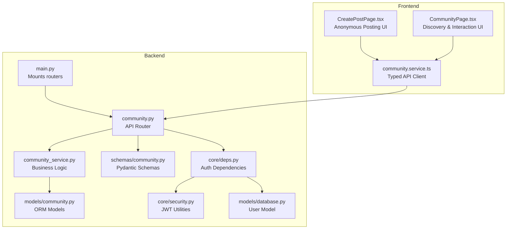
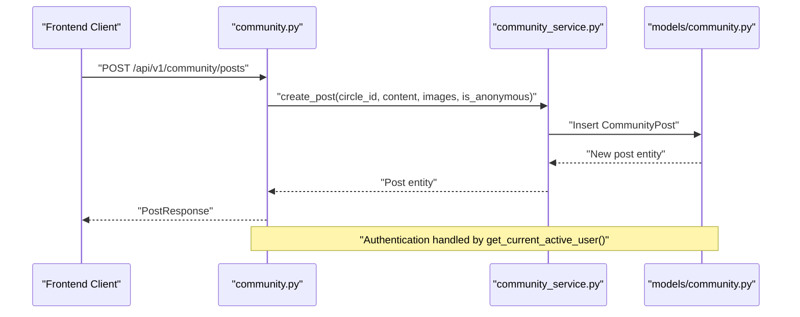
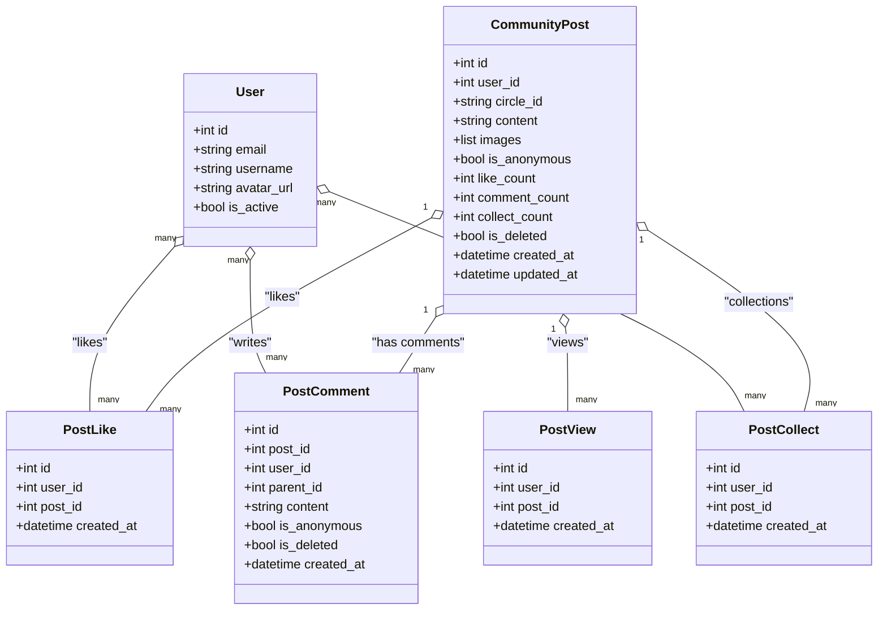
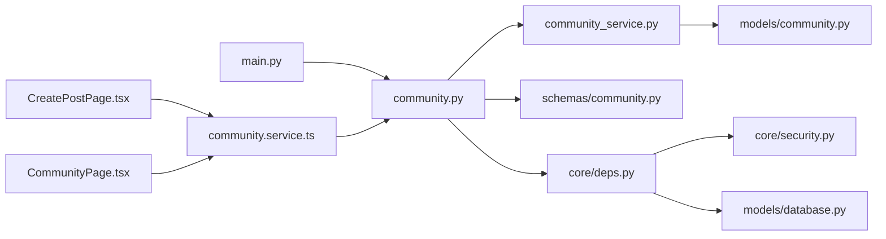

# Community Endpoints

<cite>
**Referenced Files in This Document**
- [community.py](file://backend/app/api/v1/community.py)
- [community_service.py](file://backend/app/services/community_service.py)
- [community.py](file://backend/app/models/community.py)
- [community.py](file://backend/app/schemas/community.py)
- [deps.py](file://backend/app/core/deps.py)
- [security.py](file://backend/app/core/security.py)
- [database.py](file://backend/app/models/database.py)
- [main.py](file://backend/main.py)
- [community.service.ts](file://frontend/src/services/community.service.ts)
- [CreatePostPage.tsx](file://frontend/src/pages/community/CreatePostPage.tsx)
- [CommunityPage.tsx](file://frontend/src/pages/community/CommunityPage.tsx)
</cite>

## Table of Contents
1. [Introduction](#introduction)
2. [Project Structure](#project-structure)
3. [Core Components](#core-components)
4. [Architecture Overview](#architecture-overview)
5. [Detailed Component Analysis](#detailed-component-analysis)
6. [Dependency Analysis](#dependency-analysis)
7. [Performance Considerations](#performance-considerations)
8. [Troubleshooting Guide](#troubleshooting-guide)
9. [Conclusion](#conclusion)

## Introduction
This document provides comprehensive API documentation for the community platform endpoints. It covers post management (creation, listing, detail viewing, editing, deletion), interactions (likes, collections), comments, image uploads, and user-specific views (my posts, collections, history). It also documents anonymous posting capabilities, content moderation considerations, user interaction tracking, and ranking-related configurations present in the system.

## Project Structure
The community API is implemented as a FastAPI router under `/api/v1/community` and is mounted into the main application. The backend consists of:
- API router: defines endpoints and request/response schemas
- Services: encapsulates business logic (CRUD, likes, collections, comments, views)
- Models: SQLAlchemy ORM definitions for posts, comments, likes, collections, and views
- Schemas: Pydantic models for request/response validation
- Frontend service: typed client wrappers for all community endpoints

**Diagram sources**
- [main.py:74-76](file://backend/main.py#L74-L76)
- [community.py:20](file://backend/app/api/v1/community.py#L20)
- [community_service.py:13](file://backend/app/services/community_service.py#L13)
- [community.py:23](file://backend/app/models/community.py#L23)
- [community.py:11](file://backend/app/schemas/community.py#L11)
- [deps.py:18](file://backend/app/core/deps.py#L18)
- [security.py:73](file://backend/app/core/security.py#L73)
- [database.py:13](file://backend/app/models/database.py#L13)
- [community.service.ts:70](file://frontend/src/services/community.service.ts#L70)
- [CreatePostPage.tsx:65](file://frontend/src/pages/community/CreatePostPage.tsx#L65)
- [CommunityPage.tsx:50](file://frontend/src/pages/community/CommunityPage.tsx#L50)

**Section sources**
- [main.py:74-76](file://backend/main.py#L74-L76)
- [community.py:20](file://backend/app/api/v1/community.py#L20)

## Core Components
- Authentication and Authorization
  - All endpoints require a valid Bearer token via HTTP Bearer scheme.
  - The dependency enforces active user status and validates JWT tokens.
- Request/Response Schemas
  - Pydantic models define strict validation for requests and responses.
- Business Logic
  - CommunityService handles all CRUD operations, interactions, and derived computations.
- Data Models
  - SQLAlchemy models represent posts, comments, likes, collections, and views.

**Section sources**
- [deps.py:18](file://backend/app/core/deps.py#L18)
- [security.py:73](file://backend/app/core/security.py#L73)
- [community.py:11](file://backend/app/schemas/community.py#L11)
- [community_service.py:13](file://backend/app/services/community_service.py#L13)
- [community.py:23](file://backend/app/models/community.py#L23)

## Architecture Overview
The community API follows a layered architecture:
- API Layer: FastAPI router with dependency injection for authentication and database sessions
- Service Layer: Centralized business logic with transaction boundaries
- Persistence Layer: SQLAlchemy ORM with explicit queries and constraints
- Presentation Layer: Frontend service wrappers and UI components

**Diagram sources**
- [community.py:39](file://backend/app/api/v1/community.py#L39)
- [community_service.py:36](file://backend/app/services/community_service.py#L36)
- [community.py:23](file://backend/app/models/community.py#L23)

## Detailed Component Analysis

### Authentication and Authorization
- Requirement: All endpoints require a valid Bearer token.
- Validation: Token decoding, user lookup, and active status checks.
- Active User Enforcement: Additional guard ensures the user is active.

**Section sources**
- [deps.py:18](file://backend/app/core/deps.py#L18)
- [deps.py:69](file://backend/app/core/deps.py#L69)
- [security.py:73](file://backend/app/core/security.py#L73)
- [database.py:13](file://backend/app/models/database.py#L13)

### Post Management Endpoints

#### Create Post
- Method: POST
- URL: `/api/v1/community/posts`
- Authentication: Required
- Request Schema: PostCreate
  - circle_id: string (valid values: anxiety, sadness, growth, peace, confusion)
  - content: string (length 1-5000)
  - images: array of URLs (optional)
  - is_anonymous: boolean (default false)
- Response Schema: PostResponse
- Behavior:
  - Validates circle_id against predefined list
  - Supports anonymous posting
  - Returns constructed PostResponse with counts and flags

**Section sources**
- [community.py:39](file://backend/app/api/v1/community.py#L39)
- [community.py:40](file://backend/app/api/v1/community.py#L40)
- [community.py:12](file://backend/app/schemas/community.py#L12)
- [community_service.py:36](file://backend/app/services/community_service.py#L36)
- [community_service.py:42](file://backend/app/services/community_service.py#L42)

#### List Posts
- Method: GET
- URL: `/api/v1/community/posts`
- Authentication: Required
- Query Parameters:
  - circle_id: optional string filter
  - page: integer ≥ 1
  - page_size: integer between 1 and 50
- Response Schema: PostListResponse
  - items: array of PostResponse
  - total, page, page_size, total_pages

**Section sources**
- [community.py:59](file://backend/app/api/v1/community.py#L59)
- [community.py:60](file://backend/app/api/v1/community.py#L60)
- [community.py:53](file://backend/app/schemas/community.py#L53)
- [community_service.py:68](file://backend/app/services/community_service.py#L68)

#### Get My Posts
- Method: GET
- URL: `/api/v1/community/posts/mine`
- Authentication: Required
- Query Parameters: page, page_size (same constraints as list posts)
- Response Schema: PostListResponse

**Section sources**
- [community.py:82](file://backend/app/api/v1/community.py#L82)
- [community_service.py:95](file://backend/app/services/community_service.py#L95)

#### Get Post Detail
- Method: GET
- URL: `/api/v1/community/posts/{post_id}`
- Authentication: Required
- Path Parameter: post_id (integer)
- Response Schema: PostResponse
- Behavior:
  - Records a view for the post (per user per visit)
  - Builds enriched response with author info and interaction flags

**Section sources**
- [community.py:104](file://backend/app/api/v1/community.py#L104)
- [community.py:105](file://backend/app/api/v1/community.py#L105)
- [community_service.py:309](file://backend/app/services/community_service.py#L309)
- [community_service.py:354](file://backend/app/services/community_service.py#L354)

#### Update Post
- Method: PUT
- URL: `/api/v1/community/posts/{post_id}`
- Authentication: Required
- Path Parameter: post_id
- Request Schema: PostUpdate
  - content: optional string (length 1-5000)
  - images: optional array of URLs
- Behavior:
  - Enforces ownership and non-anonymous constraint
  - Returns updated PostResponse

**Section sources**
- [community.py:122](file://backend/app/api/v1/community.py#L122)
- [community.py:123](file://backend/app/api/v1/community.py#L123)
- [community.py:20](file://backend/app/schemas/community.py#L20)
- [community_service.py:119](file://backend/app/services/community_service.py#L119)
- [community_service.py:123](file://backend/app/services/community_service.py#L123)

#### Delete Post
- Method: DELETE
- URL: `/api/v1/community/posts/{post_id}`
- Authentication: Required
- Path Parameter: post_id
- Behavior:
  - Soft-deletes by setting is_deleted flag
  - Returns success message

**Section sources**
- [community.py:145](file://backend/app/api/v1/community.py#L145)
- [community.py:146](file://backend/app/api/v1/community.py#L146)
- [community_service.py:137](file://backend/app/services/community_service.py#L137)

### Comments Endpoints

#### Create Comment
- Method: POST
- URL: `/api/v1/community/posts/{post_id}/comments`
- Authentication: Required
- Path Parameter: post_id
- Request Schema: CommentCreate
  - content: string (length 1-2000)
  - parent_id: optional integer (reply to another comment)
  - is_anonymous: boolean
- Response Schema: CommentResponse

**Section sources**
- [community.py:193](file://backend/app/api/v1/community.py#L193)
- [community.py:194](file://backend/app/api/v1/community.py#L194)
- [community.py:64](file://backend/app/schemas/community.py#L64)
- [community_service.py:148](file://backend/app/services/community_service.py#L148)

#### List Comments
- Method: GET
- URL: `/api/v1/community/posts/{post_id}/comments`
- Authentication: Required
- Path Parameter: post_id
- Response Schema: CommentListResponse

**Section sources**
- [community.py:213](file://backend/app/api/v1/community.py#L213)
- [community.py:214](file://backend/app/api/v1/community.py#L214)
- [community.py:92](file://backend/app/schemas/community.py#L92)
- [community_service.py:172](file://backend/app/services/community_service.py#L172)

#### Delete Comment
- Method: DELETE
- URL: `/api/v1/community/comments/{comment_id}`
- Authentication: Required
- Path Parameter: comment_id
- Behavior:
  - Soft-deletes by setting is_deleted flag
  - Updates post comment_count

**Section sources**
- [community.py:230](file://backend/app/api/v1/community.py#L230)
- [community.py:231](file://backend/app/api/v1/community.py#L231)
- [community_service.py:192](file://backend/app/services/community_service.py#L192)

### Interactions Endpoints

#### Toggle Like
- Method: POST
- URL: `/api/v1/community/posts/{post_id}/like`
- Authentication: Required
- Path Parameter: post_id
- Response: { liked: boolean }

**Section sources**
- [community.py:245](file://backend/app/api/v1/community.py#L245)
- [community.py:246](file://backend/app/api/v1/community.py#L246)
- [community_service.py:213](file://backend/app/services/community_service.py#L213)

#### Toggle Collect
- Method: POST
- URL: `/api/v1/community/posts/{post_id}/collect`
- Authentication: Required
- Path Parameter: post_id
- Response: { collected: boolean }

**Section sources**
- [community.py:261](file://backend/app/api/v1/community.py#L261)
- [community.py:262](file://backend/app/api/v1/community.py#L262)
- [community_service.py:248](file://backend/app/services/community_service.py#L248)

#### List Collections
- Method: GET
- URL: `/api/v1/community/collections`
- Authentication: Required
- Query Parameters: page, page_size
- Response Schema: PostListResponse

**Section sources**
- [community.py:275](file://backend/app/api/v1/community.py#L275)
- [community.py:276](file://backend/app/api/v1/community.py#L276)
- [community_service.py:281](file://backend/app/services/community_service.py#L281)

### Image Upload Endpoint

#### Upload Community Image
- Method: POST
- URL: `/api/v1/community/upload-image`
- Authentication: Required
- Form Data: file (allowed types: jpeg, png, gif, webp; max size: 10MB)
- Response: { url: string }

**Section sources**
- [community.py:160](file://backend/app/api/v1/community.py#L160)
- [community.py:161](file://backend/app/api/v1/community.py#L161)

### User Views Endpoints

#### Get View History
- Method: GET
- URL: `/api/v1/community/history`
- Authentication: Required
- Query Parameters: page, page_size
- Response Schema: ViewHistoryResponse
  - items: array of { post: PostResponse, viewed_at: datetime }

**Section sources**
- [community.py:299](file://backend/app/api/v1/community.py#L299)
- [community.py:300](file://backend/app/api/v1/community.py#L300)
- [community.py:117](file://backend/app/schemas/community.py#L117)
- [community_service.py:315](file://backend/app/services/community_service.py#L315)

### Collection Management
- Collections are managed via toggle collect and list collections endpoints.
- The service joins post_collects with community_posts to fetch user collections.

**Section sources**
- [community.py:261](file://backend/app/api/v1/community.py#L261)
- [community.py:275](file://backend/app/api/v1/community.py#L275)
- [community_service.py:281](file://backend/app/services/community_service.py#L281)

### Content Discovery
- Discovery is achieved via list posts with optional circle_id filtering.
- The frontend loads circles and applies filters to narrow content.

**Section sources**
- [community.py:59](file://backend/app/api/v1/community.py#L59)
- [community.py:30](file://backend/app/api/v1/community.py#L30)
- [community.service.ts:72](file://frontend/src/services/community.service.ts#L72)
- [CommunityPage.tsx:42](file://frontend/src/pages/community/CommunityPage.tsx#L42)

### Anonymous Posting Capabilities
- Posts support is_anonymous flag during creation.
- Anonymous posts cannot be edited later.
- Author info is omitted in responses when is_anonymous is true.

**Section sources**
- [community.py:12](file://backend/app/schemas/community.py#L12)
- [community_service.py:127](file://backend/app/services/community_service.py#L127)
- [community_service.py:358](file://backend/app/services/community_service.py#L358)
- [CreatePostPage.tsx:65](file://frontend/src/pages/community/CreatePostPage.tsx#L65)

### Ranking Algorithms
- Ranking formula is configured in the AI module for related features.
- Formula includes bm25, recency, importance, emotion intensity, repetition, people hit.

**Section sources**
- [ai.py:399](file://backend/app/api/v1/ai.py#L399)

### Data Models and Relationships

**Diagram sources**
- [community.py:23](file://backend/app/models/community.py#L23)
- [community.py:60](file://backend/app/models/community.py#L60)
- [community.py:94](file://backend/app/models/community.py#L94)
- [community.py:123](file://backend/app/models/community.py#L123)
- [community.py:152](file://backend/app/models/community.py#L152)
- [database.py:13](file://backend/app/models/database.py#L13)

## Dependency Analysis

**Diagram sources**
- [community.py:16](file://backend/app/api/v1/community.py#L16)
- [community_service.py:9](file://backend/app/services/community_service.py#L9)
- [community.py:23](file://backend/app/models/community.py#L23)
- [community.py:11](file://backend/app/schemas/community.py#L11)
- [deps.py:18](file://backend/app/core/deps.py#L18)
- [security.py:73](file://backend/app/core/security.py#L73)
- [database.py:13](file://backend/app/models/database.py#L13)
- [main.py:74](file://backend/main.py#L74)
- [community.service.ts:70](file://frontend/src/services/community.service.ts#L70)
- [CreatePostPage.tsx:65](file://frontend/src/pages/community/CreatePostPage.tsx#L65)
- [CommunityPage.tsx:50](file://frontend/src/pages/community/CommunityPage.tsx#L50)

**Section sources**
- [community.py:16](file://backend/app/api/v1/community.py#L16)
- [community_service.py:9](file://backend/app/services/community_service.py#L9)
- [deps.py:18](file://backend/app/core/deps.py#L18)
- [main.py:74](file://backend/main.py#L74)

## Performance Considerations
- Pagination: All list endpoints support page/page_size with upper bounds to prevent heavy queries.
- Indexes: Key fields (user_id, post_id, circle_id) are indexed to optimize filtering and joins.
- Counters: Like/comment/collect counts are maintained in the post entity to avoid expensive subqueries in listing contexts.
- Asynchronous Operations: SQLAlchemy async session usage supports concurrent operations.

[No sources needed since this section provides general guidance]

## Troubleshooting Guide

### Common HTTP Errors
- 401 Unauthorized: Invalid or missing Bearer token; verify token validity and expiration.
- 403 Forbidden: User account is inactive or forbidden by policy.
- 404 Not Found: Resource does not exist or was soft-deleted.
- 400 Bad Request: Validation errors (e.g., invalid circle_id, content length limits, unsupported image types).

### Error Scenarios and Handling
- Post creation/validation failures: Raised as ValueError and converted to 400 responses.
- Update anonymous post: Explicitly blocked; returns 400 with error message.
- Delete unauthorized resource: Returns 404 when post does not belong to user.
- Comment operations: Soft-delete sets is_deleted flag and adjusts counters.

**Section sources**
- [community.py:52](file://backend/app/api/v1/community.py#L52)
- [community.py:135](file://backend/app/api/v1/community.py#L135)
- [community.py:153](file://backend/app/api/v1/community.py#L153)
- [community.py:206](file://backend/app/api/v1/community.py#L206)
- [community_service.py:127](file://backend/app/services/community_service.py#L127)
- [community_service.py:192](file://backend/app/services/community_service.py#L192)

## Conclusion
The community API provides a robust, authenticated foundation for content creation, discovery, and interaction. It supports anonymous posting, structured moderation-friendly patterns (soft deletes, counters), and scalable pagination. The frontend integrates seamlessly with typed service wrappers, enabling rich user experiences across posts, comments, likes, collections, and browsing history.