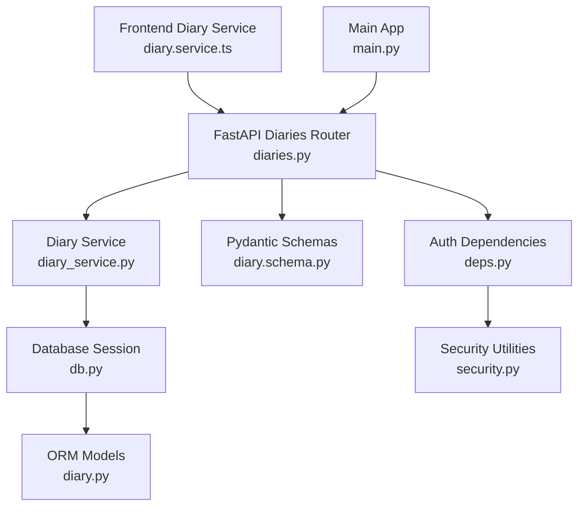
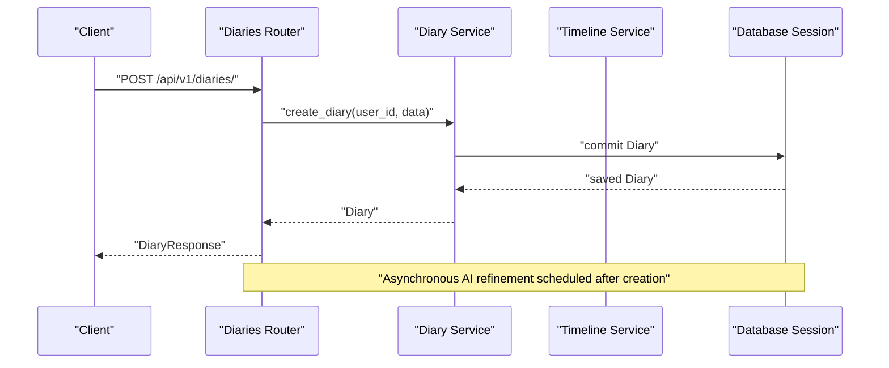
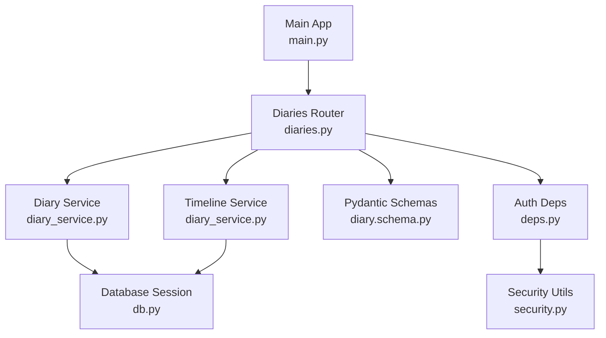

# Diary Management Endpoints

<cite>
**Referenced Files in This Document**
- [main.py](file://backend/main.py)
- [diaries.py](file://backend/app/api/v1/diaries.py)
- [diary_service.py](file://backend/app/services/diary_service.py)
- [diary.py](file://backend/app/models/diary.py)
- [diary.schema.py](file://backend/app/schemas/diary.py)
- [deps.py](file://backend/app/core/deps.py)
- [security.py](file://backend/app/core/security.py)
- [db.py](file://backend/app/db.py)
- [config.py](file://backend/app/core/config.py)
- [diary.service.ts](file://frontend/src/services/diary.service.ts)
- [diary.types.ts](file://frontend/src/types/diary.ts)
</cite>

## Table of Contents
1. [Introduction](#introduction)
2. [Project Structure](#project-structure)
3. [Core Components](#core-components)
4. [Architecture Overview](#architecture-overview)
5. [Detailed Component Analysis](#detailed-component-analysis)
6. [Dependency Analysis](#dependency-analysis)
7. [Performance Considerations](#performance-considerations)
8. [Troubleshooting Guide](#troubleshooting-guide)
9. [Conclusion](#conclusion)

## Introduction
This document provides comprehensive API documentation for diary management endpoints in the application. It covers all CRUD operations for diary entries, timeline-related endpoints for period queries and event extraction, authentication requirements, parameter validation, rich text content handling, image upload integration, emotion tagging, and timeline event processing. Examples of diary content structure, metadata handling, and temporal queries are included, along with error handling patterns for validation errors, permission issues, and database operations.

## Project Structure
The diary management functionality is implemented in the backend FastAPI application under the `/api/v1/diaries` route prefix. The frontend service layer consumes these endpoints via a dedicated diary service. Authentication is enforced using bearer tokens.

**Diagram sources**
- [main.py:63-64](file://backend/main.py#L63-L64)
- [diaries.py:29](file://backend/app/api/v1/diaries.py#L29)
- [diary_service.py:66](file://backend/app/services/diary_service.py#L66)
- [diary.py:29](file://backend/app/models/diary.py#L29)
- [diary.schema.py:9](file://backend/app/schemas/diary.py#L9)
- [deps.py:18](file://backend/app/core/deps.py#L18)
- [security.py:43](file://backend/app/core/security.py#L43)
- [db.py:31](file://backend/app/db.py#L31)

**Section sources**
- [main.py:63-64](file://backend/main.py#L63-L64)
- [diaries.py:29](file://backend/app/api/v1/diaries.py#L29)

## Core Components
- FastAPI Router: Exposes diary CRUD and timeline endpoints under `/api/v1/diaries`.
- Diary Service: Implements business logic for diary operations and timeline event generation.
- ORM Models: Define Diary, TimelineEvent, AIAnalysis, SocialPostSample, and GrowthDailyInsight tables.
- Pydantic Schemas: Define request/response models for diary and timeline event data.
- Authentication: Requires a valid bearer token via HTTP Bearer scheme.

Key responsibilities:
- Validate and transform requests using Pydantic schemas.
- Enforce per-user isolation and ownership checks.
- Support pagination, filtering, and temporal queries.
- Handle image uploads and return URLs.
- Generate timeline events from diary content and refine them with AI.

**Section sources**
- [diaries.py:55-182](file://backend/app/api/v1/diaries.py#L55-L182)
- [diary_service.py:66](file://backend/app/services/diary_service.py#L66)
- [diary.py:29](file://backend/app/models/diary.py#L29)
- [diary.schema.py:9](file://backend/app/schemas/diary.py#L9)
- [deps.py:18](file://backend/app/core/deps.py#L18)

## Architecture Overview
The API follows a layered architecture:
- Presentation Layer: FastAPI endpoints handle HTTP requests and responses.
- Business Logic Layer: Services encapsulate domain logic and orchestrate operations.
- Persistence Layer: SQLAlchemy ORM models and async sessions manage data access.
- Authentication Layer: Bearer token validation ensures secure access.

**Diagram sources**
- [diaries.py:55-74](file://backend/app/api/v1/diaries.py#L55-L74)
- [diary_service.py:69-105](file://backend/app/services/diary_service.py#L69-L105)

**Section sources**
- [diaries.py:55-74](file://backend/app/api/v1/diaries.py#L55-L74)
- [diary_service.py:69-105](file://backend/app/services/diary_service.py#L69-L105)

## Detailed Component Analysis

### Authentication and Authorization
- Authentication method: HTTP Bearer token.
- Dependency injection enforces active user validation.
- Token decoding uses application settings for secret key and algorithm.
- Per-request user isolation ensures data privacy.

Implementation highlights:
- Bearer security scheme configured globally.
- Current user retrieval validates token and loads user record.
- Active user check prevents access for disabled accounts.

**Section sources**
- [deps.py:18](file://backend/app/core/deps.py#L18)
- [deps.py:69](file://backend/app/core/deps.py#L69)
- [security.py:73](file://backend/app/core/security.py#L73)
- [config.py:28](file://backend/app/core/config.py#L28)

### Diary CRUD Endpoints

#### Create Diary
- Method: POST
- URL: `/api/v1/diaries/`
- Authentication: Required (Bearer)
- Request body: DiaryCreate schema
- Response: DiaryResponse
- Validation:
  - Content required and non-empty.
  - Default date set to today if not provided.
  - Importance score range 1–10.
  - Optional title, emotion_tags, images.
- Behavior:
  - Calculates word count from content.
  - Stores content and optional HTML representation.
  - Asynchronous AI refinement task scheduled after creation.

Example request body (paths only):
- [diary.schema.py:9](file://backend/app/schemas/diary.py#L9)

Example response body (paths only):
- [diary.schema.py:46](file://backend/app/schemas/diary.py#L46)

**Section sources**
- [diaries.py:55-74](file://backend/app/api/v1/diaries.py#L55-L74)
- [diary.schema.py:9](file://backend/app/schemas/diary.py#L9)
- [diary.schema.py:46](file://backend/app/schemas/diary.py#L46)
- [diary_service.py:69-105](file://backend/app/services/diary_service.py#L69-L105)

#### List Diaries (Paginated)
- Method: GET
- URL: `/api/v1/diaries/`
- Authentication: Required (Bearer)
- Query parameters:
  - page (default 1, ge 1)
  - page_size (default 20, range 1–100)
  - start_date (optional)
  - end_date (optional)
  - emotion_tag (optional)
- Response: DiaryListResponse
- Filtering:
  - Date range filters applied.
  - Emotion tag filter uses array containment.
- Sorting:
  - By diary_date descending, then created_at descending.

Example response body (paths only):
- [diary.schema.py:66](file://backend/app/schemas/diary.py#L66)

**Section sources**
- [diaries.py:76-109](file://backend/app/api/v1/diaries.py#L76-L109)
- [diary.schema.py:66](file://backend/app/schemas/diary.py#L66)
- [diary_service.py:134-186](file://backend/app/services/diary_service.py#L134-L186)

#### Get Diary by ID
- Method: GET
- URL: `/api/v1/diaries/{diary_id}`
- Authentication: Required (Bearer)
- Path parameter: diary_id (integer)
- Response: DiaryResponse
- Error: 404 Not Found if diary does not exist or belongs to another user.

**Section sources**
- [diaries.py:112-129](file://backend/app/api/v1/diaries.py#L112-L129)
- [diary_service.py:107-132](file://backend/app/services/diary_service.py#L107-L132)

#### Update Diary
- Method: PUT
- URL: `/api/v1/diaries/{diary_id}`
- Authentication: Required (Bearer)
- Path parameter: diary_id (integer)
- Request body: DiaryUpdate schema (partial updates supported)
- Response: DiaryResponse
- Validation:
  - Content length constraints if provided.
  - Importance score range 1–10 if provided.
- Behavior:
  - Recalculates word count if content updated.
  - Returns updated diary object.

**Section sources**
- [diaries.py:132-158](file://backend/app/api/v1/diaries.py#L132-L158)
- [diary.schema.py:35](file://backend/app/schemas/diary.py#L35)
- [diary_service.py:188-224](file://backend/app/services/diary_service.py#L188-L224)

#### Delete Diary
- Method: DELETE
- URL: `/api/v1/diaries/{diary_id}`
- Authentication: Required (Bearer)
- Path parameter: diary_id (integer)
- Response: Success message object
- Error: 404 Not Found if diary does not exist.

**Section sources**
- [diaries.py:161-182](file://backend/app/api/v1/diaries.py#L161-L182)
- [diary_service.py:226-251](file://backend/app/services/diary_service.py#L226-L251)

#### Get Diaries by Date
- Method: GET
- URL: `/api/v1/diaries/date/{target_date}`
- Authentication: Required (Bearer)
- Path parameter: target_date (date)
- Response: Array of DiaryResponse
- Sorting: By created_at descending.

**Section sources**
- [diaries.py:185-200](file://backend/app/api/v1/diaries.py#L185-L200)
- [diary_service.py:253-278](file://backend/app/services/diary_service.py#L253-L278)

### Image Upload Endpoint
- Method: POST
- URL: `/api/v1/diaries/upload-image`
- Authentication: Required (Bearer)
- Form-data:
  - file: multipart file (allowed types: jpeg, png, gif, webp)
  - Max size: 10MB
- Response: Object containing uploaded image URL
- Storage:
  - Files saved under backend/uploads/diary_images with unique filenames.

Validation rules:
- Content-type restriction.
- Size limit enforcement.
- Safe filename generation.

**Section sources**
- [diaries.py:205-238](file://backend/app/api/v1/diaries.py#L205-L238)

### Timeline Endpoints

#### Get Recent Timeline Events
- Method: GET
- URL: `/api/v1/diaries/timeline/recent`
- Authentication: Required (Bearer)
- Query parameters:
  - days (default 7, range 1–30)
- Response: Array of TimelineEventResponse

**Section sources**
- [diaries.py:243-258](file://backend/app/api/v1/diaries.py#L243-L258)
- [diary_service.py:605-631](file://backend/app/services/diary_service.py#L605-L631)

#### Get Timeline Events by Date Range
- Method: GET
- URL: `/api/v1/diaries/timeline/range`
- Authentication: Required (Bearer)
- Query parameters:
  - start_date (required)
  - end_date (optional)
  - limit (default 100, range 1–500)
- Response: Array of TimelineEventResponse

**Section sources**
- [diaries.py:261-280](file://backend/app/api/v1/diaries.py#L261-L280)
- [diary_service.py:524-569](file://backend/app/services/diary_service.py#L524-L569)

#### Get Timeline Events by Specific Date
- Method: GET
- URL: `/api/v1/diaries/timeline/date/{target_date}`
- Authentication: Required (Bearer)
- Path parameter: target_date (date)
- Response: Array of TimelineEventResponse

**Section sources**
- [diaries.py:283-298](file://backend/app/api/v1/diaries.py#L283-L298)
- [diary_service.py:571-603](file://backend/app/services/diary_service.py#L571-L603)

#### Rebuild Timeline Events
- Method: POST
- URL: `/api/v1/diaries/timeline/rebuild`
- Authentication: Required (Bearer)
- Query parameters:
  - days (default 180, range 7–3650)
- Response: Stats object summarizing processed diaries and created/updated events.
- Behavior:
  - Rebuilds timeline events for the specified historical window.
  - Idempotent operation respecting existing AI-derived events.

**Section sources**
- [diaries.py:301-323](file://backend/app/api/v1/diaries.py#L301-L323)
- [diary_service.py:490-522](file://backend/app/services/diary_service.py#L490-L522)

### Timeline Event Processing and AI Refinement
- Automatic event creation/upsert from diary content.
- AI-driven refinement of event summaries, emotion tags, importance scores, and types.
- Preservation of AI-derived events unless forced overwrite is requested.

Key behaviors:
- Event payload built from diary title and content.
- Event type inferred from keyword matching.
- AI parsing supports JSON extraction with robust fallbacks.
- Related entities track source and timestamps.

**Section sources**
- [diary_service.py:332-408](file://backend/app/services/diary_service.py#L332-L408)
- [diary_service.py:410-488](file://backend/app/services/diary_service.py#L410-L488)

### Growth Daily Insight Endpoint
- Method: GET
- URL: `/api/v1/diaries/growth/daily-insight`
- Authentication: Required (Bearer)
- Query parameters:
  - target_date (required)
- Response: GrowthDailyInsight object
- Behavior:
  - First-time generation per day caches the result.
  - Uses primary emotion and summary derived from events or diaries.
  - Falls back to content trimming if no structured data exists.

**Section sources**
- [diaries.py:376-490](file://backend/app/api/v1/diaries.py#L376-L490)
- [diary.py:156](file://backend/app/models/diary.py#L156)

### Frontend Integration
- The frontend service wraps all endpoints with typed requests/responses.
- Example usages:
  - Create, list, get, update, delete diaries.
  - Retrieve recent and range-based timeline events.
  - Upload images and receive URLs.
  - Fetch growth daily insights.

Type definitions:
- Diary, DiaryCreate, DiaryUpdate, DiaryListResponse, TimelineEvent, TerrainResponse, GrowthDailyInsight.

**Section sources**
- [diary.service.ts:14-111](file://frontend/src/services/diary.service.ts#L14-L111)
- [diary.types.ts:6-127](file://frontend/src/types/diary.ts#L6-L127)

## Dependency Analysis
The following diagram shows the main dependencies among components involved in diary management:

**Diagram sources**
- [diaries.py:29](file://backend/app/api/v1/diaries.py#L29)
- [diary_service.py:66](file://backend/app/services/diary_service.py#L66)
- [db.py:31](file://backend/app/db.py#L31)
- [diary.schema.py:9](file://backend/app/schemas/diary.py#L9)
- [deps.py:18](file://backend/app/core/deps.py#L18)
- [security.py:43](file://backend/app/core/security.py#L43)
- [main.py:63-64](file://backend/main.py#L63-L64)

**Section sources**
- [diaries.py:29](file://backend/app/api/v1/diaries.py#L29)
- [diary_service.py:66](file://backend/app/services/diary_service.py#L66)
- [db.py:31](file://backend/app/db.py#L31)
- [diary.schema.py:9](file://backend/app/schemas/diary.py#L9)
- [deps.py:18](file://backend/app/core/deps.py#L18)
- [security.py:43](file://backend/app/core/security.py#L43)
- [main.py:63-64](file://backend/main.py#L63-L64)

## Performance Considerations
- Pagination: Use page and page_size parameters to limit response sizes for list endpoints.
- Temporal filtering: Apply start_date and end_date to reduce dataset size.
- Indexes: Diary and TimelineEvent tables use indexed columns for user_id, diary_date, and event_date to optimize queries.
- Asynchronous operations: Image uploads and AI refinement are handled asynchronously to avoid blocking requests.
- Caching: Growth daily insights are cached after first generation to reduce repeated computation.

[No sources needed since this section provides general guidance]

## Troubleshooting Guide
Common error scenarios and handling patterns:

- Validation errors:
  - Content must be non-empty; otherwise, a 422 Unprocessable Entity is returned.
  - Parameter ranges enforced (e.g., days, limit, importance_score).
  - Image upload rejects unsupported types and oversized files with 400 Bad Request.

- Permission and ownership:
  - Unauthorized access returns 401; invalid or expired tokens trigger authentication failure.
  - Nonexistent or cross-user resources return 404 Not Found.

- Database operations:
  - Integrity constraints and foreign keys ensure referential consistency.
  - Transactions are committed per operation; errors propagate as HTTP exceptions.

- AI refinement failures:
  - Non-critical; function logs warnings and falls back to previous event state.

**Section sources**
- [diaries.py:124-127](file://backend/app/api/v1/diaries.py#L124-L127)
- [diaries.py:176-180](file://backend/app/api/v1/diaries.py#L176-L180)
- [diaries.py:217-228](file://backend/app/api/v1/diaries.py#L217-L228)
- [diaries.py:40-50](file://backend/app/api/v1/diaries.py#L40-L50)
- [deps.py:35-64](file://backend/app/core/deps.py#L35-L64)

## Conclusion
The diary management API provides a comprehensive set of endpoints for creating, reading, updating, deleting, and organizing diary entries, alongside robust timeline and growth insights capabilities. Strong authentication, validation, and per-user isolation ensure secure and reliable usage. The asynchronous AI refinement pipeline enhances event quality without impacting request latency. The frontend service layer offers a clean, typed interface for consuming these endpoints.