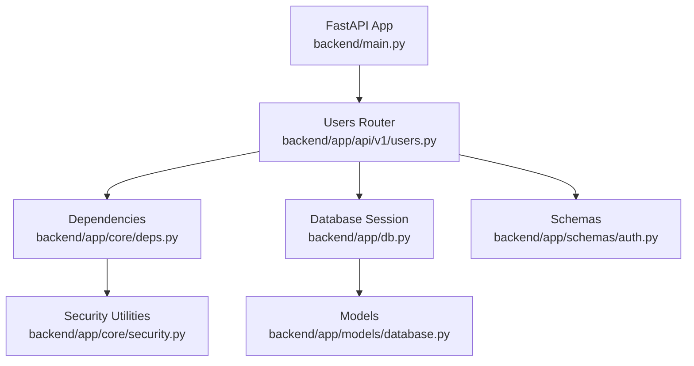
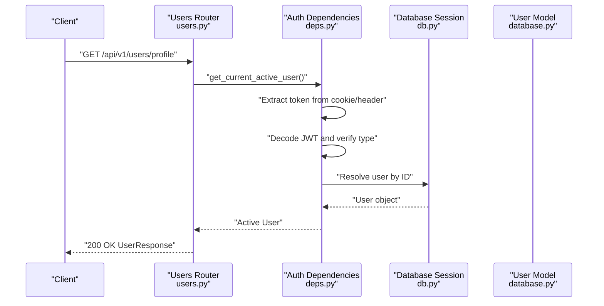
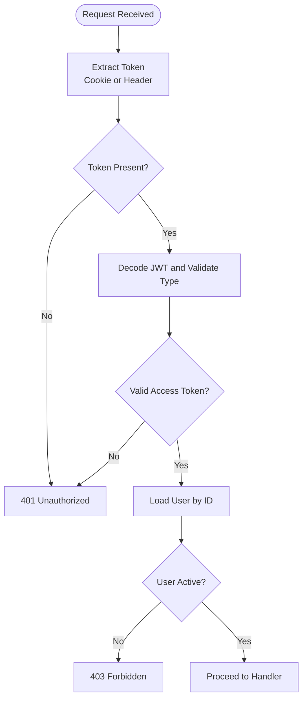
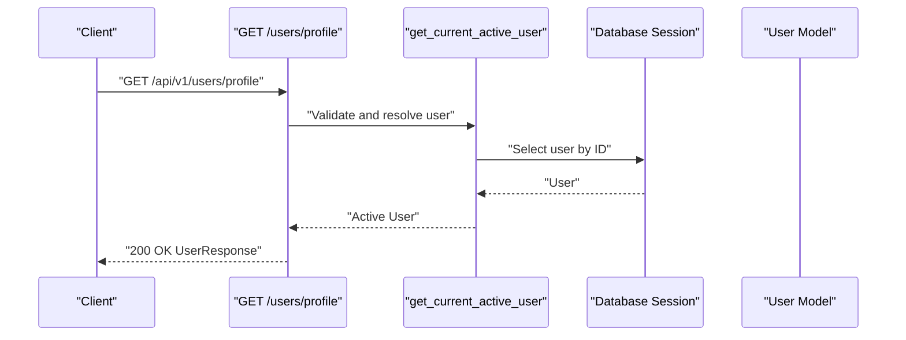
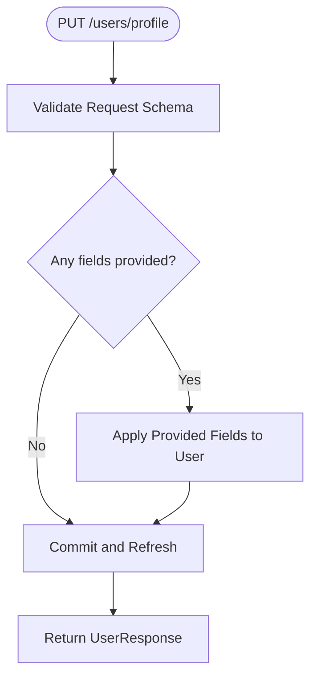
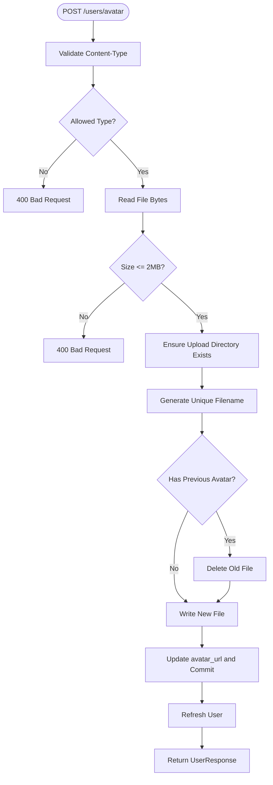
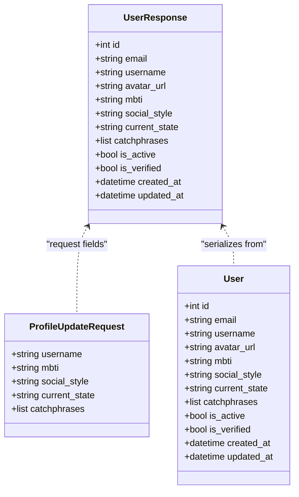
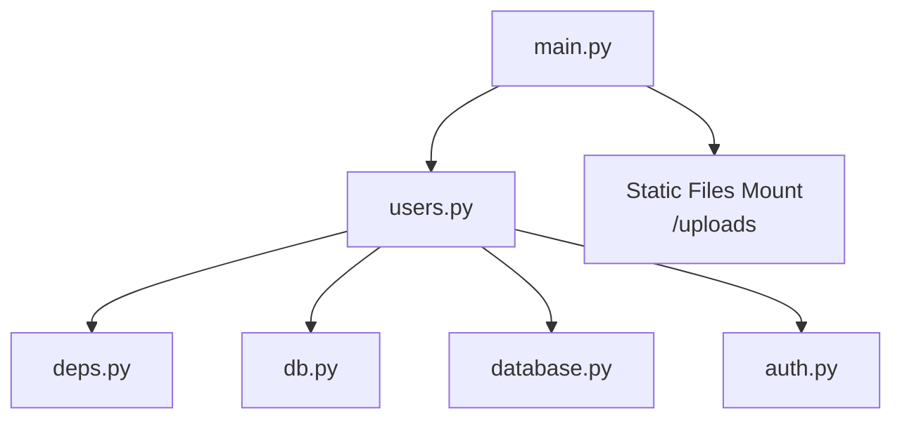

# User Management Endpoints

<cite>
**Referenced Files in This Document**
- [users.py](file://backend/app/api/v1/users.py)
- [auth.py](file://backend/app/schemas/auth.py)
- [database.py](file://backend/app/models/database.py)
- [deps.py](file://backend/app/core/deps.py)
- [db.py](file://backend/app/db.py)
- [main.py](file://backend/main.py)
- [auth_service.py](file://backend/app/services/auth_service.py)
</cite>

## Table of Contents
1. [Introduction](#introduction)
2. [Project Structure](#project-structure)
3. [Core Components](#core-components)
4. [Architecture Overview](#architecture-overview)
5. [Detailed Component Analysis](#detailed-component-analysis)
6. [Dependency Analysis](#dependency-analysis)
7. [Performance Considerations](#performance-considerations)
8. [Troubleshooting Guide](#troubleshooting-guide)
9. [Conclusion](#conclusion)

## Introduction
This document provides comprehensive API documentation for user management endpoints implemented in the backend. It covers profile management, avatar upload, and related user data operations. The documentation specifies HTTP methods, URL patterns, request/response schemas, authentication and authorization requirements, validation rules, and error handling patterns. Administrative moderation endpoints are not present in the current codebase; therefore, this document focuses on user-facing endpoints only.

## Project Structure
The user management endpoints are implemented under the FastAPI application routing system. The primary endpoint module is located at backend/app/api/v1/users.py. Authentication and authorization are handled via dependency injection functions in backend/app/core/deps.py. Data models and Pydantic schemas define the user profile structure and validation rules.

**Diagram sources**
- [main.py:70-72](file://backend/main.py#L70-L72)
- [users.py:14](file://backend/app/api/v1/users.py#L14)
- [deps.py:34-78](file://backend/app/core/deps.py#L34-L78)
- [db.py:31-42](file://backend/app/db.py#L31-L42)
- [database.py:13-44](file://backend/app/models/database.py#L13-L44)
- [auth.py:58-106](file://backend/app/schemas/auth.py#L58-L106)

**Section sources**
- [main.py:70-72](file://backend/main.py#L70-L72)
- [users.py:14](file://backend/app/api/v1/users.py#L14)

## Core Components
- Users API Router: Defines endpoints for profile retrieval, profile updates, and avatar uploads.
- Authentication Dependencies: Extract tokens from cookies or Authorization headers, validate JWT, and enforce active user status.
- Data Models: SQLAlchemy ORM model representing user profiles stored in the database.
- Pydantic Schemas: Define request/response shapes for user data and validation rules.

Key responsibilities:
- Enforce bearer token authentication and active user checks.
- Validate and persist profile updates.
- Validate and process avatar uploads with size/type constraints.
- Return standardized user response models.

**Section sources**
- [users.py:20-102](file://backend/app/api/v1/users.py#L20-L102)
- [deps.py:34-101](file://backend/app/core/deps.py#L34-L101)
- [database.py:13-44](file://backend/app/models/database.py#L13-L44)
- [auth.py:58-84](file://backend/app/schemas/auth.py#L58-L84)

## Architecture Overview
The user management endpoints follow a layered architecture:
- API Layer: FastAPI routes in users.py.
- Dependency Layer: Authentication and authorization helpers in deps.py.
- Persistence Layer: Database session management in db.py and ORM models in database.py.
- Schema Layer: Pydantic models in auth.py define request/response contracts.

**Diagram sources**
- [users.py:20-25](file://backend/app/api/v1/users.py#L20-L25)
- [deps.py:34-78](file://backend/app/core/deps.py#L34-L78)
- [db.py:31-42](file://backend/app/db.py#L31-L42)
- [database.py:13-44](file://backend/app/models/database.py#L13-L44)

## Detailed Component Analysis

### Endpoint Catalog
- GET /api/v1/users/profile
  - Purpose: Retrieve the authenticated user’s profile.
  - Authentication: Required (Bearer token via cookie or Authorization header).
  - Authorization: Active user required.
  - Response: UserResponse model.
  - Notes: Uses get_current_active_user dependency.

- PUT /api/v1/users/profile
  - Purpose: Update user profile fields.
  - Authentication: Required.
  - Authorization: Active user required.
  - Request Body: ProfileUpdateRequest (partial updates supported).
  - Response: UserResponse model.
  - Validation: Fields validated by Pydantic schema; only provided fields are updated.

- POST /api/v1/users/avatar
  - Purpose: Upload a new avatar image.
  - Authentication: Required.
  - Authorization: Active user required.
  - Request: multipart/form-data with a single file field.
  - Constraints: Allowed types and size limits enforced.
  - Response: UserResponse model with updated avatar_url.
  - Behavior: Replaces previous avatar file if present.

Administrative moderation endpoints are not implemented in the current codebase. No endpoints exist for user search, viewing another user’s profile by ID, or account settings beyond profile and avatar.

**Section sources**
- [users.py:20-102](file://backend/app/api/v1/users.py#L20-L102)
- [auth.py:77-84](file://backend/app/schemas/auth.py#L77-L84)
- [deps.py:81-101](file://backend/app/core/deps.py#L81-L101)

### Authentication and Authorization
- Token Extraction: The dependency function prioritizes reading the access token from an httpOnly cookie named access_token, falling back to the Authorization header with Bearer scheme.
- Token Decoding: Validates JWT signature and ensures the token type is an access token.
- Active User Check: Requires the user to be active; otherwise raises an error.

**Diagram sources**
- [deps.py:18-78](file://backend/app/core/deps.py#L18-L78)

**Section sources**
- [deps.py:14-78](file://backend/app/core/deps.py#L14-L78)

### Profile Management Endpoints

#### GET /api/v1/users/profile
- Description: Returns the authenticated user’s profile.
- Authentication: Required.
- Authorization: Active user required.
- Response: UserResponse.

**Diagram sources**
- [users.py:20-25](file://backend/app/api/v1/users.py#L20-L25)
- [deps.py:34-101](file://backend/app/core/deps.py#L34-L101)

**Section sources**
- [users.py:20-25](file://backend/app/api/v1/users.py#L20-L25)

#### PUT /api/v1/users/profile
- Description: Partially updates user profile fields.
- Authentication: Required.
- Authorization: Active user required.
- Request Body: ProfileUpdateRequest (fields are optional; only provided fields are updated).
- Response: UserResponse.

Validation and persistence:
- Pydantic schema enforces field constraints.
- Only fields present in the request are applied to the user object.
- Database transaction commits and refreshes the user object before returning.

**Diagram sources**
- [users.py:28-47](file://backend/app/api/v1/users.py#L28-L47)
- [auth.py:77-84](file://backend/app/schemas/auth.py#L77-L84)

**Section sources**
- [users.py:28-47](file://backend/app/api/v1/users.py#L28-L47)
- [auth.py:77-84](file://backend/app/schemas/auth.py#L77-L84)

#### POST /api/v1/users/avatar
- Description: Uploads a new avatar image for the authenticated user.
- Authentication: Required.
- Authorization: Active user required.
- Request: multipart/form-data with a file field.
- Constraints:
  - Allowed content types: image/jpeg, image/png, image/gif, image/webp.
  - Maximum file size: 2 MB.
- Behavior:
  - Deletes the previous avatar file if present.
  - Generates a unique filename combining user ID and a UUID segment.
  - Saves the file to the configured upload directory.
  - Updates the user’s avatar_url and persists to the database.
- Response: UserResponse.

**Diagram sources**
- [users.py:50-102](file://backend/app/api/v1/users.py#L50-L102)

**Section sources**
- [users.py:50-102](file://backend/app/api/v1/users.py#L50-L102)

### Data Models and Schemas
UserResponse defines the serialized user representation returned by endpoints. ProfileUpdateRequest defines the allowed fields for partial updates. The underlying SQLAlchemy model stores user data in the database.

**Diagram sources**
- [database.py:13-44](file://backend/app/models/database.py#L13-L44)
- [auth.py:58-84](file://backend/app/schemas/auth.py#L58-L84)

**Section sources**
- [database.py:13-44](file://backend/app/models/database.py#L13-L44)
- [auth.py:58-84](file://backend/app/schemas/auth.py#L58-L84)

## Dependency Analysis
- Router Registration: The users router is included in the main application with the /api/v1 prefix.
- Static Assets: The uploads directory is mounted to serve uploaded avatars.
- Database Initialization: The application initializes database tables on startup.

**Diagram sources**
- [main.py:70-87](file://backend/main.py#L70-L87)
- [users.py:14](file://backend/app/api/v1/users.py#L14)
- [deps.py:34-78](file://backend/app/core/deps.py#L34-L78)
- [db.py:31-42](file://backend/app/db.py#L31-L42)
- [database.py:13-44](file://backend/app/models/database.py#L13-L44)
- [auth.py:58-84](file://backend/app/schemas/auth.py#L58-L84)

**Section sources**
- [main.py:70-87](file://backend/main.py#L70-L87)

## Performance Considerations
- Avatar Upload Size: The 2 MB limit reduces storage overhead and speeds up serving. Consider CDN integration for improved global delivery.
- Token Validation: JWT decoding occurs per request; caching decoded claims at the edge or using short-lived tokens can reduce CPU load.
- Database Transactions: Profile updates and avatar saves commit within the same request; keep payloads minimal to reduce write contention.

## Troubleshooting Guide
Common errors and their likely causes:
- 401 Unauthorized
  - Cause: Missing or invalid access token.
  - Resolution: Ensure the access_token cookie is set or the Authorization header is provided with a valid Bearer token.
  - Section sources
    - [deps.py:43-76](file://backend/app/core/deps.py#L43-L76)

- 403 Forbidden
  - Cause: Non-active user account.
  - Resolution: Activate the account or contact support.
  - Section sources
    - [deps.py:72-76](file://backend/app/core/deps.py#L72-L76)

- 400 Bad Request (Avatar Upload)
  - Cause: Unsupported content type or file too large.
  - Resolution: Use jpg, png, gif, or webp images under 2 MB.
  - Section sources
    - [users.py:62-76](file://backend/app/api/v1/users.py#L62-L76)

- Validation Failures (Profile Update)
  - Cause: Field length or type violations.
  - Resolution: Review ProfileUpdateRequest constraints and adjust payload accordingly.
  - Section sources
    - [auth.py:77-84](file://backend/app/schemas/auth.py#L77-L84)

## Conclusion
The user management endpoints provide secure, validated operations for retrieving and updating user profiles and uploading avatars. Authentication relies on JWT tokens extracted from cookies or headers, with strict active-user enforcement. The current implementation does not include administrative moderation, user search, or public profile viewing endpoints. Future enhancements could introduce pagination for search, public profile visibility controls, and administrative actions while preserving the existing validation and security patterns.