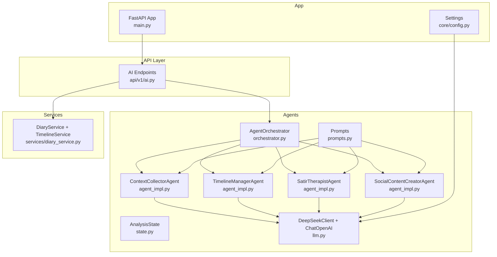
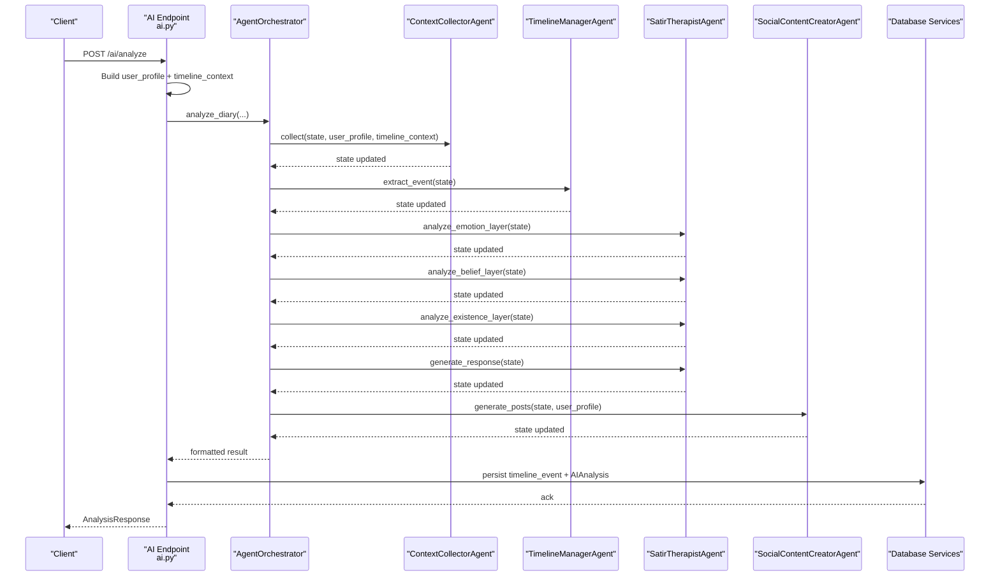
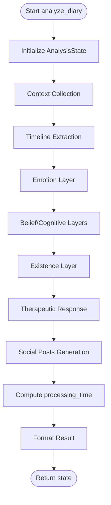
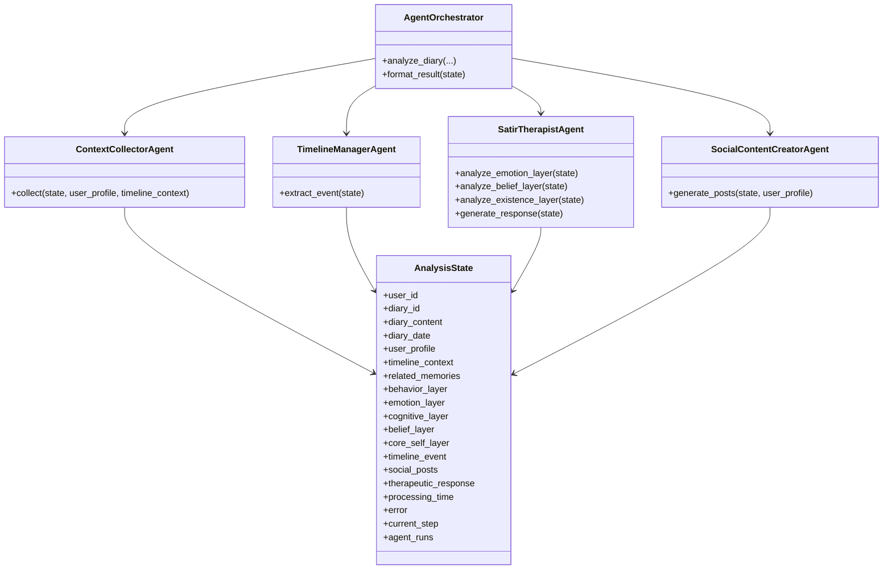
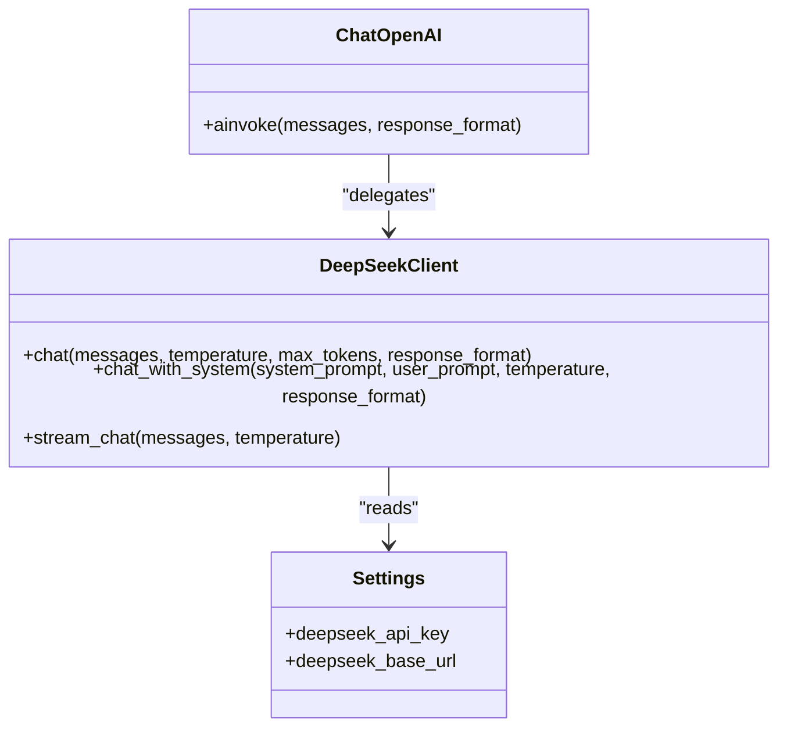
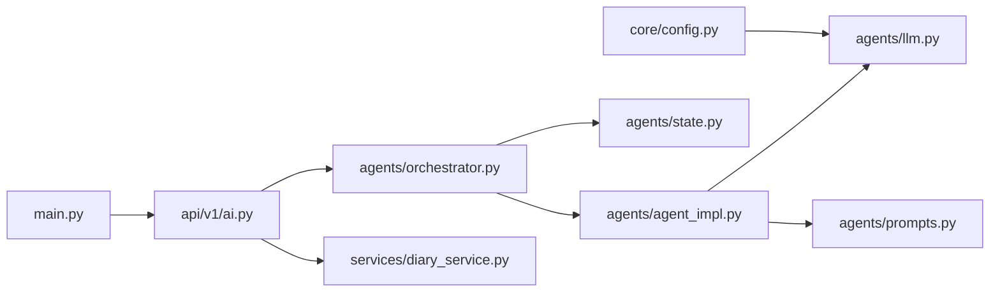

# Agent System Architecture

<cite>
**Referenced Files in This Document**
- [backend/app/agents/__init__.py](file://backend/app/agents/__init__.py)
- [backend/app/agents/orchestrator.py](file://backend/app/agents/orchestrator.py)
- [backend/app/agents/agent_impl.py](file://backend/app/agents/agent_impl.py)
- [backend/app/agents/llm.py](file://backend/app/agents/llm.py)
- [backend/app/agents/prompts.py](file://backend/app/agents/prompts.py)
- [backend/app/agents/state.py](file://backend/app/agents/state.py)
- [backend/app/api/v1/ai.py](file://backend/app/api/v1/ai.py)
- [backend/app/services/diary_service.py](file://backend/app/services/diary_service.py)
- [backend/app/schemas/ai.py](file://backend/app/schemas/ai.py)
- [backend/app/core/config.py](file://backend/app/core/config.py)
- [backend/main.py](file://backend/main.py)
- [backend/test_ai_agents.py](file://backend/test_ai_agents.py)
</cite>

## Table of Contents
1. [Introduction](#introduction)
2. [Project Structure](#project-structure)
3. [Core Components](#core-components)
4. [Architecture Overview](#architecture-overview)
5. [Detailed Component Analysis](#detailed-component-analysis)
6. [Dependency Analysis](#dependency-analysis)
7. [Performance Considerations](#performance-considerations)
8. [Troubleshooting Guide](#troubleshooting-guide)
9. [Conclusion](#conclusion)
10. [Appendices](#appendices)

## Introduction
This document describes the multi-agent AI architecture of the “Yinji” (映记) application. It focuses on the agent orchestration system, specialized agent implementations, LLM integration patterns, prompt engineering, state management, session persistence, and integration with the service layer. The system coordinates multiple agents to perform a full diary analysis pipeline: context collection, timeline event extraction, five-layer Satir Iceberg analysis, therapeutic response generation, and social content creation. It also documents agent communication patterns, error handling, retry mechanisms, and performance optimization strategies.

## Project Structure
The agent system resides under backend/app/agents and integrates with FastAPI endpoints under backend/app/api/v1. The orchestration layer coordinates specialized agents, while the LLM layer abstracts DeepSeek API calls. Prompts define agent-specific instructions, and state management tracks the workflow progress and results.

**Diagram sources**
- [backend/app/agents/orchestrator.py:18-176](file://backend/app/agents/orchestrator.py#L18-L176)
- [backend/app/agents/agent_impl.py:92-484](file://backend/app/agents/agent_impl.py#L92-L484)
- [backend/app/agents/state.py:10-45](file://backend/app/agents/state.py#L10-L45)
- [backend/app/agents/prompts.py:1-244](file://backend/app/agents/prompts.py#L1-L244)
- [backend/app/agents/llm.py:13-220](file://backend/app/agents/llm.py#L13-L220)
- [backend/app/api/v1/ai.py:1-902](file://backend/app/api/v1/ai.py#L1-L902)
- [backend/app/services/diary_service.py:66-637](file://backend/app/services/diary_service.py#L66-L637)
- [backend/main.py:42-87](file://backend/main.py#L42-L87)
- [backend/app/core/config.py:62-70](file://backend/app/core/config.py#L62-L70)

**Section sources**
- [backend/app/agents/__init__.py:1-8](file://backend/app/agents/__init__.py#L1-L8)
- [backend/app/agents/orchestrator.py:1-176](file://backend/app/agents/orchestrator.py#L1-L176)
- [backend/app/agents/agent_impl.py:1-484](file://backend/app/agents/agent_impl.py#L1-L484)
- [backend/app/agents/llm.py:1-220](file://backend/app/agents/llm.py#L1-L220)
- [backend/app/agents/prompts.py:1-244](file://backend/app/agents/prompts.py#L1-L244)
- [backend/app/agents/state.py:1-45](file://backend/app/agents/state.py#L1-L45)
- [backend/app/api/v1/ai.py:1-902](file://backend/app/api/v1/ai.py#L1-L902)
- [backend/app/services/diary_service.py:1-637](file://backend/app/services/diary_service.py#L1-L637)
- [backend/app/core/config.py:1-105](file://backend/app/core/config.py#L1-L105)
- [backend/main.py:1-119](file://backend/main.py#L1-L119)

## Core Components
- Agent Orchestrator: Coordinates the end-to-end workflow across four agents, manages state transitions, and formats results.
- Specialized Agents:
  - ContextCollectorAgent: Aggregates user profile and timeline context into structured inputs.
  - TimelineManagerAgent: Extracts and structures timeline events from diary content.
  - SatirTherapistAgent: Performs five-layer Satir Iceberg analysis and generates a therapeutic response.
  - SocialContentCreatorAgent: Generates multiple variants of social media posts based on user style and diary content.
- LLM Integration: DeepSeek API client with synchronous and streaming support, plus a ChatOpenAI-compatible wrapper for LangChain compatibility.
- Prompt Engineering: Agent-specific prompt templates with strict JSON output expectations and system-level guidance.
- State Management: Typed dictionary representing the workflow state and metadata for runs and errors.
- API Integration: FastAPI endpoints orchestrate data fetching, agent execution, and persistence.

**Section sources**
- [backend/app/agents/orchestrator.py:18-176](file://backend/app/agents/orchestrator.py#L18-L176)
- [backend/app/agents/agent_impl.py:92-484](file://backend/app/agents/agent_impl.py#L92-L484)
- [backend/app/agents/llm.py:13-220](file://backend/app/agents/llm.py#L13-L220)
- [backend/app/agents/prompts.py:1-244](file://backend/app/agents/prompts.py#L1-L244)
- [backend/app/agents/state.py:10-45](file://backend/app/agents/state.py#L10-L45)
- [backend/app/api/v1/ai.py:406-638](file://backend/app/api/v1/ai.py#L406-L638)

## Architecture Overview
The system follows a pipeline-driven orchestration model:
- API layer collects inputs and prepares user profile and timeline context.
- Orchestrator initializes AnalysisState and invokes agents sequentially.
- Each agent updates state with structured outputs and records run metadata.
- Results are formatted and persisted to the database for later retrieval.

**Diagram sources**
- [backend/app/api/v1/ai.py:406-638](file://backend/app/api/v1/ai.py#L406-L638)
- [backend/app/agents/orchestrator.py:27-131](file://backend/app/agents/orchestrator.py#L27-L131)
- [backend/app/agents/agent_impl.py:100-483](file://backend/app/agents/agent_impl.py#L100-L483)

## Detailed Component Analysis

### Agent Orchestrator
- Responsibilities:
  - Initialize AnalysisState with inputs and empty outputs.
  - Execute agents in order: ContextCollectorAgent → TimelineManagerAgent → SatirTherapistAgent (emotion → belief → existence) → SocialContentCreatorAgent.
  - Record processing metrics and error state.
  - Format final result for API response.
- Error handling:
  - Catches exceptions during orchestration, sets error metadata, and returns partial state.
- State management:
  - Tracks current_step, agent_runs, processing_time, and error.

**Diagram sources**
- [backend/app/agents/orchestrator.py:27-171](file://backend/app/agents/orchestrator.py#L27-L171)

**Section sources**
- [backend/app/agents/orchestrator.py:18-176](file://backend/app/agents/orchestrator.py#L18-L176)

### Specialized Agent Implementations
- ContextCollectorAgent
  - Purpose: Merge user profile and timeline context into a unified state.
  - LLM usage: Uses a low-temperature model for deterministic JSON parsing.
  - Robustness: Gracefully handles missing inputs and continues analysis.
- TimelineManagerAgent
  - Purpose: Extract structured timeline events with emotion tags, importance scores, and entity mentions.
  - Fallback: On failure, creates a default event to keep the pipeline moving.
- SatirTherapistAgent
  - Purpose: Five-layer Satir Iceberg analysis and a therapeutic response.
  - Sub-agents:
    - analyze_emotion_layer: Surface vs underlying emotions.
    - analyze_belief_layer: Irrational beliefs and automatic thoughts; core beliefs and life rules.
    - analyze_existence_layer: Deeper yearnings and insights.
    - generate_response: Warm, non-judgmental therapeutic reply.
  - Robustness: On failure, populates safe defaults to preserve downstream steps.
- SocialContentCreatorAgent
  - Purpose: Generate multiple social media post variants aligned with user style.
  - Parsing: Tries multiple strategies to extract JSON from LLM output.
  - Fallback: On failure, produces two simple post variants.

**Diagram sources**
- [backend/app/agents/orchestrator.py:18-176](file://backend/app/agents/orchestrator.py#L18-L176)
- [backend/app/agents/agent_impl.py:92-484](file://backend/app/agents/agent_impl.py#L92-L484)
- [backend/app/agents/state.py:10-45](file://backend/app/agents/state.py#L10-L45)

**Section sources**
- [backend/app/agents/agent_impl.py:92-484](file://backend/app/agents/agent_impl.py#L92-L484)
- [backend/app/agents/state.py:10-45](file://backend/app/agents/state.py#L10-L45)

### LLM Integration Patterns
- DeepSeekClient
  - Provides synchronous chat and streaming chat APIs.
  - Supports JSON response formatting via response_format.
  - Streams tokens with structured parsing of SSE-like lines.
- ChatOpenAI Wrapper
  - Compatible interface for LangChain’s ChatOpenAI to integrate with agents.
  - Converts system/user messages into the client’s expected format.
- Model Variants
  - get_llm: General-purpose model with adjustable temperature.
  - get_analytical_llm: Lower temperature for structured tasks.
  - get_creative_llm: Higher temperature for creative tasks.

**Diagram sources**
- [backend/app/agents/llm.py:13-220](file://backend/app/agents/llm.py#L13-L220)
- [backend/app/core/config.py:62-70](file://backend/app/core/config.py#L62-L70)

**Section sources**
- [backend/app/agents/llm.py:13-220](file://backend/app/agents/llm.py#L13-L220)
- [backend/app/core/config.py:62-70](file://backend/app/core/config.py#L62-L70)

### Prompt Engineering
- Agent-specific prompts:
  - ContextCollectorAgent: Aggregates user profile and timeline context into a JSON object.
  - TimelineManagerAgent: Extracts event summary, emotion tag, importance score, and entities.
  - SatirTherapistAgent: Emotion, belief/cognitive, and existence layers with structured JSON.
  - SocialContentCreatorAgent: Generates multiple post variants with JSON output.
- System-level prompts:
  - SYSTEM_PROMPT_ANALYST: Defines the analyst role and tone.
  - SYSTEM_PROMPT_SOCIAL: Defines the social content creator role and constraints.
- Output formatting:
  - Strict JSON formatting expectations with fenced code blocks and fallback parsing.

**Section sources**
- [backend/app/agents/prompts.py:1-244](file://backend/app/agents/prompts.py#L1-L244)

### State Management
- AnalysisState defines typed keys for inputs, intermediate results, and outputs.
- Metadata includes processing_time, error, current_step, and agent_runs for observability.
- The orchestrator initializes and updates state across steps.

**Section sources**
- [backend/app/agents/state.py:10-45](file://backend/app/agents/state.py#L10-L45)
- [backend/app/agents/orchestrator.py:53-73](file://backend/app/agents/orchestrator.py#L53-L73)

### API Integration and Persistence
- Endpoints:
  - /ai/analyze: Orchestrates multi-diary analysis, persists timeline events and AIAnalysis, and returns formatted results.
  - /ai/comprehensive-analysis: RAG-based user-level analysis.
  - /ai/daily-guidance: Generates personalized writing prompts.
  - Additional endpoints for title suggestions, social style samples, and result retrieval.
- Persistence:
  - Creates or updates TimelineEvent linked to the anchor or latest diary.
  - Stores AIAnalysis result for quick retrieval.
  - Graceful degradation: Continues returning results even if persistence fails.

**Section sources**
- [backend/app/api/v1/ai.py:406-710](file://backend/app/api/v1/ai.py#L406-L710)
- [backend/app/services/diary_service.py:281-488](file://backend/app/services/diary_service.py#L281-L488)

## Dependency Analysis
- Internal dependencies:
  - Orchestrator depends on specialized agents and AnalysisState.
  - Agents depend on LLM client and prompts.
  - API endpoints depend on orchestrator and services.
- External dependencies:
  - httpx for asynchronous HTTP requests to DeepSeek.
  - SQLAlchemy for persistence.
  - FastAPI for routing and dependency injection.
- No circular dependencies observed among agents or orchestrator.

**Diagram sources**
- [backend/app/api/v1/ai.py:1-902](file://backend/app/api/v1/ai.py#L1-L902)
- [backend/app/agents/orchestrator.py:1-176](file://backend/app/agents/orchestrator.py#L1-L176)
- [backend/app/agents/agent_impl.py:1-484](file://backend/app/agents/agent_impl.py#L1-L484)
- [backend/app/agents/llm.py:1-220](file://backend/app/agents/llm.py#L1-L220)
- [backend/app/agents/prompts.py:1-244](file://backend/app/agents/prompts.py#L1-L244)
- [backend/app/agents/state.py:1-45](file://backend/app/agents/state.py#L1-L45)
- [backend/app/services/diary_service.py:1-637](file://backend/app/services/diary_service.py#L1-L637)
- [backend/main.py:42-87](file://backend/main.py#L42-L87)
- [backend/app/core/config.py:62-70](file://backend/app/core/config.py#L62-L70)

**Section sources**
- [backend/app/api/v1/ai.py:1-902](file://backend/app/api/v1/ai.py#L1-L902)
- [backend/app/agents/orchestrator.py:1-176](file://backend/app/agents/orchestrator.py#L1-L176)
- [backend/app/agents/agent_impl.py:1-484](file://backend/app/agents/agent_impl.py#L1-L484)
- [backend/app/agents/llm.py:1-220](file://backend/app/agents/llm.py#L1-L220)
- [backend/app/agents/prompts.py:1-244](file://backend/app/agents/prompts.py#L1-L244)
- [backend/app/agents/state.py:1-45](file://backend/app/agents/state.py#L1-L45)
- [backend/app/services/diary_service.py:1-637](file://backend/app/services/diary_service.py#L1-L637)
- [backend/main.py:1-119](file://backend/main.py#L1-L119)
- [backend/app/core/config.py:1-105](file://backend/app/core/config.py#L1-L105)

## Performance Considerations
- Asynchronous execution: Agents use async LLM invocation to reduce latency.
- Streaming support: DeepSeekClient supports streaming; however, agents currently use non-streaming mode. Streaming could improve perceived latency for long responses.
- Temperature tuning: Lower temperature for analytical tasks (emotion/belief/existence), higher for creative tasks (social posts).
- JSON parsing robustness: Multiple strategies to extract structured outputs from LLM responses, reducing retries.
- Error resilience: Fallbacks in agents prevent pipeline stalls; orchestrator captures errors and still returns partial results.
- Persistence optimization: Batched writes and defensive checks minimize write contention.

[No sources needed since this section provides general guidance]

## Troubleshooting Guide
- DeepSeek API failures:
  - Verify DEEPSEEK_API_KEY and DEEPSEEK_BASE_URL in environment settings.
  - Check network connectivity and rate limits.
- JSON parsing errors:
  - Ensure prompts require strict JSON output and include fenced code blocks.
  - Use the robust parsing helpers in agents to handle varied LLM outputs.
- Orchestration errors:
  - Inspect error field in AnalysisState and agent_runs for timing and stack traces.
  - Confirm database connectivity and permissions for persistence endpoints.
- Testing:
  - Run the test script to validate end-to-end flow with real API credentials.

**Section sources**
- [backend/app/core/config.py:62-70](file://backend/app/core/config.py#L62-L70)
- [backend/app/agents/agent_impl.py:25-68](file://backend/app/agents/agent_impl.py#L25-L68)
- [backend/app/agents/orchestrator.py:121-130](file://backend/app/agents/orchestrator.py#L121-L130)
- [backend/test_ai_agents.py:16-127](file://backend/test_ai_agents.py#L16-L127)

## Conclusion
The Yinji multi-agent AI system provides a modular, resilient, and extensible framework for diary analysis. The orchestrator coordinates specialized agents with clear prompts and structured state, while the LLM integration abstracts DeepSeek API usage. The API layer integrates tightly with services to persist results and enable quick retrieval. Robust error handling and fallbacks ensure reliability, and performance is optimized through async execution and careful JSON parsing.

[No sources needed since this section summarizes without analyzing specific files]

## Appendices

### Agent Lifecycle and Memory Management
- Lifecycle:
  - Initialization: Orchestrator constructs agents and AnalysisState.
  - Execution: Sequential steps update state; each agent logs run metadata.
  - Finalization: Formatting and persistence; graceful degradation on errors.
- Memory management:
  - State holds intermediate results; orchestrator clears or replaces on failure.
  - Timeline and AIAnalysis persistence ensures future retrieval without recomputation.

**Section sources**
- [backend/app/agents/orchestrator.py:27-171](file://backend/app/agents/orchestrator.py#L27-L171)
- [backend/app/api/v1/ai.py:520-632](file://backend/app/api/v1/ai.py#L520-L632)

### Retry Mechanisms
- Built-in resilience:
  - Agent-level try/catch with fallback outputs.
  - Orchestrator-level try/catch with error propagation.
- Recommendations:
  - Add configurable retries around LLM calls with exponential backoff.
  - Implement circuit breaker for upstream API failures.

**Section sources**
- [backend/app/agents/agent_impl.py:136-141](file://backend/app/agents/agent_impl.py#L136-L141)
- [backend/app/agents/agent_impl.py:191-202](file://backend/app/agents/agent_impl.py#L191-L202)
- [backend/app/agents/agent_impl.py:293-298](file://backend/app/agents/agent_impl.py#L293-L298)
- [backend/app/agents/agent_impl.py:388-392](file://backend/app/agents/agent_impl.py#L388-L392)
- [backend/app/agents/agent_impl.py:465-482](file://backend/app/agents/agent_impl.py#L465-L482)
- [backend/app/agents/orchestrator.py:121-130](file://backend/app/agents/orchestrator.py#L121-L130)

### API Definitions and Schemas
- AnalysisRequest and AnalysisResponse define the primary analysis contract.
- Supporting endpoints include comprehensive analysis, daily guidance, and social style samples.

**Section sources**
- [backend/app/schemas/ai.py:9-108](file://backend/app/schemas/ai.py#L9-L108)
- [backend/app/api/v1/ai.py:83-206](file://backend/app/api/v1/ai.py#L83-L206)
- [backend/app/api/v1/ai.py:267-403](file://backend/app/api/v1/ai.py#L267-L403)
- [backend/app/api/v1/ai.py:406-710](file://backend/app/api/v1/ai.py#L406-L710)