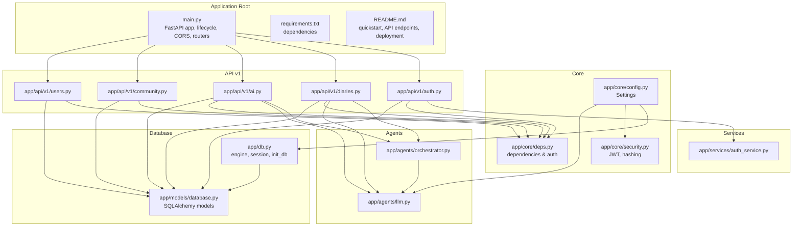
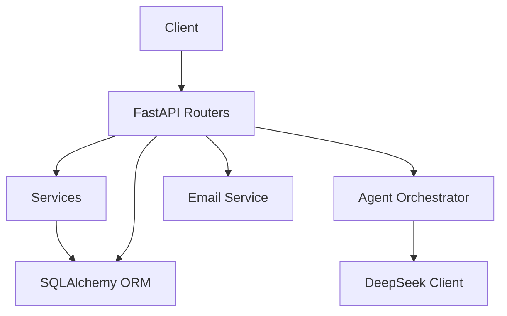
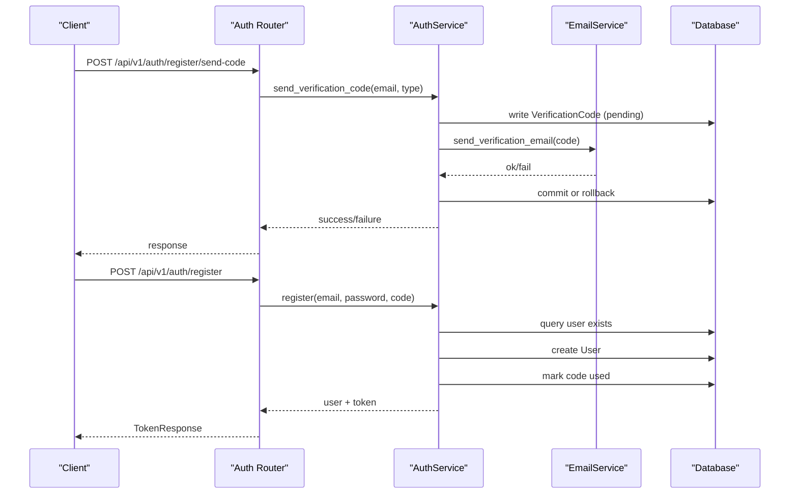
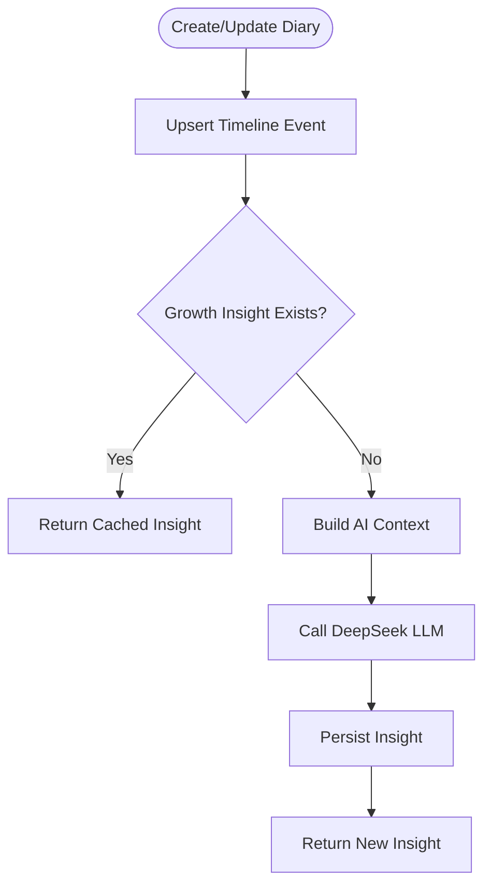
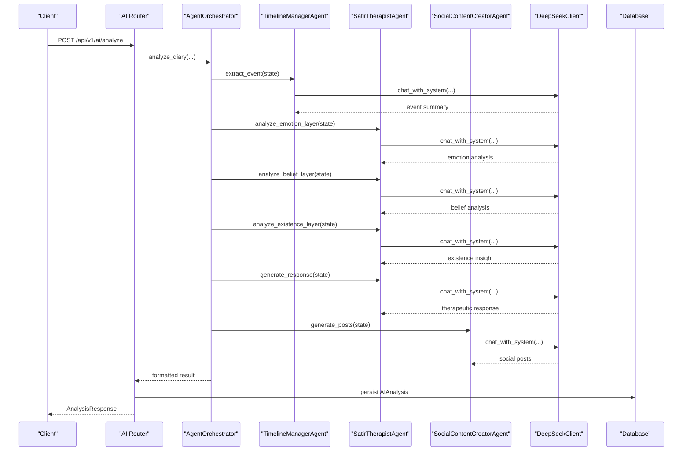
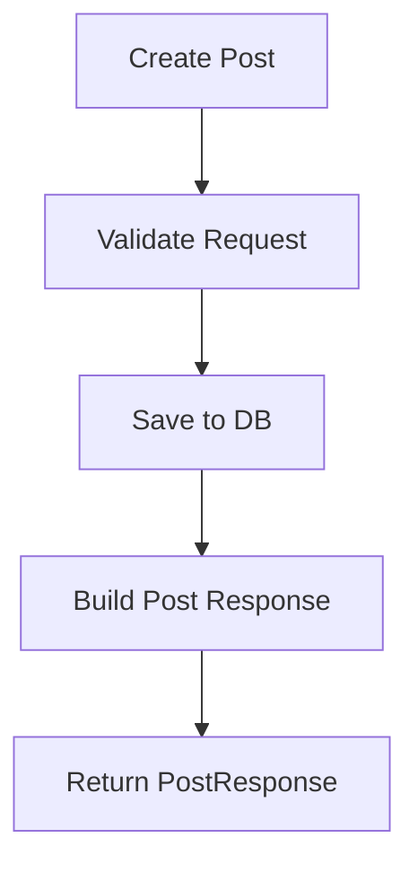
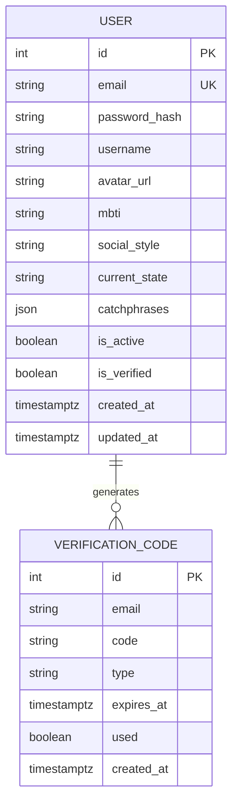
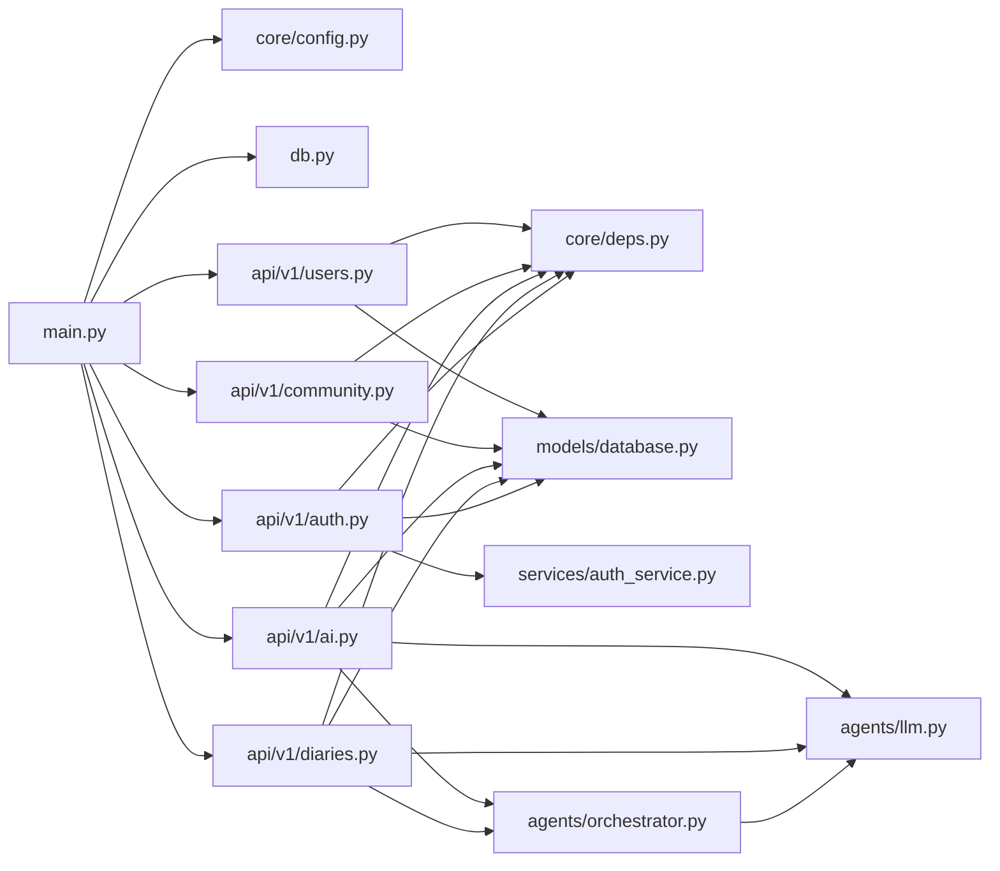

# Backend System

<cite>
**Referenced Files in This Document**
- [main.py](file://backend/main.py)
- [requirements.txt](file://backend/requirements.txt)
- [README.md](file://backend/README.md)
- [app/__init__.py](file://backend/app/__init__.py)
- [app/db.py](file://backend/app/db.py)
- [app/core/config.py](file://backend/app/core/config.py)
- [app/core/security.py](file://backend/app/core/security.py)
- [app/core/deps.py](file://backend/app/core/deps.py)
- [app/api/v1/auth.py](file://backend/app/api/v1/auth.py)
- [app/api/v1/diaries.py](file://backend/app/api/v1/diaries.py)
- [app/api/v1/ai.py](file://backend/app/api/v1/ai.py)
- [app/api/v1/community.py](file://backend/app/api/v1/community.py)
- [app/api/v1/users.py](file://backend/app/api/v1/users.py)
- [app/schemas/auth.py](file://backend/app/schemas/auth.py)
- [app/models/database.py](file://backend/app/models/database.py)
- [app/services/auth_service.py](file://backend/app/services/auth_service.py)
- [app/agents/orchestrator.py](file://backend/app/agents/orchestrator.py)
- [app/agents/llm.py](file://backend/app/agents/llm.py)
</cite>

## Table of Contents
1. [Introduction](#introduction)
2. [Project Structure](#project-structure)
3. [Core Components](#core-components)
4. [Architecture Overview](#architecture-overview)
5. [Detailed Component Analysis](#detailed-component-analysis)
6. [Dependency Analysis](#dependency-analysis)
7. [Performance Considerations](#performance-considerations)
8. [Troubleshooting Guide](#troubleshooting-guide)
9. [Conclusion](#conclusion)
10. [Appendices](#appendices)

## Introduction
This document describes the backend system of the 映记 (YinJi) smart diary application. It covers the FastAPI-based REST API architecture, routing patterns, middleware, and security layers. It documents the service layer for authentication, diary management, community features, and AI analysis services. It explains the database design using SQLAlchemy ORM, entity relationships, and data validation. It also details the agent system architecture including multi-agent orchestration, specialized agents, and LLM integration via DeepSeek. Finally, it outlines API endpoint structure, request/response schemas, error handling patterns, deployment configurations, environment management, monitoring approaches, performance optimization, caching strategies, and background task processing.

## Project Structure
The backend is organized around a FastAPI application with modular API routers grouped under a versioned namespace, a core module for configuration and security, SQLAlchemy models and schemas, service implementations, and an agents subsystem for AI orchestration.

**Diagram sources**
- [main.py:31-108](file://backend/main.py#L31-L108)
- [app/core/config.py:10-105](file://backend/app/core/config.py#L10-L105)
- [app/db.py:11-59](file://backend/app/db.py#L11-L59)
- [app/api/v1/auth.py:22-316](file://backend/app/api/v1/auth.py#L22-L316)
- [app/api/v1/diaries.py:29-501](file://backend/app/api/v1/diaries.py#L29-L501)
- [app/api/v1/ai.py:31-902](file://backend/app/api/v1/ai.py#L31-L902)
- [app/api/v1/community.py:20-324](file://backend/app/api/v1/community.py#L20-L324)
- [app/api/v1/users.py:14-103](file://backend/app/api/v1/users.py#L14-L103)
- [app/services/auth_service.py:16-358](file://backend/app/services/auth_service.py#L16-L358)
- [app/agents/orchestrator.py:18-176](file://backend/app/agents/orchestrator.py#L18-L176)
- [app/agents/llm.py:13-220](file://backend/app/agents/llm.py#L13-L220)

**Section sources**
- [main.py:31-108](file://backend/main.py#L31-L108)
- [README.md:80-160](file://backend/README.md#L80-L160)

## Core Components
- FastAPI application with lifespan management for database initialization, CORS configuration, and router registration.
- Asynchronous SQLAlchemy ORM with dependency-injected sessions.
- Centralized configuration via Pydantic settings with environment variable loading.
- Security utilities for JWT token creation/verification and password hashing.
- Dependency injection for current user retrieval and bearer token validation.
- Versioned API v1 with modular routers for authentication, diaries, AI analysis, community, and users.
- Agent orchestration coordinating multiple specialized agents powered by DeepSeek LLM.

**Section sources**
- [main.py:17-108](file://backend/main.py#L17-L108)
- [app/db.py:11-59](file://backend/app/db.py#L11-L59)
- [app/core/config.py:10-105](file://backend/app/core/config.py#L10-L105)
- [app/core/security.py:16-92](file://backend/app/core/security.py#L16-L92)
- [app/core/deps.py:18-103](file://backend/app/core/deps.py#L18-L103)
- [app/api/v1/auth.py:22-316](file://backend/app/api/v1/auth.py#L22-L316)
- [app/api/v1/diaries.py:29-501](file://backend/app/api/v1/diaries.py#L29-L501)
- [app/api/v1/ai.py:31-902](file://backend/app/api/v1/ai.py#L31-L902)
- [app/api/v1/community.py:20-324](file://backend/app/api/v1/community.py#L20-L324)
- [app/api/v1/users.py:14-103](file://backend/app/api/v1/users.py#L14-L103)
- [app/agents/orchestrator.py:18-176](file://backend/app/agents/orchestrator.py#L18-L176)
- [app/agents/llm.py:13-220](file://backend/app/agents/llm.py#L13-L220)

## Architecture Overview
The backend follows a layered architecture:
- Presentation Layer: FastAPI routers define endpoints and handle request/response serialization.
- Service Layer: Business logic encapsulated in service classes (e.g., AuthService).
- Orchestration Layer: AgentOrchestrator coordinates specialized agents for AI analysis.
- Persistence Layer: SQLAlchemy ORM models backed by async engine/session.
- External Integrations: DeepSeek LLM client for AI tasks; email service for verification codes.

**Diagram sources**
- [main.py:31-108](file://backend/main.py#L31-L108)
- [app/api/v1/auth.py:22-316](file://backend/app/api/v1/auth.py#L22-L316)
- [app/api/v1/diaries.py:29-501](file://backend/app/api/v1/diaries.py#L29-L501)
- [app/api/v1/ai.py:31-902](file://backend/app/api/v1/ai.py#L31-L902)
- [app/services/auth_service.py:16-358](file://backend/app/services/auth_service.py#L16-L358)
- [app/agents/orchestrator.py:18-176](file://backend/app/agents/orchestrator.py#L18-L176)
- [app/agents/llm.py:13-220](file://backend/app/agents/llm.py#L13-L220)
- [app/db.py:11-59](file://backend/app/db.py#L11-L59)

## Detailed Component Analysis

### Authentication Layer
- Configuration: Secret key, JWT algorithm, expiration, QQ SMTP settings, rate limits, and verification code policies.
- Security: Password hashing with bcrypt and JWT encode/decode utilities.
- Dependencies: HTTP bearer security, current user extraction, and active user checks.
- API endpoints: Registration (send/verify/register), login (code/password), logout, profile retrieval, and test email.

**Diagram sources**
- [app/api/v1/auth.py:25-126](file://backend/app/api/v1/auth.py#L25-L126)
- [app/services/auth_service.py:19-201](file://backend/app/services/auth_service.py#L19-L201)
- [app/core/security.py:43-92](file://backend/app/core/security.py#L43-L92)
- [app/core/deps.py:18-67](file://backend/app/core/deps.py#L18-L67)

**Section sources**
- [app/core/config.py:28-61](file://backend/app/core/config.py#L28-L61)
- [app/core/security.py:16-92](file://backend/app/core/security.py#L16-L92)
- [app/core/deps.py:18-103](file://backend/app/core/deps.py#L18-L103)
- [app/api/v1/auth.py:25-316](file://backend/app/api/v1/auth.py#L25-L316)
- [app/services/auth_service.py:19-358](file://backend/app/services/auth_service.py#L19-L358)

### Diary Management
- CRUD endpoints for diaries with pagination, filtering, and date-based queries.
- Image upload endpoints for diary and community images with validation.
- Timeline management: automatic event upsert from diaries, range queries, and rebuild events.
- Growth insights caching: daily summaries cached per day per user.
- Background AI refinement scheduling for timeline events after diary operations.

**Diagram sources**
- [app/api/v1/diaries.py:55-193](file://backend/app/api/v1/diaries.py#L55-L193)
- [app/api/v1/diaries.py:311-334](file://backend/app/api/v1/diaries.py#L311-L334)
- [app/api/v1/diaries.py:386-501](file://backend/app/api/v1/diaries.py#L386-L501)

**Section sources**
- [app/api/v1/diaries.py:55-501](file://backend/app/api/v1/diaries.py#L55-L501)

### AI Analysis Services
- Title suggestion generation.
- Daily guidance questions based on recent entries.
- Social style samples management and generation of social posts.
- Full integrated analysis pipeline orchestrated by AgentOrchestrator:
  - Context collection
  - Timeline event extraction
  - Satir therapist analysis (emotion/belief/existence layers)
  - Therapeutic response generation
  - Social content creation
- Results persisted to AIAnalysis table for later retrieval.

**Diagram sources**
- [app/api/v1/ai.py:406-639](file://backend/app/api/v1/ai.py#L406-L639)
- [app/agents/orchestrator.py:27-131](file://backend/app/agents/orchestrator.py#L27-L131)
- [app/agents/llm.py:68-93](file://backend/app/agents/llm.py#L68-L93)

**Section sources**
- [app/api/v1/ai.py:83-207](file://backend/app/api/v1/ai.py#L83-L207)
- [app/api/v1/ai.py:267-404](file://backend/app/api/v1/ai.py#L267-L404)
- [app/api/v1/ai.py:406-800](file://backend/app/api/v1/ai.py#L406-L800)
- [app/agents/orchestrator.py:18-176](file://backend/app/agents/orchestrator.py#L18-L176)
- [app/agents/llm.py:13-220](file://backend/app/agents/llm.py#L13-L220)

### Community Features
- Posts: create/list/retrieve/update/delete with anonymous support.
- Comments: hierarchical comments with parent-child relationships.
- Likes, collections, and views: user interactions tracked.
- Image upload for community posts.
- Circles: emotional communities with counts.

**Diagram sources**
- [app/api/v1/community.py:39-156](file://backend/app/api/v1/community.py#L39-L156)

**Section sources**
- [app/api/v1/community.py:20-324](file://backend/app/api/v1/community.py#L20-L324)

### Users and Profiles
- Retrieve and update user profile fields (username, MBTI, social style, current state, catchphrases).
- Avatar upload with validation and cleanup of previous avatar.

**Section sources**
- [app/api/v1/users.py:20-103](file://backend/app/api/v1/users.py#L20-L103)

### Database Design and Data Validation
- Models: User, VerificationCode, and others for diaries, timelines, AI analysis, community, and assistant.
- Validation: Pydantic schemas for requests/responses enforce field constraints and types.
- Relationships: Foreign keys and cascading behaviors are defined in models; ORM queries use SQLAlchemy select statements.

**Diagram sources**
- [app/models/database.py:13-70](file://backend/app/models/database.py#L13-L70)

**Section sources**
- [app/models/database.py:13-70](file://backend/app/models/database.py#L13-L70)
- [app/schemas/auth.py:10-106](file://backend/app/schemas/auth.py#L10-L106)

## Dependency Analysis
- FastAPI application depends on core configuration, database initialization, and router modules.
- API routers depend on services and shared dependencies (current user).
- Services depend on models and core security utilities.
- Agent orchestration depends on LLM client and specialized agents.
- External dependencies include HTTPX for LLM calls, SQLAlchemy for ORM, and aiosmtplib for email.

**Diagram sources**
- [main.py:31-108](file://backend/main.py#L31-L108)
- [app/core/config.py:10-105](file://backend/app/core/config.py#L10-L105)
- [app/db.py:11-59](file://backend/app/db.py#L11-L59)
- [app/api/v1/auth.py:22-316](file://backend/app/api/v1/auth.py#L22-L316)
- [app/api/v1/diaries.py:29-501](file://backend/app/api/v1/diaries.py#L29-L501)
- [app/api/v1/ai.py:31-902](file://backend/app/api/v1/ai.py#L31-L902)
- [app/api/v1/community.py:20-324](file://backend/app/api/v1/community.py#L20-L324)
- [app/api/v1/users.py:14-103](file://backend/app/api/v1/users.py#L14-L103)
- [app/services/auth_service.py:16-358](file://backend/app/services/auth_service.py#L16-L358)
- [app/agents/orchestrator.py:18-176](file://backend/app/agents/orchestrator.py#L18-L176)
- [app/agents/llm.py:13-220](file://backend/app/agents/llm.py#L13-L220)

**Section sources**
- [requirements.txt:1-26](file://backend/requirements.txt#L1-L26)

## Performance Considerations
- Asynchronous I/O: SQLAlchemy async engine and sessions minimize blocking during database operations.
- Pagination: Diaries and community endpoints support pagination to avoid large payloads.
- Background tasks: Diary updates schedule AI refinement asynchronously to avoid latency.
- Caching: Growth daily insights are cached per user/day to reduce repeated LLM calls.
- Rate limiting: Verification code requests are throttled per 5-minute window.
- Streaming LLM: DeepSeek client supports streaming responses for long-form content generation.

[No sources needed since this section provides general guidance]

## Troubleshooting Guide
- Health check: GET /health returns application status.
- CORS errors: Verify allowed origins in configuration.
- JWT failures: Confirm SECRET_KEY is set and token not expired.
- Database initialization: Delete local SQLite file and restart if schema mismatch occurs.
- Email delivery: Ensure QQ SMTP settings are correct and SSL port is used.

**Section sources**
- [main.py:89-95](file://backend/main.py#L89-L95)
- [app/core/config.py:28-61](file://backend/app/core/config.py#L28-L61)
- [README.md:139-160](file://backend/README.md#L139-L160)

## Conclusion
The backend provides a robust, modular foundation for the 映记 application with clear separation of concerns across API, services, agents, and persistence layers. It leverages asynchronous programming, strong validation, and secure authentication while integrating AI capabilities through a coordinated agent system and external LLM APIs. The architecture supports scalability, maintainability, and extensibility for future enhancements.

[No sources needed since this section summarizes without analyzing specific files]

## Appendices

### API Endpoint Reference
- Authentication
  - POST /api/v1/auth/register/send-code
  - POST /api/v1/auth/register/verify
  - POST /api/v1/auth/register
  - POST /api/v1/auth/login/send-code
  - POST /api/v1/auth/login
  - POST /api/v1/auth/login/password
  - POST /api/v1/auth/reset-password/send-code
  - POST /api/v1/auth/reset-password
  - POST /api/v1/auth/logout
  - GET /api/v1/auth/me
  - GET /api/v1/auth/test-email

- Diaries
  - POST /api/v1/diaries/
  - GET /api/v1/diaries/
  - GET /api/v1/diaries/{diary_id}
  - PUT /api/v1/diaries/{diary_id}
  - DELETE /api/v1/diaries/{diary_id}
  - GET /api/v1/diaries/date/{target_date}
  - POST /api/v1/diaries/upload-image
  - GET /api/v1/diaries/timeline/recent
  - GET /api/v1/diaries/timeline/range
  - GET /api/v1/diaries/timeline/date/{target_date}
  - POST /api/v1/diaries/timeline/rebuild
  - GET /api/v1/diaries/timeline/terrain
  - GET /api/v1/diaries/growth/daily-insight

- AI Analysis
  - POST /api/v1/ai/generate-title
  - GET /api/v1/ai/daily-guidance
  - GET /api/v1/ai/social-style-samples
  - PUT /api/v1/ai/social-style-samples
  - POST /api/v1/ai/comprehensive-analysis
  - POST /api/v1/ai/analyze
  - POST /api/v1/ai/analyze-async
  - GET /api/v1/ai/analyses
  - GET /api/v1/ai/result/{diary_id}
  - POST /api/v1/ai/satir-analysis
  - POST /api/v1/ai/social-posts

- Community
  - GET /api/v1/community/circles
  - POST /api/v1/community/posts
  - GET /api/v1/community/posts
  - GET /api/v1/community/posts/mine
  - GET /api/v1/community/posts/{post_id}
  - PUT /api/v1/community/posts/{post_id}
  - DELETE /api/v1/community/posts/{post_id}
  - POST /api/v1/community/upload-image
  - POST /api/v1/community/posts/{post_id}/comments
  - GET /api/v1/community/posts/{post_id}/comments
  - DELETE /api/v1/community/comments/{comment_id}
  - POST /api/v1/community/posts/{post_id}/like
  - POST /api/v1/community/posts/{post_id}/collect
  - GET /api/v1/community/collections
  - GET /api/v1/community/history

- Users
  - GET /api/v1/users/profile
  - PUT /api/v1/users/profile
  - POST /api/v1/users/avatar

**Section sources**
- [README.md:64-80](file://backend/README.md#L64-L80)
- [app/api/v1/auth.py:25-316](file://backend/app/api/v1/auth.py#L25-L316)
- [app/api/v1/diaries.py:55-501](file://backend/app/api/v1/diaries.py#L55-L501)
- [app/api/v1/ai.py:83-800](file://backend/app/api/v1/ai.py#L83-L800)
- [app/api/v1/community.py:30-324](file://backend/app/api/v1/community.py#L30-L324)
- [app/api/v1/users.py:20-103](file://backend/app/api/v1/users.py#L20-L103)

### Environment Variables and Deployment
- Configure environment via .env with application name/version, debug mode, allowed origins, database URL, JWT secret, QQ email credentials, verification code policy, DeepSeek API key/base URL, Qdrant vector settings.
- Switch between SQLite (development) and PostgreSQL (production) by editing DATABASE_URL.
- Docker deployment supported via provided commands.

**Section sources**
- [app/core/config.py:14-101](file://backend/app/core/config.py#L14-L101)
- [README.md:115-138](file://backend/README.md#L115-L138)