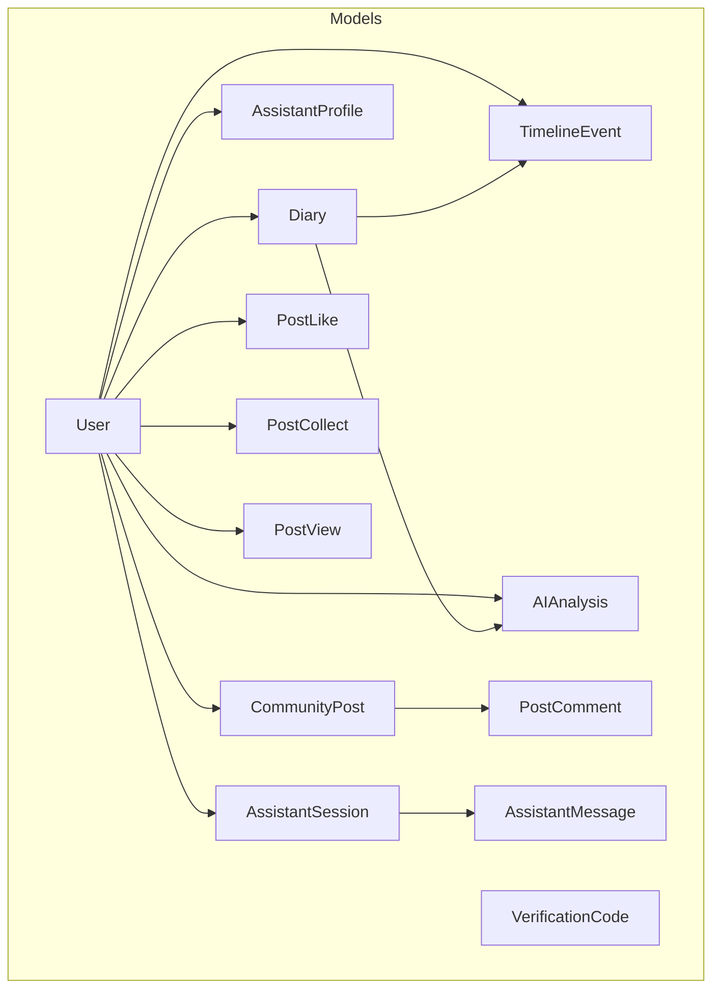
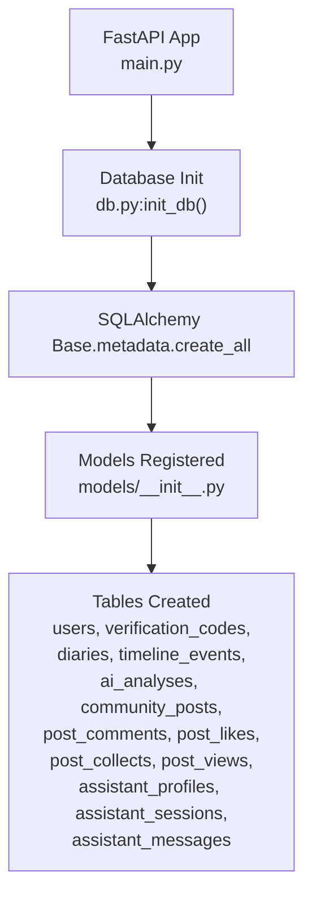
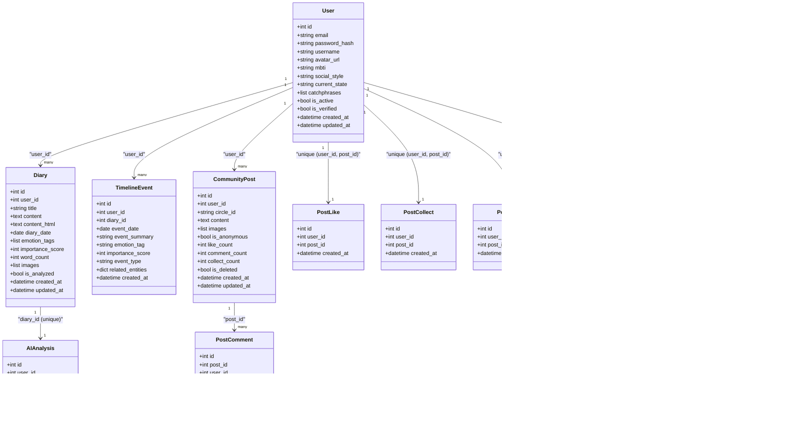
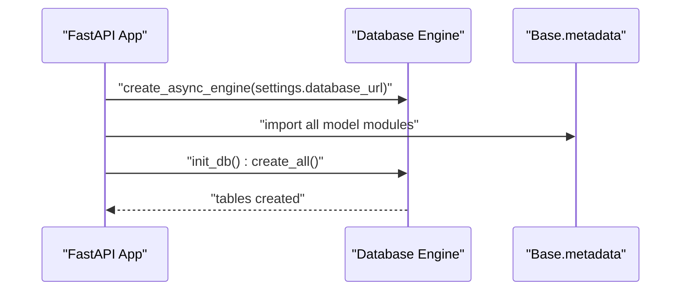
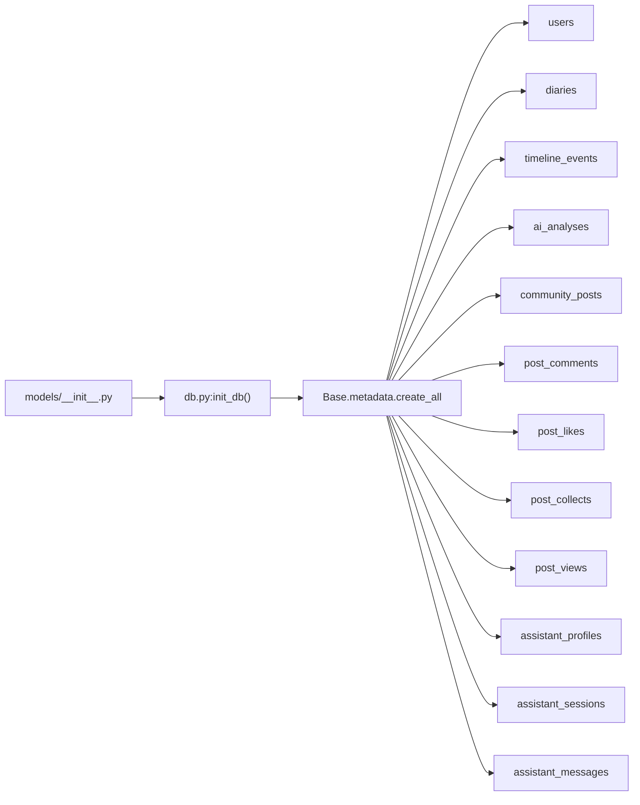

# Database Models and Schemas

<cite>
**Referenced Files in This Document**
- [models/__init__.py](file://backend/app/models/__init__.py)
- [models/database.py](file://backend/app/models/database.py)
- [models/diary.py](file://backend/app/models/diary.py)
- [models/community.py](file://backend/app/models/community.py)
- [models/assistant.py](file://backend/app/models/assistant.py)
- [schemas/__init__.py](file://backend/app/schemas/__init__.py)
- [schemas/auth.py](file://backend/app/schemas/auth.py)
- [schemas/diary.py](file://backend/app/schemas/diary.py)
- [schemas/community.py](file://backend/app/schemas/community.py)
- [schemas/ai.py](file://backend/app/schemas/ai.py)
- [db.py](file://backend/app/db.py)
- [main.py](file://backend/main.py)
</cite>

## Table of Contents
1. [Introduction](#introduction)
2. [Project Structure](#project-structure)
3. [Core Components](#core-components)
4. [Architecture Overview](#architecture-overview)
5. [Detailed Component Analysis](#detailed-component-analysis)
6. [Dependency Analysis](#dependency-analysis)
7. [Performance Considerations](#performance-considerations)
8. [Troubleshooting Guide](#troubleshooting-guide)
9. [Conclusion](#conclusion)

## Introduction
This document provides comprehensive database model documentation for the 映记 application’s SQLAlchemy ORM implementation. It covers entity relationships, field definitions, data types, validation rules, primary/foreign keys, indexes, constraints, and relationship mappings. It also documents the Pydantic schemas used for data validation, serialization, and API integration, and explains database initialization, migration patterns, indexing strategies, and query optimization techniques.

## Project Structure
The database layer is organized around SQLAlchemy declarative models grouped by domain:
- Authentication and user profiles: User, VerificationCode
- Diary and timeline: Diary, TimelineEvent, AIAnalysis, SocialPostSample, GrowthDailyInsight
- Community: CommunityPost, PostComment, PostLike, PostCollect, PostView
- Assistant: AssistantProfile, AssistantSession, AssistantMessage

These models are registered under a shared Base class and initialized at application startup.

**Diagram sources**
- [models/database.py:13-41](file://backend/app/models/database.py#L13-L41)
- [models/diary.py:29-64](file://backend/app/models/diary.py#L29-L64)
- [models/diary.py:67-99](file://backend/app/models/diary.py#L67-L99)
- [models/diary.py:102-132](file://backend/app/models/diary.py#L102-L132)
- [models/community.py:23-57](file://backend/app/models/community.py#L23-L57)
- [models/community.py:60-91](file://backend/app/models/community.py#L60-L91)
- [models/community.py:94-121](file://backend/app/models/community.py#L94-L121)
- [models/community.py:123-149](file://backend/app/models/community.py#L123-L149)
- [models/community.py:152-175](file://backend/app/models/community.py#L152-L175)
- [models/assistant.py:13-34](file://backend/app/models/assistant.py#L13-L34)
- [models/assistant.py:36-54](file://backend/app/models/assistant.py#L36-L54)
- [models/assistant.py:57-77](file://backend/app/models/assistant.py#L57-L77)

**Section sources**
- [models/__init__.py:4-7](file://backend/app/models/__init__.py#L4-L7)
- [db.py:26-58](file://backend/app/db.py#L26-L58)
- [main.py:19-42](file://backend/main.py#L19-L42)

## Core Components
This section documents the core SQLAlchemy models and their Pydantic schemas.

### User Model
- Purpose: Authentication and profile storage.
- Fields and constraints:
  - id: integer, primary key, auto-increment
  - email: string(100), unique, indexed, not null
  - password_hash: string(255), not null
  - username: string(50), optional
  - avatar_url: string(500), optional
  - mbti: string(10), optional
  - social_style: string(20), optional
  - current_state: string(20), optional
  - catchphrases: JSON array, default empty list
  - is_active: boolean, default true
  - is_verified: boolean, default false
  - created_at: datetime with timezone, server default now
  - updated_at: datetime with timezone, server default now, on update now
- Relationships:
  - One-to-many with Diary via user_id
  - One-to-many with TimelineEvent via user_id
  - One-to-one with AssistantProfile via user_id
  - One-to-many with CommunityPost via user_id
  - One-to-many with PostLike via user_id
  - One-to-many with PostCollect via user_id
  - One-to-many with PostView via user_id
- Indexes: email (unique), created_at, updated_at
- Validation rules (Pydantic): see UserResponse and ProfileUpdateRequest

**Section sources**
- [models/database.py:13-44](file://backend/app/models/database.py#L13-L44)
- [schemas/auth.py:58-74](file://backend/app/schemas/auth.py#L58-L74)
- [schemas/auth.py:77-84](file://backend/app/schemas/auth.py#L77-L84)

### Diary Model
- Purpose: Stores journal entries with metadata.
- Fields and constraints:
  - id: integer, primary key, auto-increment
  - user_id: integer, foreign key to users.id with cascade delete, indexed, not null
  - title: string(200), optional
  - content: text, not null
  - content_html: text, optional
  - diary_date: date, not null, indexed
  - emotion_tags: JSON storing list (via StringListJSON), optional
  - importance_score: integer, default 5, not null
  - word_count: integer, default 0
  - images: JSON storing list (via StringListJSON), optional
  - is_analyzed: boolean, default false
  - created_at: datetime with timezone, server default now
  - updated_at: datetime with timezone, server default now, on update now
- Relationships:
  - Many-to-one with User via user_id
  - One-to-one with AIAnalysis via diary_id (unique)
  - One-to-many with TimelineEvent via diary_id (nullable)
- Indexes: user_id, diary_date
- Validation rules (Pydantic): DiaryCreate, DiaryUpdate, DiaryResponse

**Section sources**
- [models/diary.py:29-64](file://backend/app/models/diary.py#L29-L64)
- [models/diary.py:13-27](file://backend/app/models/diary.py#L13-L27)
- [schemas/diary.py:9-33](file://backend/app/schemas/diary.py#L9-L33)
- [schemas/diary.py:35-44](file://backend/app/schemas/diary.py#L35-L44)
- [schemas/diary.py:46-64](file://backend/app/schemas/diary.py#L46-L64)

### TimelineEvent Model
- Purpose: Structured events derived from diary entries.
- Fields and constraints:
  - id: integer, primary key, auto-increment
  - user_id: integer, foreign key to users.id with cascade delete, indexed, not null
  - diary_id: integer, foreign key to diaries.id with set null, optional
  - event_date: date, not null, indexed
  - event_summary: string(500), not null
  - emotion_tag: string(50), indexed, optional
  - importance_score: integer, default 5, not null
  - event_type: string(50), optional (work/relationship/health/achievement)
  - related_entities: JSON, optional
  - created_at: datetime with timezone, server default now
- Relationships:
  - Many-to-one with User via user_id
  - Many-to-one with Diary via diary_id
- Indexes: user_id, event_date, emotion_tag
- Validation rules (Pydantic): TimelineEventCreate, TimelineEventResponse

**Section sources**
- [models/diary.py:67-99](file://backend/app/models/diary.py#L67-L99)
- [schemas/diary.py:75-84](file://backend/app/schemas/diary.py#L75-L84)
- [schemas/diary.py:86-101](file://backend/app/schemas/diary.py#L86-L101)

### AIAnalysis Model
- Purpose: Stores the latest AI analysis per diary.
- Fields and constraints:
  - id: integer, primary key, auto-increment
  - user_id: integer, foreign key to users.id with cascade delete, indexed, not null
  - diary_id: integer, foreign key to diaries.id with cascade delete, indexed, not null, unique
  - result_json: JSON, not null
  - created_at: datetime with timezone, server default now
  - updated_at: datetime with timezone, server default now, on update now
- Relationships:
  - Many-to-one with User via user_id
  - Many-to-one with Diary via diary_id
- Indexes: user_id, diary_id (unique)
- Notes: Unique constraint on diary_id ensures one analysis per diary.

**Section sources**
- [models/diary.py:102-132](file://backend/app/models/diary.py#L102-L132)

### CommunityPost Model
- Purpose: Anonymous community posts with engagement metrics.
- Fields and constraints:
  - id: integer, primary key, auto-increment
  - user_id: integer, foreign key to users.id with cascade delete, indexed, not null
  - circle_id: string(20), not null, indexed (anxiety/sadness/growth/peace/confusion)
  - content: text, not null
  - images: JSON array, default empty list
  - is_anonymous: boolean, default false
  - like_count: integer, default 0
  - comment_count: integer, default 0
  - collect_count: integer, default 0
  - is_deleted: boolean, default false
  - created_at: datetime with timezone, server default now
  - updated_at: datetime with timezone, server default now, on update now
- Relationships:
  - Many-to-one with User via user_id
  - One-to-many with PostComment via post_id
  - One-to-one with PostLike via post_id (unique constraint)
  - One-to-one with PostCollect via post_id (unique constraint)
  - One-to-many with PostView via post_id
- Indexes: user_id, circle_id
- Validation rules (Pydantic): PostCreate, PostUpdate, PostResponse

**Section sources**
- [models/community.py:23-57](file://backend/app/models/community.py#L23-L57)
- [schemas/community.py:12-24](file://backend/app/schemas/community.py#L12-L24)
- [schemas/community.py:33-50](file://backend/app/schemas/community.py#L33-L50)

### AssistantSession Model
- Purpose: Chat history sessions for the AI assistant.
- Fields and constraints:
  - id: integer, primary key, auto-increment
  - user_id: integer, foreign key to users.id with cascade delete, indexed, not null
  - title: string(120), optional
  - is_archived: boolean, default false, not null
  - created_at: datetime with timezone, server default now
  - updated_at: datetime with timezone, server default now, on update now
- Relationships:
  - Many-to-one with User via user_id
  - One-to-many with AssistantMessage via session_id
- Indexes: user_id
- Validation rules (Pydantic): none explicitly defined for session model in referenced files.

**Section sources**
- [models/assistant.py:36-54](file://backend/app/models/assistant.py#L36-L54)

### Additional Models
- AssistantProfile: One-to-one with User; stores assistant-related preferences.
- AssistantMessage: Many-to-one with User and AssistantSession; stores chat messages.
- PostComment: Many-to-one with User and CommunityPost; supports hierarchical replies.
- PostLike: Unique constraint on (user_id, post_id); tracks likes.
- PostCollect: Unique constraint on (user_id, post_id); tracks collections.
- PostView: Records views when users open post details.
- SocialPostSample: Stores user’s historical social media post samples.
- GrowthDailyInsight: Unique constraint on (user_id, insight_date); caches daily insights.

**Section sources**
- [models/assistant.py:13-34](file://backend/app/models/assistant.py#L13-L34)
- [models/assistant.py:57-77](file://backend/app/models/assistant.py#L57-L77)
- [models/community.py:60-91](file://backend/app/models/community.py#L60-L91)
- [models/community.py:94-121](file://backend/app/models/community.py#L94-L121)
- [models/community.py:123-149](file://backend/app/models/community.py#L123-L149)
- [models/community.py:152-175](file://backend/app/models/community.py#L152-L175)
- [models/diary.py:135-153](file://backend/app/models/diary.py#L135-L153)
- [models/diary.py:156-185](file://backend/app/models/diary.py#L156-L185)

## Architecture Overview
The application initializes the database at startup and registers all models under a single Base class. SQLAlchemy ORM manages relationships and cascading behavior. Pydantic schemas validate and serialize API payloads and responses.

**Diagram sources**
- [main.py:19-42](file://backend/main.py#L19-L42)
- [db.py:45-58](file://backend/app/db.py#L45-L58)
- [models/__init__.py:4-7](file://backend/app/models/__init__.py#L4-L7)

## Detailed Component Analysis

### Relationship Mapping and Constraints
- User-Diary: One-to-many; cascade delete on user deletion.
- User-TimelineEvent: One-to-many; cascade delete on user deletion.
- Diary-AIAnalysis: One-to-one via unique diary_id; cascade delete on diary deletion.
- User-CommunityPost: One-to-many; cascade delete on user deletion.
- CommunityPost-PostComment: One-to-many; cascade delete on post deletion.
- User-PostLike/PostCollect: One-to-one unique constraints on (user_id, post_id).
- User-PostView: One-to-many; records view events.
- User-AssistantProfile: One-to-one; unique user_id.
- AssistantSession-AssistantMessage: One-to-many; cascade delete on session deletion.

**Diagram sources**
- [models/database.py:13-44](file://backend/app/models/database.py#L13-L44)
- [models/diary.py:29-64](file://backend/app/models/diary.py#L29-L64)
- [models/diary.py:67-99](file://backend/app/models/diary.py#L67-L99)
- [models/diary.py:102-132](file://backend/app/models/diary.py#L102-L132)
- [models/community.py:23-57](file://backend/app/models/community.py#L23-L57)
- [models/community.py:60-91](file://backend/app/models/community.py#L60-L91)
- [models/community.py:94-121](file://backend/app/models/community.py#L94-L121)
- [models/community.py:123-149](file://backend/app/models/community.py#L123-L149)
- [models/community.py:152-175](file://backend/app/models/community.py#L152-L175)
- [models/assistant.py:13-34](file://backend/app/models/assistant.py#L13-L34)
- [models/assistant.py:36-54](file://backend/app/models/assistant.py#L36-L54)
- [models/assistant.py:57-77](file://backend/app/models/assistant.py#L57-L77)

### Pydantic Schemas for Validation and Serialization
- Authentication:
  - SendCodeRequest, VerifyCodeRequest, RegisterRequest, LoginRequest, PasswordLoginRequest
  - TokenResponse, UserResponse, ProfileUpdateRequest, UserUpdateRequest, ResetPasswordRequest
- Diary:
  - DiaryCreate, DiaryUpdate, DiaryResponse, DiaryListResponse
  - TimelineEventCreate, TimelineEventResponse
- Community:
  - PostCreate, PostUpdate, PostResponse, PostListResponse
  - CommentCreate, CommentResponse, CommentListResponse
  - CircleInfo, ViewHistoryItem, ViewHistoryResponse
- AI:
  - AnalysisRequest, ComprehensiveAnalysisRequest
  - EvidenceItem, ComprehensiveAnalysisResponse
  - DailyGuidanceResponse
  - SocialStyleSamplesRequest, SocialStyleSamplesResponse
  - TitleSuggestionRequest, TitleSuggestionResponse
  - AnalysisResponse, TimelineEventResponse, SatirAnalysisResponse, SocialPostResponse

Validation highlights:
- EmailStr for email fields
- Min/max length constraints for strings
- Numeric range checks (ge/le)
- Optional fields with defaults
- from_attributes enabled for ORM compatibility

**Section sources**
- [schemas/auth.py:10-106](file://backend/app/schemas/auth.py#L10-L106)
- [schemas/diary.py:9-101](file://backend/app/schemas/diary.py#L9-L101)
- [schemas/community.py:12-124](file://backend/app/schemas/community.py#L12-L124)
- [schemas/ai.py:9-108](file://backend/app/schemas/ai.py#L9-L108)

### Database Initialization and Migration Patterns
- Initialization:
  - Application lifecycle hook creates tables at startup by invoking Base.metadata.create_all.
  - All model modules are imported to register them with Base.metadata.
- Migration patterns:
  - No explicit Alembic migrations present in the referenced files.
  - Future migrations should be added via Alembic and applied with alembic upgrade/branch/merge commands.
  - For schema changes, define revisions and keep backward compatibility during rollouts.

**Diagram sources**
- [main.py:19-42](file://backend/main.py#L19-L42)
- [db.py:45-58](file://backend/app/db.py#L45-L58)

**Section sources**
- [db.py:45-58](file://backend/app/db.py#L45-L58)
- [main.py:19-42](file://backend/main.py#L19-L42)

## Dependency Analysis
- Model registration: All models are imported in db.init_db() to ensure they are attached to Base.metadata.
- Relationship integrity: Foreign keys enforce referential integrity; cascade and set null actions are defined per relationship.
- Indexes: Strategic indexes on frequently filtered or joined columns (email, user_id, diary_date, event_date, circle_id) improve query performance.

**Diagram sources**
- [models/__init__.py:4-7](file://backend/app/models/__init__.py#L4-L7)
- [db.py:50-58](file://backend/app/db.py#L50-L58)

**Section sources**
- [models/__init__.py:4-7](file://backend/app/models/__init__.py#L4-L7)
- [db.py:50-58](file://backend/app/db.py#L50-L58)

## Performance Considerations
- Indexing strategy:
  - Single-column indexes on foreign keys (user_id, diary_id) and frequently queried columns (email, diary_date, event_date, circle_id, emotion_tag).
  - Unique constraints where appropriate (e.g., assistant_profiles.user_id, ai_analyses.diary_id, post_likes/post_collects).
- Query optimization:
  - Use filtered queries with indexed columns (e.g., user_id, date ranges).
  - Prefer bulk operations for analytics (e.g., AIAnalysis aggregation).
  - Avoid N+1 selects by using joined eager loading for related entities when building timelines or post feeds.
- Data types:
  - JSON fields for flexible arrays/lists (catchphrases, emotion_tags, images, related_entities, result_json) enable dynamic content while maintaining schema boundaries.
- Cascading:
  - Cascade deletes on user and diary ensure data consistency but can be expensive for large datasets; batch cleanup recommended in production.

[No sources needed since this section provides general guidance]

## Troubleshooting Guide
- Database initialization errors:
  - Ensure settings.database_url is configured and reachable.
  - Confirm all model modules are imported before create_all().
- Integrity constraint violations:
  - Unique constraints: verify unique indexes (e.g., user_id+post_id for likes/collects, diary_id for AIAnalysis).
  - Foreign keys: confirm referenced rows exist before insert/update.
- Validation failures:
  - Pydantic schemas enforce field lengths, numeric ranges, and presence. Review error messages for invalid fields.
- Async session management:
  - Use get_db() dependency injection to ensure proper session lifecycle.

**Section sources**
- [db.py:45-58](file://backend/app/db.py#L45-L58)
- [schemas/auth.py:10-106](file://backend/app/schemas/auth.py#L10-L106)
- [schemas/diary.py:9-101](file://backend/app/schemas/diary.py#L9-L101)
- [schemas/community.py:12-124](file://backend/app/schemas/community.py#L12-L124)
- [schemas/ai.py:9-108](file://backend/app/schemas/ai.py#L9-L108)

## Conclusion
The 映记 application employs a well-structured SQLAlchemy ORM schema with clear relationships, constraints, and indexes. Pydantic schemas provide robust validation and serialization for API interactions. The initialization process ensures all tables are created at startup. For future enhancements, introduce Alembic-based migrations, refine indexes for workload-specific queries, and adopt bulk operations for analytics-heavy tasks.