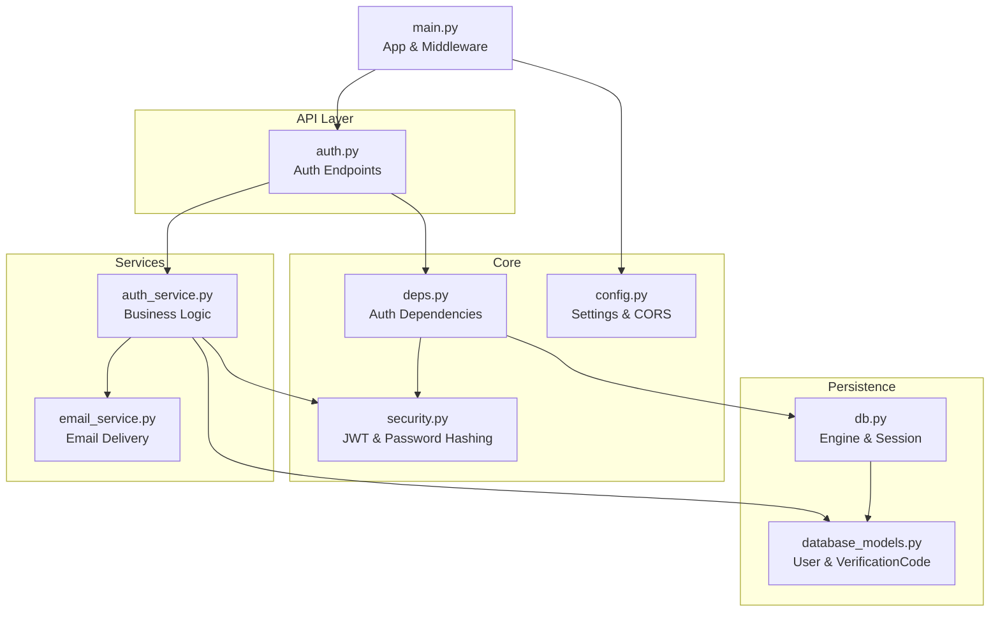
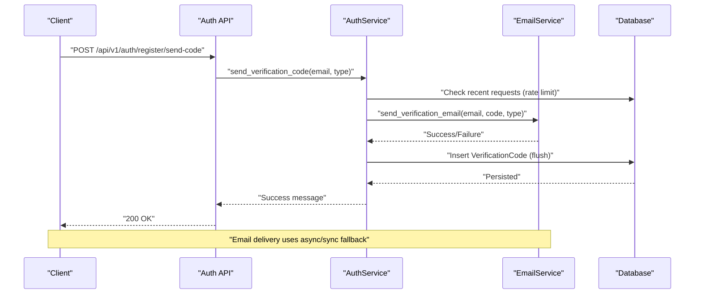
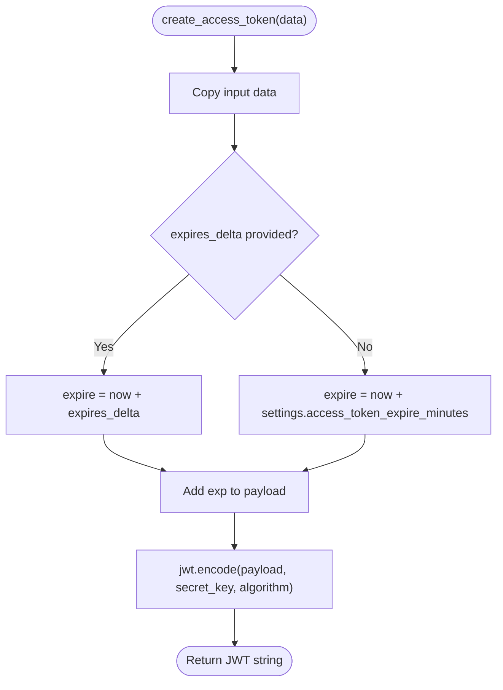
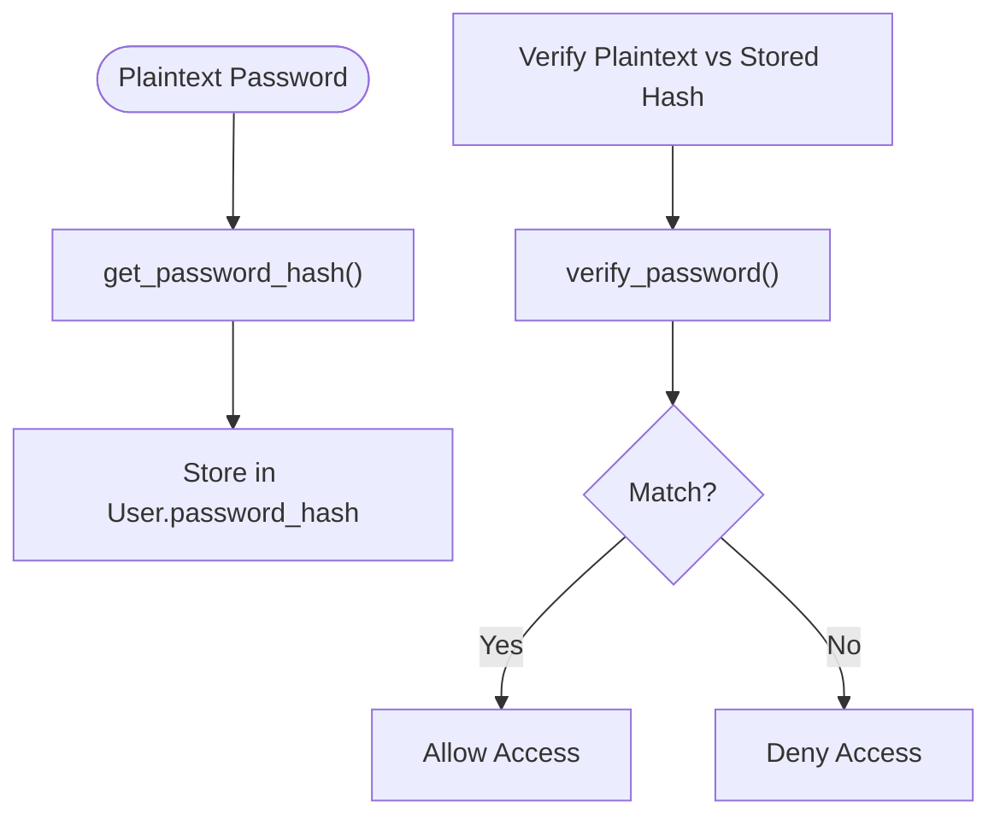
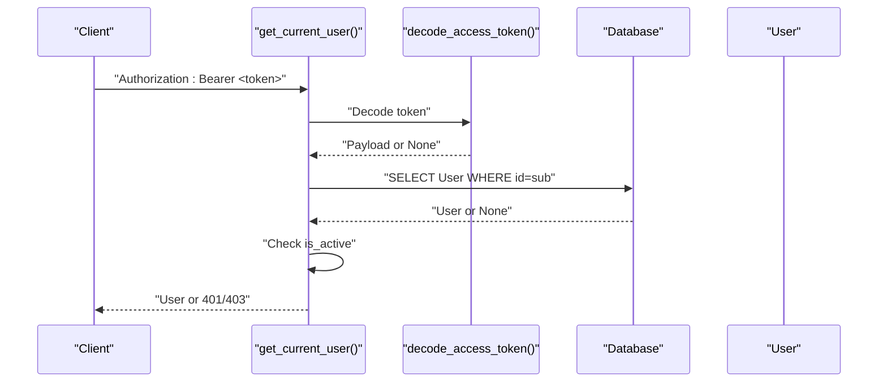
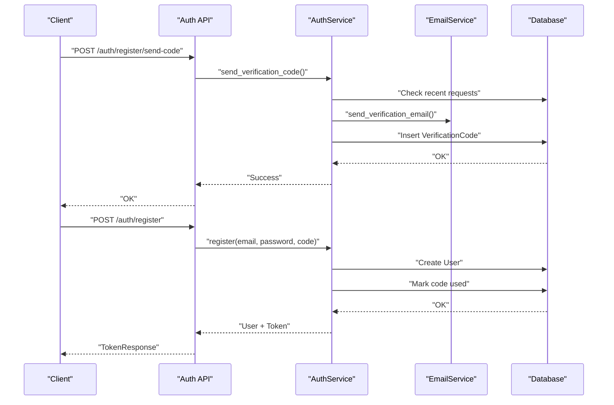
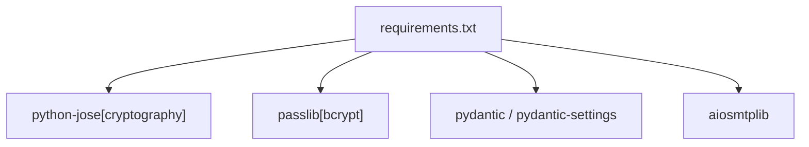

# Security and Authentication

<cite>
**Referenced Files in This Document**
- [security.py](file://backend/app/core/security.py)
- [deps.py](file://backend/app/core/deps.py)
- [auth.py](file://backend/app/api/v1/auth.py)
- [auth_service.py](file://backend/app/services/auth_service.py)
- [auth_schemas.py](file://backend/app/schemas/auth.py)
- [config.py](file://backend/app/core/config.py)
- [database_models.py](file://backend/app/models/database.py)
- [db.py](file://backend/app/db.py)
- [main.py](file://backend/main.py)
- [email_service.py](file://backend/app/services/email_service.py)
- [test_security.py](file://backend/tests/test_security.py)
- [requirements.txt](file://backend/requirements.txt)
</cite>

## Table of Contents
1. [Introduction](#introduction)
2. [Project Structure](#project-structure)
3. [Core Components](#core-components)
4. [Architecture Overview](#architecture-overview)
5. [Detailed Component Analysis](#detailed-component-analysis)
6. [Dependency Analysis](#dependency-analysis)
7. [Performance Considerations](#performance-considerations)
8. [Troubleshooting Guide](#troubleshooting-guide)
9. [Conclusion](#conclusion)
10. [Appendices](#appendices)

## Introduction
This document provides comprehensive security and authentication documentation for the Yinji application. It covers JWT token implementation, password hashing, session management, access control patterns, dependency injection for authentication, security middleware, CORS configuration, rate limiting, input validation, SQL injection prevention, authentication flows (email verification, password reset, session management), authorization patterns, and security best practices. It also addresses common vulnerabilities, security headers, and secure deployment considerations.

## Project Structure
The security and authentication implementation spans several modules:
- Core security utilities for JWT encoding/decoding and password hashing
- Dependency injection for authentication and request tracing
- API endpoints for authentication flows
- Service layer implementing business logic for registration, login, and password reset
- Database models for users and verification codes
- Configuration for JWT, CORS, and rate limiting
- Email service for sending verification emails
- Tests validating security utilities and input validation

**Diagram sources**
- [main.py:1-119](file://backend/main.py#L1-L119)
- [security.py:1-92](file://backend/app/core/security.py#L1-L92)
- [deps.py:1-103](file://backend/app/core/deps.py#L1-L103)
- [auth.py:1-316](file://backend/app/api/v1/auth.py#L1-L316)
- [auth_service.py:1-358](file://backend/app/services/auth_service.py#L1-L358)
- [email_service.py:1-226](file://backend/app/services/email_service.py#L1-L226)
- [database_models.py:1-70](file://backend/app/models/database.py#L1-L70)
- [db.py:1-59](file://backend/app/db.py#L1-L59)
- [config.py:1-105](file://backend/app/core/config.py#L1-L105)

**Section sources**
- [main.py:1-119](file://backend/main.py#L1-L119)
- [config.py:1-105](file://backend/app/core/config.py#L1-L105)

## Core Components
- JWT Utilities: Secure token creation and decoding with expiration handling
- Password Hashing: bcrypt-based hashing via passlib
- Dependency Injection: get_current_user and get_current_active_user for protected routes
- Rate Limiting: per-user verification code requests enforced in the service layer
- Input Validation: Pydantic schemas for request payloads
- Email Service: asynchronous verification email delivery with fallback
- CORS Configuration: configurable origins and credentials support

**Section sources**
- [security.py:16-92](file://backend/app/core/security.py#L16-L92)
- [deps.py:18-103](file://backend/app/core/deps.py#L18-L103)
- [auth_service.py:19-98](file://backend/app/services/auth_service.py#L19-L98)
- [auth_schemas.py:10-106](file://backend/app/schemas/auth.py#L10-L106)
- [email_service.py:25-226](file://backend/app/services/email_service.py#L25-L226)
- [main.py:50-57](file://backend/main.py#L50-L57)

## Architecture Overview
The authentication architecture follows a layered approach:
- API endpoints validate inputs via Pydantic schemas
- Services handle business logic, including rate limiting and database transactions
- Security utilities manage JWT and password hashing
- Database models persist users and verification codes
- Dependency injection enforces authentication and authorization at route level
- CORS middleware controls cross-origin access

**Diagram sources**
- [auth.py:25-54](file://backend/app/api/v1/auth.py#L25-L54)
- [auth_service.py:19-98](file://backend/app/services/auth_service.py#L19-L98)
- [email_service.py:48-155](file://backend/app/services/email_service.py#L48-L155)
- [database_models.py:47-70](file://backend/app/models/database.py#L47-L70)

## Detailed Component Analysis

### JWT Token Implementation
- Creation: Encodes user identity and sets expiration based on configuration
- Decoding: Validates signature and algorithm, returning payload or None
- Expiration: Controlled by settings for access tokens

**Diagram sources**
- [security.py:43-71](file://backend/app/core/security.py#L43-L71)
- [config.py:28-38](file://backend/app/core/config.py#L28-L38)

**Section sources**
- [security.py:43-92](file://backend/app/core/security.py#L43-L92)
- [config.py:28-38](file://backend/app/core/config.py#L28-L38)

### Password Hashing
- Uses bcrypt via passlib CryptContext
- Hashes stored in the User model
- Verification compares plaintext against stored hash

**Diagram sources**
- [security.py:16-41](file://backend/app/core/security.py#L16-L41)
- [database_models.py:13-44](file://backend/app/models/database.py#L13-L44)

**Section sources**
- [security.py:16-41](file://backend/app/core/security.py#L16-L41)
- [database_models.py:13-44](file://backend/app/models/database.py#L13-L44)

### Session Management and Access Control
- Bearer token authentication enforced via HTTPBearer
- get_current_user resolves user from JWT payload and validates active status
- get_current_active_user ensures user is active for protected routes
- Logout is client-side (no server-side invalidation)

**Diagram sources**
- [deps.py:18-66](file://backend/app/core/deps.py#L18-L66)
- [security.py:73-92](file://backend/app/core/security.py#L73-L92)
- [database_models.py:13-44](file://backend/app/models/database.py#L13-L44)

**Section sources**
- [deps.py:18-89](file://backend/app/core/deps.py#L18-L89)
- [auth.py:278-295](file://backend/app/api/v1/auth.py#L278-L295)

### Authentication Flows
- Registration with code verification
- Login via code or password
- Password reset via code
- Email verification and rate limiting

**Diagram sources**
- [auth.py:25-125](file://backend/app/api/v1/auth.py#L25-L125)
- [auth_service.py:19-200](file://backend/app/services/auth_service.py#L19-L200)
- [email_service.py:48-155](file://backend/app/services/email_service.py#L48-L155)
- [database_models.py:47-70](file://backend/app/models/database.py#L47-L70)

**Section sources**
- [auth.py:25-275](file://backend/app/api/v1/auth.py#L25-L275)
- [auth_service.py:19-341](file://backend/app/services/auth_service.py#L19-L341)

### Authorization Patterns
- Route-level protection using get_current_active_user
- Active user enforcement prevents access for disabled accounts
- No role-based permissions are implemented; access control is user-based

**Section sources**
- [deps.py:69-89](file://backend/app/core/deps.py#L69-L89)
- [auth.py:278-295](file://backend/app/api/v1/auth.py#L278-L295)

### Security Utilities
- JWT encoding/decoding and password hashing utilities
- Centralized configuration for secret key, algorithm, and expiration
- Input validation via Pydantic schemas

**Section sources**
- [security.py:16-92](file://backend/app/core/security.py#L16-L92)
- [auth_schemas.py:10-106](file://backend/app/schemas/auth.py#L10-L106)
- [config.py:28-38](file://backend/app/core/config.py#L28-L38)

### Dependency Injection for Authentication
- get_current_user: extracts token from Authorization header, decodes JWT, loads user from DB, checks active status
- get_current_active_user: enforces active user requirement
- get_trace_id: retrieves optional tracing header for logging correlation

**Section sources**
- [deps.py:18-103](file://backend/app/core/deps.py#L18-L103)

### Security Middleware and CORS
- CORS configured with allowed origins, credentials, methods, and headers
- Origins parsed from settings; supports development and production domains

**Section sources**
- [main.py:50-57](file://backend/main.py#L50-L57)
- [config.py:17-20](file://backend/app/core/config.py#L17-L20)
- [config.py:97-100](file://backend/app/core/config.py#L97-L100)

### Rate Limiting
- Per-user verification code requests limited to a fixed number per time window
- Enforced in the service layer before inserting verification codes
- Frequency checks prevent abuse during registration, login, and password reset

**Section sources**
- [auth_service.py:36-51](file://backend/app/services/auth_service.py#L36-L51)
- [config.py:52-60](file://backend/app/core/config.py#L52-L60)

### Input Validation and SQL Injection Prevention
- Pydantic schemas define strict field types, lengths, and formats
- Database queries use SQLAlchemy ORM with parameterized statements
- No raw SQL concatenation observed; SQL injection risks mitigated

**Section sources**
- [auth_schemas.py:10-106](file://backend/app/schemas/auth.py#L10-L106)
- [auth_service.py:19-98](file://backend/app/services/auth_service.py#L19-L98)
- [database_models.py:13-70](file://backend/app/models/database.py#L13-L70)

### Email Service and Security
- Asynchronous email delivery with aiosmtplib; fallback to synchronous smtplib
- SSL/TLS support configurable; secure SMTP ports handled
- Verification emails include type-specific subjects and content

**Section sources**
- [email_service.py:25-226](file://backend/app/services/email_service.py#L25-L226)

### Testing Security Utilities
- Password hashing correctness and bcrypt characteristics verified
- JWT token creation, decoding, and expiration validated
- Input validation failures tested for invalid emails, codes, and passwords

**Section sources**
- [test_security.py:15-164](file://backend/tests/test_security.py#L15-L164)

## Dependency Analysis
External dependencies relevant to security:
- python-jose[cryptography]: JWT encoding/decoding
- passlib[bcrypt]: password hashing
- pydantic/pydantic-settings: schema validation and settings management
- aiosmtplib: asynchronous SMTP transport

**Diagram sources**
- [requirements.txt:12-26](file://backend/requirements.txt#L12-L26)

**Section sources**
- [requirements.txt:12-26](file://backend/requirements.txt#L12-L26)

## Performance Considerations
- JWT decoding and bcrypt verification are CPU-bound; keep token payloads minimal
- Asynchronous email delivery reduces latency; fallback to synchronous ensures reliability
- Database queries use indexed fields (email, verification code) to minimize lookup time
- Consider adding token blacklisting or refresh token rotation for enhanced security and scalability

## Troubleshooting Guide
Common issues and resolutions:
- Authentication failures: Ensure Authorization header includes Bearer token; verify token is unexpired and signed with correct secret key
- Password errors: Confirm bcrypt hash matches; verify password meets minimum length requirements
- Email delivery failures: Check SMTP configuration and credentials; verify network connectivity
- Rate limit exceeded: Wait for cooldown period or reduce request frequency
- CORS errors: Verify allowed origins match client domain and protocol

**Section sources**
- [deps.py:35-66](file://backend/app/core/deps.py#L35-L66)
- [auth_service.py:36-51](file://backend/app/services/auth_service.py#L36-L51)
- [email_service.py:120-155](file://backend/app/services/email_service.py#L120-L155)
- [main.py:50-57](file://backend/main.py#L50-L57)

## Conclusion
The Yinji application implements a robust authentication and security framework centered on JWT-based bearer tokens, bcrypt password hashing, strict input validation, and rate-limited email verification. Dependency injection ensures consistent authentication across routes, while CORS and email services support secure client-server communication. Adhering to the outlined best practices and monitoring the troubleshooting guide will help maintain a secure deployment.

## Appendices

### Security Best Practices
- Rotate JWT secret keys periodically and store securely
- Enforce HTTPS in production and configure secure cookies if using sessions
- Implement token refresh mechanisms and consider short-lived access tokens with long-lived refresh tokens
- Add request throttling at the gateway level for public endpoints
- Regularly audit logs for suspicious activities and failed authentication attempts
- Keep dependencies updated to address security vulnerabilities

### Secure Deployment Checklist
- Set environment variables for secrets (JWT secret, SMTP credentials)
- Configure allowed origins for production domains only
- Enable database connection pooling and limit concurrent connections
- Monitor rate-limiting thresholds and adjust as needed
- Back up database regularly and encrypt sensitive data at rest