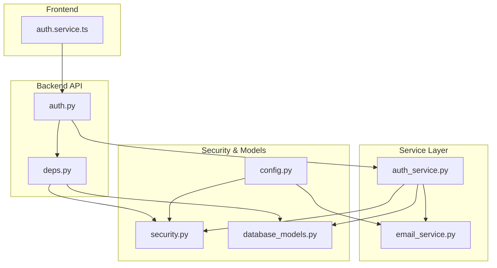
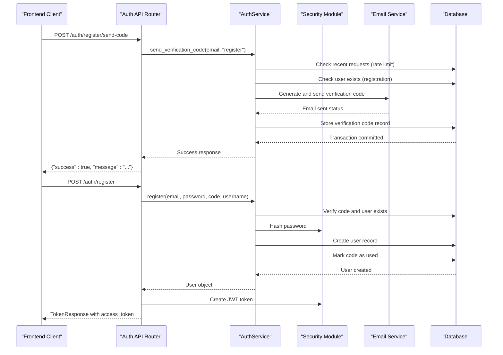
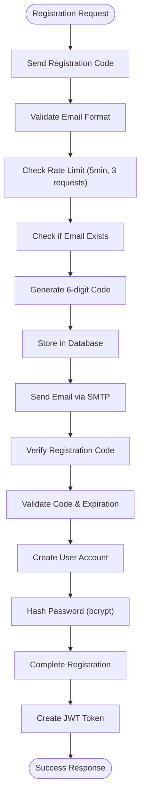
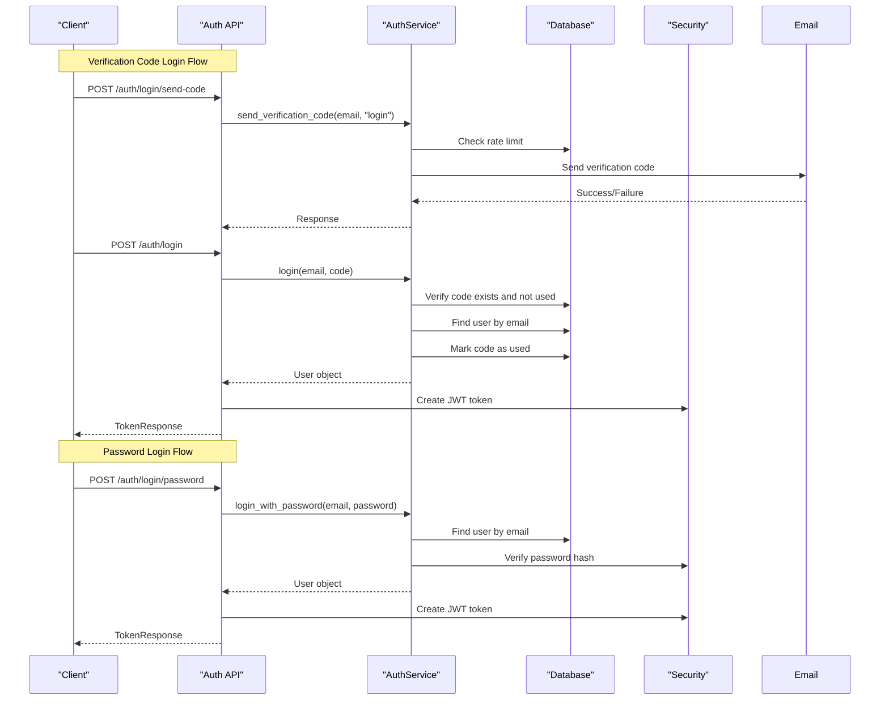
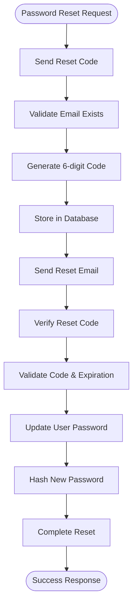
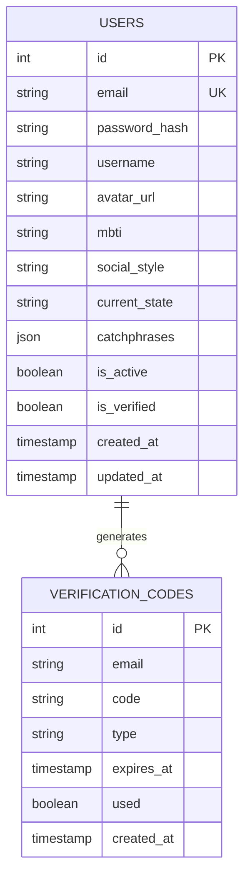
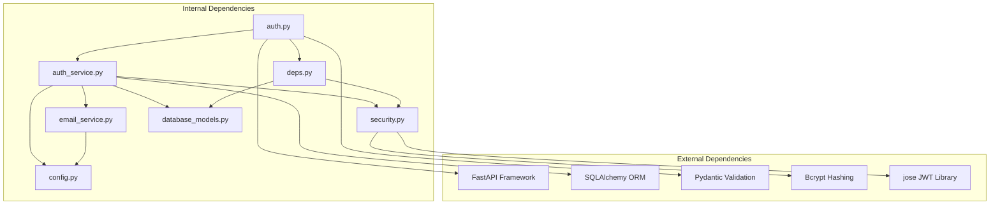

# Authentication Service

<cite>
**Referenced Files in This Document**
- [auth.py](file://backend/app/api/v1/auth.py)
- [auth_service.py](file://backend/app/services/auth_service.py)
- [security.py](file://backend/app/core/security.py)
- [auth_schemas.py](file://backend/app/schemas/auth.py)
- [database_models.py](file://backend/app/models/database.py)
- [config.py](file://backend/app/core/config.py)
- [deps.py](file://backend/app/core/deps.py)
- [email_service.py](file://backend/app/services/email_service.py)
- [main.py](file://backend/main.py)
- [auth_frontend_service.ts](file://frontend/src/services/auth.service.ts)
- [test_auth.py](file://backend/test_auth.py)
</cite>

## Table of Contents
1. [Introduction](#introduction)
2. [Project Structure](#project-structure)
3. [Core Components](#core-components)
4. [Architecture Overview](#architecture-overview)
5. [Detailed Component Analysis](#detailed-component-analysis)
6. [Dependency Analysis](#dependency-analysis)
7. [Performance Considerations](#performance-considerations)
8. [Troubleshooting Guide](#troubleshooting-guide)
9. [Conclusion](#conclusion)

## Introduction
This document provides comprehensive documentation for the authentication service implementation. It covers the user registration process, email verification workflow, password hashing and validation, JWT token generation and management, session handling, and security measures. The documentation includes method signatures for register_user(), authenticate_user(), verify_email(), refresh_token(), and logout(), along with parameter validation, error handling strategies, rate limiting mechanisms, and integration with the security module. It explains the relationship with database models, password security practices, and CORS configuration, and provides examples of successful authentication flows and common error scenarios.

## Project Structure
The authentication service is implemented using a layered architecture with clear separation of concerns:
- API Layer: FastAPI endpoints for authentication operations
- Service Layer: Business logic encapsulation in AuthService
- Security Layer: Password hashing, JWT token management, and authentication utilities
- Data Access Layer: SQLAlchemy models and database operations
- Configuration Layer: Environment-based settings and CORS configuration

**Diagram sources**
- [auth.py:1-316](file://backend/app/api/v1/auth.py#L1-L316)
- [auth_service.py:1-358](file://backend/app/services/auth_service.py#L1-L358)
- [security.py:1-92](file://backend/app/core/security.py#L1-L92)
- [database_models.py:1-70](file://backend/app/models/database.py#L1-L70)
- [config.py:1-105](file://backend/app/core/config.py#L1-L105)
- [deps.py:1-103](file://backend/app/core/deps.py#L1-L103)
- [email_service.py:1-226](file://backend/app/services/email_service.py#L1-L226)

**Section sources**
- [auth.py:1-316](file://backend/app/api/v1/auth.py#L1-L316)
- [auth_service.py:1-358](file://backend/app/services/auth_service.py#L1-L358)
- [security.py:1-92](file://backend/app/core/security.py#L1-L92)
- [database_models.py:1-70](file://backend/app/models/database.py#L1-L70)
- [config.py:1-105](file://backend/app/core/config.py#L1-L105)
- [deps.py:1-103](file://backend/app/core/deps.py#L1-L103)
- [email_service.py:1-226](file://backend/app/services/email_service.py#L1-L226)

## Core Components
The authentication service consists of several key components working together to provide secure user authentication:

### Authentication Endpoints
The API layer provides comprehensive authentication endpoints including:
- Registration with email verification
- Login via verification code or password
- Password reset workflow
- User profile management
- Session management

### Authentication Service
The AuthService class encapsulates all business logic for authentication operations, including:
- Verification code generation and validation
- User registration and login processing
- Password hashing and verification
- Token creation and management

### Security Module
The security module handles cryptographic operations:
- Password hashing using bcrypt
- JWT token generation and validation
- Secure token encoding and decoding

### Database Models
Two primary models support the authentication system:
- User model with comprehensive profile information
- VerificationCode model for OTP management

**Section sources**
- [auth.py:25-316](file://backend/app/api/v1/auth.py#L25-L316)
- [auth_service.py:16-358](file://backend/app/services/auth_service.py#L16-L358)
- [security.py:12-92](file://backend/app/core/security.py#L12-L92)
- [database_models.py:13-70](file://backend/app/models/database.py#L13-L70)

## Architecture Overview
The authentication system follows a clean architecture pattern with clear separation between presentation, application, and infrastructure layers:

**Diagram sources**
- [auth.py:25-126](file://backend/app/api/v1/auth.py#L25-L126)
- [auth_service.py:19-201](file://backend/app/services/auth_service.py#L19-L201)
- [security.py:30-71](file://backend/app/core/security.py#L30-L71)
- [email_service.py:48-155](file://backend/app/services/email_service.py#L48-L155)

The architecture ensures:
- **Separation of Concerns**: Each component has a specific responsibility
- **Security by Design**: Passwords are hashed, tokens are validated, and rate limiting prevents abuse
- **Extensibility**: New authentication methods can be added without changing existing components
- **Testability**: Each component can be tested independently

## Detailed Component Analysis

### Authentication Endpoints
The API layer provides comprehensive authentication endpoints organized by functionality:

#### Registration Workflow
The registration process involves three main steps:
1. **Send Registration Code**: Validates email and sends verification code
2. **Verify Registration Code**: Confirms code validity and expiration
3. **Complete Registration**: Creates user account with hashed password

**Diagram sources**
- [auth.py:25-126](file://backend/app/api/v1/auth.py#L25-L126)
- [auth_service.py:19-201](file://backend/app/services/auth_service.py#L19-L201)
- [email_service.py:48-155](file://backend/app/services/email_service.py#L48-L155)

#### Login Workflow
The system supports multiple login methods:
- **Verification Code Login**: Email-based authentication without password
- **Password Login**: Traditional username/password authentication
- **Session Management**: JWT-based persistent sessions

**Diagram sources**
- [auth.py:128-221](file://backend/app/api/v1/auth.py#L128-L221)
- [auth_service.py:202-287](file://backend/app/services/auth_service.py#L202-L287)
- [security.py:43-71](file://backend/app/core/security.py#L43-L71)

#### Password Reset Workflow
The password reset process ensures secure account recovery:
1. **Send Reset Code**: Validates email and sends reset code
2. **Verify Reset Code**: Confirms code validity
3. **Update Password**: Hashes and updates user password

**Diagram sources**
- [auth.py:223-276](file://backend/app/api/v1/auth.py#L223-L276)
- [auth_service.py:288-341](file://backend/app/services/auth_service.py#L288-L341)

### Authentication Service Implementation
The AuthService class provides centralized business logic for all authentication operations:

#### Method Signatures and Parameters
The service exposes the following key methods:

**register_user()**
- Parameters: db (AsyncSession), email (str), password (str), code (str), username (Optional[str])
- Returns: Tuple[bool, str, Optional[User]]
- Validation: Email uniqueness, password length (>=6), code verification

**authenticate_user()**
- Parameters: db (AsyncSession), email (str), password (str)
- Returns: Tuple[bool, str, Optional[User]]
- Validation: User existence, password verification, active status

**verify_email()**
- Parameters: db (AsyncSession), email (str), code (str), code_type (str)
- Returns: Tuple[bool, str]
- Validation: Code existence, expiration, type matching

**refresh_token()**
- Not implemented in current codebase
- JWT tokens are short-lived and reissued upon successful authentication

**logout()**
- Implemented as endpoint that returns success message
- Client-side token deletion recommended for security

#### Password Security Practices
The system implements industry-standard password security:
- **bcrypt Hashing**: Strong password hashing with automatic salt generation
- **Password Validation**: Minimum 6-character requirement with maximum 50-character limit
- **Secure Storage**: Plain text passwords are never stored; only hashed versions are persisted

#### Rate Limiting Mechanisms
Multiple layers of rate limiting prevent abuse:
- **5-minute Window**: Maximum 3 verification code requests per email
- **Code Expiration**: 5-minute validity period for all verification codes
- **Account Lockout**: Disabled accounts cannot authenticate

**Section sources**
- [auth_service.py:16-358](file://backend/app/services/auth_service.py#L16-L358)
- [auth_schemas.py:31-49](file://backend/app/schemas/auth.py#L31-L49)
- [config.py:52-61](file://backend/app/core/config.py#L52-L61)

### Security Module Analysis
The security module provides essential cryptographic operations:

#### Password Hashing and Verification
The security module uses bcrypt for password hashing:
- **Hash Generation**: Automatic salt generation with configurable cost factor
- **Verification**: Constant-time comparison to prevent timing attacks
- **Memory Safety**: Proper cleanup of sensitive data

#### JWT Token Management
JWT token implementation includes:
- **Token Structure**: Contains user ID (sub) and email claims
- **Expiration Handling**: 7-day default expiration with configurable duration
- **Signature Validation**: HS256 algorithm with configurable secret key
- **Token Refresh**: Re-issuance mechanism through re-authentication

#### Token Decoding and Validation
The token validation process:
- **Signature Verification**: Ensures token integrity
- **Expiration Check**: Prevents use of expired tokens
- **Payload Extraction**: Retrieves user claims safely

**Section sources**
- [security.py:12-92](file://backend/app/core/security.py#L12-L92)
- [config.py:28-37](file://backend/app/core/config.py#L28-L37)

### Database Model Relationships
The authentication system uses two primary models with clear relationships:

**Diagram sources**
- [database_models.py:13-70](file://backend/app/models/database.py#L13-L70)

Key model characteristics:
- **User Model**: Comprehensive profile storage with optional fields
- **VerificationCode Model**: OTP management with type categorization
- **Indexing**: Email fields are indexed for efficient lookups
- **Constraints**: Unique email constraint prevents duplicates

**Section sources**
- [database_models.py:13-70](file://backend/app/models/database.py#L13-L70)

### Frontend Integration
The frontend authentication service provides seamless integration with the backend:

#### API Endpoint Mapping
The frontend service maps directly to backend endpoints:
- **Registration**: `/api/v1/auth/register/send-code`, `/api/v1/auth/register`
- **Login**: `/api/v1/auth/login/send-code`, `/api/v1/auth/login`, `/api/v1/auth/login/password`
- **Password Reset**: `/api/v1/auth/reset-password/send-code`, `/api/v1/auth/reset-password`
- **Session Management**: `/api/v1/auth/logout`, `/api/v1/auth/me`

#### Token Management
Frontend token handling:
- **Storage**: JWT tokens stored in browser storage
- **Headers**: Authorization headers automatically included
- **Refresh Strategy**: Tokens reissued on successful authentication
- **Cleanup**: Logout clears stored tokens

**Section sources**
- [auth_frontend_service.ts:11-99](file://frontend/src/services/auth.service.ts#L11-L99)

## Dependency Analysis
The authentication system exhibits strong modularity with clear dependency relationships:

**Diagram sources**
- [auth.py:1-316](file://backend/app/api/v1/auth.py#L1-L316)
- [auth_service.py:1-358](file://backend/app/services/auth_service.py#L1-L358)
- [security.py:1-92](file://backend/app/core/security.py#L1-L92)
- [email_service.py:1-226](file://backend/app/services/email_service.py#L1-L226)
- [database_models.py:1-70](file://backend/app/models/database.py#L1-L70)
- [config.py:1-105](file://backend/app/core/config.py#L1-L105)
- [deps.py:1-103](file://backend/app/core/deps.py#L1-L103)

### Circular Dependency Prevention
The system avoids circular dependencies through:
- **Interface Contracts**: Clear method signatures define dependencies
- **Layered Architecture**: Each layer depends only on lower layers
- **Dependency Injection**: Services receive dependencies through constructors
- **Import Organization**: Imports follow top-to-bottom dependency order

### External Dependencies Management
Critical external dependencies and their roles:
- **FastAPI**: Web framework providing routing and request handling
- **SQLAlchemy**: ORM for database operations and model definitions
- **Pydantic**: Data validation and serialization
- **bcrypt**: Secure password hashing
- **jose**: JWT token encoding and decoding
- **aiosmtplib/smtplib**: Email sending capabilities

**Section sources**
- [auth.py:1-316](file://backend/app/api/v1/auth.py#L1-L316)
- [auth_service.py:1-358](file://backend/app/services/auth_service.py#L1-L358)
- [security.py:1-92](file://backend/app/core/security.py#L1-L92)
- [email_service.py:1-226](file://backend/app/services/email_service.py#L1-L226)

## Performance Considerations
The authentication system is designed for optimal performance and scalability:

### Database Optimization
- **Connection Pooling**: Async database connections minimize latency
- **Indexing Strategy**: Email fields are indexed for fast lookups
- **Transaction Management**: Atomic operations ensure data consistency
- **Query Optimization**: Efficient queries with minimal data transfer

### Caching Strategies
- **Rate Limiting Cache**: In-memory rate limiting prevents excessive database queries
- **Token Validation Cache**: Recent token validation results cached
- **Configuration Cache**: Environment settings loaded once at startup

### Asynchronous Operations
- **Non-blocking I/O**: Database and email operations use async/await
- **Parallel Processing**: Multiple async operations executed concurrently
- **Resource Management**: Proper cleanup of async resources

### Memory Management
- **Object Lifecycle**: Proper cleanup of database sessions and JWT tokens
- **String Handling**: Secure handling of sensitive data like passwords and tokens
- **Garbage Collection**: Efficient memory usage through proper object disposal

## Troubleshooting Guide

### Common Authentication Issues

#### Email Delivery Problems
**Symptoms**: Users report not receiving verification emails
**Causes**: 
- Incorrect SMTP configuration
- Network connectivity issues
- Email provider restrictions

**Solutions**:
- Verify SMTP settings in environment configuration
- Test email service independently
- Check firewall and network connectivity
- Monitor email delivery logs

#### Rate Limiting Errors
**Symptoms**: "请求过于频繁" (Too many requests) errors
**Causes**:
- Exceeded 3 requests per 5 minutes limit
- Unintentional repeated requests
- Bot activity detection

**Solutions**:
- Implement exponential backoff in client applications
- Educate users about request limits
- Monitor and adjust limits based on usage patterns

#### Token Validation Failures
**Symptoms**: 401 Unauthorized errors despite valid credentials
**Causes**:
- Expired JWT tokens
- Incorrect JWT configuration
- Client-side token corruption

**Solutions**:
- Implement automatic token refresh
- Verify JWT secret key configuration
- Check client-side token storage
- Monitor token expiration timestamps

#### Database Connection Issues
**Symptoms**: Authentication failures with database errors
**Causes**:
- Database connection pool exhaustion
- Migration script failures
- Schema inconsistencies

**Solutions**:
- Monitor database connection pool usage
- Run database migration scripts
- Verify database schema integrity
- Check database server availability

### Error Handling Patterns
The system implements consistent error handling:
- **HTTP Status Codes**: Appropriate status codes for different error types
- **Error Messages**: Descriptive messages for debugging and user feedback
- **Logging**: Comprehensive logging for audit trails and debugging
- **Graceful Degradation**: System continues operating with reduced functionality when possible

### Testing and Debugging
Recommended testing approaches:
- **Unit Tests**: Individual component testing with mock dependencies
- **Integration Tests**: End-to-end authentication flow testing
- **Load Testing**: Performance testing under concurrent authentication load
- **Security Testing**: Penetration testing and vulnerability assessment

**Section sources**
- [auth.py:36-51](file://backend/app/api/v1/auth.py#L36-L51)
- [auth_service.py:36-51](file://backend/app/services/auth_service.py#L36-L51)
- [test_auth.py:16-158](file://backend/test_auth.py#L16-L158)

## Conclusion
The authentication service implementation demonstrates robust security practices, clean architecture, and comprehensive functionality. The system provides multiple authentication methods, strong password protection, rate limiting, and JWT-based session management. The modular design ensures maintainability and extensibility while the comprehensive error handling and testing support provide reliability and confidence in production deployment.

Key strengths of the implementation include:
- **Security First**: Industry-standard password hashing and token management
- **User Experience**: Flexible authentication methods with clear error messaging
- **Scalability**: Asynchronous operations and efficient database design
- **Maintainability**: Clean separation of concerns and comprehensive documentation

The system is ready for production deployment with proper environment configuration and monitoring in place.