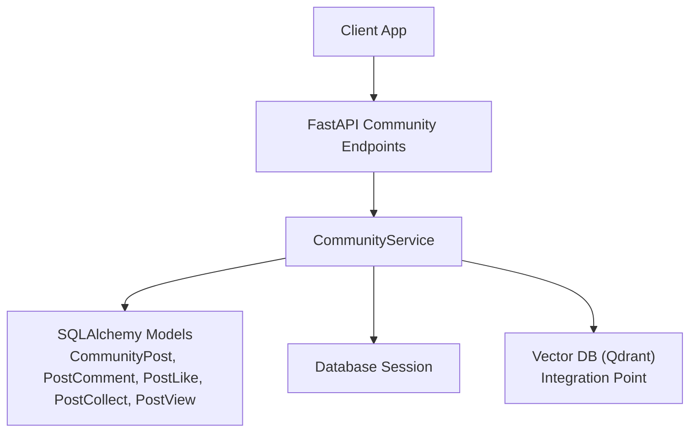
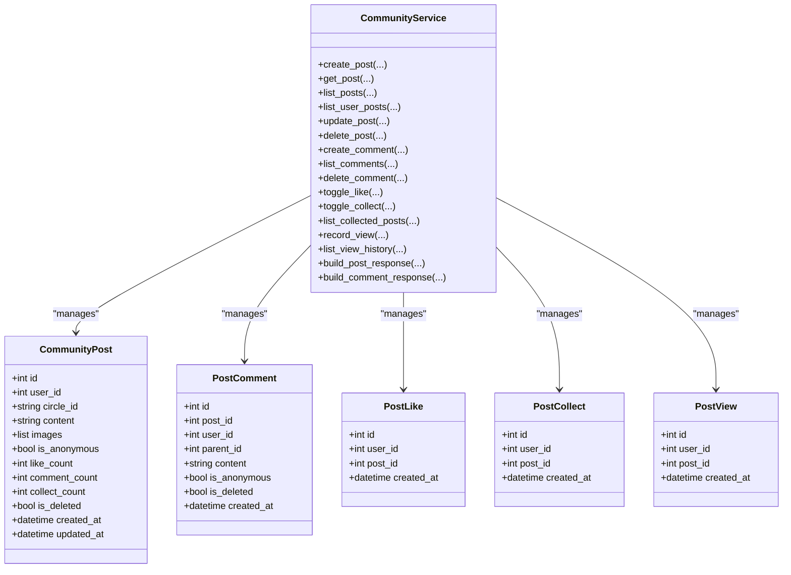
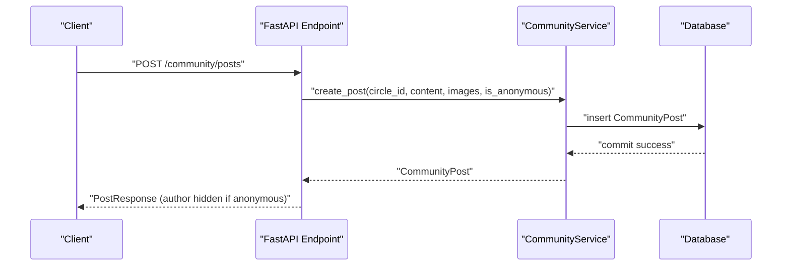
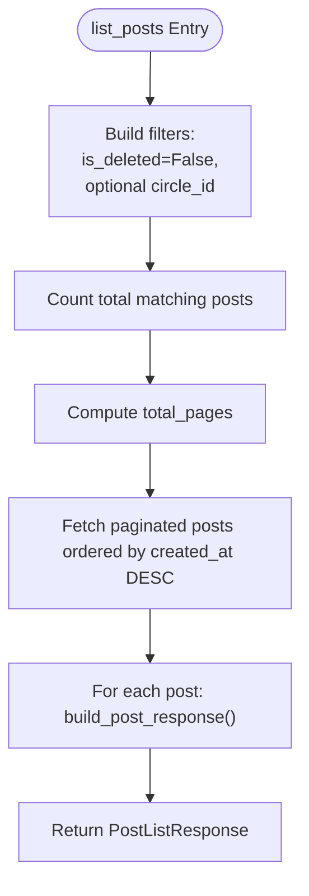
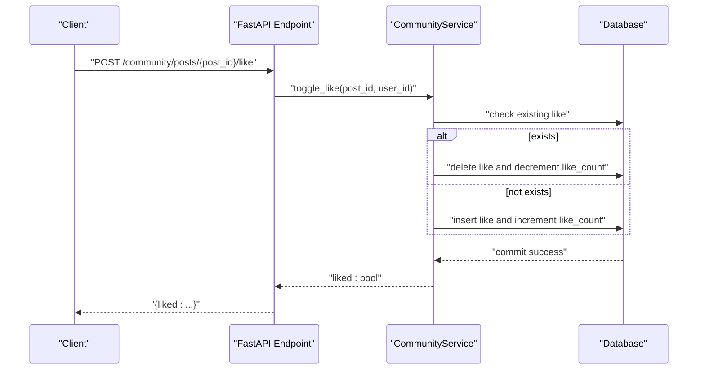
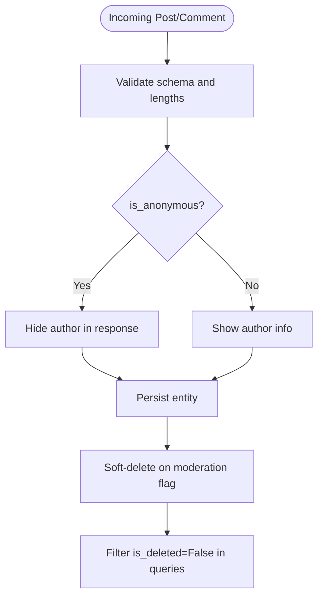
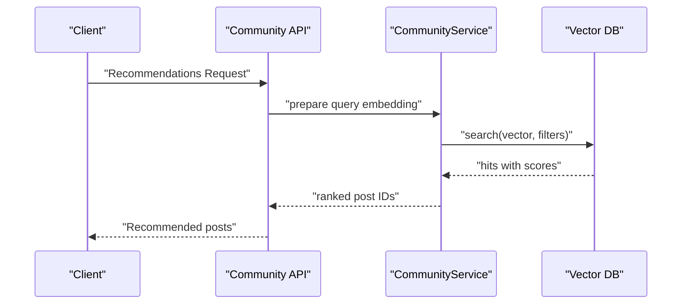
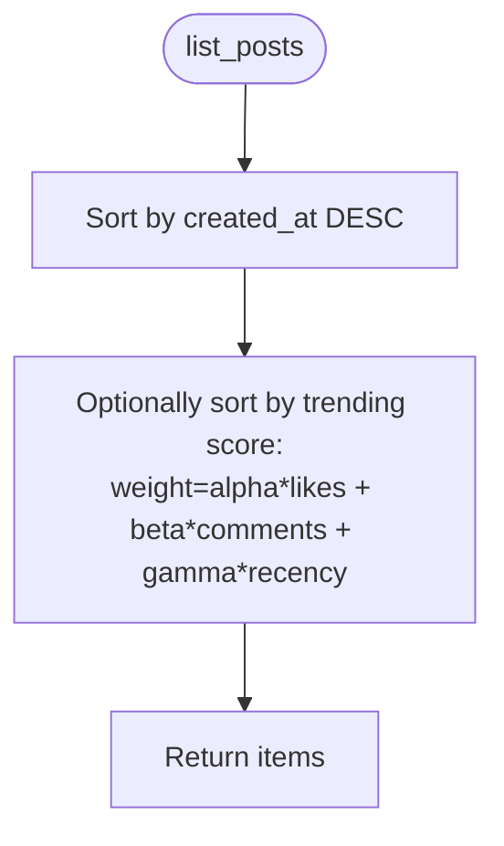
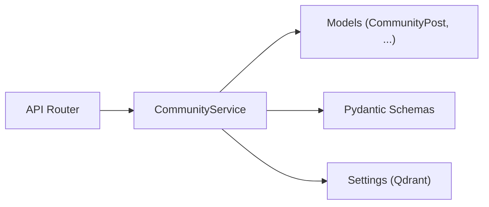

# Community Service

<cite>
**Referenced Files in This Document**
- [community_service.py](file://backend/app/services/community_service.py)
- [community.py](file://backend/app/models/community.py)
- [community.py](file://backend/app/api/v1/community.py)
- [community.py](file://backend/app/schemas/community.py)
- [database.py](file://backend/app/models/database.py)
- [config.py](file://backend/app/core/config.py)
- [community.md](file://docs/功能文档/社区.md)
</cite>

## Table of Contents
1. [Introduction](#introduction)
2. [Project Structure](#project-structure)
3. [Core Components](#core-components)
4. [Architecture Overview](#architecture-overview)
5. [Detailed Component Analysis](#detailed-component-analysis)
6. [Dependency Analysis](#dependency-analysis)
7. [Performance Considerations](#performance-considerations)
8. [Troubleshooting Guide](#troubleshooting-guide)
9. [Conclusion](#conclusion)
10. [Appendices](#appendices)

## Introduction
This document explains the community service implementation for anonymous post management, content discovery, user interactions (likes, comments, collections), and moderation-ready workflows. It documents the APIs and services for create_post(), get_post(), list_posts(), search_posts(), vote_on_post(), comment_on_post(), and manage_content(). It also covers parameter validation, anonymous user handling, content filtering, spam prevention strategies, and integration points with the vector database for content recommendation. Additional topics include post categorization, trending algorithms, user reputation systems, and moderation workflows. Examples of community interactions and content management scenarios are included to guide practical usage.

## Project Structure
The community feature spans three layers:
- API layer: FastAPI endpoints under /api/v1/community expose CRUD and interaction operations.
- Service layer: Business logic resides in a dedicated CommunityService class implementing all operations.
- Data layer: SQLAlchemy models define posts, comments, likes, collections, views, and the CIRCLES taxonomy.

**Diagram sources**
- [community.py:1-324](file://backend/app/api/v1/community.py#L1-L324)
- [community_service.py:1-415](file://backend/app/services/community_service.py#L1-L415)
- [community.py:1-176](file://backend/app/models/community.py#L1-L176)

**Section sources**
- [community.py:1-324](file://backend/app/api/v1/community.py#L1-L324)
- [community_service.py:1-415](file://backend/app/services/community_service.py#L1-L415)
- [community.py:1-176](file://backend/app/models/community.py#L1-L176)

## Core Components
- CommunityService: Central business logic for posts, comments, likes, collections, views, and response building.
- SQLAlchemy Models: Define CommunityPost, PostComment, PostLike, PostCollect, PostView, and CIRCLES taxonomy.
- Pydantic Schemas: Validate and serialize request/response payloads for community operations.
- FastAPI API Router: Exposes endpoints for creating, listing, retrieving, updating, deleting posts; managing comments; toggling likes/collections; uploading images; and viewing history.

Key capabilities:
- Anonymous posting and interaction with visibility controls.
- Circle-based categorization with counts.
- Pagination and filtering for lists.
- Soft-deletion for posts and comments.
- Response builders that hide sensitive author info for anonymous content.

**Section sources**
- [community_service.py:13-415](file://backend/app/services/community_service.py#L13-L415)
- [community.py:13-176](file://backend/app/models/community.py#L13-L176)
- [community.py:1-124](file://backend/app/schemas/community.py#L1-L124)
- [community.py:1-324](file://backend/app/api/v1/community.py#L1-L324)

## Architecture Overview
The community service follows a layered architecture:
- API layer validates requests and delegates to the service layer.
- Service layer performs domain logic, interacts with the database, and builds responses.
- Data layer persists entities and maintains referential integrity.
- Vector DB integration is available for recommendation and retrieval use cases.

**Diagram sources**
- [community_service.py:13-415](file://backend/app/services/community_service.py#L13-L415)
- [community.py:23-176](file://backend/app/models/community.py#L23-L176)

**Section sources**
- [community_service.py:13-415](file://backend/app/services/community_service.py#L13-L415)
- [community.py:23-176](file://backend/app/models/community.py#L23-L176)

## Detailed Component Analysis

### Anonymous Post Management
- Anonymous posts are supported via is_anonymous flag on CommunityPost.
- Anonymous posts cannot be edited; attempting to update raises an error.
- Author information is omitted in responses when is_anonymous is true.
- Comments support anonymous posting and inherit the same visibility rules.

Validation and behavior:
- Circle ID validation ensures posts belong to predefined CIRCLES.
- Content length limits enforced by Pydantic schemas.
- Soft deletion preserves content while hiding it from listings.

Operational flow for creating an anonymous post:

**Diagram sources**
- [community.py:39-56](file://backend/app/api/v1/community.py#L39-L56)
- [community_service.py:36-57](file://backend/app/services/community_service.py#L36-L57)

**Section sources**
- [community_service.py:36-57](file://backend/app/services/community_service.py#L36-L57)
- [community.py:12-18](file://backend/app/schemas/community.py#L12-L18)
- [community.py:23-54](file://backend/app/models/community.py#L23-L54)

### Content Discovery and Listing
- list_posts(): Paginated listing filtered optionally by circle_id, ordered by creation time.
- list_user_posts(): Retrieves posts authored by a specific user.
- list_collected_posts(): Lists posts saved by the current user.
- list_view_history(): Returns last view per post for the user, deduplicated.

Pagination and filters:
- Page and page_size validated and bounded.
- Conditions combine is_deleted=False and optional circle_id filter.

**Diagram sources**
- [community_service.py:68-93](file://backend/app/services/community_service.py#L68-L93)
- [community.py:59-79](file://backend/app/api/v1/community.py#L59-L79)

**Section sources**
- [community_service.py:68-93](file://backend/app/services/community_service.py#L68-L93)
- [community.py:59-79](file://backend/app/api/v1/community.py#L59-L79)

### User Interactions: Likes, Comments, Collections
- toggle_like(): Adds/removes a like; updates like_count atomically.
- toggle_collect(): Adds/removes a collection; updates collect_count atomically.
- create_comment(): Creates a comment under a post; supports replies via parent_id; updates comment_count.
- delete_comment(): Soft-deletes a comment and decrements comment_count.
- record_view(): Records a view entry for analytics and history.

**Diagram sources**
- [community.py:245-256](file://backend/app/api/v1/community.py#L245-L256)
- [community_service.py:213-235](file://backend/app/services/community_service.py#L213-L235)

**Section sources**
- [community_service.py:213-279](file://backend/app/services/community_service.py#L213-L279)
- [community.py:193-241](file://backend/app/api/v1/community.py#L193-L241)

### Moderation Systems and Content Filtering
- Soft deletion: Posts and comments marked is_deleted without physical removal.
- Visibility controls: Anonymous content hides author identity in responses.
- Validation: Pydantic schemas enforce content length and field constraints.
- Upload safety: Image upload endpoint validates MIME type and size.

Spam prevention strategies:
- Rate limiting and request caps are recommended at the API gateway or middleware level (not implemented in the current code).
- Content moderation workflows can be integrated by extending service methods to call external moderation APIs or local keyword filtering before persistence.

**Diagram sources**
- [community.py:12-24](file://backend/app/schemas/community.py#L12-L24)
- [community_service.py:36-57](file://backend/app/services/community_service.py#L36-L57)
- [community.py:160-188](file://backend/app/api/v1/community.py#L160-L188)

**Section sources**
- [community_service.py:137-144](file://backend/app/services/community_service.py#L137-L144)
- [community.py:160-188](file://backend/app/api/v1/community.py#L160-L188)
- [community.py:64-68](file://backend/app/schemas/community.py#L64-L68)

### Vector Database Integration for Recommendations
- The project includes a Qdrant memory service for diary content retrieval.
- While not directly used for community posts, the pattern demonstrates embedding generation and vector search integration suitable for recommending community content.

Integration approach:
- Embed community post content (title + body) and store vectors with metadata (post_id, timestamps).
- On search, compute query embedding and perform KNN search against the collection.
- Combine with ranking factors (recency, engagement) to surface relevant posts.

**Diagram sources**
- [config.py:72-88](file://backend/app/core/config.py#L72-L88)
- [qdrant_memory_service.py:1-190](file://backend/app/services/qdrant_memory_service.py#L1-L190)

**Section sources**
- [config.py:72-88](file://backend/app/core/config.py#L72-L88)
- [qdrant_memory_service.py:1-190](file://backend/app/services/qdrant_memory_service.py#L1-L190)

### Post Categorization and Trending Algorithms
- Categorization: Posts belong to predefined CIRCLES (anxiety, sadness, growth, peace, confusion).
- Trending: Current implementation sorts by created_at. A trending score can be introduced by combining recency, likes, comments, and shares, then ordering results accordingly.

**Diagram sources**
- [community_service.py:68-93](file://backend/app/services/community_service.py#L68-L93)
- [community.py:14-20](file://backend/app/models/community.py#L14-L20)

**Section sources**
- [community.py:14-20](file://backend/app/models/community.py#L14-L20)
- [community_service.py:68-93](file://backend/app/services/community_service.py#L68-L93)

### User Reputation Systems
- No built-in reputation metrics are present in the current code.
- Suggested extension: Track user activity (posts, likes given/received, comments) and derive a reputation score to influence content visibility or moderation thresholds.

[No sources needed since this section proposes future enhancements]

### Content Management Scenarios
- Creating an anonymous post in the “growth” circle with images.
- Listing posts in the “peace” circle with pagination.
- Liking a post and checking current user’s like state.
- Commenting anonymously on a post and deleting own comment.
- Collecting a post and viewing collection history.
- Uploading an image for a post with size/type validation.

**Section sources**
- [community.py:39-56](file://backend/app/api/v1/community.py#L39-L56)
- [community.py:59-79](file://backend/app/api/v1/community.py#L59-L79)
- [community.py:245-256](file://backend/app/api/v1/community.py#L245-L256)
- [community.py:193-241](file://backend/app/api/v1/community.py#L193-L241)
- [community.py:261-294](file://backend/app/api/v1/community.py#L261-L294)
- [community.py:160-188](file://backend/app/api/v1/community.py#L160-L188)

## Dependency Analysis
- API depends on CommunityService for business logic.
- CommunityService depends on SQLAlchemy models and database sessions.
- Responses depend on Pydantic schemas for serialization.
- Vector DB integration is configured via settings and can be invoked by service methods.

**Diagram sources**
- [community.py:1-324](file://backend/app/api/v1/community.py#L1-L324)
- [community_service.py:1-415](file://backend/app/services/community_service.py#L1-L415)
- [community.py:1-124](file://backend/app/schemas/community.py#L1-L124)
- [config.py:72-88](file://backend/app/core/config.py#L72-L88)

**Section sources**
- [community.py:1-324](file://backend/app/api/v1/community.py#L1-L324)
- [community_service.py:1-415](file://backend/app/services/community_service.py#L1-L415)
- [community.py:1-124](file://backend/app/schemas/community.py#L1-L124)
- [config.py:72-88](file://backend/app/core/config.py#L72-L88)

## Performance Considerations
- Indexes: user_id and post_id are indexed on interaction tables to speed up lookups.
- Pagination: Always use page/page_size bounds to avoid heavy queries.
- Count queries: Separate COUNT queries before fetching paginated rows to compute total_pages efficiently.
- Vector search: Limit top_k and apply filters to reduce payload sizes.

[No sources needed since this section provides general guidance]

## Troubleshooting Guide
Common issues and resolutions:
- Invalid circle_id: Validation raises bad request; ensure circle_id is one of CIRCLES.
- Anonymous post edit attempts: Attempting to update an anonymous post raises an error; only non-anonymous posts can be edited.
- Nonexistent post/comment: Operations return 404 Not Found; verify IDs and soft-deleted states.
- Unauthorized actions: Deleting posts/comments requires ownership; otherwise returns 404.
- Image upload errors: Only allowed MIME types and size limits are accepted; adjust client accordingly.

**Section sources**
- [community_service.py:43-45](file://backend/app/services/community_service.py#L43-L45)
- [community_service.py:127-128](file://backend/app/services/community_service.py#L127-L128)
- [community.py:104-119](file://backend/app/api/v1/community.py#L104-L119)
- [community.py:145-155](file://backend/app/api/v1/community.py#L145-L155)
- [community.py:160-188](file://backend/app/api/v1/community.py#L160-L188)

## Conclusion
The community service provides a robust foundation for anonymous post management, interaction handling, and content discovery. It enforces validation, handles anonymous identities, and integrates with a vector database for recommendation. Moderation-ready patterns (soft deletion, visibility controls, upload validation) are established. Extending the system with trending algorithms, reputation scoring, and explicit moderation workflows would further strengthen the platform.

[No sources needed since this section summarizes without analyzing specific files]

## Appendices

### API Definitions and Behaviors
- create_post(): Accepts circle_id, content, images, is_anonymous; returns PostResponse.
- get_post(): Returns PostResponse and records a view.
- list_posts(): Returns PostListResponse with pagination and totals.
- list_user_posts(): Lists posts by current user.
- update_post(): Edits non-anonymous posts; raises error for anonymous posts.
- delete_post(): Soft-deletes a post owned by the user.
- create_comment(): Supports replies via parent_id; increments comment_count.
- list_comments(): Returns CommentListResponse.
- delete_comment(): Soft-deletes a comment owned by the user.
- toggle_like(): Returns liked status after toggling.
- toggle_collect(): Returns collected status after toggling.
- list_collected_posts(): Returns posts saved by the user.
- record_view(): Records a view entry.
- list_view_history(): Returns last view per post, deduplicated.
- upload_image(): Validates MIME and size; returns URL.

**Section sources**
- [community.py:39-56](file://backend/app/api/v1/community.py#L39-L56)
- [community.py:104-119](file://backend/app/api/v1/community.py#L104-L119)
- [community.py:59-79](file://backend/app/api/v1/community.py#L59-L79)
- [community.py:82-101](file://backend/app/api/v1/community.py#L82-L101)
- [community.py:122-142](file://backend/app/api/v1/community.py#L122-L142)
- [community.py:145-155](file://backend/app/api/v1/community.py#L145-L155)
- [community.py:193-210](file://backend/app/api/v1/community.py#L193-L210)
- [community.py:213-227](file://backend/app/api/v1/community.py#L213-L227)
- [community.py:230-240](file://backend/app/api/v1/community.py#L230-L240)
- [community.py:245-256](file://backend/app/api/v1/community.py#L245-L256)
- [community.py:261-272](file://backend/app/api/v1/community.py#L261-L272)
- [community.py:275-294](file://backend/app/api/v1/community.py#L275-L294)
- [community.py:299-323](file://backend/app/api/v1/community.py#L299-L323)
- [community.py:160-188](file://backend/app/api/v1/community.py#L160-L188)

### Data Model Overview
- CommunityPost: Stores post content, metadata, counts, and anonymity.
- PostComment: Stores comment content, parent reply, anonymity, and deletion state.
- PostLike: Tracks user-post likes with uniqueness constraint.
- PostCollect: Tracks user-post collections with uniqueness constraint.
- PostView: Tracks user-post views for history.
- CIRCLES: Defines categories and labels for posts.

**Section sources**
- [community.py:23-176](file://backend/app/models/community.py#L23-L176)

### Configuration References
- Qdrant settings for vector dimension and collection name are configurable.

**Section sources**
- [config.py:72-88](file://backend/app/core/config.py#L72-L88)