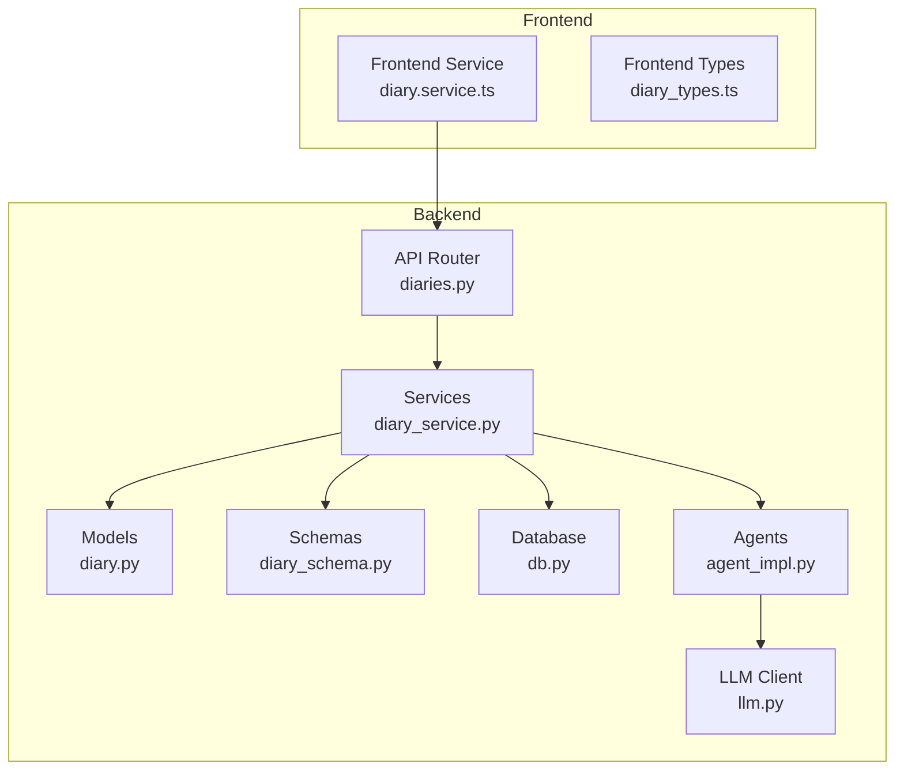
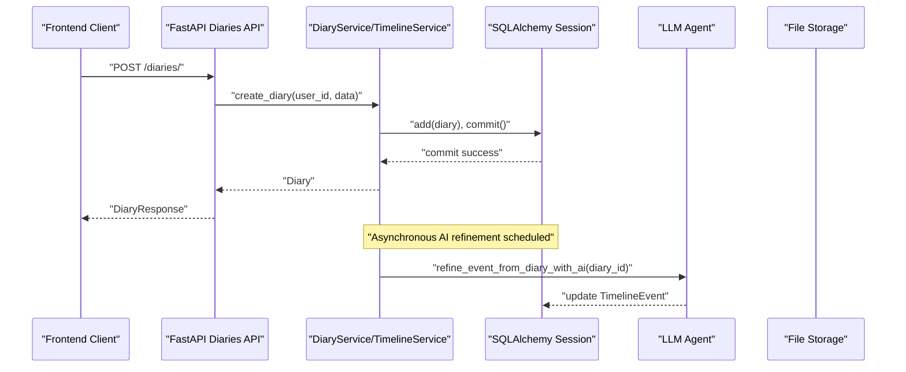
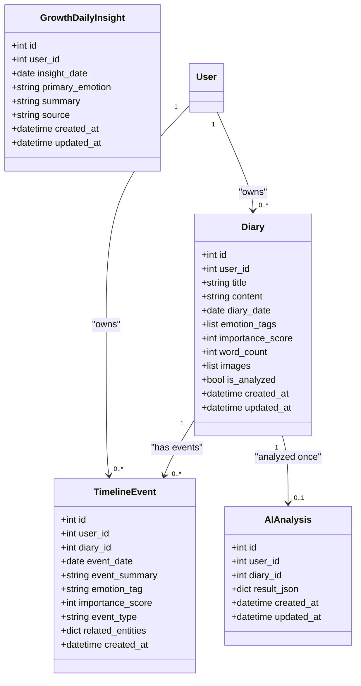
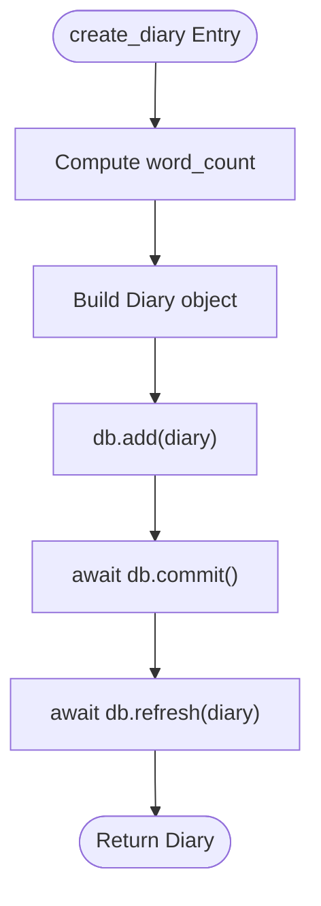
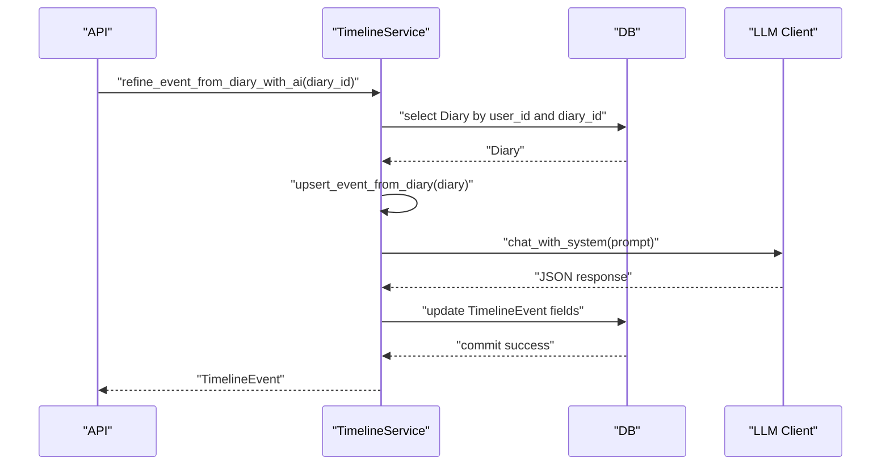
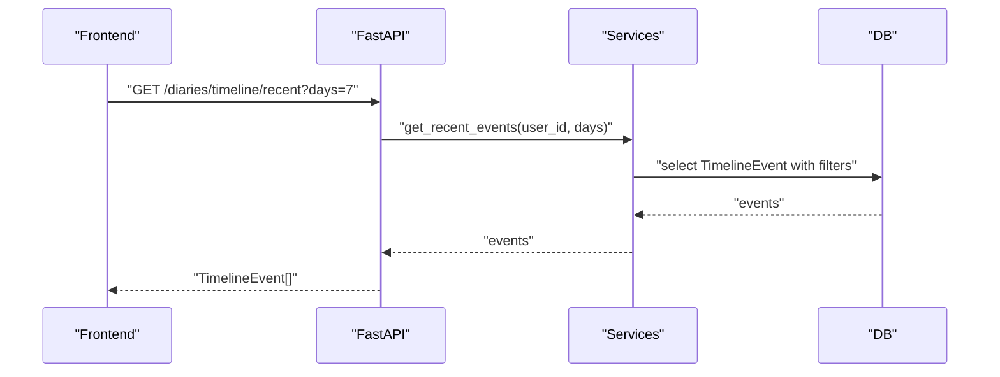
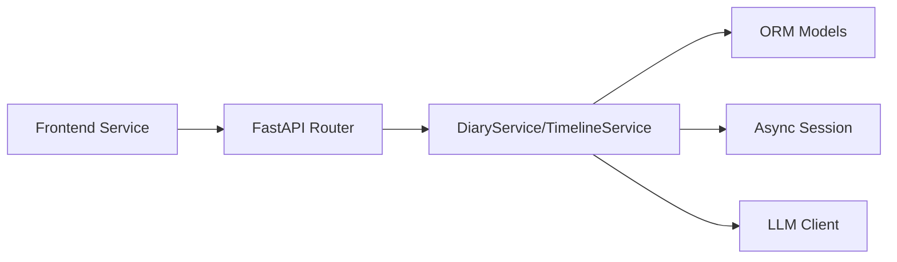

# Diary Service

<cite>
**Referenced Files in This Document**
- [diary_service.py](file://backend/app/services/diary_service.py)
- [diaries.py](file://backend/app/api/v1/diaries.py)
- [diary.py](file://backend/app/models/diary.py)
- [diary_schema.py](file://backend/app/schemas/diary.py)
- [db.py](file://backend/app/db.py)
- [llm.py](file://backend/app/agents/llm.py)
- [agent_impl.py](file://backend/app/agents/agent_impl.py)
- [diary.service.ts](file://frontend/src/services/diary.service.ts)
- [diary_types.ts](file://frontend/src/types/diary.ts)
</cite>

## Table of Contents
1. [Introduction](#introduction)
2. [Project Structure](#project-structure)
3. [Core Components](#core-components)
4. [Architecture Overview](#architecture-overview)
5. [Detailed Component Analysis](#detailed-component-analysis)
6. [Dependency Analysis](#dependency-analysis)
7. [Performance Considerations](#performance-considerations)
8. [Troubleshooting Guide](#troubleshooting-guide)
9. [Conclusion](#conclusion)
10. [Appendices](#appendices)

## Introduction
This document provides comprehensive technical documentation for the Diary Service, covering all CRUD operations for diary entries, timeline event processing, emotion tagging, and content management. It explains parameter validation, content sanitization, image upload handling, emotion scoring, and timeline event extraction. It also details integration with the agent system for AI analysis, database transactions, and file storage management. Practical examples of diary creation workflows, timeline processing, and common use cases are included to help developers and operators implement and troubleshoot the service effectively.

## Project Structure
The Diary Service spans backend Python services, FastAPI endpoints, SQLAlchemy models, Pydantic schemas, and frontend TypeScript services. The backend integrates with an AI agent system for advanced analysis and timeline refinement.

**Diagram sources**
- [diaries.py:1-491](file://backend/app/api/v1/diaries.py#L1-491)
- [diary_service.py:66-637](file://backend/app/services/diary_service.py#L66-637)
- [diary.py:1-186](file://backend/app/models/diary.py#L1-186)
- [diary_schema.py:1-101](file://backend/app/schemas/diary.py#L1-101)
- [db.py:1-59](file://backend/app/db.py#L1-59)
- [agent_impl.py:1-484](file://backend/app/agents/agent_impl.py#L1-484)
- [llm.py:1-220](file://backend/app/agents/llm.py#L1-220)
- [diary.service.ts:1-112](file://frontend/src/services/diary.service.ts#L1-112)
- [diary_types.ts:1-128](file://frontend/src/types/diary.ts#L1-128)

**Section sources**
- [diaries.py:1-491](file://backend/app/api/v1/diaries.py#L1-491)
- [diary_service.py:66-637](file://backend/app/services/diary_service.py#L66-637)
- [diary.py:1-186](file://backend/app/models/diary.py#L1-186)
- [diary_schema.py:1-101](file://backend/app/schemas/diary.py#L1-101)
- [db.py:1-59](file://backend/app/db.py#L1-59)
- [agent_impl.py:1-484](file://backend/app/agents/agent_impl.py#L1-484)
- [llm.py:1-220](file://backend/app/agents/llm.py#L1-220)
- [diary.service.ts:1-112](file://frontend/src/services/diary.service.ts#L1-112)
- [diary_types.ts:1-128](file://frontend/src/types/diary.ts#L1-128)

## Core Components
- DiaryService: Implements CRUD operations for diary entries, including create, read, update, delete, list, and date-based retrieval. Handles word count updates and basic validation.
- TimelineService: Manages timeline events derived from diary entries, including automatic creation/upsert, AI refinement, rebuilding events, and timeline queries.
- API Router (diaries.py): Exposes FastAPI endpoints for diary CRUD, timeline queries, image upload, and growth insights. Orchestrates asynchronous AI refinement tasks.
- Models (diary.py): Defines SQLAlchemy ORM models for Diary, TimelineEvent, AIAnalysis, SocialPostSample, and GrowthDailyInsight.
- Schemas (diary_schema.py): Provides Pydantic models for request/response validation and serialization.
- Database (db.py): Configures async SQLAlchemy engine and session factory.
- Agents & LLM (agent_impl.py, llm.py): Integrates AI analysis for timeline extraction and growth insights, with robust JSON parsing and fallbacks.

Key capabilities:
- Parameter validation via Pydantic validators and FastAPI dependency injection.
- Content sanitization through safe text helpers and JSON parsing utilities.
- Image upload handling with file type and size checks.
- Emotion scoring and event type inference from diary content.
- Timeline event extraction and AI-driven refinement.
- Integration with agent system for advanced analysis and growth insights.

**Section sources**
- [diary_service.py:66-637](file://backend/app/services/diary_service.py#L66-637)
- [diaries.py:55-491](file://backend/app/api/v1/diaries.py#L55-491)
- [diary.py:29-186](file://backend/app/models/diary.py#L29-186)
- [diary_schema.py:9-101](file://backend/app/schemas/diary.py#L9-101)
- [db.py:11-43](file://backend/app/db.py#L11-43)
- [agent_impl.py:25-484](file://backend/app/agents/agent_impl.py#L25-484)
- [llm.py:13-220](file://backend/app/agents/llm.py#L13-220)

## Architecture Overview
The Diary Service follows a layered architecture:
- API Layer: FastAPI endpoints handle requests, validate inputs, and delegate to services.
- Service Layer: Business logic for diary and timeline operations, including AI integration.
- Persistence Layer: SQLAlchemy ORM models and async sessions manage database transactions.
- Agent Layer: AI clients and agents process content for timeline extraction and insights.

**Diagram sources**
- [diaries.py:55-183](file://backend/app/api/v1/diaries.py#L55-183)
- [diary_service.py:69-105](file://backend/app/services/diary_service.py#L69-105)
- [llm.py:68-92](file://backend/app/agents/llm.py#L68-92)

**Section sources**
- [diaries.py:55-183](file://backend/app/api/v1/diaries.py#L55-183)
- [diary_service.py:69-105](file://backend/app/services/diary_service.py#L69-105)
- [llm.py:68-92](file://backend/app/agents/llm.py#L68-92)

## Detailed Component Analysis

### Diary CRUD Operations
- create_diary(user_id, diary_data): Creates a new diary entry, computes word count, and persists it. Returns the created entity.
- get_diary(diary_id, user_id): Retrieves a specific diary owned by the user.
- update_diary(diary_id, user_id, diary_data): Updates an existing diary, recalculating word count if content changes.
- delete_diary(diary_id, user_id): Removes a diary owned by the user.
- list_diaries(user_id, filters): Lists diaries with pagination and optional date/emotion filtering.
- get_diaries_by_date(user_id, target_date): Fetches all diaries for a given date.

Validation and sanitization:
- Pydantic validators enforce content length and default date assignment.
- Safe text helpers strip whitespace and guard against empty inputs.
- JSON parsing utilities robustly extract structured data from AI responses.

Transactions:
- Async database sessions ensure atomicity for create/update/delete operations.

**Section sources**
- [diary_service.py:69-278](file://backend/app/services/diary_service.py#L69-278)
- [diary_schema.py:9-44](file://backend/app/schemas/diary.py#L9-44)
- [diaries.py:55-183](file://backend/app/api/v1/diaries.py#L55-183)
- [db.py:31-43](file://backend/app/db.py#L31-43)

### Timeline Event Processing
- upsert_event_from_diary(user_id, diary, force_overwrite_ai): Creates or updates a timeline event based on diary content. Preserves AI-derived events unless forced overwrite.
- refine_event_from_diary_with_ai(user_id, diary_id): Calls AI to refine summary, emotion tag, importance score, and event type; marks source as AI-generated.
- rebuild_events_for_user(user_id, start_date, end_date, limit): Rebuilds timeline events for a user’s historical diaries.
- get_timeline(user_id, start_date, end_date, limit): Retrieves timeline events with cross-user isolation.
- get_events_by_date(user_id, target_date): Fetches events for a specific date.
- get_recent_events(user_id, days): Convenience method to fetch recent events.

Event extraction logic:
- Builds event payload from diary title/content, infers event type via keyword matching, and sets related entities metadata.
- Ensures user ownership and prevents cross-user data leakage.

**Section sources**
- [diary_service.py:281-631](file://backend/app/services/diary_service.py#L281-631)
- [diary.py:67-99](file://backend/app/models/diary.py#L67-99)

### Emotion Tagging and Scoring
- Emotion tags are stored as a list in the Diary model and can be provided during creation/update.
- Timeline events include emotion_tag and importance_score fields for granular analysis.
- Event type inference uses keyword lists to categorize events into work, relationship, health, achievement, or other.

**Section sources**
- [diary.py:44-51](file://backend/app/models/diary.py#L44-51)
- [diary_service.py:16-28](file://backend/app/services/diary_service.py#L16-28)
- [diary_service.py:332-356](file://backend/app/services/diary_service.py#L332-356)

### Content Management and AI Integration
- AI-driven timeline refinement: The service schedules an asynchronous task to refine timeline events using an LLM client. The refinement process extracts structured JSON and updates event attributes while preserving AI-derived provenance.
- Growth daily insight: On-demand generation of a daily summary and primary emotion for a given date, caching the result for subsequent requests.

**Section sources**
- [diaries.py:32-51](file://backend/app/api/v1/diaries.py#L32-51)
- [diaries.py:410-490](file://backend/app/api/v1/diaries.py#L410-490)
- [diary_service.py:410-488](file://backend/app/services/diary_service.py#L410-488)
- [llm.py:13-220](file://backend/app/agents/llm.py#L13-220)

### Image Upload Handling
- Endpoint validates file type (JPEG, PNG, GIF, WebP) and size (≤10MB).
- Generates a unique filename and writes the file to the configured upload directory.
- Returns a URL path for the uploaded image.

**Section sources**
- [diaries.py:205-238](file://backend/app/api/v1/diaries.py#L205-238)

### Frontend Integration
- Frontend service wraps API endpoints for diary CRUD, timeline queries, emotion statistics, terrain data, and image uploads.
- Strongly typed interfaces define request/response shapes for TypeScript consumers.

**Section sources**
- [diary.service.ts:14-111](file://frontend/src/services/diary.service.ts#L14-111)
- [diary_types.ts:6-127](file://frontend/src/types/diary.ts#L6-127)

## Architecture Overview

**Diagram sources**
- [diary.py:29-186](file://backend/app/models/diary.py#L29-186)

**Section sources**
- [diary.py:29-186](file://backend/app/models/diary.py#L29-186)

## Detailed Component Analysis

### DiaryService Methods
- create_diary: Computes word count, constructs Diary, commits to DB, refreshes entity.
- get_diary: Selects by ID and user_id.
- list_diaries: Applies filters (date range, emotion tag), counts total, paginates results.
- update_diary: Loads entity, updates provided fields, recalculates word count if content changed.
- delete_diary: Loads entity, deletes, commits.
- get_diaries_by_date: Filters by user_id and diary_date.

**Diagram sources**
- [diary_service.py:69-105](file://backend/app/services/diary_service.py#L69-105)

**Section sources**
- [diary_service.py:69-278](file://backend/app/services/diary_service.py#L69-278)

### TimelineService Methods
- upsert_event_from_diary: Builds payload from diary, checks existing event, preserves AI-derived events unless forced overwrite.
- refine_event_from_diary_with_ai: Calls LLM to refine event fields, updates related_entities with AI provenance.
- rebuild_events_for_user: Iterates user diaries and upserts events, limited by configurable bounds.
- get_timeline/get_events_by_date/get_recent_events: Query with user isolation and optional date filters.

**Diagram sources**
- [diary_service.py:410-488](file://backend/app/services/diary_service.py#L410-488)
- [llm.py:68-92](file://backend/app/agents/llm.py#L68-92)

**Section sources**
- [diary_service.py:281-631](file://backend/app/services/diary_service.py#L281-631)
- [llm.py:13-220](file://backend/app/agents/llm.py#L13-220)

### API Endpoints and Workflows
- CRUD endpoints for diaries with response validation.
- Timeline endpoints for recent, range-based, and date-specific queries.
- Image upload endpoint with file type and size validation.
- Growth daily insight endpoint with AI generation and caching.

**Diagram sources**
- [diaries.py:243-258](file://backend/app/api/v1/diaries.py#L243-258)

**Section sources**
- [diaries.py:55-491](file://backend/app/api/v1/diaries.py#L55-491)

## Dependency Analysis
- Services depend on SQLAlchemy async sessions for transactional operations.
- API router depends on services and FastAPI dependency injection for current user and DB session.
- TimelineService integrates with LLM client for AI-driven refinements.
- Models define foreign keys and indexes for efficient querying.
- Frontend service consumes typed API endpoints.

**Diagram sources**
- [diaries.py:13-27](file://backend/app/api/v1/diaries.py#L13-27)
- [diary_service.py:66-637](file://backend/app/services/diary_service.py#L66-637)
- [llm.py:13-220](file://backend/app/agents/llm.py#L13-220)

**Section sources**
- [diaries.py:13-27](file://backend/app/api/v1/diaries.py#L13-27)
- [diary_service.py:66-637](file://backend/app/services/diary_service.py#L66-637)
- [llm.py:13-220](file://backend/app/agents/llm.py#L13-220)

## Performance Considerations
- Pagination: list_diaries and timeline queries support pagination and limits to control result sizes.
- Indexes: Models include indexes on frequently queried fields (user_id, diary_date, event_date) to optimize filtering and sorting.
- Asynchronous operations: Image upload and AI refinement are performed asynchronously to avoid blocking request threads.
- Transaction boundaries: Services wrap operations in commits to ensure consistency and minimize long-running sessions.

[No sources needed since this section provides general guidance]

## Troubleshooting Guide
Common issues and resolutions:
- Validation errors on content or dates: Ensure content is non-empty and dates conform to expectations; Pydantic validators will raise explicit errors.
- Unauthorized access to timelines: Timeline queries enforce user isolation; ensure the requesting user owns the diary or the event is unlinked.
- AI refinement failures: The service logs warnings and falls back to existing event data; retry after checking LLM availability.
- Image upload failures: Verify file type and size constraints; ensure upload directory permissions allow writing.

**Section sources**
- [diary_schema.py:18-32](file://backend/app/schemas/diary.py#L18-32)
- [diaries.py:216-228](file://backend/app/api/v1/diaries.py#L216-228)
- [diaries.py:32-51](file://backend/app/api/v1/diaries.py#L32-51)
- [diary_service.py:410-488](file://backend/app/services/diary_service.py#L410-488)

## Conclusion
The Diary Service provides a robust foundation for managing diary entries, deriving timeline events, and integrating AI analysis. Its layered architecture ensures clear separation of concerns, strong validation, and scalable operations. The service supports essential workflows for content creation, timeline processing, emotion tagging, and growth insights, with careful attention to user isolation, transaction safety, and asynchronous processing.

[No sources needed since this section summarizes without analyzing specific files]

## Appendices

### API Method Reference
- create_diary: POST /api/v1/diaries/
- get_diary: GET /api/v1/diaries/{diary_id}
- update_diary: PUT /api/v1/diaries/{diary_id}
- delete_diary: DELETE /api/v1/diaries/{diary_id}
- list_diaries: GET /api/v1/diaries/?page=&page_size=&start_date=&end_date=&emotion_tag=
- get_diaries_by_date: GET /api/v1/diaries/date/{target_date}
- upload_image: POST /api/v1/diaries/upload-image
- get_recent_timeline: GET /api/v1/diaries/timeline/recent?days=
- get_timeline_by_range: GET /api/v1/diaries/timeline/range?start_date=&end_date=&limit=
- get_timeline_by_date: GET /api/v1/diaries/timeline/date/{target_date}
- rebuild_my_timeline: POST /api/v1/diaries/timeline/rebuild?days=
- get_terrain_data: GET /api/v1/diaries/timeline/terrain?days=
- get_growth_daily_insight: GET /api/v1/diaries/growth/daily-insight?target_date=

**Section sources**
- [diaries.py:55-491](file://backend/app/api/v1/diaries.py#L55-491)

### Example Workflows

- Diary Creation Workflow
  1. Frontend calls POST /api/v1/diaries/ with DiaryCreate payload.
  2. API validates schema and delegates to DiaryService.create_diary.
  3. Service computes word count, persists Diary, and returns DiaryResponse.
  4. An asynchronous task is scheduled to refine the associated timeline event via AI.

- Timeline Processing
  1. After creation/update, upsert_event_from_diary builds a base event from diary content.
  2. refine_event_from_diary_with_ai calls LLM to refine summary, emotion tag, importance score, and event type.
  3. Related entities metadata records AI provenance.

- Common Use Cases
  - Filtering diaries by date range and emotion tags for reporting.
  - Generating daily insights for a specific date using growth daily insight endpoint.
  - Uploading images to accompany diary entries and returning accessible URLs.

**Section sources**
- [diaries.py:55-183](file://backend/app/api/v1/diaries.py#L55-183)
- [diary_service.py:358-488](file://backend/app/services/diary_service.py#L358-488)
- [diaries.py:376-490](file://backend/app/api/v1/diaries.py#L376-490)